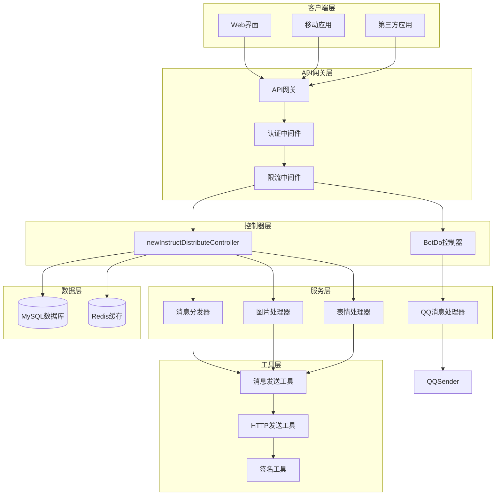
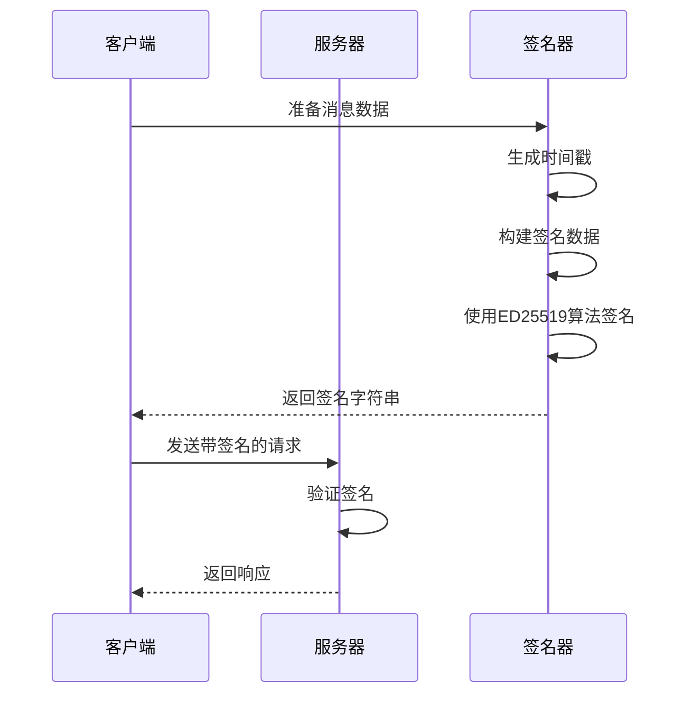
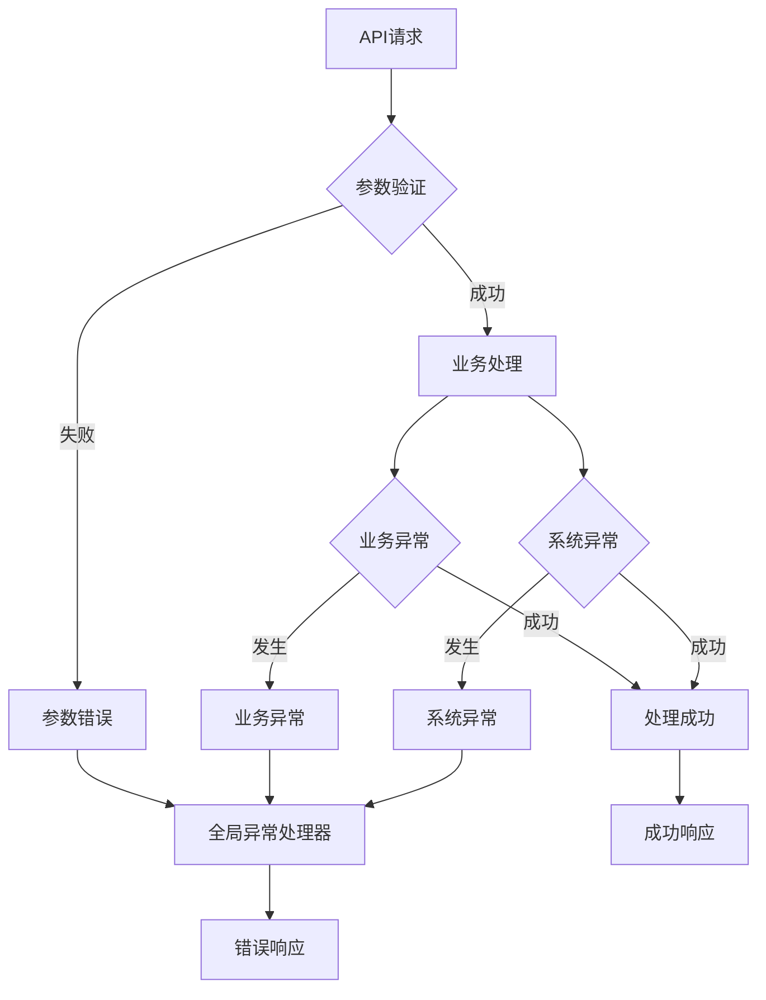

# API文档

<cite>
**本文档中引用的文件**
- [newInstructDistributeController.java](file://Boot/src/main/java/com/bot/boot/controller/newInstructDistributeController.java)
- [SendMsgDTO.java](file://Common/src/main/java/com/bot/common/dto/SendMsgDTO.java)
- [WeChatResp.java](file://Base/src/main/java/com/bot/base/dto/WeChatResp.java)
- [WeChatRespData.java](file://Base/src/main/java/com/bot/base/dto/WeChatRespData.java)
- [QQGroupMessage.java](file://Common/src/main/java/com/bot/common/dto/qqsender/QQGroupMessage.java)
- [BotDo.java](file://Boot/src/main/java/com/bot/boot/controller/BotDo.java)
- [GlobalExceptionHandler.java](file://Boot/src/main/java/com/bot/boot/aspect/GlobalExceptionHandler.java)
- [HttpSenderUtil.java](file://Common/src/main/java/com/bot/common/util/HttpSenderUtil.java)
- [SignatureED25519.java](file://Common/src/main/java/com/bot/common/util/SignatureED25519.java)
- [ENRespType.java](file://Common/src/main/java/com/bot/common/enums/ENRespType.java)
- [application.properties](file://Boot/src/main/resources/application.properties)
- [SendMsgUtil.java](file://Common/src/main/java/com/bot/common/util/SendMsgUtil.java)
- [QQSender.java](file://Common/src/main/java/com/bot/common/util/QQSender.java)
</cite>

## 目录
1. [简介](#简介)
2. [项目架构概览](#项目架构概览)
3. [核心API接口](#核心api接口)
4. [数据传输对象(DTO)](#数据传输对象dto)
5. [认证机制](#认证机制)
6. [错误处理策略](#错误处理策略)
7. [版本控制](#版本控制)
8. [客户端调用示例](#客户端调用示例)
9. [最佳实践](#最佳实践)
10. [故障排除指南](#故障排除指南)

## 简介

Bot项目是一个基于Spring MVC框架构建的智能聊天机器人系统，提供了完整的RESTful API接口用于消息处理和业务逻辑交互。该系统支持多种消息类型处理，包括文本、图片、音频、视频和文件，并具备完善的异步响应处理机制。

### 主要特性
- 基于Spring MVC的RESTful API设计
- 多平台消息处理支持（微信、QQ）
- 完整的消息类型支持
- 异步响应处理机制
- 统一的错误处理策略
- ED25519签名认证机制

## 项目架构概览



**图表来源**
- [newInstructDistributeController.java](file://Boot/src/main/java/com/bot/boot/controller/newInstructDistributeController.java#L43-L255)
- [SendMsgUtil.java](file://Common/src/main/java/com/bot/common/util/SendMsgUtil.java#L35-L152)

## 核心API接口

### 消息监听接口

#### 微信消息监听
**端点**: `POST /newInstruct/chatListener`

**功能**: 接收来自微信平台的各种消息类型并进行处理

**请求参数**:
```json
{
  "messageType": "字符串",
  "data": {
    "fromUser": "用户ID",
    "content": "消息内容",
    "msgId": "消息ID",
    "fromGroup": "群组ID（群聊时）",
    "length": "表情长度（表情消息时）",
    "md5": "MD5值（表情消息时）",
    "url": "邀请链接（邀请消息时）"
  }
}
```

**响应**: 无返回值，异步处理消息

**支持的消息类型**:
- 私聊文字消息 (`60001`)
- 群聊文字消息 (`80001`)
- 私聊图片消息 (`60002`)
- 群聊图片消息 (`80002`)
- 私聊表情消息 (`60006`)
- 群聊表情消息 (`80006`)
- 私聊邀请消息 (`60022`)
- 群聊入群消息 (`85008`, `85009`)

#### QQ消息处理
**端点**: `POST /newInstruct/QQ/event`

**功能**: 处理来自QQ平台的消息事件

**请求参数**: 
```json
{
  "d": {
    "event_ts": "事件时间戳",
    "plain_token": "明文令牌"
  },
  "op": "操作码"
}
```

**响应**: 返回签名后的响应数据

### 配置管理接口

#### 重载配置
**端点**: `POST /newInstruct/reloadConfig`

**功能**: 重新加载系统配置和消息ID缓存

**请求**: 无参数

**响应**: 无返回值

#### 获取历史记录
**端点**: `GET /newInstruct/getShows`

**功能**: 获取展示历史记录

**请求参数**:
- `queryId`: 查询ID

**响应**:
```json
{
  "queryId": "查询ID",
  "shows": [
    {
      "id": "历史记录ID",
      "content": "历史内容",
      "createTime": "创建时间"
    }
  ]
}
```

**节来源**
- [newInstructDistributeController.java](file://Boot/src/main/java/com/bot/boot/controller/newInstructDistributeController.java#L72-L255)

## 数据传输对象(DTO)

### SendMsgDTO - 消息发送数据传输对象

**用途**: 用于封装发送消息所需的所有参数

**字段定义**:
| 字段名 | 类型 | 必填 | 描述 |
|--------|------|------|------|
| wId | String | 是 | 发送者ID |
| wcId | String | 是 | 接收者ID |
| content | String | 否 | 文本内容 |
| path | String | 否 | 文件路径 |
| fileName | String | 否 | 文件名称 |
| thumbPath | String | 否 | 缩略图路径 |

**使用场景**:
- 发送文本消息
- 发送图片消息  
- 发送视频消息
- 发送文件消息
- 发送语音消息

### WeChatResp - 微信响应数据

**用途**: 封装微信平台的响应数据结构

**字段定义**:
| 字段名 | 类型 | 描述 |
|--------|------|------|
| to_user | String | 目标用户ID |
| data | WeChatRespData[] | 响应数据数组 |

### WeChatRespData - 微信响应数据详情

**用途**: 包含具体的响应内容和媒体信息

**字段定义**:
| 字段名 | 类型 | 描述 |
|--------|------|------|
| at_someone | String | 被@的用户 |
| cl | Integer | 内容长度 |
| msg | String | 响应消息 |
| img_abspath | String | 图片绝对路径 |
| file_abspath | String | 文件绝对路径 |

### QQGroupMessage - QQ群消息

**用途**: QQ平台群聊消息的数据结构

**字段定义**:
| 字段名 | 类型 | 描述 |
|--------|------|------|
| author | QQAuthor | 消息作者信息 |
| content | String | 消息内容 |
| group_openid | String | 群组OpenID |
| id | String | 消息ID |
| timestamp | String | 时间戳 |

**节来源**
- [SendMsgDTO.java](file://Common/src/main/java/com/bot/common/dto/SendMsgDTO.java#L1-L23)
- [WeChatResp.java](file://Base/src/main/java/com/bot/base/dto/WeChatResp.java#L1-L21)
- [WeChatRespData.java](file://Base/src/main/java/com/bot/base/dto/WeChatRespData.java#L1-L23)
- [QQGroupMessage.java](file://Common/src/main/java/com/bot/common/dto/qqsender/QQGroupMessage.java#L1-L21)

## 认证机制

### ED25519签名认证

Bot系统采用ED25519椭圆曲线数字签名算法确保API调用的安全性。

#### 签名流程



**图表来源**
- [SignatureED25519.java](file://Common/src/main/java/com/bot/common/util/SignatureED25519.java#L31-L36)

#### 签名算法实现

**签名生成步骤**:
1. 获取种子密钥并转换为字节数组
2. 生成私钥和公钥对
3. 构建待签名数据（时间戳 + 消息内容）
4. 使用ED25519算法进行签名
5. 将签名结果转换为十六进制字符串

**验证流程**:
1. 提取请求中的签名数据
2. 重新计算待签名数据
3. 使用公钥验证签名有效性
4. 确认请求来源合法性

### API密钥认证

对于某些内部API调用，系统使用基于密钥的认证机制：

**认证头部**:
```
Authorization: Bearer {access_token}
```

**节来源**
- [SignatureED25519.java](file://Common/src/main/java/com/bot/common/util/SignatureED25519.java#L1-L65)

## 错误处理策略

### 异常处理架构



**图表来源**
- [GlobalExceptionHandler.java](file://Boot/src/main/java/com/bot/boot/aspect/GlobalExceptionHandler.java#L21-L24)

### 错误响应格式

系统采用统一的错误响应格式：

**标准错误响应**:
```json
{
  "code": "错误码",
  "message": "错误描述",
  "timestamp": "时间戳",
  "details": "详细信息（可选）"
}
```

**常见错误码**:
- `1111`: 系统异常
- `400`: 请求参数错误
- `401`: 认证失败
- `403`: 权限不足
- `404`: 资源不存在
- `500`: 服务器内部错误

### 异步错误处理

对于异步处理的操作，系统提供以下错误处理机制：

1. **任务队列监控**: 监控异步任务执行状态
2. **重试机制**: 对失败的任务进行指数退避重试
3. **死信队列**: 处理无法成功重试的任务
4. **告警通知**: 发送失败时通知管理员

**节来源**
- [GlobalExceptionHandler.java](file://Boot/src/main/java/com/bot/boot/aspect/GlobalExceptionHandler.java#L1-L27)

## 版本控制

### API版本策略

Bot系统采用URL路径版本控制策略：

**版本号格式**: `/v{major}.{minor}`

**当前版本**: `/v1`

**版本兼容性**:
- 向后兼容：新版本保持旧版本API的兼容性
- 渐进式废弃：通过注解标记废弃的API
- 版本迁移指南：提供详细的版本升级指导

### 内容协商

系统支持多种响应格式：

**支持的媒体类型**:
- `application/json`: JSON格式响应（默认）
- `application/xml`: XML格式响应
- `text/plain`: 纯文本响应

**请求格式协商**:
```http
Accept: application/json
Content-Type: application/json
```

### 特性标志

系统通过特性标志控制API行为：

**启用的特性**:
- 消息去重机制
- 异步处理支持
- 多平台消息路由
- 实时状态更新

## 客户端调用示例

### Java客户端示例

```java
// 创建HTTP客户端
CloseableHttpClient httpClient = HttpClients.createDefault();

// 构建请求
HttpPost post = new HttpPost("http://localhost:9091/bot/newInstruct/chatListener");
post.setHeader("Content-Type", "application/json");

// 构建请求体
JSONObject requestBody = new JSONObject();
requestBody.put("messageType", "60001");
JSONObject data = new JSONObject();
data.put("fromUser", "user123");
data.put("content", "你好，小林");
data.put("msgId", 123456L);
requestBody.put("data", data);

// 设置请求体
StringEntity entity = new StringEntity(requestBody.toString(), "UTF-8");
post.setEntity(entity);

// 执行请求
CloseableHttpResponse response = httpClient.execute(post);
try {
    // 处理响应
    if (response.getStatusLine().getStatusCode() == 200) {
        // 成功处理
        System.out.println("消息处理成功");
    }
} finally {
    response.close();
}
```

### JavaScript客户端示例

```javascript
// 发送消息监听请求
async function sendMessage(messageData) {
    try {
        const response = await fetch('http://localhost:9091/bot/newInstruct/chatListener', {
            method: 'POST',
            headers: {
                'Content-Type': 'application/json'
            },
            body: JSON.stringify(messageData)
        });
        
        if (!response.ok) {
            throw new Error(`HTTP error! status: ${response.status}`);
        }
        
        console.log('消息发送成功');
        return response.json();
    } catch (error) {
        console.error('发送消息失败:', error);
        throw error;
    }
}

// 使用示例
const message = {
    messageType: "60001",
    data: {
        fromUser: "user123",
        content: "你好，小林",
        msgId: 123456
    }
};

sendMessage(message)
    .then(response => console.log('响应:', response))
    .catch(error => console.error('错误:', error));
```

### Python客户端示例

```python
import requests
import json
import time
from datetime import datetime

class BotAPIClient:
    def __init__(self, base_url):
        self.base_url = base_url
        self.session = requests.Session()
        self.session.headers.update({
            'Content-Type': 'application/json',
            'User-Agent': 'BotClient/1.0'
        })
    
    def send_message(self, message_type, from_user, content, msg_id=None, from_group=None):
        """发送消息到Bot系统"""
        data = {
            "messageType": str(message_type),
            "data": {
                "fromUser": from_user,
                "content": content
            }
        }
        
        if msg_id:
            data["data"]["msgId"] = msg_id
        
        if from_group:
            data["data"]["fromGroup"] = from_group
        
        try:
            response = self.session.post(
                f"{self.base_url}/newInstruct/chatListener",
                data=json.dumps(data, ensure_ascii=False),
                timeout=30
            )
            
            response.raise_for_status()
            print(f"消息发送成功，时间: {datetime.now()}")
            return True
            
        except requests.exceptions.RequestException as e:
            print(f"发送消息失败: {e}")
            return False
    
    def reload_config(self):
        """重载系统配置"""
        try:
            response = self.session.post(
                f"{self.base_url}/newInstruct/reloadConfig"
            )
            response.raise_for_status()
            print("配置重载成功")
            return True
        except requests.exceptions.RequestException as e:
            print(f"重载配置失败: {e}")
            return False

# 使用示例
if __name__ == "__main__":
    client = BotAPIClient("http://localhost:9091/bot")
    
    # 发送测试消息
    success = client.send_message(
        message_type=60001,
        from_user="test_user",
        content="你好，小林",
        msg_id=int(time.time())
    )
    
    # 重载配置
    client.reload_config()
```

### cURL命令示例

```bash
#!/bin/bash

BASE_URL="http://localhost:9091/bot"
CONTENT_TYPE="application/json"

# 发送文本消息
curl -X POST "$BASE_URL/newInstruct/chatListener" \
  -H "Content-Type: $CONTENT_TYPE" \
  -d '{
    "messageType": "60001",
    "data": {
      "fromUser": "user123",
      "content": "你好，小林",
      "msgId": '"$(date +%s)"'
    }
  }'

# 重载配置
curl -X POST "$BASE_URL/newInstruct/reloadConfig"

# 获取历史记录
curl -X GET "$BASE_URL/newInstruct/getShows?queryId=test123"
```

## 最佳实践

### 请求优化建议

1. **批量处理**: 对于大量相似请求，考虑使用批量处理机制
2. **连接复用**: 使用HTTP连接池减少连接开销
3. **超时设置**: 合理设置请求超时时间（建议30秒）
4. **重试策略**: 实现指数退避重试机制

### 性能优化

1. **异步处理**: 对于耗时操作，使用异步处理避免阻塞
2. **缓存策略**: 合理使用缓存减少重复计算
3. **资源池化**: 使用连接池管理数据库和HTTP连接
4. **监控指标**: 监控API响应时间和成功率

### 安全建议

1. **输入验证**: 严格验证所有输入参数
2. **速率限制**: 实施API访问频率限制
3. **日志记录**: 记录所有API调用以便审计
4. **错误信息**: 避免在错误响应中泄露敏感信息

### 错误处理最佳实践

```java
// 推荐的错误处理模式
public ApiResponse handleApiCall(Supplier<ApiResponse> apiCall) {
    try {
        return apiCall.get();
    } catch (ValidationException e) {
        log.warn("参数验证失败: {}", e.getMessage());
        return ApiResponse.error("INVALID_INPUT", e.getMessage());
    } catch (BusinessException e) {
        log.error("业务逻辑错误: {}", e.getMessage(), e);
        return ApiResponse.error("BUSINESS_ERROR", e.getMessage());
    } catch (Exception e) {
        log.error("系统异常: {}", e.getMessage(), e);
        return ApiResponse.error("SYSTEM_ERROR", "系统暂时不可用，请稍后重试");
    }
}
```

### 异步响应处理

对于长时间运行的操作，建议采用异步处理模式：

```java
// 异步处理示例
@PostMapping("/processLongTask")
public CompletableFuture<ApiResponse> processLongTask(@RequestBody TaskRequest request) {
    return CompletableFuture.supplyAsync(() -> {
        try {
            // 执行耗时操作
            String result = longRunningOperation(request);
            return ApiResponse.success(result);
        } catch (Exception e) {
            log.error("异步任务失败: {}", e.getMessage(), e);
            return ApiResponse.error("PROCESS_FAILED", e.getMessage());
        }
    }, executorService);
}
```

## 故障排除指南

### 常见问题及解决方案

#### 1. 认证失败

**症状**: 收到401未授权错误

**可能原因**:
- 签名算法错误
- 时间戳过期
- 密钥配置错误

**解决方案**:
```java
// 检查签名生成是否正确
String message = event.getD().getEvent_ts() + event.getD().getPlain_token();
byte[] messageBytes = message.getBytes(StandardCharsets.UTF_8);
String signature = SignatureED25519.sign(clientSecret, messageBytes);
```

#### 2. 请求超时

**症状**: 请求超过设定时间未响应

**可能原因**:
- 网络连接问题
- 服务器负载过高
- 数据库连接池耗尽

**解决方案**:
- 增加超时时间设置
- 实施请求重试机制
- 监控系统资源使用情况

#### 3. 消息重复处理

**症状**: 同一条消息被多次处理

**可能原因**:
- 消息ID重复
- 网络重发机制
- 并发处理问题

**解决方案**:
```java
// 消息去重机制
private static List<Long> msgIdList = new ArrayList<>();

public void handleMessage(Long msgId) {
    if (msgIdList.contains(msgId)) {
        log.info("重复消息，忽略处理: {}", msgId);
        return;
    }
    msgIdList.add(msgId);
    // 处理消息逻辑
}
```

#### 4. 响应格式错误

**症状**: 响应数据格式不符合预期

**可能原因**:
- DTO映射错误
- 序列化配置问题
- 数据类型不匹配

**解决方案**:
- 验证DTO字段映射
- 检查JSON序列化配置
- 添加数据验证逻辑

### 监控和调试

#### 日志配置

系统提供详细的日志记录功能：

```properties
# 日志级别配置
logback.level=INFO
logback.rootPath=/var/log/bot
logback.charset=UTF-8
logback.pattern=%d{HH:mm:ss.SSS} [%thread] %-5level %logger-%line -- %msg --%n
```

#### 性能监控指标

**关键指标**:
- API响应时间
- 请求成功率
- 错误率分布
- 资源使用率

**监控配置**:
```java
@Component
public class ApiMetrics {
    private final MeterRegistry meterRegistry;
    
    @EventListener
    public void handleApiCall(ApiCallEvent event) {
        Timer.Sample sample = Timer.start(meterRegistry);
        // 记录API调用指标
        sample.stop(Timer.builder("api.call.duration")
            .tag("endpoint", event.getEndpoint())
            .register(meterRegistry));
    }
}
```

### 故障恢复

#### 自动恢复机制

1. **健康检查**: 定期检查系统组件状态
2. **故障转移**: 主服务不可用时切换到备用服务
3. **数据备份**: 定期备份重要数据
4. **回滚机制**: 快速回滚到稳定版本

#### 手动恢复步骤

1. **检查服务状态**: 确认各服务组件正常运行
2. **重启异常服务**: 重启出现问题的服务实例
3. **清理缓存**: 清理可能导致问题的缓存数据
4. **验证功能**: 测试核心API功能是否恢复正常

**节来源**
- [HttpSenderUtil.java](file://Common/src/main/java/com/bot/common/util/HttpSenderUtil.java#L1-L200)
- [SendMsgUtil.java](file://Common/src/main/java/com/bot/common/util/SendMsgUtil.java#L35-L152)
- [QQSender.java](file://Common/src/main/java/com/bot/common/util/QQSender.java#L1-L103)