# 基础API文档

<cite>
**本文档引用的文件**
- [BotDo.java](file://Boot/src/main/java/com/bot/boot/controller/BotDo.java)
- [SendMsgDTO.java](file://Common/src/main/java/com/bot/common/dto/SendMsgDTO.java)
- [WeChatResp.java](file://Base/src/main/java/com/bot/base/dto/WeChatResp.java)
- [WeChatRespData.java](file://Base/src/main/java/com/bot/base/dto/WeChatRespData.java)
- [newInstructDistributeController.java](file://Boot/src/main/java/com/bot/boot/controller/newInstructDistributeController.java)
- [SendMsgUtil.java](file://Common/src/main/java/com/bot/common/util/SendMsgUtil.java)
- [ENRespType.java](file://Common/src/main/java/com/bot/common/enums/ENRespType.java)
- [Distributor.java](file://Base/src/main/java/com/bot/base/service/Distributor.java)
- [BaseConsts.java](file://Common/src/main/java/com/bot/common/constant/BaseConsts.java)
- [SystemConfigCache.java](file://Common/src/main/java/com/bot/common/config/SystemConfigCache.java)
</cite>

## 目录
1. [简介](#简介)
2. [项目架构概览](#项目架构概览)
3. [核心数据结构](#核心数据结构)
4. [消息处理接口](#消息处理接口)
5. [事件驱动机制](#事件驱动机制)
6. [消息发送功能](#消息发送功能)
7. [消息类型处理](#消息类型处理)
8. [错误处理与异常](#错误处理与异常)
9. [使用示例](#使用示例)
10. [最佳实践](#最佳实践)

## 简介

Bot项目是一个基于Java的企业级聊天机器人平台，提供了完整的消息处理和事件分发机制。该系统采用模块化设计，支持多种消息类型（文本、图片、视频、文件、语音），并通过事件驱动的方式处理各种消息事件。

本文档详细介绍了Bot项目的核心API接口，包括消息事件处理、数据结构定义、消息发送机制以及错误处理策略，为开发者提供全面的技术参考。

## 项目架构概览

Bot项目采用分层架构设计，主要包含以下核心模块：


**图表来源**
- [newInstructDistributeController.java](file://Boot/src/main/java/com/bot/boot/controller/newInstructDistributeController.java#L43-L255)
- [Distributor.java](file://Base/src/main/java/com/bot/base/service/Distributor.java#L12-L36)
- [SendMsgUtil.java](file://Common/src/main/java/com/bot/common/util/SendMsgUtil.java#L18-L274)

## 核心数据结构

### BotEvent和BotToken数据结构

BotEvent和BotToken是消息事件处理的核心数据结构，定义了事件的基本信息和令牌验证机制。


**图表来源**
- [BotDo.java](file://Boot/src/main/java/com/bot/boot/controller/BotDo.java#L7-L16)

#### BotEvent字段说明

| 字段 | 类型 | 描述 | 必填 |
|------|------|------|------|
| d | BotToken | 包含事件令牌信息的对象 | 是 |
| op | int | 操作类型标识符 | 是 |

#### BotToken字段说明

| 字段 | 类型 | 描述 | 必填 |
|------|------|------|------|
| plain_token | String | 原始令牌字符串 | 是 |
| event_ts | String | 事件时间戳 | 是 |

**章节来源**
- [BotDo.java](file://Boot/src/main/java/com/bot/boot/controller/BotDo.java#L7-L16)

### WeChatResp和WeChatRespData响应结构

WeChatResp和WeChatRespData定义了消息响应的标准格式，支持多种消息类型的返回。


**图表来源**
- [WeChatResp.java](file://Base/src/main/java/com/bot/base/dto/WeChatResp.java#L15-L20)
- [WeChatRespData.java](file://Base/src/main/java/com/bot/base/dto/WeChatRespData.java#L15-L21)

#### WeChatResp字段说明

| 字段 | 类型 | 描述 | 必填 |
|------|------|------|------|
| to_user | String | 目标用户标识 | 是 |
| data | WeChatRespData[] | 响应数据数组 | 是 |

#### WeChatRespData字段说明

| 字段 | 类型 | 描述 | 必填 |
|------|------|------|------|
| at_someone | String | 被@的用户 | 否 |
| cl | Integer | 消息分类 | 否 |
| msg | String | 消息内容 | 否 |
| img_abspath | String | 图片绝对路径 | 否 |
| file_abspath | String | 文件绝对路径 | 否 |

**章节来源**
- [WeChatResp.java](file://Base/src/main/java/com/bot/base/dto/WeChatResp.java#L15-L20)
- [WeChatRespData.java](file://Base/src/main/java/com/bot/base/dto/WeChatRespData.java#L15-L21)

### SendMsgDTO发送消息数据结构

SendMsgDTO定义了发送消息所需的所有字段，支持多种消息类型的发送。


**图表来源**
- [SendMsgDTO.java](file://Common/src/main/java/com/bot/common/dto/SendMsgDTO.java#L8-L22)

#### SendMsgDTO字段说明

| 字段 | 类型 | 描述 | 使用场景 |
|------|------|------|----------|
| wId | String | 平台唯一标识 | 所有消息发送 |
| wcId | String | 接收者标识 | 私聊和群聊 |
| content | String | 消息内容 | 文本消息 |
| path | String | 文件路径 | 图片、视频、文件 |
| fileName | String | 文件名称 | 文件上传 |
| thumbPath | String | 缩略图路径 | 视频和图片预览 |

**章节来源**
- [SendMsgDTO.java](file://Common/src/main/java/com/bot/common/dto/SendMsgDTO.java#L8-L22)

## 消息处理接口

### 核心消息处理流程

Bot项目采用事件驱动的消息处理机制，通过统一的入口处理各种消息事件。


**图表来源**
- [newInstructDistributeController.java](file://Boot/src/main/java/com/bot/boot/controller/newInstructDistributeController.java#L72-L208)
- [Distributor.java](file://Base/src/main/java/com/bot/base/service/Distributor.java#L12-L36)

### 消息类型识别机制

系统通过messageType字段识别不同类型的消息事件：

| 消息类型 | 数值 | 描述 | 处理方式 |
|----------|------|------|----------|
| 60001 | 私聊文字 | 用户发送的文字消息 | 调用私聊处理器 |
| 80001 | 群聊文字 | 群组中的文字消息 | 调用群聊处理器 |
| 60002 | 私聊图片 | 用户发送的图片消息 | 调用图片处理服务 |
| 80002 | 群聊图片 | 群组中的图片消息 | 调用图片处理服务 |
| 60006 | 私聊表情 | 用户发送的表情消息 | 调用表情处理服务 |
| 80006 | 群聊表情 | 群组中的表情消息 | 调用表情处理服务 |
| 60022 | 私聊邀请 | 用户发送的群聊邀请 | 自动接受邀请 |
| 85008/85009 | 进群通知 | 新成员加入群聊 | 发送欢迎消息 |

**章节来源**
- [newInstructDistributeController.java](file://Boot/src/main/java/com/bot/boot/controller/newInstructDistributeController.java#L74-L208)

## 事件驱动机制

### 消息事件分发流程

Bot项目实现了完整的事件驱动架构，通过op字段区分不同类型的事件处理逻辑。

```mermaid
flowchart TD
Start([接收消息]) --> ParseMsg["解析消息结构"]
ParseMsg --> CheckMsgId{"检查消息ID<br/>是否重复"}
CheckMsgId --> |重复| Return([返回])
CheckMsgId --> |不重复| AddMsgId["添加消息ID到缓存"]
AddMsgId --> CheckType{"检查消息类型"}
CheckType --> |60001| PrivateText["私聊文字处理"]
CheckType --> |80001| GroupText["群聊文字处理"]
CheckType --> |60002| PrivateImg["私聊图片处理"]
CheckType --> |80002| GroupImg["群聊图片处理"]
CheckType --> |60006| PrivateEmoji["私聊表情处理"]
CheckType --> |80006| GroupEmoji["群聊表情处理"]
CheckType --> |60022| Invite["邀请处理"]
CheckType --> |85008/85009| Welcome["欢迎处理"]
CheckType --> |其他| Return
PrivateText --> ProcessPrivate["调用Distributor处理"]
GroupText --> ProcessGroup["调用Distributor处理"]
PrivateImg --> ProcessPicture["调用PictureDistributor处理"]
GroupImg --> ProcessPicture
PrivateEmoji --> ProcessEmoji["调用EmojiDistributor处理"]
GroupEmoji --> ProcessEmoji
Invite --> AcceptInvite["自动接受邀请"]
Welcome --> SendWelcome["发送欢迎消息"]
ProcessPrivate --> CheckResp{"检查响应类型"}
ProcessGroup --> CheckResp
CheckResp --> |文本| SendText["发送文本消息"]
CheckResp --> |图片| SendImg["发送图片消息"]
CheckResp --> |视频| SendVideo["发送视频消息"]
CheckResp --> |文件| SendFile["发送文件消息"]
CheckResp --> |语音| SendAudio["发送语音消息"]
SendText --> End([处理完成])
SendImg --> End
SendVideo --> End
SendFile --> End
SendAudio --> End
AcceptInvite --> End
SendWelcome --> End
Return --> End
```



**图表来源**
- [newInstructDistributeController.java](file://Boot/src/main/java/com/bot/boot/controller/newInstructDistributeController.java#L72-L208)

### 消息去重机制

系统实现了基于消息ID的消息去重机制，防止重复处理相同的消息：


**图表来源**
- [newInstructDistributeController.java](file://Boot/src/main/java/com/bot/boot/controller/newInstructDistributeController.java#L70-L94)

**章节来源**
- [newInstructDistributeController.java](file://Boot/src/main/java/com/bot/boot/controller/newInstructDistributeController.java#L72-L208)

## 消息发送功能

### SendMsgUtil工具类

SendMsgUtil提供了完整的消息发送功能，支持多种消息类型的发送。


**图表来源**
- [SendMsgUtil.java](file://Common/src/main/java/com/bot/common/util/SendMsgUtil.java#L27-L274)
- [SystemConfigCache.java](file://Common/src/main/java/com/bot/common/config/SystemConfigCache.java#L13-L50)

### 消息发送方法详解

#### 文本消息发送

文本消息是最基本的消息类型，适用于普通的聊天对话。

**使用场景**：
- 日常聊天回复
- 系统提示信息
- 命令执行结果

**实现特点**：
- 支持私聊和群聊
- 自动处理@用户功能
- 异步发送机制

#### 图片消息发送

图片消息支持本地图片和网络图片的发送。

**使用场景**：
- 表情包分享
- 截图展示
- 图文混排

**实现特点**：
- 支持多种图片格式
- 自动压缩优化
- 异步加载机制

#### 视频消息发送

视频消息支持本地视频和在线视频的发送。

**使用场景**：
- 教程演示
- 动态展示
- 娱乐内容分享

**实现特点**：
- 支持缩略图显示
- 异步转码处理
- 大文件分块传输

#### 文件消息发送

文件消息支持各种类型文件的发送和下载。

**使用场景**：
- 文档共享
- 数据导出
- 资源下载

**实现特点**：
- 支持大文件上传
- 自动文件类型识别
- 下载链接有效期管理

#### 语音消息发送

语音消息支持音频文件的发送和播放。

**使用场景**：
- 语音问候
- 音乐分享
- 录音回放

**实现特点**：
- 多格式音频支持
- 自动格式转换
- 时长信息显示

**章节来源**
- [SendMsgUtil.java](file://Common/src/main/java/com/bot/common/util/SendMsgUtil.java#L27-L274)

## 消息类型处理

### ENRespType枚举定义

ENRespType枚举定义了系统支持的所有消息类型，为消息处理提供了标准化的类型标识。


**图表来源**
- [ENRespType.java](file://Common/src/main/java/com/bot/common/enums/ENRespType.java#L8-L14)

### 消息类型处理流程


**图表来源**
- [newInstructDistributeController.java](file://Boot/src/main/java/com/bot/boot/controller/newInstructDistributeController.java#L101-L114)

### 特殊消息处理

#### 多重消息处理

系统支持一次性返回多个消息的情况，通过`AND_REG`分隔符进行消息分割：


**图表来源**
- [newInstructDistributeController.java](file://Boot/src/main/java/com/bot/boot/controller/newInstructDistributeController.java#L111-L117)
- [BaseConsts.java](file://Common/src/main/java/com/bot/common/constant/BaseConsts.java#L48-L51)

**章节来源**
- [ENRespType.java](file://Common/src/main/java/com/bot/common/enums/ENRespType.java#L8-L14)
- [newInstructDistributeController.java](file://Boot/src/main/java/com/bot/boot/controller/newInstructDistributeController.java#L101-L114)

## 错误处理与异常

### 异常处理策略

Bot项目实现了多层次的异常处理机制，确保系统的稳定性和可靠性。


### 常见错误类型及处理

#### 网络连接错误

**错误表现**：HTTP请求超时、连接被拒绝、DNS解析失败

**处理策略**：
- 实现指数退避重试机制
- 设置合理的超时时间
- 提供降级服务方案

#### 消息发送失败

**错误表现**：消息发送接口返回错误、消息格式不正确

**处理策略**：
- 记录失败原因和消息内容
- 提供手动重发功能
- 实现消息队列机制

#### 权限验证失败

**错误表现**：令牌过期、权限不足、签名验证失败

**处理策略**：
- 自动刷新访问令牌
- 提供权限申请流程
- 实现分级权限控制

**章节来源**
- [newInstructDistributeController.java](file://Boot/src/main/java/com/bot/boot/controller/newInstructDistributeController.java#L106-L122)
- [SendMsgUtil.java](file://Common/src/main/java/com/bot/common/util/SendMsgUtil.java#L28-L36)

## 使用示例

### 基础消息发送示例

以下展示了如何使用SendMsgUtil发送不同类型的消息：

#### 文本消息发送

```java
// 发送普通文本消息
SendMsgUtil.sendMsg("user123", "你好，我是小林Bot");

// 发送群聊消息（带@功能）
SendMsgUtil.sendGroupMsg("group456", "大家好", "user123");
```

#### 图片消息发送

```java
// 发送本地图片
SendMsgUtil.sendImg("user123", "https://example.com/image.jpg");

// 发送群聊图片
SendMsgUtil.sendGroupMsg("group456", "这是张图片", "user123");
```

#### 视频消息发送

```java
// 发送视频消息
SendMsgUtil.sendVideo("user123", "https://example.com/video.mp4");
```

#### 文件消息发送

```java
// 发送文件消息
SendMsgUtil.sendFile("user123", "https://example.com/document.pdf");
```

### 消息事件处理示例

以下展示了如何处理不同类型的消息事件：

#### 私聊文字消息处理

```java
// 在控制器中处理私聊文字消息
@PostMapping("/chatListener")
public void handlePrivateMessage(@RequestBody JSONObject message) {
    String messageType = String.valueOf(message.get("messageType"));
    if ("60001".equals(messageType)) {
        JSONObject data = (JSONObject) message.get("data");
        String userId = (String) data.get("fromUser");
        String content = (String) data.get("content");
        
        // 处理消息逻辑
        CommonResp response = distributor.doDistributeWithString(
            content.trim(), userId, null, false, true, "wx", content.trim()
        );
        
        // 根据响应类型发送消息
        if (response != null) {
            switch (ENRespType.fromType(response.getType())) {
                case TEXT:
                    SendMsgUtil.sendMsg(userId, response.getMsg());
                    break;
                case IMG:
                    SendMsgUtil.sendImg(userId, response.getMsg());
                    break;
                case VIDEO:
                    SendMsgUtil.sendMsg(userId, "视频处理中，请稍候...");
                    ThreadPoolManager.addBaseTask(() -> 
                        SendMsgUtil.sendVideo(userId, response.getMsg())
                    );
                    break;
                // 其他类型...
            }
        }
    }
}
```

#### 群聊消息处理

```java
// 处理群聊消息
if ("80001".equals(messageType)) {
    JSONObject data = (JSONObject) message.get("data");
    String groupId = (String) data.get("fromGroup");
    String content = (String) data.get("content");
    
    // 检查是否@机器人
    boolean at = content.contains("@小林Bot");
    String processedContent = content.replace("@小林Bot", "").trim();
    
    // 处理群聊消息
    CommonResp response = distributor.doDistributeWithString(
        processedContent, userId, groupId, at, at, "wx", processedContent
    );
    
    // 发送群聊响应
    if (response != null) {
        SendMsgUtil.sendGroupMsg(groupId, response.getMsg(), userId);
    }
}
```

### 错误处理示例

```java
// 带错误处理的消息发送
public void safeSendMessage(String userId, String message) {
    try {
        SendMsgUtil.sendMsg(userId, message);
        log.info("消息发送成功: userId={}, message={}", userId, message);
    } catch (Exception e) {
        log.error("消息发送失败: userId={}, message={}", userId, message, e);
        
        // 错误恢复策略
        if (e instanceof java.net.SocketTimeoutException) {
            // 网络超时，延迟重试
            Thread.sleep(1000);
            SendMsgUtil.sendMsg(userId, message);
        } else if (e instanceof org.springframework.web.client.HttpClientErrorException) {
            // HTTP错误，检查请求参数
            log.warn("HTTP错误: {}", e.getMessage());
        }
    }
}
```

## 最佳实践

### 性能优化建议

#### 消息发送优化

1. **批量发送**：对于需要发送多条消息的场景，使用`AND_REG`分隔符实现批量发送
2. **异步处理**：大文件、视频等资源的发送采用异步处理机制
3. **缓存机制**：对频繁使用的图片、文件等资源建立本地缓存

#### 内存管理

1. **消息ID缓存**：合理设置消息ID缓存大小，避免内存溢出
2. **资源释放**：及时释放大文件、图片等资源占用的内存
3. **连接池管理**：使用连接池管理HTTP连接，提高并发性能

### 安全考虑

#### 令牌安全

1. **令牌轮换**：定期更新访问令牌，防止长期使用导致的安全风险
2. **权限控制**：实现细粒度的权限控制，限制不同用户的操作范围
3. **签名验证**：对所有外部请求进行签名验证，防止伪造请求

#### 输入验证

1. **消息长度限制**：对输入消息长度进行限制，防止恶意攻击
2. **特殊字符过滤**：过滤可能引起安全问题的特殊字符
3. **URL验证**：对图片、文件等URL进行有效性验证

### 监控和日志

#### 关键指标监控

1. **消息处理吞吐量**：监控每秒处理的消息数量
2. **响应时间**：监控消息处理的平均响应时间
3. **错误率**：监控各类错误的发生频率
4. **资源使用率**：监控CPU、内存、网络等资源使用情况

#### 日志记录规范

1. **结构化日志**：使用JSON格式记录关键操作和错误信息
2. **敏感信息脱敏**：对用户名、密码等敏感信息进行脱敏处理
3. **日志级别**：合理设置不同级别的日志输出
4. **日志轮转**：实现日志文件的自动轮转和清理

### 可扩展性设计

#### 模块化架构

1. **插件机制**：支持通过插件形式扩展新的消息处理功能
2. **配置驱动**：通过配置文件控制消息处理逻辑，无需修改代码
3. **接口抽象**：定义清晰的接口规范，便于第三方集成

#### 高可用设计

1. **负载均衡**：支持多实例部署，实现负载均衡
2. **故障转移**：实现自动故障检测和转移机制
3. **数据备份**：定期备份重要数据，确保数据安全

通过遵循这些最佳实践，可以构建一个高性能、高可靠性的聊天机器人系统，为用户提供优质的交互体验。