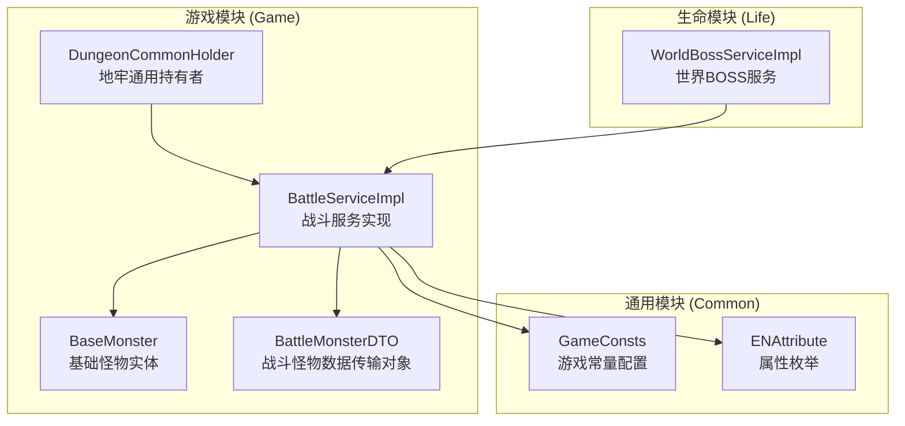
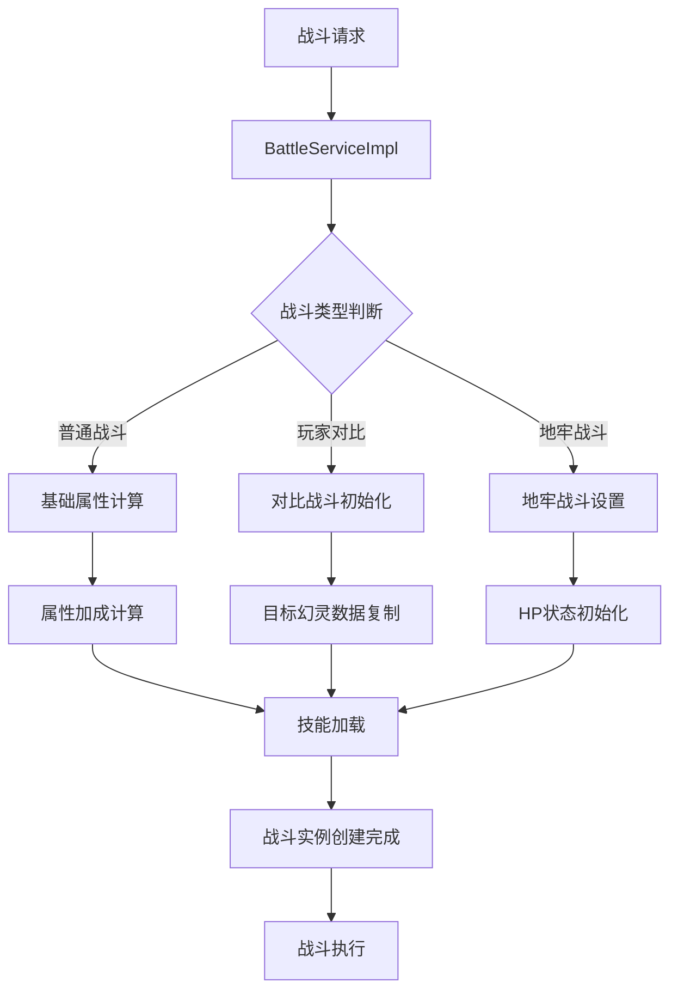
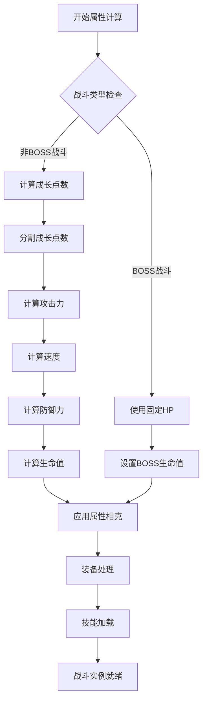
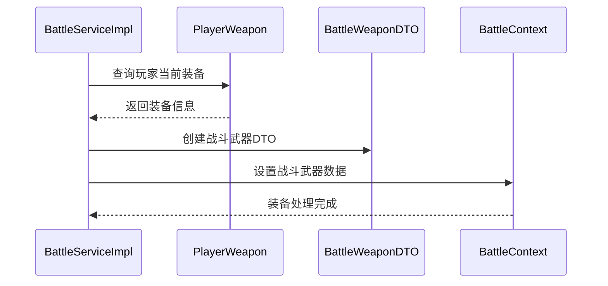
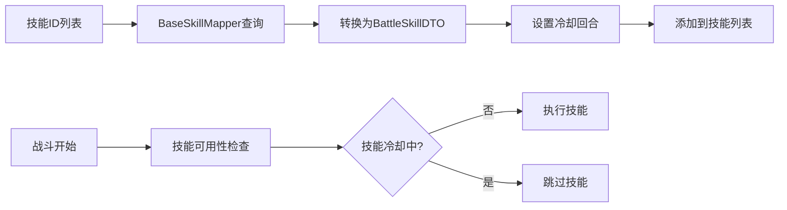
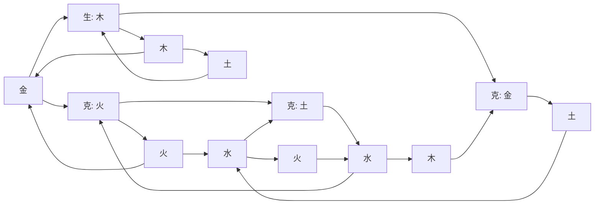
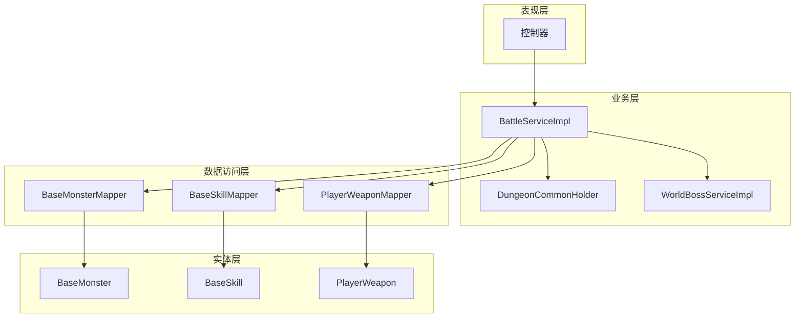

# 战斗初始化API文档

<cite>
**本文档中引用的文件**
- [BattleServiceImpl.java](file://Game/src/main/java/com/robot/game/service/impl/BattleServiceImpl.java)
- [BaseMonster.java](file://Game/src/main/java/com/robot/game/dao/entity/BaseMonster.java)
- [BattleMonsterDTO.java](file://Game/src/main/java/com/robot/game/dto/BattleMonsterDTO.java)
- [BattlePhantomDTO.java](file://Game/src/main/java/com/robot/game/dto/BattlePhantomDTO.java)
- [BattleWeaponDTO.java](file://Game/src/main/java/com/robot/game/dto/BattleWeaponDTO.java)
- [BattleSkillDTO.java](file://Game/src/main/java/com/robot/game/dto/BattleSkillDTO.java)
- [ENAttribute.java](file://Game/src/main/java/com/robot/game/enums/ENAttribute.java)
- [GameConsts.java](file://Common/src/main/java/com/robot/common/constant/GameConsts.java)
- [DungeonCommonHolder.java](file://Game/src/main/java/com/robot/game/service/DungeonCommonHolder.java)
- [WorldBossServiceImpl.java](file://Life/src/main/java/com/robot/life/service/impl/WorldBossServiceImpl.java)
</cite>

## 目录
1. [简介](#简介)
2. [项目结构](#项目结构)
3. [核心组件](#核心组件)
4. [架构概览](#架构概览)
5. [详细组件分析](#详细组件分析)
6. [依赖关系分析](#依赖关系分析)
7. [性能考虑](#性能考虑)
8. [故障排除指南](#故障排除指南)
9. [结论](#结论)

## 简介

战斗初始化API是游戏系统的核心模块，负责创建和管理各种战斗场景的战斗实例。该系统通过BattleServiceImpl类的三个构造函数，支持普通战斗、玩家对比战斗和地牢战斗三种主要战斗模式，为游戏提供了完整的战斗初始化和执行能力。

## 项目结构

战斗初始化系统主要分布在以下模块中：



**图表来源**
- [BattleServiceImpl.java](file://Game/src/main/java/com/robot/game/service/impl/BattleServiceImpl.java#L29-L691)
- [BaseMonster.java](file://Game/src/main/java/com/robot/game/dao/entity/BaseMonster.java#L11-L35)
- [GameConsts.java](file://Common/src/main/java/com/robot/common/constant/GameConsts.java#L187-L229)

## 核心组件

### BattleServiceImpl类

BattleServiceImpl是战斗初始化的核心服务类，继承自CommonPlayer，提供了三种不同的构造函数来适应不同的战斗场景。

#### 构造函数详解

**构造函数1：普通战斗构造函数**
```java
public BattleServiceImpl(BaseMonster baseMonster, PlayerPhantom playerPhantom, 
                         boolean isCompare, boolean isBoos, boolean isDungeon)
```
用于创建标准的战斗实例，支持比较战斗、世界BOSS战斗和地牢战斗。

**构造函数2：玩家对比构造函数**
```java
public BattleServiceImpl(PlayerPhantom targetPhantom, PlayerPhantom playerPhantom, 
                         boolean isCompare, boolean isBoos)
```
专门用于玩家之间的幻灵对比战斗，自动从目标幻灵复制基础怪物数据。

**构造函数3：地牢战斗构造函数**
```java
public BattleServiceImpl(BaseMonster baseMonster, PlayerPhantom playerPhantom, 
                         boolean isDungeon, Integer nowHp)
```
专为地牢战斗设计，允许指定怪物当前生命值。

**节来源**
- [BattleServiceImpl.java](file://Game/src/main/java/com/robot/game/service/impl/BattleServiceImpl.java#L55-L85)

### BaseMonster实体类

BaseMonster是战斗系统的基础实体类，定义了怪物的基本属性和行为特征。

#### 核心属性
- `id`: 怪物唯一标识
- `name`: 怪物名称
- `attribute`: 属性类型（金、木、水、火、土）
- `area`: 所属区域
- `attack`: 基础攻击力
- `speed`: 基础速度
- `physique`: 基础体质
- `grow`: 成长系数
- `level`: 怪物等级
- `skills`: 技能列表
- `describe`: 怪物描述

**节来源**
- [BaseMonster.java](file://Game/src/main/java/com/robot/game/dao/entity/BaseMonster.java#L11-L35)

### 数据传输对象

#### BattleMonsterDTO
BattleMonsterDTO扩展了BaseMonster，增加了战斗专用的属性：
- `finalAttack`: 最终攻击力
- `finalSpeed`: 最终速度
- `finalDefense`: 最终防御力
- `finalHp`: 最终生命值
- `hp`: 当前生命值
- `battleWeaponDTO`: 战斗武器数据

#### BattlePhantomDTO
BattlePhantomDTO用于表示参与战斗的幻灵，包含：
- `buffs`: 增益效果列表
- `deBuffs`: 减益效果列表
- `skillList`: 技能列表
- `stop`: 是否停止行动
- `battleWeaponDTO`: 武器装备

**节来源**
- [BattleMonsterDTO.java](file://Game/src/main/java/com/robot/game/dto/BattleMonsterDTO.java#L11-L27)
- [BattlePhantomDTO.java](file://Game/src/main/java/com/robot/game/dto/BattlePhantomDTO.java#L15-L37)

## 架构概览

战斗初始化系统采用分层架构设计，确保了良好的可扩展性和维护性：



**图表来源**
- [BattleServiceImpl.java](file://Game/src/main/java/com/robot/game/service/impl/BattleServiceImpl.java#L55-L85)
- [BattleServiceImpl.java](file://Game/src/main/java/com/robot/game/service/impl/BattleServiceImpl.java#L128-L175)

## 详细组件分析

### 战斗初始化流程

#### 属性计算逻辑

战斗初始化的核心在于属性计算，系统通过以下步骤进行属性计算：



**图表来源**
- [BattleServiceImpl.java](file://Game/src/main/java/com/robot/game/service/impl/BattleServiceImpl.java#L128-L175)

#### 装备处理机制

系统通过getCurrentWeapon方法获取玩家当前装备，并将其封装到BattleWeaponDTO中：



**图表来源**
- [BattleServiceImpl.java](file://Game/src/main/java/com/robot/game/service/impl/BattleServiceImpl.java#L174-L175)

#### 技能加载机制

技能系统通过BaseSkillMapper查询数据库中的技能信息，并转换为战斗专用的BattleSkillDTO：



**图表来源**
- [BattleServiceImpl.java](file://Game/src/main/java/com/robot/game/service/impl/BattleServiceImpl.java#L209-L219)

### 不同战斗场景的初始化

#### 普通战斗初始化

普通战斗是最基础的战斗类型，系统会根据怪物的成长系数和等级计算最终属性：

**节来源**
- [BattleServiceImpl.java](file://Game/src/main/java/com/robot/game/service/impl/BattleServiceImpl.java#L128-L146)

#### 玩家对比战斗初始化

玩家对比战斗专门用于幻灵之间的实力对比，系统会从目标幻灵复制所有属性：

**节来源**
- [BattleServiceImpl.java](file://Game/src/main/java/com/robot/game/service/impl/BattleServiceImpl.java#L65-L74)

#### 地牢战斗初始化

地牢战斗具有特殊的HP状态管理，允许战斗过程中保存和恢复怪物生命值：

**节来源**
- [BattleServiceImpl.java](file://Game/src/main/java/com/robot/game/service/impl/BattleServiceImpl.java#L76-L85)

### 属性相克系统

系统实现了基于五行相克的属性计算机制：



**图表来源**
- [ENAttribute.java](file://Game/src/main/java/com/robot/game/enums/ENAttribute.java#L12-L17)

**节来源**
- [ENAttribute.java](file://Game/src/main/java/com/robot/game/enums/ENAttribute.java#L31-L39)
- [BattleServiceImpl.java](file://Game/src/main/java/com/robot/game/service/impl/BattleServiceImpl.java#L177-L186)

## 依赖关系分析

战斗初始化系统的依赖关系体现了清晰的分层架构：



**图表来源**
- [BattleServiceImpl.java](file://Game/src/main/java/com/robot/game/service/impl/BattleServiceImpl.java#L29-L30)
- [DungeonCommonHolder.java](file://Game/src/main/java/com/robot/game/service/DungeonCommonHolder.java#L39-L55)

**节来源**
- [BattleServiceImpl.java](file://Game/src/main/java/com/robot/game/service/impl/BattleServiceImpl.java#L29-L30)
- [DungeonCommonHolder.java](file://Game/src/main/java/com/robot/game/service/DungeonCommonHolder.java#L39-L55)

## 性能考虑

战斗初始化系统在设计时充分考虑了性能优化：

### 内存管理
- 使用StringBuilder进行字符串拼接，避免频繁的对象创建
- 合理使用对象池技术，减少垃圾回收压力
- 及时清理不再使用的战斗记录

### 计算优化
- 属性计算采用预编译常量，减少运行时计算开销
- 技能冷却机制采用轮询而非定时器，降低系统资源消耗
- 属性相克计算使用枚举而非字符串匹配，提高查找效率

### 数据库访问优化
- 批量查询技能信息，减少数据库交互次数
- 使用缓存机制存储常用的怪物和技能数据
- 合理使用索引，优化查询性能

## 故障排除指南

### 常见问题及解决方案

#### 战斗初始化失败
**问题描述**: 战斗实例无法正常创建
**可能原因**: 
- 怪物数据缺失或损坏
- 玩家幻灵数据异常
- 数据库连接问题

**解决方案**:
1. 检查BaseMonster表数据完整性
2. 验证PlayerPhantom关联数据
3. 确认数据库连接状态

#### 属性计算错误
**问题描述**: 战斗属性显示异常
**可能原因**:
- 成长系数计算错误
- 属性相克计算逻辑问题
- 装备加成计算异常

**解决方案**:
1. 验证GameConsts中的基础数值配置
2. 检查ENAttribute枚举定义
3. 确认装备加成计算逻辑

#### 技能加载异常
**问题描述**: 战斗中技能无法正常使用
**可能原因**:
- 技能ID格式错误
- 技能冷却时间设置不当
- 技能效果计算异常

**解决方案**:
1. 检查技能ID格式和有效性
2. 验证技能冷却时间配置
3. 确认技能效果计算逻辑

**节来源**
- [BattleServiceImpl.java](file://Game/src/main/java/com/robot/game/service/impl/BattleServiceImpl.java#L128-L175)
- [BattleServiceImpl.java](file://Game/src/main/java/com/robot/game/service/impl/BattleServiceImpl.java#L209-L219)

## 结论

战斗初始化API系统通过精心设计的架构和算法，为游戏提供了稳定、高效的战斗初始化能力。系统支持多种战斗场景，具备良好的扩展性和维护性。通过合理的性能优化和完善的错误处理机制，确保了战斗系统的可靠运行。

该系统的主要优势包括：
- 清晰的分层架构设计
- 灵活的战斗场景支持
- 高效的属性计算机制
- 完善的技能加载系统
- 优秀的性能表现

未来可以考虑的改进方向：
- 引入更复杂的战斗AI算法
- 增加更多的战斗特效支持
- 优化大数据量下的性能表现
- 增强战斗系统的可配置性