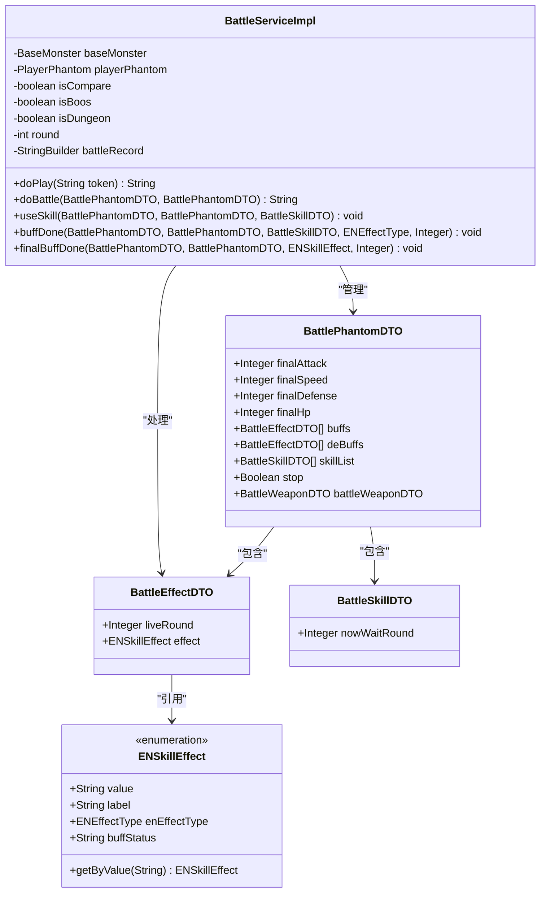
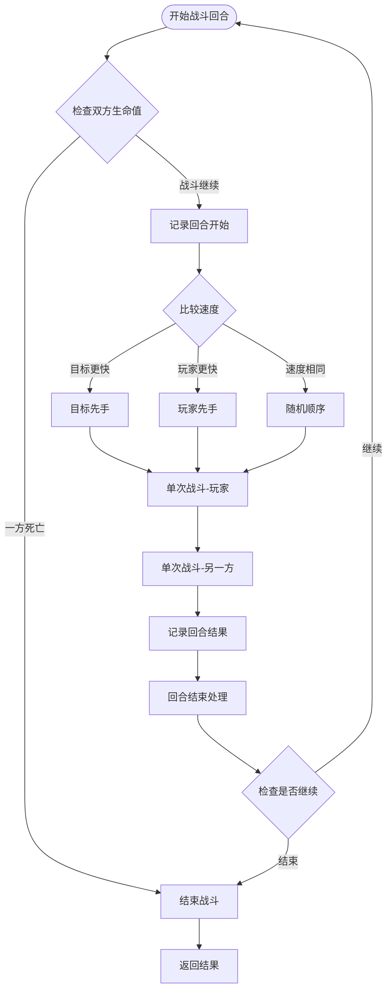
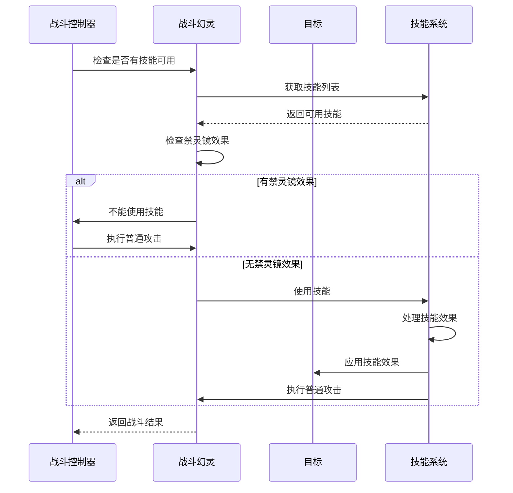
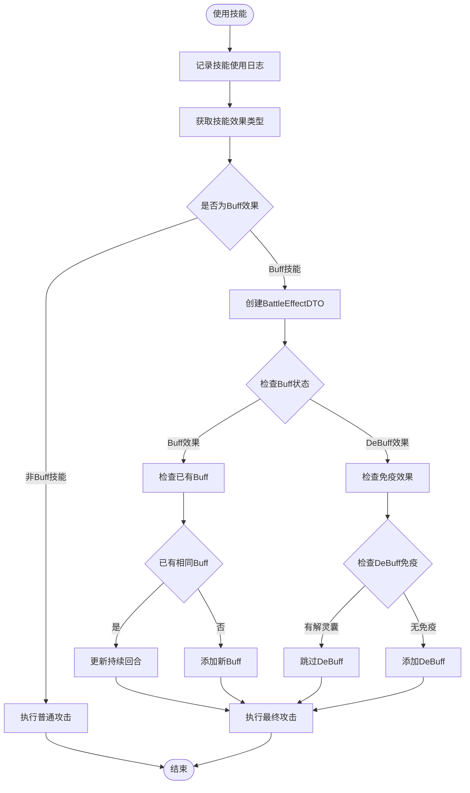
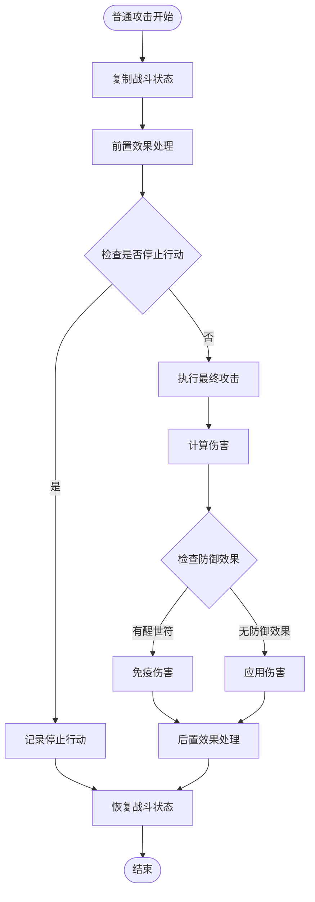
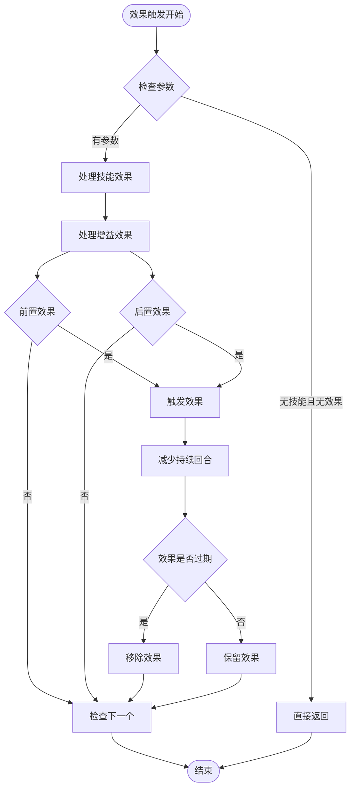
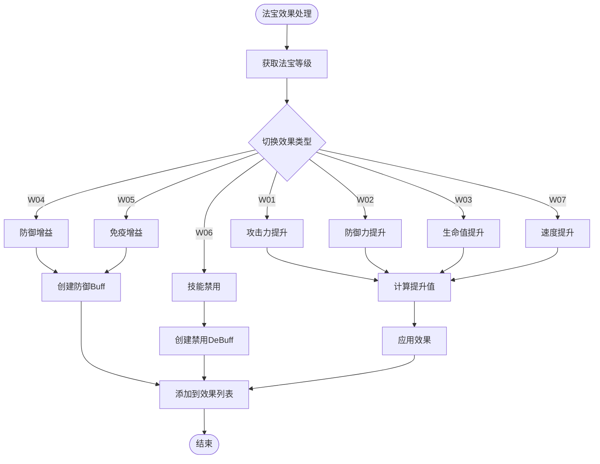
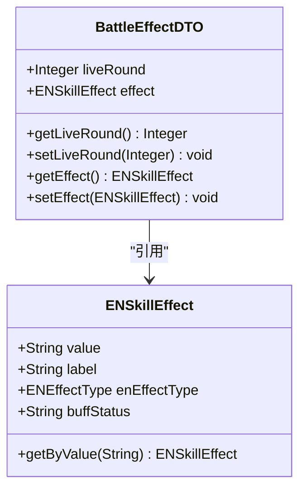
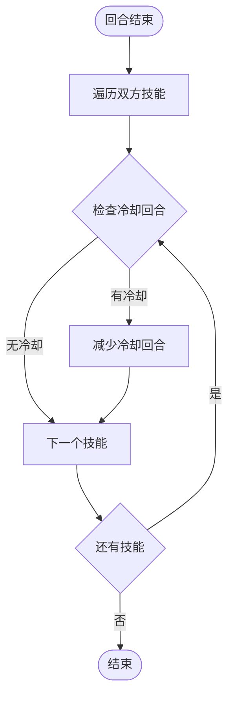
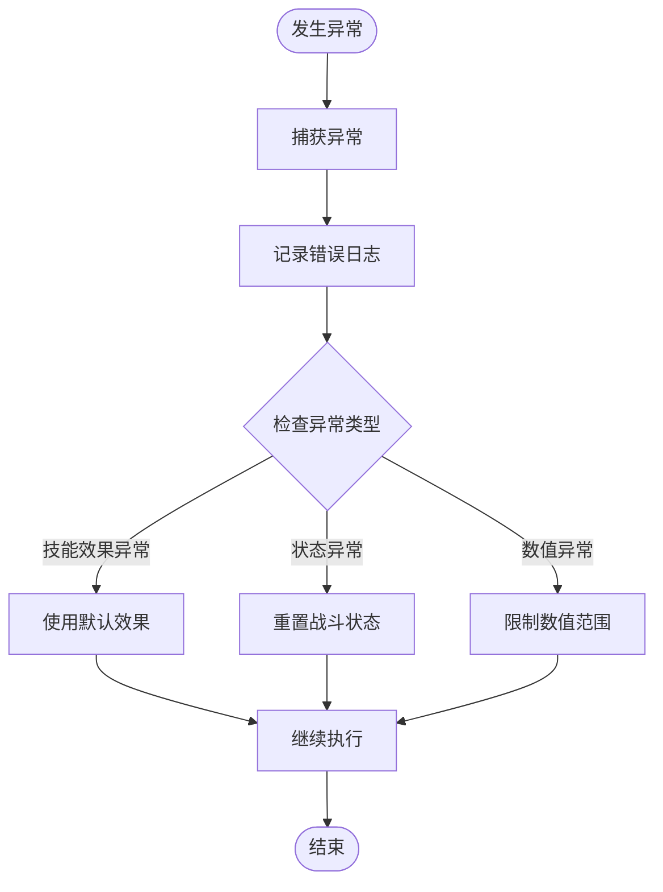

# 战斗执行API文档

<cite>
**本文档引用的文件**
- [BattleServiceImpl.java](file://Game/src/main/java/com/bot/game/service/impl/BattleServiceImpl.java)
- [BattleEffectDTO.java](file://Game/src/main/java/com/bot/game/dto/BattleEffectDTO.java)
- [ENSkillEffect.java](file://Game/src/main/java/com/bot/game/enums/ENSkillEffect.java)
- [BattlePhantomDTO.java](file://Game/src/main/java/com/bot/game/dto/BattlePhantomDTO.java)
- [BattleSkillDTO.java](file://Game/src/main/java/com/bot/game/dto/BattleSkillDTO.java)
- [BattleMonsterDTO.java](file://Game/src/main/java/com/bot/game/dto/BattleMonsterDTO.java)
- [BattleWeaponDTO.java](file://Game/src/main/java/com/bot/game/dto/BattleWeaponDTO.java)
- [ENWeaponEffect.java](file://Game/src/main/java/com/bot/game/enums/ENWeaponEffect.java)
- [ENEffectType.java](file://Game/src/main/java/com/bot/game/enums/ENEffectType.java)
- [GameConsts.java](file://Common/src/main/java/com/bot/common/constant/GameConsts.java)
</cite>

## 目录
1. [简介](#简介)
2. [核心组件架构](#核心组件架构)
3. [战斗执行流程](#战斗执行流程)
4. [技能效果处理机制](#技能效果处理机制)
5. [增益减益效果系统](#增益减益效果系统)
6. [特殊道具效果](#特殊道具效果)
7. [战斗状态管理](#战斗状态管理)
8. [异常处理机制](#异常处理机制)
9. [典型战斗场景](#典型战斗场景)
10. [性能优化考虑](#性能优化考虑)

## 简介

战斗执行API是游戏战斗系统的核心引擎，负责控制战斗回合的执行逻辑、技能效果处理和战斗状态管理。该系统采用面向对象的设计模式，通过BattleServiceImpl类实现复杂的战斗逻辑，支持多种技能效果、增益减益效果和特殊道具的交互。

## 核心组件架构

### 主要类和接口关系

**图表来源**
- [BattleServiceImpl.java](file://Game/src/main/java/com/bot/game/service/impl/BattleServiceImpl.java#L30-L693)
- [BattlePhantomDTO.java](file://Game/src/main/java/com/bot/game/dto/BattlePhantomDTO.java#L15-L37)
- [BattleEffectDTO.java](file://Game/src/main/java/com/bot/game/dto/BattleEffectDTO.java#L10-L17)

### 数据模型详解

#### BattlePhantomDTO - 战斗幻灵数据模型

BattlePhantomDTO继承自PlayerPhantom，扩展了战斗专用的属性和状态：

| 属性 | 类型 | 描述 |
|------|------|------|
| finalAttack | Integer | 最终攻击力，包含技能和道具加成后的实际攻击力 |
| finalSpeed | Integer | 最终速度，影响行动顺序 |
| finalDefense | Integer | 最终防御力，减少受到的伤害 |
| finalHp | Integer | 最终生命值，包含所有增益效果的生命值 |
| buffs | List\<BattleEffectDTO\> | 增益效果列表，存储持续性的正面效果 |
| deBuffs | List\<BattleEffectDTO\> | 减益效果列表，存储持续性的负面效果 |
| skillList | List\<BattleSkillDTO\> | 技能列表，包含可用的战斗技能 |
| stop | Boolean | 是否停止行动标志，用于控制技能冷却 |
| battleWeaponDTO | BattleWeaponDTO | 战斗法宝数据，包含法宝效果 |

**节来源**
- [BattlePhantomDTO.java](file://Game/src/main/java/com/bot/game/dto/BattlePhantomDTO.java#L15-L37)

#### ENSkillEffect - 技能效果枚举

技能效果枚举定义了所有可能的战斗效果类型：

| 效果类型 | 代码 | 效果描述 | Buff状态 | 效果类型 |
|----------|------|----------|----------|----------|
| 攻击类 | A01-A04 | 提供不同倍率的伤害加成 | null | null |
| 苦肉类 | B01-B02 | 自身损失生命值造成等额伤害 | null | null |
| 减益类 | C01-C10 | 各种负面效果 | deBuff | PRE/DEFENSE/END |
| 驱散类 | D01-D02 | 特殊的驱散和恢复效果 | null | null |
| 增益类 | U01-U03 | 提升自身属性的效果 | buff | PRE |
| 特殊道具 | W01-W07 | 法宝和特殊道具效果 | buff/deBuff | END/DEFENSE/PRE |

**节来源**
- [ENSkillEffect.java](file://Game/src/main/java/com/bot/game/enums/ENSkillEffect.java#L12-L46)

## 战斗执行流程

### doBattle方法 - 战斗回合控制

doBattle方法是战斗系统的核心控制器，负责管理整个战斗回合的执行流程：

**图表来源**
- [BattleServiceImpl.java](file://Game/src/main/java/com/bot/game/service/impl/BattleServiceImpl.java#L188-L207)

#### 速度比较和行动顺序

战斗系统根据双方的最终速度决定行动顺序：

1. **速度对比**：比较双方的finalSpeed属性
2. **行动顺序**：
   - 如果目标速度更高，目标先行动，然后玩家行动
   - 如果玩家速度更高，玩家先行动，然后目标行动
   - 如果速度相同，随机决定行动顺序

**节来源**
- [BattleServiceImpl.java](file://Game/src/main/java/com/bot/game/service/impl/BattleServiceImpl.java#L195-L201)

### doSingleBattle方法 - 单次战斗逻辑

doSingleBattle方法处理单个战斗单位的行动：

**图表来源**
- [BattleServiceImpl.java](file://Game/src/main/java/com/bot/game/service/impl/BattleServiceImpl.java#L325-L342)

**节来源**
- [BattleServiceImpl.java](file://Game/src/main/java/com/bot/game/service/impl/BattleServiceImpl.java#L325-L342)

## 技能效果处理机制

### useSkill方法 - 技能效果应用

useSkill方法负责处理技能效果的触发和应用：

**图表来源**
- [BattleServiceImpl.java](file://Game/src/main/java/com/bot/game/service/impl/BattleServiceImpl.java#L236-L278)

#### 技能效果分类处理

系统根据技能效果的不同类型进行分类处理：

1. **纯攻击类技能（A系列）**：直接执行普通攻击
2. **苦肉类技能（B系列）**：自身损失生命值造成伤害
3. **增益类技能（U系列）**：为目标添加增益效果
4. **减益类技能（C系列）**：为目标添加减益效果
5. **特殊道具技能（W系列）**：触发法宝或特殊道具效果

**节来源**
- [BattleServiceImpl.java](file://Game/src/main/java/com/bot/game/service/impl/BattleServiceImpl.java#L236-L278)

### normalAttack方法 - 普通攻击逻辑

普通攻击方法处理基础的伤害计算和效果触发：

**图表来源**
- [BattleServiceImpl.java](file://Game/src/main/java/com/bot/game/service/impl/BattleServiceImpl.java#L281-L305)

**节来源**
- [BattleServiceImpl.java](file://Game/src/main/java/com/bot/game/service/impl/BattleServiceImpl.java#L281-L305)

## 增益减益效果系统

### buffDone方法 - 效果触发控制

buffDone方法负责控制各种效果类型的触发时机：

**图表来源**
- [BattleServiceImpl.java](file://Game/src/main/java/com/bot/game/service/impl/BattleServiceImpl.java#L372-L407)

#### 效果类型分类

系统根据效果类型（ENEffectType）进行分类处理：

| 效果类型 | 数值 | 描述 | 触发时机 |
|----------|------|------|----------|
| PRE | 0 | 前置效果 | 攻击前触发 |
| END | 1 | 后置效果 | 攻击后触发 |
| ATTACK | 2 | 攻击时效果 | 受击时判断 |
| DEFENSE | 3 | 防御时效果 | 受击时判断 |

**节来源**
- [ENEffectType.java](file://Game/src/main/java/com/bot/game/enums/ENEffectType.java#L10-L26)

### finalBuffDone方法 - 具体效果实现

finalBuffDone方法实现了各种具体的效果逻辑：

#### 攻击类效果（A系列）

- **A01**: 给目标造成双倍伤害
- **A02**: 给目标造成1.5倍伤害  
- **A03**: 给目标造成3倍伤害，但本回合内防御降低30%
- **A04**: 50%的几率给目标造成3倍伤害

#### 减益类效果（C系列）

- **C01-C04**: 降低目标攻击或防御百分比
- **C05**: 使目标停止行动1回合
- **C06-C07**: 每回合自动扣除生命值（固定或百分比）
- **C08**: 反弹所受伤害的30%
- **C09**: 每回合结束时回复已损失生命的10%

#### 增益类效果（U系列）

- **U01**: 提升自己10%的攻击力
- **U02**: 提升自己100%的速度
- **U03**: 提升自己30%的防御

**节来源**
- [BattleServiceImpl.java](file://Game/src/main/java/com/bot/game/service/impl/BattleServiceImpl.java#L416-L539)

## 特殊道具效果

### 法宝效果处理

系统支持多种法宝效果，通过ENWeaponEffect枚举定义：

| 法宝 | 效果 | 持续回合 | 属性加成 |
|------|------|----------|----------|
| 翻天印 | 攻击力提升 | 5级：1-2回合 | 1%-10% |
| 护灵甲 | 防御力提升 | 5级：1-2回合 | 1%-10% |
| 玄王佩 | 生命值提升 | 5级：1-2回合 | 1%-10% |
| 醒世符 | 免疫伤害 | 5级：1-2回合 | 无 |
| 解灵囊 | 免疫负面效果 | 5级：1-2回合 | 无 |
| 禁灵镜 | 禁止技能使用 | 5级：1-3回合 | 无 |
| 极影斗篷 | 速度提升 | 5级：1-2回合 | 1%-13% |

**节来源**
- [ENWeaponEffect.java](file://Game/src/main/java/com/bot/game/enums/ENWeaponEffect.java#L11-L19)

### 特殊道具效果实现

**图表来源**
- [BattleServiceImpl.java](file://Game/src/main/java/com/bot/game/service/impl/BattleServiceImpl.java#L645-L688)

**节来源**
- [BattleServiceImpl.java](file://Game/src/main/java/com/bot/game/service/impl/BattleServiceImpl.java#L645-L688)

## 战斗状态管理

### BattleEffectDTO - 战斗效果数据结构

BattleEffectDTO是战斗效果的核心数据结构，用于管理效果的生命周期：

**图表来源**
- [BattleEffectDTO.java](file://Game/src/main/java/com/bot/game/dto/BattleEffectDTO.java#L10-L17)

#### 效果生命周期管理

1. **创建阶段**：技能使用时创建新的BattleEffectDTO实例
2. **应用阶段**：将效果添加到目标的buffs或deBuffs列表
3. **触发阶段**：根据效果类型在合适的时机触发效果
4. **衰减阶段**：每回合减少liveRound计数
5. **移除阶段**：当liveRound小于等于0时从列表中移除

**节来源**
- [BattleEffectDTO.java](file://Game/src/main/java/com/bot/game/dto/BattleEffectDTO.java#L10-L17)

### roundEnd方法 - 回合结束处理

roundEnd方法负责处理回合结束时的清理工作：

**图表来源**
- [BattleServiceImpl.java](file://Game/src/main/java/com/bot/game/service/impl/BattleServiceImpl.java#L223-L234)

**节来源**
- [BattleServiceImpl.java](file://Game/src/main/java/com/bot/game/service/impl/BattleServiceImpl.java#L223-L234)

## 异常处理机制

### 异常处理策略

战斗系统采用多层次的异常处理策略：

1. **技能效果异常**：ENSkillEffect.getByValue方法抛出BotException
2. **战斗状态异常**：空指针和数组越界检查
3. **数值计算异常**：整数溢出和除零保护
4. **状态同步异常**：战斗状态的一致性检查

### 错误恢复机制

**节来源**
- [ENSkillEffect.java](file://Game/src/main/java/com/bot/game/enums/ENSkillEffect.java#L74-L80)

## 典型战斗场景

### 场景一：普通战斗

**战斗流程**：
1. 初始化战斗状态，计算初始属性
2. 根据速度决定行动顺序
3. 玩家和敌人轮流行动
4. 每回合触发相应的效果
5. 检查战斗结束条件

**效果触发时机**：
- 前置效果：攻击前触发（PRE类型）
- 后置效果：攻击后触发（END类型）
- 防御效果：受到攻击时触发（DEFENSE类型）

### 场景二：使用技能战斗

**战斗流程**：
1. 检查技能冷却状态
2. 应用技能效果（增益/减益）
3. 执行普通攻击
4. 触发技能相关的特殊效果

**特殊效果**：
- 禁灵镜：阻止技能使用
- 醒世符：免疫伤害
- 解灵囊：免疫负面效果

### 场景三：法宝战斗

**战斗流程**：
1. 计算法宝的基础效果
2. 应用法宝的持续效果
3. 在战斗过程中维持效果
4. 效果到期时移除

**节来源**
- [BattleServiceImpl.java](file://Game/src/main/java/com/bot/game/service/impl/BattleServiceImpl.java#L188-L207)

## 性能优化考虑

### 内存管理优化

1. **对象池化**：BattleEffectDTO对象的复用
2. **延迟初始化**：仅在需要时创建战斗状态
3. **缓存机制**：技能效果查询结果缓存

### 计算优化

1. **效果排序**：按效果类型预先排序
2. **批量处理**：一次性处理同类型效果
3. **短路求值**：提前终止不必要的计算

### 并发处理

虽然当前实现是单线程的，但设计上考虑了并发扩展的可能性：
- 不可变数据结构的使用
- 状态分离的设计
- 原子操作的支持

**节来源**
- [BattleServiceImpl.java](file://Game/src/main/java/com/bot/game/service/impl/BattleServiceImpl.java#L30-L60)

## 总结

战斗执行API提供了一个完整而灵活的战斗系统框架，通过模块化的设计和清晰的职责分离，实现了复杂战斗逻辑的有效管理。系统支持多种技能效果、增益减益效果和特殊道具的交互，同时具备良好的扩展性和维护性。

主要特性包括：
- 完整的战斗回合控制机制
- 灵活的技能效果处理系统
- 丰富的增益减益效果类型
- 强大的特殊道具效果支持
- 健壮的异常处理和恢复机制
- 高效的状态管理和性能优化

该系统为游戏提供了坚实的战斗基础，能够支持各种复杂的战斗场景和玩法需求。