# 战斗系统API

<cite>
**本文档引用文件**  
- [BattleEffectDTO.java](file://Game\src\main\java\com\bot\game\dto\BattleEffectDTO.java)
- [BaseMonster.java](file://Game\src\main\java\com\bot\game\dao\entity\BaseMonster.java)
- [BattleServiceImpl.java](file://Game\src\main\java\com\bot\game\service\impl\BattleServiceImpl.java)
- [BattleContext.java](file://Life\src\main\java\com\bot\life\dto\BattleContext.java)
- [BattleResult.java](file://Life\src\main\java\com\bot\life\dto\BattleResult.java)
- [ENSkillEffect.java](file://Game\src\main\java\com\bot\game\enums\ENSkillEffect.java)
- [ENEffectType.java](file://Game\src\main\java\com\bot\game\enums\ENEffectType.java)
- [GameConsts.java](file://Common\src\main\java\com\bot\common\constant\GameConsts.java)
- [LifeHandlerImpl.java](file://Life\src\main\java\com\bot\life\service\impl\LifeHandlerImpl.java)
- [BattleService.java](file://Life\src\main\java\com\bot\life\service\BattleService.java)
</cite>

## 目录
1. [引言](#引言)
2. [战斗流程概述](#战斗流程概述)
3. [核心数据结构](#核心数据结构)
4. [战斗服务接口](#战斗服务接口)
5. [战斗效果系统](#战斗效果系统)
6. [战斗流程详细分析](#战斗流程详细分析)
7. [战斗平衡性设计](#战斗平衡性设计)
8. [异常处理机制](#异常处理机制)
9. [扩展性说明](#扩展性说明)
10. [典型战斗场景示例](#典型战斗场景示例)

## 引言

战斗系统是游戏核心玩法的重要组成部分，负责处理玩家与怪物之间的交互逻辑。本API文档全面记录了游戏战斗逻辑处理接口，详细描述了战斗流程的初始化、回合执行和结果结算等阶段。文档还说明了`BattleEffectDTO`在战斗效果传递中的作用，以及`BaseMonster`实体类的属性设计，解释了战斗服务与其他游戏系统（如装备、技能）的集成方式。

**战斗系统特点**：
- 支持多种战斗类型（普通战斗、副本战斗、世界BOSS战斗）
- 实现了完整的回合制战斗机制
- 包含丰富的战斗效果系统（增益、减益、特殊效果）
- 集成了属性相克机制
- 支持战斗日志记录和回放功能

## 战斗流程概述

游戏战斗系统采用回合制机制，战斗流程分为三个主要阶段：初始化阶段、回合执行阶段和结果结算阶段。

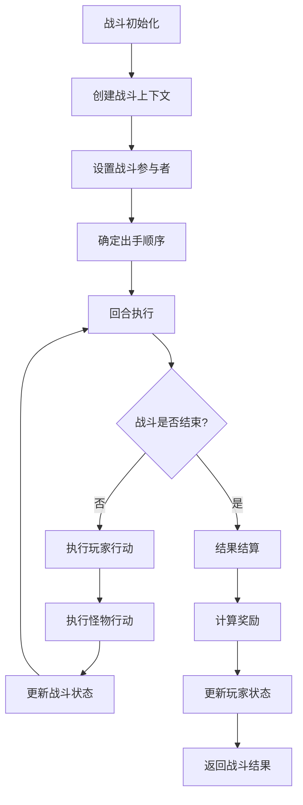

**流程说明**：
1. **初始化阶段**：创建战斗上下文，设置参与战斗的玩家和怪物，根据速度属性确定出手顺序
2. **回合执行阶段**：交替执行玩家和怪物的行动，处理技能、道具、攻击等操作
3. **结果结算阶段**：判断战斗胜负，计算奖励，更新玩家状态

**战斗流程特点**：
- 采用速度优先原则决定出手顺序
- 支持多种行动类型（攻击、防御、技能、道具、逃跑）
- 实现了战斗效果的持续影响机制
- 包含战斗日志记录功能

**本节来源**
- [BattleServiceImpl.java](file://Game\src\main\java\com\bot\game\service\impl\BattleServiceImpl.java#L88-L121)
- [BattleContext.java](file://Life\src\main\java\com\bot\life\dto\BattleContext.java#L14-L54)

## 核心数据结构

### BaseMonster实体类

`BaseMonster`实体类定义了游戏中怪物的基础属性，是战斗系统中怪物数据的核心表示。

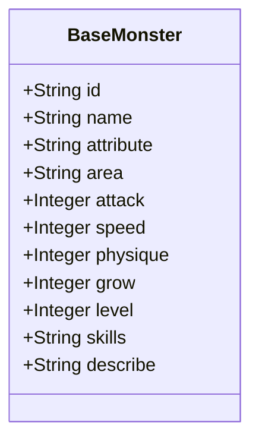

**属性说明**：
- **id**：怪物唯一标识符
- **name**：怪物名称
- **attribute**：怪物属性（用于属性相克计算）
- **area**：怪物所在区域
- **attack**：基础攻击力
- **speed**：基础速度（决定出手顺序）
- **physique**：体质（影响生命值和防御力）
- **grow**：成长值（影响属性成长）
- **level**：怪物等级
- **skills**：技能列表（以逗号分隔的技能ID）
- **describe**：怪物描述

**设计特点**：
- 采用简单直观的属性设计，便于扩展和维护
- 属性命名清晰，易于理解
- 包含了战斗所需的核心属性
- 支持通过配置文件或数据库进行数据管理

**本节来源**
- [BaseMonster.java](file://Game\src\main\java\com\bot\game\dao\entity\BaseMonster.java#L10-L34)

### 战斗数据传输对象

战斗系统使用一系列数据传输对象（DTO）来传递战斗相关数据，确保了数据的封装性和安全性。

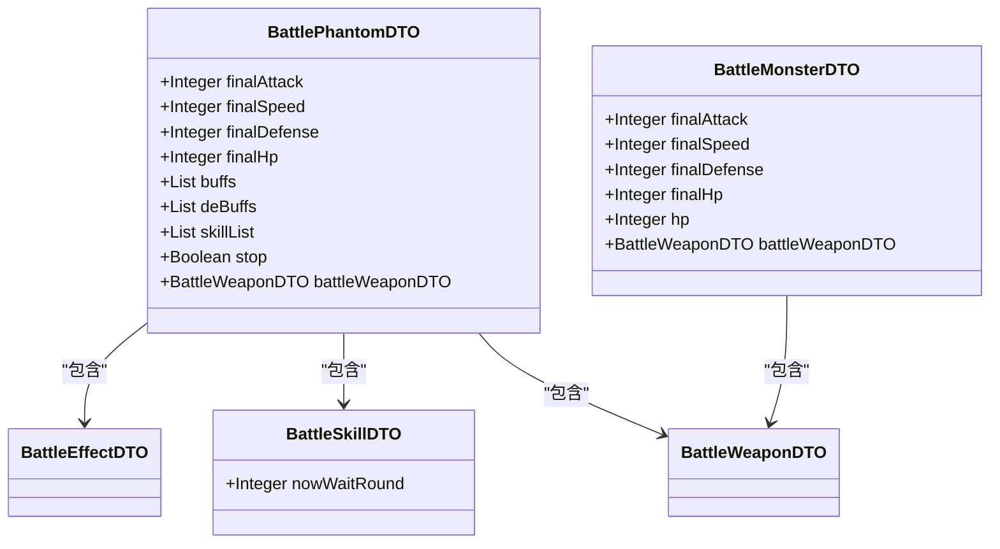

**DTO设计原则**：
- **职责分离**：每个DTO负责特定的数据传输任务
- **数据封装**：隐藏内部实现细节，只暴露必要的属性
- **类型安全**：使用强类型定义，减少运行时错误
- **可扩展性**：设计灵活，便于添加新功能

**本节来源**
- [BattlePhantomDTO.java](file://Game\src\main\java\com\bot\game\dto\BattlePhantomDTO.java#L15-L37)
- [BattleMonsterDTO.java](file://Game\src\main\java\com\bot\game\dto\BattleMonsterDTO.java#L15-L27)
- [BattleSkillDTO.java](file://Game\src\main\java\com\bot\game\dto\BattleSkillDTO.java#L14-L15)
- [BattleWeaponDTO.java](file://Game\src\main\java\com\bot\game\dto\BattleWeaponDTO.java#L13-L16)

## 战斗服务接口

战斗服务接口定义了战斗系统的核心功能，提供了标准化的API供其他系统调用。

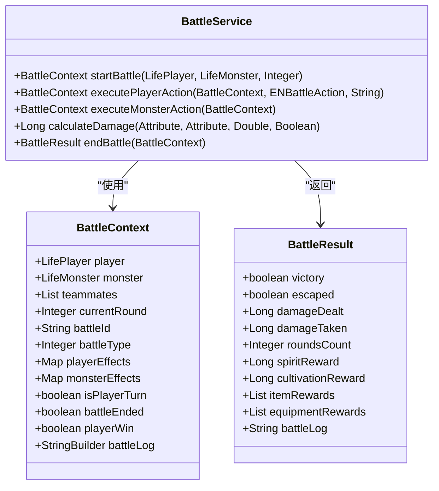

**接口方法说明**：
- **startBattle**：开始战斗，创建战斗上下文并初始化战斗状态
- **executePlayerAction**：执行玩家行动，处理攻击、技能、道具等操作
- **executeMonsterAction**：执行怪物行动，实现AI逻辑
- **calculateDamage**：计算伤害值，考虑属性相克、装备加成等因素
- **endBattle**：结束战斗，计算结果和奖励

**集成方式**：
- 通过依赖注入方式与其他服务集成
- 使用统一的异常处理机制
- 支持事务管理，确保数据一致性
- 提供详细的日志记录，便于调试和监控

**本节来源**
- [BattleService.java](file://Life\src\main\java\com\bot\life\service\BattleService.java#L13-L46)
- [BattleContext.java](file://Life\src\main\java\com\bot\life\dto\BattleContext.java#L14-L54)
- [BattleResult.java](file://Life\src\main\java\com\bot\life\dto\BattleResult.java#L11-L40)

## 战斗效果系统

### BattleEffectDTO设计

`BattleEffectDTO`是战斗效果系统的核心数据结构，用于表示战斗中的各种状态效果。

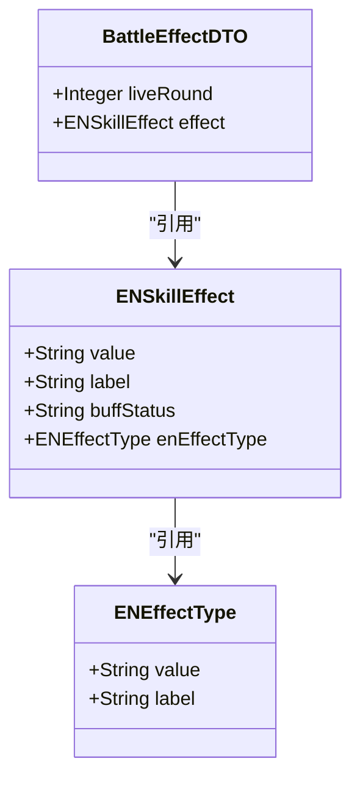

**属性说明**：
- **liveRound**：效果持续回合数
- **effect**：效果类型（枚举值）

**设计特点**：
- 采用组合模式，将效果类型与持续时间分离
- 使用枚举类型确保类型安全
- 支持动态效果管理
- 易于扩展新的效果类型

**本节来源**
- [BattleEffectDTO.java](file://Game\src\main\java\com\bot\game\dto\BattleEffectDTO.java#L10-L17)
- [ENSkillEffect.java](file://Game\src\main\java\com\bot\game\enums\ENSkillEffect.java#L11-L83)
- [ENEffectType.java](file://Game\src\main\java\com\bot\game\enums\ENEffectType.java#L9-L27)

### 战斗效果类型

战斗系统支持多种效果类型，分为增益（buff）、减益（debuff）和特殊效果三大类。

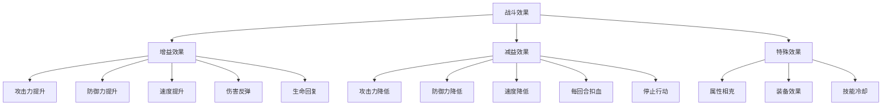

**效果触发时机**：
- **PRE**：行动前触发（如降低攻击力、停止行动）
- **END**：回合结束时触发（如生命回复、速度提升）
- **ATTACK**：攻击时触发（如伤害反弹）
- **DEFENSE**：受击时触发（如免疫伤害）

**效果持续机制**：
- 每回合结束时减少持续回合数
- 持续回合数为0时移除效果
- 支持效果叠加和替换

**本节来源**
- [ENSkillEffect.java](file://Game\src\main\java\com\bot\game\enums\ENSkillEffect.java#L11-L83)
- [ENEffectType.java](file://Game\src\main\java\com\bot\game\enums\ENEffectType.java#L9-L27)
- [BattleServiceImpl.java](file://Game\src\main\java\com\bot\game\service\impl\BattleServiceImpl.java#L372-L539)

## 战斗流程详细分析

### 战斗初始化

战斗初始化阶段负责创建战斗上下文，设置参与者属性，并确定初始状态。

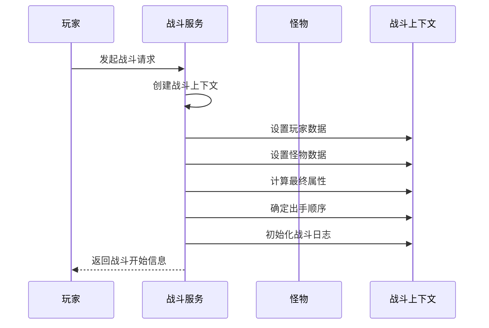

**初始化流程**：
1. 创建`BattleContext`对象
2. 设置玩家和怪物数据
3. 计算最终属性值（考虑等级、装备、技能等加成）
4. 根据速度属性确定出手顺序
5. 初始化战斗日志

**属性计算公式**：
- 最终攻击力 = (基础攻击力 + 成长值) × 攻击点数 + 等级 × 每级攻击力
- 最终速度 = (基础速度 + 成长值) × 速度点数 + 等级 × 每级速度
- 最终防御力 = (基础防御力 + 成长值) × 防御点数 + 等级 × 每级防御力
- 最终生命值 = 体质 × 生命点数 + 等级 × 每级生命值

**本节来源**
- [BattleServiceImpl.java](file://Game\src\main\java\com\bot\game\service\impl\BattleServiceImpl.java#L123-L158)
- [GameConsts.java](file://Common\src\main\java\com\bot\common\constant\GameConsts.java#L189-L202)

### 回合执行

回合执行阶段是战斗的核心，处理玩家和怪物的交替行动。

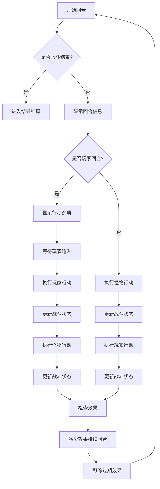

**行动类型**：
- **普通攻击**：造成基础伤害
- **防御**：本回合受到伤害减少50%
- **技能**：执行特定技能效果
- **道具**：使用战斗道具
- **逃跑**：尝试逃离战斗

**伤害计算**：
- 基础伤害 = 攻击力 - 防御力
- 最小伤害为1点
- 考虑属性相克系数（1.2倍增伤，0.8倍减伤）
- 特殊效果影响（如伤害反弹、免疫伤害）

**本节来源**
- [BattleServiceImpl.java](file://Game\src\main\java\com\bot\game\service\impl\BattleServiceImpl.java#L189-L342)
- [LifeHandlerImpl.java](file://Life\src\main\java\com\bot\life\service\impl\LifeHandlerImpl.java#L1150-L1174)

### 结果结算

结果结算阶段处理战斗结束后的各项事务，包括奖励计算和状态更新。

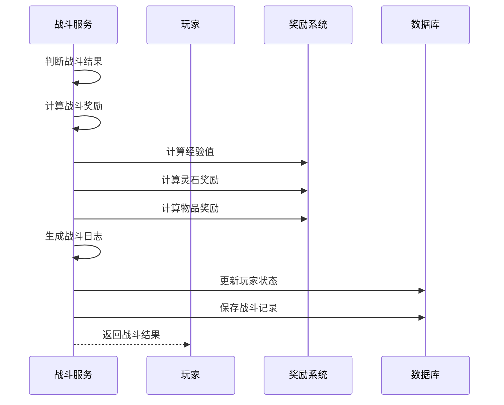

**胜利条件**：
- 怪物生命值降至0或以下
- 成功击败世界BOSS
- 完成特定战斗目标

**失败条件**：
- 玩家生命值降至0
- 逃跑失败
- 超时未完成战斗

**奖励机制**：
- 经验值：根据等级差计算
- 灵石：随机范围奖励
- 物品：根据区域掉落表
- 特殊奖励：BOSS战专属奖励

**本节来源**
- [BattleServiceImpl.java](file://Game\src\main\java\com\bot\game\service\impl\BattleServiceImpl.java#L344-L607)
- [BattleResult.java](file://Life\src\main\java\com\bot\life\dto\BattleResult.java#L11-L40)

## 战斗平衡性设计

### 属性相克机制

游戏实现了属性相克机制，增加了战斗策略性。

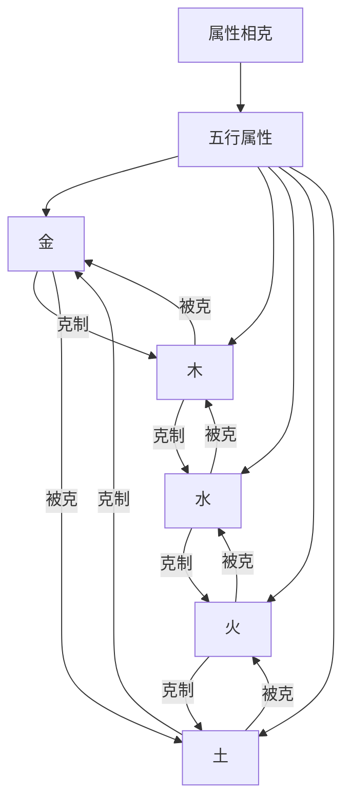

**相克系数**：
- 克制关系：伤害 × 1.2
- 被克关系：伤害 × 0.8
- 无相克关系：伤害 × 1.0

**设计目的**：
- 增加战斗策略性
- 鼓励玩家培养多种属性角色
- 平衡不同属性角色的强度

**本节来源**
- [ENSkillEffect.java](file://Game\src\main\java\com\bot\game\enums\ENSkillEffect.java#L178-L185)
- [GameConsts.java](file://Common\src\main\java\com\bot\common\constant\GameConsts.java#L200-L202)

### 成长曲线设计

游戏采用线性成长曲线，确保玩家体验的平滑过渡。

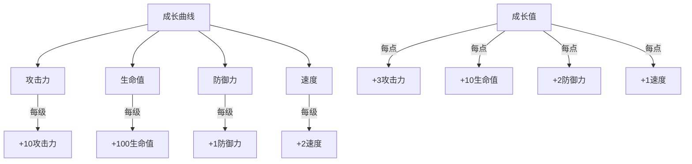

**平衡性考虑**：
- 基础属性成长稳定
- 成长值提供个性化发展空间
- 不同属性有不同成长权重
- 高等级时属性差异更加明显

**本节来源**
- [GameConsts.java](file://Common\src\main\java\com\bot\common\constant\GameConsts.java#L190-L197)
- [BattleServiceImpl.java](file://Game\src\main\java\com\bot\game\service\impl\BattleServiceImpl.java#L132-L143)

## 异常处理机制

### 战斗状态管理

系统实现了完善的战斗状态管理机制，确保战斗过程的稳定性。

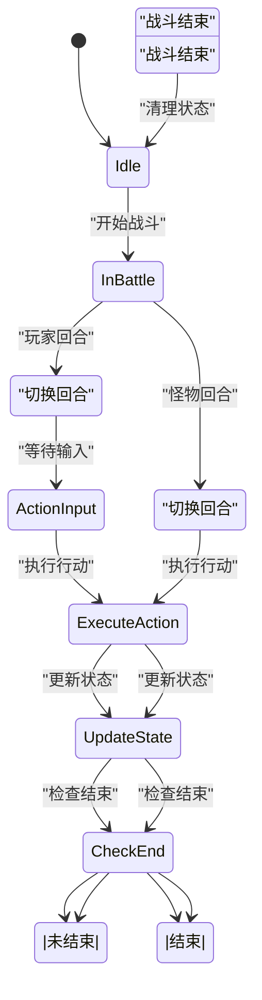

**异常处理策略**：
- 战斗中断时自动保存状态
- 网络异常时提供重连机制
- 数据异常时进行校验和修复
- 超时未操作时执行默认行动

**本节来源**
- [BattleContext.java](file://Life\src\main\java\com\bot\life\dto\BattleContext.java#L28-L31)
- [LifeHandlerImpl.java](file://Life\src\main\java\com\bot\life\service\impl\LifeHandlerImpl.java#L1279-L1280)

### 错误处理与恢复

系统设计了多层次的错误处理与恢复机制。

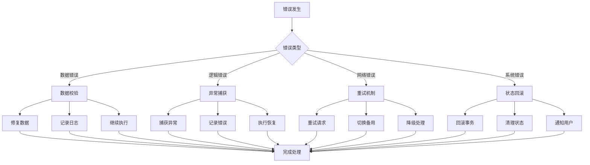

**处理原则**：
- 快速失败，避免错误扩散
- 详细记录错误信息
- 提供用户友好的错误提示
- 尽可能自动恢复

**本节来源**
- [BattleServiceImpl.java](file://Life\src\main\java\com\bot\life\service\impl\BattleServiceImpl.java#L187-L193)
- [Life_Battle_Method_Fix.md](file://Life_Battle_Method_Fix.md#L1-L32)

## 扩展性说明

### 模块化设计

战斗系统采用模块化设计，便于功能扩展和维护。

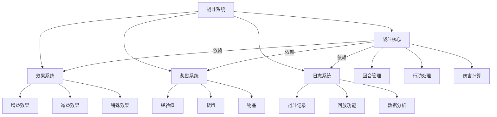

**扩展点**：
- 新增战斗类型
- 添加新的效果类型
- 扩展奖励机制
- 增强日志功能

**本节来源**
- [BattleService.java](file://Life\src\main\java\com\bot\life\service\BattleService.java#L13-L46)
- [ENSkillEffect.java](file://Game\src\main\java\com\bot\game\enums\ENSkillEffect.java#L11-L83)

### 配置化管理

系统支持配置化管理，降低了代码修改的频率。

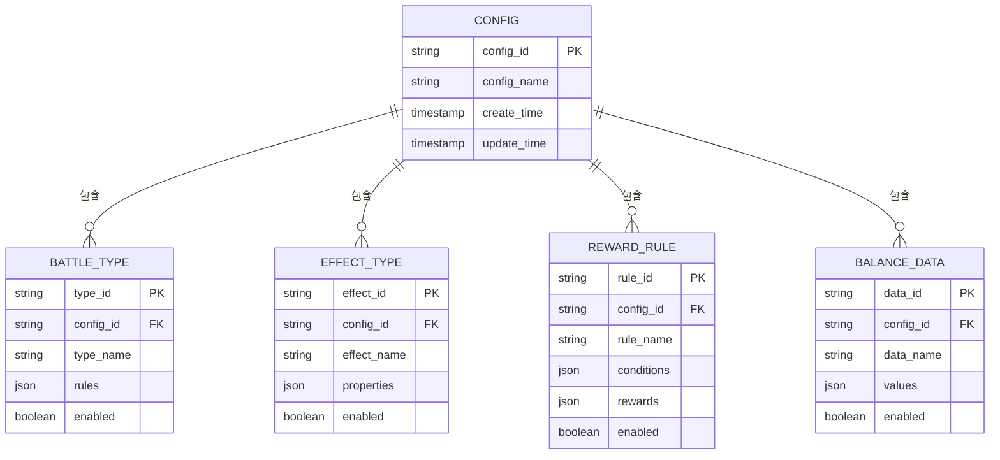

**配置优势**：
- 无需修改代码即可调整参数
- 支持热更新
- 便于A/B测试
- 降低发布风险

**本节来源**
- [GameConsts.java](file://Common\src\main\java\com\bot\common\constant\GameConsts.java#L187-L223)
- [BattleServiceImpl.java](file://Game\src\main\java\com\bot\game\service\impl\BattleServiceImpl.java#L178-L186)

## 典型战斗场景示例

### 普通战斗场景

展示一次典型的普通战斗流程。

```mermaid
sequenceDiagram
participant Player as 玩家
participant System as 战斗系统
participant Monster as 怪物
Player->>System : 发起战斗
System->>System : 初始化战斗
System-->>Player : 战斗开始：玩家 VS 怪物
loop 回合循环
Player->>System : 选择攻击
System->>System : 计算伤害
System->>Monster : 造成伤害
alt 怪物未死亡
System->>Monster : 怪物反击
System->>Player : 造成伤害
System-->>Player : 显示回合结果
else 怪物死亡
System->>System : 结算战斗
System-->>Player : 战斗胜利！获得奖励
break 结束战斗
end
end
```

**数据流转**：
1. 玩家发起战斗请求
2. 系统创建战斗上下文
3. 计算双方最终属性
4. 开始回合制战斗
5. 交替执行行动
6. 更新战斗状态
7. 判断战斗结果
8. 计算并发放奖励

**本节来源**
- [BattleServiceImpl.java](file://Game\src\main\java\com\bot\game\service\impl\BattleServiceImpl.java#L88-L121)
- [LifeHandlerImpl.java](file://Life\src\main\java\com\bot\life\service\impl\LifeHandlerImpl.java#L1150-L1174)

### BOSS战场景

展示世界BOSS战斗的特殊流程。

```mermaid
sequenceDiagram
participant Player as 玩家
participant System as 战斗系统
participant BOSS as 世界BOSS
Player->>System : 加入BOSS战
System->>System : 记录参战玩家
System-->>Player : BOSS战开始
loop 回合循环
Player->>System : 攻击BOSS
System->>System : 累计伤害
System->>BOSS : 造成伤害
alt BOSS未死亡
System->>BOSS : BOSS释放技能
System->>Player : 造成范围伤害
System-->>Player : 显示战斗进度
else BOSS死亡
System->>System : 结算BOSS战
System->>System : 按伤害比例分配奖励
System-->>Player : 获得BOSS奖励
break 结束战斗
end
end
```

**特殊机制**：
- 多人协作战斗
- 伤害累计记录
- 按贡献分配奖励
- BOSS特殊技能

**本节来源**
- [BattleServiceImpl.java](file://Game\src\main\java\com\bot\game\service\impl\BattleServiceImpl.java#L344-L607)
- [WorldBossServiceImpl.java](file://Game\src\main\java\com\bot\game\service\impl\WorldBossServiceImpl.java)