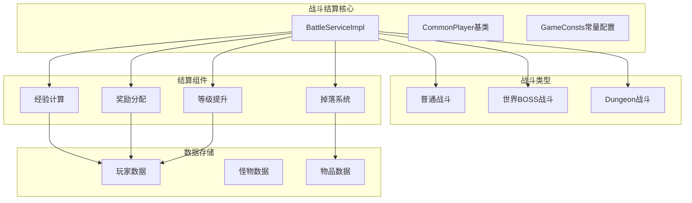
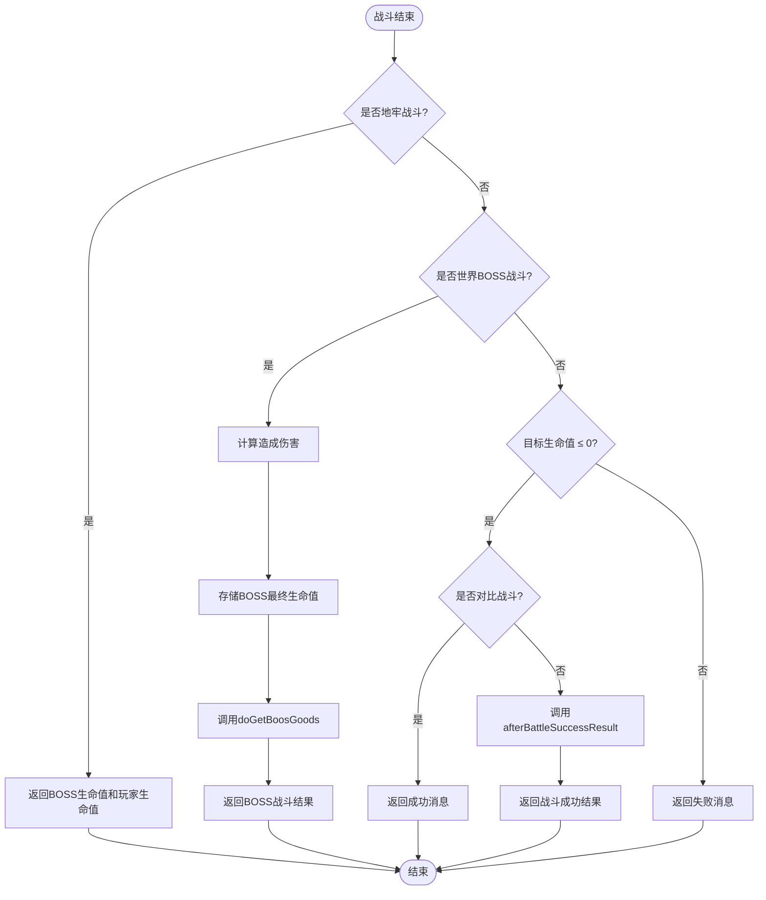
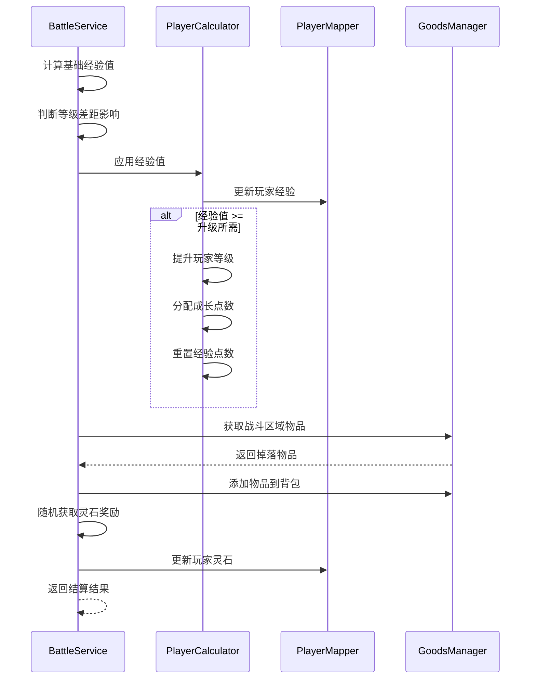
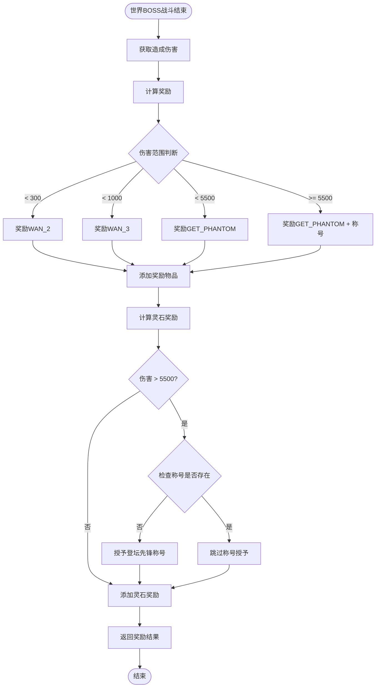
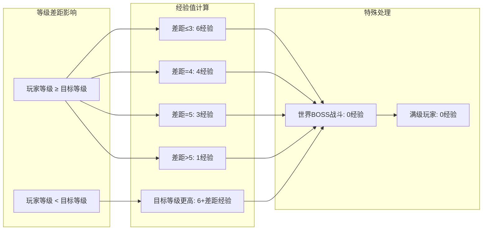
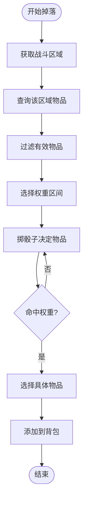
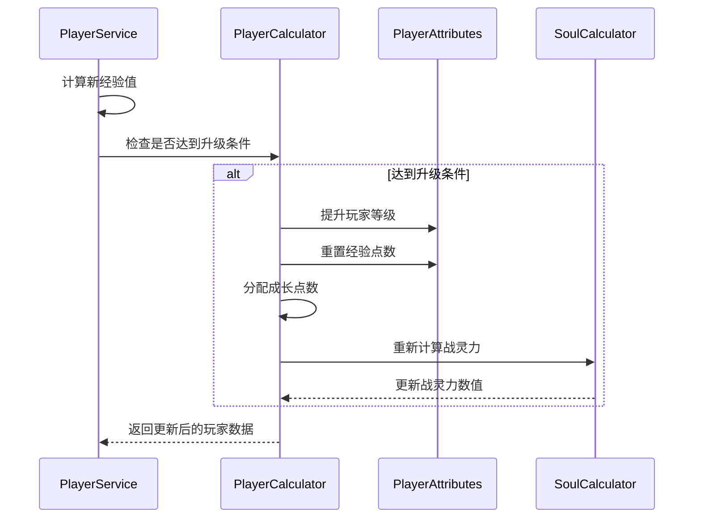
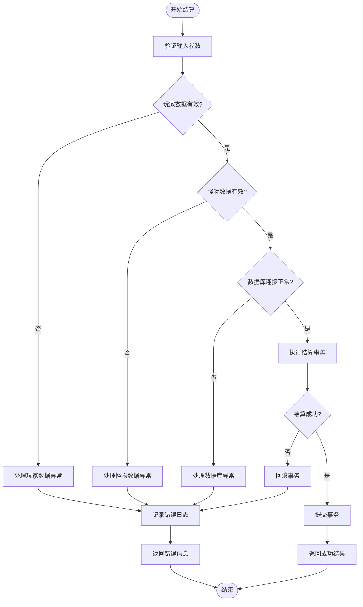
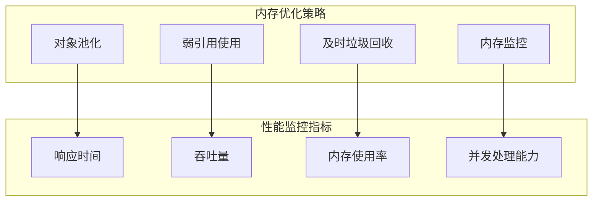

# 战斗结算API

<cite>
**本文档引用的文件**
- [BattleServiceImpl.java](file://Game/src/main/java/com/bot/game/service/impl/BattleServiceImpl.java)
- [CommonPlayer.java](file://Game/src/main/java/com/bot/game/service/impl/CommonPlayer.java)
- [GameConsts.java](file://Common/src/main/java/com/bot/common/constant/GameConsts.java)
- [ENAppellation.java](file://Game/src/main/java/com/bot/game/enums/ENAppellation.java)
- [WorldBossServiceImpl.java](file://Life/src/main/java/com/bot/life/service/impl/WorldBossServiceImpl.java)
- [BattleResult.java](file://Life/src/main/java/com/bot/life/dto/BattleResult.java)
- [LifeWorldBossReward.java](file://Life/src/main/java/com/bot/life/dao/entity/LifeWorldBossReward.java)
</cite>

## 目录
1. [简介](#简介)
2. [战斗结算架构概览](#战斗结算架构概览)
3. [核心方法详解](#核心方法详解)
4. [战斗类型与结算逻辑](#战斗类型与结算逻辑)
5. [奖励机制详解](#奖励机制详解)
6. [等级提升与称号系统](#等级提升与称号系统)
7. [异常处理与平衡性设计](#异常处理与平衡性设计)
8. [响应示例](#响应示例)
9. [性能优化考虑](#性能优化考虑)
10. [故障排除指南](#故障排除指南)

## 简介

战斗结算API是游戏系统的核心组件，负责处理各种战斗类型的结算逻辑，包括经验值分配、物品掉落、灵石奖励、等级提升和称号授予等功能。该系统支持三种主要战斗类型：普通战斗、世界BOSS战斗和地牢战斗，每种战斗都有其独特的结算规则和奖励机制。

## 战斗结算架构概览

战斗结算系统采用分层架构设计，主要包含以下核心组件：



**图表来源**
- [BattleServiceImpl.java](file://Game/src/main/java/com/bot/game/service/impl/BattleServiceImpl.java#L30-L693)
- [CommonPlayer.java](file://Game/src/main/java/com/bot/game/service/impl/CommonPlayer.java#L28-L447)

## 核心方法详解

### getResult方法 - 战斗结果判定

`getResult`方法是战斗结算的核心入口，根据不同的战斗类型返回相应的结果信息：



**图表来源**
- [BattleServiceImpl.java](file://Game/src/main/java/com/bot/game/service/impl/BattleServiceImpl.java#L344-L370)

**节来源**
- [BattleServiceImpl.java](file://Game/src/main/java/com/bot/game/service/impl/BattleServiceImpl.java#L344-L370)

### afterBattleSuccessResult方法 - 普通战斗结算

该方法处理普通战斗胜利后的结算逻辑，包括经验值计算、物品掉落和灵石奖励：



**图表来源**
- [BattleServiceImpl.java](file://Game/src/main/java/com/bot/game/service/impl/BattleServiceImpl.java#L548-L607)

**节来源**
- [BattleServiceImpl.java](file://Game/src/main/java/com/bot/game/service/impl/BattleServiceImpl.java#L548-L607)

### doGetBoosGoods方法 - 世界BOSS特殊奖励

专门处理世界BOSS战斗的奖励逻辑，包括伤害分级奖励和称号授予：



**图表来源**
- [BattleServiceImpl.java](file://Game/src/main/java/com/bot/game/service/impl/BattleServiceImpl.java#L615-L628)

**节来源**
- [BattleServiceImpl.java](file://Game/src/main/java/com/bot/game/service/impl/BattleServiceImpl.java#L615-L628)

## 战斗类型与结算逻辑

### 普通战斗结算

普通战斗是最常见的战斗类型，结算逻辑相对简单但包含完整的奖励系统：

| 战斗参数 | 计算方式 | 说明 |
|---------|---------|------|
| 基础经验值 | 根据等级差距动态计算 | 玩家等级 ≥ 怪物等级时，差距越小经验值越多 |
| 物品掉落 | 基于区域和权重随机生成 | 不同区域有不同的掉落物品池 |
| 灵石奖励 | 固定范围随机 | EXPLORE_MIN到EXPLORE_MAX之间 |

**节来源**
- [BattleServiceImpl.java](file://Game/src/main/java/com/bot/game/service/impl/BattleServiceImpl.java#L548-L607)
- [GameConsts.java](file://Common/src/main/java/com/bot/common/constant/GameConsts.java#L318-L319)

### 世界BOSS战斗结算

世界BOSS战斗具有特殊的结算机制，强调伤害贡献的重要性：

| 伤害范围 | 奖励类型 | 灵石奖励 | 特殊效果 |
|---------|---------|---------|---------|
| < 300 | WAN_2效果物品 | 20灵石 | 基础奖励 |
| 300-999 | WAN_3效果物品 | 50灵石 | 中等奖励 |
| 1000-5499 | GET_PHANTOM效果物品 | 100灵石 | 高级奖励 |
| ≥ 5500 | GET_PHANTOM效果物品 + 称号 | 200灵石 | 最终奖励 |

**节来源**
- [BattleServiceImpl.java](file://Game/src/main/java/com/bot/game/service/impl/BattleServiceImpl.java#L615-L628)
- [CommonPlayer.java](file://Game/src/main/java/com/bot/game/service/impl/CommonPlayer.java#L277-L308)

### 地牢战斗结算

地牢战斗的结算逻辑与其他战斗类型类似，但返回的是战斗状态而非奖励信息：

**节来源**
- [BattleServiceImpl.java](file://Game/src/main/java/com/bot/game/service/impl/BattleServiceImpl.java#L344-L348)

## 奖励机制详解

### 经验值计算算法

经验值计算基于玩家与目标的等级差距，采用阶梯式递减策略：



**图表来源**
- [BattleServiceImpl.java](file://Game/src/main/java/com/bot/game/service/impl/BattleServiceImpl.java#L554-L567)

**节来源**
- [BattleServiceImpl.java](file://Game/src/main/java/com/bot/game/service/impl/BattleServiceImpl.java#L554-L567)

### 物品掉落系统

物品掉落采用基于权重的概率算法，确保奖励的随机性和趣味性：



**图表来源**
- [CommonPlayer.java](file://Game/src/main/java/com/bot/game/service/impl/CommonPlayer.java#L238-L270)

**节来源**
- [CommonPlayer.java](file://Game/src/main/java/com/bot/game/service/impl/CommonPlayer.java#L238-L270)

### 灵石奖励机制

灵石奖励采用固定范围内的随机算法，保证奖励的公平性：

| 战斗类型 | 奖励范围 | 平均奖励 |
|---------|---------|---------|
| 普通探索 | 0-2灵石 | 1灵石 |
| 世界BOSS | 基于伤害分级 | 20-200灵石 |
| 地牢战斗 | 固定奖励 | 200灵石 |
| 地牢失败 | 固定惩罚 | 50灵石 |

**节来源**
- [GameConsts.java](file://Common/src/main/java/com/bot/common/constant/GameConsts.java#L318-L319)
- [GameConsts.java](file://Common/src/main/java/com/bot/common/constant/GameConsts.java#L310-L317)

## 等级提升与称号系统

### 等级提升逻辑

等级提升采用累积经验制，当经验值达到升级阈值时自动提升等级：



**图表来源**
- [BattleServiceImpl.java](file://Game/src/main/java/com/bot/game/service/impl/BattleServiceImpl.java#L578-L586)
- [CommonPlayer.java](file://Game/src/main/java/com/bot/game/service/impl/CommonPlayer.java#L115-L125)

**节来源**
- [BattleServiceImpl.java](file://Game/src/main/java/com/bot/game/service/impl/BattleServiceImpl.java#L578-L586)
- [CommonPlayer.java](file://Game/src/main/java/com/bot/game/service/impl/CommonPlayer.java#L115-L125)

### 称号授予系统

称号系统通过特定条件触发，为玩家提供额外的成就感和身份标识：

| 称号 | 条件 | 效果 |
|-----|------|------|
| 登坛先锋 | 世界BOSS伤害 > 5500 | 全局称号标识 |
| 人生赢家 | 拥有至少1只幻灵 | 基础成就称号 |
| 小资生活 | 拥有1000灵石 | 经济成就称号 |
| 家缠万贯 | 拥有10000灵石 | 经济成就称号 |
| 富可敌国 | 拥有100000灵石 | 经济成就称号 |

**节来源**
- [ENAppellation.java](file://Game/src/main/java/com/bot/game/enums/ENAppellation.java#L12-L28)
- [CommonPlayer.java](file://Game/src/main/java/com/bot/game/service/impl/CommonPlayer.java#L206-L231)

## 异常处理与平衡性设计

### 异常情况处理

系统设计了完善的异常处理机制，确保战斗结算的稳定性：



**图表来源**
- [BattleServiceImpl.java](file://Game/src/main/java/com/bot/game/service/impl/BattleServiceImpl.java#L90-L122)

### 平衡性设计原则

战斗结算系统遵循以下平衡性设计原则：

1. **难度递增**: 不同区域的怪物提供不同的挑战和奖励
2. **风险回报**: 高风险战斗（如世界BOSS）提供更高的奖励
3. **成长曲线**: 经验值和奖励随等级变化而调整
4. **随机性**: 物品掉落和奖励金额保持一定的随机性
5. **公平性**: 所有玩家在相同条件下获得公平的竞争机会

**节来源**
- [BattleServiceImpl.java](file://Game/src/main/java/com/bot/game/service/impl/BattleServiceImpl.java#L128-L149)
- [GameConsts.java](file://Common/src/main/java/com/bot/common/constant/GameConsts.java#L189-L223)

## 响应示例

### 普通战斗胜利响应

```
恭喜你，战斗胜利，输入【Q】可查看战斗详情

获得经验：+6
获得唤灵符：召唤幻灵，可前往背包查看详情
获得灵石*1
```

### 世界BOSS战斗响应

```
『世界BOSS挑战完成！』

对『九尾狐』造成伤害：6000

『获得奖励』
共造成6000点伤害
获得唤灵符：召唤幻灵，灵石*200可前往背包查看详情
Q.查看战斗详情
0.返回

恭喜你，获得了[登坛先锋]的称号!!
```

### 地牢战斗响应

```
战斗胜利，输入【Q】可查看战斗详情

14500_1200
```

### 战斗失败响应

```
战败了...赶紧去提升自己吧!
输入【Q】可查看战斗详情
```

**节来源**
- [GameConsts.java](file://Common/src/main/java/com/bot/common/constant/GameConsts.java#L227-L244)

## 性能优化考虑

### 数据访问优化

战斗结算系统采用多种优化策略提高性能：

1. **批量操作**: 将多个数据库操作合并为事务
2. **缓存机制**: 缓存常用的配置和常量数据
3. **延迟加载**: 按需加载玩家和怪物数据
4. **连接池管理**: 使用数据库连接池减少连接开销

### 内存管理

系统实现了智能的内存管理策略：



## 故障排除指南

### 常见问题及解决方案

| 问题类型 | 症状 | 可能原因 | 解决方案 |
|---------|------|---------|---------|
| 结算失败 | 玩家数据未更新 | 数据库连接异常 | 检查数据库连接状态，重启服务 |
| 奖励异常 | 奖励物品丢失 | 物品ID错误 | 验证物品配置，修复数据 |
| 经验值异常 | 等级提升错误 | 经验值计算错误 | 检查经验值公式，修正算法 |
| 称号授予失败 | 称号未获得 | 称号系统异常 | 检查称号授予逻辑，修复bug |

### 调试工具和方法

1. **日志分析**: 启用详细日志记录，分析结算过程
2. **断点调试**: 在关键节点设置断点，跟踪执行流程
3. **单元测试**: 编写针对结算逻辑的单元测试
4. **压力测试**: 模拟高并发场景，测试系统稳定性

**节来源**
- [BattleServiceImpl.java](file://Game/src/main/java/com/bot/game/service/impl/BattleServiceImpl.java#L118-L121)

## 总结

战斗结算API是一个复杂而精密的系统，它不仅处理基本的战斗结果判定，还包含了丰富的奖励机制、等级提升逻辑和称号系统。通过合理的架构设计和优化策略，该系统能够为玩家提供流畅、公平且富有成就感的游戏体验。系统的模块化设计使其易于维护和扩展，而完善的异常处理机制确保了系统的稳定性和可靠性。