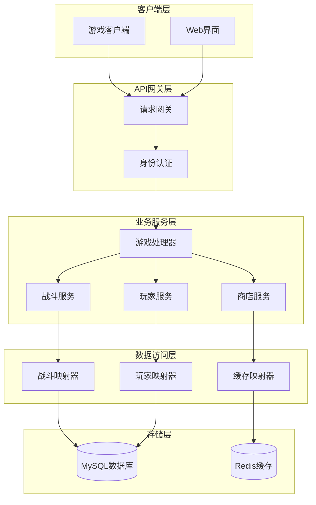
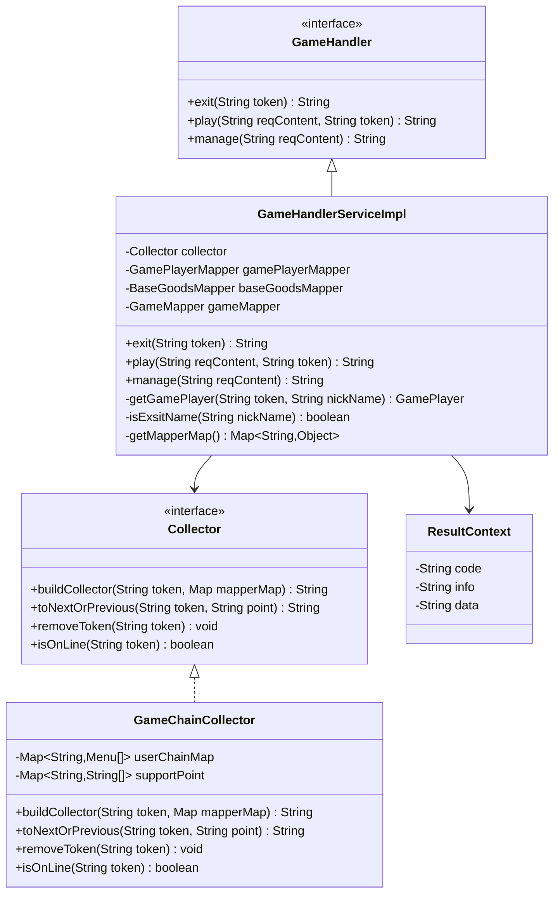
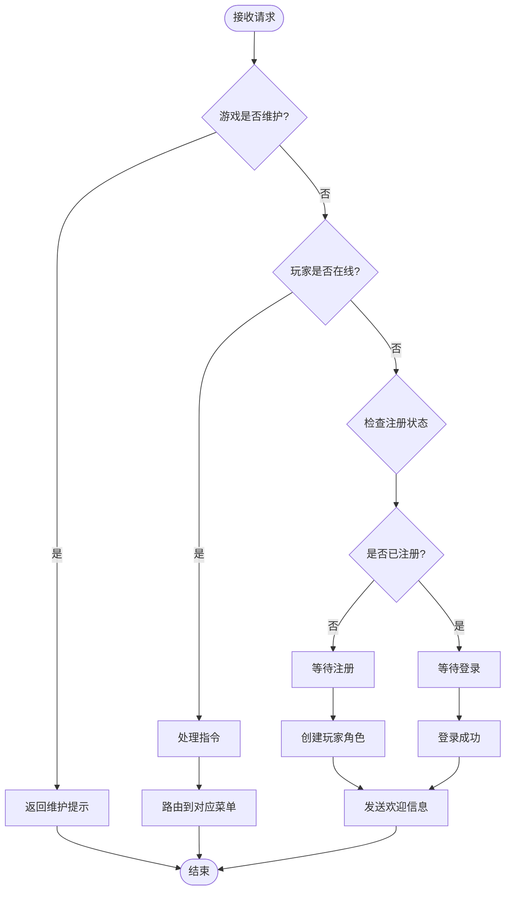
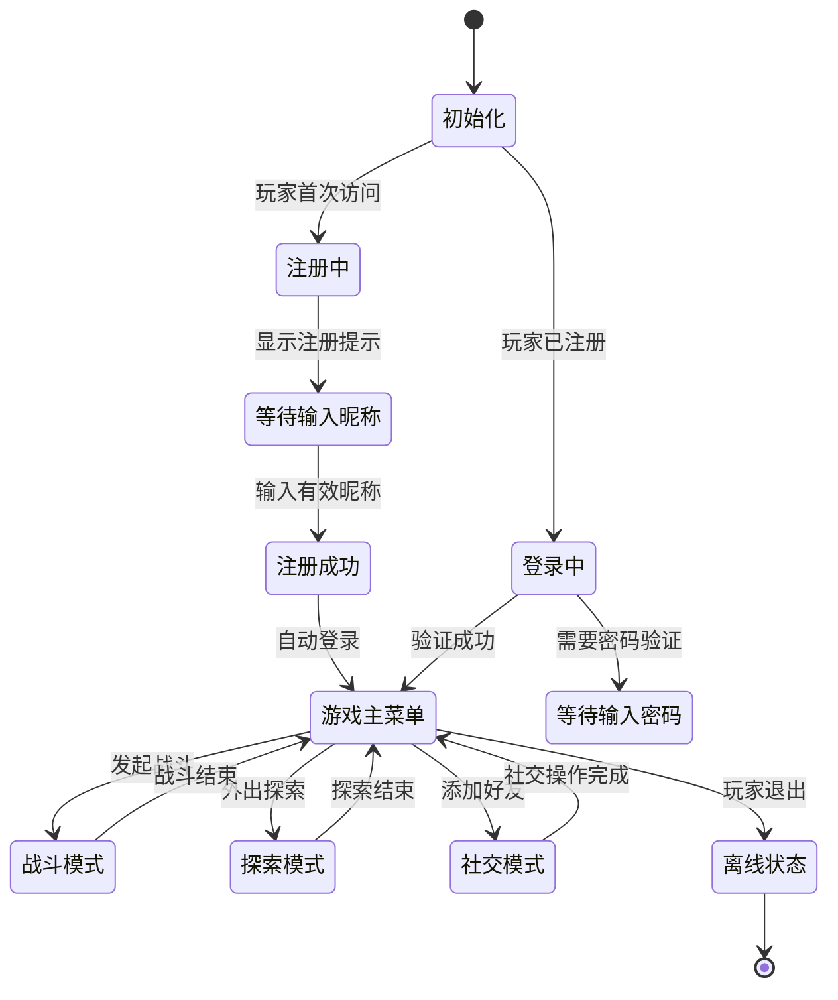
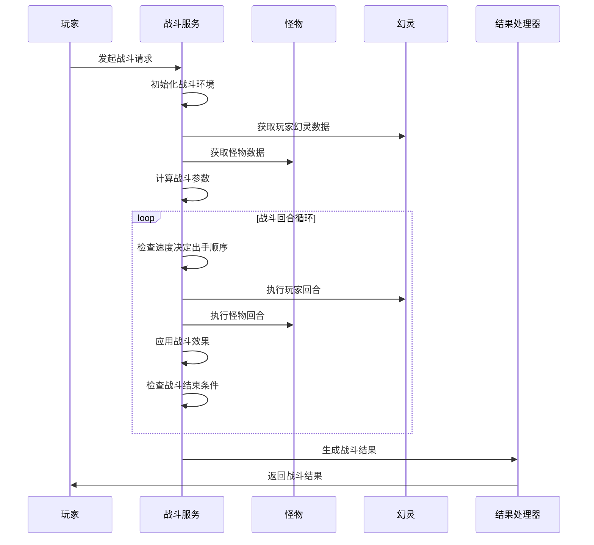
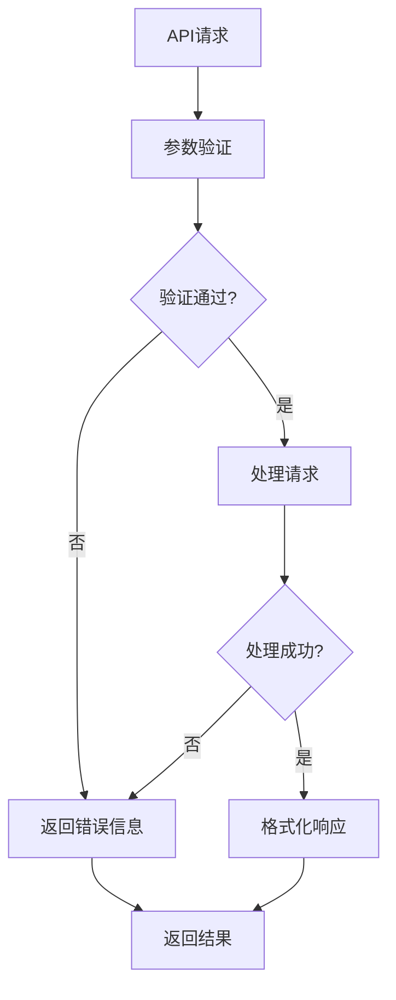
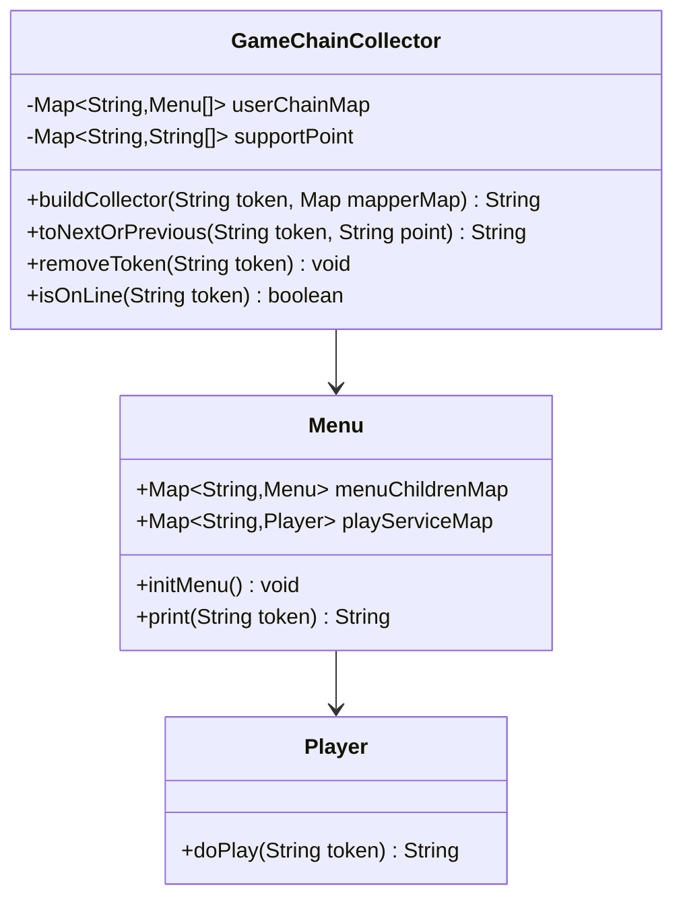
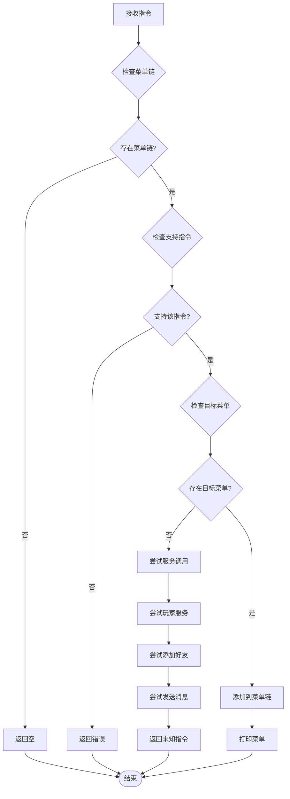
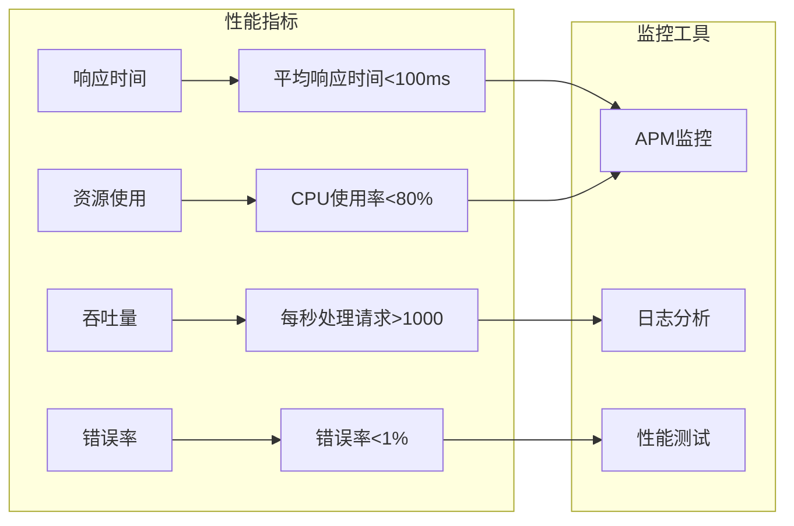
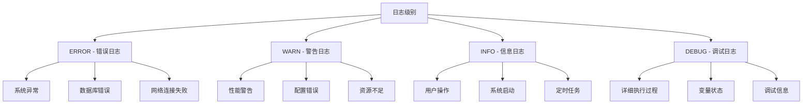

# 游戏API文档

<cite>
**本文档引用的文件**
- [GameHandlerServiceImpl.java](file://Game/src/main/java/com/bot/game/service/impl/GameHandlerServiceImpl.java)
- [GameHandler.java](file://Game/src/main/java/com/bot/game/service/GameHandler.java)
- [ResultContext.java](file://Game/src/main/java/com/bot/game/dto/ResultContext.java)
- [Collector.java](file://Base/src/main/java/com/bot/base/chain/Collector.java)
- [Collector.java](file://Game/src/main/java/com/bot/game/chain/Collector.java)
- [GameChainCollector.java](file://Game/src/main/java/com/bot/game/chain/GameChainCollector.java)
- [BattleServiceImpl.java](file://Game/src/main/java/com/bot/game/service/impl/BattleServiceImpl.java)
- [GameConsts.java](file://Common/src/main/java/com/bot/common/constant/GameConsts.java)
- [GamePlayer.java](file://Game/src/main/java/com/bot/game/dao/entity/GamePlayer.java)
- [CommonResp.java](file://Base/src/main/java/com/bot/base/dto/CommonResp.java)
- [ENRespType.java](file://Common/src/main/java/com/bot/common/enums/ENRespType.java)
</cite>

## 目录
1. [概述](#概述)
2. [系统架构](#系统架构)
3. [核心组件](#核心组件)
4. [游戏处理器服务](#游戏处理器服务)
5. [游戏状态管理](#游戏状态管理)
6. [战斗系统](#战斗系统)
7. [操作结果返回格式](#操作结果返回格式)
8. [指令收集器机制](#指令收集器机制)
9. [API调用示例](#api调用示例)
10. [性能优化与限制](#性能优化与限制)
11. [故障排除指南](#故障排除指南)

## 概述

本文档全面记录了游戏系统对外暴露的接口和服务，重点介绍了GameHandlerServiceImpl中的游戏逻辑处理方法，包括游戏状态管理、玩家交互和战斗系统等核心功能。系统采用模块化设计，通过Chain Collector模式实现复杂的菜单导航和指令处理。

游戏API提供了完整的生命周期管理，从玩家注册登录到日常游戏操作，涵盖了战斗、探索、社交、交易等所有核心功能模块。

## 系统架构



**图表来源**
- [GameHandlerServiceImpl.java](file://Game/src/main/java/com/bot/game/service/impl/GameHandlerServiceImpl.java#L28-L70)
- [GameHandler.java](file://Game/src/main/java/com/bot/game/service/GameHandler.java#L7-L29)

## 核心组件

### 组件关系图



**图表来源**
- [GameHandler.java](file://Game/src/main/java/com/bot/game/service/GameHandler.java#L7-L29)
- [GameHandlerServiceImpl.java](file://Game/src/main/java/com/bot/game/service/impl/GameHandlerServiceImpl.java#L28-L70)
- [Collector.java](file://Game/src/main/java/com/bot/game/chain/Collector.java#L9-L39)
- [GameChainCollector.java](file://Game/src/main/java/com/bot/game/chain/GameChainCollector.java#L24-L119)
- [ResultContext.java](file://Game/src/main/java/com/bot/game/dto/ResultContext.java#L10-L18)

**章节来源**
- [GameHandlerServiceImpl.java](file://Game/src/main/java/com/bot/game/service/impl/GameHandlerServiceImpl.java#L1-L191)
- [GameHandler.java](file://Game/src/main/java/com/bot/game/service/GameHandler.java#L1-L30)

## 游戏处理器服务

GameHandlerServiceImpl是游戏系统的核心处理器，负责管理玩家的游戏生命周期和各种游戏操作。

### 主要功能模块

#### 1. 玩家注册与登录
- **注册流程**: 检查玩家是否存在，不存在则引导注册
- **登录验证**: 验证玩家凭据，建立在线状态
- **初始设置**: 自动赠送唤灵符等初始道具

#### 2. 游戏状态控制
- **维护状态**: 游戏维护期间的特殊处理
- **在线状态**: 管理玩家的在线连接状态
- **会话管理**: 处理玩家退出和重新连接

#### 3. 管理员功能
- **补偿系统**: 支持灵石和道具补偿
- **批量操作**: 管理员专用的操作接口

### 核心方法实现



**图表来源**
- [GameHandlerServiceImpl.java](file://Game/src/main/java/com/bot/game/service/impl/GameHandlerServiceImpl.java#L82-L133)

**章节来源**
- [GameHandlerServiceImpl.java](file://Game/src/main/java/com/bot/game/service/impl/GameHandlerServiceImpl.java#L82-L150)

## 游戏状态管理

### 状态类型定义

系统支持多种游戏状态，每种状态对应不同的操作权限和功能可用性：

| 状态类型 | 描述 | 功能范围 |
|---------|------|----------|
| NORMAL | 正常游戏状态 | 所有游戏功能可用 |
| LOCK | 游戏维护状态 | 仅显示维护信息 |
| INACTIVE | 离线状态 | 无法进行游戏操作 |
| BATTLE | 战斗状态 | 仅战斗相关功能 |

### 玩家状态管理



**章节来源**
- [GameHandlerServiceImpl.java](file://Game/src/main/java/com/bot/game/service/impl/GameHandlerServiceImpl.java#L124-L133)
- [GameConsts.java](file://Common/src/main/java/com/bot/common/constant/GameConsts.java#L11-L48)

## 战斗系统

### 战斗流程架构



**图表来源**
- [BattleServiceImpl.java](file://Game/src/main/java/com/bot/game/service/impl/BattleServiceImpl.java#L88-L122)

### 战斗核心算法

战斗系统采用回合制战斗机制，支持以下特性：

#### 1. 属性相克系统
- **克制关系**: 金 > 木 > 土 > 水 > 火 > 金
- **伤害计算**: 根据属性相克关系调整最终伤害
- **效果倍率**: 相克时攻击力增加，被克时攻击力减少

#### 2. 技能系统
- **技能冷却**: 每个技能有独立的冷却时间
- **效果持续**: 技能效果可在多个回合内持续
- **组合效果**: 多个技能效果可叠加

#### 3. 幻灵培养
- **属性成长**: 每升一级获得固定属性点
- **技能学习**: 幻灵可学习最多3个不同技能
- **装备系统**: 幻灵可装备法宝提升能力

**章节来源**
- [BattleServiceImpl.java](file://Game/src/main/java/com/bot/game/service/impl/BattleServiceImpl.java#L1-L200)
- [GameConsts.java](file://Common/src/main/java/com/bot/common/constant/GameConsts.java#L225-L246)

## 操作结果返回格式

### ResultContext结构

ResultContext类定义了统一的操作结果返回格式，确保所有API调用都有标准化的响应结构。

| 字段 | 类型 | 描述 | 示例值 |
|------|------|------|--------|
| code | String | 状态码 | "SUCCESS" |
| info | String | 状态信息 | "操作成功" |
| data | String | 返回数据 | "具体的操作结果内容" |

### 响应类型枚举

系统支持多种响应类型，适应不同的展示需求：

| 类型 | 数值 | 描述 | 使用场景 |
|------|------|------|----------|
| TEXT | 0 | 文本消息 | 普通文字回复 |
| IMG | 1 | 图片消息 | 游戏画面截图 |
| VIDEO | 2 | 视频消息 | 动态效果展示 |
| FILE | 3 | 文件消息 | 数据文件传输 |
| AUDIO | 4 | 语音消息 | 语音对话 |

### 错误处理机制



**图表来源**
- [ResultContext.java](file://Game/src/main/java/com/bot/game/dto/ResultContext.java#L10-L18)
- [ENRespType.java](file://Common/src/main/java/com/bot/common/enums/ENRespType.java#L9-L19)

**章节来源**
- [ResultContext.java](file://Game/src/main/java/com/bot/game/dto/ResultContext.java#L1-L19)
- [ENRespType.java](file://Common/src/main/java/com/bot/common/enums/ENRespType.java#L1-L20)

## 指令收集器机制

### Collector接口设计

Collector接口定义了游戏指令收集和处理的核心机制，支持链式菜单导航和状态管理。

#### 基础Collector接口
- **buildCollector**: 构建调用链，在用户登录或退出菜单时调用
- **toNextOrPrevious**: 前往下一个或上一个菜单

#### 游戏专用Collector接口
- **removeToken**: 玩家退出时调用
- **isOnLine**: 判断玩家是否在线

### GameChainCollector实现

GameChainCollector是Collector接口的具体实现，提供了完整的菜单链路管理和指令路由功能。

#### 核心功能特性



**图表来源**
- [GameChainCollector.java](file://Game/src/main/java/com/bot/game/chain/GameChainCollector.java#L24-L119)
- [Collector.java](file://Game/src/main/java/com/bot/game/chain/Collector.java#L9-L39)

#### 指令处理流程



**图表来源**
- [GameChainCollector.java](file://Game/src/main/java/com/bot/game/chain/GameChainCollector.java#L48-L107)

**章节来源**
- [Collector.java](file://Base/src/main/java/com/bot/base/chain/Collector.java#L1-L23)
- [Collector.java](file://Game/src/main/java/com/bot/game/chain/Collector.java#L1-L40)
- [GameChainCollector.java](file://Game/src/main/java/com/bot/game/chain/GameChainCollector.java#L1-L119)

## API调用示例

### 游戏初始化流程

#### 1. 玩家注册示例

**请求格式**:
```http
POST /api/game/play
Content-Type: application/json

{
    "reqContent": "新玩家昵称",
    "token": "unique_user_token"
}
```

**响应格式**:
```json
{
    "code": "SUCCESS",
    "info": "注册成功",
    "data": "欢迎来到游戏世界，新玩家昵称！回复数字【1】进入游戏"
}
```

#### 2. 玩家登录示例

**请求格式**:
```http
POST /api/game/play
Content-Type: application/json

{
    "reqContent": "1",
    "token": "existing_user_token"
}
```

**响应格式**:
```json
{
    "code": "SUCCESS",
    "info": "登录成功",
    "data": "欢迎回来，玩家昵称！回复数字【1】进入游戏"
}
```

### 状态查询示例

#### 1. 玩家信息查询

**请求格式**:
```http
POST /api/game/play
Content-Type: application/json

{
    "reqContent": "1",  // 个人信息菜单选项
    "token": "user_token"
}
```

**响应格式**:
```
昵称：[玩家昵称]
称号：[玩家称号]
幻灵数：[幻灵数量]
战灵力：[战灵力数值]
灵石：[灵石数量]
体力：[体力数值]
法宝：[法宝名称]
```

### 操作执行示例

#### 1. 外出探索

**请求格式**:
```http
POST /api/game/play
Content-Type: application/json

{
    "reqContent": "5",  // 外出探索菜单选项
    "token": "user_token"
}
```

**响应格式**:
```
输入所要探索的地区前的编号：
1. 东海
2. 西域
3. 南疆
4. 北境
```

#### 2. 战斗操作

**请求格式**:
```http
POST /api/game/play
Content-Type: application/json

{
    "reqContent": "1",  // 普通攻击
    "token": "user_token"
}
```

**响应格式**:
```
战斗开始，玩家幻灵血量XXX，怪物血量XXX
第1回合
玩家幻灵使用了普通攻击
怪物受到XX点伤害
怪物反击，玩家幻灵受到XX点伤害
回合结束，玩家幻灵剩余血量XXX，怪物剩余血量XXX
```

### 管理员操作示例

#### 1. 补偿灵石

**请求格式**:
```http
POST /api/game/manage
Content-Type: application/json

{
    "reqContent": "补偿灵石1000"
}
```

**响应格式**:
```json
{
    "code": "SUCCESS",
    "info": "补偿成功",
    "data": "已为所有玩家补偿1000灵石"
}
```

#### 2. 补偿道具

**请求格式**:
```http
POST /api/game/manage
Content-Type: application/json

{
    "reqContent": "补偿||唤灵符||10"
}
```

**响应格式**:
```json
{
    "code": "SUCCESS",
    "info": "补偿成功",
    "data": "已为所有玩家补偿10个唤灵符"
}
```

**章节来源**
- [GameHandlerServiceImpl.java](file://Game/src/main/java/com/bot/game/service/impl/GameHandlerServiceImpl.java#L89-L150)
- [GameConsts.java](file://Common/src/main/java/com/bot/common/constant/GameConsts.java#L11-L48)

## 性能优化与限制

### 缓存策略

#### 1. JXCache缓存机制
系统实现了专门的游戏缓存机制，用于存储频繁访问的数据：

| 缓存类型 | 存储内容 | 过期策略 | 查询频率 |
|----------|----------|----------|----------|
| BASE_DATA | 基础游戏配置 | 永久存储 | 高 |
| PLAYER_STATE | 玩家状态信息 | 会话级别 | 中 |
| MONSTER_DATA | 怪物数据 | 定期刷新 | 中 |
| SHOP_ITEMS | 商店商品 | 每日刷新 | 低 |

#### 2. 内存管理
- **链式菜单缓存**: 使用HashMap存储用户菜单链，避免重复构建
- **指令支持缓存**: 缓存当前支持的指令列表，提高响应速度
- **对象池**: 对战斗相关的DTO对象使用对象池减少GC压力

### 接口调用频率限制

#### 1. 请求频率控制
- **单用户限制**: 每分钟最多100次API调用
- **并发控制**: 同时最多5个活跃会话
- **战斗频率**: 每场战斗至少间隔1秒

#### 2. 资源使用限制
- **内存使用**: 单个会话最大占用50MB内存
- **数据库连接**: 使用连接池，最大连接数50
- **缓存大小**: Redis缓存单个键值不超过1MB

### 性能监控指标



**章节来源**
- [JXCache.java](file://Game/src/main/java/com/bot/game/dao/entity/JXCache.java#L48-L238)

## 故障排除指南

### 常见问题及解决方案

#### 1. 游戏维护状态
**问题现象**: 玩家收到"游戏维护中"提示
**解决方案**: 
- 检查游戏状态配置
- 确认维护时间设置
- 验证维护消息配置

#### 2. 登录失败
**问题现象**: 玩家无法正常登录
**排查步骤**:
1. 检查玩家数据是否存在
2. 验证token有效性
3. 确认数据库连接状态

#### 3. 战斗异常
**问题现象**: 战斗过程中出现异常中断
**排查步骤**:
1. 检查战斗数据完整性
2. 验证玩家幻灵状态
3. 确认怪物数据有效性

#### 4. 缓存失效
**问题现象**: 游戏数据显示异常
**解决方案**:
1. 清理相关缓存数据
2. 重建缓存索引
3. 检查缓存配置

### 错误代码对照表

| 错误代码 | 含义 | 解决方案 |
|----------|------|----------|
| 400 | 请求参数错误 | 检查请求格式和参数 |
| 401 | 权限不足 | 验证用户身份和权限 |
| 404 | 资源不存在 | 检查数据是否存在 |
| 500 | 系统内部错误 | 查看服务器日志 |
| 503 | 服务不可用 | 检查服务状态和资源 |

### 日志记录规范

系统采用分级日志记录机制：



**章节来源**
- [GameHandlerServiceImpl.java](file://Game/src/main/java/com/bot/game/service/impl/GameHandlerServiceImpl.java#L90-L95)
- [GameConsts.java](file://Common/src/main/java/com/bot/common/constant/GameConsts.java#L281-L285)

## 结论

游戏API系统通过模块化设计和清晰的职责分离，提供了完整的游戏功能支持。GameHandlerServiceImpl作为核心处理器，结合Chain Collector模式和ResultContext统一响应格式，确保了系统的可扩展性和维护性。

系统的主要优势包括：
- **模块化架构**: 各功能模块职责明确，便于维护和扩展
- **统一响应格式**: ResultContext确保所有API调用的一致性
- **灵活的状态管理**: 支持多种游戏状态和玩家状态
- **完善的错误处理**: 提供详细的错误信息和恢复机制
- **性能优化**: 通过缓存和资源管理确保系统性能

未来可以考虑的改进方向：
- 引入更智能的缓存策略
- 增强实时通信能力
- 优化大数据量处理性能
- 加强安全防护机制