# 流程控制API

<cite>
**本文档引用的文件**
- [GameHandlerServiceImpl.java](file://Game/src/main/java/com/bot/game/service/impl/GameHandlerServiceImpl.java)
- [GameChainCollector.java](file://Game/src/main/java/com/bot/game/chain/GameChainCollector.java)
- [Collector.java](file://Game/src/main/java/com/bot/game/chain/Collector.java)
- [GameMainMenuPrinter.java](file://Game/src/main/java/com/bot/game/chain/menu/GameMainMenuPrinter.java)
- [Menu.java](file://Game/src/main/java/com/bot/game/chain/Menu.java)
- [GameHandler.java](file://Game/src/main/java/com/bot/game/service/GameHandler.java)
- [BattleServiceImpl.java](file://Game/src/main/java/com/bot/game/service/impl/BattleServiceImpl.java)
- [GameConsts.java](file://Common/src/main/java/com/bot/common/constant/GameConsts.java)
- [BaseConsts.java](file://Common/src/main/java/com/bot/common/constant/BaseConsts.java)
</cite>

## 目录
1. [概述](#概述)
2. [架构设计](#架构设计)
3. [核心接口分析](#核心接口分析)
4. [Collector接口实现机制](#collector接口实现机制)
5. [状态流转控制逻辑](#状态流转控制逻辑)
6. [完整交互序列](#完整交互序列)
7. [异常处理与恢复机制](#异常处理与恢复机制)
8. [性能优化考虑](#性能优化考虑)
9. [总结](#总结)

## 概述

Bot项目的游戏流程控制API是一个基于责任链模式的状态管理系统，通过Collector接口及其具体实现类GameChainCollector，实现了玩家游戏状态的完整生命周期管理。该系统支持玩家从注册登录到游戏退出的全流程控制，包括菜单导航、状态验证、会话管理和异常恢复等功能。

## 架构设计

### 系统架构图

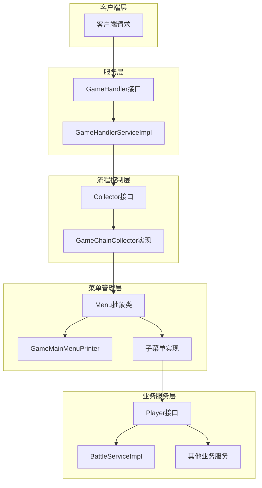

**图表来源**
- [GameHandlerServiceImpl.java](file://Game/src/main/java/com/bot/game/service/impl/GameHandlerServiceImpl.java#L27-L189)
- [GameChainCollector.java](file://Game/src/main/java/com/bot/game/chain/GameChainCollector.java#L24-L119)
- [Collector.java](file://Game/src/main/java/com/bot/game/chain/Collector.java#L8-L38)

### 核心组件关系图

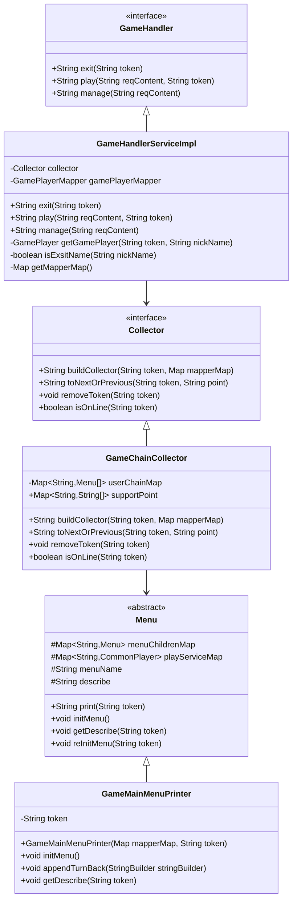

**图表来源**
- [GameHandler.java](file://Game/src/main/java/com/bot/game/service/GameHandler.java#L7-L28)
- [GameHandlerServiceImpl.java](file://Game/src/main/java/com/bot/game/service/impl/GameHandlerServiceImpl.java#L27-L189)
- [Collector.java](file://Game/src/main/java/com/bot/game/chain/Collector.java#L8-L38)
- [GameChainCollector.java](file://Game/src/main/java/com/bot/game/chain/GameChainCollector.java#L24-L119)
- [Menu.java](file://Game/src/main/java/com/bot/game/chain/Menu.java#L19-L76)

## 核心接口分析

### Collector接口设计

Collector接口定义了游戏流程控制的核心方法，包含了四个关键操作：

#### buildCollector方法
负责在玩家首次进入游戏时构建调用链，初始化菜单结构。

#### toNextOrPrevious方法  
实现在游戏过程中的菜单跳转功能，支持前进和后退操作。

#### removeToken方法  
在玩家退出游戏时清理会话信息，释放资源。

#### isOnLine方法  
用于状态校验，判断玩家是否处于在线状态。

**章节来源**
- [Collector.java](file://Game/src/main/java/com/bot/game/chain/Collector.java#L8-L38)

### GameHandler接口职责

GameHandler接口作为服务层入口，定义了游戏的主要业务方法：

- **exit方法**：处理玩家退出请求
- **play方法**：处理游戏主流程逻辑
- **manage方法**：处理管理员操作

**章节来源**
- [GameHandler.java](file://Game/src/main/java/com/bot/game/service/GameHandler.java#L7-L28)

## Collector接口实现机制

### buildCollector方法实现机制

buildCollector方法是流程控制的核心入口，其实现机制如下：

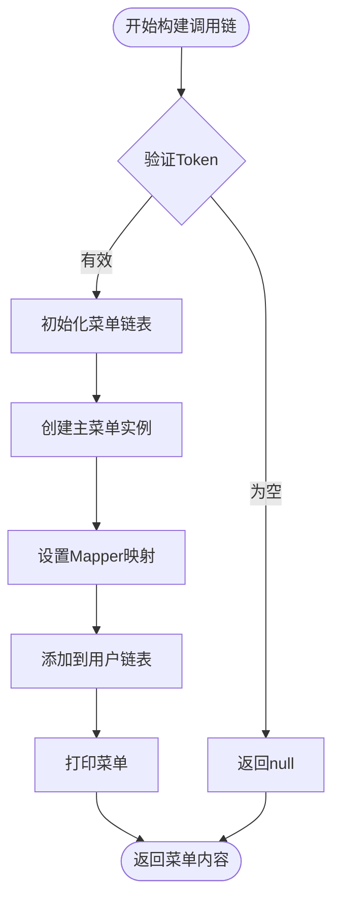

**图表来源**
- [GameChainCollector.java](file://Game/src/main/java/com/bot/game/chain/GameChainCollector.java#L34-L44)

#### 实现特点

1. **Token验证**：确保传入的用户标识有效
2. **链表初始化**：创建新的菜单链表结构
3. **主菜单创建**：基于GameMainMenuPrinter构建初始菜单
4. **Mapper注入**：将数据库访问层注入到菜单中
5. **状态存储**：将构建的链表存储到全局映射中

**章节来源**
- [GameChainCollector.java](file://Game/src/main/java/com/bot/game/chain/GameChainCollector.java#L34-L44)

### toNextOrPrevious方法实现机制

toNextOrPrevious方法实现了复杂的菜单导航逻辑：

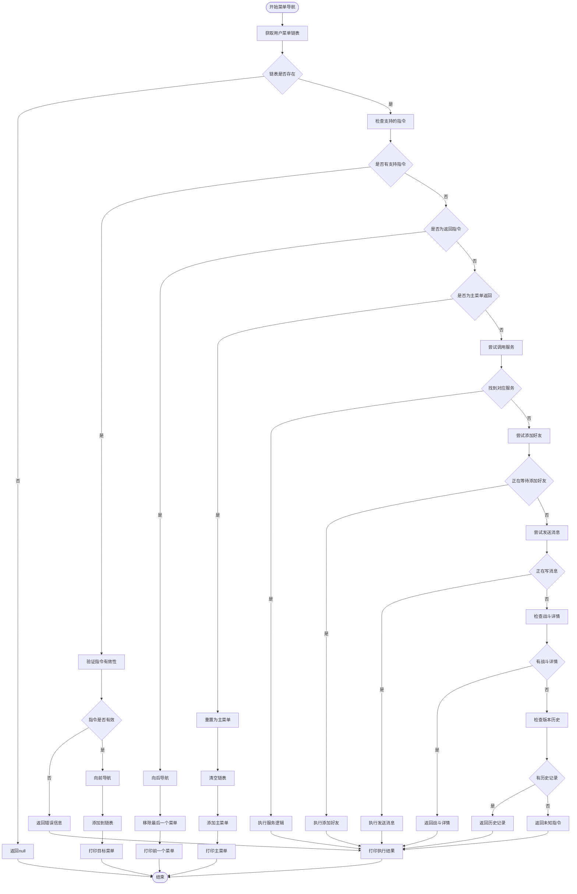

**图表来源**
- [GameChainCollector.java](file://Game/src/main/java/com/bot/game/chain/GameChainCollector.java#L47-L107)

#### 导航策略

1. **支持指令验证**：检查当前输入是否在允许的指令范围内
2. **菜单层级导航**：支持多层级菜单的前进和后退
3. **服务集成**：支持直接调用业务服务
4. **特殊指令处理**：处理返回、主菜单返回等特殊指令
5. **动态服务调用**：支持运行时动态绑定业务服务

**章节来源**
- [GameChainCollector.java](file://Game/src/main/java/com/bot/game/chain/GameChainCollector.java#L47-L107)

### removeToken方法实现机制

removeToken方法负责清理玩家的会话信息：

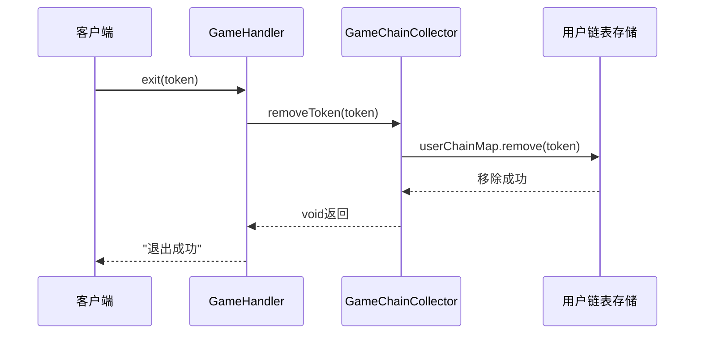

**图表来源**
- [GameChainCollector.java](file://Game/src/main/java/com/bot/game/chain/GameChainCollector.java#L109-L112)
- [GameHandlerServiceImpl.java](file://Game/src/main/java/com/bot/game/service/impl/GameHandlerServiceImpl.java#L82-L84)

**章节来源**
- [GameChainCollector.java](file://Game/src/main/java/com/bot/game/chain/GameChainCollector.java#L109-L112)

### isOnLine方法实现机制

isOnLine方法用于状态校验：

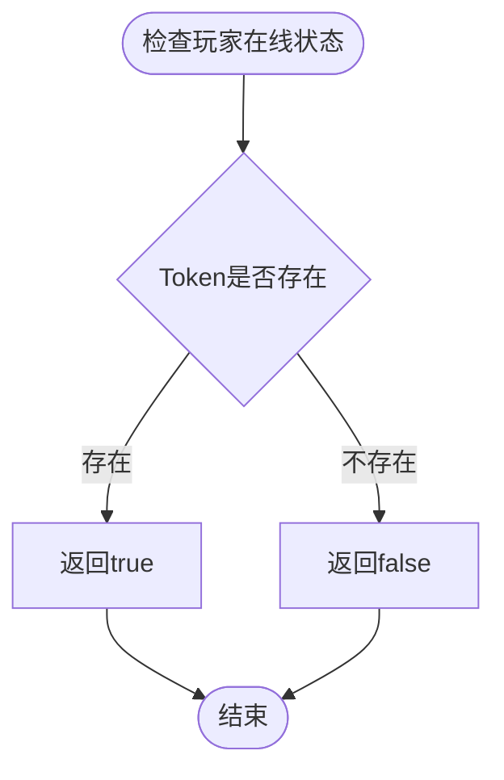

**图表来源**
- [GameChainCollector.java](file://Game/src/main/java/com/bot/game/chain/GameChainCollector.java#L114-L117)

**章节来源**
- [GameChainCollector.java](file://Game/src/main/java/com/bot/game/chain/GameChainCollector.java#L114-L117)

## 状态流转控制逻辑

### 游戏状态机转换图

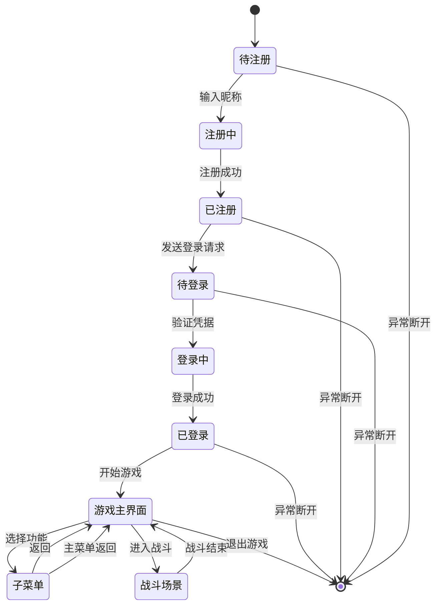

### GameHandlerServiceImpl中的状态控制

GameHandlerServiceImpl通过play方法实现了复杂的状态控制逻辑：

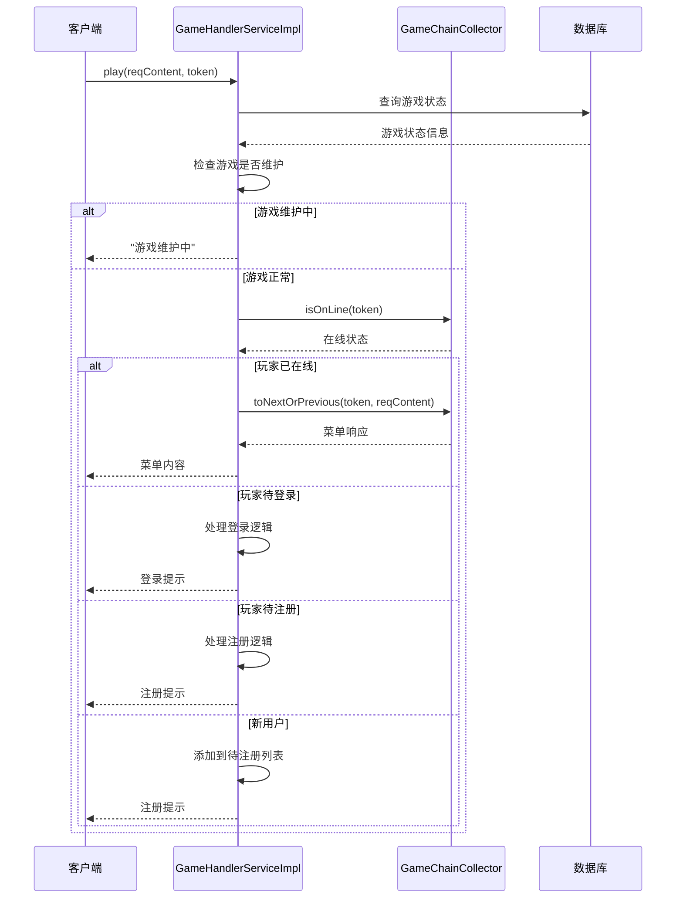

**图表来源**
- [GameHandlerServiceImpl.java](file://Game/src/main/java/com/bot/game/service/impl/GameHandlerServiceImpl.java#L88-L131)

**章节来源**
- [GameHandlerServiceImpl.java](file://Game/src/main/java/com/bot/game/service/impl/GameHandlerServiceImpl.java#L88-L131)

## 完整交互序列

### 玩家首次进入游戏流程

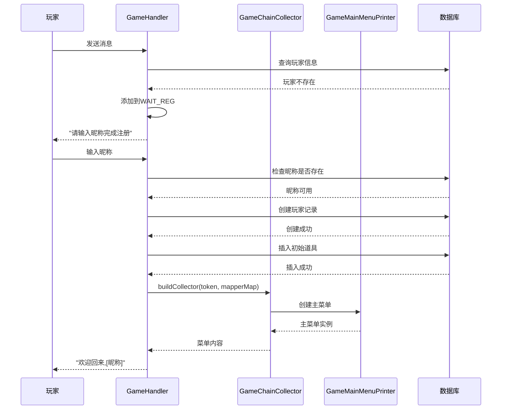

**图表来源**
- [GameHandlerServiceImpl.java](file://Game/src/main/java/com/bot/game/service/impl/GameHandlerServiceImpl.java#L124-L121)
- [GameChainCollector.java](file://Game/src/main/java/com/bot/game/chain/GameChainCollector.java#L34-L44)

### 游戏过程中的菜单导航

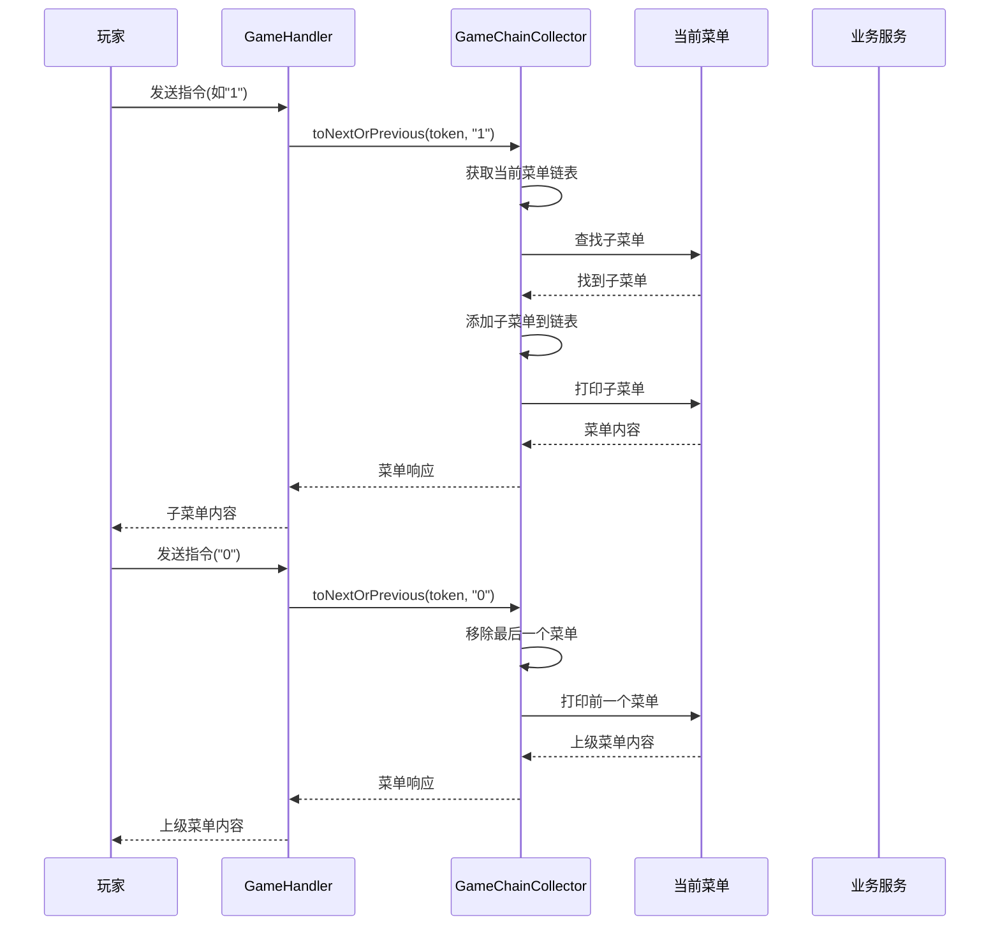

**图表来源**
- [GameChainCollector.java](file://Game/src/main/java/com/bot/game/chain/GameChainCollector.java#L47-L107)

### 玩家退出游戏流程

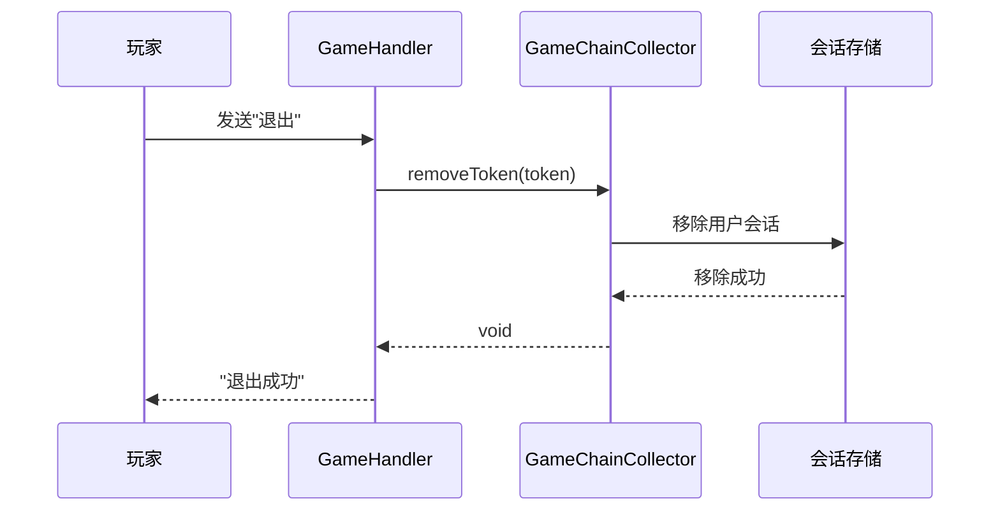

**图表来源**
- [GameHandlerServiceImpl.java](file://Game/src/main/java/com/bot/game/service/impl/GameHandlerServiceImpl.java#L82-L84)
- [GameChainCollector.java](file://Game/src/main/java/com/bot/game/chain/GameChainCollector.java#L109-L112)

## 异常处理与恢复机制

### 异常中断处理

系统提供了多层次的异常处理机制：

#### Token验证异常
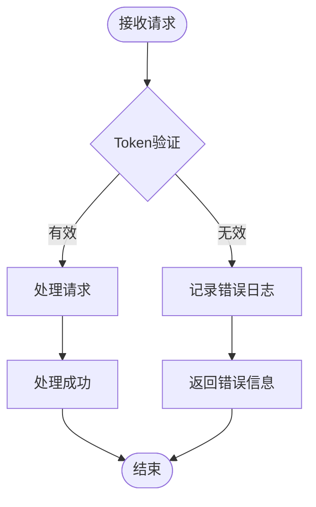

#### 状态校验异常
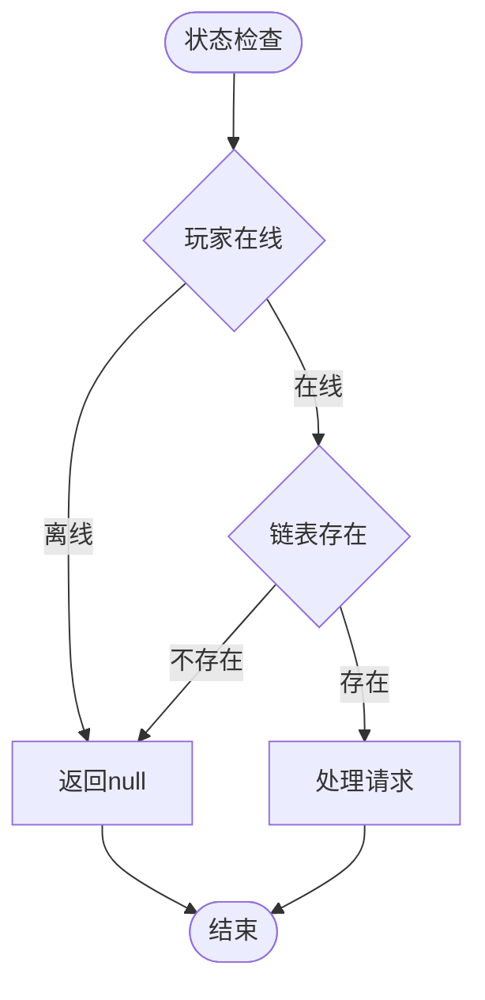

**章节来源**
- [GameChainCollector.java](file://Game/src/main/java/com/bot/game/chain/GameChainCollector.java#L47-L107)

### 会话恢复机制

#### 自动恢复策略
1. **链表重建**：当链表丢失时，尝试重建菜单结构
2. **状态同步**：通过数据库同步玩家状态
3. **缓存清理**：定期清理无效的会话缓存

#### 异常恢复流程
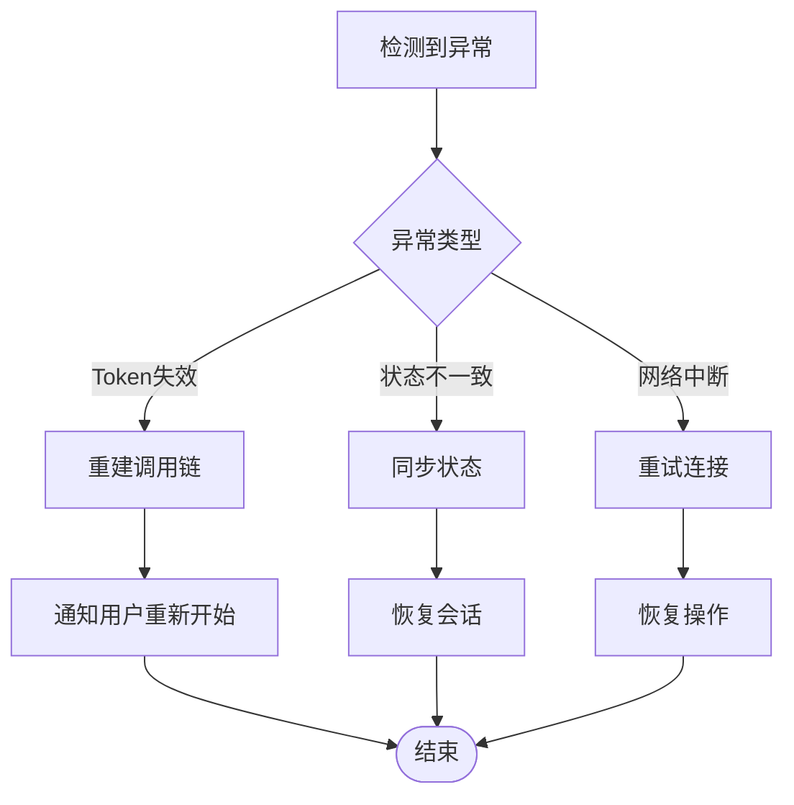

### 错误响应机制

系统提供了统一的错误响应格式：

| 错误类型 | 响应内容 | 处理方式 |
|---------|---------|---------|
| 未知指令 | "未知指令，回复【0】返回上级菜单，【00】返回主菜单" | 提供导航选项 |
| 指令错误 | "指令错误，请输入正确的指令" | 保持当前状态 |
| 游戏维护 | "当前游戏维护中，请稍后再来" | 提示用户等待 |
| 网络异常 | "网络连接异常，请重试" | 建议重新连接 |

**章节来源**
- [GameConsts.java](file://Common/src/main/java/com/bot/common/constant/GameConsts.java#L12-L48)

## 性能优化考虑

### 内存管理优化

1. **链表复用**：通过静态Map复用菜单链表对象
2. **及时清理**：removeToken方法确保会话结束后立即清理内存
3. **弱引用**：对于长时间不活跃的会话使用弱引用

### 并发控制优化

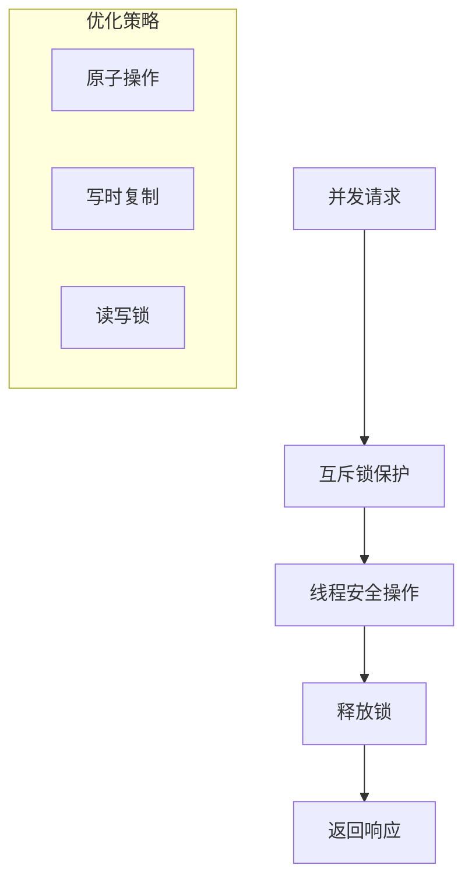

### 缓存策略

1. **菜单缓存**：缓存常用的菜单结构
2. **状态缓存**：缓存玩家状态信息
3. **Mapper缓存**：缓存数据库访问层对象

## 总结

Bot项目的流程控制API通过Collector接口和GameChainCollector实现类，构建了一个完整的游戏状态管理系统。该系统具有以下特点：

### 核心优势

1. **清晰的职责分离**：GameHandler负责业务逻辑，Collector负责流程控制
2. **灵活的状态管理**：支持多种游戏状态和状态间的平滑转换
3. **完善的异常处理**：多层次的异常捕获和恢复机制
4. **良好的扩展性**：基于接口的设计便于功能扩展

### 技术亮点

1. **责任链模式**：实现菜单导航的灵活控制
2. **状态机设计**：清晰表达游戏状态流转
3. **服务集成**：无缝集成业务服务
4. **会话管理**：完善的会话生命周期管理

### 应用价值

该流程控制API不仅适用于当前的游戏场景，其设计理念和实现方式可以推广到其他需要复杂状态管理的应用系统中，为开发者提供了一个优秀的参考实现。