# 游戏状态API文档

<cite>
**本文档引用的文件**
- [Collector.java](file://Base/src/main/java/com/bot/base/chain/Collector.java)
- [ChainCollector.java](file://Base/src/main/java/com/bot/base/chain/ChainCollector.java)
- [GameChainCollector.java](file://Game/src/main/java/com/bot/game/chain/GameChainCollector.java)
- [ResultContext.java](file://Game/src/main/java/com/bot/game/dto/ResultContext.java)
- [Menu.java](file://Base/src/main/java/com/bot/base/chain/Menu.java)
- [MenuPrinter.java](file://Base/src/main/java/com/bot/base/chain/MenuPrinter.java)
- [GameMainMenuPrinter.java](file://Game/src/main/java/com/bot/game/chain/menu/GameMainMenuPrinter.java)
- [GameHandlerServiceImpl.java](file://Game/src/main/java/com/bot/game/service/impl/GameHandlerServiceImpl.java)
- [SystemManager.java](file://Base/src/main/java/com/bot/base/service/SystemManager.java)
- [StatusMonitor.java](file://Base/src/main/java/com/bot/base/service/StatusMonitor.java)
- [ENStatus.java](file://Common/src/main/java/com/bot/common/enums/ENStatus.java)
- [ENUserGameStatus.java](file://Common/src/main/java/com/bot/common/enums/ENUserGameStatus.java)
- [ENGameMode.java](file://Life/src/main/java/com/bot/life/enums/ENGameMode.java)
- [LifeGameStatus.java](file://Life/src/main/java/com/bot/life/dao/entity/LifeGameStatus.java)
</cite>

## 目录
1. [简介](#简介)
2. [项目结构概览](#项目结构概览)
3. [核心组件分析](#核心组件分析)
4. [架构概览](#架构概览)
5. [详细组件分析](#详细组件分析)
6. [游戏状态流转机制](#游戏状态流转机制)
7. [状态管理策略](#状态管理策略)
8. [API调用示例](#api调用示例)
9. [故障排除指南](#故障排除指南)
10. [总结](#总结)

## 简介

本文档详细介绍了Bot项目中的游戏状态管理系统，重点阐述了Collector类在游戏流程链式处理中的核心作用，以及ResultContext类作为统一返回结果封装的设计理念。该系统采用状态机模式实现了复杂的游戏流程控制，支持多种游戏状态的管理和维护。

## 项目结构概览

Bot项目采用模块化架构设计，主要包含以下核心模块：

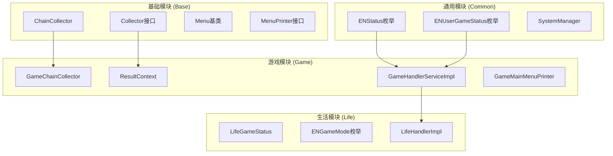

**图表来源**
- [ChainCollector.java](file://Base/src/main/java/com/bot/base/chain/ChainCollector.java#L1-L58)
- [GameChainCollector.java](file://Game/src/main/java/com/bot/game/chain/GameChainCollector.java#L1-L119)
- [ResultContext.java](file://Game/src/main/java/com/bot/game/dto/ResultContext.java#L1-L19)

## 核心组件分析

### Collector接口设计

Collector接口定义了游戏流程链式处理的核心契约，包含两个关键方法：

| 方法名 | 参数 | 返回类型 | 功能描述 |
|--------|------|----------|----------|
| buildCollector | String token | String | 构建调用链，在用户登录或退出菜单时调用 |
| toNextOrPrevious | String token, String point | String | 前往下一个或上一个菜单 |

**章节来源**
- [Collector.java](file://Base/src/main/java/com/bot/base/chain/Collector.java#L7-L22)

### ChainCollector实现

ChainCollector是基础链式收集器的实现，负责维护用户会话链路：

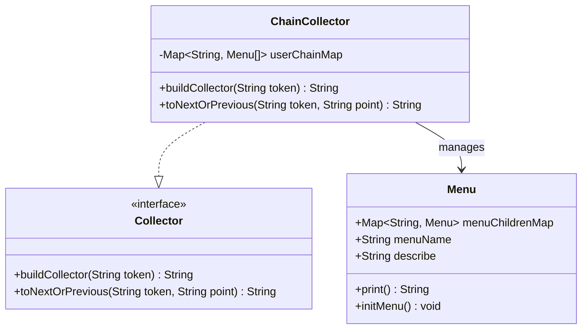

**图表来源**
- [ChainCollector.java](file://Base/src/main/java/com/bot/base/chain/ChainCollector.java#L18-L57)
- [Menu.java](file://Base/src/main/java/com/bot/base/chain/Menu.java#L15-L55)

**章节来源**
- [ChainCollector.java](file://Base/src/main/java/com/bot/base/chain/ChainCollector.java#L24-L56)

### GameChainCollector增强版

GameChainCollector扩展了基础功能，增加了游戏特定的状态管理和指令验证：

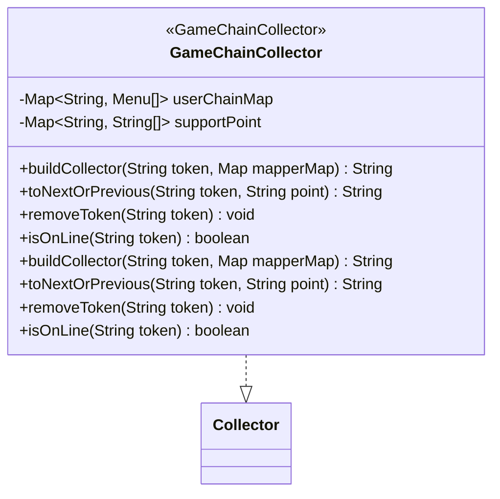

**图表来源**
- [GameChainCollector.java](file://Game/src/main/java/com/bot/game/chain/GameChainCollector.java#L24-L118)

**章节来源**
- [GameChainCollector.java](file://Game/src/main/java/com/bot/game/chain/GameChainCollector.java#L34-L118)

## 架构概览

系统采用分层架构设计，通过状态机模式实现游戏流程控制：

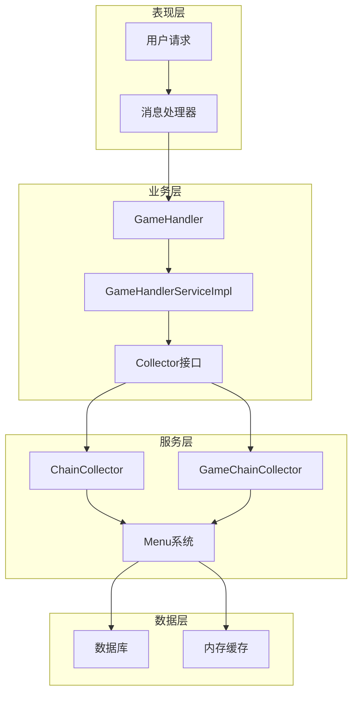

**图表来源**
- [GameHandlerServiceImpl.java](file://Game/src/main/java/com/bot/game/service/impl/GameHandlerServiceImpl.java#L27-L191)
- [ChainCollector.java](file://Base/src/main/java/com/bot/base/chain/ChainCollector.java#L18-L57)

## 详细组件分析

### ResultContext统一返回封装

ResultContext类作为统一的返回结果封装，提供了标准化的数据传输格式：

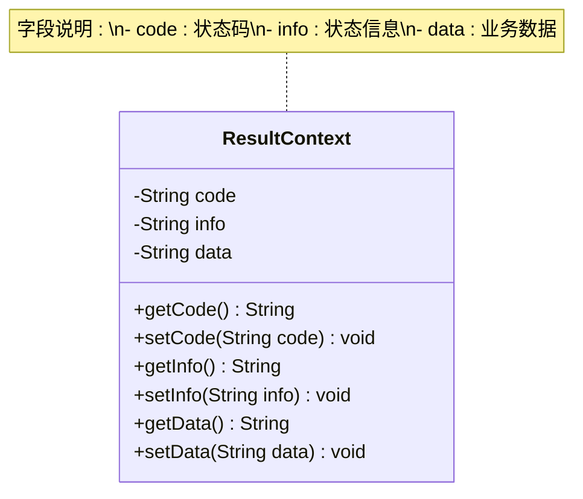

**图表来源**
- [ResultContext.java](file://Game/src/main/java/com/bot/game/dto/ResultContext.java#L10-L18)

**章节来源**
- [ResultContext.java](file://Game/src/main/java/com/bot/game/dto/ResultContext.java#L10-L18)

### Menu菜单系统

Menu类是菜单系统的基类，提供了菜单树形结构的构建和展示功能：

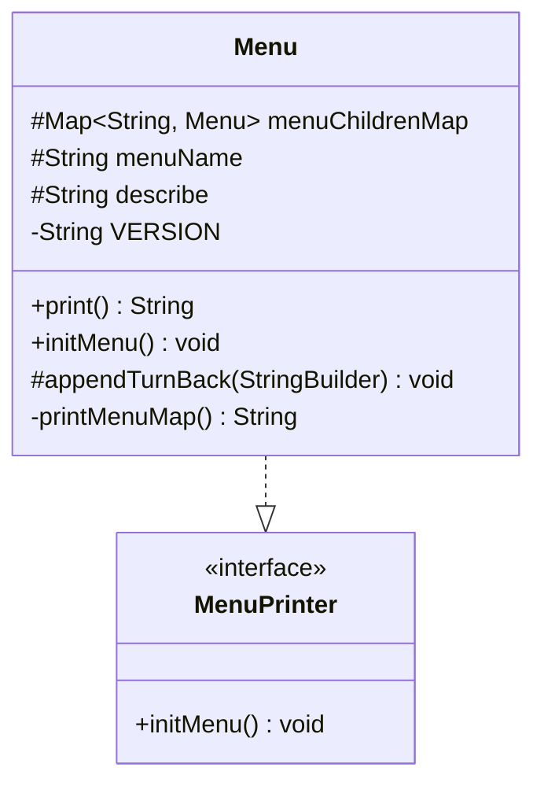

**图表来源**
- [Menu.java](file://Base/src/main/java/com/bot/base/chain/Menu.java#L15-L55)
- [MenuPrinter.java](file://Base/src/main/java/com/bot/base/chain/MenuPrinter.java#L7-L14)

**章节来源**
- [Menu.java](file://Base/src/main/java/com/bot/base/chain/Menu.java#L15-L55)

### GameMainMenuPrinter主菜单实现

GameMainMenuPrinter展示了如何构建具体的游戏菜单：

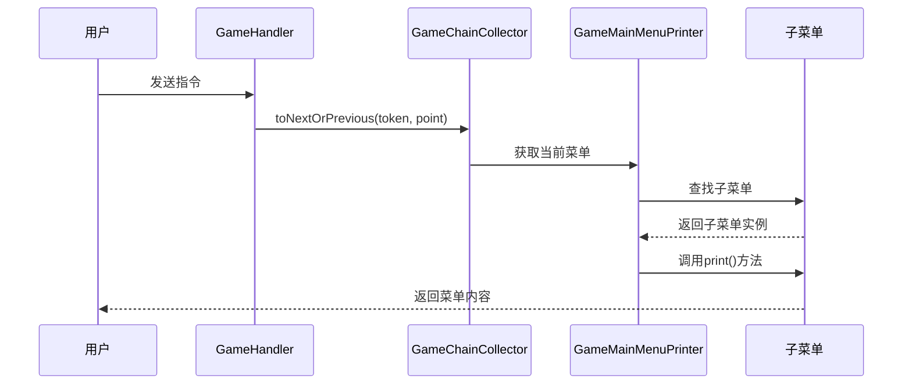

**图表来源**
- [GameMainMenuPrinter.java](file://Game/src/main/java/com/bot/game/chain/menu/GameMainMenuPrinter.java#L26-L49)
- [GameHandlerServiceImpl.java](file://Game/src/main/java/com/bot/game/service/impl/GameHandlerServiceImpl.java#L95-L106)

**章节来源**
- [GameMainMenuPrinter.java](file://Game/src/main/java/com/bot/game/chain/menu/GameMainMenuPrinter.java#L26-L49)

## 游戏状态流转机制

### 基础状态流转

系统通过ChainCollector实现基础的状态流转控制：

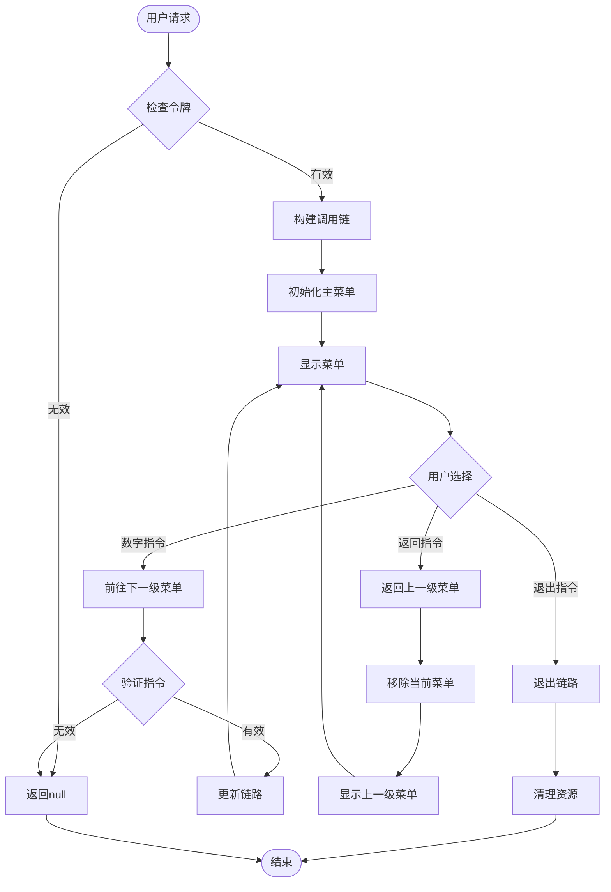

**图表来源**
- [ChainCollector.java](file://Base/src/main/java/com/bot/base/chain/ChainCollector.java#L25-L56)

### 游戏状态机

GameChainCollector实现了更复杂的游戏状态机：

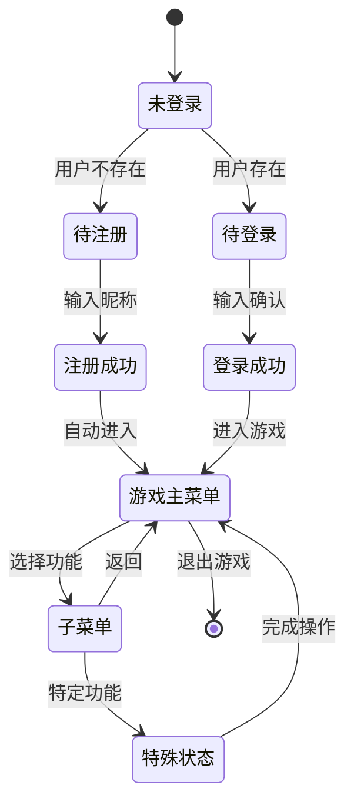

**图表来源**
- [GameHandlerServiceImpl.java](file://Game/src/main/java/com/bot/game/service/impl/GameHandlerServiceImpl.java#L89-L133)

**章节来源**
- [GameHandlerServiceImpl.java](file://Game/src/main/java/com/bot/game/service/impl/GameHandlerServiceImpl.java#L89-L133)

### 生活游戏状态机

Life模块展示了更复杂的状态管理：

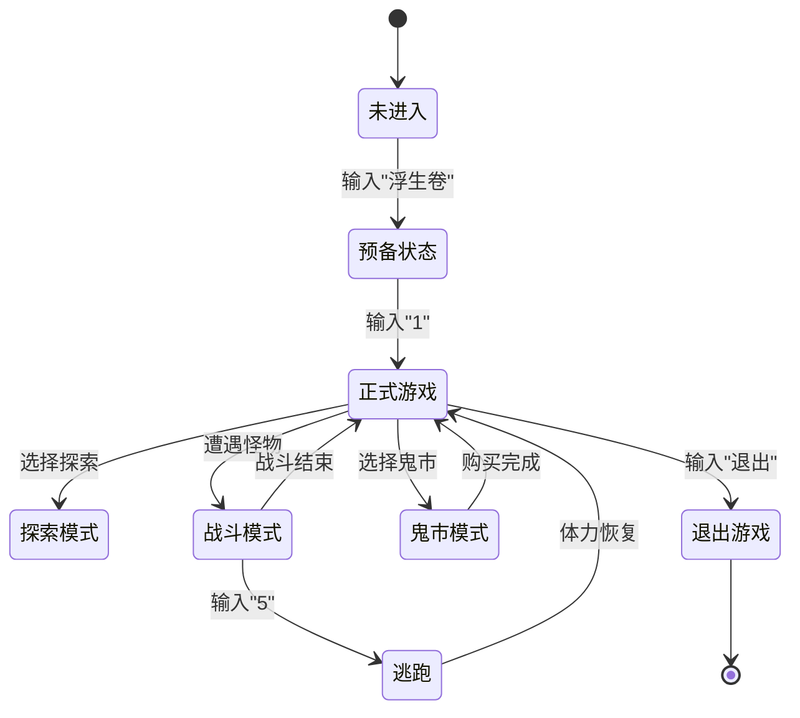

**图表来源**
- [ENGameMode.java](file://Life/src/main/java/com/bot/life/enums/ENGameMode.java#L8-L12)
- [LifeGameStatus.java](file://Life/src/main/java/com/bot/life/dao/entity/LifeGameStatus.java#L15-L16)

**章节来源**
- [ENGameMode.java](file://Life/src/main/java/com/bot/life/enums/ENGameMode.java#L8-L37)

## 状态管理策略

### 全局状态管理

SystemManager提供了系统级别的状态管理功能：

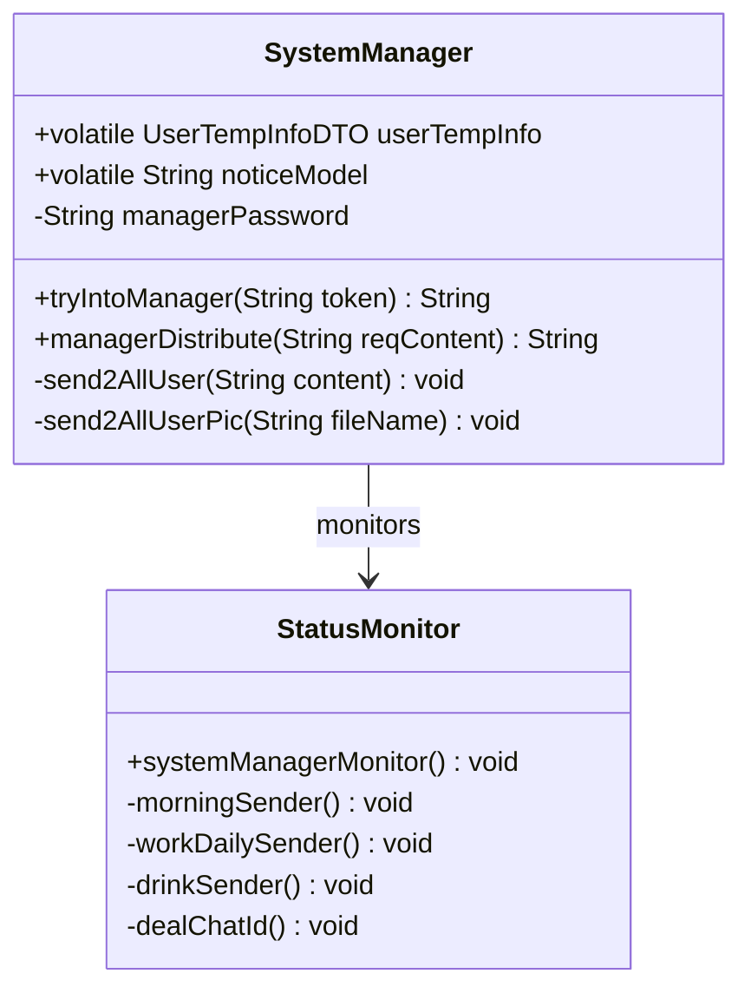

**图表来源**
- [SystemManager.java](file://Base/src/main/java/com/bot/base/service/SystemManager.java#L46-L299)
- [StatusMonitor.java](file://Base/src/main/java/com/bot/base/service/StatusMonitor.java#L45-L103)

**章节来源**
- [SystemManager.java](file://Base/src/main/java/com/bot/base/service/SystemManager.java#L46-L299)

### 游戏维护状态控制

系统提供了灵活的游戏维护状态控制机制：

| 状态枚举 | 值 | 描述 | 控制方式 |
|----------|----|----- |----------|
| NORMAL | 0 | 正常运行 | 默认状态 |
| LOCK | 1 | 维护锁定 | 管理员控制 |

**章节来源**
- [ENStatus.java](file://Common/src/main/java/com/bot/common/enums/ENStatus.java#L10-L14)

### 用户游戏状态管理

ENUserGameStatus枚举定义了用户的参与状态：

| 状态枚举 | 值 | 描述 | 使用场景 |
|----------|----|----- |----------|
| WAIT_JOIN | 0 | 等待加入 | 准备参与游戏 |
| JOINED | 1 | 已加入 | 已参与游戏 |

**章节来源**
- [ENUserGameStatus.java](file://Common/src/main/java/com/bot/common/enums/ENUserGameStatus.java#L14-L16)

## API调用示例

### 基础菜单导航API

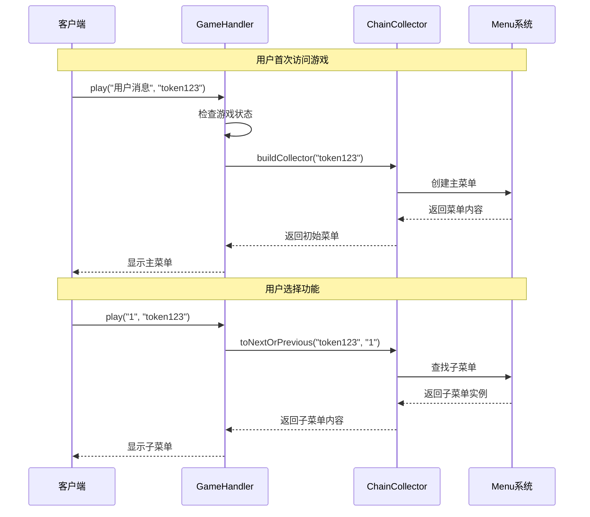

**图表来源**
- [GameHandlerServiceImpl.java](file://Game/src/main/java/com/bot/game/service/impl/GameHandlerServiceImpl.java#L95-L106)
- [ChainCollector.java](file://Base/src/main/java/com/bot/base/chain/ChainCollector.java#L25-L56)

### 游戏状态切换API

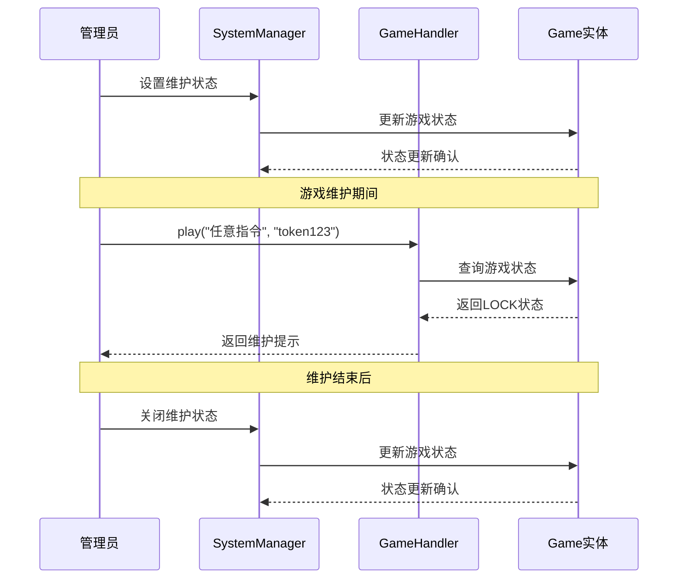

**图表来源**
- [GameHandlerServiceImpl.java](file://Game/src/main/java/com/bot/game/service/impl/GameHandlerServiceImpl.java#L90-L94)
- [SystemManager.java](file://Base/src/main/java/com/bot/base/service/SystemManager.java#L105-L279)

### 系统管理API

系统管理功能提供了完整的状态控制能力：

| 管理指令 | 功能描述 | 示例 |
|----------|----------|------|
| 密码认证 | 进入管理模式 | 输入管理密码 |
| 发布公告 | 向所有用户发送消息 | SEND_NOTICE |
| 刷新文本 | 重新加载配置文本 | RELOAD_TEXT |
| 生成邀请码 | 创建用户注册邀请码 | CREATE_INVITE_CODE day count |
| 游戏管理 | 执行游戏相关操作 | GAME_MANAGER 操作内容 |

**章节来源**
- [SystemManager.java](file://Base/src/main/java/com/bot/base/service/SystemManager.java#L105-L279)

## 故障排除指南

### 常见问题及解决方案

#### 1. 游戏状态异常

**问题现象**: 用户收到"游戏状态异常，请重新进入"提示

**排查步骤**:
1. 检查游戏维护状态
2. 验证用户令牌有效性
3. 检查菜单链路完整性

**解决方案**:
```java
// 检查游戏状态
Game game = gameMapper.selectAll().get(0);
if (ENStatus.LOCK.getValue().equals(game.getStatus())) {
    return GameConsts.CommonTip.LOCK;
}

// 验证用户状态
if (!collector.isOnLine(token)) {
    return collector.buildCollector(token, mapperMap);
}
```

#### 2. 菜单导航失效

**问题现象**: 用户无法正常切换菜单

**排查步骤**:
1. 检查supportPoint配置
2. 验证菜单指令合法性
3. 检查菜单树结构

**解决方案**:
```java
// 验证指令支持性
List<String> supports = supportPoint.get(token);
if (supports != null && !supports.contains(point)) {
    return GameConsts.CommonTip.ERROR_POINT;
}
```

#### 3. 状态同步问题

**问题现象**: 多用户状态混乱

**排查步骤**:
1. 检查线程安全性
2. 验证令牌唯一性
3. 检查内存状态清理

**解决方案**:
```java
// 确保线程安全的状态管理
public synchronized void removeToken(String token) {
    userChainMap.remove(token);
}
```

**章节来源**
- [GameChainCollector.java](file://Game/src/main/java/com/bot/game/chain/GameChainCollector.java#L48-L107)
- [SystemManager.java](file://Base/src/main/java/com/bot/base/service/SystemManager.java#L88-L91)

## 总结

Bot项目的游戏状态API系统展现了优秀的软件架构设计：

1. **模块化设计**: 通过Collector接口实现了清晰的职责分离
2. **状态机模式**: 有效管理复杂的多层级游戏流程
3. **统一返回格式**: ResultContext提供了标准化的数据传输
4. **灵活的状态控制**: 支持游戏维护、用户状态等多种控制场景
5. **完善的监控机制**: StatusMonitor确保系统稳定运行

该系统为游戏开发提供了坚实的基础，支持复杂的游戏状态管理和流程控制需求。通过合理的抽象和封装，实现了高内聚低耦合的架构设计，为后续的功能扩展奠定了良好的基础。