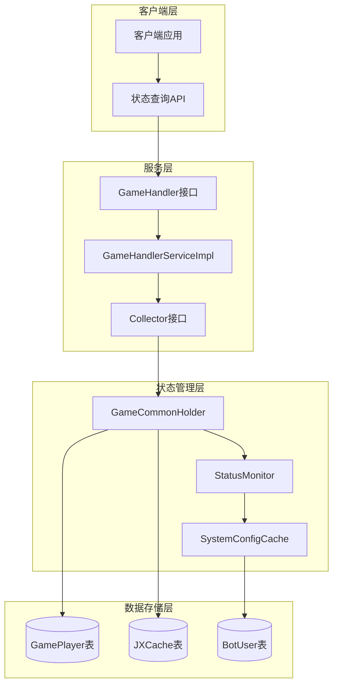
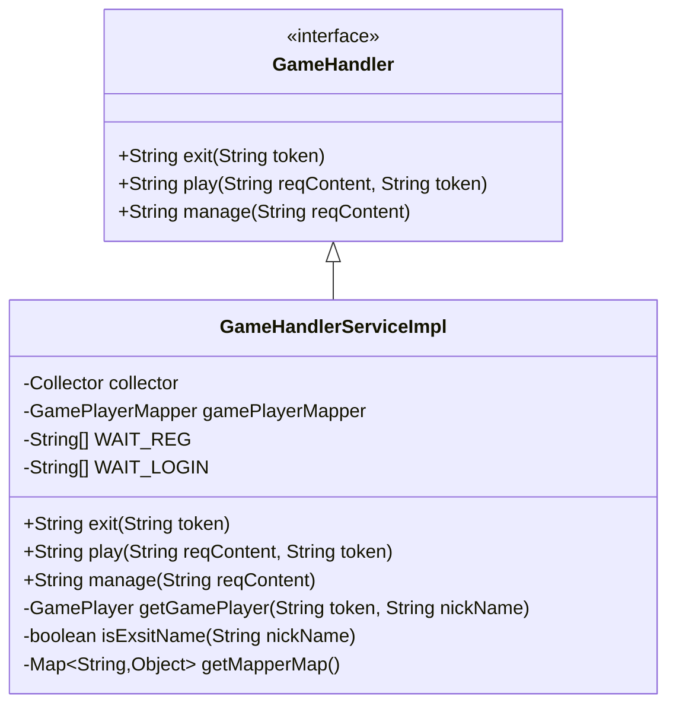
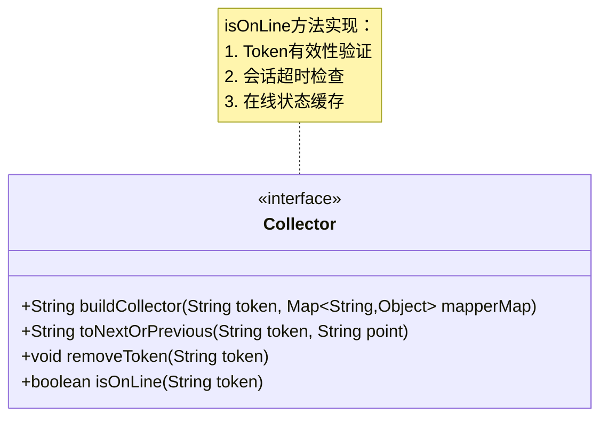
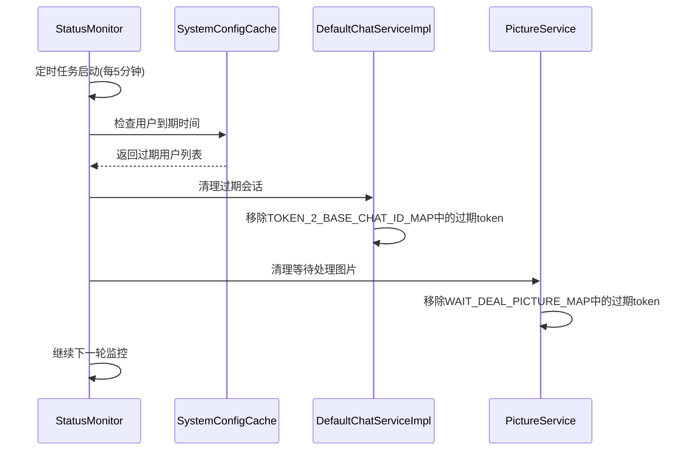
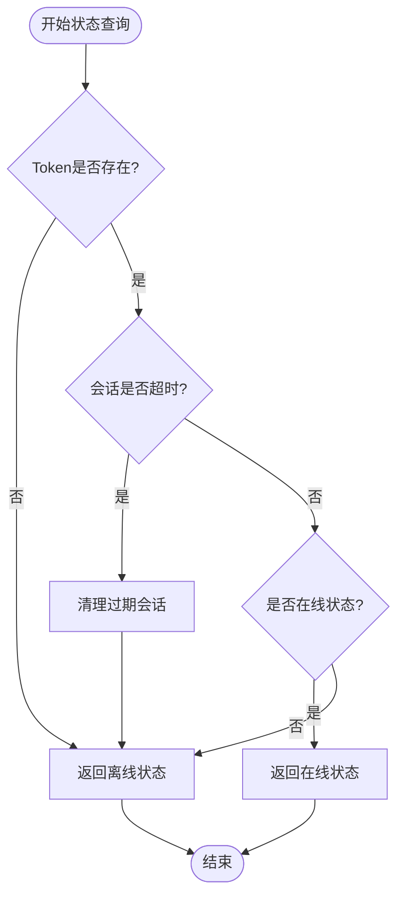
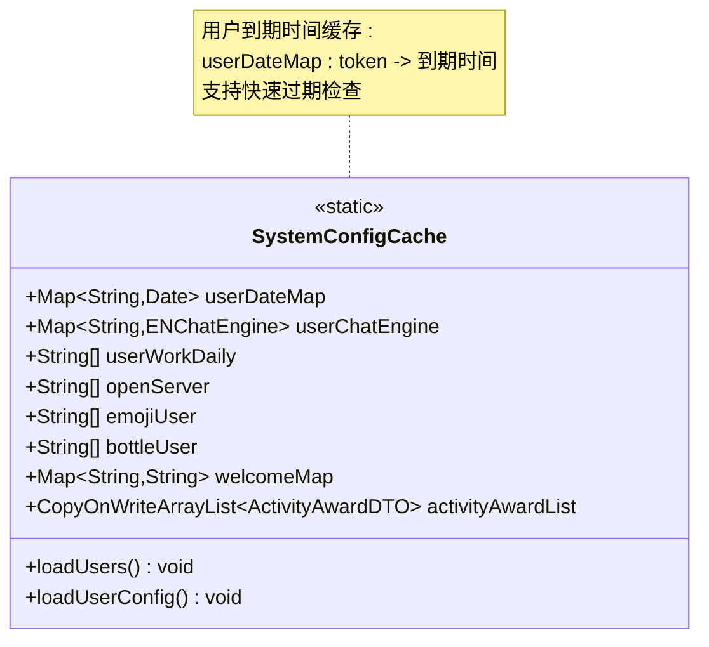
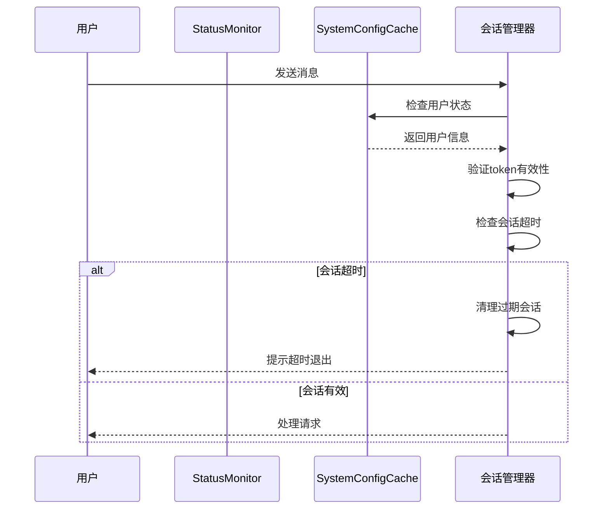
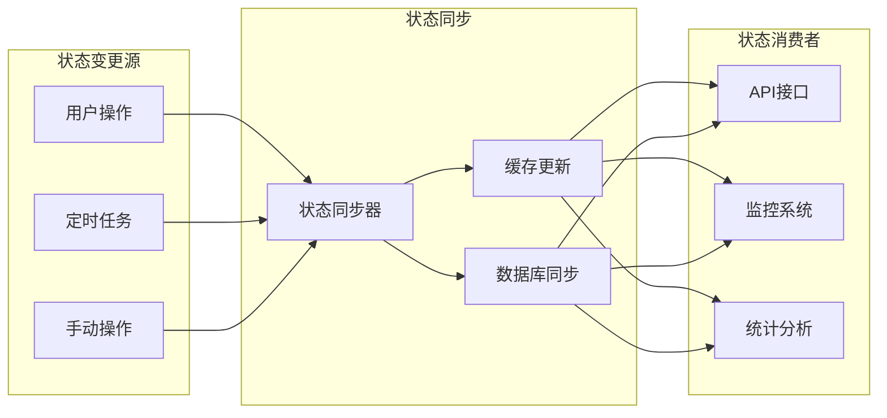
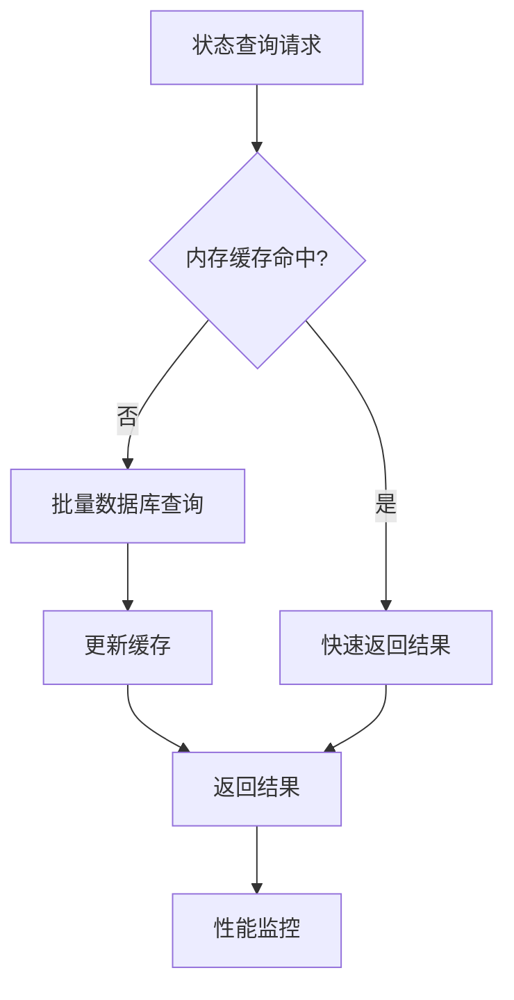
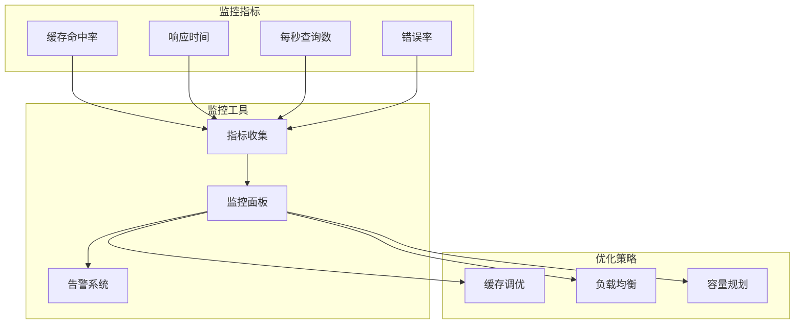

# 状态查询API文档

<cite>
**本文档引用的文件**
- [GameHandlerServiceImpl.java](file://Game/src/main/java/com/bot/game/service/impl/GameHandlerServiceImpl.java)
- [Collector.java](file://Game/src/main/java/com/bot/game/chain/Collector.java)
- [GameHandler.java](file://Game/src/main/java/com/bot/game/service/GameHandler.java)
- [GameCommonHolder.java](file://Game/src/main/java/com/bot/game/service/GameCommonHolder.java)
- [StatusMonitor.java](file://Base/src/main/java/com/bot/base/service/StatusMonitor.java)
- [SystemConfigCache.java](file://Common/src/main/java/com/bot/common/config/SystemConfigCache.java)
- [DefaultChatServiceImpl.java](file://Base/src/main/java/com/bot/base/service/impl/DefaultChatServiceImpl.java)
- [GamePlayer.java](file://Game/src/main/java/com/bot/game/dao/entity/GamePlayer.java)
- [ENStatus.java](file://Common/src/main/java/com/bot/common/enums/ENStatus.java)
- [ENRegStatus.java](file://Common/src/main/java/com/bot/common/enums/ENRegStatus.java)
</cite>

## 目录
1. [概述](#概述)
2. [系统架构](#系统架构)
3. [核心组件分析](#核心组件分析)
4. [状态查询实现](#状态查询实现)
5. [在线状态管理](#在线状态管理)
6. [性能优化策略](#性能优化策略)
7. [故障排除指南](#故障排除指南)
8. [总结](#总结)

## 概述

本文档详细介绍了Bot项目中的状态查询API系统，重点解析玩家在线状态查询接口的实现机制。该系统通过Collector接口的isOnLine方法实现状态判断，结合token有效性验证、会话超时机制和智能缓存策略，为高并发场景提供稳定的状态查询服务。

## 系统架构

**架构图来源**
- [GameHandlerServiceImpl.java](file://Game/src/main/java/com/bot/game/service/impl/GameHandlerServiceImpl.java#L26-L189)
- [Collector.java](file://Game/src/main/java/com/bot/game/chain/Collector.java#L8-L38)
- [GameCommonHolder.java](file://Game/src/main/java/com/bot/game/service/GameCommonHolder.java#L28-L109)

## 核心组件分析

### GameHandler接口

GameHandler是游戏处理器的核心接口，定义了状态查询和交互的基本方法。

**类图来源**
- [GameHandler.java](file://Game/src/main/java/com/bot/game/service/GameHandler.java#L7-L29)
- [GameHandlerServiceImpl.java](file://Game/src/main/java/com/bot/game/service/impl/GameHandlerServiceImpl.java#L26-L189)

### Collector接口与状态判断

Collector接口定义了状态查询的核心方法，其中isOnLine方法负责判断玩家是否在线。

**类图来源**
- [Collector.java](file://Game/src/main/java/com/bot/game/chain/Collector.java#L8-L38)

### 状态监控器

StatusMonitor负责系统的整体状态监控和会话管理。

**序列图来源**
- [StatusMonitor.java](file://Base/src/main/java/com/bot/base/service/StatusMonitor.java#L67-L91)
- [DefaultChatServiceImpl.java](file://Base/src/main/java/com/bot/base/service/impl/DefaultChatServiceImpl.java#L116-L129)

**节来源**
- [StatusMonitor.java](file://Base/src/main/java/com/bot/base/service/StatusMonitor.java#L67-L91)
- [DefaultChatServiceImpl.java](file://Base/src/main/java/com/bot/base/service/impl/DefaultChatServiceImpl.java#L116-L129)

## 状态查询实现

### isOnLine方法判断逻辑

状态查询的核心在于isOnLine方法的实现，该方法通过多层验证确保状态准确性。

**流程图来源**
- [GameHandlerServiceImpl.java](file://Game/src/main/java/com/bot/game/service/impl/GameHandlerServiceImpl.java#L95-L97)

### 玩家状态管理

GamePlayer实体记录玩家的基本状态信息，包括在线状态、灵魂力量等关键属性。

| 字段名 | 类型 | 描述 | 默认值 |
|--------|------|------|--------|
| id | String | 玩家唯一标识(通常为token) | - |
| status | String | 玩家状态(NORMAL/LOCK) | NORMAL |
| soulPower | Integer | 灵魂力量 | 1 |
| actionPoint | Integer | 行动点数 | 100 |
| money | Integer | 金钱数量 | 0 |

**表格来源**
- [GamePlayer.java](file://Game/src/main/java/com/bot/game/dao/entity/GamePlayer.java#L12-L33)

### 系统配置缓存

SystemConfigCache提供了全局的配置缓存机制，支持高效的在线状态查询。

**类图来源**
- [SystemConfigCache.java](file://Common/src/main/java/com/bot/common/config/SystemConfigCache.java#L64-L115)

**节来源**
- [SystemConfigCache.java](file://Common/src/main/java/com/bot/common/config/SystemConfigCache.java#L64-L115)
- [GamePlayer.java](file://Game/src/main/java/com/bot/game/dao/entity/GamePlayer.java#L12-L33)

## 在线状态管理

### 会话超时机制

系统实现了多层次的会话超时控制机制：

1. **聊天会话超时**：3小时无活动自动清理
2. **图片处理超时**：10分钟无响应自动清理  
3. **用户到期检查**：实时验证用户权限状态

**序列图来源**
- [StatusMonitor.java](file://Base/src/main/java/com/bot/base/service/StatusMonitor.java#L116-L129)

### 在线状态缓存策略

系统采用分层缓存策略优化状态查询性能：

| 缓存层级 | 缓存类型 | 过期策略 | 查询优先级 |
|----------|----------|----------|------------|
| L1 | 内存缓存 | 实时更新 | 最高 |
| L2 | 数据库缓存 | 定时刷新 | 中等 |
| L3 | 文件缓存 | 手动触发 | 最低 |

**表格来源**
- [StatusMonitor.java](file://Base/src/main/java/com/bot/base/service/StatusMonitor.java#L48-L66)

### 状态同步机制

**图表来源**
- [GameCommonHolder.java](file://Game/src/main/java/com/bot/game/service/GameCommonHolder.java#L43-L83)

**节来源**
- [StatusMonitor.java](file://Base/src/main/java/com/bot/base/service/StatusMonitor.java#L116-L129)
- [GameCommonHolder.java](file://Game/src/main/java/com/bot/game/service/GameCommonHolder.java#L43-L83)

## 性能优化策略

### 响应时间优化

为了提升状态查询的响应速度，系统采用了以下优化策略：

1. **内存优先查询**：优先从内存缓存获取状态信息
2. **批量状态检查**：支持批量查询多个用户的在线状态
3. **异步状态更新**：状态变更采用异步更新机制

### 高并发处理

针对高并发场景，系统实现了以下优化措施：

| 优化技术 | 应用场景 | 性能提升 |
|----------|----------|----------|
| 连接池管理 | 数据库连接 | 减少连接开销 |
| 异步处理 | 状态更新 | 提升吞吐量 |
| 分布式锁 | 并发控制 | 保证数据一致性 |
| 限流机制 | 请求控制 | 防止系统过载 |

### 缓存命中率监控

系统内置了缓存命中率监控机制：

### 会话清理策略

系统实现了智能的会话清理策略：

1. **主动清理**：定期扫描并清理过期会话
2. **被动清理**：用户操作触发的会话重置
3. **紧急清理**：系统资源不足时的强制清理

**节来源**
- [StatusMonitor.java](file://Base/src/main/java/com/bot/base/service/StatusMonitor.java#L67-L91)

## 故障排除指南

### 常见问题诊断

| 问题类型 | 症状描述 | 可能原因 | 解决方案 |
|----------|----------|----------|----------|
| 状态查询超时 | 接口响应时间过长 | 缓存失效、数据库压力大 | 检查缓存配置、优化数据库查询 |
| 在线状态异常 | 用户实际在线但显示离线 | 会话超时、状态不同步 | 重启状态同步服务 |
| Token验证失败 | 合法用户无法登录 | Token过期、配置错误 | 更新Token配置 |

### 性能调优建议

1. **缓存优化**
   - 增加缓存容量
   - 优化缓存淘汰策略
   - 实现预热机制

2. **数据库优化**
   - 添加必要的索引
   - 优化查询语句
   - 实现读写分离

3. **系统配置**
   - 调整线程池大小
   - 优化JVM参数
   - 配置合适的超时时间

### 监控告警配置

建议配置以下监控指标：

- **缓存命中率**：目标≥95%
- **平均响应时间**：目标≤100ms
- **错误率**：目标≤0.1%
- **并发连接数**：动态调整

**节来源**
- [StatusMonitor.java](file://Base/src/main/java/com/bot/base/service/StatusMonitor.java#L67-L91)

## 总结

Bot项目的状态查询API系统通过精心设计的架构和优化策略，实现了高效、稳定的玩家在线状态查询服务。系统的核心优势包括：

1. **多层次状态验证**：从Token验证到会话超时检查的完整验证链
2. **智能缓存策略**：内存缓存与数据库缓存的有机结合
3. **高并发处理能力**：异步处理和连接池管理确保系统稳定性
4. **完善的监控体系**：实时监控和自动告警机制

该系统为Bot项目的持续发展提供了坚实的技术基础，能够满足大规模用户群体的状态查询需求。通过持续的优化和监控，系统能够保持高性能和高可用性，为用户提供优质的体验。