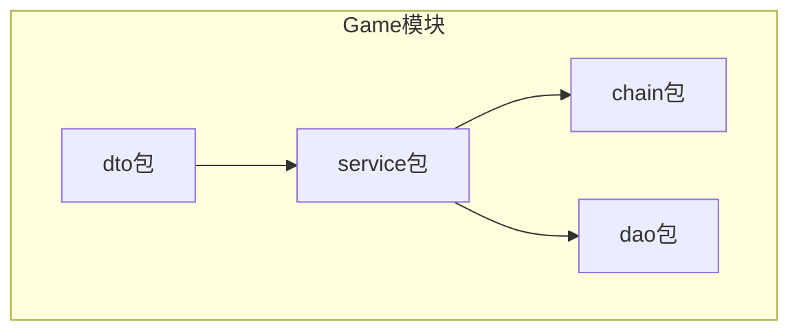
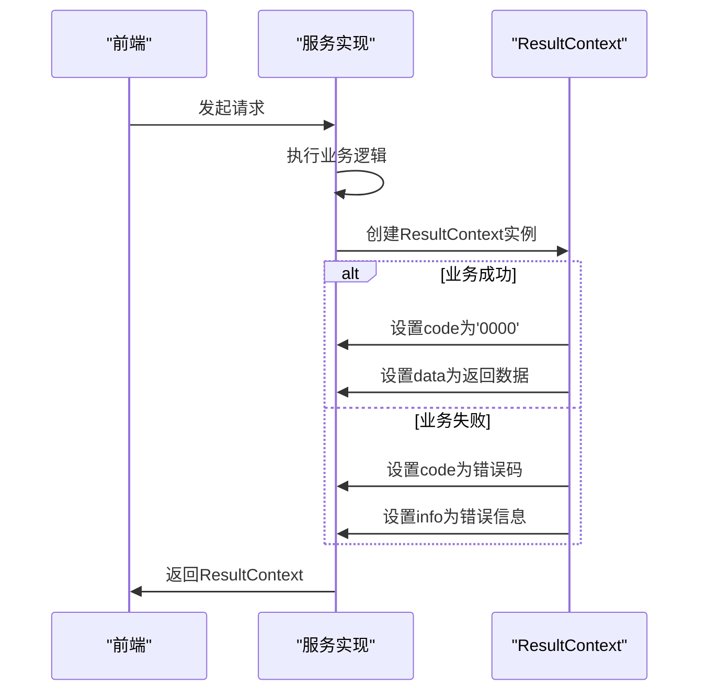
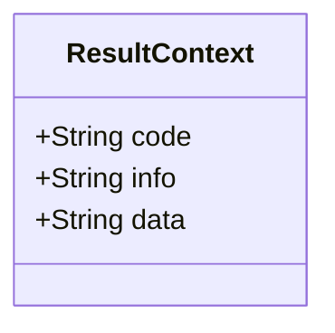
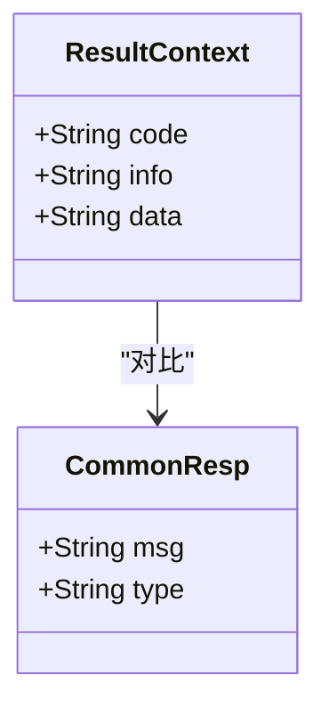
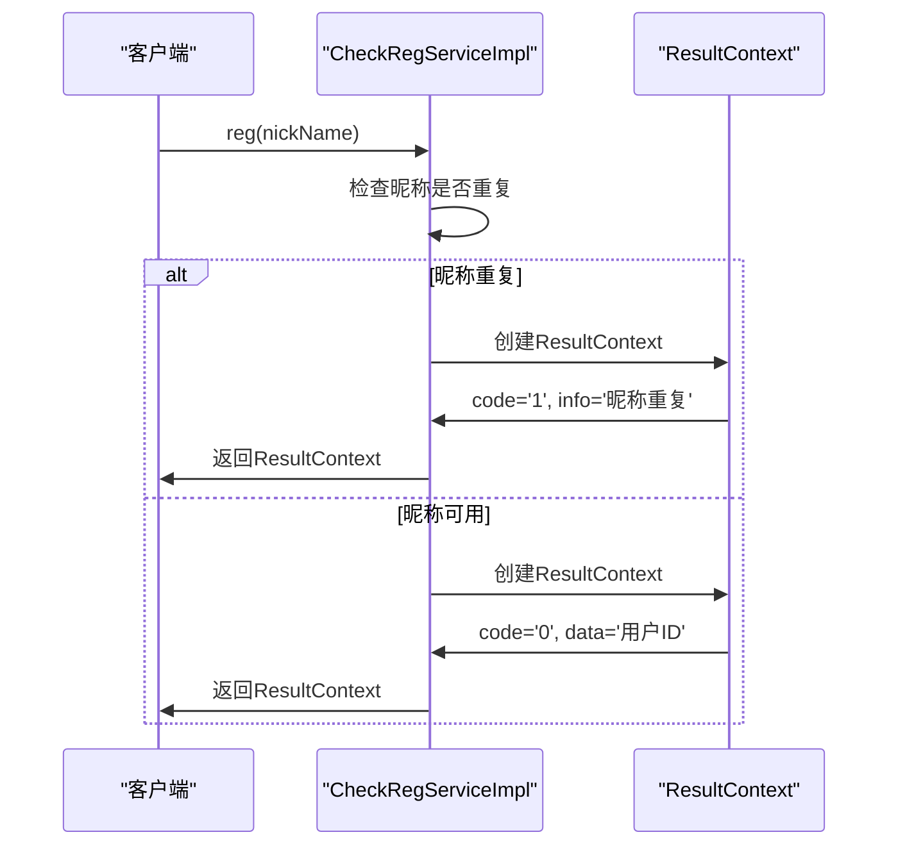
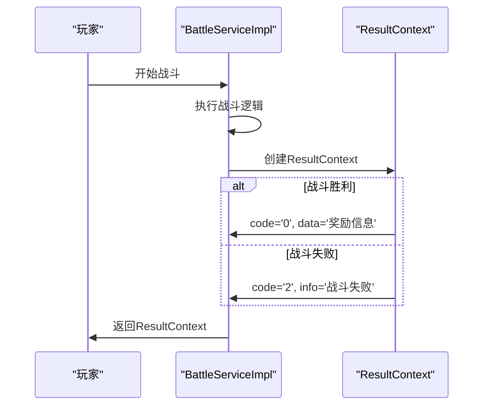
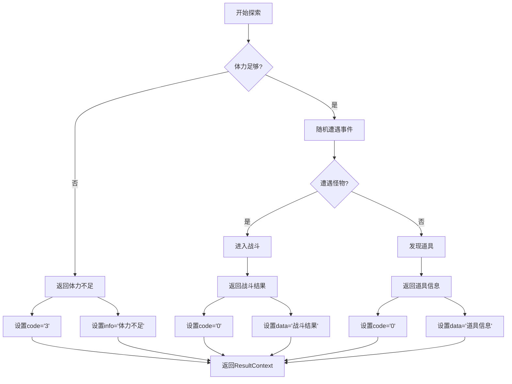
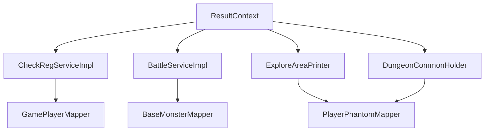

# 结果返回API

<cite>
**本文档引用的文件**   
- [ResultContext.java](file://Game\src\main\java\com\bot\game\dto\ResultContext.java)
- [CommonResp.java](file://Base\src\main\java\com\bot\base\dto\CommonResp.java)
- [CheckRegServiceImpl.java](file://Game\src\main\java\com\bot\game\service\impl\CheckRegServiceImpl.java)
- [ENStatus.java](file://Common\src\main\java\com\bot\common\enums\ENStatus.java)
- [BattleServiceImpl.java](file://Game\src\main\java\com\bot\game\service\impl\BattleServiceImpl.java)
- [ExploreAreaPrinter.java](file://Game\src\main\java\com\bot\game\chain\menu\ExploreAreaPrinter.java)
- [DungeonCommonHolder.java](file://Game\src\main\java\com\bot\game\service\DungeonCommonHolder.java)
</cite>

## 目录
1. [简介](#简介)
2. [项目结构](#项目结构)
3. [核心组件](#核心组件)
4. [架构概述](#架构概述)
5. [详细组件分析](#详细组件分析)
6. [依赖分析](#依赖分析)
7. [性能考虑](#性能考虑)
8. [故障排除指南](#故障排除指南)
9. [结论](#结论)
10. [附录](#附录)（如有必要）

## 简介
本文档深入解析了游戏模块中统一响应封装的设计，重点介绍ResultContext类作为结果返回API的核心设计。文档详细说明了code、info和data三个字段的语义定义和使用规范，包括成功响应、业务错误码和系统异常码的编码规则。通过对比Base模块中的CommonResp设计，阐述了ResultContext在游戏场景下的特殊优化。文档还提供了典型响应示例，如战斗结果、探索奖励等复杂数据结构的序列化方式，以及前端解析的最佳实践。

## 项目结构
游戏模块的项目结构清晰地划分了不同的功能区域，其中dto包包含了ResultContext类，作为统一的响应封装类。service包中的实现类使用ResultContext来返回操作结果，而chain包中的菜单打印器则通过服务调用获取响应数据。

**图表来源**
- [ResultContext.java](file://Game\src\main\java\com\bot\game\dto\ResultContext.java)
- [CheckRegServiceImpl.java](file://Game\src\main\java\com\bot\game\service\impl\CheckRegServiceImpl.java)

**章节来源**
- [ResultContext.java](file://Game\src\main\java\com\bot\game\dto\ResultContext.java)
- [CheckRegServiceImpl.java](file://Game\src\main\java\com\bot\game\service\impl\CheckRegServiceImpl.java)

## 核心组件
ResultContext类是游戏模块中统一的响应封装类，包含code、info和data三个字段。code字段用于表示操作结果的状态码，info字段用于提供人类可读的提示信息，data字段用于携带具体的响应数据。这种设计使得前端可以统一处理各种类型的响应，提高了代码的可维护性和可读性。

**章节来源**
- [ResultContext.java](file://Game\src\main\java\com\bot\game\dto\ResultContext.java)
- [CheckRegServiceImpl.java](file://Game\src\main\java\com\bot\game\service\impl\CheckRegServiceImpl.java)

## 架构概述
ResultContext类在游戏模块的架构中扮演着关键角色，作为服务层与表现层之间的契约。当服务方法执行完成后，会创建一个ResultContext实例，设置相应的code、info和data字段，然后返回给调用方。这种设计使得异常处理和正常流程可以统一处理，简化了前端的逻辑。

**图表来源**
- [ResultContext.java](file://Game\src\main\java\com\bot\game\dto\ResultContext.java)
- [CheckRegServiceImpl.java](file://Game\src\main\java\com\bot\game\service\impl\CheckRegServiceImpl.java)

## 详细组件分析
### ResultContext类分析
ResultContext类的设计体现了游戏模块对响应处理的特殊需求。与Base模块中的CommonResp相比，ResultContext更加专注于业务逻辑的反馈，而不是消息类型。

#### 类图

**图表来源**
- [ResultContext.java](file://Game\src\main\java\com\bot\game\dto\ResultContext.java)

#### 与CommonResp的对比

**图表来源**
- [ResultContext.java](file://Game\src\main\java\com\bot\game\dto\ResultContext.java)
- [CommonResp.java](file://Base\src\main\java\com\bot\base\dto\CommonResp.java)

### 注册服务分析
注册服务是ResultContext的一个典型使用场景，展示了成功响应和业务错误的处理方式。

#### 序列图

**图表来源**
- [CheckRegServiceImpl.java](file://Game\src\main\java\com\bot\game\service\impl\CheckRegServiceImpl.java)
- [ResultContext.java](file://Game\src\main\java\com\bot\game\dto\ResultContext.java)

**章节来源**
- [CheckRegServiceImpl.java](file://Game\src\main\java\com\bot\game\service\impl\CheckRegServiceImpl.java)

### 战斗系统分析
战斗系统展示了ResultContext在复杂业务场景下的应用，特别是在处理战斗结果时的数据封装。

#### 序列图

**图表来源**
- [BattleServiceImpl.java](file://Game\src\main\java\com\bot\game\service\impl\BattleServiceImpl.java)
- [ResultContext.java](file://Game\src\main\java\com\bot\game\dto\ResultContext.java)

**章节来源**
- [BattleServiceImpl.java](file://Game\src\main\java\com\bot\game\service\impl\BattleServiceImpl.java)

### 探索系统分析
探索系统展示了ResultContext在随机事件处理中的应用，特别是在处理探索结果时的数据封装。

#### 流程图

**图表来源**
- [ExploreAreaPrinter.java](file://Game\src\main\java\com\bot\game\chain\menu\ExploreAreaPrinter.java)
- [ResultContext.java](file://Game\src\main\java\com\bot\game\dto\ResultContext.java)

**章节来源**
- [ExploreAreaPrinter.java](file://Game\src\main\java\com\bot\game\chain\menu\ExploreAreaPrinter.java)

## 依赖分析
ResultContext类被多个服务实现类所依赖，形成了一个以ResultContext为核心的响应处理体系。这种设计使得各个服务可以独立开发，同时保持响应格式的一致性。

**图表来源**
- [ResultContext.java](file://Game\src\main\java\com\bot\game\dto\ResultContext.java)
- [CheckRegServiceImpl.java](file://Game\src\main\java\com\bot\game\service\impl\CheckRegServiceImpl.java)
- [BattleServiceImpl.java](file://Game\src\main\java\com\bot\game\service\impl\BattleServiceImpl.java)
- [ExploreAreaPrinter.java](file://Game\src\main\java\com\bot\game\chain\menu\ExploreAreaPrinter.java)
- [DungeonCommonHolder.java](file://Game\src\main\java\com\bot\game\service\DungeonCommonHolder.java)

**章节来源**
- [ResultContext.java](file://Game\src\main\java\com\bot\game\dto\ResultContext.java)
- [CheckRegServiceImpl.java](file://Game\src\main\java\com\bot\game\service\impl\CheckRegServiceImpl.java)

## 性能考虑
ResultContext类的设计考虑了性能因素，使用String类型作为code和data的类型，避免了复杂的对象序列化过程。这种设计使得响应的生成和解析都非常高效，适合高并发的游戏场景。

## 故障排除指南
当遇到ResultContext相关的问题时，应首先检查code字段的值，根据不同的code值采取相应的处理措施。对于未知的code值，应记录日志并上报给开发团队。

**章节来源**
- [ResultContext.java](file://Game\src\main\java\com\bot\game\dto\ResultContext.java)
- [CheckRegServiceImpl.java](file://Game\src\main\java\com\bot\game\service\impl\CheckRegServiceImpl.java)

## 结论
ResultContext类作为游戏模块的统一响应封装，体现了针对游戏场景的特殊优化。通过简洁的三字段设计，实现了业务逻辑与表现层的解耦，提高了代码的可维护性和可读性。与Base模块中的CommonResp相比，ResultContext更加专注于业务反馈，适合复杂的游戏业务场景。