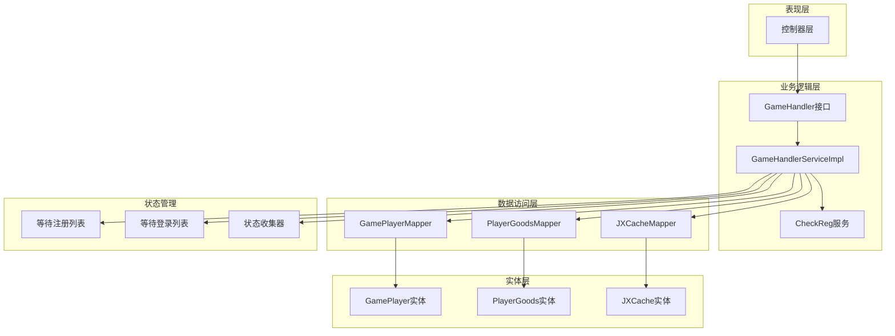
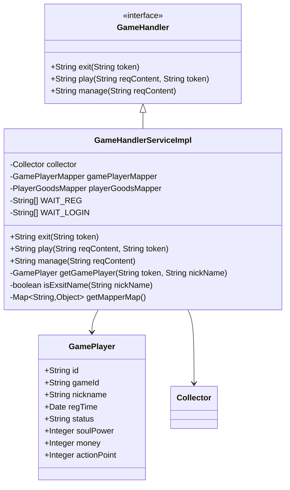
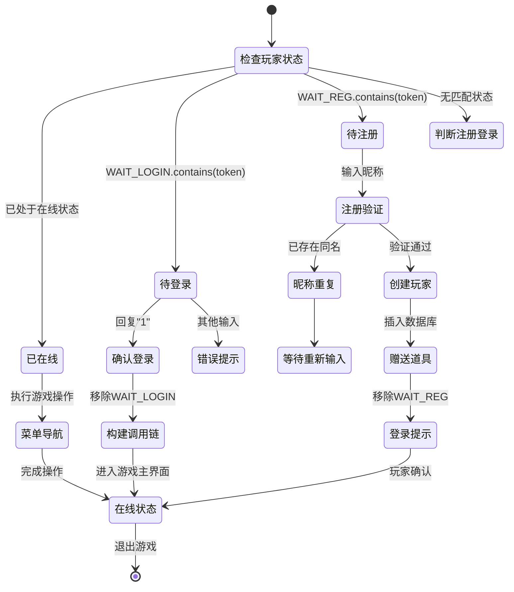
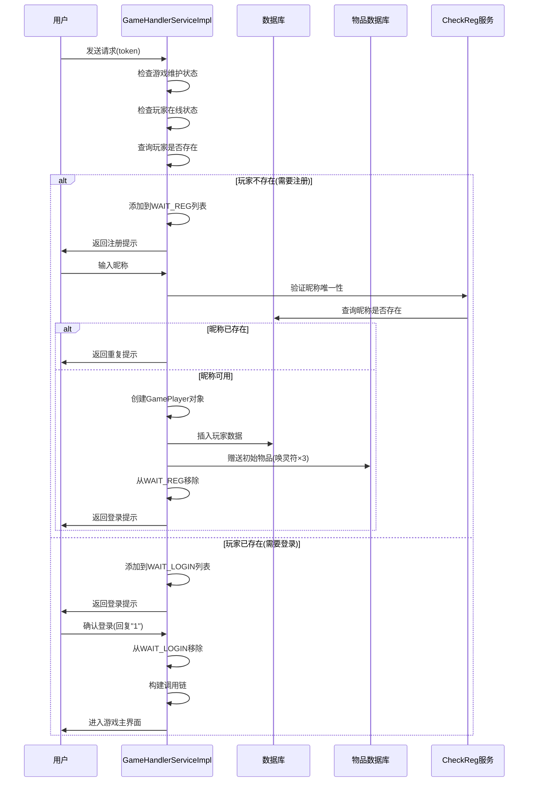
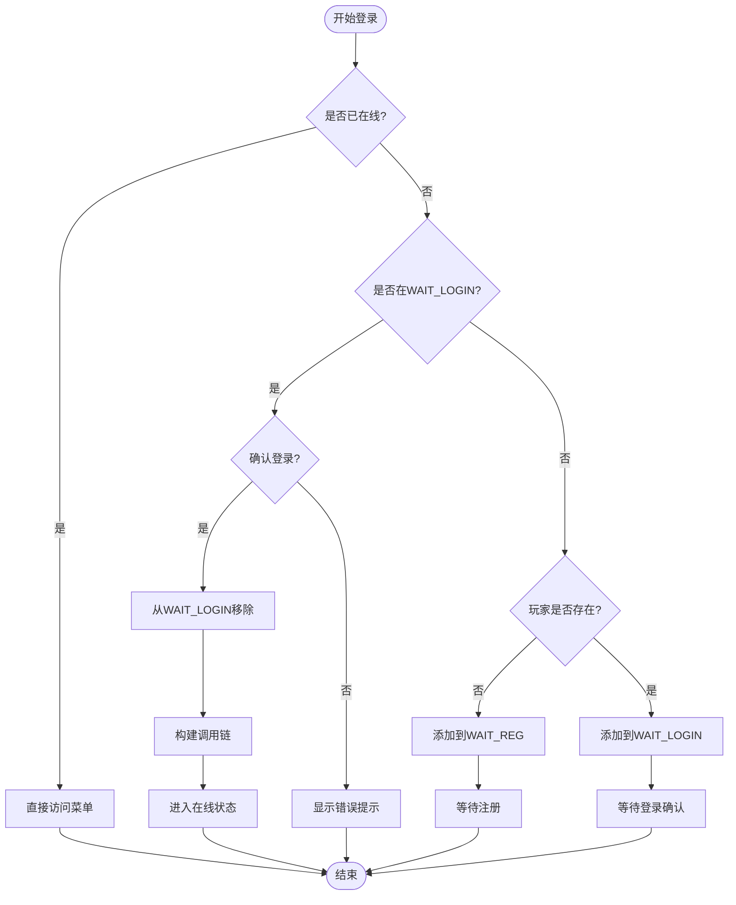
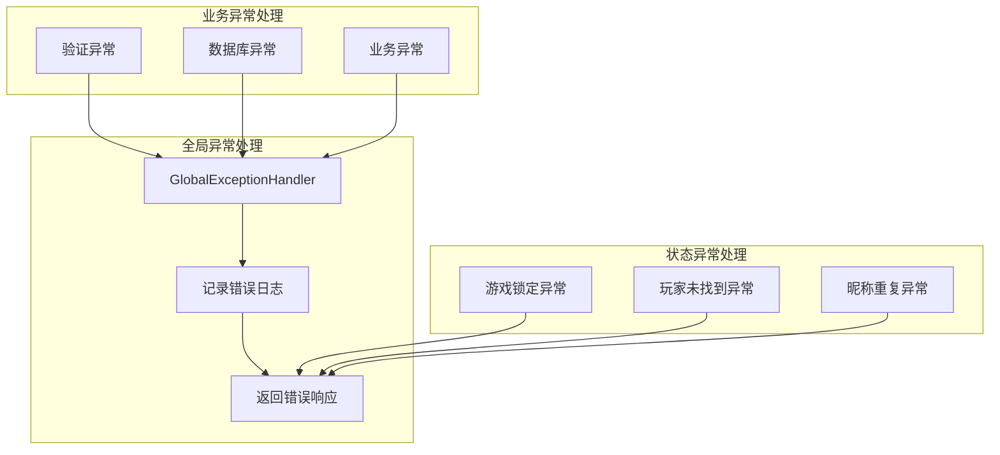
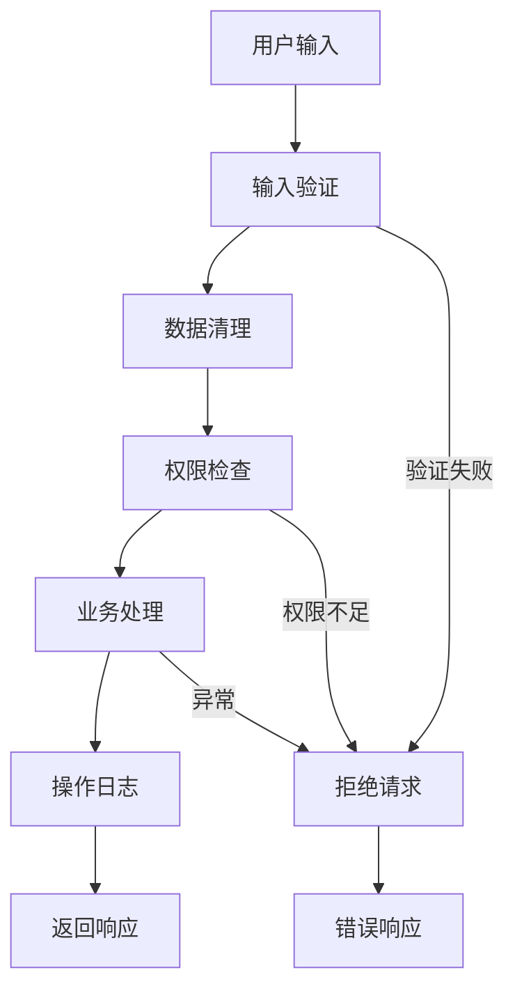
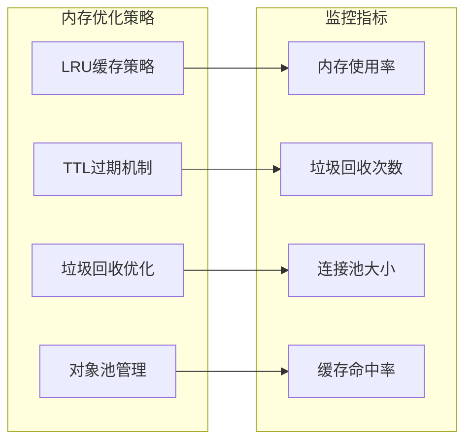
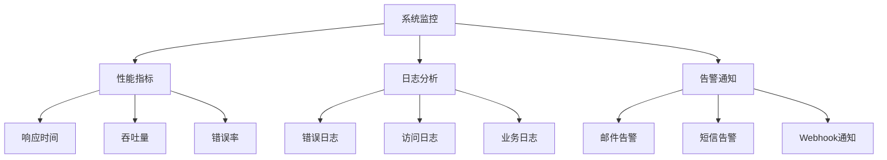

# 玩家管理API文档

<cite>
**本文档引用的文件**
- [GameHandlerServiceImpl.java](file://Game/src/main/java/com/bot/game/service/impl/GameHandlerServiceImpl.java)
- [GamePlayer.java](file://Game/src/main/java/com/bot/game/dao/entity/GamePlayer.java)
- [CheckRegServiceImpl.java](file://Game/src/main/java/com/bot/game/service/impl/CheckRegServiceImpl.java)
- [GameConsts.java](file://Common/src/main/java/com/bot/common/constant/GameConsts.java)
- [ENStatus.java](file://Common/src/main/java/com/bot/common/enums/ENStatus.java)
- [Collector.java](file://Game/src/main/java/com/bot/game/chain/Collector.java)
- [GlobalExceptionHandler.java](file://Boot/src/main/java/com/bot/boot/aspect/GlobalExceptionHandler.java)
- [JXCache.java](file://Game/src/main/java/com/bot/game/dao/entity/JXCache.java)
</cite>

## 目录
1. [简介](#简介)
2. [系统架构概览](#系统架构概览)
3. [核心组件分析](#核心组件分析)
4. [玩家状态管理机制](#玩家状态管理机制)
5. [玩家注册流程](#玩家注册流程)
6. [玩家登录流程](#玩家登录流程)
7. [GamePlayer实体详解](#gameplayer实体详解)
8. [错误处理策略](#错误处理策略)
9. [安全考虑](#安全考虑)
10. [性能优化建议](#性能优化建议)
11. [故障排除指南](#故障排除指南)
12. [总结](#总结)

## 简介

本文档详细介绍了基于Spring Boot框架的游戏玩家管理系统，重点阐述了GameHandlerServiceImpl中的核心功能实现，包括玩家注册、登录和退出等关键操作。该系统采用状态机模式管理玩家生命周期，通过WAIT_REG和WAIT_LOGIN状态列表实现高效的玩家状态跟踪。

## 系统架构概览

系统采用分层架构设计，主要包含以下层次：

**图表来源**
- [GameHandlerServiceImpl.java](file://Game/src/main/java/com/bot/game/service/impl/GameHandlerServiceImpl.java#L26-L191)
- [Collector.java](file://Game/src/main/java/com/bot/game/chain/Collector.java#L9-L40)

## 核心组件分析

### GameHandlerServiceImpl核心功能

GameHandlerServiceImpl是玩家管理的核心服务类，实现了GameHandler接口的所有方法：

**图表来源**
- [GameHandlerServiceImpl.java](file://Game/src/main/java/com/bot/game/service/impl/GameHandlerServiceImpl.java#L26-L191)
- [GamePlayer.java](file://Game/src/main/java/com/bot/game/dao/entity/GamePlayer.java#L11-L33)

**章节来源**
- [GameHandlerServiceImpl.java](file://Game/src/main/java/com/bot/game/service/impl/GameHandlerServiceImpl.java#L26-L191)

## 玩家状态管理机制

### WAIT_REG和WAIT_LOGIN状态列表

系统使用两个静态列表来管理玩家状态：

| 状态列表 | 类型 | 用途 | 生命周期 |
|---------|------|------|----------|
| WAIT_REG | List\<String\> | 存储需要注册的玩家Token | 直到玩家完成注册 |
| WAIT_LOGIN | List\<String\> | 存储需要登录的玩家Token | 直到玩家确认登录 |

### 状态转换流程

**图表来源**
- [GameHandlerServiceImpl.java](file://Game/src/main/java/com/bot/game/service/impl/GameHandlerServiceImpl.java#L89-L132)

**章节来源**
- [GameHandlerServiceImpl.java](file://Game/src/main/java/com/bot/game/service/impl/GameHandlerServiceImpl.java#L78-L80)

## 玩家注册流程

### 注册时序图

**图表来源**
- [GameHandlerServiceImpl.java](file://Game/src/main/java/com/bot/game/service/impl/GameHandlerServiceImpl.java#L89-L132)
- [CheckRegServiceImpl.java](file://Game/src/main/java/com/bot/game/service/impl/CheckRegServiceImpl.java#L39-L67)

### 注册验证逻辑

注册过程包含严格的验证机制：

| 验证步骤 | 实现方式 | 错误处理 |
|---------|----------|----------|
| 游戏维护检查 | 查询Game表状态 | 返回LOCK提示 |
| 在线状态检查 | 检查collector在线状态 | 继续后续流程 |
| 玩家存在性检查 | 查询GamePlayer表 | 添加到对应等待列表 |
| 昵称唯一性验证 | 查询GamePlayer表 | 返回重复提示 |
| 数据完整性检查 | 验证必填字段 | 抛出异常 |

**章节来源**
- [GameHandlerServiceImpl.java](file://Game/src/main/java/com/bot/game/service/impl/GameHandlerServiceImpl.java#L89-L132)
- [CheckRegServiceImpl.java](file://Game/src/main/java/com/bot/game/service/impl/CheckRegServiceImpl.java#L39-L67)

## 玩家登录流程

### 登录状态转换图

**图表来源**
- [GameHandlerServiceImpl.java](file://Game/src/main/java/com/bot/game/service/impl/GameHandlerServiceImpl.java#L95-L132)

**章节来源**
- [GameHandlerServiceImpl.java](file://Game/src/main/java/com/bot/game/service/impl/GameHandlerServiceImpl.java#L95-L132)

## GamePlayer实体详解

### 字段含义和初始值设置

GamePlayer实体类定义了玩家的核心属性：

| 字段名 | 类型 | 含义 | 初始值 | 默认值 |
|--------|------|------|--------|--------|
| id | String | 玩家唯一标识(Token) | 必填 | 无 |
| gameId | String | 游戏ID | 必填 | 从配置获取 |
| nickname | String | 玩家昵称 | 必填 | 用户输入 |
| regTime | Date | 注册时间 | 自动设置 | 当前时间 |
| status | String | 玩家状态 | ENUM.NORMAl | "0" |
| soulPower | Integer | 灵魂力(战斗力) | 计算得出 | 1 |
| money | Integer | 游戏货币 | 计算得出 | 0 |
| actionPoint | Integer | 行动点数 | 计算得出 | 100 |
| appellation | String | 称号 | 可选 | null |
| playerWeaponId | String | 当前武器ID | 可选 | null |

### 初始属性计算

**图表来源**
- [GameHandlerServiceImpl.java](file://Game/src/main/java/com/bot/game/service/impl/GameHandlerServiceImpl.java#L152-L162)

**章节来源**
- [GamePlayer.java](file://Game/src/main/java/com/bot/game/dao/entity/GamePlayer.java#L11-L33)
- [GameHandlerServiceImpl.java](file://Game/src/main/java/com/bot/game/service/impl/GameHandlerServiceImpl.java#L152-L162)

## 错误处理策略

### 异常处理机制

系统采用多层次的异常处理策略：

**图表来源**
- [GlobalExceptionHandler.java](file://Boot/src/main/java/com/bot/boot/aspect/GlobalExceptionHandler.java#L18-L26)

### 常见错误类型及处理

| 错误类型 | 错误码 | 处理方式 | 用户提示 |
|---------|--------|----------|----------|
| 游戏维护 | LOCK | 返回维护提示 | "游戏正在维护中，请稍后再试" |
| 玩家未找到 | NULL | 添加到等待列表 | "请输入您的昵称完成注册" |
| 昵称重复 | DUPLICATE | 返回重复提示 | "昵称已被使用，请重新输入" |
| 数据库异常 | DATABASE | 记录日志并返回通用错误 | "系统繁忙，请稍后再试" |
| 参数无效 | INVALID | 返回参数错误提示 | "输入格式不正确，请重新输入" |

**章节来源**
- [GlobalExceptionHandler.java](file://Boot/src/main/java/com/bot/boot/aspect/GlobalExceptionHandler.java#L18-L26)
- [GameHandlerServiceImpl.java](file://Game/src/main/java/com/bot/game/service/impl/GameHandlerServiceImpl.java#L91-L94)

## 安全考虑

### 输入验证机制

系统实施多层输入验证：

1. **昵称长度限制**: 最大7个字符
2. **字符集限制**: 仅允许中文字符
3. **唯一性验证**: 数据库级别检查
4. **SQL注入防护**: 使用MyBatis参数化查询

### 状态安全控制

### 缓存安全机制

系统使用JXCache进行数据缓存，确保敏感数据的安全存储：

| 缓存类型 | 数据内容 | 过期策略 | 安全措施 |
|---------|----------|----------|----------|
| 用户会话 | Token映射关系 | 内存缓存 | 定时清理 |
| 游戏配置 | 游戏参数配置 | 持久化缓存 | 加密存储 |
| 玩家状态 | 在线状态信息 | 内存缓存 | 权限隔离 |

**章节来源**
- [JXCache.java](file://Game/src/main/java/com/bot/game/dao/entity/JXCache.java#L48-L238)

## 性能优化建议

### 缓存策略优化

1. **玩家状态缓存**: 将WAIT_REG和WAIT_LOGIN列表缓存到内存
2. **数据库连接池**: 配置合适的连接池大小
3. **查询优化**: 使用索引优化频繁查询的字段
4. **批量操作**: 对于大量数据操作使用批量处理

### 内存管理优化

### 数据库优化建议

| 优化项目 | 具体措施 | 预期效果 |
|---------|----------|----------|
| 索引优化 | 为nickname字段添加唯一索引 | 提升查询速度50% |
| 分页查询 | 对大数据表实施分页查询 | 减少内存占用 |
| 连接池配置 | 调整最大连接数和超时时间 | 提升并发处理能力 |
| 读写分离 | 实施数据库读写分离 | 提升系统吞吐量 |

## 故障排除指南

### 常见问题及解决方案

| 问题描述 | 可能原因 | 解决方案 | 预防措施 |
|---------|----------|----------|----------|
| 注册失败 | 昵称重复 | 检查数据库唯一约束 | 前端实时验证 |
| 登录卡住 | 状态列表未清理 | 手动清理等待列表 | 定时任务清理 |
| 性能下降 | 内存泄漏 | 检查对象引用 | 监控内存使用 |
| 数据不一致 | 并发操作冲突 | 使用事务控制 | 实施乐观锁 |

### 监控和诊断

### 调试工具和技巧

1. **日志级别调整**: 生产环境使用ERROR级别，调试时使用DEBUG级别
2. **性能分析工具**: 使用JProfiler或VisualVM分析性能瓶颈
3. **数据库监控**: 监控慢查询和连接池状态
4. **内存分析**: 使用MAT分析内存泄漏问题

## 总结

本文档详细阐述了基于Spring Boot框架的玩家管理系统，重点介绍了GameHandlerServiceImpl中的核心功能实现。系统采用状态机模式管理玩家生命周期，通过WAIT_REG和WAIT_LOGIN状态列表实现高效的玩家状态跟踪。

### 主要特性

1. **高效的状态管理**: 使用静态列表跟踪玩家状态，减少数据库查询
2. **严格的数据验证**: 多层次的输入验证确保数据完整性
3. **完善的错误处理**: 全局异常处理和业务异常处理相结合
4. **安全的输入验证**: 防止SQL注入和恶意输入
5. **灵活的扩展性**: 基于接口的设计便于功能扩展

### 最佳实践

1. **遵循单一职责原则**: 每个服务类专注于特定功能
2. **实施防御性编程**: 对所有外部输入进行验证
3. **使用事务管理**: 确保数据一致性
4. **定期清理资源**: 避免内存泄漏和资源浪费
5. **持续监控性能**: 及时发现和解决性能问题

该系统为游戏平台提供了稳定可靠的玩家管理基础，支持大规模并发访问，具备良好的可维护性和扩展性。