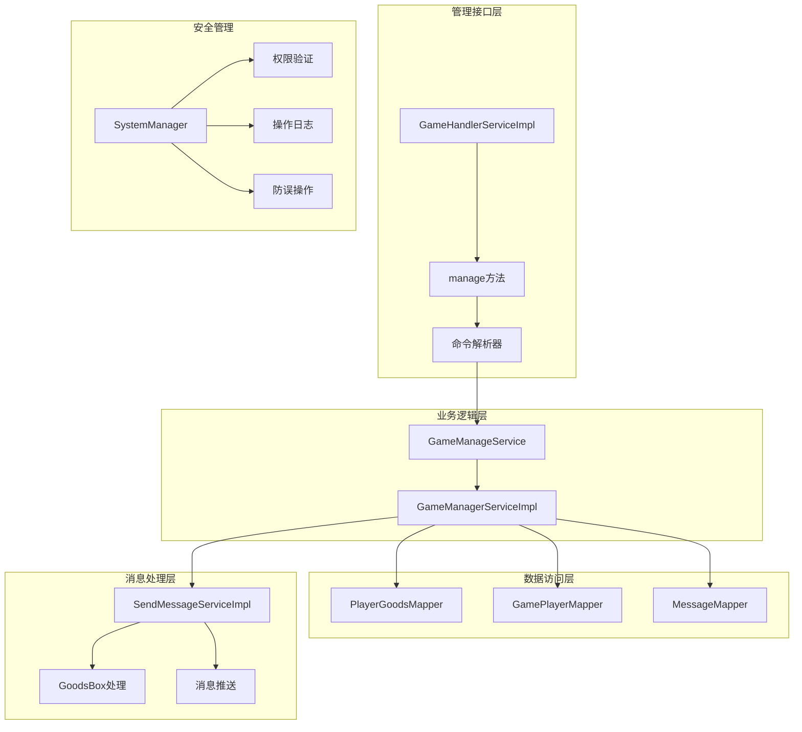
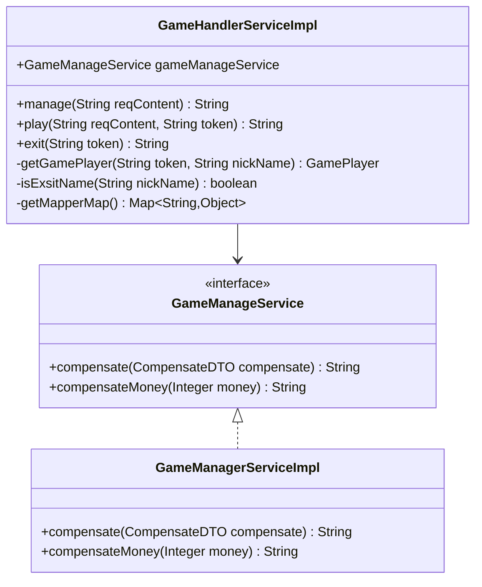
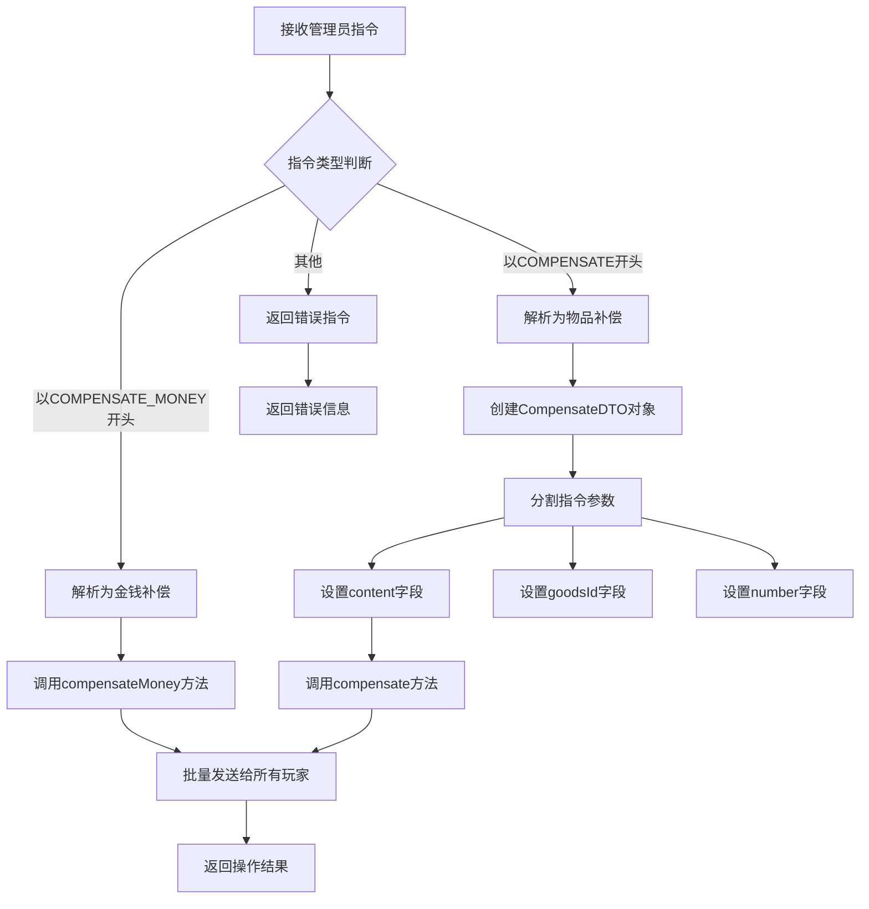
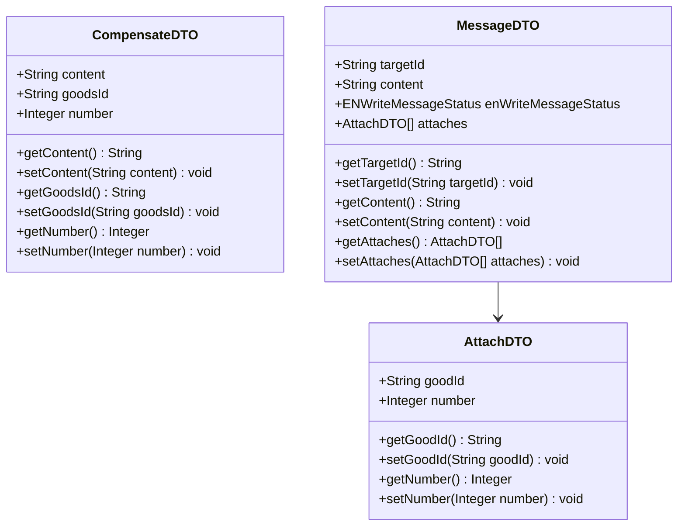
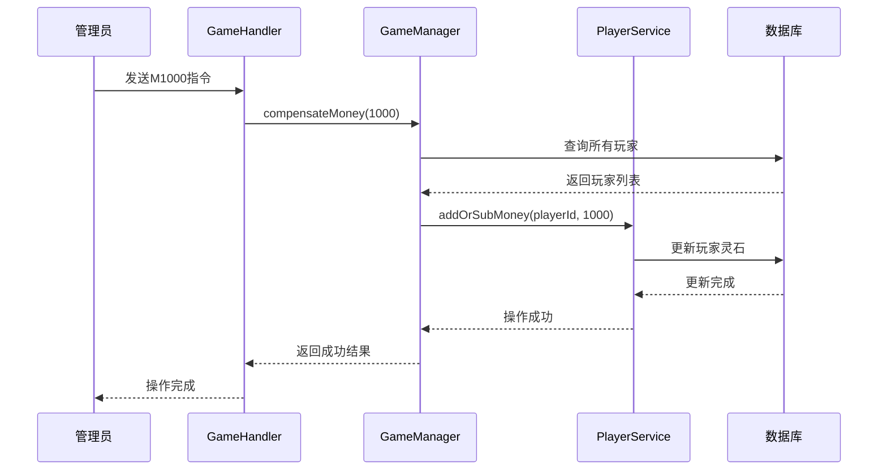
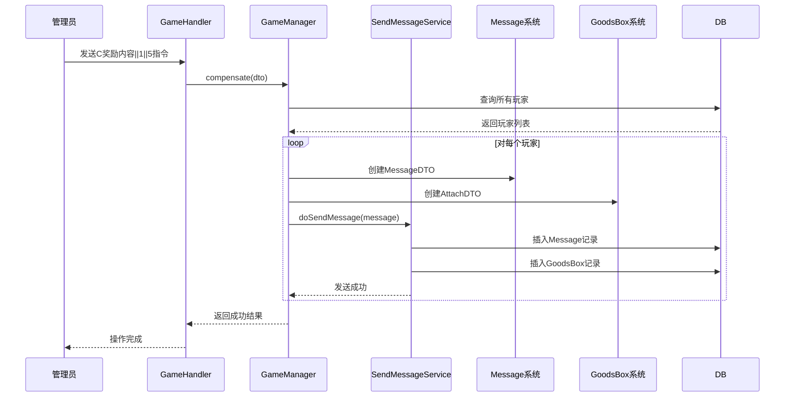
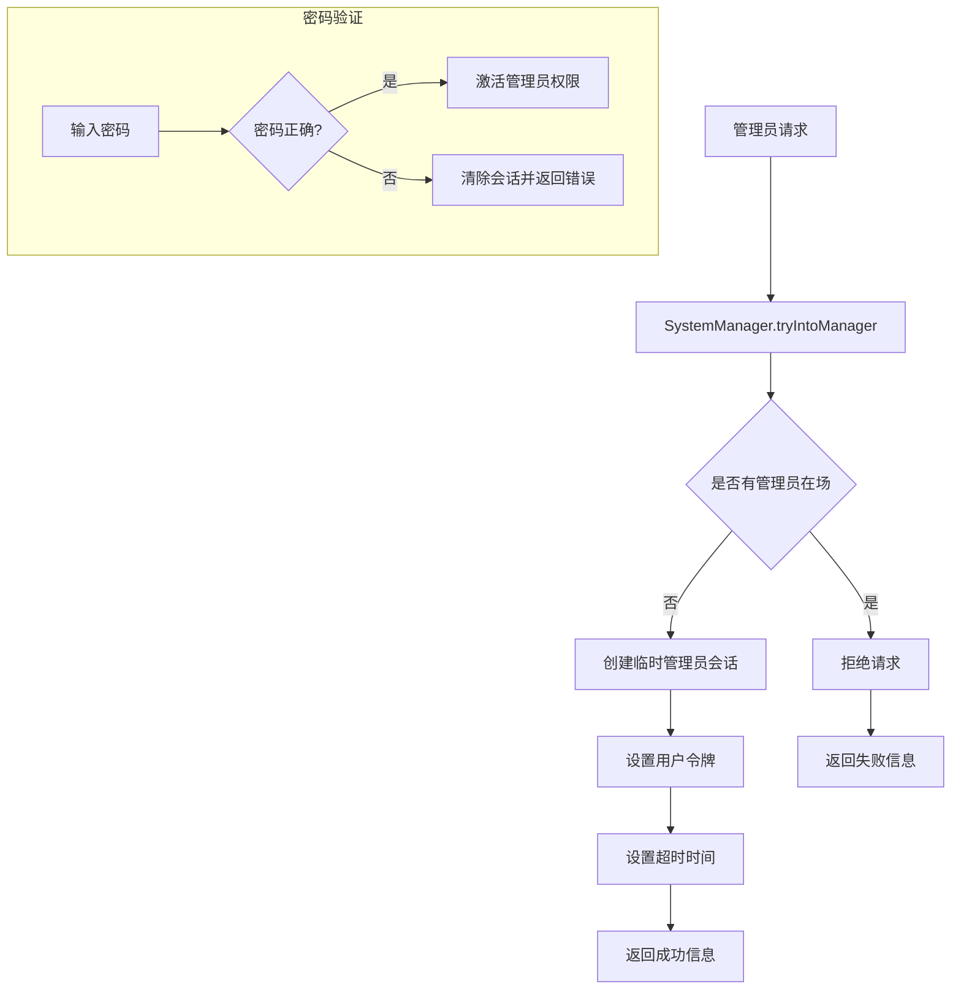

# 管理功能API文档

<cite>
**本文档引用的文件**
- [GameManageService.java](file://Game/src/main/java/com/bot/game/service/GameManageService.java)
- [GameHandlerServiceImpl.java](file://Game/src/main/java/com/bot/game/service/impl/GameHandlerServiceImpl.java)
- [GameManagerServiceImpl.java](file://Game/src/main/java/com/bot/game/service/impl/GameManagerServiceImpl.java)
- [CompensateDTO.java](file://Game/src/main/java/com/bot/game/dto/CompensateDTO.java)
- [AttachDTO.java](file://Game/src/main/java/com/bot/game/dto/AttachDTO.java)
- [MessageDTO.java](file://Game/src/main/java/com/bot/game/dto/MessageDTO.java)
- [CommonPlayer.java](file://Game/src/main/java/com/bot/game/service/impl/CommonPlayer.java)
- [SendMessageServiceImpl.java](file://Game/src/main/java/com/bot/game/service/impl/message/SendMessageServiceImpl.java)
- [SystemManager.java](file://Base/src/main/java/com/bot/base/service/SystemManager.java)
- [BaseConsts.java](file://Common/src/main/java/com/bot/common/constant/BaseConsts.java)
</cite>

## 目录
1. [简介](#简介)
2. [系统架构概览](#系统架构概览)
3. [核心组件分析](#核心组件分析)
4. [命令解析机制](#命令解析机制)
5. [数据传输对象设计](#数据传输对象设计)
6. [后台管理功能](#后台管理功能)
7. [安全管理策略](#安全管理策略)
8. [操作示例与最佳实践](#操作示例与最佳实践)
9. [故障排除指南](#故障排除指南)
10. [总结](#总结)

## 简介

本系统提供了完整的管理员操作接口，主要用于游戏内的补偿、奖励发放和数据管理。核心功能包括：
- 补偿金钱和物品的批量发放
- 管理员权限验证和操作日志
- 防误操作机制和安全控制
- 实时消息推送和附件处理

## 系统架构概览



**图表来源**
- [GameHandlerServiceImpl.java](file://Game/src/main/java/com/bot/game/service/impl/GameHandlerServiceImpl.java#L135-L149)
- [GameManageService.java](file://Game/src/main/java/com/bot/game/service/GameManageService.java#L9-L15)
- [GameManagerServiceImpl.java](file://Game/src/main/java/com/bot/game/service/impl/GameManagerServiceImpl.java#L28-L60)

## 核心组件分析

### GameHandlerServiceImpl - 主控制器

GameHandlerServiceImpl是管理功能的主要入口点，负责接收和解析管理员指令。



**图表来源**
- [GameHandlerServiceImpl.java](file://Game/src/main/java/com/bot/game/service/impl/GameHandlerServiceImpl.java#L28-L70)
- [GameManageService.java](file://Game/src/main/java/com/bot/game/service/GameManageService.java#L9-L15)
- [GameManagerServiceImpl.java](file://Game/src/main/java/com/bot/game/service/impl/GameManagerServiceImpl.java#L28-L60)

**章节来源**
- [GameHandlerServiceImpl.java](file://Game/src/main/java/com/bot/game/service/impl/GameHandlerServiceImpl.java#L135-L149)
- [GameManageService.java](file://Game/src/main/java/com/bot/game/service/GameManageService.java#L9-L15)

### GameManagerServiceImpl - 业务处理器

GameManagerServiceImpl实现了具体的管理功能，包括补偿和金钱发放逻辑。

**章节来源**
- [GameManagerServiceImpl.java](file://Game/src/main/java/com/bot/game/service/impl/GameManagerServiceImpl.java#L38-L60)

## 命令解析机制

### manage方法的命令解析流程



**图表来源**
- [GameHandlerServiceImpl.java](file://Game/src/main/java/com/bot/game/service/impl/GameHandlerServiceImpl.java#L135-L149)

### 补偿指令格式规范

#### 金钱补偿指令
- **格式**: `M{金额}`
- **示例**: `M1000` - 给所有玩家发放1000灵石
- **特点**: 直接修改玩家灵石余额，无需物品ID

#### 物品补偿指令  
- **格式**: `C{内容}||{物品ID}||{数量}`
- **示例**: `C获得奖励||1||5` - 发放5个唤灵符给所有玩家
- **特点**: 支持自定义消息内容和指定物品

**章节来源**
- [GameHandlerServiceImpl.java](file://Game/src/main/java/com/bot/game/service/impl/GameHandlerServiceImpl.java#L135-L149)

## 数据传输对象设计

### CompensateDTO - 补偿数据对象

CompensateDTO是物品补偿的核心数据传输对象，封装了补偿所需的所有信息。



**图表来源**
- [CompensateDTO.java](file://Game/src/main/java/com/bot/game/dto/CompensateDTO.java#L10-L18)
- [AttachDTO.java](file://Game/src/main/java/com/bot/game/dto/AttachDTO.java#L10-L15)
- [MessageDTO.java](file://Game/src/main/java/com/bot/game/dto/MessageDTO.java#L13-L23)

### 设计特点

1. **简洁性**: 只包含必要的补偿字段
2. **扩展性**: 支持未来添加更多补偿属性
3. **一致性**: 与消息系统DTO保持结构相似
4. **验证友好**: 所有字段都有明确的类型约束

**章节来源**
- [CompensateDTO.java](file://Game/src/main/java/com/bot/game/dto/CompensateDTO.java#L10-L18)

## 后台管理功能

### 批量补偿功能

系统支持两种主要的批量补偿功能：

#### 1. 金钱补偿


**图表来源**
- [GameManagerServiceImpl.java](file://Game/src/main/java/com/bot/game/service/impl/GameManagerServiceImpl.java#L55-L59)
- [CommonPlayer.java](file://Game/src/main/java/com/bot/game/service/impl/CommonPlayer.java#L337-L361)

#### 2. 物品补偿


**图表来源**
- [GameManagerServiceImpl.java](file://Game/src/main/java/com/bot/game/service/impl/GameManagerServiceImpl.java#L38-L51)
- [SendMessageServiceImpl.java](file://Game/src/main/java/com/bot/game/service/impl/message/SendMessageServiceImpl.java#L76-L114)

### 数据修复功能

虽然代码中没有显式的数据修复接口，但系统提供了以下基础功能：

1. **玩家状态修复**: 通过CommonPlayer类的各类方法
2. **物品数量校验**: addPlayerGoods和afterUseGoods方法
3. **金钱余额校验**: addOrSubMoney方法的负数检查
4. **称号系统修复**: addAppellation和isAppellationExist方法

**章节来源**
- [GameManagerServiceImpl.java](file://Game/src/main/java/com/bot/game/service/impl/GameManagerServiceImpl.java#L38-L60)
- [CommonPlayer.java](file://Game/src/main/java/com/bot/game/service/impl/CommonPlayer.java#L161-L190)

## 安全管理策略

### 权限验证机制



**图表来源**
- [SystemManager.java](file://Base/src/main/java/com/bot/base/service/SystemManager.java#L88-L97)

### 操作日志记录

系统通过以下机制实现操作日志：

1. **会话管理**: SystemManager维护当前管理员会话
2. **超时控制**: 自动清理超过时间限制的会话
3. **并发控制**: 确保同一时间只有一个管理员活跃

### 防误操作机制

#### 1. 会话隔离
- 每个管理员独立的会话空间
- 避免多管理员同时操作冲突

#### 2. 操作确认
- 管理员密码验证
- 操作超时自动退出

#### 3. 数据完整性保护
- 金钱操作的负数检查
- 物品数量的校验
- 批量操作的原子性保证

**章节来源**
- [SystemManager.java](file://Base/src/main/java/com/bot/base/service/SystemManager.java#L47-L115)

## 操作示例与最佳实践

### 典型管理场景

#### 场景1: 新手礼包发放
```
指令格式: C欢迎新手||1||3
说明: 给所有玩家发送欢迎消息，附赠3个唤灵符
```

#### 场景2: 活动奖励发放
```
指令格式: C活动奖励||2||10
说明: 发放10个金币给所有玩家
```

#### 场景3: 特殊物品补偿
```
指令格式: C节日礼物||3||5
说明: 发放5个特殊节日物品
```

#### 场景4: 金钱补偿
```
指令格式: M500
说明: 给所有玩家发放500灵石
```

### 最佳实践建议

#### 1. 指令格式规范
- 使用清晰的描述性内容
- 确保物品ID的有效性
- 控制单次补偿的数量范围

#### 2. 操作时机选择
- 避免在高峰时段进行大批量操作
- 提前测试指令格式
- 准备回滚方案

#### 3. 监控和验证
- 操作后检查玩家反馈
- 验证补偿效果
- 记录操作日志

## 故障排除指南

### 常见问题及解决方案

#### 1. 指令解析失败
**症状**: 返回"未知管理指令"
**原因**: 指令格式不正确
**解决**: 检查指令格式，确保符合规范

#### 2. 物品补偿失败
**症状**: 物品未正确发放
**原因**: 物品ID不存在或数据库连接问题
**解决**: 验证物品ID有效性，检查数据库状态

#### 3. 权限验证失败
**症状**: 密码错误或无法进入管理模式
**原因**: 密码错误或已有管理员在场
**解决**: 确认密码正确，等待现有管理员退出

#### 4. 操作超时
**症状**: 操作被自动取消
**原因**: 超过1分钟无操作
**解决**: 在超时前完成所有操作

### 性能优化建议

1. **批量操作优化**: 对于大量玩家，考虑分批处理
2. **内存管理**: 及时清理临时对象
3. **数据库连接**: 使用连接池管理数据库连接
4. **缓存策略**: 缓存常用的物品和玩家信息

**章节来源**
- [GameHandlerServiceImpl.java](file://Game/src/main/java/com/bot/game/service/impl/GameHandlerServiceImpl.java#L135-L149)
- [GameManagerServiceImpl.java](file://Game/src/main/java/com/bot/game/service/impl/GameManagerServiceImpl.java#L38-L60)

## 总结

本管理功能API提供了完整的游戏后台管理解决方案，具有以下特点：

### 核心优势
1. **简洁易用**: 清晰的指令格式和响应机制
2. **安全可靠**: 完善的权限验证和防误操作机制
3. **功能丰富**: 支持多种类型的补偿和管理操作
4. **扩展性强**: 基于DTO的设计便于功能扩展

### 技术特色
- 基于Spring框架的服务化设计
- 完整的消息系统集成
- 实时的批量操作支持
- 强大的数据完整性保障

### 应用价值
该系统为游戏运营提供了高效的管理工具，能够快速响应各种运营需求，提升用户体验和运营效率。通过合理的权限控制和操作日志，确保了系统的安全性和可追溯性。