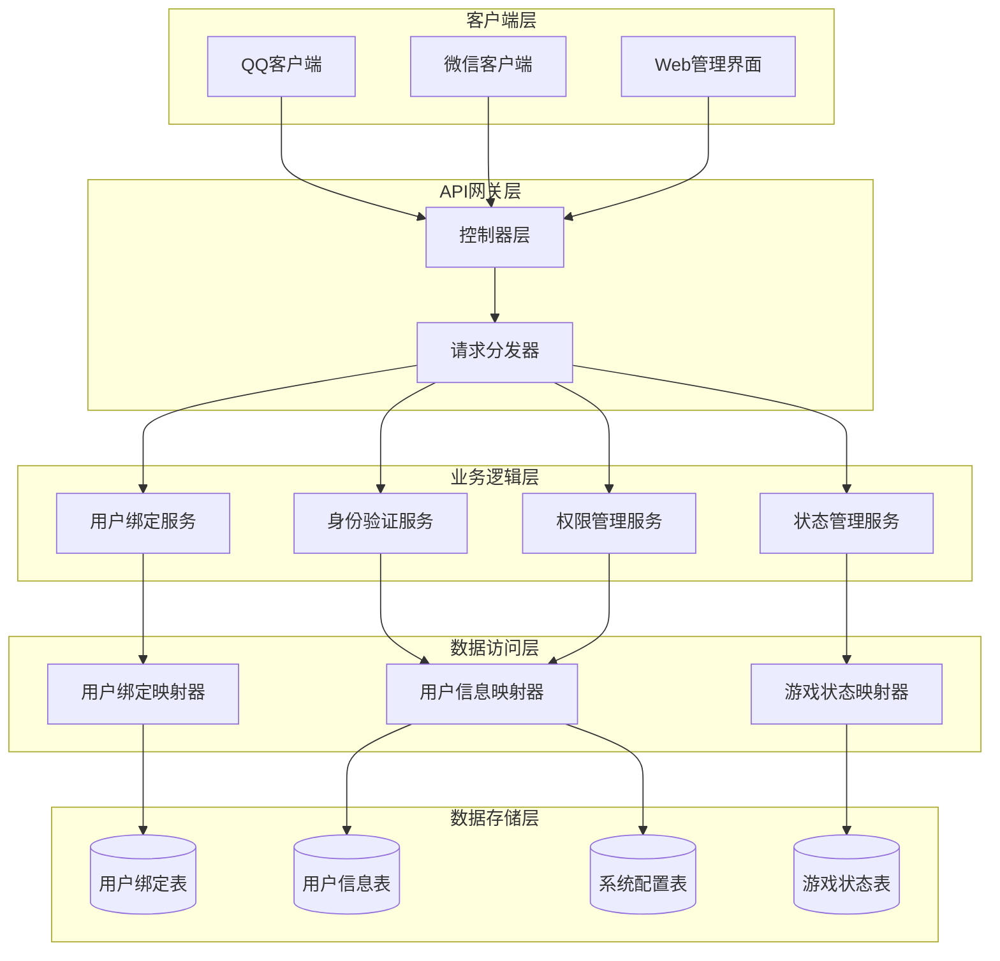
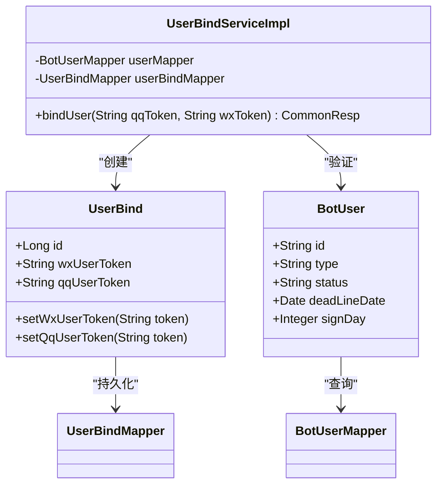
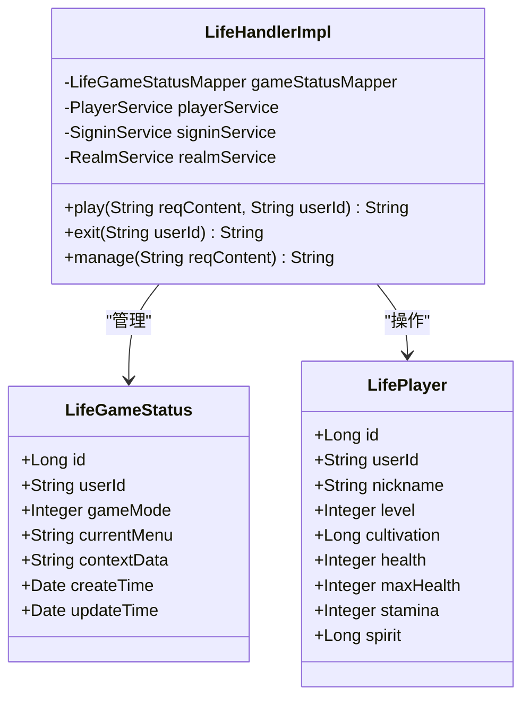
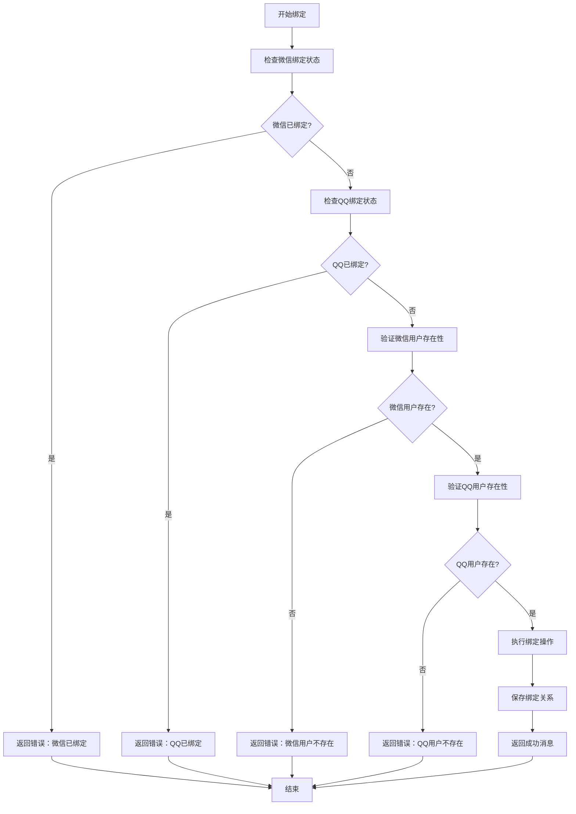
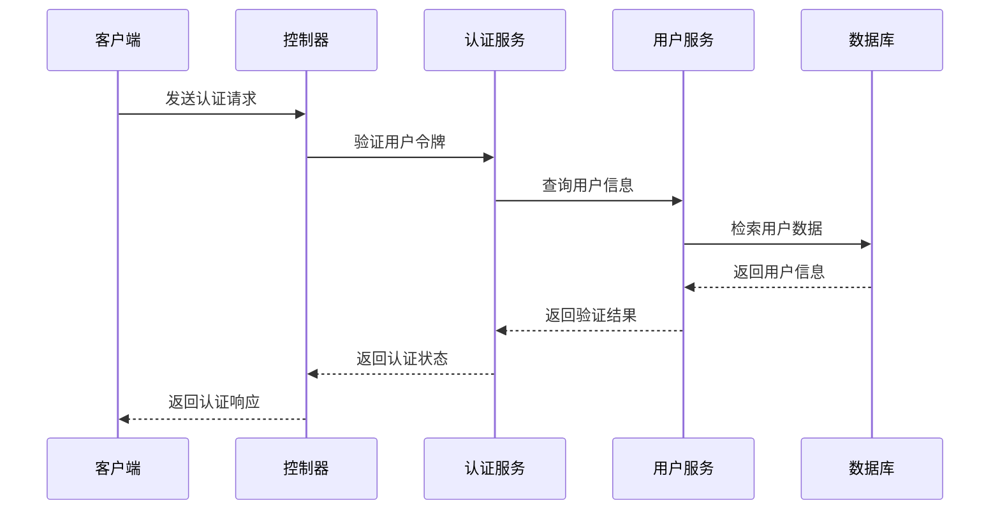
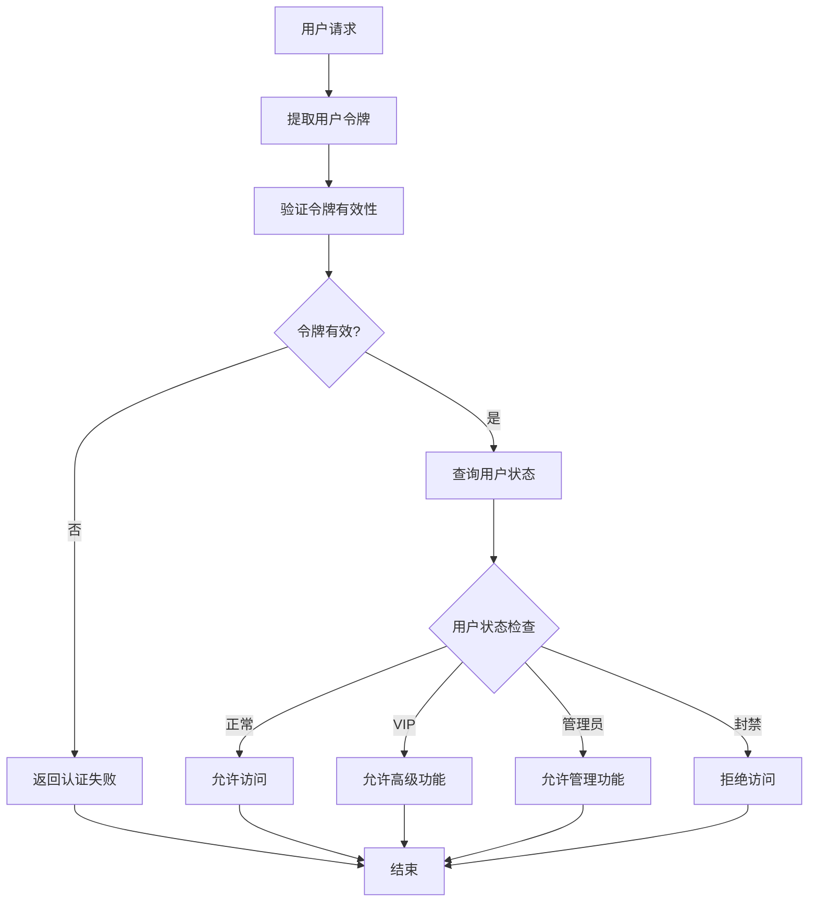
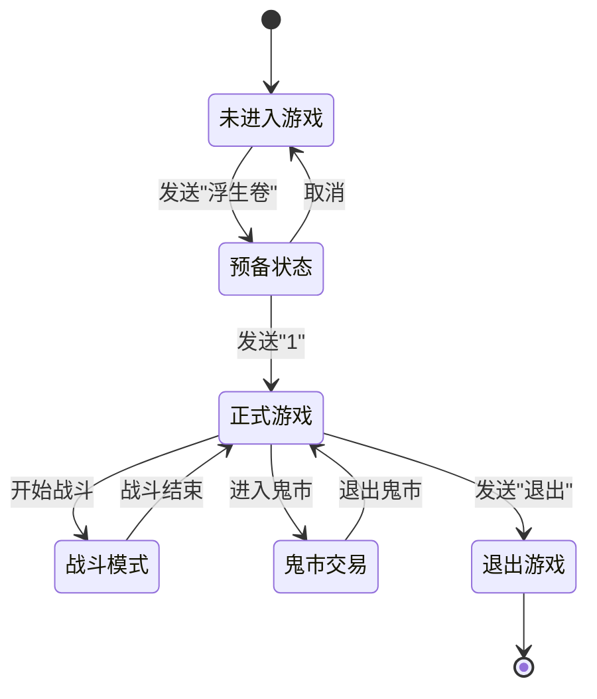
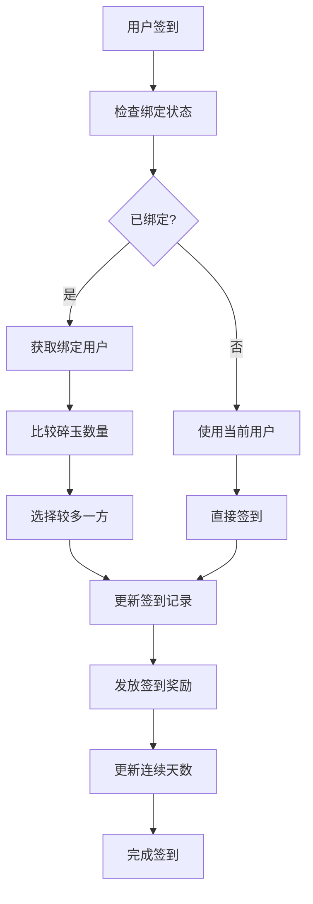
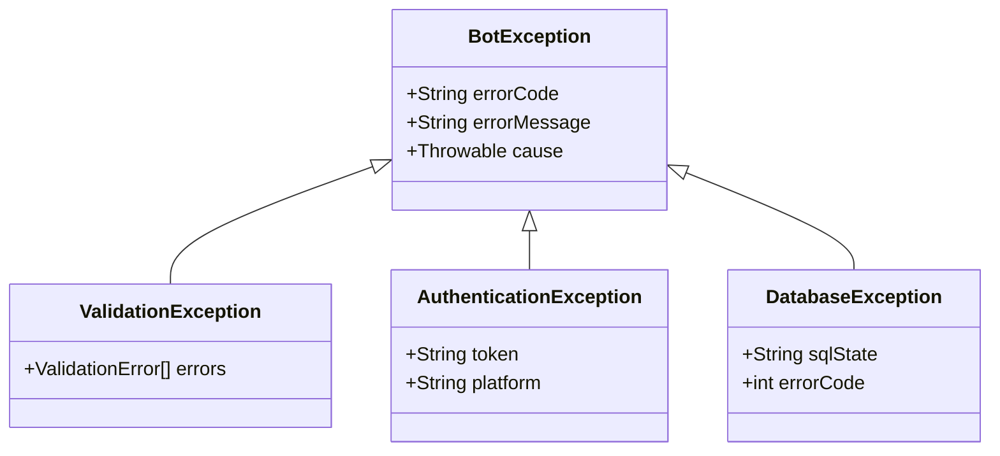

# 用户管理API文档

<cite>
**本文档引用的文件**
- [UserBindServiceImpl.java](file://Base/src/main/java/com/bot/base/service/impl/UserBindServiceImpl.java)
- [LifeHandlerImpl.java](file://Life/src/main/java/com/bot/life/service/impl/LifeHandlerImpl.java)
- [UserBind.java](file://Game/src/main/java/com/bot/game/dao/entity/UserBind.java)
- [BotUser.java](file://Game/src/main/java/com/bot/game/dao/entity/BotUser.java)
- [UserBindMapper.java](file://Game/src/main/java/com/bot/game/dao/mapper/UserBindMapper.java)
- [BotUserMapper.java](file://Game/src/main/java/com/bot/game/dao/mapper/BotUserMapper.java)
- [GlobalExceptionHandler.java](file://Boot/src/main/java/com/bot/boot/aspect/GlobalExceptionHandler.java)
- [TopTokenServiceImpl.java](file://Base/src/main/java/com/bot/base/service/impl/TopTokenServiceImpl.java)
- [SignServiceImpl.java](file://Base/src/main/java/com/bot/base/service/impl/SignServiceImpl.java)
- [Life_Database_Init.sql](file://Life_Database_Init.sql)
</cite>

## 目录
1. [简介](#简介)
2. [系统架构](#系统架构)
3. [核心组件](#核心组件)
4. [用户绑定功能](#用户绑定功能)
5. [身份验证机制](#身份验证机制)
6. [权限管理](#权限管理)
7. [用户状态管理](#用户状态管理)
8. [API接口规范](#api接口规范)
9. [安全验证机制](#安全验证机制)
10. [异常处理策略](#异常处理策略)
11. [性能优化建议](#性能优化建议)
12. [故障排除指南](#故障排除指南)

## 简介

本文档详细描述了Bot系统中的用户管理API，重点介绍了用户绑定、身份验证和权限管理的核心功能。该系统支持QQ和微信账号的双向绑定，实现了完整的用户生命周期管理，并提供了多层次的安全验证机制。

## 系统架构



**图表来源**
- [UserBindServiceImpl.java](file://Base/src/main/java/com/bot/base/service/impl/UserBindServiceImpl.java#L17-L62)
- [LifeHandlerImpl.java](file://Life/src/main/java/com/bot/life/service/impl/LifeHandlerImpl.java#L49-L1859)

## 核心组件

### 用户绑定服务 (UserBindServiceImpl)

用户绑定服务是系统的核心组件，负责处理QQ和微信账号的绑定、解绑和查询操作。



**图表来源**
- [UserBindServiceImpl.java](file://Base/src/main/java/com/bot/base/service/impl/UserBindServiceImpl.java#L17-L62)
- [UserBind.java](file://Game/src/main/java/com/bot/game/dao/entity/UserBind.java#L45-L129)
- [BotUser.java](file://Game/src/main/java/com/bot/game/dao/entity/BotUser.java#L6-L214)

### 生命游戏处理器 (LifeHandlerImpl)

生命游戏处理器负责管理用户的浮生卷游戏状态，包括角色创建、游戏模式切换和状态维护。



**图表来源**
- [LifeHandlerImpl.java](file://Life/src/main/java/com/bot/life/service/impl/LifeHandlerImpl.java#L49-L1859)
- [LifeGameStatus.java](file://Life/src/main/java/com/bot/life/dao/entity/LifeGameStatus.java#L1-L20)

**章节来源**
- [UserBindServiceImpl.java](file://Base/src/main/java/com/bot/base/service/impl/UserBindServiceImpl.java#L17-L62)
- [LifeHandlerImpl.java](file://Life/src/main/java/com/bot/life/service/impl/LifeHandlerImpl.java#L49-L1859)

## 用户绑定功能

### bindUser 方法详解

`bindUser` 方法是用户绑定功能的核心实现，提供了完整的绑定流程控制。

#### 绑定流程图



**图表来源**
- [UserBindServiceImpl.java](file://Base/src/main/java/com/bot/base/service/impl/UserBindServiceImpl.java#L27-L59)

#### 数据验证流程

系统在绑定过程中执行严格的数据验证：

1. **重复绑定检查**：防止同一微信或QQ账号多次绑定
2. **用户存在性验证**：确保绑定的账号已在系统中注册
3. **数据完整性校验**：验证输入参数的有效性和格式

#### 事务管理

绑定操作采用数据库事务管理，确保数据一致性：

- **原子性**：绑定操作要么完全成功，要么完全失败
- **一致性**：保持数据库状态的一致性
- **隔离性**：防止并发操作导致的数据冲突
- **持久性**：确保操作结果的永久保存

**章节来源**
- [UserBindServiceImpl.java](file://Base/src/main/java/com/bot/base/service/impl/UserBindServiceImpl.java#L27-L59)

## 身份验证机制

### 多渠道认证

系统支持多种认证渠道，包括QQ和微信平台的用户认证。

#### 认证流程



**图表来源**
- [SignServiceImpl.java](file://Base/src/main/java/com/bot/base/service/impl/SignServiceImpl.java#L50-L66)

### 令牌管理

系统采用令牌机制进行用户身份识别和状态跟踪：

- **令牌生成**：基于用户唯一标识生成认证令牌
- **令牌验证**：验证令牌的有效性和时效性
- **令牌刷新**：支持令牌的自动刷新机制

**章节来源**
- [SignServiceImpl.java](file://Base/src/main/java/com/bot/base/service/impl/SignServiceImpl.java#L50-L66)

## 权限管理

### 用户状态体系

系统通过用户状态来管理权限级别和功能访问控制。

#### 用户状态枚举

| 状态 | 描述 | 权限级别 |
|------|------|----------|
| NORMAL | 正常用户 | 基础功能 |
| VIP | VIP用户 | 高级功能 |
| ADMIN | 管理员 | 系统管理 |
| BANNED | 封禁用户 | 无访问权限 |

#### 权限验证流程



**图表来源**
- [BotUser.java](file://Game/src/main/java/com/bot/game/dao/entity/BotUser.java#L29-L37)

**章节来源**
- [BotUser.java](file://Game/src/main/java/com/bot/game/dao/entity/BotUser.java#L29-L37)

## 用户状态管理

### 生命周期管理

系统实现了完整的用户生命周期管理，涵盖从注册到注销的全过程。

#### 游戏状态管理



**图表来源**
- [LifeHandlerImpl.java](file://Life/src/main/java/com/bot/life/service/impl/LifeHandlerImpl.java#L147-L166)

### 签到状态管理

系统提供完善的签到功能，支持连续签到和奖励机制。

#### 签到流程



**图表来源**
- [SignServiceImpl.java](file://Base/src/main/java/com/bot/base/service/impl/SignServiceImpl.java#L50-L66)

**章节来源**
- [LifeHandlerImpl.java](file://Life/src/main/java/com/bot/life/service/impl/LifeHandlerImpl.java#L147-L166)
- [SignServiceImpl.java](file://Base/src/main/java/com/bot/base/service/impl/SignServiceImpl.java#L50-L66)

## API接口规范

### 用户绑定接口

#### 接口定义

| 参数 | 类型 | 必填 | 描述 |
|------|------|------|------|
| qqToken | String | 是 | QQ平台用户令牌 |
| wxToken | String | 是 | 微信平台用户令牌 |

#### 请求示例

```json
{
  "qqToken": "QQ_PLATFORM_TOKEN",
  "wxToken": "WECHAT_PLATFORM_TOKEN"
}
```

#### 响应格式

**成功响应：**
```json
{
  "code": "SUCCESS",
  "message": "恭喜绑定成功，从此两边碎玉可以共享了！\r\n（绑定成功后碎玉以较多的一边为准，仅碎玉共享，资格不共享，连续签到天数不共享）",
  "data": null
}
```

**错误响应：**
```json
{
  "code": "ERROR",
  "message": "此次绑定的微信已经有过绑定记录，无法再次绑定。",
  "data": null
}
```

### 用户状态查询接口

#### 接口定义

| 参数 | 类型 | 必填 | 描述 |
|------|------|------|------|
| userId | String | 是 | 用户唯一标识 |

#### 响应格式

```json
{
  "userId": "USER_ID",
  "gameMode": 2,
  "currentMenu": "MAIN_MENU",
  "contextData": "{\"key\":\"value\"}",
  "createTime": "2024-01-01T00:00:00Z",
  "updateTime": "2024-01-01T00:00:00Z"
}
```

### 签到接口

#### 接口定义

| 参数 | 类型 | 必填 | 描述 |
|------|------|------|------|
| userId | String | 是 | 用户唯一标识 |
| platform | String | 是 | 平台类型（qq/wechat） |

#### 响应格式

```json
{
  "code": "SUCCESS",
  "message": "签到成功，获得100灵粹！\n连续签到：5天",
  "data": {
    "spiritGained": 100,
    "signDays": 5,
    "totalSpirit": 1500
  }
}
```

**章节来源**
- [UserBindServiceImpl.java](file://Base/src/main/java/com/bot/base/service/impl/UserBindServiceImpl.java#L27-L59)
- [LifeHandlerImpl.java](file://Life/src/main/java/com/bot/life/service/impl/LifeHandlerImpl.java#L827-L842)

## 安全验证机制

### 输入验证

系统对所有用户输入进行严格的验证和过滤：

1. **格式验证**：检查输入数据的格式正确性
2. **长度限制**：限制输入字段的最大长度
3. **字符过滤**：防止恶意字符注入
4. **范围检查**：验证数值参数的有效范围

### 数据加密

敏感数据采用加密存储和传输：

- **密码哈希**：使用强哈希算法存储密码
- **传输加密**：HTTPS协议保护数据传输
- **令牌签名**：使用数字签名验证令牌完整性

### 访问控制

实施细粒度的访问控制机制：

- **角色基础访问控制**：基于用户角色的功能访问
- **资源访问控制**：针对特定资源的访问权限
- **时间窗口控制**：限制操作的时间窗口

**章节来源**
- [GlobalExceptionHandler.java](file://Boot/src/main/java/com/bot/boot/aspect/GlobalExceptionHandler.java#L16-L26)

## 异常处理策略

### 异常分类

系统定义了完整的异常处理体系：



### 错误码定义

| 错误码 | 描述 | 处理方式 |
|--------|------|----------|
| 40001 | 参数验证失败 | 返回具体验证错误 |
| 40002 | 用户不存在 | 提示用户注册 |
| 40003 | 绑定关系已存在 | 提示用户解绑 |
| 40004 | 令牌过期 | 请求重新认证 |
| 50001 | 系统内部错误 | 记录日志并返回通用错误 |

### 异常恢复机制

系统提供多种异常恢复策略：

1. **自动重试**：对于临时性错误提供自动重试机制
2. **降级处理**：在部分功能不可用时提供降级方案
3. **回滚机制**：确保操作失败时的数据一致性
4. **监控告警**：异常发生时及时通知运维团队

**章节来源**
- [GlobalExceptionHandler.java](file://Boot/src/main/java/com/bot/boot/aspect/GlobalExceptionHandler.java#L16-L26)

## 性能优化建议

### 缓存策略

1. **用户信息缓存**：缓存频繁访问的用户信息
2. **绑定关系缓存**：减少数据库查询次数
3. **状态信息缓存**：缓存游戏状态和配置信息

### 数据库优化

1. **索引优化**：为常用查询字段建立索引
2. **连接池配置**：合理配置数据库连接池
3. **查询优化**：优化复杂查询语句

### 并发控制

1. **乐观锁**：使用版本号控制并发更新
2. **分布式锁**：在集群环境中控制资源竞争
3. **队列机制**：异步处理高并发请求

## 故障排除指南

### 常见问题

#### 绑定失败

**问题现象**：用户绑定操作返回失败

**排查步骤**：
1. 检查输入参数格式是否正确
2. 验证用户是否已在系统中注册
3. 确认数据库连接状态
4. 查看系统日志获取详细错误信息

**解决方案**：
- 确保用户已在对应平台的签到群完成签到
- 检查网络连接和数据库服务状态
- 验证用户令牌的有效性

#### 签到异常

**问题现象**：用户签到功能无法正常使用

**排查步骤**：
1. 检查用户绑定状态
2. 验证签到时间间隔
3. 确认用户账户状态
4. 检查系统配置参数

**解决方案**：
- 重新绑定用户账号
- 等待签到时间间隔
- 联系管理员检查账户状态

### 监控指标

建议监控以下关键指标：

1. **API响应时间**：监控接口响应性能
2. **错误率**：跟踪各类错误的发生频率
3. **并发用户数**：监控系统负载情况
4. **数据库连接数**：确保数据库连接池健康

**章节来源**
- [TopTokenServiceImpl.java](file://Base/src/main/java/com/bot/base/service/impl/TopTokenServiceImpl.java#L35-L99)

## 结论

Bot系统的用户管理API提供了完整而强大的用户绑定、身份验证和权限管理功能。通过合理的架构设计、严格的安全验证和完善的异常处理机制，确保了系统的稳定性和安全性。开发者可以根据本文档的指导，有效地集成和使用这些API功能。