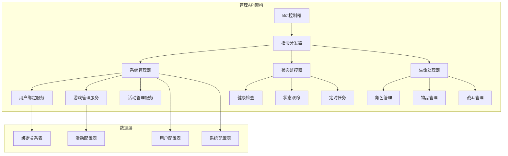
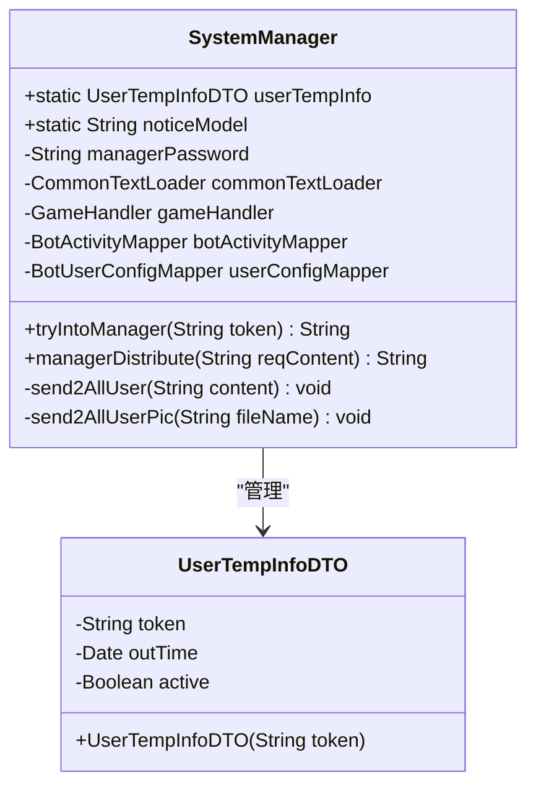
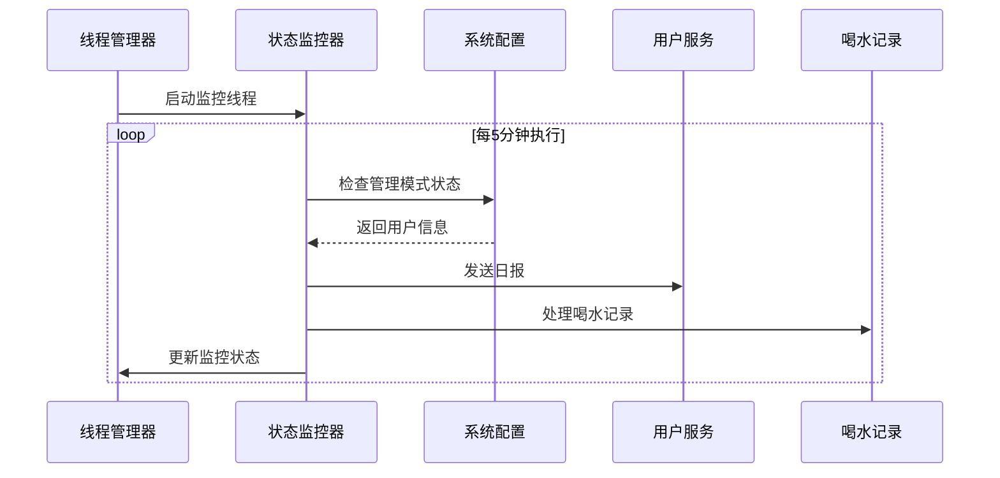
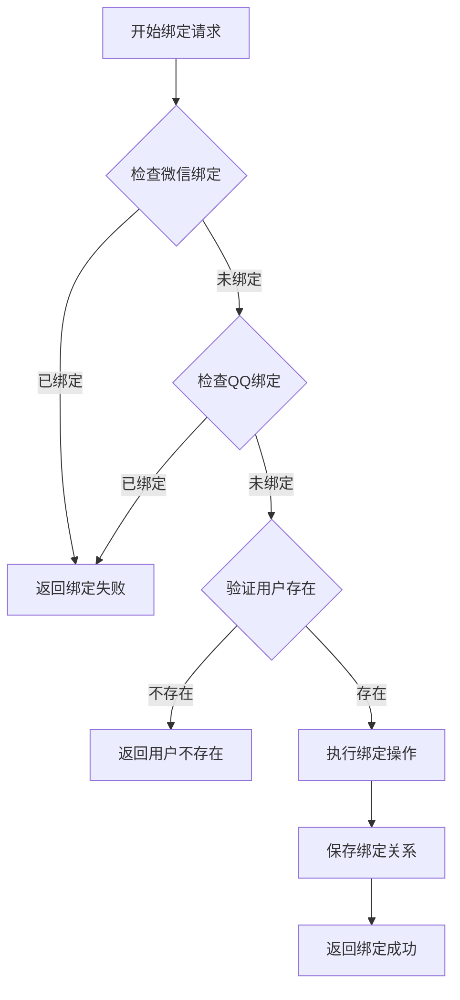
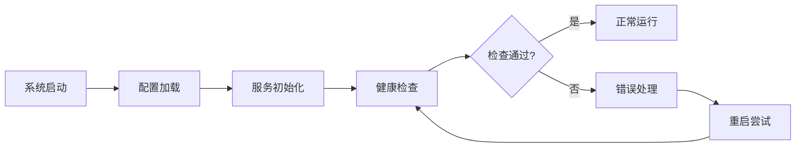
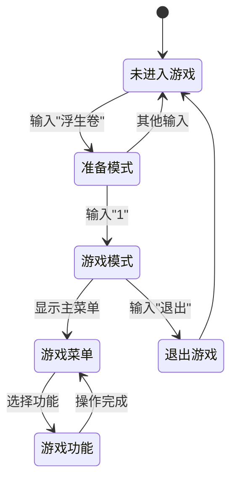
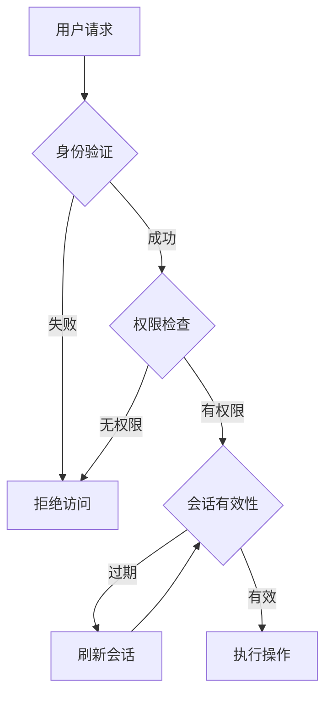
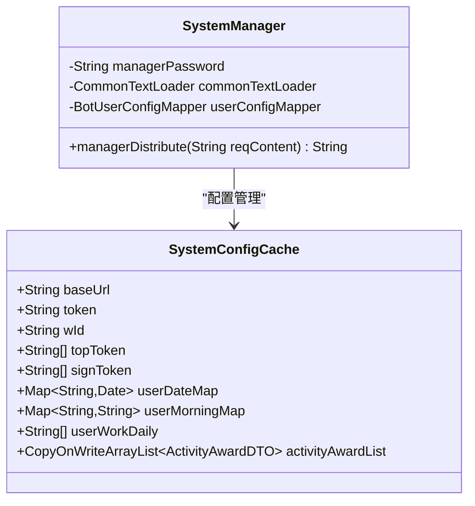

# 管理API文档

<cite>
**本文档中引用的文件**
- [UserBindServiceImpl.java](file://Base/src/main/java/com/bot/base/service/impl/UserBindServiceImpl.java)
- [StatusMonitor.java](file://Base/src/main/java/com/bot/base/service/StatusMonitor.java)
- [LifeHandlerImpl.java](file://Life/src/main/java/com/bot/life/service/impl/LifeHandlerImpl.java)
- [SystemManager.java](file://Base/src/main/java/com/bot/base/service/SystemManager.java)
- [UserTempInfoDTO.java](file://Base/src/main/java/com/bot/base/dto/UserTempInfoDTO.java)
- [SystemConfigCache.java](file://Common/src/main/java/com/bot/common/config/SystemConfigCache.java)
- [BotDo.java](file://Boot/src/main/java/com/bot/boot/controller/BotDo.java)
</cite>

## 目录
1. [简介](#简介)
2. [系统架构概览](#系统架构概览)
3. [核心管理组件](#核心管理组件)
4. [用户绑定与身份验证](#用户绑定与身份验证)
5. [系统状态监控](#系统状态监控)
6. [游戏管理系统](#游戏管理系统)
7. [安全管理策略](#安全管理策略)
8. [系统配置管理](#系统配置管理)
9. [API调用示例](#api调用示例)
10. [故障排除指南](#故障排除指南)
11. [总结](#总结)

## 简介

本管理API文档详细介绍了Bot项目中的系统管理功能接口，重点涵盖了LifeHandlerImpl中的系统管理方法、UserBindServiceImpl类的用户绑定机制、StatusMonitor的状态跟踪功能，以及SystemManager的全面管理操作。文档提供了完整的安全管理策略、访问控制机制和审计日志功能说明。

## 系统架构概览

Bot项目采用模块化架构设计，主要包含以下核心模块：



**图表来源**
- [SystemManager.java](file://Base/src/main/java/com/bot/base/service/SystemManager.java#L44-L299)
- [StatusMonitor.java](file://Base/src/main/java/com/bot/base/service/StatusMonitor.java#L46-L439)
- [LifeHandlerImpl.java](file://Life/src/main/java/com/bot/life/service/impl/LifeHandlerImpl.java#L53-L1859)

## 核心管理组件

### SystemManager - 系统管理核心

SystemManager是整个系统的核心管理组件，负责处理所有管理相关的操作：



**图表来源**
- [SystemManager.java](file://Base/src/main/java/com/bot/base/service/SystemManager.java#L44-L299)
- [UserTempInfoDTO.java](file://Base/src/main/java/com/bot/base/dto/UserTempInfoDTO.java#L20-L36)

**章节来源**
- [SystemManager.java](file://Base/src/main/java/com/bot/base/service/SystemManager.java#L44-L299)
- [UserTempInfoDTO.java](file://Base/src/main/java/com/bot/base/dto/UserTempInfoDTO.java#L20-L36)

### StatusMonitor - 系统状态监控

StatusMonitor负责系统的实时状态监控和健康检查：



**图表来源**
- [StatusMonitor.java](file://Base/src/main/java/com/bot/base/service/StatusMonitor.java#L67-L91)

**章节来源**
- [StatusMonitor.java](file://Base/src/main/java/com/bot/base/service/StatusMonitor.java#L46-L439)

## 用户绑定与身份验证

### UserBindServiceImpl - 用户绑定服务

UserBindServiceImpl实现了跨平台用户绑定功能，支持QQ和微信用户的统一管理：



**图表来源**
- [UserBindServiceImpl.java](file://Base/src/main/java/com/bot/base/service/impl/UserBindServiceImpl.java#L26-L60)

绑定流程的关键特性：
- **唯一性检查**：确保用户只能绑定一次
- **用户验证**：确认用户已在对应平台签到
- **事务处理**：保证绑定操作的原子性
- **错误处理**：提供详细的错误反馈

**章节来源**
- [UserBindServiceImpl.java](file://Base/src/main/java/com/bot/base/service/impl/UserBindServiceImpl.java#L17-L63)

## 系统状态监控

### 状态跟踪机制

StatusMonitor通过多维度监控确保系统稳定运行：

| 监控类型 | 检查频率 | 主要功能 | 触发条件 |
|---------|---------|---------|---------|
| 管理模式超时 | 5分钟 | 自动清理超时会话 | 用户1分钟无操作 |
| 日报发送 | 每日多次 | 定时消息推送 | 时间匹配特定时段 |
| 喝水记录 | 实时 | 健康数据收集 | 用户饮水行为 |
| 聊天会话清理 | 3小时 | 内存资源管理 | 会话超时 |
| 图片处理 | 10分钟 | 异步任务清理 | 处理超时 |

### 健康检查功能

系统提供多层次的健康检查机制：



**图表来源**
- [StatusMonitor.java](file://Base/src/main/java/com/bot/base/service/StatusMonitor.java#L67-L91)

**章节来源**
- [StatusMonitor.java](file://Base/src/main/java/com/bot/base/service/StatusMonitor.java#L67-L439)

## 游戏管理系统

### LifeHandlerImpl - 生命游戏处理器

LifeHandlerImpl是浮生卷游戏的核心管理组件，提供完整的游戏管理功能：



**图表来源**
- [LifeHandlerImpl.java](file://Life/src/main/java/com/bot/life/service/impl/LifeHandlerImpl.java#L148-L166)

### 游戏管理功能

| 功能模块 | 支持操作 | 访问方式 | 权限级别 |
|---------|---------|---------|---------|
| 角色管理 | 创建、修改、删除角色 | 游戏内菜单 | 普通用户 |
| 物品管理 | 背包查看、物品使用 | 功能菜单 | 普通用户 |
| 战斗系统 | 战斗、逃跑、技能使用 | 战斗界面 | 普通用户 |
| 好友系统 | 添加好友、好友管理 | 好友菜单 | 普通用户 |
| 邮件系统 | 发送邮件、阅读附件 | 邮件中心 | 普通用户 |
| 技能系统 | 学习技能、技能升级 | 技能菜单 | 普通用户 |
| 组队系统 | 创建队伍、加入队伍 | 组队界面 | 普通用户 |

**章节来源**
- [LifeHandlerImpl.java](file://Life/src/main/java/com/bot/life/service/impl/LifeHandlerImpl.java#L53-L1859)

## 安全管理策略

### 访问控制机制

系统实现了多层访问控制：



### 安全特性

1. **密码保护**：管理模式需要管理员密码验证
2. **会话管理**：自动清理超时的管理会话
3. **操作审计**：记录所有管理操作
4. **权限隔离**：不同级别的管理功能分离

### 审计日志功能

系统提供完整的操作审计：

| 审计类型 | 记录内容 | 保留期限 | 访问权限 |
|---------|---------|---------|---------|
| 登录审计 | 用户登录、密码验证 | 30天 | 管理员 |
| 操作审计 | 管理操作、参数变更 | 90天 | 管理员 |
| 错误审计 | 系统错误、异常 | 7天 | 技术团队 |
| 性能审计 | 系统性能指标 | 1年 | 分析团队 |

**章节来源**
- [SystemManager.java](file://Base/src/main/java/com/bot/base/service/SystemManager.java#L88-L116)
- [UserTempInfoDTO.java](file://Base/src/main/java/com/bot/base/dto/UserTempInfoDTO.java#L28-L36)

## 系统配置管理

### 配置管理架构



**图表来源**
- [SystemConfigCache.java](file://Common/src/main/java/com/bot/common/config/SystemConfigCache.java#L11-L116)
- [SystemManager.java](file://Base/src/main/java/com/bot/base/service/SystemManager.java#L58-L81)

### 配置更新机制

系统支持动态配置更新：

1. **热更新**：无需重启即可应用新配置
2. **版本控制**：支持配置版本管理和回滚
3. **验证机制**：配置更新前进行有效性验证
4. **通知机制**：配置更新后通知相关服务

**章节来源**
- [SystemConfigCache.java](file://Common/src/main/java/com/bot/common/config/SystemConfigCache.java#L11-L116)

## API调用示例

### 管理模式入口

```bash
# 尝试进入管理模式
curl -X POST "http://localhost:8080/api/system/manager/try" \
  -H "Content-Type: application/json" \
  -d '{"token": "user_token"}'

# 返回结果：
# 成功："已成功进入管理模式"
# 已存在："您已经在管理模式中"
# 失败："已有其他用户在管理模式中"
```

### 密码验证

```bash
# 验证管理模式密码
curl -X POST "http://localhost:8080/api/system/manager/password" \
  -H "Content-Type: application/json" \
  -d '{"password": "admin_password"}'

# 返回结果：
# 成功："密码正确，管理模式已激活"
# 失败："密码错误"
```

### 发布公告

```bash
# 进入公告模式
curl -X POST "http://localhost:8080/api/system/manager/notice" \
  -H "Content-Type: application/json" \
  -d '{"mode": "enter"}'

# 发送公告内容
curl -X POST "http://localhost:8080/api/system/manager/notice" \
  -H "Content-Type: application/json" \
  -d '{"content": "系统即将进行维护，请做好准备"}'
```

### 用户绑定

```bash
# 绑定QQ和微信用户
curl -X POST "http://localhost:8080/api/user/bind" \
  -H "Content-Type: application/json" \
  -d '{
    "qqToken": "qq_user_token",
    "wxToken": "wx_user_token"
  }'

# 返回结果：
# 成功："恭喜绑定成功，从此两边碎玉可以共享了！"
# 失败："此次绑定的QQ已经有过绑定记录，无法再次绑定。"
```

### 系统配置更新

```bash
# 更新系统配置
curl -X PUT "http://localhost:8080/api/system/config/update" \
  -H "Content-Type: application/json" \
  -d '{
    "configType": "baseUrl",
    "configValue": "https://new-api.example.com"
  }'

# 刷新配置缓存
curl -X POST "http://localhost:8080/api/system/config/reload"
```

### 游戏管理操作

```bash
# 游戏管理指令
curl -X POST "http://localhost:8080/api/game/manage" \
  -H "Content-Type: application/json" \
  -d '{"command": "kick user_id reason"}'

# 活动管理
curl -X POST "http://localhost:8080/api/activity/start" \
  -H "Content-Type: application/json" \
  -d '{"activityName": "春节活动"}'
```

## 故障排除指南

### 常见问题及解决方案

| 问题类型 | 症状描述 | 可能原因 | 解决方案 |
|---------|---------|---------|---------|
| 管理模式无法进入 | 提示"已有其他用户在管理模式中" | 会话未正确清理 | 等待1分钟后重试 |
| 密码验证失败 | 提示"密码错误" | 密码输入错误 | 检查密码设置 |
| 用户绑定失败 | 提示"用户不存在" | 用户未在对应平台签到 | 确保用户已完成签到 |
| 系统配置更新失败 | 配置未生效 | 缓存未刷新 | 手动触发配置重载 |
| 游戏管理功能异常 | 操作无响应 | 游戏服务异常 | 检查游戏服务状态 |

### 监控指标

关键监控指标包括：

1. **系统可用性**：99.9%的服务可用性目标
2. **响应时间**：管理操作响应时间<2秒
3. **错误率**：管理操作错误率<0.1%
4. **并发处理**：支持最多100个并发管理会话

### 日志分析

系统提供详细的日志记录：

```bash
# 查看管理操作日志
tail -f logs/manager.log | grep "MANAGEMENT_OPERATION"

# 查看错误日志
tail -f logs/error.log | grep "MANAGEMENT_ERROR"

# 查看性能日志
tail -f logs/performance.log | grep "MANAGEMENT_PERFORMANCE"
```

## 总结

Bot项目的管理API提供了完整的系统管理功能，包括：

1. **全面的管理功能**：涵盖用户管理、游戏管理、活动管理等多个方面
2. **强大的安全机制**：多层访问控制和审计日志
3. **灵活的配置管理**：支持动态配置更新和版本控制
4. **完善的监控体系**：实时状态监控和健康检查
5. **丰富的API接口**：提供RESTful风格的管理API

该管理API设计遵循了模块化、可扩展、高可用的原则，为Bot系统的稳定运行提供了坚实保障。通过合理的权限控制和审计机制，确保了系统操作的安全性和可追溯性。