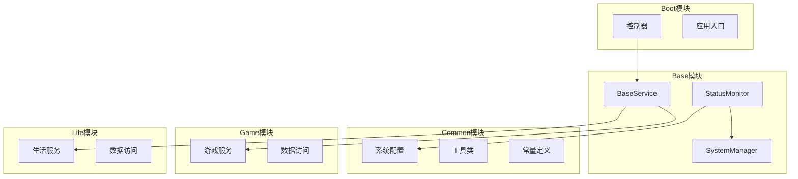
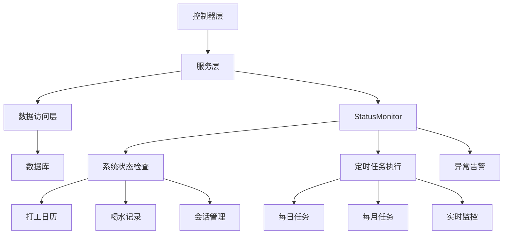
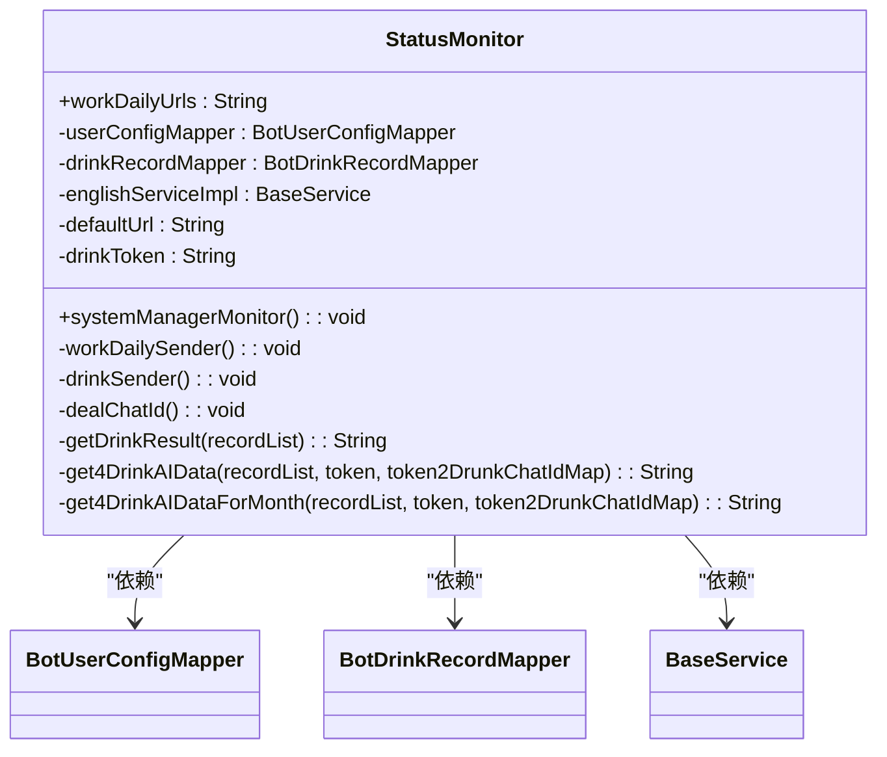
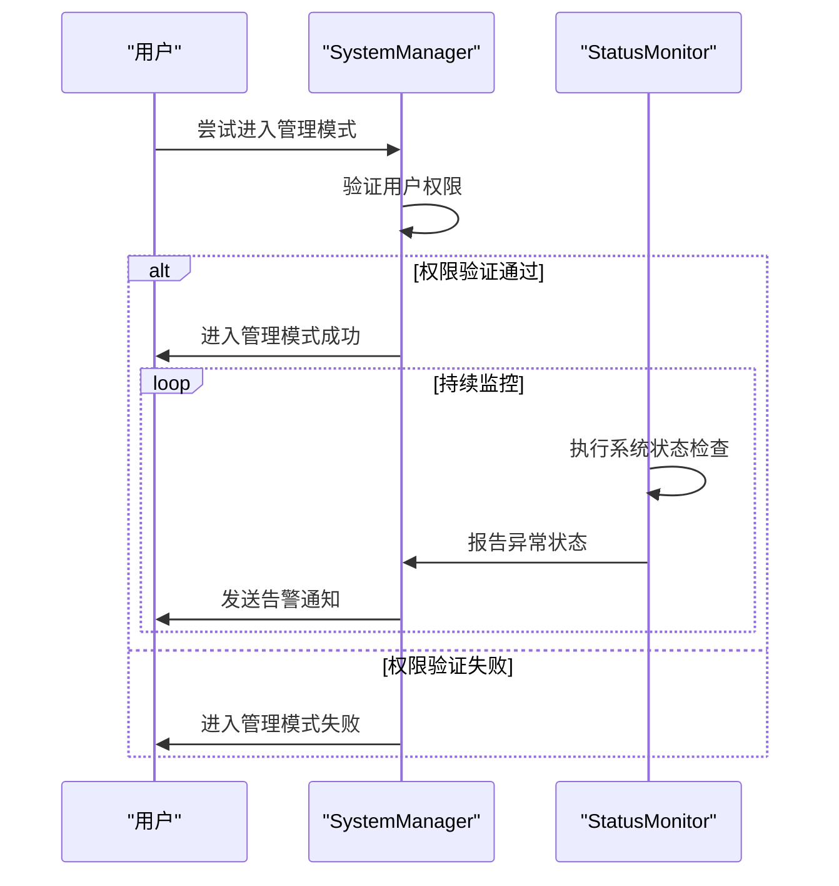
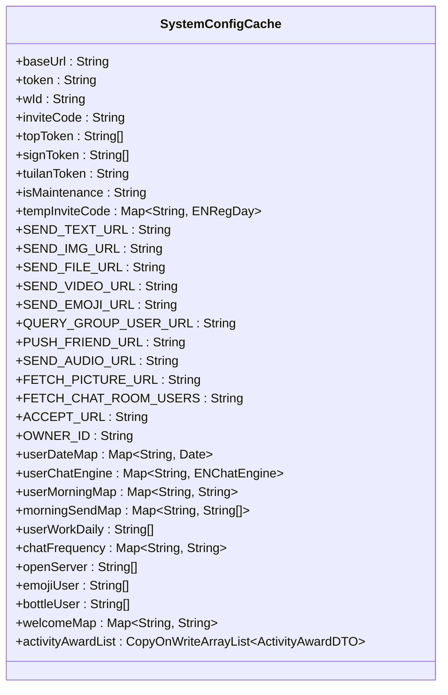
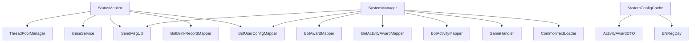

# 系统监控API

<cite>
**本文档引用的文件**   
- [StatusMonitor.java](file://Base/src/main/java/com/bot/base/service/StatusMonitor.java)
- [SystemManager.java](file://Base/src/main/java/com/bot/base/service/SystemManager.java)
- [SystemConfigCache.java](file://Common/src/main/java/com/bot/common/config/SystemConfigCache.java)
- [BaseConsts.java](file://Common/src/main/java/com/bot/common/constant/BaseConsts.java)
- [application.properties](file://Boot/src/main/resources/application.properties)
- [newInstructDistributeController.java](file://Boot/src/main/java/com/bot/boot/controller/newInstructDistributeController.java)
</cite>

## 目录
1. [引言](#引言)
2. [项目结构](#项目结构)
3. [核心组件](#核心组件)
4. [架构概述](#架构概述)
5. [详细组件分析](#详细组件分析)
6. [依赖分析](#依赖分析)
7. [性能考虑](#性能考虑)
8. [故障排除指南](#故障排除指南)
9. [结论](#结论)

## 引言
本系统监控API文档旨在系统性地记录Bot项目的系统状态跟踪、健康检查和性能监控的实现方案。文档重点描述了StatusMonitor类中的监控指标采集、系统状态报告和异常告警机制，详细解释了监控数据的采集频率、存储方式和可视化方案。通过本API文档，用户可以了解系统健康检查、资源使用率查询和性能指标监控等API的调用方法，包括端点URL、请求参数和响应数据格式。文档还涵盖了监控阈值配置、告警策略设置和故障诊断流程，为系统的稳定运行提供全面的技术支持。

## 项目结构
Bot项目采用模块化设计，主要分为Base、Boot、Common、Game和Life五个核心模块。Base模块包含基础服务和状态监控功能，Boot模块负责系统启动和控制器管理，Common模块提供通用配置和工具类，Game模块实现游戏相关功能，Life模块则专注于生活类服务。这种分层架构确保了各功能模块的独立性和可维护性，为系统的扩展和优化提供了良好的基础。

**Diagram sources**
- [StatusMonitor.java](file://Base/src/main/java/com/bot/base/service/StatusMonitor.java)
- [SystemManager.java](file://Base/src/main/java/com/bot/base/service/SystemManager.java)
- [SystemConfigCache.java](file://Common/src/main/java/com/bot/common/config/SystemConfigCache.java)

**Section sources**
- [StatusMonitor.java](file://Base/src/main/java/com/bot/base/service/StatusMonitor.java)
- [SystemManager.java](file://Base/src/main/java/com/bot/base/service/SystemManager.java)
- [SystemConfigCache.java](file://Common/src/main/java/com/bot/common/config/SystemConfigCache.java)

## 核心组件
系统监控的核心组件是StatusMonitor类，它负责执行各种定时任务和状态检查。该类通过systemManagerMonitor方法启动一个后台线程，定期检查系统状态并执行相应的操作。监控功能包括打工日历发送、喝水记录发送和会话处理等。StatusMonitor还与SystemManager协作，实现系统级别的管理和控制功能。通过依赖注入，StatusMonitor获取必要的服务和数据访问对象，确保监控任务的顺利执行。

**Section sources**
- [StatusMonitor.java](file://Base/src/main/java/com/bot/base/service/StatusMonitor.java)
- [SystemManager.java](file://Base/src/main/java/com/bot/base/service/SystemManager.java)

## 架构概述
系统监控架构采用分层设计，由控制器层、服务层和数据访问层组成。控制器层负责接收外部请求并进行路由，服务层实现核心业务逻辑和监控功能，数据访问层则负责与数据库交互。StatusMonitor作为服务层的核心组件，通过定时任务机制实现对系统状态的持续监控。整个架构通过Spring框架的依赖注入机制实现组件间的松耦合，提高了系统的可维护性和可扩展性。

**Diagram sources**
- [StatusMonitor.java](file://Base/src/main/java/com/bot/base/service/StatusMonitor.java)
- [SystemManager.java](file://Base/src/main/java/com/bot/base/service/SystemManager.java)
- [SystemConfigCache.java](file://Common/src/main/java/com/bot/common/config/SystemConfigCache.java)

## 详细组件分析

### StatusMonitor类分析
StatusMonitor类是系统监控的核心，它通过systemManagerMonitor方法启动一个后台线程，定期执行各种监控任务。该类的主要功能包括打工日历发送、喝水记录发送和会话处理。通过@PostConstruct注解，StatusMonitor在Spring容器初始化完成后自动启动监控线程。监控线程以5分钟为间隔循环执行，确保系统状态的实时监控。

**Diagram sources**
- [StatusMonitor.java](file://Base/src/main/java/com/bot/base/service/StatusMonitor.java)

**Section sources**
- [StatusMonitor.java](file://Base/src/main/java/com/bot/base/service/StatusMonitor.java)

### 系统管理分析
SystemManager类负责系统的高级管理功能，包括管理模式的进入和退出、公告发布、文本刷新等。该类通过静态变量userTempInfo跟踪当前操作用户，确保同一时间只允许一个人进行系统管理。SystemManager还提供了多种管理指令，如发布公告、发送朋友圈、生成邀请码等，为系统管理员提供了强大的控制能力。

**Diagram sources**
- [SystemManager.java](file://Base/src/main/java/com/bot/base/service/SystemManager.java)
- [StatusMonitor.java](file://Base/src/main/java/com/bot/base/service/StatusMonitor.java)

**Section sources**
- [SystemManager.java](file://Base/src/main/java/com/bot/base/service/SystemManager.java)

### 配置管理分析
SystemConfigCache类负责管理系统的全局配置信息，包括基础URL、token、wid等。该类采用静态变量的方式存储配置数据，确保在整个应用程序生命周期内配置信息的一致性。SystemConfigCache还维护了多个映射表，如用户到期时间映射、用户聊天引擎映射、日报订阅情况映射等，为系统的各种功能提供配置支持。

**Diagram sources**
- [SystemConfigCache.java](file://Common/src/main/java/com/bot/common/config/SystemConfigCache.java)

**Section sources**
- [SystemConfigCache.java](file://Common/src/main/java/com/bot/common/config/SystemConfigCache.java)

## 依赖分析
系统监控组件依赖于多个核心模块和外部服务。StatusMonitor依赖于BotUserConfigMapper和BotDrinkRecordMapper进行数据访问，依赖于BaseService进行业务逻辑处理。SystemManager依赖于CommonTextLoader进行文本加载，依赖于GameHandler进行游戏管理。整个系统还依赖于外部的HTTP服务进行消息发送和数据获取。这些依赖关系通过Spring框架的依赖注入机制进行管理，确保了组件间的松耦合和系统的可维护性。

**Diagram sources**
- [StatusMonitor.java](file://Base/src/main/java/com/bot/base/service/StatusMonitor.java)
- [SystemManager.java](file://Base/src/main/java/com/bot/base/service/SystemManager.java)
- [SystemConfigCache.java](file://Common/src/main/java/com/bot/common/config/SystemConfigCache.java)

**Section sources**
- [StatusMonitor.java](file://Base/src/main/java/com/bot/base/service/StatusMonitor.java)
- [SystemManager.java](file://Base/src/main/java/com/bot/base/service/SystemManager.java)
- [SystemConfigCache.java](file://Common/src/main/java/com/bot/common/config/SystemConfigCache.java)

## 性能考虑
系统监控在设计时充分考虑了性能因素。StatusMonitor采用后台线程执行监控任务，避免阻塞主线程。监控任务的执行间隔设置为5分钟，平衡了实时性和系统负载。数据访问操作通过MyBatis框架进行优化，减少了数据库查询的开销。此外，系统还使用了缓存机制，如SystemConfigCache中的各种映射表，减少了重复的数据访问。对于耗时的操作，如消息发送，系统采用异步处理方式，进一步提高了响应速度。

## 故障排除指南
当系统监控出现异常时，可以按照以下步骤进行故障排除：首先检查StatusMonitor的后台线程是否正常运行，确认systemManagerMonitor方法是否被正确调用。其次检查相关配置项是否正确设置，如work.daily.urls、chat.url等。然后查看日志文件，特别是error级别的日志，定位具体的错误信息。对于数据库相关的问题，检查BotUserConfigMapper和BotDrinkRecordMapper的查询结果是否正常。最后，如果问题仍然存在，可以尝试重启系统或联系技术支持。

**Section sources**
- [StatusMonitor.java](file://Base/src/main/java/com/bot/base/service/StatusMonitor.java)
- [SystemManager.java](file://Base/src/main/java/com/bot/base/service/SystemManager.java)
- [logback-spring.xml](file://Boot/src/main/resources/logback-spring.xml)

## 结论
本系统监控API文档全面介绍了Bot项目的监控机制和实现方案。通过StatusMonitor类的定时任务和状态检查，系统能够实时监控关键指标并及时响应异常情况。文档详细描述了监控数据的采集频率、存储方式和可视化方案，为系统的稳定运行提供了有力支持。未来可以考虑增加更多的监控指标和告警策略，进一步提升系统的可靠性和用户体验。