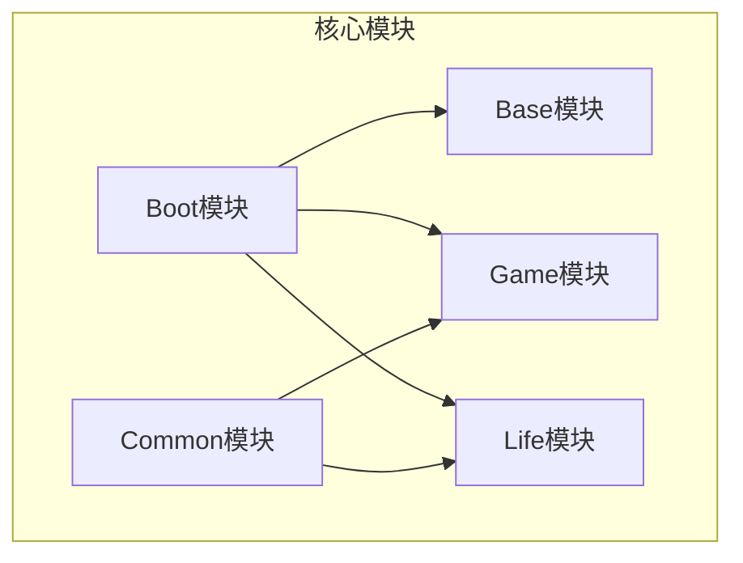
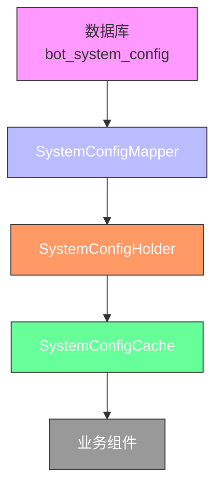
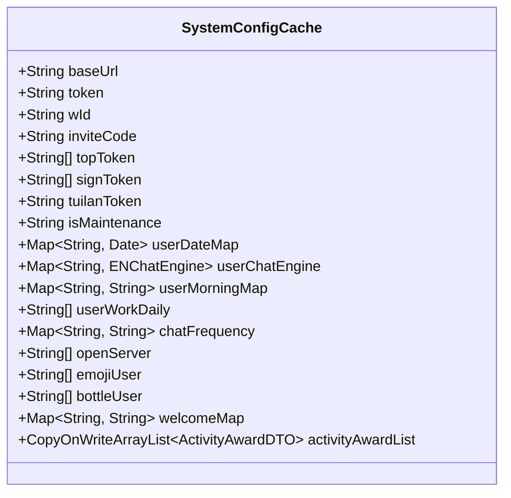
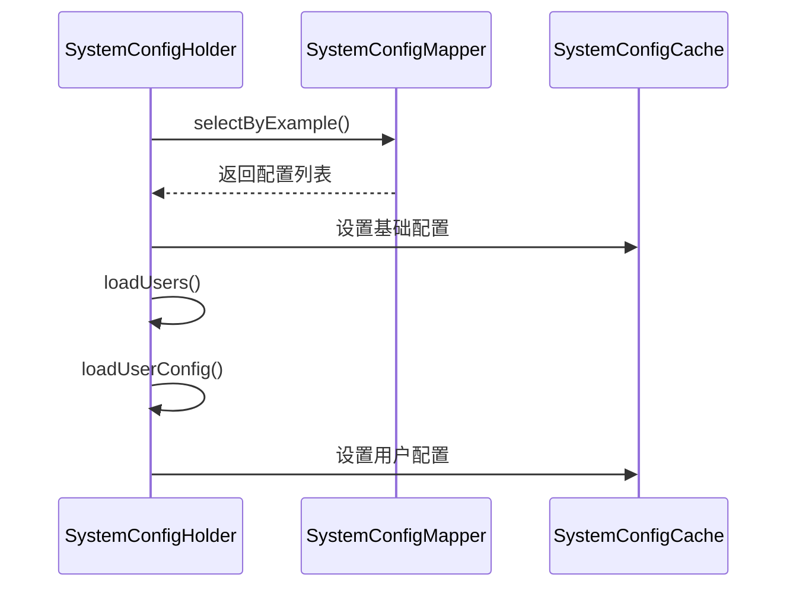
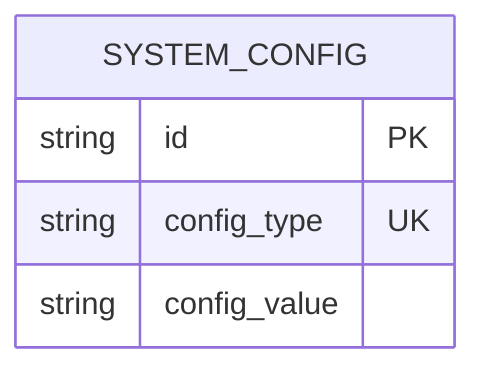
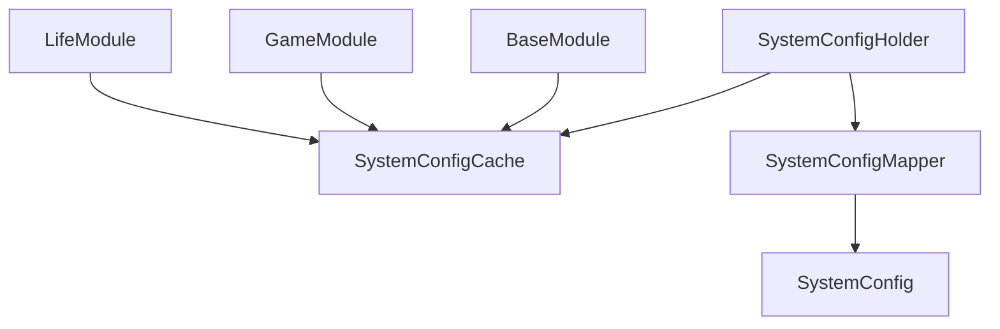

# 配置管理API

<cite>
**本文档引用的文件**
- [SystemConfigCache.java](file://Common/src/main/java/com/bot/common/config/SystemConfigCache.java)
- [SystemConfigHolder.java](file://Game/src/main/java/com/bot/game/service/SystemConfigHolder.java)
- [SystemConfig.java](file://Game/src/main/java/com/bot/game/dao/entity/SystemConfig.java)
- [SystemConfigMapper.java](file://Game/src/main/java/com/bot/game/dao/mapper/SystemConfigMapper.java)
- [ENSystemConfig.java](file://Common/src/main/java/com/bot/common/enums/ENSystemConfig.java)
- [SystemManager.java](file://Base/src/main/java/com/bot/base/service/SystemManager.java)
- [application.properties](file://Boot/src/main/resources/application.properties)
- [application-dev.properties](file://Boot/src/main/resources/application-dev.properties)
</cite>

## 目录
1. [简介](#简介)
2. [项目结构](#项目结构)
3. [核心组件](#核心组件)
4. [架构概述](#架构概述)
5. [详细组件分析](#详细组件分析)
6. [依赖分析](#依赖分析)
7. [性能考虑](#性能考虑)
8. [故障排除指南](#故障排除指南)
9. [结论](#结论)

## 简介
本配置管理API文档全面记录了系统配置的动态更新、参数管理和配置项持久化的实现机制。文档重点描述了SystemConfigCache中的配置加载、缓存管理和热更新功能，以及LifeHandlerImpl中的配置使用场景。通过详细的API接口文档，说明了配置查询、更新和验证等操作的实现方式，包括配置项命名规范、数据类型约束和版本管理策略。同时，文档还涵盖了配置变更的审计日志、回滚机制和多环境配置管理方案。

## 项目结构
本项目采用模块化设计，主要分为Base、Boot、Common、Game和Life五个核心模块。每个模块都有明确的职责划分，其中Common模块负责提供通用的配置管理功能，Game模块负责游戏相关的业务逻辑，Life模块负责生命游戏系统的实现。

**图表来源**
- [SystemConfigCache.java](file://Common/src/main/java/com/bot/common/config/SystemConfigCache.java)
- [SystemConfigHolder.java](file://Game/src/main/java/com/bot/game/service/SystemConfigHolder.java)

**章节来源**
- [SystemConfigCache.java](file://Common/src/main/java/com/bot/common/config/SystemConfigCache.java)
- [SystemConfigHolder.java](file://Game/src/main/java/com/bot/game/service/SystemConfigHolder.java)

## 核心组件
配置管理系统的核心组件包括SystemConfigCache、SystemConfigHolder和SystemConfig实体类。SystemConfigCache作为配置的内存缓存，存储了所有运行时配置项；SystemConfigHolder负责配置的加载和初始化；SystemConfig实体类则对应数据库中的配置表结构。

**章节来源**
- [SystemConfigCache.java](file://Common/src/main/java/com/bot/common/config/SystemConfigCache.java)
- [SystemConfigHolder.java](file://Game/src/main/java/com/bot/game/service/SystemConfigHolder.java)
- [SystemConfig.java](file://Game/src/main/java/com/bot/game/dao/entity/SystemConfig.java)

## 架构概述
配置管理系统的架构采用分层设计，包括持久层、服务层和缓存层。持久层通过MyBatis与数据库交互，存储配置数据；服务层负责配置的业务逻辑处理；缓存层则提供高性能的配置访问。

**图表来源**
- [SystemConfig.java](file://Game/src/main/java/com/bot/game/dao/entity/SystemConfig.java)
- [SystemConfigMapper.java](file://Game/src/main/java/com/bot/game/dao/mapper/SystemConfigMapper.java)
- [SystemConfigHolder.java](file://Game/src/main/java/com/bot/game/service/SystemConfigHolder.java)
- [SystemConfigCache.java](file://Common/src/main/java/com/bot/common/config/SystemConfigCache.java)

## 详细组件分析
### SystemConfigCache分析
SystemConfigCache是配置管理的核心缓存类，采用静态字段的方式存储各种配置项。它不仅存储了基础的URL、token等系统配置，还维护了用户相关的配置状态，如用户到期时间、聊天引擎选择、日报订阅情况等。

#### 配置缓存类图

**图表来源**
- [SystemConfigCache.java](file://Common/src/main/java/com/bot/common/config/SystemConfigCache.java)

### SystemConfigHolder分析
SystemConfigHolder是配置加载的控制器类，负责从数据库加载配置并初始化SystemConfigCache。它通过@PostConstruct注解在Spring容器初始化完成后自动执行配置加载。

#### 配置加载序列图

**图表来源**
- [SystemConfigHolder.java](file://Game/src/main/java/com/bot/game/service/SystemConfigHolder.java)
- [SystemConfigMapper.java](file://Game/src/main/java/com/bot/game/dao/mapper/SystemConfigMapper.java)
- [SystemConfigCache.java](file://Common/src/main/java/com/bot/common/config/SystemConfigCache.java)

### 配置项持久化分析
配置项持久化通过MyBatis实现，SystemConfig实体类对应数据库中的bot_system_config表，包含id、config_type和config_value三个字段。

#### 数据模型图

**图表来源**
- [SystemConfig.java](file://Game/src/main/java/com/bot/game/dao/entity/SystemConfig.java)

**章节来源**
- [SystemConfig.java](file://Game/src/main/java/com/bot/game/dao/entity/SystemConfig.java)
- [SystemConfigMapper.java](file://Game/src/main/java/com/bot/game/dao/mapper/SystemConfigMapper.java)

## 依赖分析
配置管理系统与其他组件存在紧密的依赖关系。SystemConfigHolder被多个业务组件引用，用于获取当前的配置状态。同时，SystemConfigCache被广泛用于各种业务逻辑中，作为配置信息的快速访问通道。

**图表来源**
- [SystemConfigHolder.java](file://Game/src/main/java/com/bot/game/service/SystemConfigHolder.java)
- [SystemConfigCache.java](file://Common/src/main/java/com/bot/common/config/SystemConfigCache.java)

**章节来源**
- [SystemConfigHolder.java](file://Game/src/main/java/com/bot/game/service/SystemConfigHolder.java)
- [SystemConfigCache.java](file://Common/src/main/java/com/bot/common/config/SystemConfigCache.java)

## 性能考虑
配置管理系统在设计时充分考虑了性能因素。通过将配置数据缓存在内存中，避免了频繁的数据库访问。同时，使用ConcurrentHashMap等线程安全的数据结构，确保在高并发场景下的性能和稳定性。

## 故障排除指南
当配置管理出现问题时，可以按照以下步骤进行排查：
1. 检查SystemConfigHolder的init方法是否正常执行
2. 验证数据库中的配置数据是否正确
3. 确认SystemConfigCache中的缓存数据是否与数据库一致
4. 检查相关业务组件是否正确引用了配置项

**章节来源**
- [SystemConfigHolder.java](file://Game/src/main/java/com/bot/game/service/SystemConfigHolder.java)
- [SystemConfigCache.java](file://Common/src/main/java/com/bot/common/config/SystemConfigCache.java)

## 结论
本配置管理API提供了一套完整的配置管理解决方案，通过内存缓存和数据库持久化的结合，实现了高性能的配置访问和可靠的配置持久化。系统支持热更新和多环境配置管理，能够满足复杂应用场景的需求。