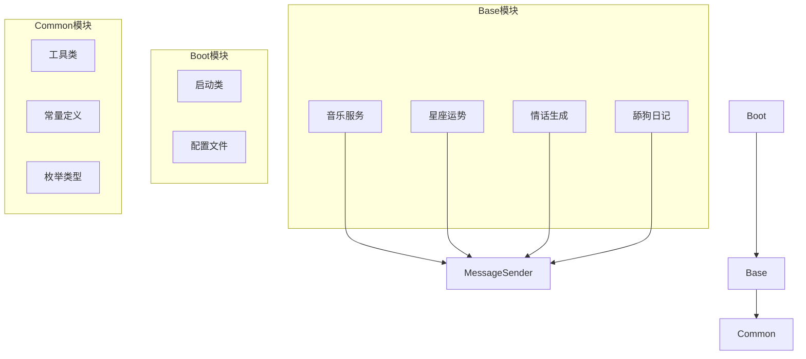
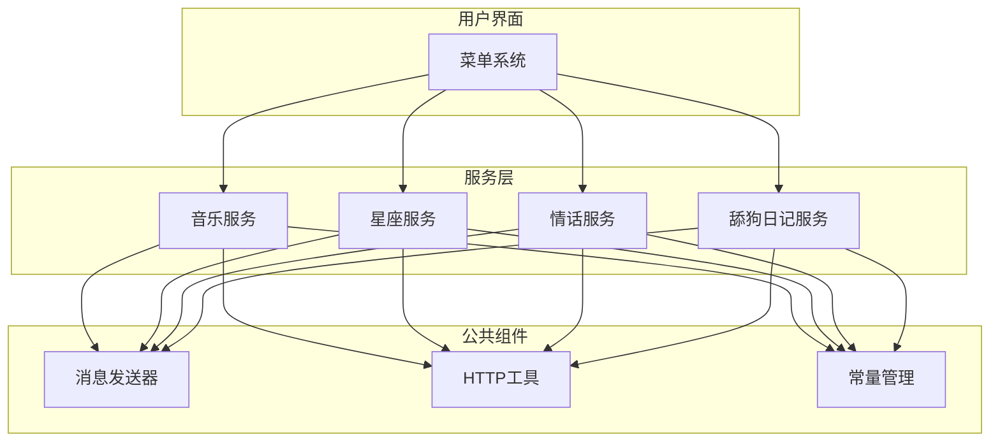
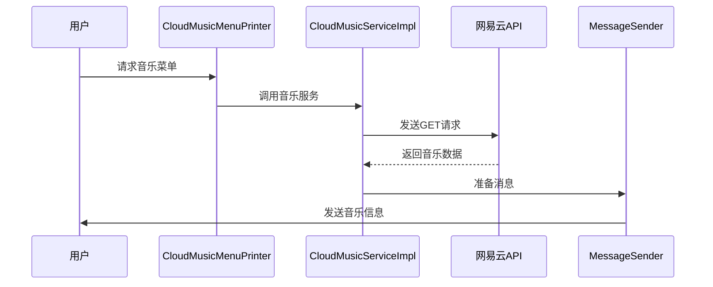
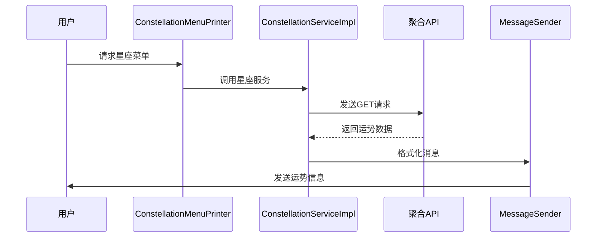
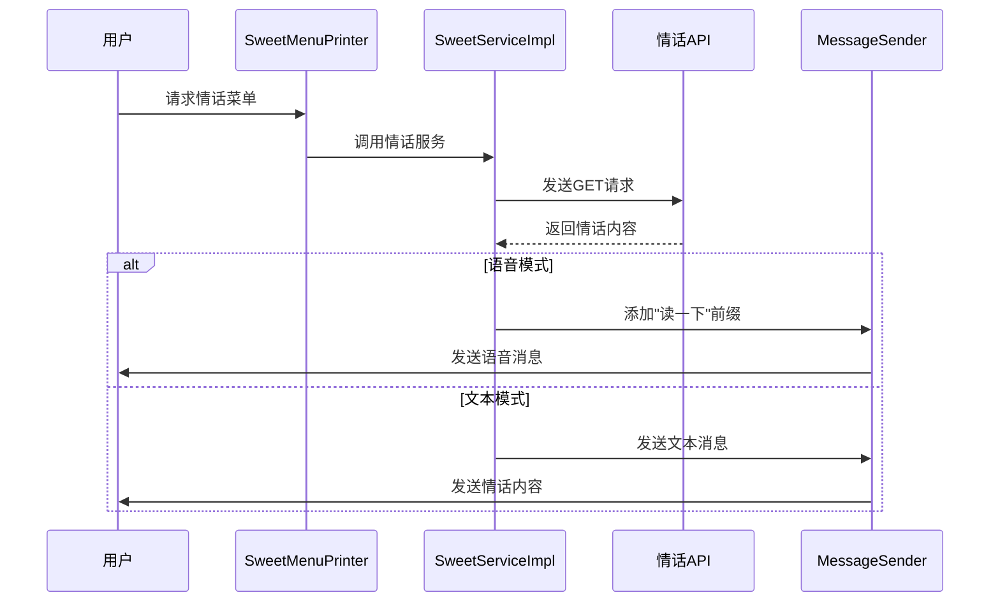
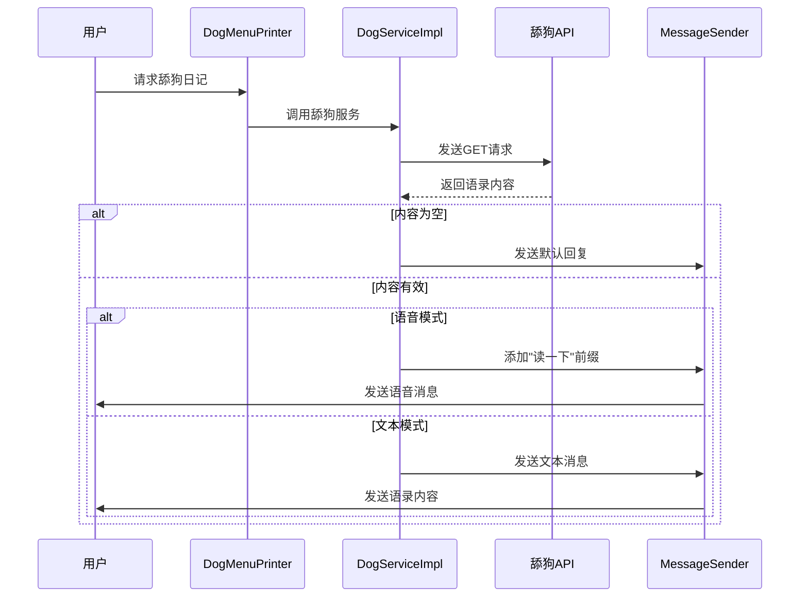
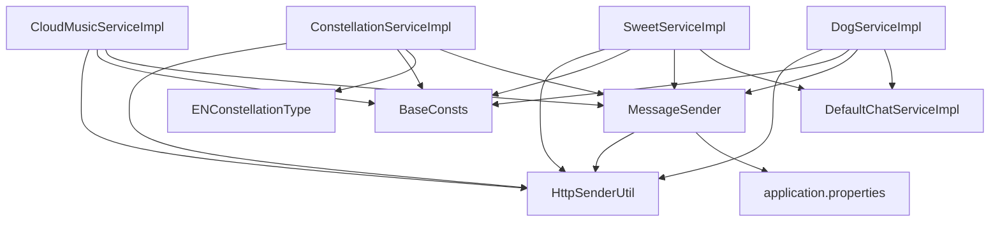

# 互动功能

<cite>
**本文档引用的文件**   
- [CloudMusicServiceImpl.java](file://Base/src/main/java/com/bot/base/service/impl/CloudMusicServiceImpl.java)
- [ConstellationServiceImpl.java](file://Base/src/main/java/com/bot/base/service/impl/ConstellationServiceImpl.java)
- [SweetServiceImpl.java](file://Base/src/main/java/com/bot/base/service/impl/SweetServiceImpl.java)
- [DogServiceImpl.java](file://Base/src/main/java/com/bot/base/service/impl/DogServiceImpl.java)
- [CloudMusicMenuPrinter.java](file://Base/src/main/java/com/bot/base/chain/menu/CloudMusicMenuPrinter.java)
- [ConstellationMenuPrinter.java](file://Base/src/main/java/com/bot/base/chain/menu/ConstellationMenuPrinter.java)
- [SweetMenuPrinter.java](file://Base/src/main/java/com/bot/base/chain/menu/SweetMenuPrinter.java)
- [MessageSender.java](file://Base/src/main/java/com/bot/base/commom/MessageSender.java)
- [CommonResp.java](file://Base/src/main/java/com/bot/base/dto/CommonResp.java)
- [BaseService.java](file://Base/src/main/java/com/bot/base/service/BaseService.java)
- [Menu.java](file://Base/src/main/java/com/bot/base/chain/Menu.java)
- [HttpSenderUtil.java](file://Common/src/main/java/com/bot/common/util/HttpSenderUtil.java)
- [BaseConsts.java](file://Common/src/main/java/com/bot/common/constant/BaseConsts.java)
- [ENConstellationType.java](file://Common/src/main/java/com/bot/common/enums/ENConstellationType.java)
- [application.properties](file://Boot/src/main/resources/application.properties)
</cite>

## 目录
1. [简介](#简介)
2. [项目结构](#项目结构)
3. [核心组件](#核心组件)
4. [架构概述](#架构概述)
5. [详细组件分析](#详细组件分析)
6. [依赖分析](#依赖分析)
7. [性能考虑](#性能考虑)
8. [故障排除指南](#故障排除指南)
9. [结论](#结论)

## 简介
本项目是一个多功能机器人系统，提供音乐播放、星座运势、情话生成和"舔狗日记"等趣味互动功能。系统通过统一的菜单系统和消息响应机制，为用户提供丰富的交互体验。本文档将详细分析这些功能的实现机制和最佳实践。

## 项目结构
项目采用模块化设计，主要分为Base、Boot、Common和Game等模块。Base模块包含核心互动功能的实现，Boot模块负责系统启动和配置，Common模块提供通用工具和常量，Game模块则专注于游戏相关功能。

**图表来源**
- [CloudMusicServiceImpl.java](file://Base/src/main/java/com/bot/base/service/impl/CloudMusicServiceImpl.java)
- [ConstellationServiceImpl.java](file://Base/src/main/java/com/bot/base/service/impl/ConstellationServiceImpl.java)
- [SweetServiceImpl.java](file://Base/src/main/java/com/bot/base/service/impl/SweetServiceImpl.java)
- [DogServiceImpl.java](file://Base/src/main/java/com/bot/base/service/impl/DogServiceImpl.java)

**章节来源**
- [CloudMusicServiceImpl.java](file://Base/src/main/java/com/bot/base/service/impl/CloudMusicServiceImpl.java)
- [ConstellationServiceImpl.java](file://Base/src/main/java/com/bot/base/service/impl/ConstellationServiceImpl.java)
- [SweetServiceImpl.java](file://Base/src/main/java/com/bot/base/service/impl/SweetServiceImpl.java)
- [DogServiceImpl.java](file://Base/src/main/java/com/bot/base/service/impl/DogServiceImpl.java)

## 核心组件
系统的核心组件包括音乐播放、星座运势、情话生成和"舔狗日记"等功能。这些组件通过统一的接口和消息机制进行交互，确保系统的可扩展性和维护性。

**章节来源**
- [CloudMusicServiceImpl.java](file://Base/src/main/java/com/bot/base/service/impl/CloudMusicServiceImpl.java#L1-L48)
- [ConstellationServiceImpl.java](file://Base/src/main/java/com/bot/base/service/impl/ConstellationServiceImpl.java#L1-L63)
- [SweetServiceImpl.java](file://Base/src/main/java/com/bot/base/service/impl/SweetServiceImpl.java#L1-L42)
- [DogServiceImpl.java](file://Base/src/main/java/com/bot/base/service/impl/DogServiceImpl.java#L1-L47)

## 架构概述
系统采用分层架构设计，包括服务层、业务逻辑层和数据访问层。各功能模块通过统一的接口与消息系统进行通信，确保系统的灵活性和可扩展性。

**图表来源**
- [CloudMusicServiceImpl.java](file://Base/src/main/java/com/bot/base/service/impl/CloudMusicServiceImpl.java)
- [ConstellationServiceImpl.java](file://Base/src/main/java/com/bot/base/service/impl/ConstellationServiceImpl.java)
- [SweetServiceImpl.java](file://Base/src/main/java/com/bot/base/service/impl/SweetServiceImpl.java)
- [DogServiceImpl.java](file://Base/src/main/java/com/bot/base/service/impl/DogServiceImpl.java)
- [MessageSender.java](file://Base/src/main/java/com/bot/base/commom/MessageSender.java)
- [HttpSenderUtil.java](file://Common/src/main/java/com/bot/common/util/HttpSenderUtil.java)

## 详细组件分析

### 音乐播放功能分析
音乐播放功能通过CloudMusicServiceImpl集成网易云音乐API，实现随机音乐推荐。系统从配置文件中读取API地址，随机选择音乐榜单，向外部API发起请求并解析返回结果。

**图表来源**
- [CloudMusicServiceImpl.java](file://Base/src/main/java/com/bot/base/service/impl/CloudMusicServiceImpl.java#L1-L48)
- [CloudMusicMenuPrinter.java](file://Base/src/main/java/com/bot/base/chain/menu/CloudMusicMenuPrinter.java#L1-L26)
- [MessageSender.java](file://Base/src/main/java/com/bot/base/commom/MessageSender.java#L1-L47)

**章节来源**
- [CloudMusicServiceImpl.java](file://Base/src/main/java/com/bot/base/service/impl/CloudMusicServiceImpl.java#L1-L48)
- [CloudMusicMenuPrinter.java](file://Base/src/main/java/com/bot/base/chain/menu/CloudMusicMenuPrinter.java#L1-L26)

### 星座运势功能分析
星座运势功能基于ConstellationServiceImpl实现，通过调用第三方API获取星座运势数据。系统支持多种查询类型，但目前主要实现日运势查询功能。

**图表来源**
- [ConstellationServiceImpl.java](file://Base/src/main/java/com/bot/base/service/impl/ConstellationServiceImpl.java#L1-L63)
- [ConstellationMenuPrinter.java](file://Base/src/main/java/com/bot/base/chain/menu/ConstellationMenuPrinter.java#L1-L20)
- [MessageSender.java](file://Base/src/main/java/com/bot/base/commom/MessageSender.java#L1-L47)

**章节来源**
- [ConstellationServiceImpl.java](file://Base/src/main/java/com/bot/base/service/impl/ConstellationServiceImpl.java#L1-L63)
- [ConstellationMenuPrinter.java](file://Base/src/main/java/com/bot/base/chain/menu/ConstellationMenuPrinter.java#L1-L20)

### 情话生成功能分析
情话生成功能通过SweetServiceImpl实现，调用外部API获取土味情话内容。系统还支持语音模式，可以将文本内容转换为语音消息。

**图表来源**
- [SweetServiceImpl.java](file://Base/src/main/java/com/bot/base/service/impl/SweetServiceImpl.java#L1-L42)
- [SweetMenuPrinter.java](file://Base/src/main/java/com/bot/base/chain/menu/SweetMenuPrinter.java#L1-L25)
- [MessageSender.java](file://Base/src/main/java/com/bot/base/commom/MessageSender.java#L1-L47)

**章节来源**
- [SweetServiceImpl.java](file://Base/src/main/java/com/bot/base/service/impl/SweetServiceImpl.java#L1-L42)
- [SweetMenuPrinter.java](file://Base/src/main/java/com/bot/base/chain/menu/SweetMenuPrinter.java#L1-L25)

### "舔狗日记"功能分析
"舔狗日记"功能通过DogServiceImpl实现，调用外部API获取情感语录内容。系统同样支持语音模式，可以根据用户设置发送语音或文本消息。

**图表来源**
- [DogServiceImpl.java](file://Base/src/main/java/com/bot/base/service/impl/DogServiceImpl.java#L1-L47)
- [MessageSender.java](file://Base/src/main/java/com/bot/base/commom/MessageSender.java#L1-L47)

**章节来源**
- [DogServiceImpl.java](file://Base/src/main/java/com/bot/base/service/impl/DogServiceImpl.java#L1-L47)

## 依赖分析
系统各组件之间的依赖关系清晰，通过Spring框架的依赖注入机制实现组件间的松耦合。核心依赖包括HTTP通信、消息发送和配置管理等。

**图表来源**
- [CloudMusicServiceImpl.java](file://Base/src/main/java/com/bot/base/service/impl/CloudMusicServiceImpl.java)
- [ConstellationServiceImpl.java](file://Base/src/main/java/com/bot/base/service/impl/ConstellationServiceImpl.java)
- [SweetServiceImpl.java](file://Base/src/main/java/com/bot/base/service/impl/SweetServiceImpl.java)
- [DogServiceImpl.java](file://Base/src/main/java/com/bot/base/service/impl/DogServiceImpl.java)
- [MessageSender.java](file://Base/src/main/java/com/bot/base/commom/MessageSender.java)
- [application.properties](file://Boot/src/main/resources/application.properties)

**章节来源**
- [CloudMusicServiceImpl.java](file://Base/src/main/java/com/bot/base/service/impl/CloudMusicServiceImpl.java)
- [ConstellationServiceImpl.java](file://Base/src/main/java/com/bot/base/service/impl/ConstellationServiceImpl.java)
- [SweetServiceImpl.java](file://Base/src/main/java/com/bot/base/service/impl/SweetServiceImpl.java)
- [DogServiceImpl.java](file://Base/src/main/java/com/bot/base/service/impl/DogServiceImpl.java)
- [MessageSender.java](file://Base/src/main/java/com/bot/base/commom/MessageSender.java)

## 性能考虑
系统在性能方面采用了多种优化策略，包括连接池管理、超时设置和缓存机制。HTTP连接设置了180秒的连接和读取超时，避免长时间等待。星座运势和音乐播放等功能通过外部API实现，减少了本地计算负担。

**章节来源**
- [HttpSenderUtil.java](file://Common/src/main/java/com/bot/common/util/HttpSenderUtil.java#L57-L62)
- [application.properties](file://Boot/src/main/resources/application.properties#L57-L62)

## 故障排除指南
当系统出现异常时，可以按照以下步骤进行排查：
1. 检查网络连接是否正常
2. 验证外部API服务是否可用
3. 查看日志文件中的错误信息
4. 确认配置文件中的参数是否正确
5. 检查依赖服务是否正常运行

**章节来源**
- [CloudMusicServiceImpl.java](file://Base/src/main/java/com/bot/base/service/impl/CloudMusicServiceImpl.java#L34-L44)
- [ConstellationServiceImpl.java](file://Base/src/main/java/com/bot/base/service/impl/ConstellationServiceImpl.java#L34-L36)
- [HttpSenderUtil.java](file://Common/src/main/java/com/bot/common/util/HttpSenderUtil.java#L37-L42)

## 结论
本系统通过模块化设计和清晰的架构，实现了多种趣味互动功能。各功能组件通过统一的接口和消息机制进行通信，确保了系统的可扩展性和维护性。外部API集成采用了标准的HTTP通信方式，配合错误处理和缓存策略，提供了稳定可靠的服务。未来可以进一步优化用户体验，增加更多互动功能。