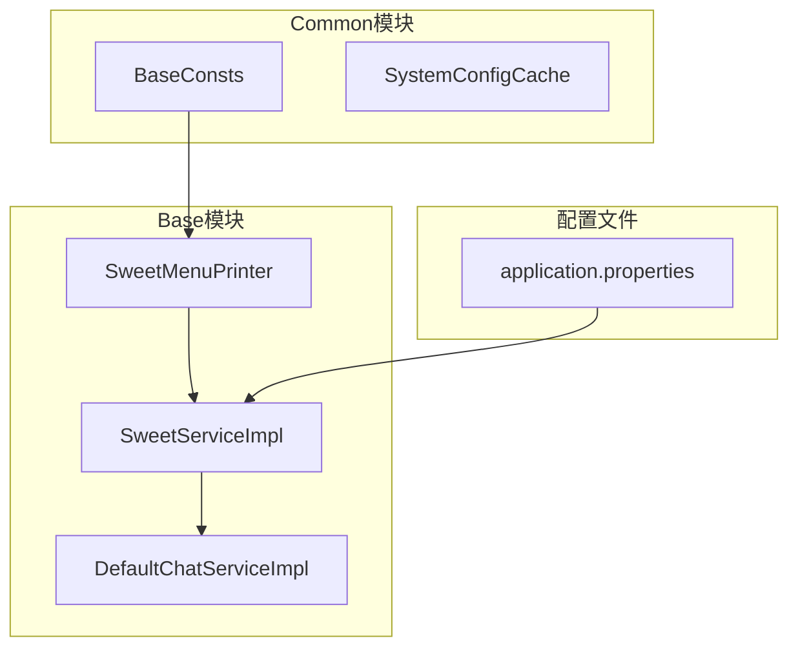
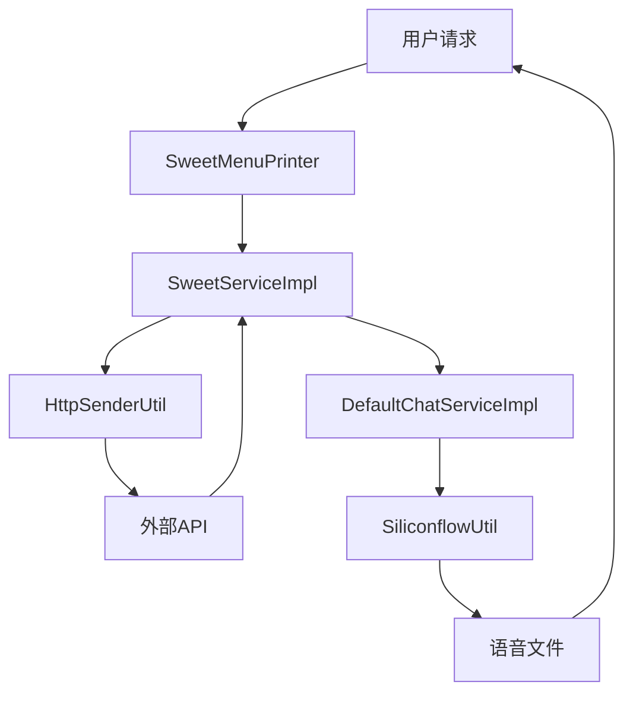
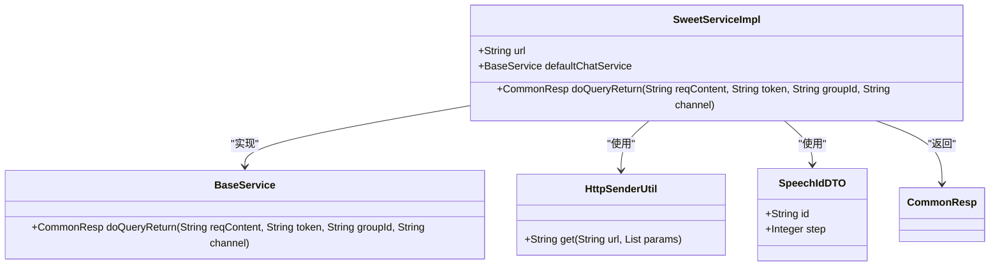
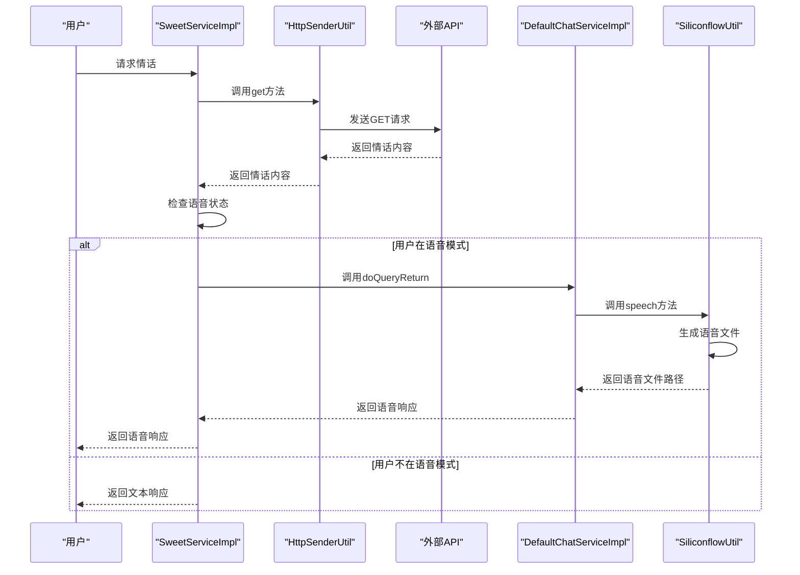
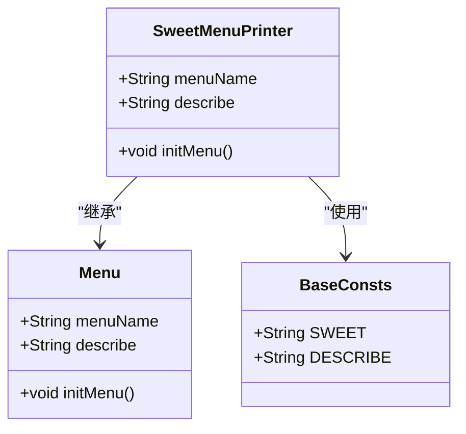
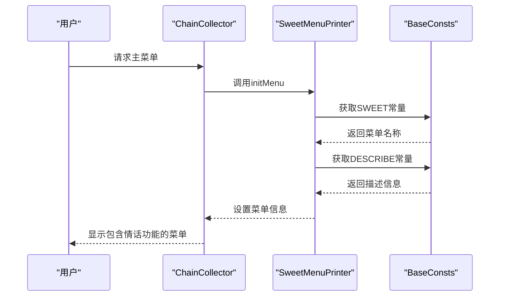
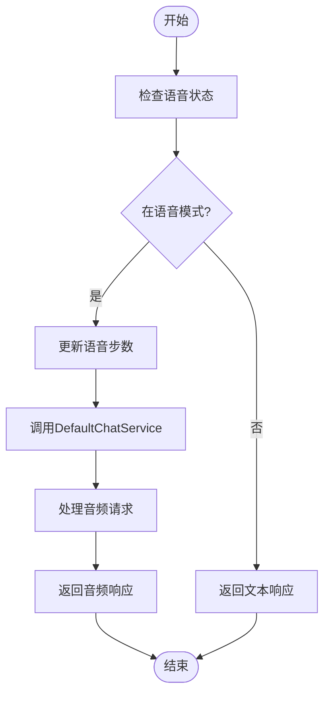
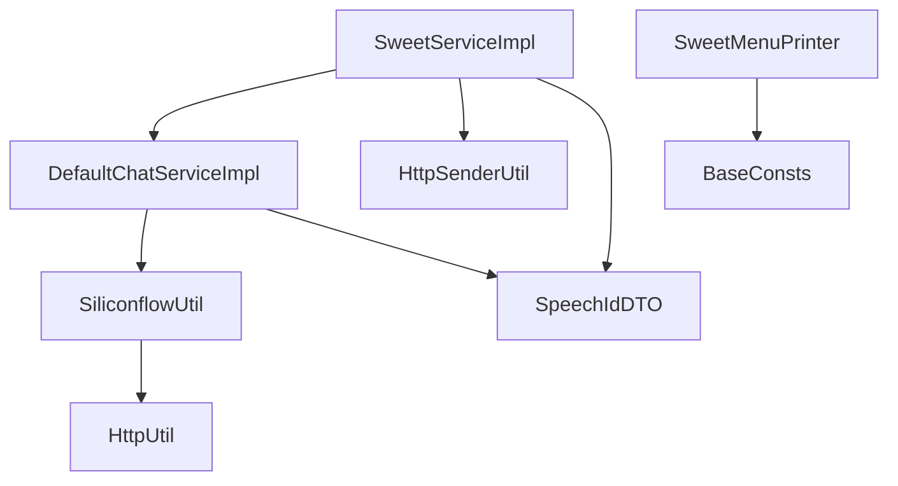

# 情话生成功能

<cite>
**本文档引用文件**   
- [SweetServiceImpl.java](file://Base/src/main/java/com/bot/base/service/impl/SweetServiceImpl.java)
- [SweetMenuPrinter.java](file://Base/src/main/java/com/bot/base/chain/menu/SweetMenuPrinter.java)
- [DefaultChatServiceImpl.java](file://Base/src/main/java/com/bot/base/service/impl/DefaultChatServiceImpl.java)
- [SpeechIdDTO.java](file://Base/src/main/java/com/bot/base/dto/SpeechIdDTO.java)
- [SiliconflowUtil.java](file://Base/src/main/java/com/bot/base/util/SiliconflowUtil.java)
- [application.properties](file://Boot/src/main/resources/application.properties)
- [BaseConsts.java](file://Common/src/main/java/com/bot/common/constant/BaseConsts.java)
</cite>

## 目录
1. [简介](#简介)
2. [项目结构](#项目结构)
3. [核心组件](#核心组件)
4. [架构概述](#架构概述)
5. [详细组件分析](#详细组件分析)
6. [依赖分析](#依赖分析)
7. [性能考虑](#性能考虑)
8. [故障排除指南](#故障排除指南)
9. [结论](#结论)

## 简介
本文档全面介绍情话生成功能的实现机制，重点说明SweetServiceImpl如何从外部API获取情话内容并响应用户请求。文档详细解释了与语音模式的集成逻辑，包括当用户处于语音状态时如何通过TOKEN_2_SPEECH_ID_MAP记录语音步数，并委托DefaultChatServiceImpl处理"读一下"指令。同时，文档描述了sweet.url配置项的用途以及SweetMenuPrinter如何提供功能入口。最后，文档提供了高并发场景下的性能优化建议，包括情话内容缓存、API限流策略和响应延迟监控。

## 项目结构
情话生成功能主要分布在Base模块中，通过Spring框架的组件扫描和依赖注入机制实现功能集成。该功能由SweetServiceImpl提供核心服务，SweetMenuPrinter提供菜单入口，通过配置文件中的sweet.url指定外部API地址。

**图表来源**
- [SweetServiceImpl.java](file://Base/src/main/java/com/bot/base/service/impl/SweetServiceImpl.java#L1-L41)
- [SweetMenuPrinter.java](file://Base/src/main/java/com/bot/base/chain/menu/SweetMenuPrinter.java#L1-L24)
- [application.properties](file://Boot/src/main/resources/application.properties#L1-L70)

**章节来源**
- [SweetServiceImpl.java](file://Base/src/main/java/com/bot/base/service/impl/SweetServiceImpl.java#L1-L41)
- [SweetMenuPrinter.java](file://Base/src/main/java/com/bot/base/chain/menu/SweetMenuPrinter.java#L1-L24)
- [application.properties](file://Boot/src/main/resources/application.properties#L1-L70)

## 核心组件
情话生成功能的核心组件包括SweetServiceImpl、SweetMenuPrinter和DefaultChatServiceImpl。SweetServiceImpl负责从外部API获取情话内容，SweetMenuPrinter提供功能入口，DefaultChatServiceImpl处理语音模式的集成。这些组件通过Spring框架的依赖注入机制协同工作，实现了情话生成和语音播放的完整功能流程。

**章节来源**
- [SweetServiceImpl.java](file://Base/src/main/java/com/bot/base/service/impl/SweetServiceImpl.java#L1-L41)
- [SweetMenuPrinter.java](file://Base/src/main/java/com/bot/base/chain/menu/SweetMenuPrinter.java#L1-L24)
- [DefaultChatServiceImpl.java](file://Base/src/main/java/com/bot/base/service/impl/DefaultChatServiceImpl.java#L1-L128)

## 架构概述
情话生成功能采用分层架构设计，包括表现层、业务逻辑层和数据访问层。表现层由SweetMenuPrinter提供菜单入口，业务逻辑层由SweetServiceImpl实现核心功能，数据访问层通过HttpSenderUtil与外部API通信。整个架构通过Spring框架的依赖注入机制实现组件间的松耦合。

**图表来源**
- [SweetServiceImpl.java](file://Base/src/main/java/com/bot/base/service/impl/SweetServiceImpl.java#L1-L41)
- [SweetMenuPrinter.java](file://Base/src/main/java/com/bot/base/chain/menu/SweetMenuPrinter.java#L1-L24)
- [DefaultChatServiceImpl.java](file://Base/src/main/java/com/bot/base/service/impl/DefaultChatServiceImpl.java#L1-L128)
- [SiliconflowUtil.java](file://Base/src/main/java/com/bot/base/util/SiliconflowUtil.java#L1-L82)

## 详细组件分析
情话生成功能的详细组件分析包括SweetServiceImpl、SweetMenuPrinter和语音集成逻辑。每个组件都有明确的职责和实现方式，通过协同工作实现完整的功能流程。

### SweetServiceImpl分析
SweetServiceImpl是情话生成功能的核心服务类，负责从外部API获取情话内容并处理语音模式的集成。

#### 类图

**图表来源**
- [SweetServiceImpl.java](file://Base/src/main/java/com/bot/base/service/impl/SweetServiceImpl.java#L1-L41)
- [BaseService.java](file://Base/src/main/java/com/bot/base/service/BaseService.java#L1-L10)
- [HttpSenderUtil.java](file://Common/src/main/java/com/bot/common/util/HttpSenderUtil.java#L1-L200)
- [SpeechIdDTO.java](file://Base/src/main/java/com/bot/base/dto/SpeechIdDTO.java#L1-L16)

#### 序列图

**图表来源**
- [SweetServiceImpl.java](file://Base/src/main/java/com/bot/base/service/impl/SweetServiceImpl.java#L27-L38)
- [HttpSenderUtil.java](file://Common/src/main/java/com/bot/common/util/HttpSenderUtil.java#L1-L200)
- [DefaultChatServiceImpl.java](file://Base/src/main/java/com/bot/base/service/impl/DefaultChatServiceImpl.java#L76-L78)
- [SiliconflowUtil.java](file://Base/src/main/java/com/bot/base/util/SiliconflowUtil.java#L29-L81)

**章节来源**
- [SweetServiceImpl.java](file://Base/src/main/java/com/bot/base/service/impl/SweetServiceImpl.java#L1-L41)

### SweetMenuPrinter分析
SweetMenuPrinter是情话生成功能的菜单入口类，负责在主菜单中提供情话功能的访问入口。

#### 类图

**图表来源**
- [SweetMenuPrinter.java](file://Base/src/main/java/com/bot/base/chain/menu/SweetMenuPrinter.java#L1-L24)
- [Menu.java](file://Base/src/main/java/com/bot/base/chain/Menu.java#L1-L20)
- [BaseConsts.java](file://Common/src/main/java/com/bot/common/constant/BaseConsts.java#L1-L50)

#### 序列图

**图表来源**
- [SweetMenuPrinter.java](file://Base/src/main/java/com/bot/base/chain/menu/SweetMenuPrinter.java#L19-L23)
- [BaseConsts.java](file://Common/src/main/java/com/bot/common/constant/BaseConsts.java#L36-L38)

**章节来源**
- [SweetMenuPrinter.java](file://Base/src/main/java/com/bot/base/chain/menu/SweetMenuPrinter.java#L1-L24)

### 语音集成逻辑分析
语音集成逻辑是情话生成功能的重要组成部分，实现了文本到语音的转换功能。

#### 流程图

**图表来源**
- [SweetServiceImpl.java](file://Base/src/main/java/com/bot/base/service/impl/SweetServiceImpl.java#L31-L36)
- [DefaultChatServiceImpl.java](file://Base/src/main/java/com/bot/base/service/impl/DefaultChatServiceImpl.java#L76-L78)

**章节来源**
- [SweetServiceImpl.java](file://Base/src/main/java/com/bot/base/service/impl/SweetServiceImpl.java#L30-L37)
- [DefaultChatServiceImpl.java](file://Base/src/main/java/com/bot/base/service/impl/DefaultChatServiceImpl.java#L69-L78)

## 依赖分析
情话生成功能的依赖关系清晰明确，主要依赖于Base模块内部的组件和Common模块提供的工具类。通过Spring框架的依赖注入机制，实现了组件间的松耦合。

**图表来源**
- [SweetServiceImpl.java](file://Base/src/main/java/com/bot/base/service/impl/SweetServiceImpl.java#L24-L25)
- [DefaultChatServiceImpl.java](file://Base/src/main/java/com/bot/base/service/impl/DefaultChatServiceImpl.java#L56-L57)
- [SiliconflowUtil.java](file://Base/src/main/java/com/bot/base/util/SiliconflowUtil.java#L31-L37)

**章节来源**
- [SweetServiceImpl.java](file://Base/src/main/java/com/bot/base/service/impl/SweetServiceImpl.java#L1-L41)
- [DefaultChatServiceImpl.java](file://Base/src/main/java/com/bot/base/service/impl/DefaultChatServiceImpl.java#L1-L128)

## 性能考虑
在高并发场景下，情话生成功能可能面临性能挑战。为确保系统稳定性和响应速度，建议采取以下优化措施：

1. **情话内容缓存**：实现本地缓存机制，将频繁请求的情话内容存储在内存中，减少对外部API的调用次数。
2. **API限流策略**：对情话API的调用实施限流，防止因大量并发请求导致外部API服务不可用。
3. **响应延迟监控**：建立响应延迟监控系统，实时跟踪情话生成服务的响应时间，及时发现性能瓶颈。
4. **异步处理**：对于语音生成等耗时操作，采用异步处理机制，避免阻塞主线程。
5. **连接池优化**：优化HTTP连接池配置，提高网络请求的效率和稳定性。

**章节来源**
- [SweetServiceImpl.java](file://Base/src/main/java/com/bot/base/service/impl/SweetServiceImpl.java#L29-L38)
- [HttpSenderUtil.java](file://Common/src/main/java/com/bot/common/util/HttpSenderUtil.java#L57-L62)

## 故障排除指南
在使用情话生成功能时，可能会遇到以下常见问题及解决方案：

1. **情话内容获取失败**：检查sweet.url配置是否正确，确认外部API服务是否正常运行。
2. **语音功能无法使用**：确认SiliconflowUtil的API密钥是否有效，检查音频文件存储路径是否有写入权限。
3. **响应延迟过高**：检查网络连接状况，确认是否有大量并发请求导致系统负载过高。
4. **菜单入口不显示**：确认SweetMenuPrinter是否被正确扫描和注入，检查BaseConsts中的常量定义是否正确。

**章节来源**
- [SweetServiceImpl.java](file://Base/src/main/java/com/bot/base/service/impl/SweetServiceImpl.java#L29-L38)
- [SiliconflowUtil.java](file://Base/src/main/java/com/bot/base/util/SiliconflowUtil.java#L35-L36)
- [SweetMenuPrinter.java](file://Base/src/main/java/com/bot/base/chain/menu/SweetMenuPrinter.java#L21-L22)

## 结论
情话生成功能通过SweetServiceImpl、SweetMenuPrinter和DefaultChatServiceImpl等组件的协同工作，实现了从外部API获取情话内容并支持语音播放的完整功能。该功能设计合理，代码结构清晰，通过Spring框架的依赖注入机制实现了组件间的松耦合。在高并发场景下，建议实施缓存、限流和监控等性能优化措施，以确保系统的稳定性和响应速度。