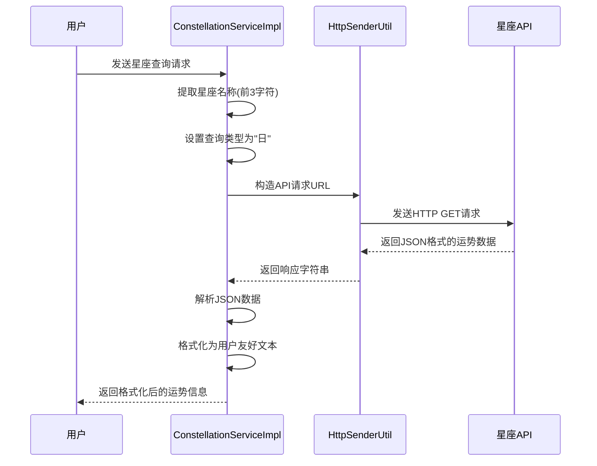
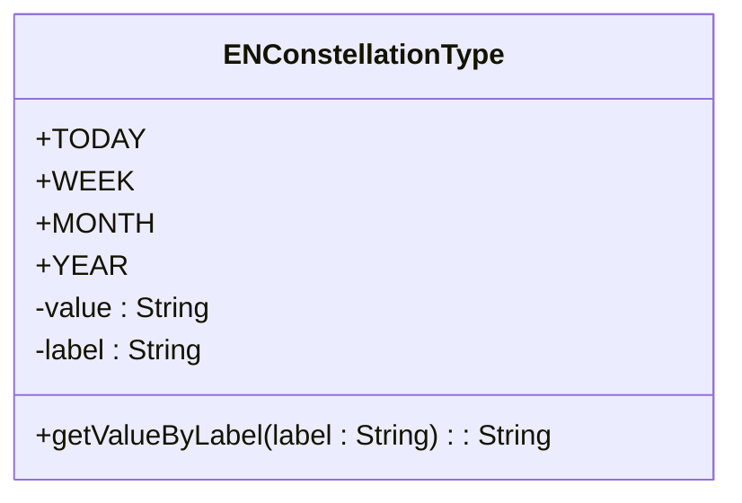
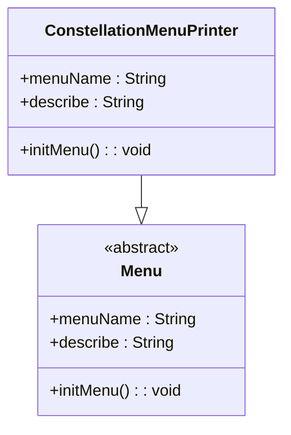

# 星座运势功能

<cite>
**本文档引用文件**   
- [ConstellationServiceImpl.java](file://Base/src/main/java/com/bot/base/service/impl/ConstellationServiceImpl.java)
- [ENConstellationType.java](file://Common/src/main/java/com/bot/common/enums/ENConstellationType.java)
- [BaseConsts.java](file://Common/src/main/java/com/bot/common/constant/BaseConsts.java)
- [ConstellationMenuPrinter.java](file://Base/src/main/java/com/bot/base/chain/menu/ConstellationMenuPrinter.java)
- [HttpSenderUtil.java](file://Common/src/main/java/com/bot/common/util/HttpSenderUtil.java)
- [LuckServiceImpl.java](file://Base/src/main/java/com/bot/base/service/impl/LuckServiceImpl.java)
</cite>

## 目录
1. [核心实现机制](#核心实现机制)
2. [API请求构造与数据处理](#api请求构造与数据处理)
3. [日运势支持现状与扩展潜力](#日运势支持现状与扩展潜力)
4. [ENConstellationType枚举分析](#enconstellationtype枚举分析)
5. [菜单系统集成](#菜单系统集成)
6. [异常处理机制](#异常处理机制)
7. [接口稳定性优化建议](#接口稳定性优化建议)

## 核心实现机制

星座运势功能的核心实现位于`ConstellationServiceImpl`类中，该类实现了`BaseService`接口，通过`doQueryReturn`方法处理星座查询请求。服务通过Spring的`@Value`注解注入API路径和密钥配置，实现了与外部星座API的集成。

**Section sources**
- [ConstellationServiceImpl.java](file://Base/src/main/java/com/bot/base/service/impl/ConstellationServiceImpl.java#L14-L37)

## API请求构造与数据处理

### 请求参数构造
星座查询服务通过`doQueryReturn`方法接收用户请求内容，从请求内容的前三个字符提取星座名称（`consName`）。目前系统固定将查询类型设置为"日"运势，通过`ENConstellationType.getValueByLabel("日")`获取对应的类型值"today"。

### JSON数据解析与格式化
在`sendQuery`方法中，系统使用`HttpSenderUtil.get`方法发送HTTP GET请求到配置的星座API地址。对于日运势查询，系统解析返回的JSON数据，提取以下关键字段：
- datetime: 日期时间
- QFriend: 亲近星座
- color: 幸运色
- health: 健康运势
- love: 爱情运势
- work: 工作运势
- money: 金钱运势
- all: 综合运势
- number: 幸运数字
- summary: 综述

解析后的数据通过`String.format`方法按照`BaseConsts.Constellation.TODAY_FORMAT`定义的格式模板进行格式化，生成用户友好的文本响应。

**Diagram sources**
- [ConstellationServiceImpl.java](file://Base/src/main/java/com/bot/base/service/impl/ConstellationServiceImpl.java#L24-L60)
- [HttpSenderUtil.java](file://Common/src/main/java/com/bot/common/util/HttpSenderUtil.java#L289-L325)

**Section sources**
- [ConstellationServiceImpl.java](file://Base/src/main/java/com/bot/base/service/impl/ConstellationServiceImpl.java#L24-L60)

## 日运势支持现状与扩展潜力

### 当前支持现状
根据代码注释"懒得接其他的了，只支持查询日运势，其他的有需要再说"，系统目前仅支持日运势查询。尽管`ENConstellationType`枚举定义了周、月、年运势类型，但`sendQuery`方法中仅处理了`TODAY`类型，其他类型直接返回错误信息。

### 扩展潜力
系统具备良好的扩展潜力，可以通过以下方式扩展功能：
1. **多时间维度支持**：修改`doQueryReturn`方法，根据用户请求中的关键词（如"周运势"、"月运势"）动态设置查询类型
2. **响应格式优化**：为不同时间维度的运势查询定义不同的格式化模板
3. **缓存机制**：引入缓存机制避免频繁调用外部API，特别是对于周、月、年等变化较慢的运势数据
4. **数据预处理**：对API返回的数据进行进一步处理，如运势等级分类（极好、较好、一般等）

**Section sources**
- [ConstellationServiceImpl.java](file://Base/src/main/java/com/bot/base/service/impl/ConstellationServiceImpl.java#L27-L28)
- [ENConstellationType.java](file://Common/src/main/java/com/bot/common/enums/ENConstellationType.java#L10-L13)

## ENConstellationType枚举分析

`ENConstellationType`枚举在星座类型映射中扮演关键角色，定义了星座查询的类型体系。该枚举包含四个成员：
- TODAY("today", "日"): 日运势，对应API参数值"today"
- WEEK("week", "周"): 周运势，对应API参数值"week"
- MONTH("month", "月"): 月运势，对应API参数值"month"
- YEAR("year", "年"): 年运势，对应API参数值"year"

枚举提供了`getValueByLabel`静态方法，实现了中文标签到英文参数值的转换。该方法遍历枚举值，当标签匹配时返回对应的value值，为系统提供了灵活的类型映射能力。

**Diagram sources**
- [ENConstellationType.java](file://Common/src/main/java/com/bot/common/enums/ENConstellationType.java#L8-L28)

**Section sources**
- [ENConstellationType.java](file://Common/src/main/java/com/bot/common/enums/ENConstellationType.java#L8-L28)

## 菜单系统集成

星座运势功能通过`ConstellationMenuPrinter`类与系统的菜单系统集成。该类继承自`Menu`基类，并使用`@Component`注解注册为Spring Bean。

菜单配置通过`initMenu`方法初始化，从`BaseConsts.Constellation`常量中获取菜单名称和描述信息：
- menuName: 设置为`BaseConsts.Constellation.CONSTELLATION`，即"星座"
- describe: 设置为`BaseConsts.Constellation.TIP`，即"小林可以帮你查询星座运势，快来询问试试吧。"

这种设计实现了配置与代码的分离，便于统一管理和修改菜单文本内容。

**Diagram sources**
- [ConstellationMenuPrinter.java](file://Base/src/main/java/com/bot/base/chain/menu/ConstellationMenuPrinter.java#L8-L19)
- [BaseConsts.java](file://Common/src/main/java/com/bot/common/constant/BaseConsts.java#L136-L150)

**Section sources**
- [ConstellationMenuPrinter.java](file://Base/src/main/java/com/bot/base/chain/menu/ConstellationMenuPrinter.java#L8-L19)

## 异常处理机制

系统实现了基本的异常处理机制，确保在出现错误时能够返回有意义的响应：

1. **try-catch包裹**：`doQueryReturn`方法使用try-catch语句包裹核心逻辑，捕获所有异常
2. **统一错误响应**：当发生异常时，返回`BaseConsts.Constellation.ERROR`定义的错误消息"你的问法有问题，换个方式问问吧~"
3. **类型安全处理**：在解析JSON数据时，直接进行类型转换，依赖外部API返回数据的正确性
4. **空值处理**：`getValueByLabel`方法在未找到匹配标签时返回null，调用方需要处理这种情况

异常处理机制较为基础，主要关注流程的完整性而非详细的错误分类和诊断信息。

**Section sources**
- [ConstellationServiceImpl.java](file://Base/src/main/java/com/bot/base/service/impl/ConstellationServiceImpl.java#L34-L36)
- [ENConstellationType.java](file://Common/src/main/java/com/bot/common/enums/ENConstellationType.java#L19-L26)

## 接口稳定性优化建议

### 重试机制
当前实现缺少重试机制，建议在`HttpSenderUtil.get`调用失败时实现指数退避重试策略：
- 初始重试延迟1秒，每次重试后加倍
- 最多重试3次
- 记录重试次数和最终结果用于监控

### 数据缓存
引入缓存机制可显著提升性能和稳定性：
- 使用`HashMap`或Redis缓存当日运势数据
- 设置合理的缓存过期时间（如1小时）
- 缓存键可设计为"星座名_类型_日期"格式
- 首次请求时调用API并缓存结果，后续请求直接从缓存读取

### 响应超时控制
虽然`HttpSenderUtil`已配置超时，但可进一步优化：
- 连接超时：30秒（当前180秒过长）
- 读取超时：30秒（当前180秒过长）
- 添加全局超时配置，便于统一管理

### 健康检查与降级
实现服务健康检查和降级机制：
- 定期检查星座API的可用性
- 当API连续失败达到阈值时，启用降级模式
- 降级模式可返回预设的模拟数据或缓存数据
- 提供API状态监控接口

### 错误分类与日志
改进异常处理和日志记录：
- 区分网络错误、解析错误、业务错误等不同类型
- 记录详细的错误日志，包括请求参数、响应状态码等
- 实现错误统计和告警机制

**Section sources**
- [HttpSenderUtil.java](file://Common/src/main/java/com/bot/common/util/HttpSenderUtil.java#L57-L62)
- [ConstellationServiceImpl.java](file://Base/src/main/java/com/bot/base/service/impl/ConstellationServiceImpl.java#L40-L41)