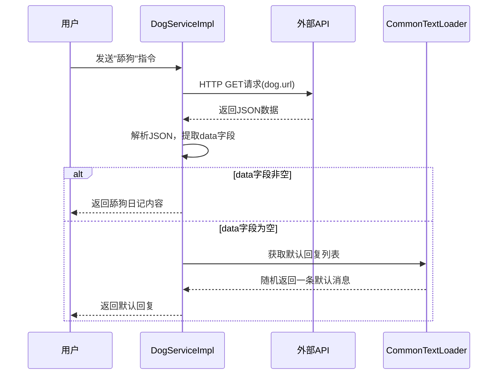
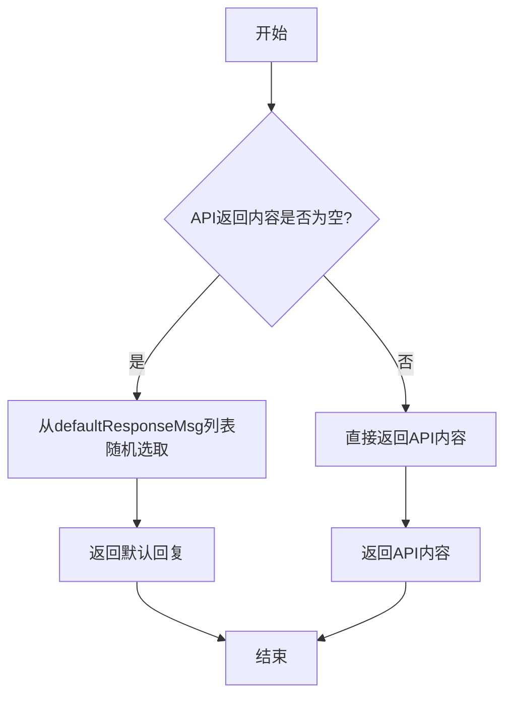
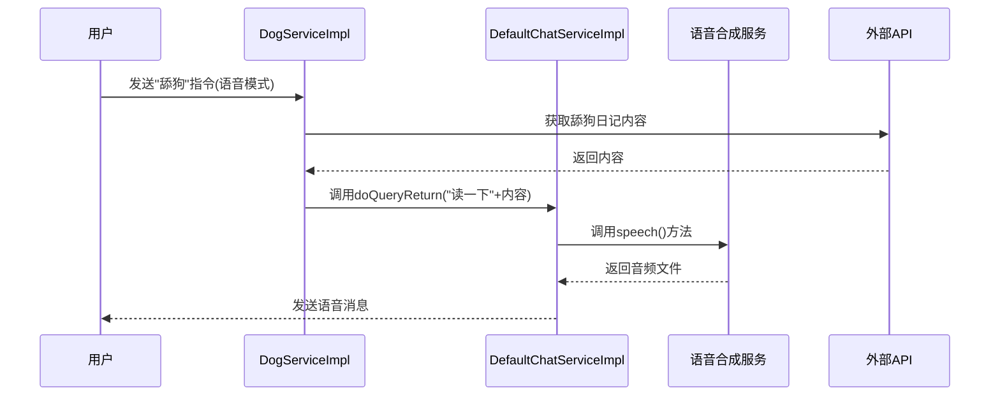

# 舔狗日记功能

<cite>
**本文档引用文件**  
- [DogServiceImpl.java](file://Base/src/main/java/com/bot/base/service/impl/DogServiceImpl.java)
- [CommonTextLoader.java](file://Common/src/main/java/com/bot/common/loader/CommonTextLoader.java)
- [DefaultChatServiceImpl.java](file://Base/src/main/java/com/bot/base/service/impl/DefaultChatServiceImpl.java)
- [LuckMenuPrinter.java](file://Base/src/main/java/com/bot/base/chain/menu/LuckMenuPrinter.java)
- [SweetMenuPrinter.java](file://Base/src/main/java/com/bot/base/chain/menu/SweetMenuPrinter.java)
- [application.properties](file://Boot/src/main/resources/application.properties)
- [serviceInstructCode.txt](file://Boot/src/main/resources/serviceInstructCode.txt)
- [BaseConsts.java](file://Common/src/main/java/com/bot/common/constant/BaseConsts.java)
</cite>

## 目录
1. [简介](#简介)
2. [核心实现机制](#核心实现机制)
3. [降级容错机制](#降级容错机制)
4. [语音模式兼容处理](#语音模式兼容处理)
5. [配置项说明](#配置项说明)
6. [功能入口分析](#功能入口分析)
7. [容错机制优化建议](#容错机制优化建议)
8. [总结](#总结)

## 简介
舔狗日记功能是机器人系统中的一个特色服务，通过调用外部API获取情感类内容，为用户提供趣味性互动体验。当用户发送包含"舔狗"关键词的指令时，系统会触发该功能，从预设的API地址获取"舔狗日记"内容并返回。本功能具备完善的容错机制，在外部API不可用时能够自动降级使用本地默认回复，并与系统的语音播报功能无缝集成。

**Section sources**
- [DogServiceImpl.java](file://Base/src/main/java/com/bot/base/service/impl/DogServiceImpl.java#L1-L47)
- [BaseConsts.java](file://Common/src/main/java/com/bot/common/constant/BaseConsts.java#L176-L178)

## 核心实现机制

舔狗日记功能的核心实现位于`DogServiceImpl`类中，该类实现了`BaseService`接口，通过`doQueryReturn`方法处理用户请求。系统首先通过HTTP GET请求调用外部API获取内容，API返回的数据经过JSON解析后提取"data"字段作为结果内容。



**Diagram sources**
- [DogServiceImpl.java](file://Base/src/main/java/com/bot/base/service/impl/DogServiceImpl.java#L28-L43)
- [CommonTextLoader.java](file://Common/src/main/java/com/bot/common/loader/CommonTextLoader.java#L45-L73)

**Section sources**
- [DogServiceImpl.java](file://Base/src/main/java/com/bot/base/service/impl/DogServiceImpl.java#L18-L47)

## 降级容错机制

当外部API返回空内容或调用失败时，系统会自动降级到使用`CommonTextLoader`中的默认回复消息。这一机制确保了服务的高可用性，避免因外部依赖问题导致功能完全失效。

`CommonTextLoader`类在应用启动时会从配置文件`defaultResponse.txt`中加载默认回复消息列表，存储在静态变量`defaultResponseMsg`中。当`DogServiceImpl`检测到API返回内容为空时，会从该列表中随机选择一条消息作为响应。



**Diagram sources**
- [DogServiceImpl.java](file://Base/src/main/java/com/bot/base/service/impl/DogServiceImpl.java#L31-L33)
- [CommonTextLoader.java](file://Common/src/main/java/com/bot/common/loader/CommonTextLoader.java#L72-L73)

**Section sources**
- [DogServiceImpl.java](file://Base/src/main/java/com/bot/base/service/impl/DogServiceImpl.java#L31-L33)
- [CommonTextLoader.java](file://Common/src/main/java/com/bot/common/loader/CommonTextLoader.java#L57-L73)

## 语音模式兼容处理

舔狗日记功能与系统的语音模式完全兼容，复用了`DefaultChatServiceImpl`的语音播报流程。当用户处于语音模式时，系统会自动将获取到的舔狗日记内容转换为语音消息。

具体实现机制如下：`DogServiceImpl`通过`@Resource`注解注入了`defaultChatService`实例，当检测到用户处于语音模式时（通过检查`TOKEN_2_SPEECH_ID_MAP`中是否存在对应的groupId或token），会将获取到的内容拼接"读一下"前缀，然后委托给`defaultChatService`处理。`defaultChatService`会识别"读一下"指令，调用语音合成服务生成音频文件并以语音消息形式返回。



**Diagram sources**
- [DogServiceImpl.java](file://Base/src/main/java/com/bot/base/service/impl/DogServiceImpl.java#L34-L40)
- [DefaultChatServiceImpl.java](file://Base/src/main/java/com/bot/base/service/impl/DefaultChatServiceImpl.java#L76-L78)

**Section sources**
- [DogServiceImpl.java](file://Base/src/main/java/com/bot/base/service/impl/DogServiceImpl.java#L24-L25)
- [DefaultChatServiceImpl.java](file://Base/src/main/java/com/bot/base/service/impl/DefaultChatServiceImpl.java#L76-L78)

## 配置项说明

舔狗日记功能的API地址通过`dog.url`配置项进行设置，该配置项位于`application.properties`文件中。系统使用Spring的`@Value`注解将配置值注入到`DogServiceImpl`的`dogUrl`字段中。

```properties
# application.properties
dog.url=https://api.example.com/dog-diary
```

在`DogServiceImpl`类中，通过以下代码实现配置注入：
```java
@Value("${dog.url}")
private String dogUrl;
```

建议的配置实践包括：
- 在`application-dev.properties`和`application-prod.properties`中分别设置开发环境和生产环境的不同API地址
- 使用稳定的第三方API服务或自建API服务确保高可用性
- 定期检查API服务状态，及时更新配置

**Section sources**
- [DogServiceImpl.java](file://Base/src/main/java/com/bot/base/service/impl/DogServiceImpl.java#L21-L22)
- [application.properties](file://Boot/src/main/resources/application.properties)

## 功能入口分析

舔狗日记功能的入口通过`serviceInstructCode.txt`配置文件进行定义，该文件位于`Boot/src/main/resources/`目录下。配置文件中的一行定义了"舔狗"关键词与`DogServiceImpl`服务的映射关系：

```
舔狗=dogServiceImpl
```

当用户发送包含"舔狗"关键词的消息时，系统会根据此配置找到对应的`dogServiceImpl` Bean并调用其`doQueryReturn`方法处理请求。这种基于配置的指令分发机制使得功能扩展非常灵活，只需在配置文件中添加新的映射关系即可实现新功能。

虽然`LuckMenuPrinter`类在项目结构中被提及，但经分析发现舔狗日记功能与运势占卜功能并无直接关联。舔狗日记功能有独立的指令映射，不通过`LuckMenuPrinter`类触发。

```mermaid
graph TD
A[用户输入] --> B{包含"舔狗"关键词?}
B --> |是| C[查找serviceInstructMap]
B --> |否| D[其他处理流程]
C --> E[找到dogServiceImpl]
E --> F[调用DogServiceImpl.doQueryReturn]
F --> G[返回舔狗日记内容]
```

**Diagram sources**
- [serviceInstructCode.txt](file://Boot/src/main/resources/serviceInstructCode.txt#L5)
- [DogServiceImpl.java](file://Base/src/main/java/com/bot/base/service/impl/DogServiceImpl.java#L18)

**Section sources**
- [serviceInstructCode.txt](file://Boot/src/main/resources/serviceInstructCode.txt#L5)
- [DogServiceImpl.java](file://Base/src/main/java/com/bot/base/service/impl/DogServiceImpl.java#L18-L19)

## 容错机制优化建议

基于当前实现，提出以下容错机制优化建议：

### 备用数据源配置
建议配置多个备用API数据源，当主API不可用时自动切换到备用源。可以在配置文件中定义多个URL：
```properties
dog.url.primary=https://api.primary.com/dog-diary
dog.url.backup1=https://api.backup1.com/dog-diary
dog.url.backup2=https://api.backup2.com/dog-diary
```

### 请求重试策略
实现智能重试机制，在首次请求失败后进行有限次数的重试：
- 设置最大重试次数（建议2-3次）
- 采用指数退避算法，避免短时间内频繁请求
- 记录重试次数，超过阈值后直接降级

### 内容过滤机制
对API返回的内容进行安全过滤：
- 过滤敏感词汇和不当内容
- 限制内容长度，避免过长消息
- 验证内容格式，确保为纯文本

### 缓存机制
引入本地缓存，减少对外部API的依赖：
- 缓存最近获取的内容，设置合理过期时间
- 当API不可用时返回缓存内容
- 实现缓存预热，在系统启动时加载常用内容

### 监控告警
建立完善的监控体系：
- 监控API调用成功率
- 记录调用延迟指标
- 设置异常告警，及时通知运维人员

**Section sources**
- [DogServiceImpl.java](file://Base/src/main/java/com/bot/base/service/impl/DogServiceImpl.java)
- [HttpSenderUtil.java](file://Common/src/main/java/com/bot/common/util/HttpSenderUtil.java#L289-L326)

## 总结
舔狗日记功能通过简洁而 robust 的设计实现了趣味性内容服务。系统通过外部API获取内容，具备完善的降级机制，在API不可用时能自动切换到本地默认回复。功能与语音模式无缝集成，复用现有语音播报流程，体现了良好的架构设计。通过配置文件定义功能入口，使得系统具有良好的可扩展性。建议进一步优化容错机制，增加备用数据源、重试策略和内容过滤，以提升服务的稳定性和安全性。