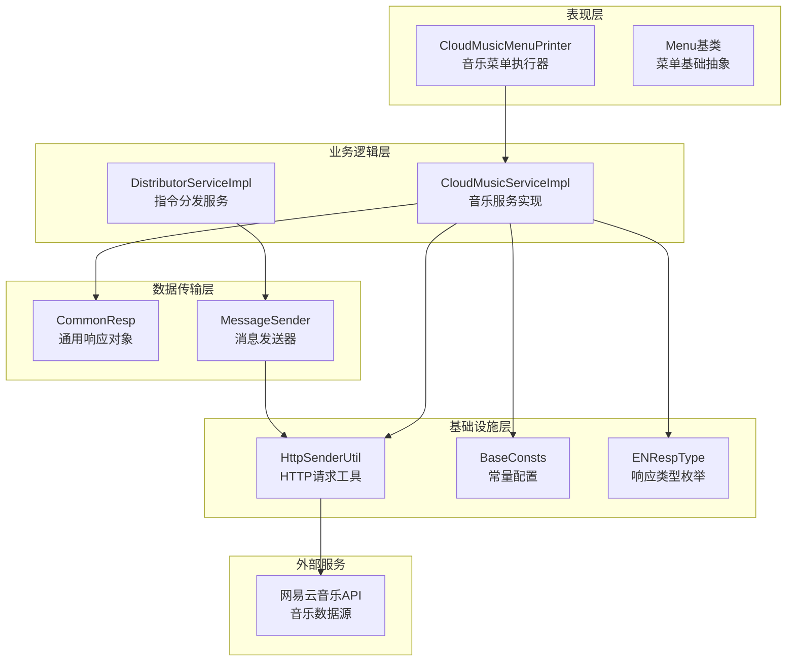
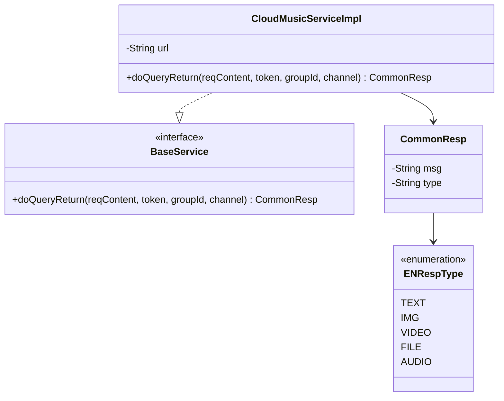
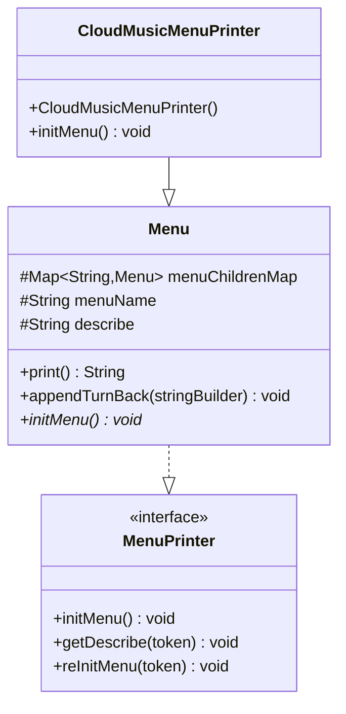
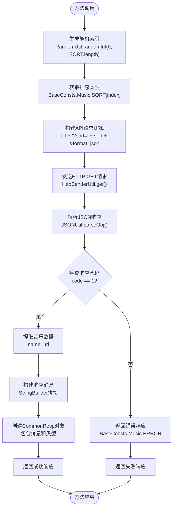
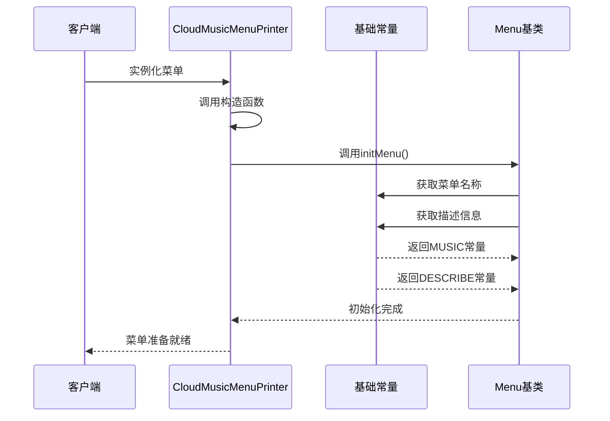
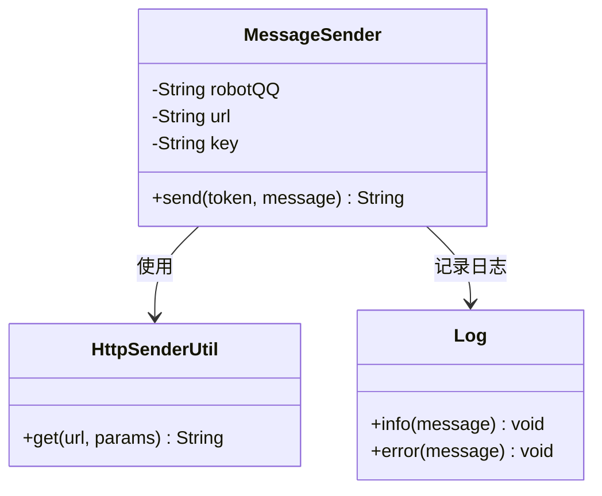
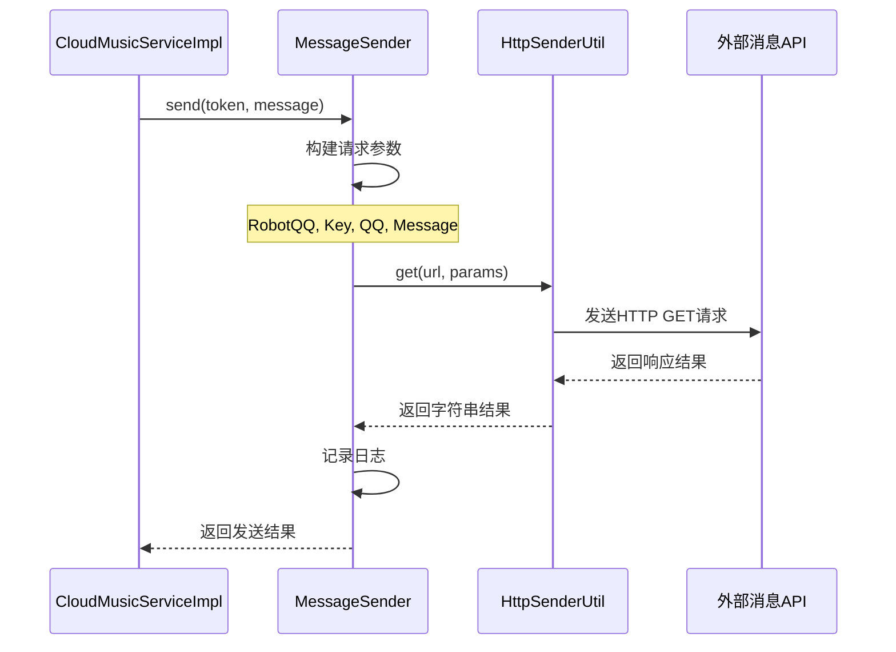

# 音乐互动功能

<cite>
**本文档引用的文件**
- [CloudMusicServiceImpl.java](file://Base/src/main/java/com/bot/base/service/impl/CloudMusicServiceImpl.java)
- [CloudMusicMenuPrinter.java](file://Base/src/main/java/com/bot/base/chain/menu/CloudMusicMenuPrinter.java)
- [MessageSender.java](file://Base/src/main/java/com/bot/base/commom/MessageSender.java)
- [HttpSenderUtil.java](file://Common/src/main/java/com/bot/common/util/HttpSenderUtil.java)
- [BaseConsts.java](file://Common/src/main/java/com/bot/common/constant/BaseConsts.java)
- [CommonResp.java](file://Base/src/main/java/com/bot/base/dto/CommonResp.java)
- [ENRespType.java](file://Common/src/main/java/com/bot/common/enums/ENRespType.java)
- [application.properties](file://Boot/src/main/resources/application.properties)
- [Menu.java](file://Base/src/main/java/com/bot/base/chain/Menu.java)
</cite>

## 目录
1. [简介](#简介)
2. [项目架构概览](#项目架构概览)
3. [核心组件分析](#核心组件分析)
4. [doQueryReturn方法实现详解](#doqueryreturn方法实现详解)
5. [配置项分析](#配置项分析)
6. [菜单系统交互](#菜单系统交互)
7. [消息发送机制](#消息发送机制)
8. [错误处理与网络配置](#错误处理与网络配置)
9. [最佳实践建议](#最佳实践建议)
10. [总结](#总结)

## 简介

音乐互动功能是基于网易云音乐API的音乐推荐服务，通过CloudMusicServiceImpl实现对外部音乐API的集成，为用户提供随机音乐推荐服务。该功能采用Spring框架构建，集成了菜单系统、消息发送和配置管理等模块，提供了完整的音乐互动体验。

## 项目架构概览

音乐互动功能采用分层架构设计，主要包含以下层次：



**图表来源**
- [CloudMusicServiceImpl.java](file://Base/src/main/java/com/bot/base/service/impl/CloudMusicServiceImpl.java#L20-L47)
- [CloudMusicMenuPrinter.java](file://Base/src/main/java/com/bot/base/chain/menu/CloudMusicMenuPrinter.java#L12-L25)
- [MessageSender.java](file://Base/src/main/java/com/bot/base/commom/MessageSender.java#L18-L46)

## 核心组件分析

### CloudMusicServiceImpl - 音乐服务实现

CloudMusicServiceImpl是音乐功能的核心服务类，实现了BaseService接口，负责与外部音乐API的交互。



**图表来源**
- [CloudMusicServiceImpl.java](file://Base/src/main/java/com/bot/base/service/impl/CloudMusicServiceImpl.java#L20-L47)
- [CommonResp.java](file://Base/src/main/java/com/bot/base/dto/CommonResp.java#L10-L19)
- [ENRespType.java](file://Common/src/main/java/com/bot/common/enums/ENRespType.java#L8-L14)

### CloudMusicMenuPrinter - 菜单系统

CloudMusicMenuPrinter继承自Menu基类，负责在菜单系统中注册音乐功能入口。



**图表来源**
- [CloudMusicMenuPrinter.java](file://Base/src/main/java/com/bot/base/chain/menu/CloudMusicMenuPrinter.java#L12-L25)
- [Menu.java](file://Base/src/main/java/com/bot/base/chain/Menu.java#L15-L55)

**章节来源**
- [CloudMusicServiceImpl.java](file://Base/src/main/java/com/bot/base/service/impl/CloudMusicServiceImpl.java#L1-L47)
- [CloudMusicMenuPrinter.java](file://Base/src/main/java/com/bot/base/chain/menu/CloudMusicMenuPrinter.java#L1-L25)
- [Menu.java](file://Base/src/main/java/com/bot/base/chain/Menu.java#L1-L55)

## doQueryReturn方法实现详解

doQueryReturn方法是音乐服务的核心逻辑，实现了随机歌单获取、HTTP请求处理和响应构造的完整流程。

### 方法执行流程图



**图表来源**
- [CloudMusicServiceImpl.java](file://Base/src/main/java/com/bot/base/service/impl/CloudMusicServiceImpl.java#L28-L44)

### 关键实现细节

#### 1. 随机歌单获取策略
- 使用`RandomUtil.randomInt()`生成0到SORT数组长度的随机索引
- 支持的歌单类型包括：热歌榜、新歌榜、飙升榜、抖音榜、电音榜
- 通过不同的排序参数访问网易云音乐API的不同排行榜

#### 2. HTTP请求处理
- 使用HttpSenderUtil工具类发送GET请求
- 请求参数包含排序类型和JSON格式化输出
- 直接处理原始JSON字符串，无需额外的参数编码

#### 3. 响应数据结构
- API响应包含code字段表示请求状态
- 成功响应包含data字段，包含name和url两个关键字段
- 失败时返回预定义的错误消息

**章节来源**
- [CloudMusicServiceImpl.java](file://Base/src/main/java/com/bot/base/service/impl/CloudMusicServiceImpl.java#L28-L44)

## 配置项分析

### cloud.music.url配置

cloud.music.url是音乐服务的关键配置项，指向外部音乐API的入口地址。

#### 配置详情
- **配置路径**: application.properties
- **默认值**: https://api.uomg.com/api/rand.music
- **作用**: 指定网易云音乐API的服务端点
- **使用方式**: 通过Spring的@Value注解注入到CloudMusicServiceImpl中

#### 配置使用示例
```java
@Value("${cloud.music.url}")
private String url;

// 构建最终请求URL
String finalUrl = url + "?sort=" + sort + "&format=json";
```

### 网络超时配置

HttpSenderUtil中配置了全局的网络超时参数：

#### 超时设置
- **连接超时**: 180秒 (180 * 1000毫秒)
- **套接字超时**: 180秒 (180 * 1000毫秒)
- **用途**: 确保在网络延迟较高时仍能获得响应

**章节来源**
- [application.properties](file://Boot/src/main/resources/application.properties#L29-L30)
- [CloudMusicServiceImpl.java](file://Base/src/main/java/com/bot/base/service/impl/CloudMusicServiceImpl.java#L23-L24)
- [HttpSenderUtil.java](file://Common/src/main/java/com/bot/common/util/HttpSenderUtil.java#L58-L61)

## 菜单系统交互

### 菜单初始化流程



**图表来源**
- [CloudMusicMenuPrinter.java](file://Base/src/main/java/com/bot/base/chain/menu/CloudMusicMenuPrinter.java#L15-L23)
- [Menu.java](file://Base/src/main/java/com/bot/base/chain/Menu.java#L52-L55)

### 菜单描述信息

音乐菜单的功能描述：
- **菜单名称**: "音乐"
- **功能描述**: "想听音乐又不知道听什么？随时来找小林听歌吧！我会随机从网易云音乐的排行榜上给你发一首歌哦~"
- **使用场景**: 用户主动触发音乐功能时显示的说明信息

**章节来源**
- [CloudMusicMenuPrinter.java](file://Base/src/main/java/com/bot/base/chain/menu/CloudMusicMenuPrinter.java#L21-L22)
- [BaseConsts.java](file://Common/src/main/java/com/bot/common/constant/BaseConsts.java#L117-L118)

## 消息发送机制

### MessageSender组件架构



**图表来源**
- [MessageSender.java](file://Base/src/main/java/com/bot/base/commom/MessageSender.java#L18-L46)

### 消息发送流程



**图表来源**
- [MessageSender.java](file://Base/src/main/java/com/bot/base/commom/MessageSender.java#L30-L43)
- [HttpSenderUtil.java](file://Common/src/main/java/com/bot/common/util/HttpSenderUtil.java#L64-L71)

### 配置参数说明

MessageSender使用的配置参数：
- **system.robot.qq**: 机器人QQ号
- **system.message.send.url**: 消息发送API地址
- **system.message.send.key**: API访问密钥

**章节来源**
- [MessageSender.java](file://Base/src/main/java/com/bot/base/commom/MessageSender.java#L21-L28)

## 错误处理与网络配置

### 错误处理策略

#### 1. API响应错误处理
```java
// 检查API响应状态
Integer code = (Integer) json.get("code");
if (1 == code) {
    // 处理成功响应
    JSONObject data = (JSONObject) json.get("data");
    // 提取音乐信息并返回
} else {
    // 返回预定义错误消息
    return new CommonResp(BaseConsts.Music.ERROR, ENRespType.TEXT.getType());
}
```

#### 2. 网络异常处理
HttpSenderUtil中实现了完善的网络异常处理：
- 连接超时和读取超时配置
- SSL证书验证绕过（用于HTTPS请求）
- 异常捕获和日志记录

#### 3. 响应类型处理
系统支持多种响应类型：
- 文本响应 (ENRespType.TEXT)
- 图片响应 (ENRespType.IMG)
- 视频响应 (ENRespType.VIDEO)
- 文件响应 (ENRespType.FILE)
- 语音响应 (ENRespType.AUDIO)

### 网络配置优化

#### 超时配置表

| 配置项 | 默认值 | 说明 |
|--------|--------|------|
| 连接超时 | 180秒 | 建立TCP连接的最大等待时间 |
| 套接字超时 | 180秒 | 数据传输过程中的最大等待时间 |
| 重试机制 | 无 | 需要时可添加指数退避重试 |

#### 缓存策略建议

虽然当前实现没有内置缓存，但可以考虑以下缓存策略：
- **短期缓存**: 缓存API响应结果，避免频繁请求
- **分类缓存**: 按歌单类型分别缓存
- **失效策略**: 设置合理的TTL（如30分钟）

**章节来源**
- [CloudMusicServiceImpl.java](file://Base/src/main/java/com/bot/base/service/impl/CloudMusicServiceImpl.java#L32-L44)
- [HttpSenderUtil.java](file://Common/src/main/java/com/bot/common/util/HttpSenderUtil.java#L58-L61)
- [ENRespType.java](file://Common/src/main/java/com/bot/common/enums/ENRespType.java#L8-L14)

## 最佳实践建议

### 1. 服务稳定性优化

#### a) 健壮性改进
- **添加重试机制**: 在HttpSenderUtil中实现指数退避重试
- **熔断器模式**: 当API不可用时快速失败
- **降级策略**: API失败时返回默认音乐推荐

#### b) 性能优化
- **连接池管理**: 使用Apache HttpClient连接池
- **异步处理**: 对于非关键请求使用异步处理
- **批量请求**: 合并多个API请求减少网络开销

### 2. 缓存策略实施

#### a) 内存缓存
```java
// 示例：使用Guava Cache实现简单缓存
private final LoadingCache<String, String> musicCache = CacheBuilder.newBuilder()
    .expireAfterWrite(30, TimeUnit.MINUTES)
    .maximumSize(100)
    .build(new CacheLoader<String, String>() {
        @Override
        public String load(String key) throws Exception {
            // 从API获取最新数据
            return fetchMusicFromAPI(key);
        }
    });
```

#### b) 分布式缓存
- Redis缓存热门歌单
- Memcached缓存临时数据
- CDN加速静态资源

### 3. 监控与日志

#### a) 关键指标监控
- API响应时间
- 成功率统计
- 错误率跟踪
- 并发请求数

#### b) 日志记录规范
```java
// 结构化日志示例
log.info("音乐API请求完成",
    "requestId={}", requestId,
    "durationMs={}", durationMs,
    "statusCode={}", statusCode,
    "musicName={}", musicName);
```

### 4. 安全性考虑

#### a) API密钥管理
- 使用环境变量存储敏感信息
- 定期轮换API密钥
- 实现密钥加密存储

#### b) 输入验证
- 验证用户输入的合法性
- 防止恶意请求
- 限制请求频率

### 5. 可扩展性设计

#### a) 多API支持
- 支持多个音乐平台API
- 实现统一的接口抽象
- 动态切换API提供商

#### b) 配置管理
- 使用配置中心管理API地址
- 支持灰度发布和A/B测试
- 实现配置热更新

## 总结

音乐互动功能通过CloudMusicServiceImpl实现了与网易云音乐API的无缝集成，提供了稳定可靠的音乐推荐服务。该功能具有以下特点：

### 技术优势
- **简洁的架构设计**: 采用分层架构，职责清晰
- **完善的错误处理**: 多层次的异常处理机制
- **灵活的配置管理**: 支持外部配置和动态调整
- **标准化的响应格式**: 统一的消息格式和类型定义

### 功能特性
- **随机音乐推荐**: 基于不同排行榜的随机选择
- **多类型歌单支持**: 热歌榜、新歌榜、飙升榜等多种选择
- **友好的用户界面**: 清晰的功能描述和使用指导
- **稳定的网络通信**: 完善的超时和重试机制

### 改进建议
- 实施缓存策略提升响应速度
- 添加监控和告警机制
- 扩展多音乐平台支持
- 增强安全性和稳定性

该音乐互动功能为用户提供了便捷的音乐发现体验，同时展现了良好的软件工程实践，具备进一步优化和扩展的良好基础。