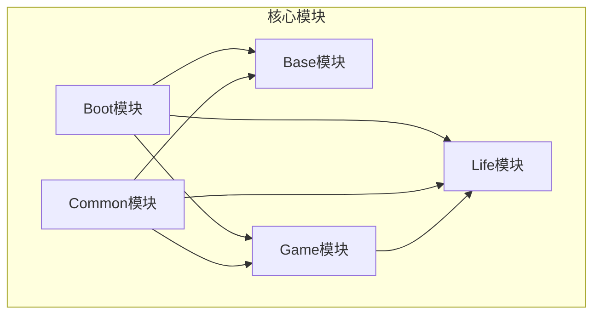
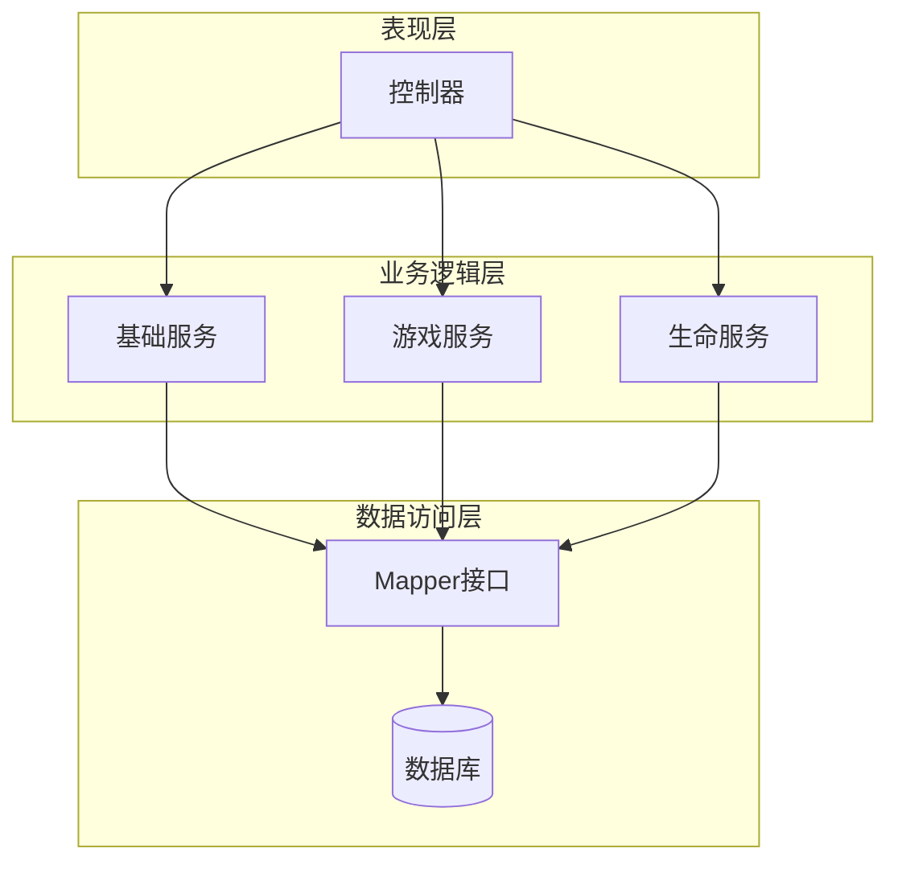
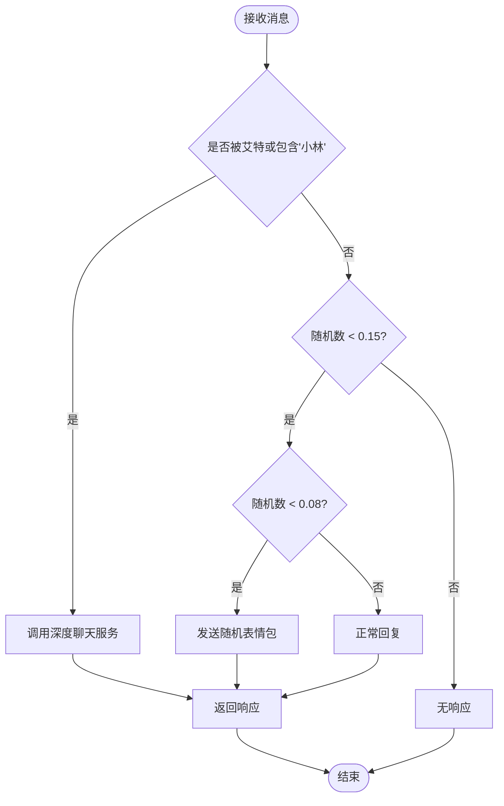
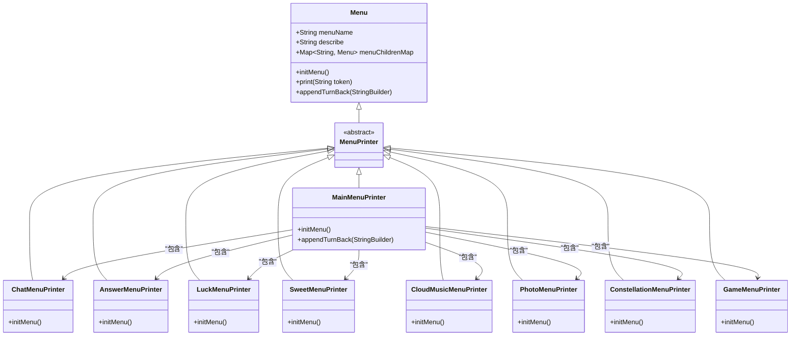
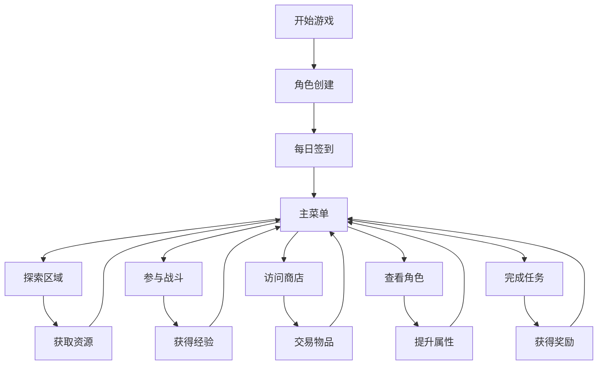
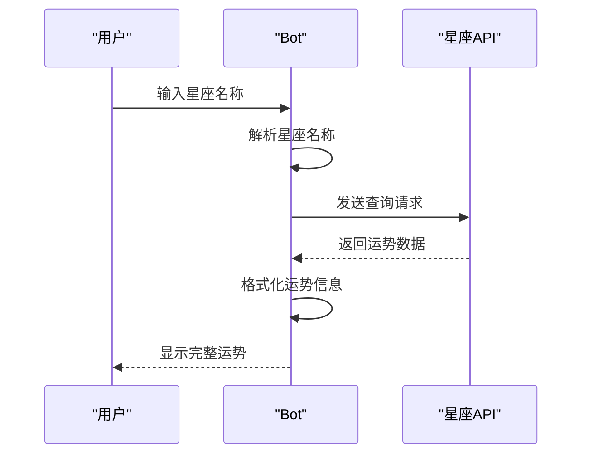
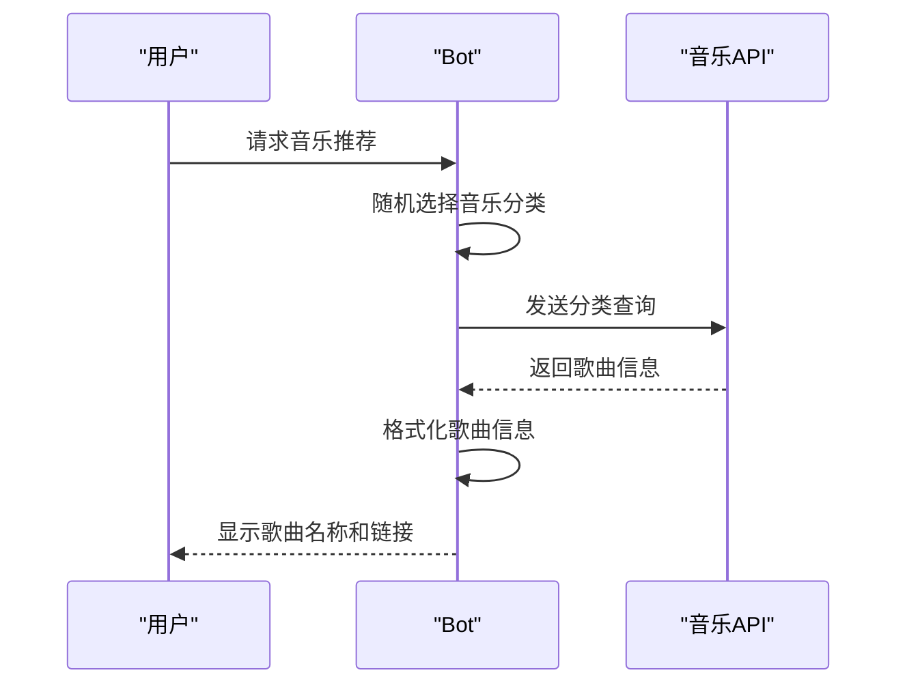
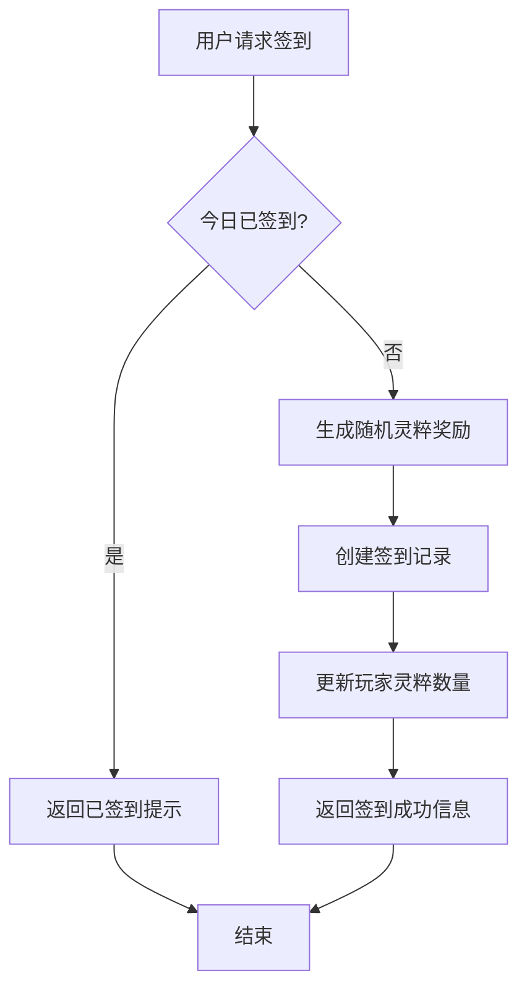
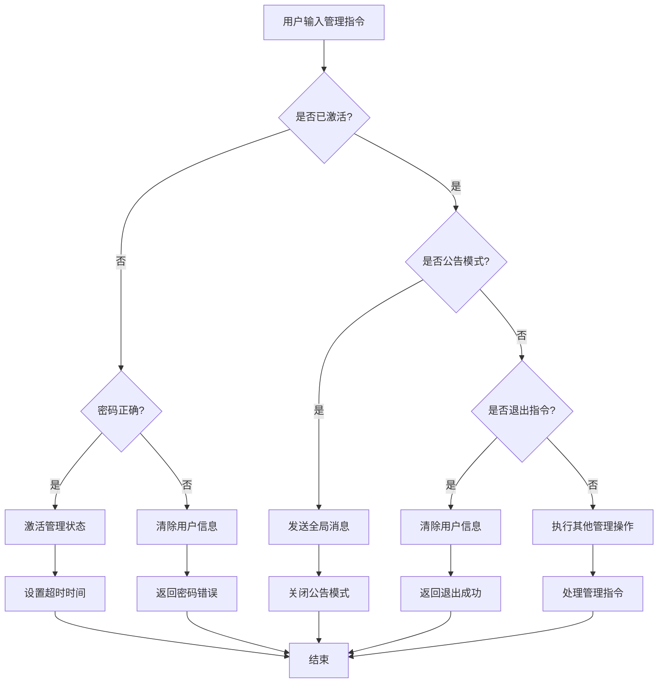
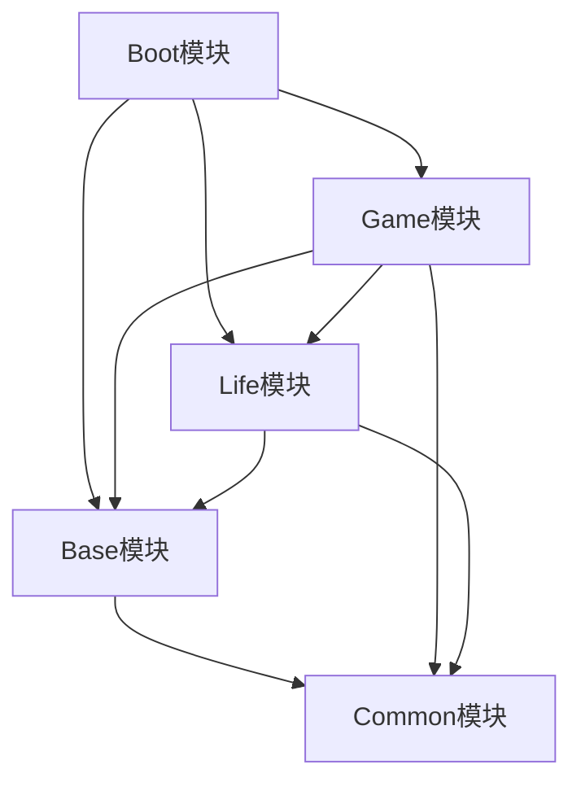

# 功能特性

<cite>
**本文档引用文件**  
- [Main.java](file://Base/src/main/java/com/bot/base/service/Main.java)
- [BotApplication.java](file://Boot/src/main/java/com/bot/boot/BotApplication.java)
- [DefaultChatServiceImpl.java](file://Base/src/main/java/com/bot/base/service/impl/DefaultChatServiceImpl.java)
- [DistributorServiceImpl.java](file://Base/src/main/java/com/bot/base/service/impl/DistributorServiceImpl.java)
- [BottleMessageServiceImpl.java](file://Base/src/main/java/com/bot/base/service/impl/BottleMessageServiceImpl.java)
- [ChatMenuPrinter.java](file://Base/src/main/java/com/bot/base/chain/menu/ChatMenuPrinter.java)
- [ConstellationMenuPrinter.java](file://Base/src/main/java/com/bot/base/chain/menu/ConstellationMenuPrinter.java)
- [GameMenuPrinter.java](file://Base/src/main/java/com/bot/base/chain/menu/GameMenuPrinter.java)
- [MainMenuPrinter.java](file://Base/src/main/java/com/bot/base/chain/menu/MainMenuPrinter.java)
- [ConstellationServiceImpl.java](file://Base/src/main/java/com/bot/base/service/impl/ConstellationServiceImpl.java)
- [CloudMusicServiceImpl.java](file://Base/src/main/java/com/bot/base/service/impl/CloudMusicServiceImpl.java)
- [GameManagerServiceImpl.java](file://Game/src/main/java/com/bot/game/service/impl/GameManagerServiceImpl.java)
- [SignMenuPrinter.java](file://Game/src/main/java/com/bot/game/chain/menu/SignMenuPrinter.java)
- [SigninServiceImpl.java](file://Life/src/main/java/com/bot/life/service/impl/SigninServiceImpl.java)
- [AnswerBookServiceImpl.java](file://Base/src/main/java/com/bot/base/service/impl/AnswerBookServiceImpl.java)
- [LuckServiceImpl.java](file://Base/src/main/java/com/bot/base/service/impl/LuckServiceImpl.java)
- [SweetServiceImpl.java](file://Base/src/main/java/com/bot/base/service/impl/SweetServiceImpl.java)
- [SystemManager.java](file://Base/src/main/java/com/bot/base/service/SystemManager.java)
- [LifeHandlerImpl.java](file://Life/src/main/java/com/bot/life/service/impl/LifeHandlerImpl.java)
- [menuInstructCode.txt](file://Boot/src/main/resources/menuInstructCode.txt)
</cite>

## 目录
1. [简介](#简介)
2. [项目结构](#项目结构)
3. [核心功能组件](#核心功能组件)
4. [系统架构概览](#系统架构概览)
5. [详细功能分析](#详细功能分析)
6. [依赖关系分析](#依赖关系分析)
7. [性能考量](#性能考量)
8. [故障排除指南](#故障排除指南)
9. [结论](#结论)

## 简介
本功能特性文档全面介绍了Bot项目提供的所有功能。文档重点描述了基础功能如消息处理和菜单系统，游戏系统如'浮生卷'修仙游戏的完整玩法循环，互动功能如星座、音乐、聊天等外部API集成，以及管理功能如签到、群管理等。文档详细说明了每个功能的实现机制，并使用代码库中的实际服务实现类作为示例。为初学者提供功能使用指南，为高级开发者提供功能扩展和定制的方法。

## 项目结构
Bot项目采用模块化设计，分为多个独立的模块，每个模块负责特定的功能领域。项目主要由以下几个核心模块组成：

- **Base模块**：包含基础服务、消息处理、菜单系统和通用功能实现
- **Boot模块**：应用程序的启动入口和配置中心
- **Common模块**：公共配置、常量定义、工具类和数据传输对象
- **Game模块**：游戏系统的核心逻辑，包括游戏菜单、玩家管理、战斗系统等
- **Life模块**：'浮生卷'修仙游戏的具体实现，包括角色、战斗、探索等游戏机制

这种模块化设计使得系统具有良好的可维护性和可扩展性，各个模块之间通过清晰的接口进行通信，降低了耦合度。

**图表来源**
- [BotApplication.java](file://Boot/src/main/java/com/bot/boot/BotApplication.java#L12-L14)

**本节来源**
- [BotApplication.java](file://Boot/src/main/java/com/bot/boot/BotApplication.java#L12-L14)

## 核心功能组件

Bot项目的核心功能组件包括消息处理系统、菜单导航系统、外部API集成服务和游戏管理系统。消息处理系统负责接收和分发用户请求，通过DistributorServiceImpl类实现请求的路由和分发。菜单导航系统采用链式设计模式，通过Menu和MenuPrinter类实现多级菜单的动态生成和导航。外部API集成服务通过各种ServiceImpl类与第三方服务进行交互，如星座运势、音乐推荐等。游戏管理系统则负责'浮生卷'修仙游戏的核心逻辑，包括玩家状态管理、战斗系统、探索系统等。

**本节来源**
- [DistributorServiceImpl.java](file://Base/src/main/java/com/bot/base/service/impl/DistributorServiceImpl.java#L169-L175)
- [MainMenuPrinter.java](file://Base/src/main/java/com/bot/base/chain/menu/MainMenuPrinter.java#L22-L29)
- [ConstellationServiceImpl.java](file://Base/src/main/java/com/bot/base/service/impl/ConstellationServiceImpl.java#L24-L36)
- [GameManagerServiceImpl.java](file://Game/src/main/java/com/bot/game/service/impl/GameManagerServiceImpl.java#L38-L51)

## 系统架构概览

Bot项目采用分层架构设计，从上到下分为表现层、业务逻辑层和数据访问层。表现层由Boot模块中的控制器类负责处理HTTP请求和响应。业务逻辑层分布在Base、Game和Life模块中，实现了各种业务功能。数据访问层由Game和Life模块中的DAO组件负责与数据库进行交互。

系统通过Spring框架进行依赖注入和配置管理，使用MyBatis作为ORM框架。任务调度功能通过@EnableScheduling注解启用，支持定时任务的执行。整个系统设计注重可扩展性和可维护性，各个组件之间通过接口进行通信，降低了耦合度。

**图表来源**
- [BotApplication.java](file://Boot/src/main/java/com/bot/boot/BotApplication.java#L12-L14)
- [BaseService.java](file://Base/src/main/java/com/bot/base/service/BaseService.java)
- [GameManageService.java](file://Game/src/main/java/com/bot/game/service/GameManageService.java)

## 详细功能分析

### 基础功能分析

#### 消息处理系统
Bot项目的消息处理系统是整个应用的核心，负责接收用户输入并分发到相应的处理服务。系统通过DistributorServiceImpl类实现消息的路由和分发。当用户发送消息时，系统首先检查消息内容，如果包含特定关键词（如"小林"或被艾特），则触发聊天响应。系统还实现了15%的随机回复机制，增加了交互的自然性。对于群聊环境，系统有8%的概率回复表情包，增加了趣味性。

**图表来源**
- [DistributorServiceImpl.java](file://Base/src/main/java/com/bot/base/service/impl/DistributorServiceImpl.java#L169-L175)

**本节来源**
- [DistributorServiceImpl.java](file://Base/src/main/java/com/bot/base/service/impl/DistributorServiceImpl.java#L169-L175)
- [DefaultChatServiceImpl.java](file://Base/src/main/java/com/bot/base/service/impl/DefaultChatServiceImpl.java#L64-L78)

#### 菜单导航系统
菜单导航系统采用链式设计模式，通过Menu和MenuPrinter类实现多级菜单的动态生成和导航。主菜单由MainMenuPrinter类实现，包含多个子菜单选项，如聊天、问答、运气、土味情话、音乐、图片、星座和游戏等。每个菜单项对应一个具体的MenuPrinter实现类，负责生成该菜单的显示内容和处理用户选择。

**图表来源**
- [Menu.java](file://Base/src/main/java/com/bot/base/chain/Menu.java)
- [MainMenuPrinter.java](file://Base/src/main/java/com/bot/base/chain/menu/MainMenuPrinter.java#L22-L29)

**本节来源**
- [MainMenuPrinter.java](file://Base/src/main/java/com/bot/base/chain/menu/MainMenuPrinter.java#L22-L29)
- [menuInstructCode.txt](file://Boot/src/main/resources/menuInstructCode.txt#L1)

### 游戏系统分析

#### '浮生卷'修仙游戏玩法循环
'浮生卷'修仙游戏采用RPG游戏模式，玩家通过签到、探索、战斗等方式提升角色能力。游戏的核心玩法循环包括：每日签到获取基础奖励，探索不同区域获取资源和经验，参与战斗提升角色等级和装备，通过商店系统进行资源交易。玩家可以通过完成各种任务和活动获得特殊奖励，提升游戏体验。

**图表来源**
- [SignMenuPrinter.java](file://Game/src/main/java/com/bot/game/chain/menu/SignMenuPrinter.java#L31)
- [LifeHandlerImpl.java](file://Life/src/main/java/com/bot/life/service/impl/LifeHandlerImpl.java#L855)

**本节来源**
- [SignMenuPrinter.java](file://Game/src/main/java/com/bot/game/chain/menu/SignMenuPrinter.java#L31)
- [SigninServiceImpl.java](file://Life/src/main/java/com/bot/life/service/impl/SigninServiceImpl.java#L32-L67)

### 互动功能分析

#### 星座运势服务
星座运势服务通过调用外部API获取用户的星座运势信息。系统支持查询十二星座的每日运势，返回包括日期、贵人、幸运色、健康、爱情、工作、财富等方面的详细信息。用户只需输入星座名称，系统即可返回相应的运势分析。

**图表来源**
- [ConstellationServiceImpl.java](file://Base/src/main/java/com/bot/base/service/impl/ConstellationServiceImpl.java#L24-L36)

**本节来源**
- [ConstellationServiceImpl.java](file://Base/src/main/java/com/bot/base/service/impl/ConstellationServiceImpl.java#L24-L36)

#### 音乐推荐服务
音乐推荐服务通过调用云音乐API为用户提供随机音乐推荐。系统会从预定义的音乐分类中随机选择一个分类，然后从该分类中获取一首随机歌曲，返回歌曲名称和播放链接。用户可以通过此功能发现新的音乐。

**图表来源**
- [CloudMusicServiceImpl.java](file://Base/src/main/java/com/bot/base/service/impl/CloudMusicServiceImpl.java#L28-L44)

**本节来源**
- [CloudMusicServiceImpl.java](file://Base/src/main/java/com/bot/base/service/impl/CloudMusicServiceImpl.java#L28-L44)

### 管理功能分析

#### 签到管理系统
签到管理系统为玩家提供每日签到功能，鼓励玩家每日登录游戏。系统会检查玩家今日是否已经签到，如果未签到，则随机生成1-100的灵粹奖励。签到成功后，系统会更新玩家的灵粹数量，并记录签到时间。连续签到可能会获得额外奖励。

**图表来源**
- [SigninServiceImpl.java](file://Life/src/main/java/com/bot/life/service/impl/SigninServiceImpl.java#L32-L67)

**本节来源**
- [SigninServiceImpl.java](file://Life/src/main/java/com/bot/life/service/impl/SigninServiceImpl.java#L32-L67)

#### 群组管理功能
群组管理功能允许管理员对群组进行管理。系统提供了管理模式，管理员可以通过输入密码进入管理状态。在管理模式下，管理员可以发送全局公告，向所有用户广播消息。系统还实现了防止重复进入管理状态的安全机制。

**图表来源**
- [SystemManager.java](file://Base/src/main/java/com/bot/base/service/SystemManager.java#L105-L125)

**本节来源**
- [SystemManager.java](file://Base/src/main/java/com/bot/base/service/SystemManager.java#L105-L125)

## 依赖关系分析

Bot项目的各个模块之间存在明确的依赖关系。Boot模块作为启动入口，依赖于Base、Game、Life和Common模块。Base模块提供基础服务，被Game和Life模块依赖。Common模块提供公共组件，被所有其他模块依赖。Game模块实现游戏核心逻辑，依赖于Life模块的具体游戏实现。

**图表来源**
- [BotApplication.java](file://Boot/src/main/java/com/bot/boot/BotApplication.java#L12-L14)

**本节来源**
- [BotApplication.java](file://Boot/src/main/java/com/bot/boot/BotApplication.java#L12-L14)

## 性能考量

Bot项目在设计时考虑了性能优化。系统使用HashMap缓存频繁访问的数据，如聊天ID、语音ID和群组ID，减少了数据库查询次数。对于外部API调用，系统实现了简单的错误处理机制，确保在网络不稳定时仍能提供基本服务。定时任务通过Spring的调度机制实现，避免了手动线程管理的复杂性。

系统还实现了请求频率控制，通过SystemConfigCache.chatFrequency配置项控制聊天回复的频率，默认为15%。这种设计既保证了交互的自然性，又避免了过度响应导致的性能问题。

## 故障排除指南

### 常见问题及解决方案

1. **无法进入管理状态**
   - 检查管理密码是否正确
   - 确认是否已达到管理状态超时时间
   - 检查用户临时信息是否被正确清除

2. **星座查询失败**
   - 检查星座名称是否正确（需输入完整星座名称）
   - 确认外部API服务是否正常运行
   - 检查网络连接是否正常

3. **签到功能异常**
   - 检查数据库连接是否正常
   - 确认玩家记录是否存在
   - 检查日期格式是否正确处理

4. **音乐推荐无响应**
   - 检查音乐API的URL配置是否正确
   - 确认网络是否能够访问外部API
   - 检查返回数据格式是否符合预期

**本节来源**
- [SystemManager.java](file://Base/src/main/java/com/bot/base/service/SystemManager.java#L105-L125)
- [ConstellationServiceImpl.java](file://Base/src/main/java/com/bot/base/service/impl/ConstellationServiceImpl.java#L34-L36)
- [SigninServiceImpl.java](file://Life/src/main/java/com/bot/life/service/impl/SigninServiceImpl.java#L68-L71)
- [CloudMusicServiceImpl.java](file://Base/src/main/java/com/bot/base/service/impl/CloudMusicServiceImpl.java#L34-L44)

## 结论

Bot项目提供了一套完整的功能体系，涵盖了基础消息处理、丰富的互动功能、深度的游戏体验和有效的管理工具。系统采用模块化设计，各组件职责清晰，易于维护和扩展。'浮生卷'修仙游戏实现了完整的RPG玩法循环，通过签到、探索、战斗和交易等机制保持玩家的长期参与度。

对于初学者，系统提供了直观的菜单导航和清晰的操作指引，降低了使用门槛。对于高级开发者，系统开放了服务实现类的源码，提供了功能扩展和定制的可能性。整体架构设计合理，性能考量周到，为用户提供了一个稳定、有趣且可扩展的交互体验。

未来可以考虑增加更多外部API集成，丰富互动内容；优化游戏平衡性，提升玩家留存率；增加数据分析功能，为运营决策提供支持。