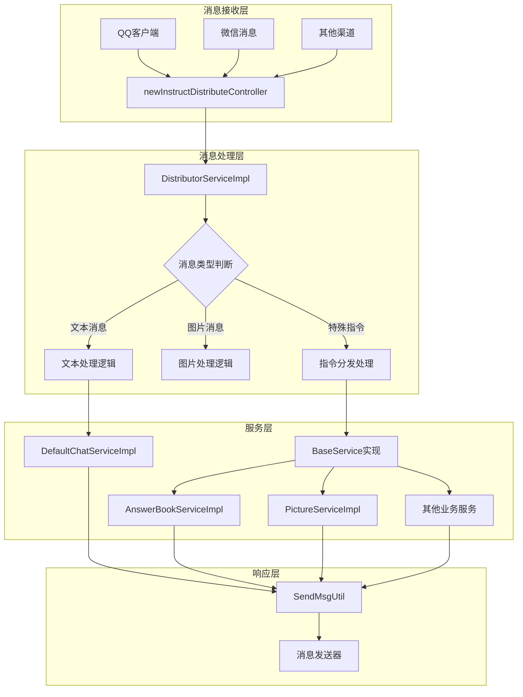
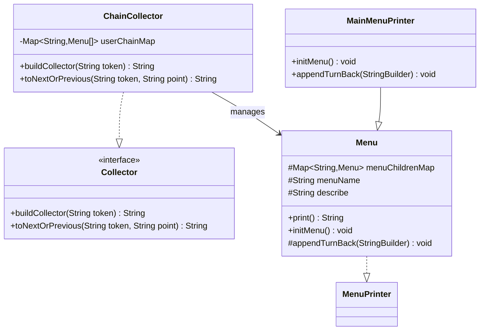
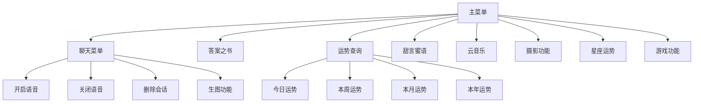
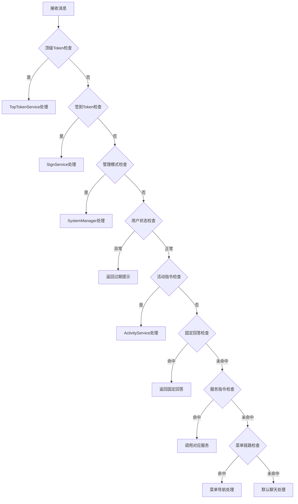
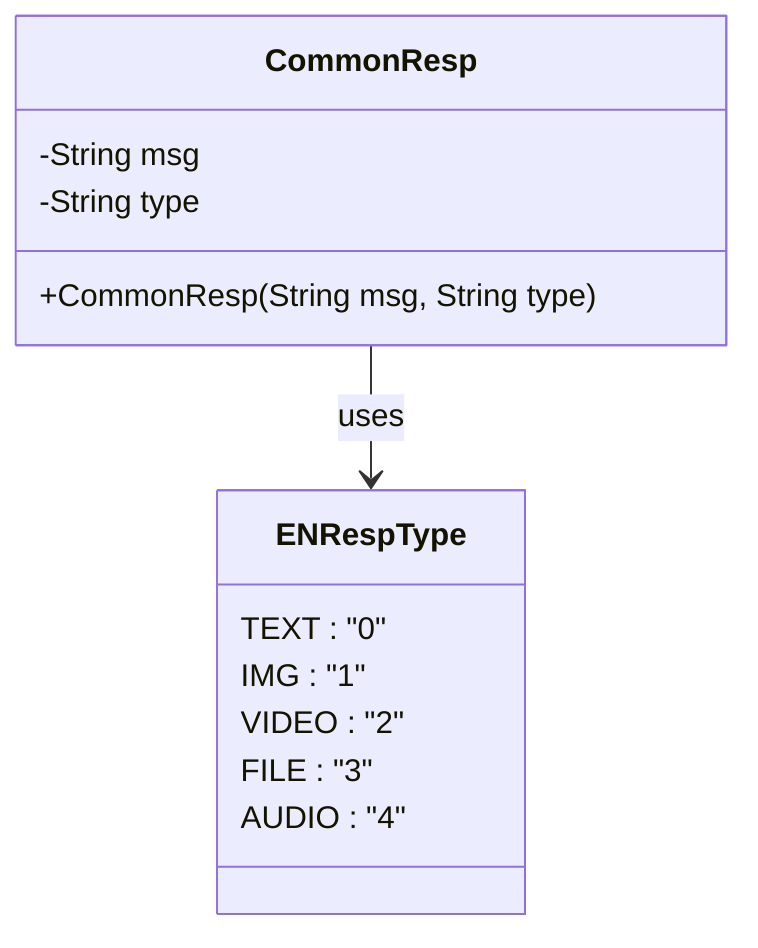
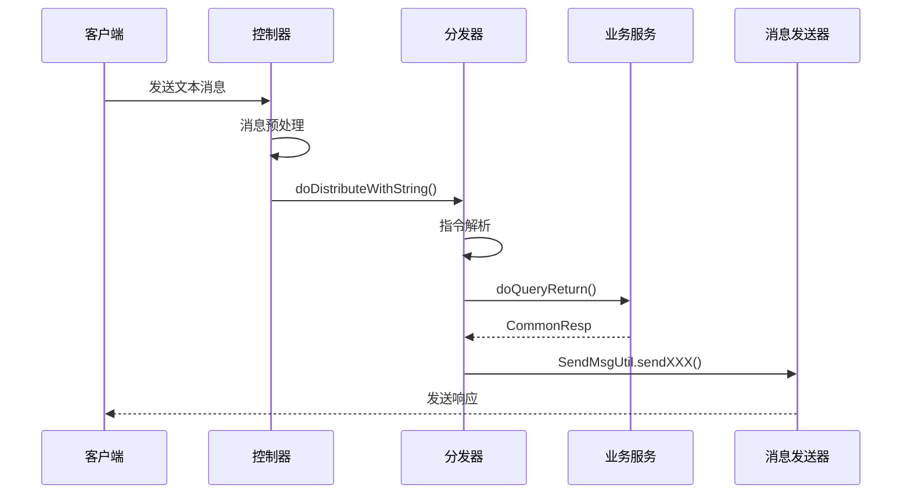

# 基础功能

<cite>
**本文档中引用的文件**
- [ChainCollector.java](file://Base/src/main/java/com/bot/base/chain/ChainCollector.java)
- [MainMenuPrinter.java](file://Base/src/main/java/com/bot/base/chain/menu/MainMenuPrinter.java)
- [DistributorServiceImpl.java](file://Base/src/main/java/com/bot/base/service/impl/DistributorServiceImpl.java)
- [SendMsgUtil.java](file://Common/src/main/java/com/bot/common/util/SendMsgUtil.java)
- [MessageSender.java](file://Base/src/main/java/com/bot/base/commom/MessageSender.java)
- [Menu.java](file://Base/src/main/java/com/bot/base/chain/Menu.java)
- [MenuPrinter.java](file://Base/src/main/java/com/bot/base/chain/MenuPrinter.java)
- [BaseService.java](file://Base/src/main/java/com/bot/base/service/BaseService.java)
- [CommonResp.java](file://Base/src/main/java/com/bot/base/dto/CommonResp.java)
- [DefaultChatServiceImpl.java](file://Base/src/main/java/com/bot/base/service/impl/DefaultChatServiceImpl.java)
- [newInstructDistributeController.java](file://Boot/src/main/java/com/bot/boot/controller/newInstructDistributeController.java)
- [AnswerBookServiceImpl.java](file://Base/src/main/java/com/bot/base/service/impl/AnswerBookServiceImpl.java)
- [PictureServiceImpl.java](file://Base/src/main/java/com/bot/base/service/impl/PictureServiceImpl.java)
</cite>

## 目录
1. [概述](#概述)
2. [消息处理架构](#消息处理架构)
3. [菜单系统设计](#菜单系统设计)
4. [指令分发机制](#指令分发机制)
5. [消息类型处理](#消息类型处理)
6. [扩展开发指南](#扩展开发指南)
7. [集成与配置](#集成与配置)
8. [总结](#总结)

## 概述

Bot项目采用模块化架构设计，核心功能围绕消息处理、菜单系统和指令分发三大模块构建。系统通过ChainCollector实现链式菜单处理，DistributorServiceImpl负责消息路由分发，支持多种消息类型的智能处理和响应。

### 核心特性
- **链式菜单处理**：基于ChainCollector的菜单链式导航机制
- **智能指令分发**：多层级的消息路由和处理策略
- **多样化消息支持**：文本、图片、音频、视频等多种消息类型
- **可扩展架构**：基于接口的设计便于功能扩展
- **统一消息发送**：通过SendMsgUtil提供标准化的消息发送接口

## 消息处理架构

### 整体架构图



**图表来源**
- [newInstructDistributeController.java](file://Boot/src/main/java/com/bot/boot/controller/newInstructDistributeController.java#L72-L245)
- [DistributorServiceImpl.java](file://Base/src/main/java/com/bot/base/service/impl/DistributorServiceImpl.java#L125-L414)

### 消息接收与预处理

消息从不同渠道（QQ、微信等）到达系统后，首先由控制器进行预处理：

1. **消息过滤**：排除无效或重复的消息
2. **消息类型识别**：根据消息类型进行分类处理
3. **参数提取**：提取发送者ID、消息内容、群组ID等关键信息

**章节来源**
- [newInstructDistributeController.java](file://Boot/src/main/java/com/bot/boot/controller/newInstructDistributeController.java#L72-L245)

## 菜单系统设计

### ChainCollector链式处理机制

ChainCollector是菜单系统的核心组件，实现了基于链式的菜单导航机制：



**图表来源**
- [ChainCollector.java](file://Base/src/main/java/com/bot/base/chain/ChainCollector.java#L19-L56)
- [Menu.java](file://Base/src/main/java/com/bot/base/chain/Menu.java#L15-L56)

### 菜单层次结构

系统采用树形菜单结构，以MainMenuPrinter为主入口：



**图表来源**
- [MainMenuPrinter.java](file://Base/src/main/java/com/bot/base/chain/menu/MainMenuPrinter.java#L21-L30)

### 菜单打印器实现原理

每个菜单打印器继承自Menu基类，实现特定的菜单逻辑：

1. **初始化菜单**：在构造函数中调用initMenu()方法
2. **构建菜单结构**：通过menuChildrenMap建立父子关系
3. **生成菜单内容**：自动生成标准格式的菜单文本

**章节来源**
- [Menu.java](file://Base/src/main/java/com/bot/base/chain/Menu.java#L25-L50)
- [MainMenuPrinter.java](file://Base/src/main/java/com/bot/base/chain/menu/MainMenuPrinter.java#L19-L37)

## 指令分发机制

### DistributorServiceImpl核心逻辑

DistributorServiceImpl是系统的核心分发器，负责将接收到的消息路由到相应的处理服务：



**图表来源**
- [DistributorServiceImpl.java](file://Base/src/main/java/com/bot/base/service/impl/DistributorServiceImpl.java#L216-L361)

### 服务映射机制

系统通过Map<String, BaseService> serviceMap维护服务实例映射：

| 指令前缀 | 对应服务 | 功能描述 |
|---------|---------|---------|
| 答案之书 | AnswerBookServiceImpl | 提供占卜问答功能 |
| 图片 | PictureServiceImpl | 提供各类图片搜索 |
| 聊天 | DefaultChatServiceImpl | AI对话和语音聊天 |
| 运势 | LuckServiceImpl | 生肖运势查询 |
| 甜言蜜语 | SweetServiceImpl | 情话生成 |
| 星座 | ConstellationServiceImpl | 星座运势查询 |

**章节来源**
- [DistributorServiceImpl.java](file://Base/src/main/java/com/bot/base/service/impl/DistributorServiceImpl.java#L43-L48)

### 响应类型处理

系统支持多种响应类型，通过CommonResp封装响应内容：



**图表来源**
- [CommonResp.java](file://Base/src/main/java/com/bot/base/dto/CommonResp.java#L10-L19)

## 消息类型处理

### 文本消息处理流程

文本消息是最常见的消息类型，处理流程如下：



**图表来源**
- [DistributorServiceImpl.java](file://Base/src/main/java/com/bot/base/service/impl/DistributorServiceImpl.java#L125-L198)
- [SendMsgUtil.java](file://Common/src/main/java/com/bot/common/util/SendMsgUtil.java#L27-L37)

### 图片消息处理

图片消息需要特殊的处理流程，包括图片下载、处理和回复：

1. **图片获取**：通过FetchPictureDTO获取原始图片
2. **图片处理**：调用相应的图片处理服务
3. **响应发送**：使用SendMsgUtil.sendImg()发送图片

**章节来源**
- [PictureServiceImpl.java](file://Base/src/main/java/com/bot/base/service/impl/PictureServiceImpl.java#L26-L41)

### 特殊指令处理

系统支持多种特殊指令，如：
- **菜单指令**：触发菜单导航
- **语音指令**：开启/关闭语音聊天
- **生图指令**：生成AI图片
- **活动指令**：参与系统活动

**章节来源**
- [DefaultChatServiceImpl.java](file://Base/src/main/java/com/bot/base/service/impl/DefaultChatServiceImpl.java#L64-L98)

## 扩展开发指南

### 自定义消息处理器

开发者可以通过实现BaseService接口来创建自定义消息处理器：

```java
@Service("customServiceName")
public class CustomServiceImpl implements BaseService {
    
    @Override
    public CommonResp doQueryReturn(String reqContent, String token, String groupId, String channel) {
        // 实现自定义业务逻辑
        if (reqContent.startsWith("自定义指令")) {
            String response = processCustomLogic(reqContent);
            return new CommonResp(response, ENRespType.TEXT.getType());
        }
        return null; // 不处理该消息
    }
    
    private String processCustomLogic(String content) {
        // 自定义业务逻辑
        return "处理结果";
    }
}
```

### 菜单扩展开发

创建新的菜单项需要以下步骤：

1. **继承Menu类**：创建新的菜单打印器
2. **实现initMenu()**：初始化菜单结构
3. **注册到Spring容器**：添加@Component注解
4. **更新主菜单**：在MainMenuPrinter中添加新菜单项

### SendMsgUtil工具类集成

所有消息发送操作都通过SendMsgUtil工具类完成：

| 方法名 | 功能 | 使用场景 |
|-------|------|---------|
| sendMsg() | 发送文本消息 | 基础文本回复 |
| sendImg() | 发送图片消息 | 图片资源回复 |
| sendAudio() | 发送语音消息 | 语音交互 |
| sendVideo() | 发送视频消息 | 视频内容分享 |
| sendGroupMsg() | 发送群组消息 | 群聊互动 |

**章节来源**
- [SendMsgUtil.java](file://Common/src/main/java/com/bot/common/util/SendMsgUtil.java#L27-L274)

## 集成与配置

### 配置文件设置

系统通过application.properties配置各种参数：

```properties
# 消息发送配置
system.message.send.url=http://xxx.com/send
system.message.send.key=your_key
system.robot.qq=your_qq_number

# AI服务配置
chat.url=https://api.ai.com/chat
chat.key=ai_api_key
pic.create.url=https://api.ai.com/pic

# 文件路径配置
help.img.path=/path/to/help/images
game.file.path=/path/to/game/files
```

### 消息发送器配置

MessageSender负责底层消息发送，需要配置以下参数：
- **robotQQ**：机器人QQ号
- **url**：消息发送接口地址  
- **key**：API密钥

**章节来源**
- [MessageSender.java](file://Base/src/main/java/com/bot/base/commom/MessageSender.java#L21-L46)

## 总结

Bot项目的基础功能模块展现了优秀的软件架构设计：

1. **模块化设计**：清晰的职责分离，便于维护和扩展
2. **链式处理**：ChainCollector提供了灵活的菜单导航机制
3. **统一接口**：BaseService和CommonResp确保了处理的一致性
4. **工具类集成**：SendMsgUtil提供了标准化的消息发送能力
5. **可扩展性**：基于接口的设计支持功能的快速扩展

这套消息处理机制不仅满足了当前的功能需求，更为未来的功能扩展奠定了坚实的基础。开发者可以根据业务需求，通过实现相应的接口和服务，轻松地添加新的功能模块。