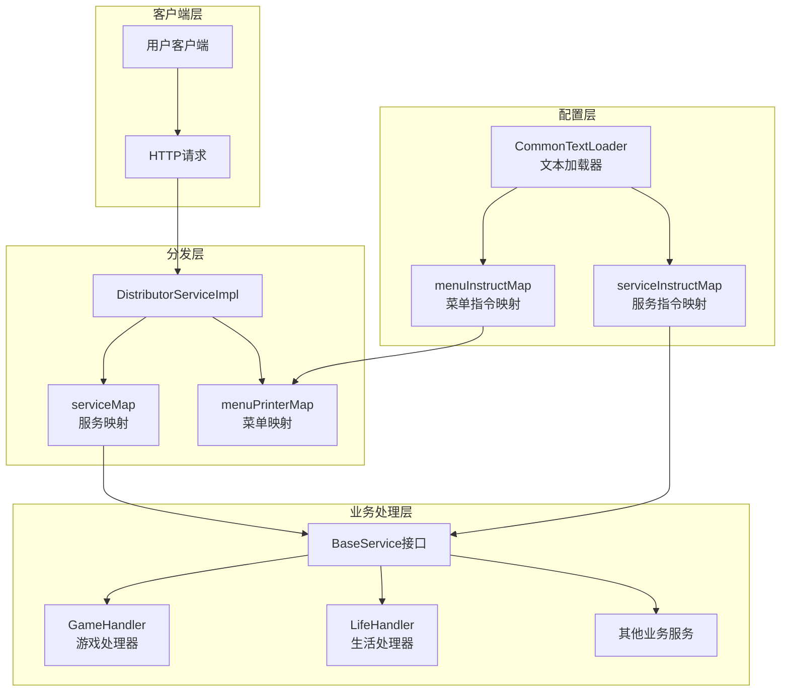
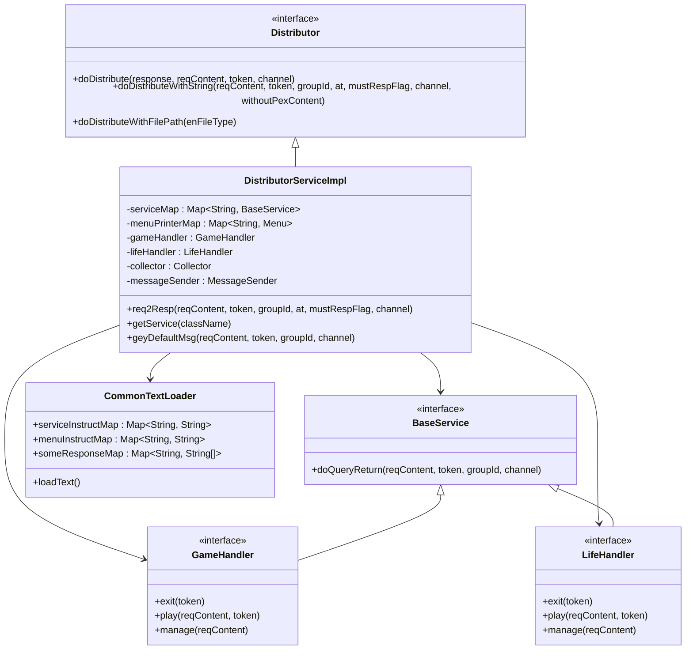
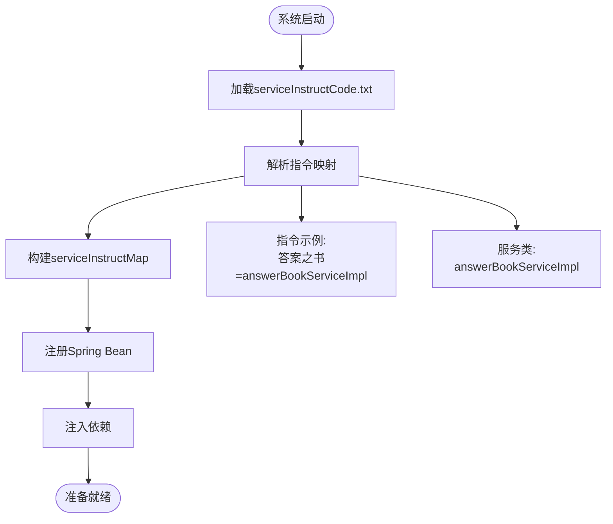
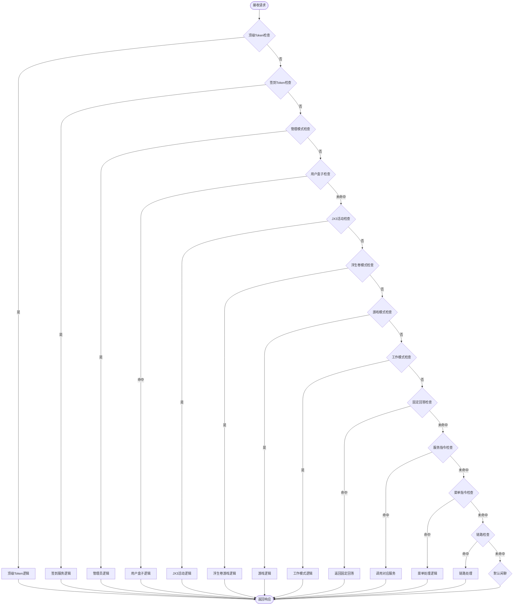
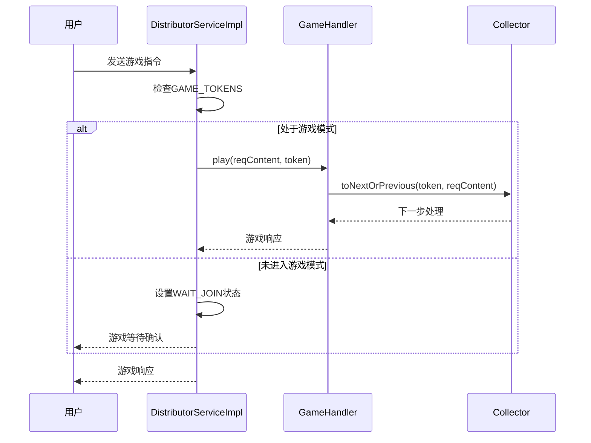
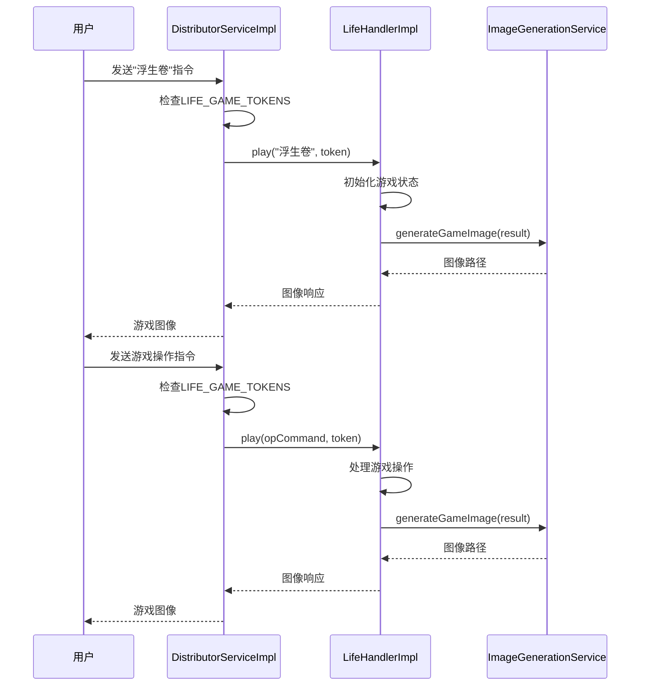
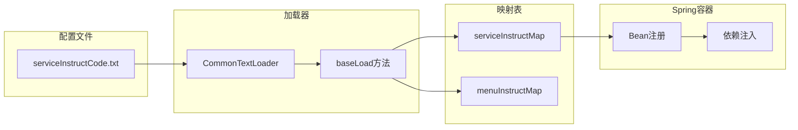
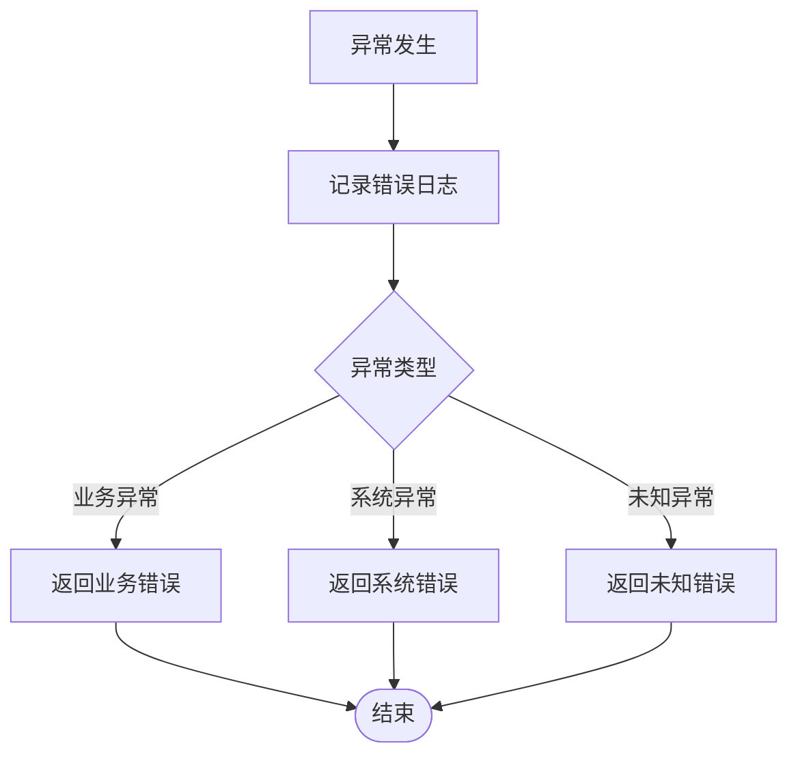
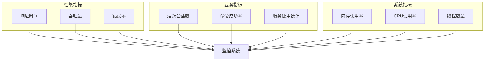

# 指令分发架构

<cite>
**本文档引用的文件**
- [DistributorServiceImpl.java](file://Base/src/main/java/com/bot/base/service/impl/DistributorServiceImpl.java)
- [Distributor.java](file://Base/src/main/java/com/bot/base/service/Distributor.java)
- [BaseService.java](file://Base/src/main/java/com/bot/base/service/BaseService.java)
- [GameHandler.java](file://Game/src/main/java/com/bot/game/service/GameHandler.java)
- [GameHandlerServiceImpl.java](file://Game/src/main/java/com/bot/game/service/impl/GameHandlerServiceImpl.java)
- [LifeHandlerImpl.java](file://Life/src/main/java/com/bot/life/service/impl/LifeHandlerImpl.java)
- [CommonTextLoader.java](file://Common/src/main/java/com/bot/common/loader/CommonTextLoader.java)
- [serviceInstructCode.txt](file://Boot/src/main/resources/serviceInstructCode.txt)
- [application.properties](file://Boot/src/main/resources/application.properties)
</cite>

## 目录
1. [概述](#概述)
2. [核心架构设计](#核心架构设计)
3. [依赖注入组件分析](#依赖注入组件分析)
4. [指令路由机制详解](#指令路由机制详解)
5. [关键方法深度解析](#关键方法深度解析)
6. [指令映射与注册机制](#指令映射与注册机制)
7. [新增指令处理器指南](#新增指令处理器指南)
8. [最佳实践与规范](#最佳实践与规范)
9. [故障排除指南](#故障排除指南)
10. [总结](#总结)

## 概述

DistributorServiceImpl是Bot系统的核心指令分发器，负责接收用户输入的指令，通过复杂的条件判断逻辑和依赖注入机制，将请求精准地分发到相应的业务处理器。该组件采用策略模式和工厂模式相结合的设计，实现了高度可扩展的指令路由架构。

## 核心架构设计

### 整体架构图



**图表来源**
- [DistributorServiceImpl.java](file://Base/src/main/java/com/bot/base/service/impl/DistributorServiceImpl.java#L43-L94)
- [CommonTextLoader.java](file://Common/src/main/java/com/bot/common/loader/CommonTextLoader.java#L25-L40)

### 核心组件关系图



**图表来源**
- [Distributor.java](file://Base/src/main/java/com/bot/base/service/Distributor.java#L12-L36)
- [DistributorServiceImpl.java](file://Base/src/main/java/com/bot/base/service/impl/DistributorServiceImpl.java#L41-L94)
- [BaseService.java](file://Base/src/main/java/com/bot/base/service/BaseService.java#L9-L18)

## 依赖注入组件分析

### 核心依赖组件

DistributorServiceImpl通过Spring的依赖注入机制，管理着多个关键组件：

| 组件名称 | 类型 | 作用 | 注入方式 |
|---------|------|------|----------|
| serviceMap | Map<String, BaseService> | 服务实例映射表 | @Autowired |
| menuPrinterMap | Map<String, Menu> | 菜单打印器映射表 | @Autowired |
| gameHandler | GameHandler | 游戏业务处理器 | @Autowired |
| lifeHandler | LifeHandler | 生活业务处理器 | @Autowired |
| collector | Collector | 链式收集器 | @Autowired |
| messageSender | MessageSender | 消息发送器 | @Autowired |

### 服务类映射机制

系统通过CommonTextLoader加载配置文件，建立指令与服务类的映射关系：



**图表来源**
- [CommonTextLoader.java](file://Common/src/main/java/com/bot/common/loader/CommonTextLoader.java#L60-L80)
- [serviceInstructCode.txt](file://Boot/src/main/resources/serviceInstructCode.txt#L1-L15)

**节来源**
- [DistributorServiceImpl.java](file://Base/src/main/java/com/bot/base/service/impl/DistributorServiceImpl.java#L43-L94)
- [CommonTextLoader.java](file://Common/src/main/java/com/bot/common/loader/CommonTextLoader.java#L25-L40)

## 指令路由机制详解

### 请求处理流程

DistributorServiceImpl的req2Resp方法是整个指令路由的核心，它按照严格的优先级顺序处理用户请求：



**图表来源**
- [DistributorServiceImpl.java](file://Base/src/main/java/com/bot/base/service/impl/DistributorServiceImpl.java#L216-L361)

### 指令前缀匹配机制

系统实现了多层次的指令匹配策略：

1. **完全匹配**：用于固定回答和特殊指令
2. **前缀匹配**：用于服务指令和活动指令
3. **包含匹配**：用于菜单指令和模糊匹配

**节来源**
- [DistributorServiceImpl.java](file://Base/src/main/java/com/bot/base/service/impl/DistributorServiceImpl.java#L324-L341)

## 关键方法深度解析

### playGame方法分析

虽然源代码中没有直接的playGame方法，但通过分析游戏模式切换逻辑，我们可以理解类似的游戏处理机制：



**图表来源**
- [DistributorServiceImpl.java](file://Base/src/main/java/com/bot/base/service/impl/DistributorServiceImpl.java#L288-L307)
- [GameHandlerServiceImpl.java](file://Game/src/main/java/com/bot/game/service/impl/GameHandlerServiceImpl.java#L89-L133)

### playLife方法分析

浮生卷游戏模式的处理逻辑展示了更复杂的状态管理：



**图表来源**
- [DistributorServiceImpl.java](file://Base/src/main/java/com/bot/base/service/impl/DistributorServiceImpl.java#L269-L285)
- [LifeHandlerImpl.java](file://Life/src/main/java/com/bot/life/service/impl/LifeHandlerImpl.java#L470-L477)

### 条件判断逻辑

系统在每个处理阶段都实现了精确的条件判断：

| 判断类型 | 实现方式 | 示例 |
|---------|----------|------|
| Token状态检查 | HashMap.containsKey() | GAME_TOKENS.containsKey(token) |
| 指令前缀匹配 | String.startsWith() | reqContent.startsWith("浮生卷") |
| 指令内容匹配 | String.contains() | reqContent.contains("菜单") |
| 固定回答匹配 | 完全相等比较 | keyword.equals(reqContent) |
| 状态转换 | HashMap操作 | GAME_TOKENS.put(token, status) |

**节来源**
- [DistributorServiceImpl.java](file://Base/src/main/java/com/bot/base/service/impl/DistributorServiceImpl.java#L216-L361)

## 指令映射与注册机制

### 配置文件驱动的映射

系统通过配置文件实现指令与服务的动态映射：



**图表来源**
- [CommonTextLoader.java](file://Common/src/main/java/com/bot/common/loader/CommonTextLoader.java#L60-L80)
- [serviceInstructCode.txt](file://Boot/src/main/resources/serviceInstructCode.txt#L1-L15)

### 指令格式规范

配置文件中的指令映射遵循特定的格式规范：

```
指令1,指令2,指令3=服务类名
```

**示例配置解析：**

| 指令组合 | 对应服务 | 功能描述 |
|---------|----------|----------|
| 答案之书 | answerBookServiceImpl | 回答问题服务 |
| 情话 | sweetServiceImpl | 生成情话服务 |
| 白羊座,金牛座,... | constellationServiceImpl | 星座运势服务 |
| 菜单,帮助,功能大全 | helpServiceImpl | 帮助菜单服务 |

**节来源**
- [serviceInstructCode.txt](file://Boot/src/main/resources/serviceInstructCode.txt#L1-L15)
- [CommonTextLoader.java](file://Common/src/main/java/com/bot/common/loader/CommonTextLoader.java#L60-L80)

## 新增指令处理器指南

### 注册流程步骤

添加新的指令处理器需要以下步骤：

```mermaid
flowchart TD
Start([开始]) --> CreateService[创建服务类]
CreateService --> ImplementInterface[实现BaseService接口]
ImplementInterface --> AddAnnotation[@Service注解]
AddAnnotation --> UpdateConfig[更新配置文件]
UpdateConfig --> ReloadSystem[重启系统]
ReloadSystem --> TestNewFeature[测试新功能]
TestNewFeature --> End([完成])
CreateService --> ServiceClass[示例: NewFeatureServiceImpl]
ImplementInterface --> MethodSignature[doQueryReturn方法签名]
AddAnnotation --> SpringBean[Spring自动扫描]
UpdateConfig --> ConfigFormat["指令=服务类名"]
```

### 服务类命名规范

1. **类名规范**：服务类名应采用`[功能]Service[Impl]`的命名模式
2. **包结构**：放置在对应的模块包下，如`com.bot.[module].service.impl`
3. **接口继承**：必须实现BaseService接口

### Spring Bean声明方式

```java
@Service
public class NewFeatureServiceImpl implements BaseService {
    
    @Autowired
    private SomeDependency someDependency;
    
    @Override
    public CommonResp doQueryReturn(String reqContent, String token, String groupId, String channel) {
        // 实现业务逻辑
        return new CommonResp("响应内容", ENRespType.TEXT.getType());
    }
}
```

### 配置文件更新

在`serviceInstructCode.txt`中添加新的指令映射：

```
新功能指令=newFeatureServiceImpl
```

**节来源**
- [DistributorServiceImpl.java](file://Base/src/main/java/com/bot/base/service/impl/DistributorServiceImpl.java#L363-L369)
- [serviceInstructCode.txt](file://Boot/src/main/resources/serviceInstructCode.txt#L1-L15)

## 最佳实践与规范

### 性能优化建议

1. **指令匹配顺序优化**：将常用指令放在配置文件前面
2. **缓存机制**：对频繁访问的服务实例进行缓存
3. **异步处理**：对于耗时操作使用异步处理

### 错误处理规范



### 代码质量要求

1. **单一职责原则**：每个服务类只处理一种类型的业务
2. **接口隔离**：BaseService接口保持简洁，避免过度设计
3. **依赖倒置**：高层模块不依赖低层模块的具体实现

### 测试策略

1. **单元测试**：为每个服务类编写单元测试
2. **集成测试**：测试指令分发的整体流程
3. **性能测试**：验证高并发场景下的系统表现

## 故障排除指南

### 常见问题及解决方案

| 问题类型 | 症状 | 解决方案 |
|---------|------|----------|
| Bean注入失败 | NoSuchBeanDefinitionException | 检查包扫描配置和注解 |
| 指令无法识别 | 返回null或默认回复 | 检查配置文件映射 |
| 服务调用异常 | 业务逻辑错误 | 检查服务实现和依赖 |
| 状态管理错误 | 游戏模式混乱 | 检查状态转换逻辑 |

### 调试技巧

1. **日志分析**：利用SLF4J日志系统跟踪执行流程
2. **断点调试**：在关键方法设置断点
3. **单元测试**：编写针对性的单元测试

### 监控指标



**节来源**
- [DistributorServiceImpl.java](file://Base/src/main/java/com/bot/base/service/impl/DistributorServiceImpl.java#L105-L122)
- [Life_Spring_Integration_Fix.md](file://Life_Spring_Integration_Fix.md#L1-L96)

## 总结

DistributorServiceImpl作为Bot系统的指令分发核心，展现了优秀的软件架构设计：

### 核心优势

1. **高度可扩展性**：通过配置文件驱动的指令映射，支持快速添加新功能
2. **清晰的职责分离**：不同类型的业务逻辑由专门的处理器处理
3. **灵活的状态管理**：支持游戏模式、生活模式等多种交互状态
4. **完善的错误处理**：多层次的异常处理和恢复机制

### 设计亮点

- **策略模式应用**：根据不同条件选择不同的处理策略
- **工厂模式实现**：通过serviceMap实现服务实例的统一管理
- **责任链模式**：通过collector实现复杂的交互流程控制
- **依赖注入**：充分利用Spring框架的依赖注入特性

### 发展方向

1. **微服务化改造**：将大型服务拆分为独立的微服务
2. **事件驱动架构**：引入消息队列实现异步处理
3. **AI集成**：集成自然语言处理能力提升用户体验
4. **性能优化**：引入缓存机制和负载均衡

这个指令分发架构为Bot系统提供了坚实的基础，支持系统的持续发展和功能扩展，是现代聊天机器人系统设计的优秀范例。