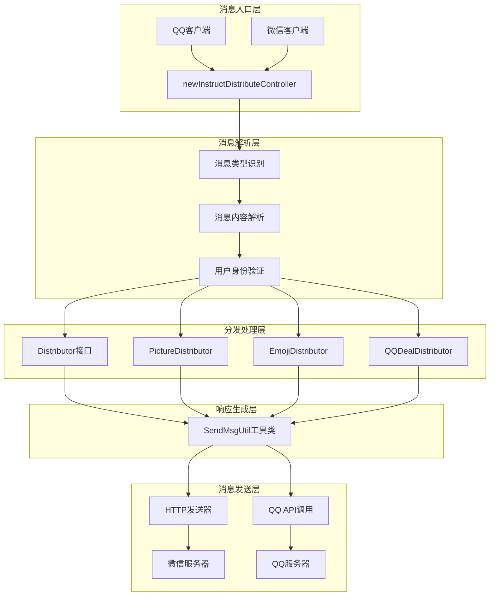
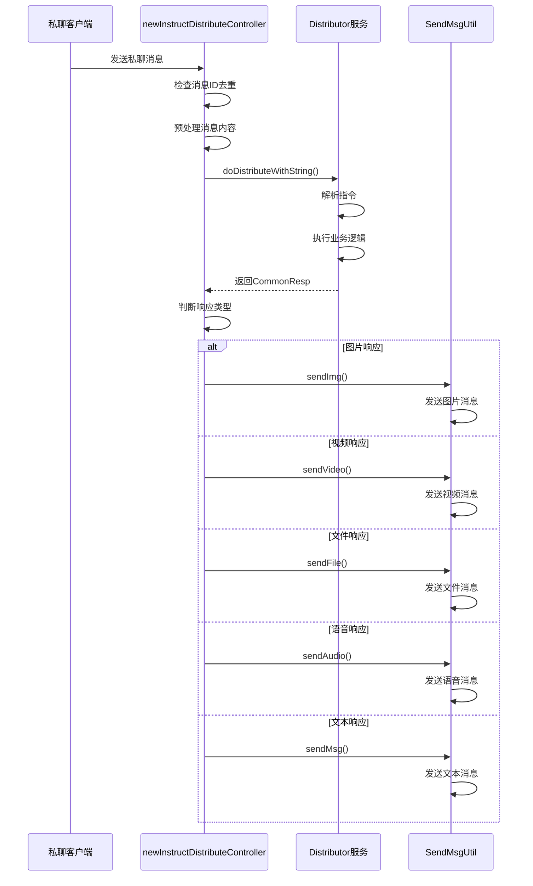
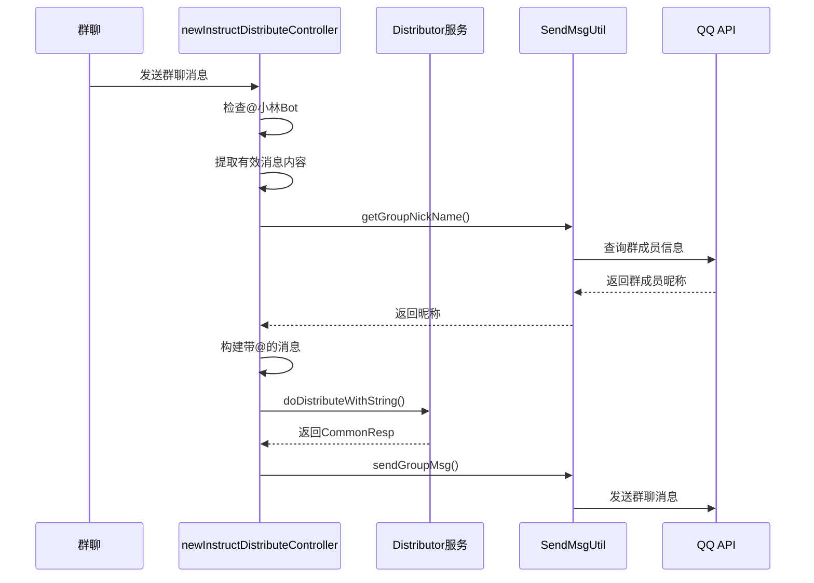
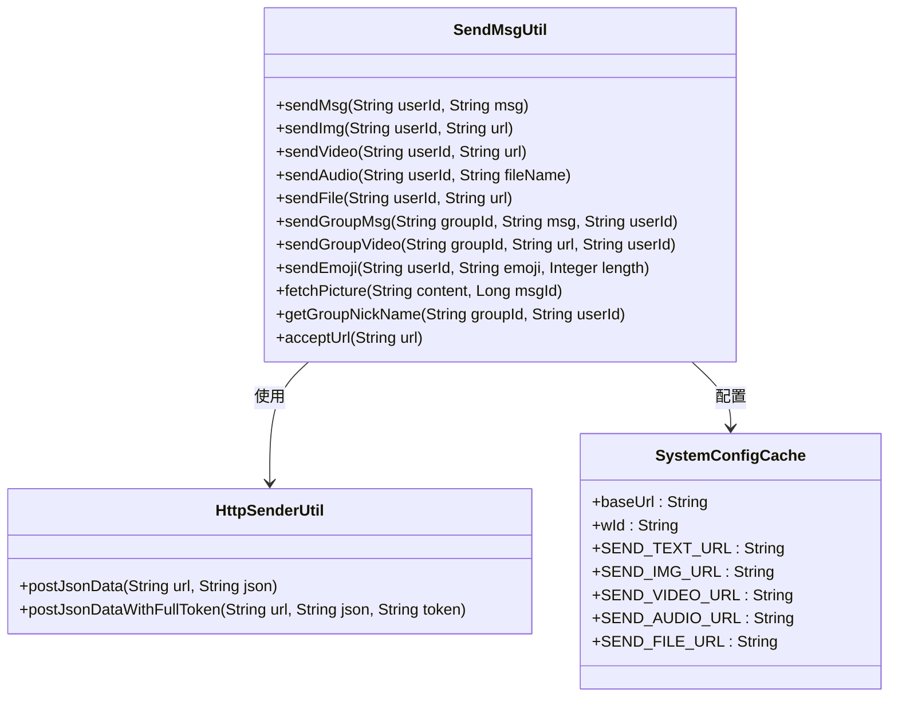
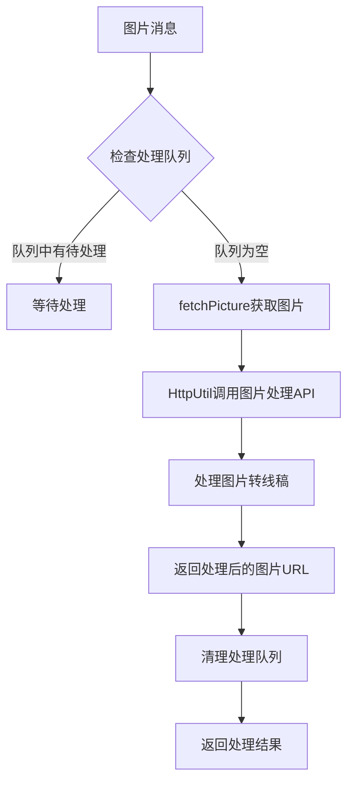
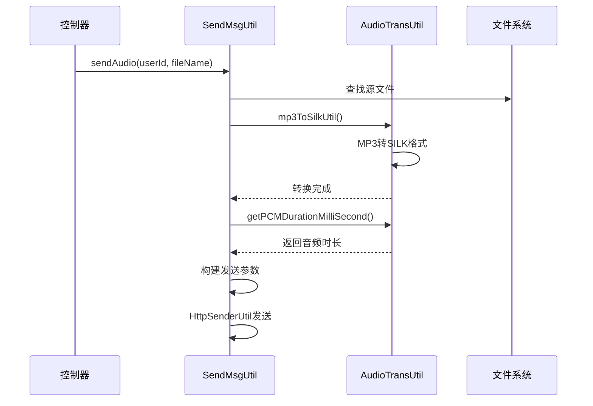
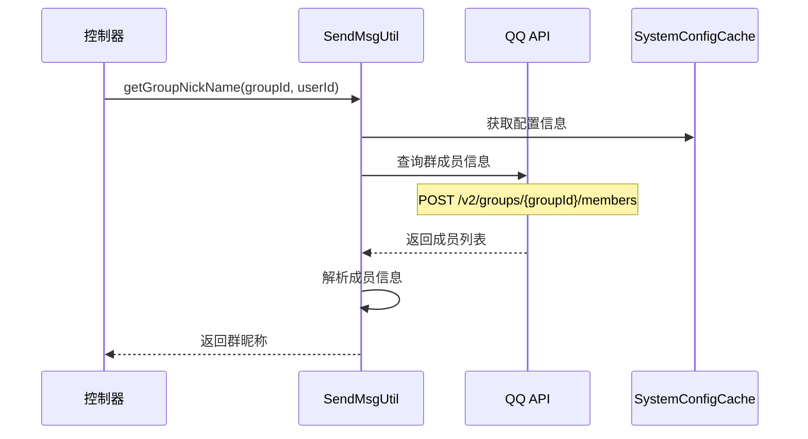
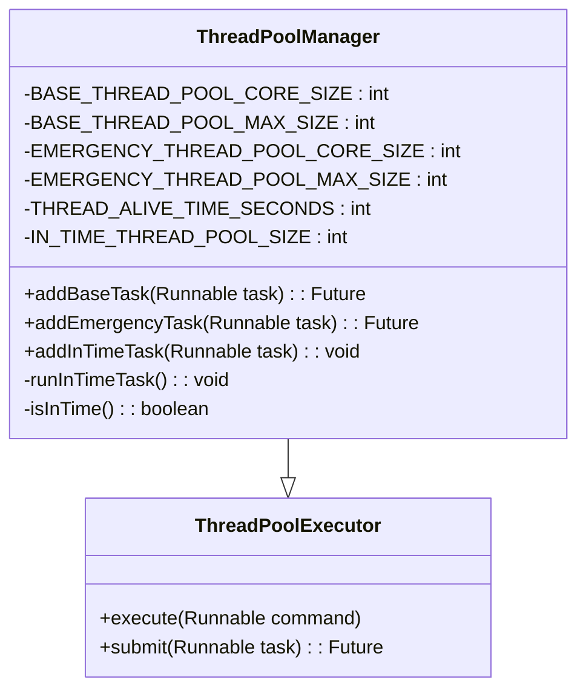
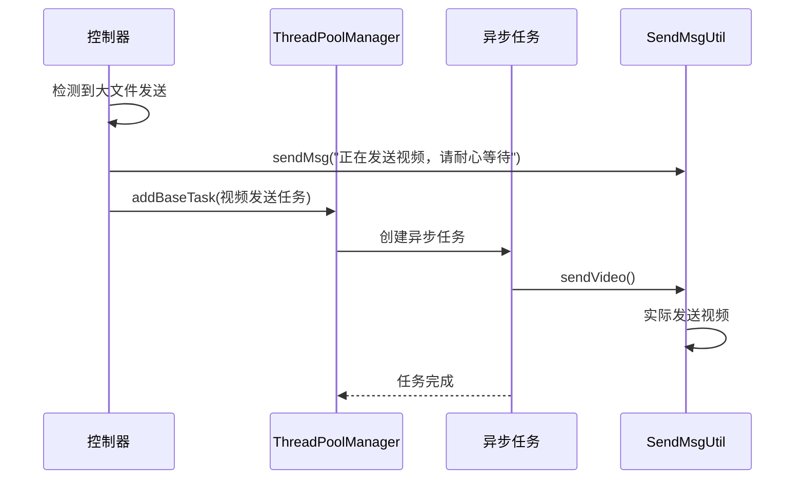
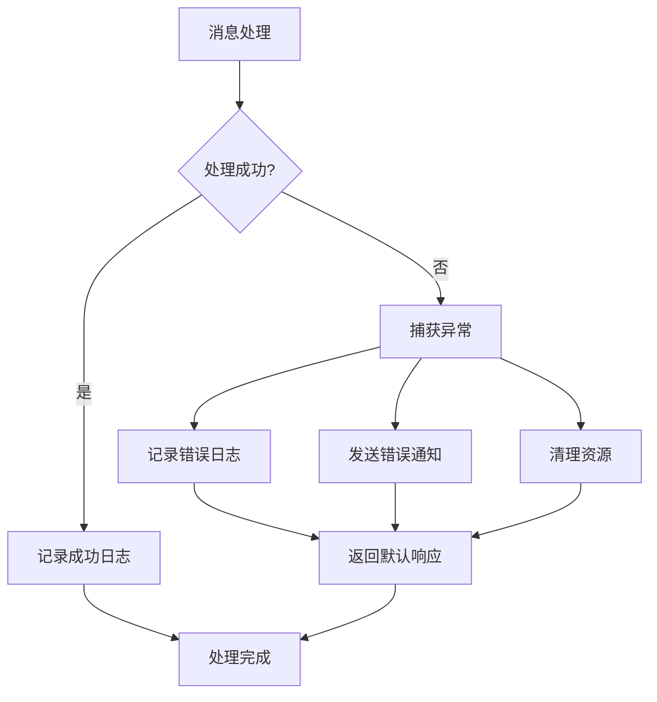

# Bot项目消息处理机制

<cite>
**本文档引用的文件**
- [newInstructDistributeController.java](file://Boot/src/main/java/com/bot/boot/controller/newInstructDistributeController.java)
- [SendMsgUtil.java](file://Common/src/main/java/com/bot/common/util/SendMsgUtil.java)
- [ThreadPoolManager.java](file://Common/src/main/java/com/bot/common/util/ThreadPoolManager.java)
- [QQGroupMessage.java](file://Common/src/main/java/com/bot/common/dto/qqsender/QQGroupMessage.java)
- [Distributor.java](file://Base/src/main/java/com/bot/base/service/Distributor.java)
- [PictureDistributor.java](file://Base/src/main/java/com/bot/base/service/PictureDistributor.java)
- [ENRespType.java](file://Common/src/main/java/com/bot/common/enums/ENRespType.java)
- [ENFileType.java](file://Common/src/main/java/com/bot/common/enums/ENFileType.java)
- [QQDealDistributor.java](file://Base/src/main/java/com/bot/base/service/impl/QQDealDistributor.java)
- [QQSender.java](file://Common/src/main/java/com/bot/common/util/QQSender.java)
- [BaseConsts.java](file://Common/src/main/java/com/bot/common/constant/BaseConsts.java)
</cite>

## 目录
1. [概述](#概述)
2. [消息处理架构](#消息处理架构)
3. [消息类型识别与分发](#消息类型识别与分发)
4. [消息处理流程详解](#消息处理流程详解)
5. [响应发送机制](#响应发送机制)
6. [多媒体消息处理](#多媒体消息处理)
7. [at机制与群聊处理](#at机制与群聊处理)
8. [异步任务处理](#异步任务处理)
9. [扩展开发指南](#扩展开发指南)
10. [性能优化与最佳实践](#性能优化与最佳实践)

## 概述

Bot项目采用模块化设计的消息处理架构，能够高效处理来自不同平台（微信、QQ）的多种类型消息。系统通过`newInstructDistributeController`作为核心控制器，实现了对文本、图片、视频、音频、文件等多种消息类型的智能分发和处理。

### 核心特性
- **多平台支持**：同时处理微信和QQ消息
- **类型化处理**：根据消息类型进行专业化处理
- **异步响应**：大文件传输采用异步处理策略
- **at机制**：群聊场景下的智能@处理
- **线程池管理**：高效的并发任务调度

## 消息处理架构



**图表来源**
- [newInstructDistributeController.java](file://Boot/src/main/java/com/bot/boot/controller/newInstructDistributeController.java#L72-L208)
- [SendMsgUtil.java](file://Common/src/main/java/com/bot/common/util/SendMsgUtil.java#L27-L273)

## 消息类型识别与分发

系统通过`messageType`字段识别不同类型的消息，并采用不同的处理策略：

### 消息类型映射表

| messageType | 消息类型 | 处理方式 |
|------------|---------|---------|
| 60001 | 私聊文本消息 | 直接文本处理 |
| 80001 | 群聊文本消息 | 带@处理的文本处理 |
| 60002 | 私聊图片消息 | 图片处理服务 |
| 80002 | 群聊图片消息 | 群聊图片处理 |
| 60006 | 私聊表情消息 | 表情处理服务 |
| 80006 | 群聊表情消息 | 群聊表情处理 |
| 60022 | 私聊邀请消息 | 自动接受处理 |
| 85008/85009 | 进群欢迎消息 | 欢迎语处理 |

### 消息类型识别逻辑

```mermaid
flowchart TD
A[接收消息] --> B{检查messageType}
B --> |60001| C[私聊文本处理]
B --> |80001| D[群聊文本处理]
B --> |60002| E[私聊图片处理]
B --> |80002| F[群聊图片处理]
B --> |60006| G[私聊表情处理]
B --> |80006| H[群聊表情处理]
B --> |60022| I[邀请处理]
B --> |85008/85009| J[欢迎处理]
B --> |其他| K[忽略消息]
C --> L[文本内容解析]
D --> M[带@的文本解析]
E --> N[图片处理服务]
F --> O[群聊图片处理]
G --> P[表情处理服务]
H --> Q[群聊表情处理]
I --> R[自动接受邀请]
J --> S[发送欢迎语]
```

**节来源**
- [newInstructDistributeController.java](file://Boot/src/main/java/com/bot/boot/controller/newInstructDistributeController.java#L74-L88)

## 消息处理流程详解

### 私聊消息处理流程

私聊消息处理遵循以下步骤：

1. **消息去重检查**：通过`msgIdList`防止重复处理
2. **内容预处理**：移除游戏文件关键词
3. **指令分发**：调用`distributor.doDistributeWithString()`进行指令识别
4. **响应类型判断**：根据返回的响应类型选择发送方式



**图表来源**
- [newInstructDistributeController.java](file://Boot/src/main/java/com/bot/boot/controller/newInstructDistributeController.java#L94-L114)
- [SendMsgUtil.java](file://Common/src/main/java/com/bot/common/util/SendMsgUtil.java#L27-L273)

### 群聊消息处理流程

群聊消息处理增加了@机制和群成员信息获取：



**图表来源**
- [newInstructDistributeController.java](file://Boot/src/main/java/com/bot/boot/controller/newInstructDistributeController.java#L116-L148)

**节来源**
- [newInstructDistributeController.java](file://Boot/src/main/java/com/bot/boot/controller/newInstructDistributeController.java#L116-L148)

## 响应发送机制

### SendMsgUtil工具类架构

SendMsgUtil提供了统一的消息发送接口，支持多种消息类型的发送：



**图表来源**
- [SendMsgUtil.java](file://Common/src/main/java/com/bot/common/util/SendMsgUtil.java#L27-L273)

### 消息发送类型映射

| 响应类型 | 发送方法 | 适用场景 |
|---------|---------|---------|
| 文本消息 | sendMsg() | 普通聊天回复 |
| 图片消息 | sendImg() | 图片生成、分享 |
| 视频消息 | sendVideo() | 视频播放、教程 |
| 语音消息 | sendAudio() | 语音对话、播报 |
| 文件消息 | sendFile() | 文件传输、资源分享 |
| 群聊消息 | sendGroupMsg() | 群聊互动 |
| 群聊视频 | sendGroupVideo() | 群聊视频分享 |
| 表情消息 | sendEmoji() | 表情包发送 |

**节来源**
- [SendMsgUtil.java](file://Common/src/main/java/com/bot/common/util/SendMsgUtil.java#L27-L273)
- [ENRespType.java](file://Common/src/main/java/com/bot/common/enums/ENRespType.java#L10-L14)

## 多媒体消息处理

### 图片处理流程

图片处理采用专门的`PictureDistributor`服务，支持图片转线稿等功能：



**图表来源**
- [PictureDistributor.java](file://Base/src/main/java/com/bot/base/service/PictureDistributor.java#L8-L16)
- [PictureDistributorServiceImpl.java](file://Base/src/main/java/com/bot/base/service/impl/PictureDistributorServiceImpl.java#L30-L46)

### 音频处理机制

音频处理包括格式转换和长度计算：



**图表来源**
- [SendMsgUtil.java](file://Common/src/main/java/com/bot/common/util/SendMsgUtil.java#L63-L83)

**节来源**
- [PictureDistributor.java](file://Base/src/main/java/com/bot/base/service/PictureDistributor.java#L8-L16)
- [PictureDistributorServiceImpl.java](file://Base/src/main/java/com/bot/base/service/impl/PictureDistributorServiceImpl.java#L30-L46)

## at机制与群聊处理

### @机制实现

系统通过检测消息中的"@小林Bot"关键字实现智能@处理：

```mermaid
flowchart TD
A[接收群聊消息] --> B{包含@小林Bot?}
B --> |是| C[提取有效消息内容]
B --> |否| D[直接处理消息]
C --> E[移除@小林Bot标识]
E --> F[获取发送者群昵称]
F --> G[构建带@的消息格式]
G --> H[调用指令处理器]
D --> H
H --> I[生成响应消息]
```

**图表来源**
- [newInstructDistributeController.java](file://Boot/src/main/java/com/bot/boot/controller/newInstructDistributeController.java#L124-L134)

### 群成员信息获取

系统通过QQ API获取群成员信息，支持@功能和个性化回复：



**图表来源**
- [SendMsgUtil.java](file://Common/src/main/java/com/bot/common/util/SendMsgUtil.java#L247-L269)

**节来源**
- [newInstructDistributeController.java](file://Boot/src/main/java/com/bot/boot/controller/newInstructDistributeController.java#L124-L134)
- [SendMsgUtil.java](file://Common/src/main/java/com/bot/common/util/SendMsgUtil.java#L247-L269)

## 异步任务处理

### ThreadPoolManager架构

系统采用自定义线程池管理器处理耗时任务：



**图表来源**
- [ThreadPoolManager.java](file://Common/src/main/java/com/bot/common/util/ThreadPoolManager.java#L13-L123)

### 异步任务处理策略

系统针对不同类型的耗时任务采用不同的处理策略：

| 任务类型 | 线程池 | 处理策略 | 示例 |
|---------|-------|---------|------|
| 基础任务 | BASE_THREAD_POOL | 标准处理 | 视频发送 |
| 紧急任务 | EMERGENCY_THREAD_POOL | 高优先级处理 | 关键业务处理 |
| 定时任务 | IN_TIME_THREAD_POOL | 定时调度 | 系统监控 |



**图表来源**
- [ThreadPoolManager.java](file://Common/src/main/java/com/bot/common/util/ThreadPoolManager.java#L73-L83)
- [newInstructDistributeController.java](file://Boot/src/main/java/com/bot/boot/controller/newInstructDistributeController.java#L105-L107)

**节来源**
- [ThreadPoolManager.java](file://Common/src/main/java/com/bot/common/util/ThreadPoolManager.java#L13-L123)
- [newInstructDistributeController.java](file://Boot/src/main/java/com/bot/boot/controller/newInstructDistributeController.java#L105-L107)

## 扩展开发指南

### 自定义消息类型处理

开发者可以通过以下步骤扩展新的消息类型处理：

1. **定义消息类型枚举**
```java
// 在ENRespType中添加新类型
public enum ENRespType {
    TEXT("0", "文本"),
    IMG("1", "图片"),
    VIDEO("2", "视频"),
    FILE("3", "文件"),
    AUDIO("4", "语音"),
    CUSTOM("5", "自定义")  // 新增类型
}
```

2. **实现处理服务**
```java
@Service
public class CustomDistributor implements Distributor {
    @Override
    public CommonResp doDistributeWithString(String reqContent, String token, String groupId, 
                                           boolean at, boolean mustRespFlag, String channel, String withoutPexContent) {
        // 实现自定义处理逻辑
        return new CommonResp("自定义响应", ENRespType.CUSTOM.getType());
    }
}
```

3. **在控制器中注册**
```java
@Resource
private CustomDistributor customDistributor;

@PostMapping("/chatListener")
public void weChatDeal(@RequestBody JSONObject message) {
    // 在适当位置添加自定义消息类型处理
    if ("CUSTOM_TYPE".equals(messageType)) {
        CommonResp resp = customDistributor.doDistributeWithString(...);
        // 处理响应
    }
}
```

### 自定义响应发送方法

扩展SendMsgUtil以支持新的消息类型：

```java
public class SendMsgUtil {
    // 添加新的发送方法
    public static void sendCustom(String userId, String content) {
        try {
            // 实现自定义发送逻辑
            SendMsgDTO sendMsg = new SendMsgDTO();
            sendMsg.setContent(content);
            sendMsg.setWcId(userId);
            sendMsg.setWId(SystemConfigCache.wId);
            HttpSenderUtil.postJsonData(SystemConfigCache.baseUrl + "/custom-endpoint", 
                                       JSONUtil.toJsonStr(sendMsg));
        } catch (Exception e) {
            log.error("发送自定义消息失败", e);
        }
    }
}
```

## 性能优化与最佳实践

### 消息去重机制

系统通过`msgIdList`实现消息去重，防止重复处理：

```java
// 在消息处理开始处检查
if (msgIdList.contains(msgId)) {
    return; // 已处理过的消息直接返回
}
msgIdList.add(msgId); // 记录消息ID
```

### 并发控制策略

1. **线程池合理配置**
   - 基础线程池：10-50核心线程
   - 紧急线程池：3-10核心线程  
   - 定时任务线程池：1核心线程

2. **内存管理**
   - 及时清理临时缓存
   - 合理设置线程存活时间
   - 监控内存使用情况

3. **网络优化**
   - 使用连接池复用HTTP连接
   - 设置合理的超时时间
   - 实现重试机制

### 错误处理与监控



### 最佳实践建议

1. **消息处理优先级**
   - 文本消息 > 图片消息 > 视频消息 > 文件消息
   - 紧急消息使用紧急线程池

2. **资源管理**
   - 及时释放图片、音频等临时文件
   - 监控线程池状态
   - 设置合理的队列大小

3. **用户体验**
   - 对于大文件发送，先发送确认消息
   - 提供进度反馈
   - 设置合理的超时时间

**节来源**
- [newInstructDistributeController.java](file://Boot/src/main/java/com/bot/boot/controller/newInstructDistributeController.java#L70-L93)
- [ThreadPoolManager.java](file://Common/src/main/java/com/bot/common/util/ThreadPoolManager.java#L18-L42)