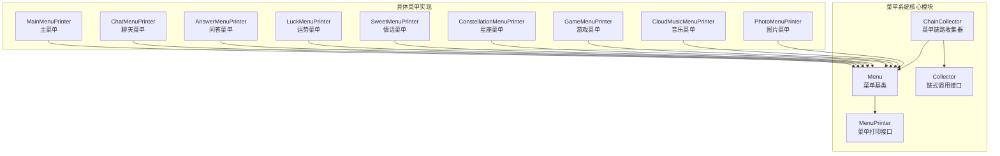
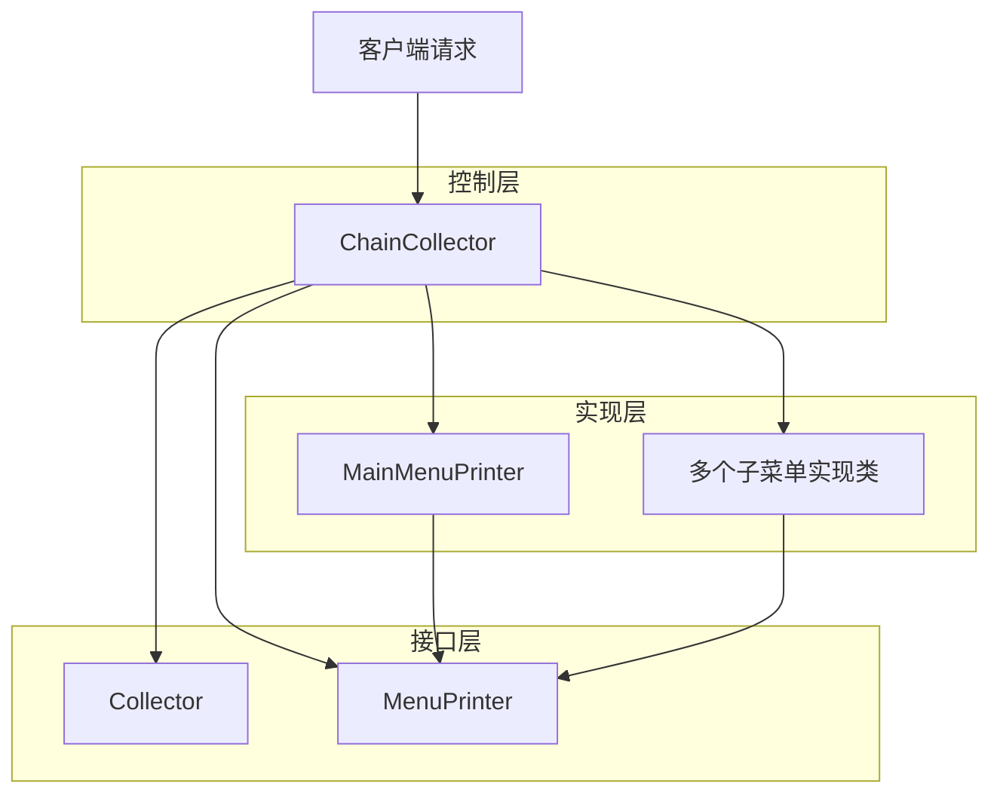
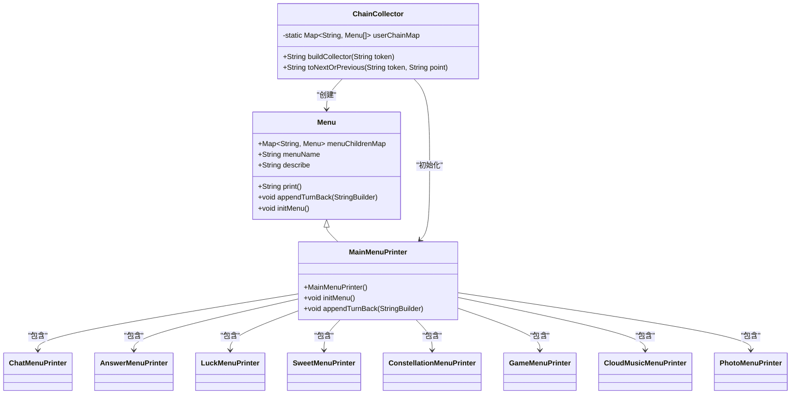
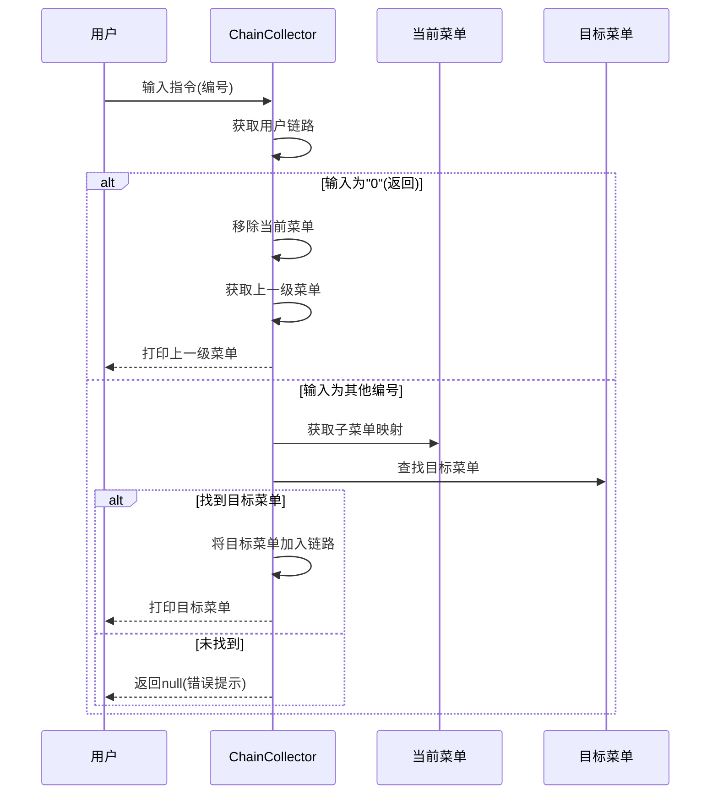
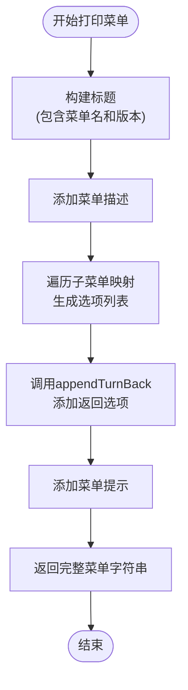
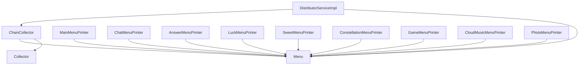

# 菜单系统

<cite>
**本文档中引用的文件**  
- [MainMenuPrinter.java](file://Base/src/main/java/com/bot/base/chain/menu/MainMenuPrinter.java)
- [ChainCollector.java](file://Base/src/main/java/com/bot/base/chain/ChainCollector.java)
- [Menu.java](file://Base/src/main/java/com/bot/base/chain/Menu.java)
- [MenuPrinter.java](file://Base/src/main/java/com/bot/base/chain/MenuPrinter.java)
- [Collector.java](file://Base/src/main/java/com/bot/base/chain/Collector.java)
- [DistributorServiceImpl.java](file://Base/src/main/java/com/bot/base/service/impl/DistributorServiceImpl.java)
- [BaseConsts.java](file://Common/src/main/java/com/bot/common/constant/BaseConsts.java)
- [ChatMenuPrinter.java](file://Base/src/main/java/com/bot/base/chain/menu/ChatMenuPrinter.java)
- [AnswerMenuPrinter.java](file://Base/src/main/java/com/bot/base/chain/menu/AnswerMenuPrinter.java)
- [LuckMenuPrinter.java](file://Base/src/main/java/com/bot/base/chain/menu/LuckMenuPrinter.java)
- [SweetMenuPrinter.java](file://Base/src/main/java/com/bot/base/chain/menu/SweetMenuPrinter.java)
- [ConstellationMenuPrinter.java](file://Base/src/main/java/com/bot/base/chain/menu/ConstellationMenuPrinter.java)
- [GameMenuPrinter.java](file://Base/src/main/java/com/bot/base/chain/menu/GameMenuPrinter.java)
- [CloudMusicMenuPrinter.java](file://Base/src/main/java/com/bot/base/chain/menu/CloudMusicMenuPrinter.java)
- [PhotoMenuPrinter.java](file://Base/src/main/java/com/bot/base/chain/menu/PhotoMenuPrinter.java)
</cite>

## 目录
1. [简介](#简介)
2. [项目结构](#项目结构)
3. [核心组件](#核心组件)
4. [架构概述](#架构概述)
5. [详细组件分析](#详细组件分析)
6. [依赖分析](#依赖分析)
7. [性能考虑](#性能考虑)
8. [故障排除指南](#故障排除指南)
9. [结论](#结论)

## 简介
本文档深入解析基于`ChainCollector`实现的菜单链式导航系统，说明`MenuPrinter`接口的设计原理及其在不同功能模块中的具体实现。描述用户会话状态如何通过`userChainMap`进行维护，以及菜单层级跳转（前进/返回）的技术实现细节。结合`MainMenuPrinter`等具体实现类，展示菜单初始化、内容打印和子菜单调用的完整流程。提供自定义菜单的开发指南，包括如何注册新菜单、定义菜单层级关系和处理用户输入指令。

## 项目结构
该菜单系统位于`Base`模块的`com.bot.base.chain`包下，采用链式调用与状态管理相结合的设计模式。系统通过`ChainCollector`统一管理用户菜单导航路径，利用Spring的依赖注入机制自动加载所有实现了`Menu`基类的菜单执行者。

**图源**
- [ChainCollector.java](file://Base/src/main/java/com/bot/base/chain/ChainCollector.java)
- [Menu.java](file://Base/src/main/java/com/bot/base/chain/Menu.java)
- [MenuPrinter.java](file://Base/src/main/java/com/bot/base/chain/MenuPrinter.java)

**本节来源**
- [Base/src/main/java/com/bot/base/chain](file://Base/src/main/java/com/bot/base/chain)

## 核心组件

系统的核心组件包括`ChainCollector`、`Menu`基类、`MenuPrinter`接口以及具体的菜单实现类。`ChainCollector`负责构建和维护用户的菜单导航链路，`Menu`类作为所有菜单的基类提供了统一的打印和导航功能，而各个具体的`MenuPrinter`实现类则负责定义各自的菜单名称、描述和子菜单结构。

**本节来源**
- [ChainCollector.java](file://Base/src/main/java/com/bot/base/chain/ChainCollector.java)
- [Menu.java](file://Base/src/main/java/com/bot/base/chain/Menu.java)
- [MenuPrinter.java](file://Base/src/main/java/com/bot/base/chain/MenuPrinter.java)

## 架构概述

该菜单系统采用责任链与状态模式相结合的设计，通过`ChainCollector`集中管理用户会话状态，实现菜单的链式导航。系统架构分为三层：接口层（`Collector`和`MenuPrinter`）、控制层（`ChainCollector`）、实现层（各类`MenuPrinter`）。

**图源**
- [Collector.java](file://Base/src/main/java/com/bot/base/chain/Collector.java)
- [ChainCollector.java](file://Base/src/main/java/com/bot/base/chain/ChainCollector.java)
- [MenuPrinter.java](file://Base/src/main/java/com/bot/base/chain/MenuPrinter.java)

## 详细组件分析

### 主菜单分析

`MainMenuPrinter`作为系统的入口菜单，负责初始化主菜单结构并注册所有一级子菜单。其通过`initMenu`方法将各个子菜单按编号映射到`menuChildrenMap`中，形成菜单树的根节点。

**图源**
- [MainMenuPrinter.java](file://Base/src/main/java/com/bot/base/chain/menu/MainMenuPrinter.java)
- [Menu.java](file://Base/src/main/java/com/bot/base/chain/Menu.java)
- [ChainCollector.java](file://Base/src/main/java/com/bot/base/chain/ChainCollector.java)

### 菜单导航流程分析

系统通过`ChainCollector`的`toNextOrPrevious`方法实现菜单的前进与返回。当用户输入"0"时，系统从链路中移除当前菜单并返回上一级；当输入其他编号时，系统查找对应子菜单并添加到链路中。

**图源**
- [ChainCollector.java](file://Base/src/main/java/com/bot/base/chain/ChainCollector.java)
- [Menu.java](file://Base/src/main/java/com/bot/base/chain/Menu.java)

### 菜单打印机制分析

`Menu`基类的`print`方法通过`printMenuMap`实现统一的菜单输出格式，包括菜单标题、版本信息、描述、子菜单选项列表和返回选项。`appendTurnBack`方法可被子类重写以自定义返回行为。

**图源**
- [Menu.java](file://Base/src/main/java/com/bot/base/chain/Menu.java)

**本节来源**
- [MainMenuPrinter.java](file://Base/src/main/java/com/bot/base/chain/menu/MainMenuPrinter.java)
- [ChainCollector.java](file://Base/src/main/java/com/bot/base/chain/ChainCollector.java)
- [Menu.java](file://Base/src/main/java/com/bot/base/chain/Menu.java)

## 依赖分析

系统依赖关系清晰，`ChainCollector`依赖`Menu`和`Collector`接口，所有具体菜单实现类依赖`Menu`基类。通过Spring的组件扫描和自动装配机制，系统能够自动发现和注入所有菜单实现。

**图源**
- [pom.xml](file://Base/pom.xml)
- [DistributorServiceImpl.java](file://Base/src/main/java/com/bot/base/service/impl/DistributorServiceImpl.java)

**本节来源**
- [ChainCollector.java](file://Base/src/main/java/com/bot/base/chain/ChainCollector.java)
- [Menu.java](file://Base/src/main/java/com/bot/base/chain/Menu.java)

## 性能考虑

系统在性能方面有以下特点：
- 使用静态`userChainMap`存储用户会话状态，避免重复创建菜单实例
- 采用Spring单例模式管理菜单组件，减少对象创建开销
- 菜单链路使用`ArrayList`存储，保证O(1)的随机访问性能
- 菜单映射使用`HashMap`，保证O(1)的查找性能

[本节不涉及具体文件来源]

## 故障排除指南

常见问题及解决方案：
- **菜单无法显示**：检查`DistributorServiceImpl`中的指令分发逻辑，确保`toNextOrPrevious`调用正确
- **子菜单无法跳转**：验证`initMenu`方法中`menuChildrenMap`的键值对是否正确注册
- **返回功能失效**：确认`userChainMap`中用户的菜单链路是否正确维护
- **菜单显示乱码**：检查`printMenuMap`中的字符串拼接和编码设置

**本节来源**
- [ChainCollector.java](file://Base/src/main/java/com/bot/base/chain/ChainCollector.java)
- [DistributorServiceImpl.java](file://Base/src/main/java/com/bot/base/service/impl/DistributorServiceImpl.java)

## 结论

基于`ChainCollector`实现的菜单链式导航系统具有结构清晰、扩展性强、维护方便的特点。通过统一的`Menu`基类和`ChainCollector`控制器，系统实现了菜单的动态构建和状态管理。开发者可以通过继承`Menu`类并实现`initMenu`方法轻松添加新的菜单功能，系统会自动将其集成到导航链路中。该设计模式适用于需要复杂菜单导航的机器人系统，具有良好的可维护性和扩展性。

[本节不涉及具体文件来源]