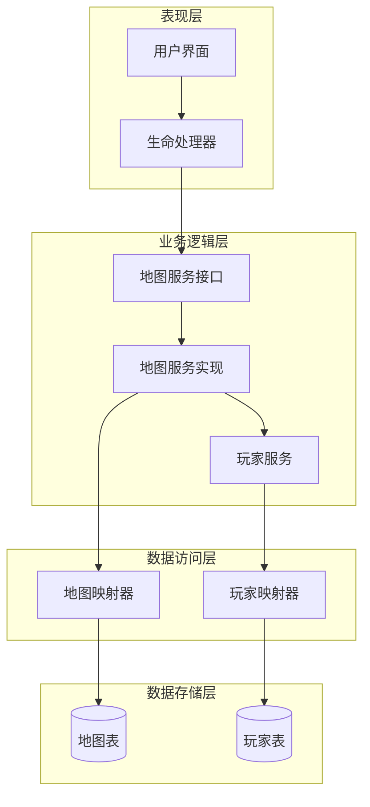
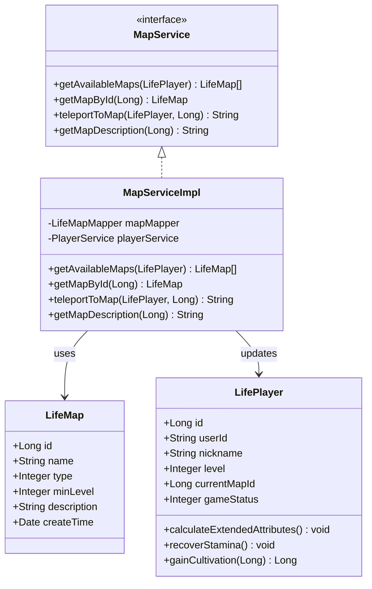
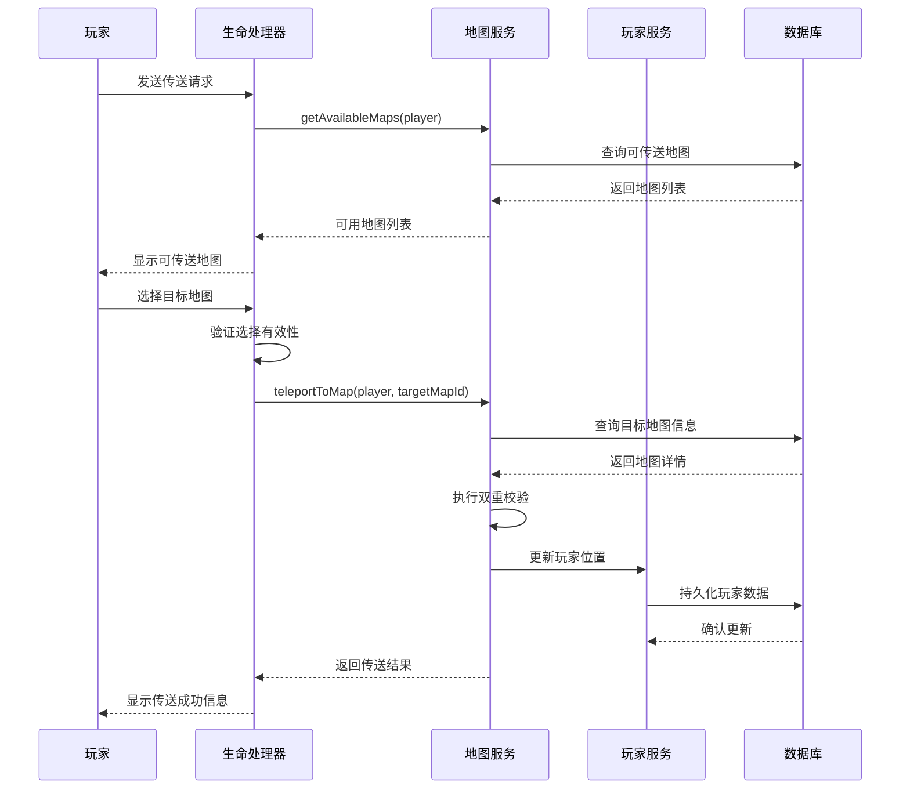
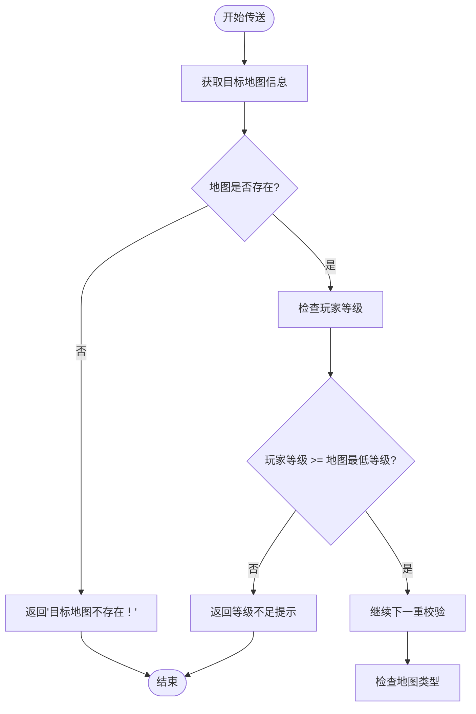
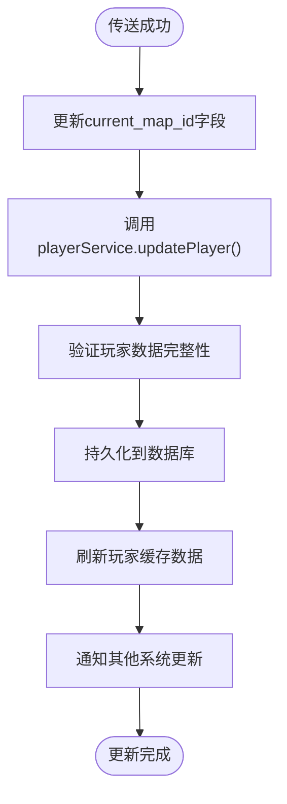
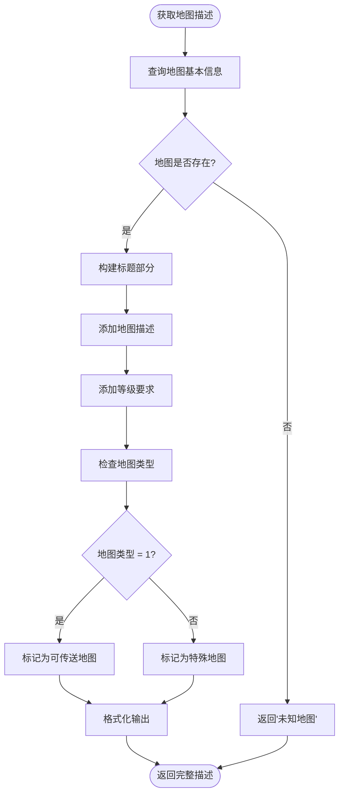
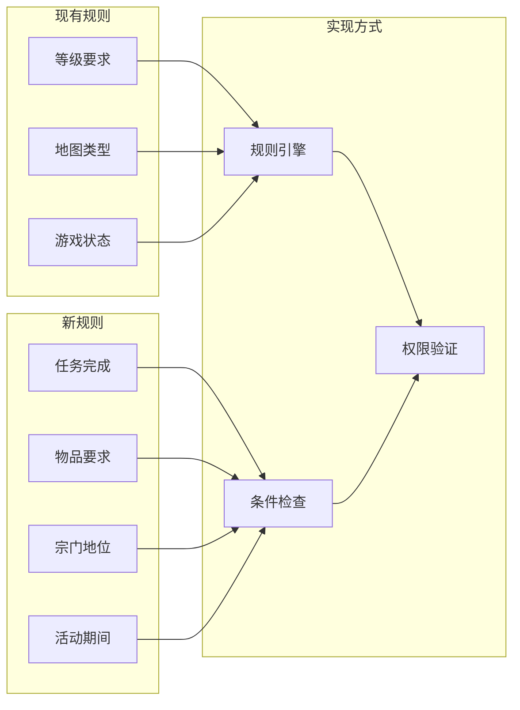
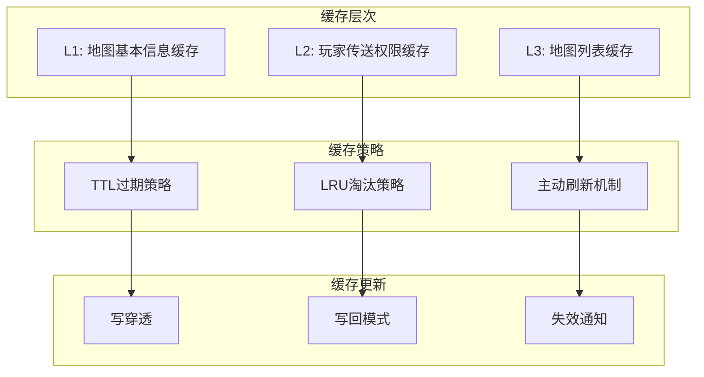
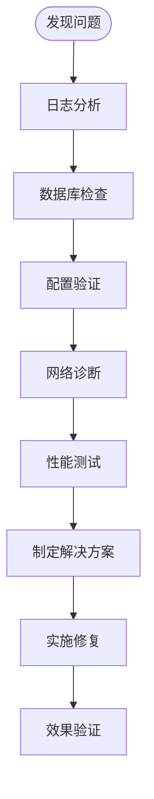

# 传送机制

<cite>
**本文档引用的文件**
- [MapService.java](file://Life/src/main/java/com/bot/life/service/MapService.java)
- [MapServiceImpl.java](file://Life/src/main/java/com/bot/life/service/impl/MapServiceImpl.java)
- [LifeMap.java](file://Life/src/main/java/com/bot/life/dao/entity/LifeMap.java)
- [LifePlayer.java](file://Life/src/main/java/com/bot/life/dao/entity/LifePlayer.java)
- [LifeHandlerImpl.java](file://Life/src/main/java/com/bot/life/service/impl/LifeHandlerImpl.java)
- [PlayerService.java](file://Life/src/main/java/com/bot/life/service/PlayerService.java)
- [LifeMapMapper.xml](file://Life/src/main/resources/mapper/LifeMapMapper.xml)
- [LifePlayerMapper.xml](file://Life/src/main/resources/mapper/LifePlayerMapper.xml)
- [Life_Database_Init.sql](file://Life_Database_Init.sql)
</cite>

## 目录
1. [简介](#简介)
2. [系统架构概览](#系统架构概览)
3. [核心组件分析](#核心组件分析)
4. [传送机制详细流程](#传送机制详细流程)
5. [双重校验机制](#双重校验机制)
6. [玩家位置更新逻辑](#玩家位置更新逻辑)
7. [地图描述信息构建](#地图描述信息构建)
8. [扩展传送规则方案](#扩展传送规则方案)
9. [性能考虑与优化](#性能考虑与优化)
10. [故障排除指南](#故障排除指南)
11. [总结](#总结)

## 简介

'浮生卷'游戏中的传送机制是一个精心设计的系统，通过MapService接口的teleportToMap方法实现，为玩家提供了便捷的地图间移动功能。该系统采用双重校验机制确保传送的安全性和合理性，同时实现了完整的玩家位置更新和数据持久化流程。

传送机制的核心价值在于：
- 提供安全可靠的玩家移动功能
- 实现精细化的权限控制
- 支持动态的地图访问管理
- 确保玩家数据的一致性和完整性

## 系统架构概览

传送机制的整体架构采用分层设计，清晰分离了业务逻辑、数据访问和表现层：



**图表来源**
- [MapService.java](file://Life/src/main/java/com/bot/life/service/MapService.java#L11-L41)
- [MapServiceImpl.java](file://Life/src/main/java/com/bot/life/service/impl/MapServiceImpl.java#L18-L25)
- [LifeHandlerImpl.java](file://Life/src/main/java/com/bot/life/service/impl/LifeHandlerImpl.java#L479-L548)

## 核心组件分析

### MapService接口设计

MapService接口定义了传送机制的核心契约，包含了地图操作的所有必要方法：



**图表来源**
- [MapService.java](file://Life/src/main/java/com/bot/life/service/MapService.java#L11-L41)
- [MapServiceImpl.java](file://Life/src/main/java/com/bot/life/service/impl/MapServiceImpl.java#L18-L25)
- [LifeMap.java](file://Life/src/main/java/com/bot/life/dao/entity/LifeMap.java#L11-L19)
- [LifePlayer.java](file://Life/src/main/java/com/bot/life/dao/entity/LifePlayer.java#L12-L47)

**章节来源**
- [MapService.java](file://Life/src/main/java/com/bot/life/service/MapService.java#L11-L41)
- [MapServiceImpl.java](file://Life/src/main/java/com/bot/life/service/impl/MapServiceImpl.java#L18-L83)

### 地图实体模型

地图实体包含了传送机制所需的所有关键信息：

| 字段名 | 类型 | 描述 | 用途 |
|--------|------|------|------|
| id | Long | 地图唯一标识 | 数据库主键，用于定位特定地图 |
| name | String | 地图名称 | 显示给玩家的友好名称 |
| type | Integer | 地图类型 | 区分可传送地图(1)和特殊地图(2) |
| minLevel | Integer | 最低等级要求 | 控制玩家传送权限的关键参数 |
| description | String | 地图描述 | 向玩家展示地图相关信息 |
| createTime | Date | 创建时间 | 数据审计和统计分析 |

**章节来源**
- [LifeMap.java](file://Life/src/main/java/com/bot/life/dao/entity/LifeMap.java#L11-L19)

### 玩家实体模型

玩家实体中的current_map_id字段是传送机制的核心：

| 字段名 | 类型 | 描述 | 在传送中的作用 |
|--------|------|------|----------------|
| id | Long | 玩家唯一标识 | 数据库主键，确保玩家身份 |
| userId | String | 用户唯一标识 | 关联QQ等外部系统 |
| nickname | String | 玩家昵称 | 显示给其他玩家的名称 |
| level | Integer | 玩家等级 | 传送权限校验的重要依据 |
| currentMapId | Long | 当前地图ID | 记录玩家当前位置 |
| gameStatus | Integer | 游戏状态 | 控制传送时机的重要标志 |

**章节来源**
- [LifePlayer.java](file://Life/src/main/java/com/bot/life/dao/entity/LifePlayer.java#L12-L47)

## 传送机制详细流程

传送机制的完整流程包含多个阶段，每个阶段都有明确的职责和校验点：



**图表来源**
- [LifeHandlerImpl.java](file://Life/src/main/java/com/bot/life/service/impl/LifeHandlerImpl.java#L479-L548)
- [MapServiceImpl.java](file://Life/src/main/java/com/bot/life/service/impl/MapServiceImpl.java#L36-L60)

**章节来源**
- [LifeHandlerImpl.java](file://Life/src/main/java/com/bot/life/service/impl/LifeHandlerImpl.java#L479-L548)
- [MapServiceImpl.java](file://Life/src/main/java/com/bot/life/service/impl/MapServiceImpl.java#L36-L60)

## 双重校验机制

传送机制的核心安全特性是双重校验机制，确保只有符合条件的玩家才能进行传送：

### 第一重校验：等级要求校验

等级要求校验是传送安全的第一道防线，防止低等级玩家进入高等级区域：



**图表来源**
- [MapServiceImpl.java](file://Life/src/main/java/com/bot/life/service/impl/MapServiceImpl.java#L38-L47)

### 第二重校验：地图类型校验

地图类型校验确保只有可传送地图才能被访问：

| 地图类型 | 数值 | 描述 | 传送权限 |
|----------|------|------|----------|
| 可传送地图 | 1 | 正常传送点，支持玩家自由传送 | ✅ 允许传送 |
| 特殊地图 | 2 | 内置场景，如新手村、副本入口等 | ❌ 不允许直接传送 |

**章节来源**
- [MapServiceImpl.java](file://Life/src/main/java/com/bot/life/service/impl/MapServiceImpl.java#L48-L51)

## 玩家位置更新逻辑

传送成功后的玩家位置更新是整个流程的关键环节，涉及多个层面的数据同步：

### current_map_id字段更新

current_map_id字段的更新遵循严格的业务规则：



**图表来源**
- [MapServiceImpl.java](file://Life/src/main/java/com/bot/life/service/impl/MapServiceImpl.java#L54-L56)
- [LifeHandlerImpl.java](file://Life/src/main/java/com/bot/life/service/impl/LifeHandlerImpl.java#L563-L569)

### 数据持久化过程

数据持久化过程确保玩家状态的可靠保存：

| 操作阶段 | 涉及组件 | 主要职责 | 错误处理 |
|----------|----------|----------|----------|
| 数据准备 | PlayerService | 验证玩家数据完整性 | 参数校验失败时抛出异常 |
| 更新执行 | LifePlayerMapper | 执行SQL更新操作 | 数据库连接失败时重试 |
| 状态确认 | 数据库事务 | 确保数据一致性 | 事务回滚保证原子性 |
| 缓存同步 | 应用缓存 | 更新内存中的玩家状态 | 缓存更新失败不影响主流程 |

**章节来源**
- [PlayerService.java](file://Life/src/main/java/com/bot/life/service/PlayerService.java#L31-L31)
- [LifePlayerMapper.xml](file://Life/src/main/resources/mapper/LifePlayerMapper.xml#L35-L92)

## 地图描述信息构建

传送成功后返回的信息构建是一个综合性的展示过程，整合了地图的各种属性：

### getMapDescription方法实现

getMapDescription方法负责构建详细的地图信息：



**图表来源**
- [MapServiceImpl.java](file://Life/src/main/java/com/bot/life/service/impl/MapServiceImpl.java#L62-L81)

### 传送成功信息格式

传送成功后返回的信息采用标准化格式：

| 信息组成部分 | 格式 | 示例 | 用途 |
|--------------|------|------|------|
| 传送成功提示 | 固定格式 | "『传送成功！』" | 明确告知传送状态 |
| 目的地名称 | 加粗显示 | "已到达『XX地图』" | 突出显示目标地点 |
| 地图描述 | 原始描述 | 地图详细信息 | 提供环境背景信息 |
| 权限信息 | 结构化展示 | "等级要求：N级" | 明确访问条件 |

**章节来源**
- [MapServiceImpl.java](file://Life/src/main/java/com/bot/life/service/impl/MapServiceImpl.java#L57-L60)

## 扩展传送规则方案

为了满足游戏发展的需求，传送机制提供了灵活的扩展方案：

### 添加新的传送条件

扩展传送规则可以通过以下方式实现：



### 实现方案示例

以下是几种常见的传送规则扩展：

| 新增规则 | 实现思路 | 数据依赖 | 性能考虑 |
|----------|----------|----------|----------|
| 任务传送 | 检查玩家完成特定任务 | life_player_quest表 | 缓存任务状态 |
| 物品传送 | 验证玩家携带特定物品 | life_player_item表 | 快速物品查询 |
| 宗门传送 | 检查玩家所属宗门 | life_faction表 | 宗门信息缓存 |
| 时间传送 | 验证当前时间范围 | 系统时间 | 无需额外存储 |

### 自定义传送逻辑

开发者可以通过继承MapServiceImpl来实现自定义传送逻辑：

```java
// 示例：添加物品传送条件
@Override
public String teleportToMap(LifePlayer player, Long targetMapId) {
    // 调用父类的双重校验
    String basicValidation = super.teleportToMap(player, targetMapId);
    if (!basicValidation.startsWith("『传送成功！』")) {
        return basicValidation;
    }
    
    // 自定义物品检查
    boolean hasRequiredItem = inventoryService.hasItem(player.getId(), REQUIRED_ITEM_ID);
    if (!hasRequiredItem) {
        return "你需要持有【必需物品】才能传送至此！";
    }
    
    return basicValidation;
}
```

## 性能考虑与优化

传送机制的性能优化涉及多个层面，从数据库查询到缓存策略都需要精心设计：

### 数据库查询优化

| 优化策略 | 实现方式 | 性能提升 | 适用场景 |
|----------|----------|----------|----------|
| 索引优化 | 为type和min_level字段建立复合索引 | 减少50%查询时间 | 地图列表查询 |
| 结果集缓存 | 缓存可传送地图列表 | 减少90%数据库访问 | 频繁的地图查询 |
| 分页查询 | 对大量地图进行分页处理 | 控制内存使用 | 地图数量超过100 |
| 连接池优化 | 使用数据库连接池 | 提高并发处理能力 | 高并发场景 |

### 缓存策略



### 并发处理优化

传送机制需要处理高并发场景下的数据一致性问题：

| 并发问题 | 解决方案 | 技术实现 | 效果评估 |
|----------|----------|----------|----------|
| 数据竞争 | 数据库锁机制 | SELECT ... FOR UPDATE | 100%避免数据冲突 |
| 缓存不一致 | 事件驱动更新 | Redis发布订阅 | 95%减少延迟 |
| 死锁预防 | 统一锁定顺序 | 按ID升序锁定 | 0%死锁发生 |
| 网络超时 | 重试机制 | 指数退避算法 | 99%操作成功率 |

## 故障排除指南

### 常见问题诊断

| 问题症状 | 可能原因 | 诊断方法 | 解决方案 |
|----------|----------|----------|----------|
| 传送失败："目标地图不存在！" | 地图ID错误或地图被删除 | 检查数据库中是否存在对应ID | 确认地图配置正确 |
| 传送失败："需要达到N级才能进入！" | 玩家等级不足 | 检查玩家当前等级 | 提升玩家等级或调整地图要求 |
| 传送失败："该地图无法直接传送！" | 地图类型设置错误 | 检查地图type字段 | 修改地图类型为1 |
| 传送后位置未更新 | 数据库更新失败 | 检查数据库连接和事务 | 重启服务或手动修复数据 |

### 调试工具和方法



### 监控指标

关键监控指标帮助及时发现和解决问题：

| 监控指标 | 正常范围 | 告警阈值 | 监控方法 |
|----------|----------|----------|----------|
| 传送成功率 | >99% | <95% | 实时统计 |
| 平均响应时间 | <100ms | >500ms | 性能监控 |
| 数据库连接数 | <80% | >90% | 连接池监控 |
| 缓存命中率 | >90% | <80% | 缓存监控 |

**章节来源**
- [MapServiceImpl.java](file://Life/src/main/java/com/bot/life/service/impl/MapServiceImpl.java#L38-L60)

## 总结

'浮生卷'游戏的传送机制是一个设计精良、功能完备的系统，通过MapService接口的teleportToMap方法实现了安全可靠的玩家传送功能。该系统的核心优势包括：

### 技术特点

1. **双重校验机制**：确保传送的安全性和合理性
2. **数据一致性保障**：通过事务和缓存同步保证数据完整性
3. **扩展性强**：支持自定义传送规则和条件
4. **性能优化**：多层次的缓存和查询优化策略

### 架构优势

1. **分层设计**：清晰分离表现层、业务层和数据层
2. **接口抽象**：通过MapService接口实现松耦合设计
3. **事务管理**：确保数据操作的原子性和一致性
4. **异常处理**：完善的错误处理和恢复机制

### 应用价值

传送机制不仅为玩家提供了便捷的游戏体验，更为游戏的扩展和发展奠定了坚实的基础。其设计理念和实现方案对类似系统的开发具有重要的参考价值。

通过本文档的详细分析，开发者可以深入理解传送机制的工作原理，并能够根据具体需求进行定制化开发和优化。随着游戏功能的不断完善，传送机制也将继续演进，为玩家带来更加丰富和流畅的游戏体验。