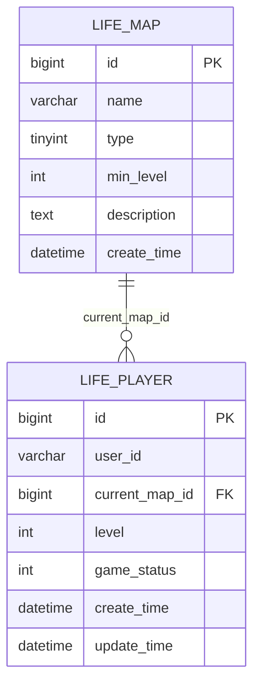
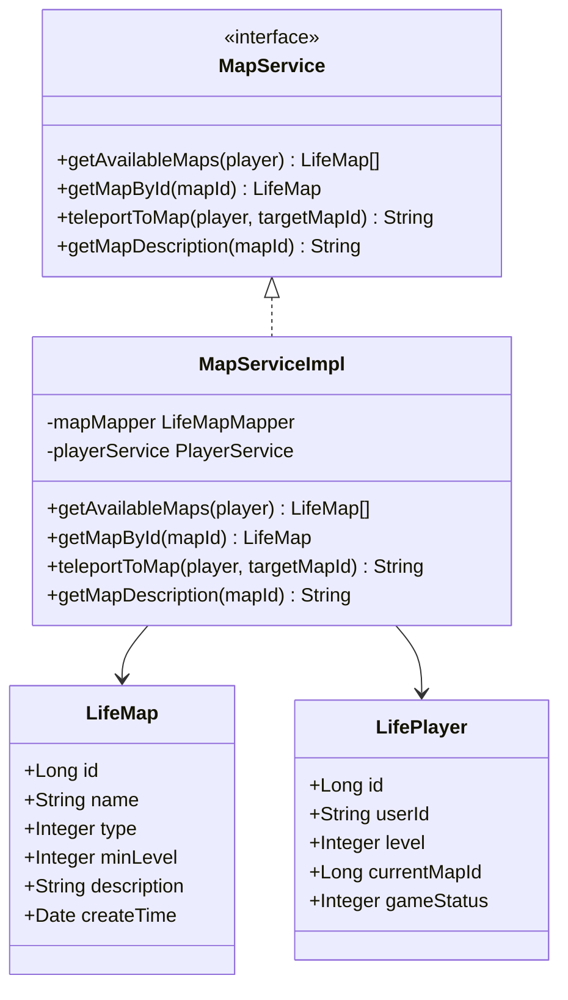
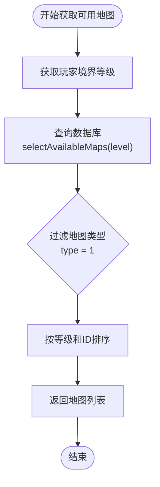
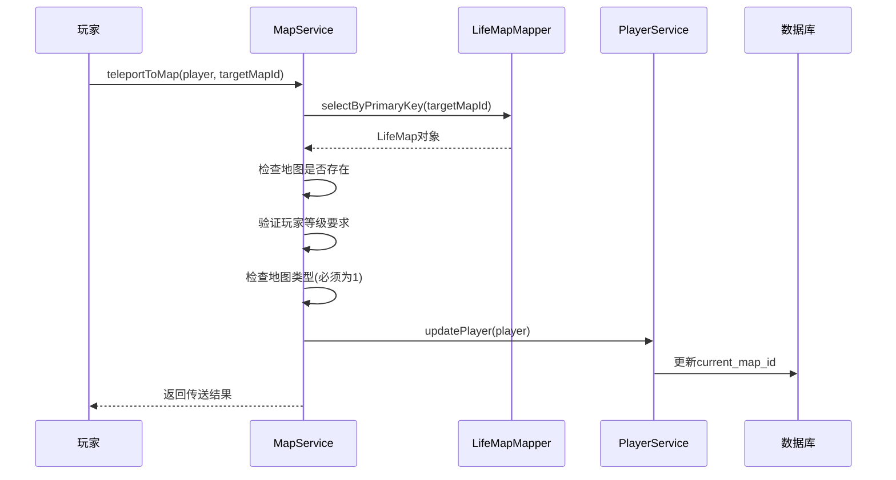
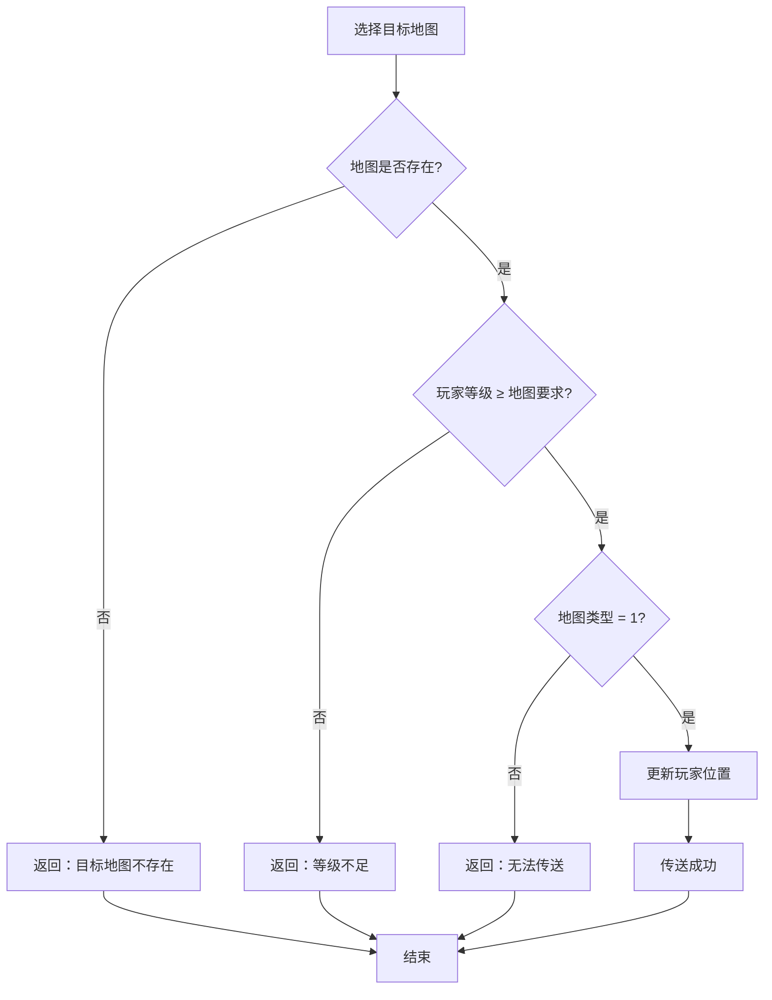
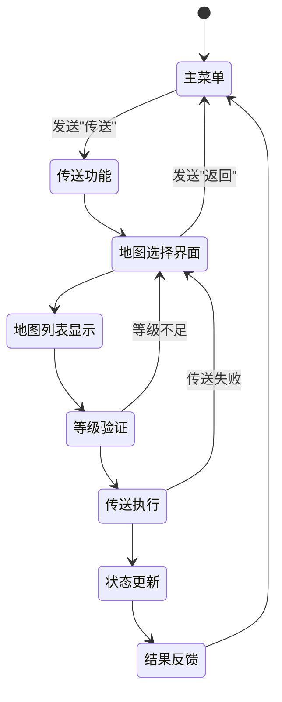
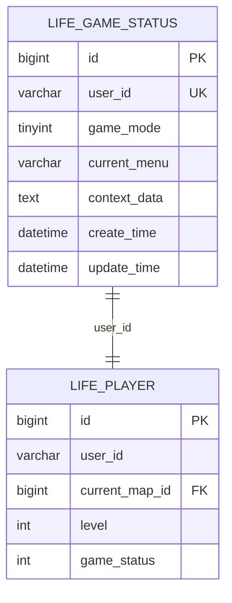
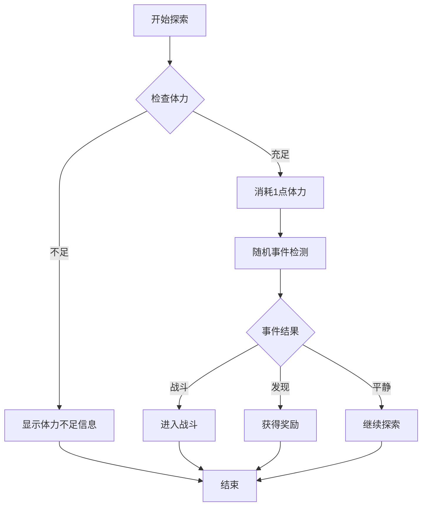

# 地图与传送系统

<cite>
**本文档引用的文件**
- [LifeMap.java](file://Life/src/main/java/com/bot/life/dao/entity/LifeMap.java)
- [MapService.java](file://Life/src/main/java/com/bot/life/service/MapService.java)
- [MapServiceImpl.java](file://Life/src/main/java/com/bot/life/service/impl/MapServiceImpl.java)
- [LifeMapMapper.java](file://Life/src/main/java/com/bot/life/dao/mapper/LifeMapMapper.java)
- [LifeMapMapper.xml](file://Life/src/main/resources/mapper/LifeMapMapper.xml)
- [LifePlayer.java](file://Life/src/main/java/com/bot/life/dao/entity/LifePlayer.java)
- [LifePlayerMapper.xml](file://Life/src/main/resources/mapper/LifePlayerMapper.xml)
- [LifeHandlerImpl.java](file://Life/src/main/java/com/bot/life/service/impl/LifeHandlerImpl.java)
- [LifeDatabase_Init.sql](file://Life_Database_Init.sql)
- [ExplorationService.java](file://Life/src/main/java/com/bot/life/service/ExplorationService.java)
- [ExplorationServiceImpl.java](file://Life/src/main/java/com/bot/life/service/impl/ExplorationServiceImpl.java)
</cite>

## 目录
1. [系统概述](#系统概述)
2. [数据库架构](#数据库架构)
3. [核心组件分析](#核心组件分析)
4. [地图类型与权限](#地图类型与权限)
5. [传送流程详解](#传送流程详解)
6. [探索系统集成](#探索系统集成)
7. [扩展开发指南](#扩展开发指南)
8. [故障排除](#故障排除)
9. [总结](#总结)

## 系统概述

浮生卷的地图与传送系统是一个完整的二维世界探索框架，为玩家提供了丰富的地理位置和移动机制。该系统基于境界等级限制、地图类型区分和传送权限控制，构建了一个层次化的游戏世界。

### 系统特性

- **境界等级限制**：根据玩家修炼境界自动解锁相应地图
- **地图类型分类**：可传送地图和内置地图两种类型
- **动态传送机制**：实时检查玩家权限和状态
- **探索集成**：与游历探索功能无缝衔接
- **状态管理**：完整的传送状态跟踪和恢复机制

## 数据库架构

### life_map 表结构设计

地图系统的核心数据存储在 `life_map` 表中，采用简洁而高效的结构设计：



**图表来源**
- [LifeDatabase_Init.sql](file://Life_Database_Init.sql#L117-L126)
- [LifePlayer.java](file://Life/src/main/java/com/bot/life/dao/entity/LifePlayer.java#L46-L47)

### 字段说明

| 字段名 | 类型 | 说明 | 默认值 |
|--------|------|------|--------|
| id | bigint | 地图唯一标识符 | 自增 |
| name | varchar(50) | 地图名称 | 必填 |
| type | tinyint | 地图类型：1可传送2内置地图 | 1 |
| min_level | int | 最低境界要求 | 1 |
| description | text | 地图描述信息 | null |
| create_time | datetime | 创建时间 | CURRENT_TIMESTAMP |

**章节来源**
- [LifeDatabase_Init.sql](file://Life_Database_Init.sql#L117-L126)
- [LifeMap.java](file://Life/src/main/java/com/bot/life/dao/entity/LifeMap.java#L12-L18)

## 核心组件分析

### MapService 接口设计

地图服务接口定义了完整的地图操作契约：



**图表来源**
- [MapService.java](file://Life/src/main/java/com/bot/life/service/MapService.java#L12-L42)
- [MapServiceImpl.java](file://Life/src/main/java/com/bot/life/service/impl/MapServiceImpl.java#L17-L82)
- [LifeMap.java](file://Life/src/main/java/com/bot/life/dao/entity/LifeMap.java#L12-L18)
- [LifePlayer.java](file://Life/src/main/java/com/bot/life/dao/entity/LifePlayer.java#L14-L47)

### 关键方法实现

#### 1. 获取可用地图列表

系统通过玩家境界等级动态筛选可进入的地图：



**图表来源**
- [MapServiceImpl.java](file://Life/src/main/java/com/bot/life/service/impl/MapServiceImpl.java#L26-L28)
- [LifeMapMapper.xml](file://Life/src/main/resources/mapper/LifeMapMapper.xml#L33-L39)

#### 2. 传送逻辑处理

传送过程包含多层验证和状态更新：



**图表来源**
- [MapServiceImpl.java](file://Life/src/main/java/com/bot/life/service/impl/MapServiceImpl.java#L36-L59)

**章节来源**
- [MapServiceImpl.java](file://Life/src/main/java/com/bot/life/service/impl/MapServiceImpl.java#L26-L59)
- [LifeMapMapper.java](file://Life/src/main/java/com/bot/life/dao/mapper/LifeMapMapper.java#L33-L36)

## 地图类型与权限

### 地图类型分类

系统采用双类型设计，满足不同场景需求：

| 类型 | 数值 | 说明 | 权限控制 |
|------|------|------|----------|
| 可传送地图 | 1 | 支持玩家主动传送 | 等级限制 |
| 内置地图 | 2 | 特殊用途地图 | 无需传送权限 |

### 权限验证机制



**图表来源**
- [MapServiceImpl.java](file://Life/src/main/java/com/bot/life/service/impl/MapServiceImpl.java#L37-L59)

### 初始地图配置

系统预设了多个具有代表性的地图：

| ID | 名称 | 类型 | 最低等级 | 描述 |
|----|------|------|----------|------|
| 1 | 新手村 | 可传送 | 1 | 修仙者的起始之地 |
| 2 | 青云山 | 可传送 | 10 | 灵气充沛的修炼圣地 |
| 3 | 幽冥谷 | 可传送 | 20 | 阴气森森的危险之地 |
| 4 | 天机阁 | 内置地图 | 1 | 神秘的藏宝阁 |
| 5 | 鬼市 | 可传送 | 1 | 修士们交易的神秘市场 |

**章节来源**
- [LifeDatabase_Init.sql](file://Life_Database_Init.sql#L393-L399)
- [MapServiceImpl.java](file://Life/src/main/java/com/bot/life/service/impl/MapServiceImpl.java#L37-L59)

## 传送流程详解

### 完整传送流程

传送系统与游戏主菜单紧密集成，提供流畅的用户体验：



**图表来源**
- [LifeHandlerImpl.java](file://Life/src/main/java/com/bot/life/service/impl/LifeHandlerImpl.java#L479-L540)

### 状态管理系统

系统维护详细的传送状态，确保操作的可靠性和可恢复性：



**图表来源**
- [LifeHandlerImpl.java](file://Life/src/main/java/com/bot/life/service/impl/LifeHandlerImpl.java#L496-L500)
- [LifePlayerMapper.xml](file://Life/src/main/resources/mapper/LifePlayerMapper.xml#L32)

### 错误处理机制

系统实现了完善的错误处理和用户反馈：

| 错误类型 | 处理方式 | 用户提示 |
|----------|----------|----------|
| 地图不存在 | 立即返回 | "目标地图不存在！" |
| 等级不足 | 格式化提示 | "%s需要%d级才能进入！" |
| 地图不可传送 | 提示说明 | "该地图无法直接传送！" |
| 系统异常 | 记录日志 | 通用错误提示 |

**章节来源**
- [MapServiceImpl.java](file://Life/src/main/java/com/bot/life/service/impl/MapServiceImpl.java#L38-L59)
- [LifeHandlerImpl.java](file://Life/src/main/java/com/bot/life/service/impl/LifeHandlerImpl.java#L479-L540)

## 探索系统集成

### 与游历探索的协作

地图系统与探索功能形成了完整的二维世界体验：


**图表来源**
- [ExplorationServiceImpl.java](file://Life/src/main/java/com/bot/life/service/impl/ExplorationServiceImpl.java#L35-L46)
- [LifeHandlerImpl.java](file://Life/src/main/java/com/bot/life/service/impl/LifeHandlerImpl.java#L474-L476)

### 体力消耗机制

探索功能与地图系统协同工作，确保资源管理的合理性：



**图表来源**
- [ExplorationServiceImpl.java](file://Life/src/main/java/com/bot/life/service/impl/ExplorationServiceImpl.java#L36-L46)

**章节来源**
- [ExplorationService.java](file://Life/src/main/java/com/bot/life/service/ExplorationService.java#L17-L39)
- [ExplorationServiceImpl.java](file://Life/src/main/java/com/bot/life/service/impl/ExplorationServiceImpl.java#L35-L46)

## 扩展开发指南

### 添加新地图区域

开发者可以通过以下步骤添加新的地图区域：

#### 1. 数据库表结构扩展

修改 `life_map` 表结构（如果需要额外字段）：

```sql
ALTER TABLE life_map ADD COLUMN special_requirements JSON NULL COMMENT '特殊进入条件';
ALTER TABLE life_map ADD COLUMN unlock_method VARCHAR(50) NULL COMMENT '解锁方式';
```

#### 2. 实体类扩展

扩展 `LifeMap` 实体类：

```java
@Data
public class LifeMap {
    // 现有字段...
    private String unlockMethod; // 解锁方式
    private Map<String, Object> specialRequirements; // 特殊要求
}
```

#### 3. Mapper 接口扩展

添加新的查询方法：

```java
public interface LifeMapMapper {
    // 现有方法...
    
    /**
     * 查询特定解锁方式的地图
     */
    List<LifeMap> selectMapsByUnlockMethod(@Param("unlockMethod") String unlockMethod);
}
```

#### 4. 服务层扩展

扩展 `MapService` 接口：

```java
public interface MapService {
    // 现有方法...
    
    /**
     * 获取特定解锁方式的地图列表
     */
    List<LifeMap> getMapsByUnlockMethod(String unlockMethod);
}
```

### 自定义传送规则

实现特殊的传送条件验证：

```java
@Override
public String teleportToMap(LifePlayer player, Long targetMapId) {
    LifeMap targetMap = getMapById(targetMapId);
    
    // 基础验证
    if (targetMap == null) {
        return "目标地图不存在！";
    }
    
    // 自定义验证逻辑
    if (!checkCustomRequirements(player, targetMap)) {
        return "传送条件未满足！";
    }
    
    // 执行传送
    player.setCurrentMapId(targetMapId);
    playerService.updatePlayer(player);
    
    return String.format("传送成功！已到达%s", targetMap.getName());
}

private boolean checkCustomRequirements(LifePlayer player, LifeMap map) {
    // 实现自定义验证逻辑
    return true;
}
```

### 地图描述扩展

增强地图信息展示：

```java
@Override
public String getMapDescription(Long mapId) {
    LifeMap map = getMapById(mapId);
    if (map == null) {
        return "未知地图";
    }
    
    StringBuilder desc = new StringBuilder();
    desc.append("『").append(map.getName()).append("』\n\n");
    desc.append(map.getDescription()).append("\n\n");
    desc.append("等级要求：").append(map.getMinLevel()).append("级\n");
    
    // 显示特殊要求
    if (map.getSpecialRequirements() != null) {
        desc.append("特殊要求：\n");
        map.getSpecialRequirements().forEach((key, value) -> {
            desc.append("- ").append(key).append(": ").append(value).append("\n");
        });
    }
    
    return desc.toString();
}
```

**章节来源**
- [MapService.java](file://Life/src/main/java/com/bot/life/service/MapService.java#L12-L42)
- [MapServiceImpl.java](file://Life/src/main/java/com/bot/life/service/impl/MapServiceImpl.java#L17-L82)

## 故障排除

### 常见问题及解决方案

#### 1. 地图传送失败

**问题现象**：玩家无法传送或传送后位置不变

**排查步骤**：
1. 检查地图是否存在：`SELECT * FROM life_map WHERE id = ?`
2. 验证玩家等级是否满足要求
3. 确认地图类型为可传送类型（type = 1）
4. 检查玩家当前位置是否正确更新

**解决方案**：
```sql
-- 检查地图配置
SELECT id, name, type, min_level FROM life_map WHERE id = ?;

-- 检查玩家状态
SELECT level, current_map_id FROM life_player WHERE id = ?;
```

#### 2. 可传送地图列表为空

**问题原因**：玩家境界等级过低或数据库配置错误

**解决方法**：
1. 检查玩家境界等级
2. 验证地图配置的最低等级要求
3. 确保地图类型正确设置

#### 3. 传送状态异常

**问题现象**：玩家传送后状态混乱

**排查方法**：
```sql
-- 检查游戏状态表
SELECT * FROM life_game_status WHERE user_id = ?;

-- 检查玩家位置
SELECT current_map_id, game_status FROM life_player WHERE user_id = ?;
```

### 性能优化建议

#### 1. 数据库索引优化

```sql
-- 为常用查询添加索引
CREATE INDEX idx_map_type_min_level ON life_map(type, min_level);
CREATE INDEX idx_player_current_map ON life_player(current_map_id);
```

#### 2. 缓存策略

```java
@Service
public class MapCacheService {
    @Cacheable(value = "maps", key = "#player.level")
    public List<LifeMap> getCachedAvailableMaps(LifePlayer player) {
        return mapService.getAvailableMaps(player);
    }
}
```

**章节来源**
- [MapServiceImpl.java](file://Life/src/main/java/com/bot/life/service/impl/MapServiceImpl.java#L37-L59)
- [LifeMapMapper.xml](file://Life/src/main/resources/mapper/LifeMapMapper.xml#L33-L39)

## 总结

浮生卷的地图与传送系统是一个设计精良的二维世界框架，通过以下关键特性为玩家提供了丰富的探索体验：

### 核心优势

1. **层次化权限控制**：基于境界等级的渐进式地图解锁机制
2. **灵活的类型系统**：可传送地图与内置地图的合理分工
3. **完整的状态管理**：可靠的传送状态跟踪和恢复机制
4. **无缝的功能集成**：与探索、战斗等功能的完美配合
5. **良好的扩展性**：清晰的架构设计便于功能扩展

### 设计亮点

- **数据驱动的权限验证**：通过数据库配置实现灵活的权限管理
- **状态机驱动的操作流程**：确保复杂交互的可靠性
- **模块化的服务设计**：职责清晰，易于维护和扩展
- **完善的错误处理**：为用户提供清晰的反馈信息

### 应用价值

该系统不仅为浮生卷游戏提供了坚实的地理框架，也为类似的文字冒险游戏开发提供了优秀的参考实现。其设计理念和实现方式可以广泛应用于各种需要空间探索和权限控制的游戏场景。

通过本文档的详细介绍，开发者可以深入理解系统的架构设计，掌握核心功能的实现原理，并能够基于现有框架进行功能扩展和定制开发。