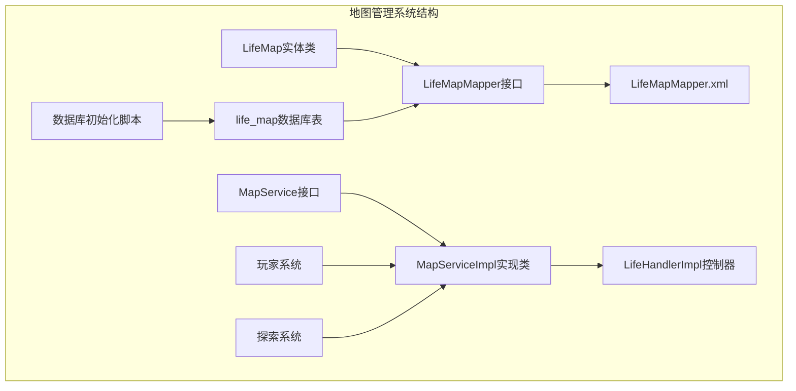
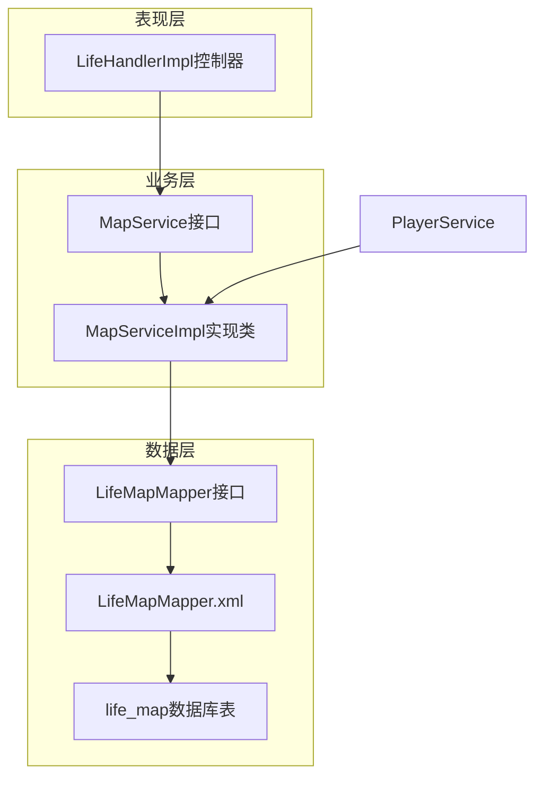
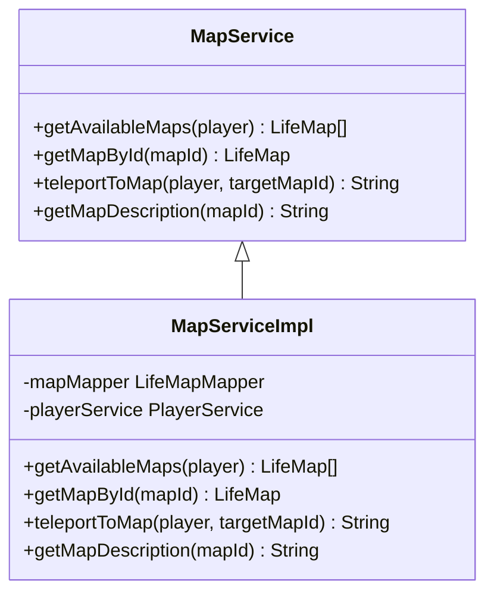
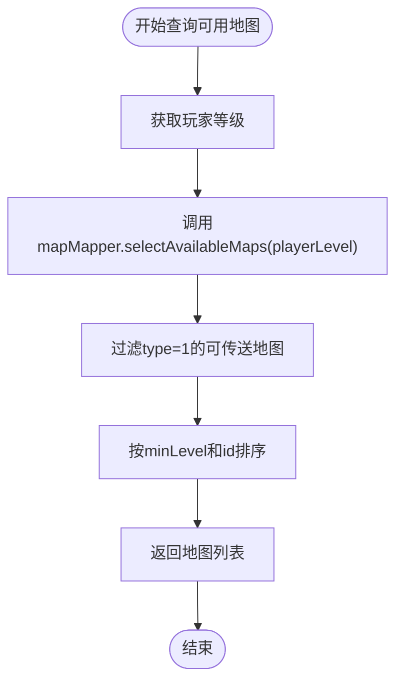
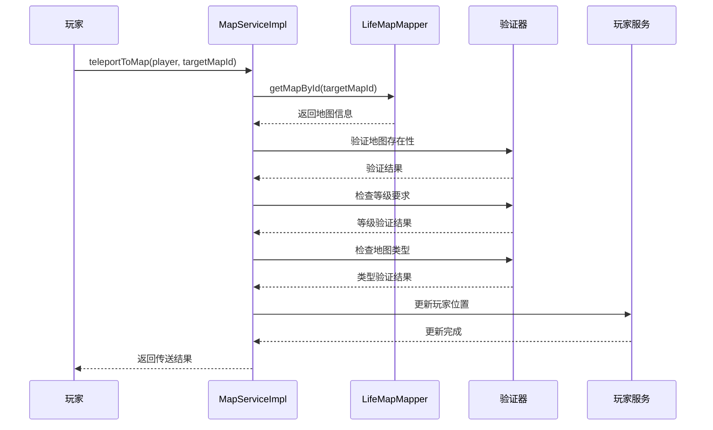
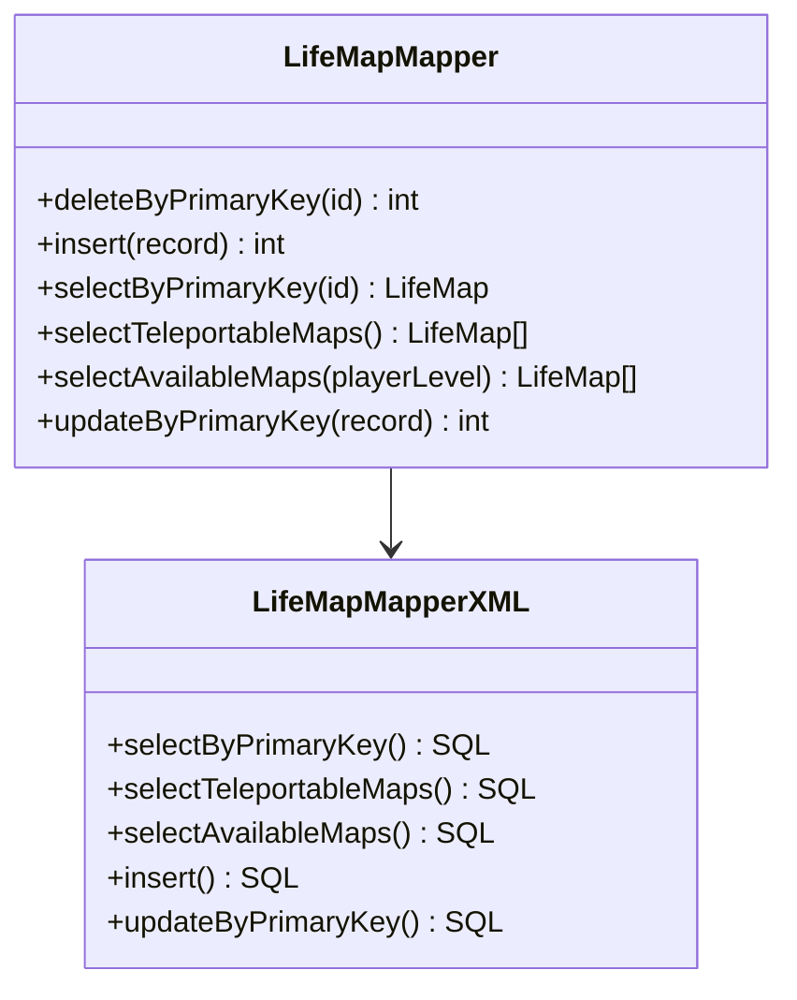
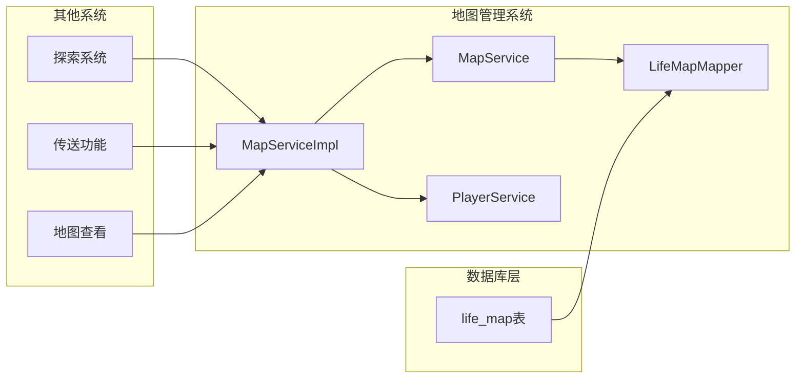

# 地图管理

<cite>
**本文档中引用的文件**
- [LifeMap.java](file://Life/src/main/java/com/bot/life/dao/entity/LifeMap.java)
- [MapService.java](file://Life/src/main/java/com/bot/life/service/MapService.java)
- [MapServiceImpl.java](file://Life/src/main/java/com/bot/life/service/impl/MapServiceImpl.java)
- [LifeMapMapper.java](file://Life/src/main/java/com/bot/life/dao/mapper/LifeMapMapper.java)
- [LifeMapMapper.xml](file://Life/src/main/resources/mapper/LifeMapMapper.xml)
- [LifeHandlerImpl.java](file://Life/src/main/java/com/bot/life/service/impl/LifeHandlerImpl.java)
- [Life_Database_Init.sql](file://Life_Database_Init.sql)
</cite>

## 目录
1. [简介](#简介)
2. [项目结构](#项目结构)
3. [核心组件](#核心组件)
4. [架构概览](#架构概览)
5. [详细组件分析](#详细组件分析)
6. [依赖关系分析](#依赖关系分析)
7. [性能考虑](#性能考虑)
8. [故障排除指南](#故障排除指南)
9. [结论](#结论)

## 简介

浮生卷游戏中的地图管理系统是一个核心功能模块，负责管理游戏世界中的各种地图资源。该系统通过LifeMap实体类和life_map数据库表结构，实现了地图数据的完整生命周期管理，包括地图创建、查询、传送等功能。系统采用分层架构设计，通过MapService接口和MapServiceImpl实现类提供服务，确保了代码的可维护性和扩展性。

地图管理系统的核心特性包括：
- 支持两种地图类型：可传送地图（type=1）和内置地图（type=2）
- 基于玩家等级的地图访问控制机制
- 灵活的地图查询和筛选功能
- 完整的地图传送流程管理

## 项目结构

地图管理系统的文件组织结构清晰明确，遵循MVC架构模式：



**图表来源**
- [LifeMap.java](file://Life/src/main/java/com/bot/life/dao/entity/LifeMap.java#L1-L20)
- [MapServiceImpl.java](file://Life/src/main/java/com/bot/life/service/impl/MapServiceImpl.java#L1-L84)

**章节来源**
- [LifeMap.java](file://Life/src/main/java/com/bot/life/dao/entity/LifeMap.java#L1-L20)
- [LifeMapMapper.java](file://Life/src/main/java/com/bot/life/dao/mapper/LifeMapMapper.java#L1-L43)
- [MapServiceImpl.java](file://Life/src/main/java/com/bot/life/service/impl/MapServiceImpl.java#L1-L84)

## 核心组件

### LifeMap实体类

LifeMap实体类是地图数据的核心载体，定义了地图的基本属性和业务含义：

| 字段名 | 类型 | 说明 | 业务含义 |
|--------|------|------|----------|
| id | Long | 地图唯一标识 | 主键，自动生成 |
| name | String | 地图名称 | 显示给玩家的名称 |
| type | Integer | 地图类型 | 1:可传送地图 2:内置地图 |
| minLevel | Integer | 最低境界要求 | 进入地图所需的最低等级 |
| description | String | 地图描述 | 地图的详细说明信息 |
| createTime | Date | 创建时间 | 地图记录的创建时间 |

### 地图类型系统

系统支持两种地图类型，每种类型具有不同的业务含义和处理方式：

- **可传送地图（type=1）**：玩家可以通过传送功能直接前往的地图，通常用于主要的游戏区域
- **内置地图（type=2）**：特殊的地图类型，可能需要特定条件才能访问，通常用于特殊场景或隐藏区域

**章节来源**
- [LifeMap.java](file://Life/src/main/java/com/bot/life/dao/entity/LifeMap.java#L12-L18)

## 架构概览

地图管理系统采用典型的三层架构设计，确保了良好的分离关注点和可扩展性：



**图表来源**
- [MapServiceImpl.java](file://Life/src/main/java/com/bot/life/service/impl/MapServiceImpl.java#L17-L25)
- [LifeMapMapper.java](file://Life/src/main/java/com/bot/life/dao/mapper/LifeMapMapper.java#L11-L42)

## 详细组件分析

### MapService接口

MapService接口定义了地图管理的核心业务方法，提供了完整的地图操作功能：



**图表来源**
- [MapService.java](file://Life/src/main/java/com/bot/life/service/MapService.java#L12-L42)
- [MapServiceImpl.java](file://Life/src/main/java/com/bot/life/service/impl/MapServiceImpl.java#L17-L83)

#### 关键方法分析

**1. getAvailableMaps方法**
该方法根据玩家等级返回可传送的地图列表，实现了基于等级的访问控制：



**图表来源**
- [MapServiceImpl.java](file://Life/src/main/java/com/bot/life/service/impl/MapServiceImpl.java#L27-L29)

**2. teleportToMap方法**
传送功能的完整实现，包含多层验证和业务逻辑：



**图表来源**
- [MapServiceImpl.java](file://Life/src/main/java/com/bot/life/service/impl/MapServiceImpl.java#L37-L60)

**章节来源**
- [MapServiceImpl.java](file://Life/src/main/java/com/bot/life/service/impl/MapServiceImpl.java#L27-L60)

### LifeMapMapper接口和XML映射

LifeMapMapper提供了完整的数据库操作接口，配合MyBatis XML配置实现数据持久化：



**图表来源**
- [LifeMapMapper.java](file://Life/src/main/java/com/bot/life/dao/mapper/LifeMapMapper.java#L11-L42)
- [LifeMapMapper.xml](file://Life/src/main/resources/mapper/LifeMapMapper.xml#L1-L64)

#### 核心SQL查询分析

**1. 可传送地图查询**
```sql
SELECT id, name, type, min_level, description, create_time
FROM life_map
WHERE type = 1
ORDER BY min_level, id
```

**2. 可进入地图查询**
```sql
SELECT id, name, type, min_level, description, create_time
FROM life_map
WHERE type = 1 AND min_level <= #{playerLevel}
ORDER BY min_level, id
```

**章节来源**
- [LifeMapMapper.xml](file://Life/src/main/resources/mapper/LifeMapMapper.xml#L25-L39)

### 数据库表结构

life_map表结构设计简洁高效，支持地图管理的核心需求：

| 字段名 | 类型 | 约束 | 说明 |
|--------|------|------|------|
| id | bigint | PRIMARY KEY, AUTO_INCREMENT | 地图唯一标识符 |
| name | varchar(50) | NOT NULL | 地图名称，最大50字符 |
| type | tinyint | NOT NULL | 地图类型：1可传送 2内置地图 |
| min_level | int | DEFAULT 1 | 最低境界要求，默认1级 |
| description | text | NULL | 地图描述信息 |
| create_time | datetime | DEFAULT CURRENT_TIMESTAMP | 记录创建时间 |

**章节来源**
- [Life_Database_Init.sql](file://Life_Database_Init.sql#L118-L126)

## 依赖关系分析

地图管理系统与其他模块存在密切的依赖关系：



**图表来源**
- [MapServiceImpl.java](file://Life/src/main/java/com/bot/life/service/impl/MapServiceImpl.java#L20-L25)

### 外部依赖

1. **PlayerService**：用于更新玩家当前位置信息
2. **LifePlayer**：玩家实体类，包含等级等关键属性
3. **数据库连接**：通过MyBatis框架访问life_map表

**章节来源**
- [MapServiceImpl.java](file://Life/src/main/java/com/bot/life/service/impl/MapServiceImpl.java#L20-L25)

## 性能考虑

### 查询优化策略

1. **索引设计**：life_map表的id字段作为主键，自动建立索引
2. **查询优化**：使用精确的WHERE条件减少扫描范围
3. **排序优化**：按min_level和id排序，提高查询效率

### 缓存策略

虽然当前实现没有显式的缓存机制，但可以考虑以下优化：
- 地图信息缓存：将常用地图信息缓存在内存中
- 玩家可用地图缓存：缓存玩家可访问的地图列表

## 故障排除指南

### 常见问题及解决方案

**1. 地图传送失败**
- **问题**：玩家无法传送至目标地图
- **原因**：地图不存在、等级不足、地图类型不正确
- **解决**：检查地图ID有效性，验证玩家等级，确认地图类型

**2. 可传送地图列表为空**
- **问题**：getAvailableMaps返回空列表
- **原因**：数据库中缺少type=1的地图记录
- **解决**：检查life_map表数据，确保有符合条件的地图

**3. 地图描述信息缺失**
- **问题**：getMapDescription返回"未知地图"
- **原因**：地图ID不存在或数据库记录损坏
- **解决**：验证地图ID，检查数据库完整性

**章节来源**
- [MapServiceImpl.java](file://Life/src/main/java/com/bot/life/service/impl/MapServiceImpl.java#L38-L82)

## 结论

浮生卷游戏的地图管理系统是一个设计良好、功能完整的模块。通过LifeMap实体类和life_map表结构，系统实现了地图数据的完整管理；通过MapService接口和MapServiceImpl实现类，提供了灵活的业务逻辑处理；通过MyBatis框架，确保了数据访问的效率和可靠性。

系统的主要优势包括：
- 清晰的分层架构设计
- 完整的业务逻辑覆盖
- 灵活的查询和筛选功能
- 完善的错误处理机制

对于开发者而言，该系统提供了良好的扩展基础，可以方便地添加新的地图类型、修改地图属性、增加新的地图功能等。同时，系统的模块化设计也为未来的重构和优化提供了便利。