# 好友系统详细文档

<cite>
**本文档引用的文件**
- [LifeFriend.java](file://Life/src/main/java/com/bot/life/dao/entity/LifeFriend.java)
- [FriendServiceImpl.java](file://Life/src/main/java/com/bot/life/service/impl/FriendServiceImpl.java)
- [LifeFriendMapper.java](file://Life/src/main/java/com/bot/life/dao/mapper/LifeFriendMapper.java)
- [LifeFriendMapper.xml](file://Life/src/main/resources/mapper/LifeFriendMapper.xml)
- [FriendService.java](file://Life/src/main/java/com/bot/life/service/FriendService.java)
- [LifePlayer.java](file://Life/src/main/java/com/bot/life/dao/entity/LifePlayer.java)
- [LifePlayerMapper.java](file://Life/src/main/java/com/bot/life/dao/mapper/LifePlayerMapper.java)
- [LifeHandlerImpl.java](file://Life/src/main/java/com/bot/life/service/impl/LifeHandlerImpl.java)
- [MailService.java](file://Life/src/main/java/com/bot/life/service/MailService.java)
- [DeleteFriendServiceImpl.java](file://Game/src/main/java/com/bot/game/service/impl/DeleteFriendServiceImpl.java)
- [Life_Database_Tables_Check.md](file://Life_Database_Tables_Check.md)
- [Life_Database_Init.sql](file://Life_Database_Init.sql)
</cite>

## 目录
1. [系统概述](#系统概述)
2. [核心实体设计](#核心实体设计)
3. [服务架构分析](#服务架构分析)
4. [数据库设计与查询优化](#数据库设计与查询优化)
5. [好友功能详细实现](#好友功能详细实现)
6. [交互流程与事务处理](#交互流程与事务处理)
7. [扩展功能指南](#扩展功能指南)
8. [常见问题与解决方案](#常见问题与解决方案)
9. [性能优化建议](#性能优化建议)
10. [总结](#总结)

## 系统概述

'浮生卷'游戏的好友系统是一个完整的社交互动平台，支持玩家之间建立友谊关系、发送互动消息、管理好友列表等功能。系统采用分层架构设计，包含实体层、服务层、数据访问层和表现层，确保了良好的可维护性和扩展性。

### 系统特点

- **双向关系管理**：支持玩家主动添加好友和被动接受好友申请
- **状态化管理**：通过状态字段区分待确认和已确认的好友关系
- **事务安全保障**：在关键操作中实施事务控制，确保数据一致性
- **灵活查询机制**：提供多种查询方式满足不同业务场景需求
- **扩展性强**：预留接口支持未来添加更多社交功能

## 核心实体设计

### LifeFriend 实体

LifeFriend 是好友系统的核心实体，承载着好友关系的所有关键信息：

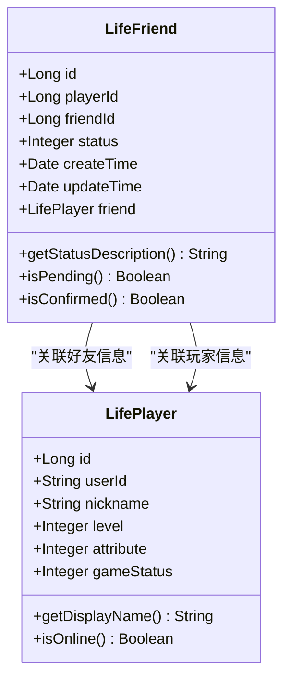

**图表来源**
- [LifeFriend.java](file://Life/src/main/java/com/bot/life/dao/entity/LifeFriend.java#L11-L22)
- [LifePlayer.java](file://Life/src/main/java/com/bot/life/dao/entity/LifePlayer.java#L12-L49)

#### 字段业务含义

| 字段名 | 类型 | 业务含义 | 约束条件 |
|--------|------|----------|----------|
| id | Long | 主键标识符 | 自增，唯一 |
| playerId | Long | 玩家ID | 外键，指向life_player.id |
| friendId | Long | 好友ID | 外键，指向life_player.id |
| status | Integer | 好友状态 | 0:待确认 1:已同意 |
| createTime | Date | 创建时间 | 自动设置 |
| updateTime | Date | 更新时间 | 自动更新 |
| friend | LifePlayer | 关联好友对象 | 延迟加载 |

**节来源**
- [LifeFriend.java](file://Life/src/main/java/com/bot/life/dao/entity/LifeFriend.java#L13-L22)

### LifePlayer 实体

LifePlayer 实体包含了玩家的基本信息，是好友系统的基础数据支撑：

- **基础属性**：用户ID、昵称、角色属性等
- **游戏状态**：当前游戏状态、在线状态等
- **等级信息**：玩家等级、经验值等
- **战斗属性**：血量、攻击力、防御力等

**节来源**
- [LifePlayer.java](file://Life/src/main/java/com/bot/life/dao/entity/LifePlayer.java#L12-L49)

## 服务架构分析

### 服务层次结构

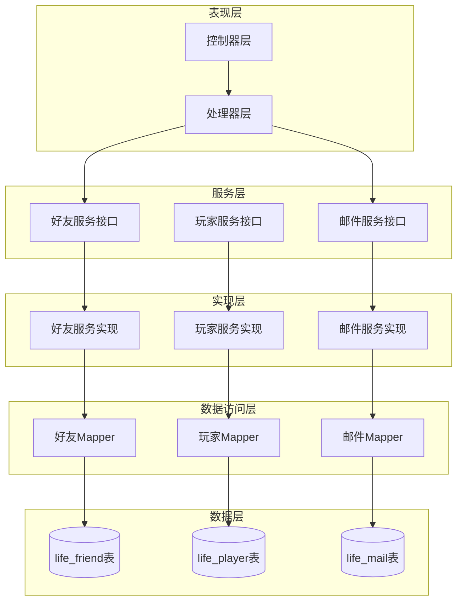

**图表来源**
- [FriendServiceImpl.java](file://Life/src/main/java/com/bot/life/service/impl/FriendServiceImpl.java#L18-L26)
- [LifeHandlerImpl.java](file://Life/src/main/java/com/bot/life/service/impl/LifeHandlerImpl.java#L612-L646)

### 核心服务接口

FriendService 接口定义了好友系统的核心功能：

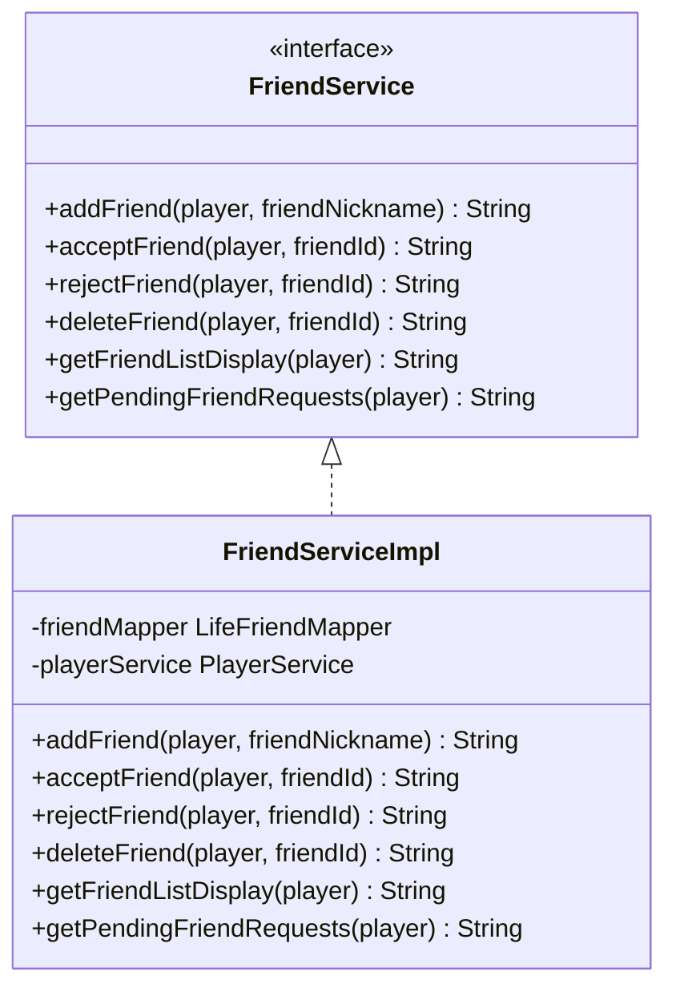

**图表来源**
- [FriendService.java](file://Life/src/main/java/com/bot/life/service/FriendService.java#L9-L56)
- [FriendServiceImpl.java](file://Life/src/main/java/com/bot/life/service/impl/FriendServiceImpl.java#L18-L26)

**节来源**
- [FriendService.java](file://Life/src/main/java/com/bot/life/service/FriendService.java#L9-L56)
- [FriendServiceImpl.java](file://Life/src/main/java/com/bot/life/service/impl/FriendServiceImpl.java#L18-L26)

## 数据库设计与查询优化

### 表结构设计

好友系统的核心表结构设计遵循关系型数据库的最佳实践：

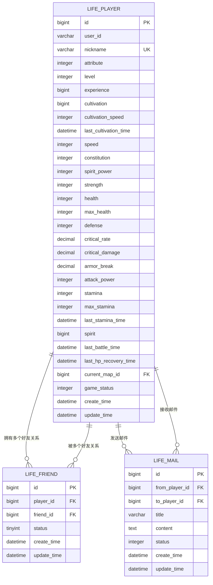

**图表来源**
- [Life_Database_Init.sql](file://Life_Database_Init.sql#L250-L260)
- [LifePlayer.java](file://Life/src/main/java/com/bot/life/dao/entity/LifePlayer.java#L12-L49)

### 查询优化策略

#### 1. 索引设计

| 索引类型 | 字段组合 | 用途 | 性能收益 |
|----------|----------|------|----------|
| 主键索引 | id | 唯一标识 | O(log n)查找 |
| 唯一索引 | (player_id, friend_id) | 防止重复好友关系 | O(log n)插入检查 |
| 普通索引 | player_id | 按玩家查询好友 | O(log n)范围查询 |
| 状态索引 | status | 按状态过滤 | O(1)状态查询 |

#### 2. 查询语句优化

系统提供了多种优化的查询方法：

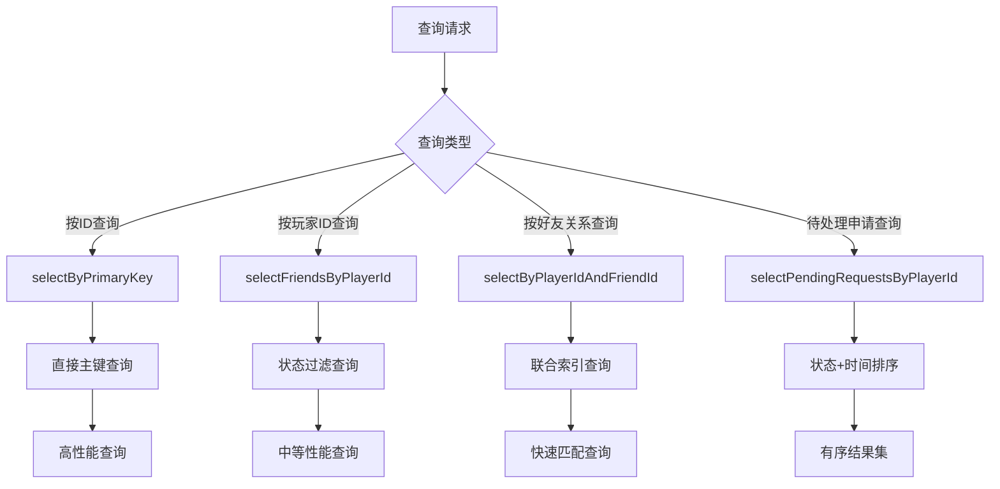

**图表来源**
- [LifeFriendMapper.xml](file://Life/src/main/resources/mapper/LifeFriendMapper.xml#L18-L68)

**节来源**
- [LifeFriendMapper.xml](file://Life/src/main/resources/mapper/LifeFriendMapper.xml#L18-L68)

## 好友功能详细实现

### 添加好友功能

添加好友是好友系统的核心入口功能，实现了完整的双向关系建立流程：

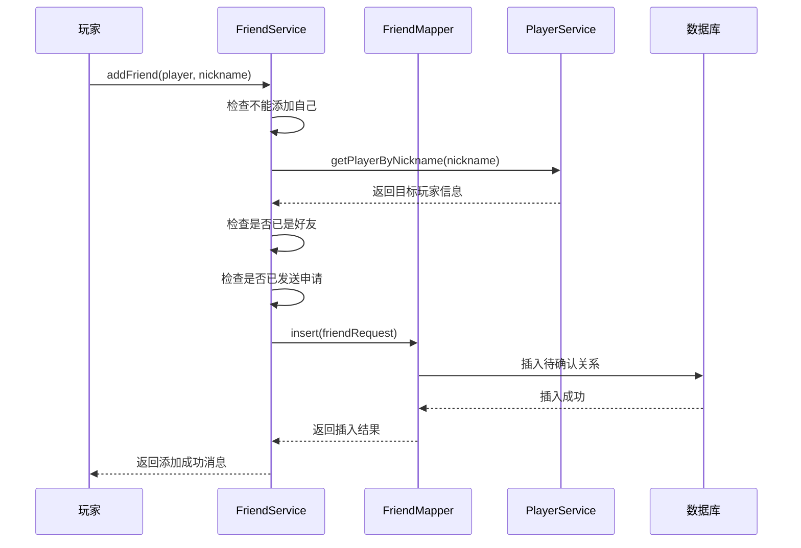

**图表来源**
- [FriendServiceImpl.java](file://Life/src/main/java/com/bot/life/service/impl/FriendServiceImpl.java#L28-L66)

#### 功能特性

1. **防重复检查**：防止重复添加同一好友
2. **状态验证**：确保不会添加自己为好友
3. **异常处理**：完善的错误处理机制
4. **用户体验**：清晰的操作反馈

**节来源**
- [FriendServiceImpl.java](file://Life/src/main/java/com/bot/life/service/impl/FriendServiceImpl.java#L28-L66)

### 同意/拒绝好友申请

好友申请的处理采用了严格的事务控制机制：

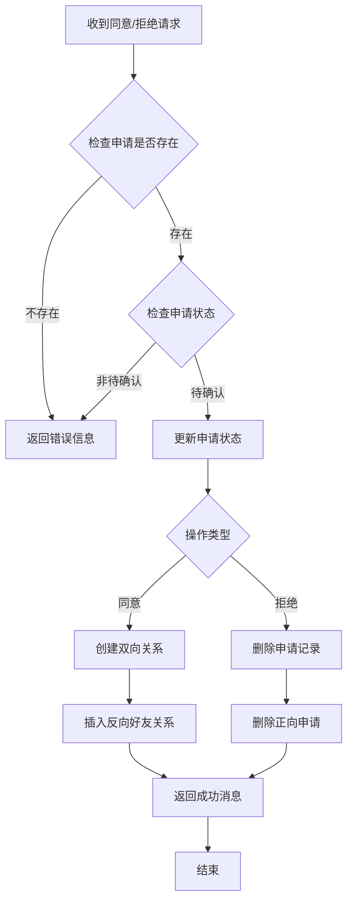

**图表来源**
- [FriendServiceImpl.java](file://Life/src/main/java/com/bot/life/service/impl/FriendServiceImpl.java#L69-L121)

#### 双向关系处理

系统在处理好友同意时，会自动创建双向关系以确保关系的完整性：

1. **正向关系**：申请人成为被申请人的朋友
2. **反向关系**：被申请人成为申请人的朋友
3. **状态同步**：两个关系的状态保持一致

**节来源**
- [FriendServiceImpl.java](file://Life/src/main/java/com/bot/life/service/impl/FriendServiceImpl.java#L69-L121)

### 好友列表管理

好友列表功能提供了丰富的展示和管理能力：

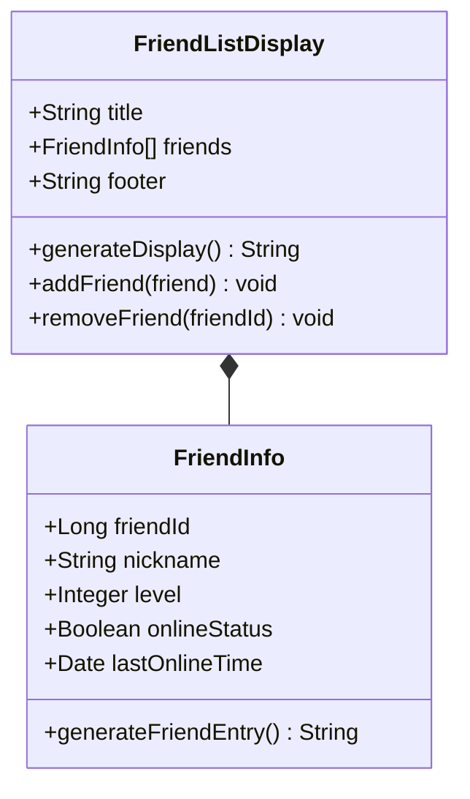

**图表来源**
- [FriendServiceImpl.java](file://Life/src/main/java/com/bot/life/service/impl/FriendServiceImpl.java#L131-L152)

**节来源**
- [FriendServiceImpl.java](file://Life/src/main/java/com/bot/life/service/impl/FriendServiceImpl.java#L131-L152)

## 交互流程与事务处理

### 完整的交互流程

好友系统的交互流程涵盖了从添加到管理的完整生命周期：

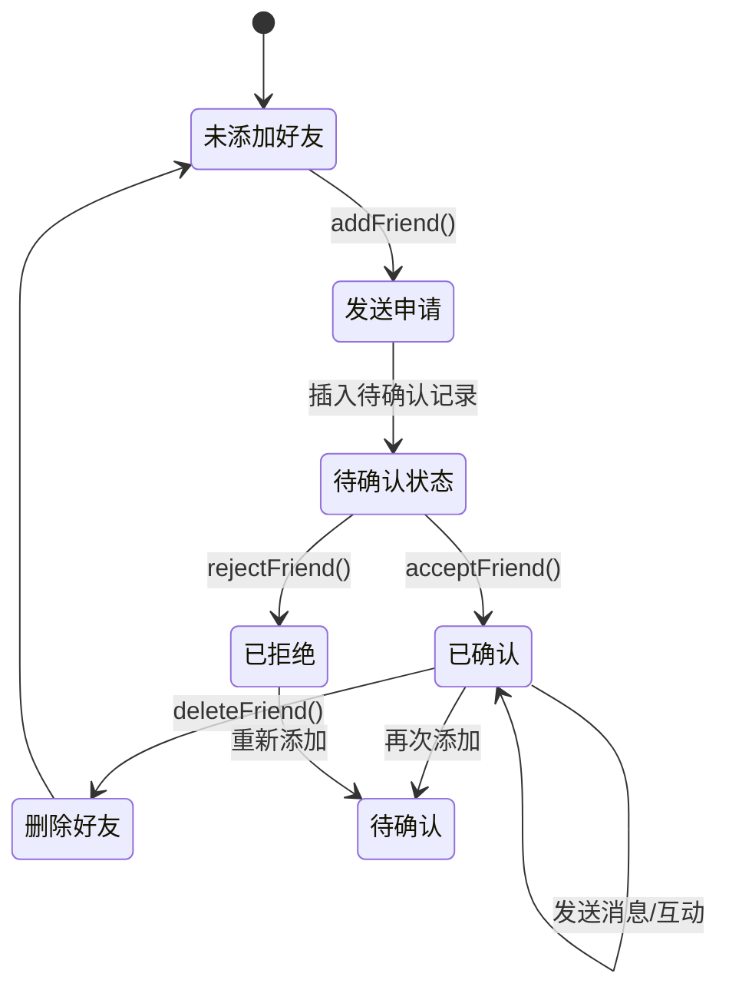

### 事务处理机制

系统在关键操作中实施了严格的事务控制：

#### 添加好友事务

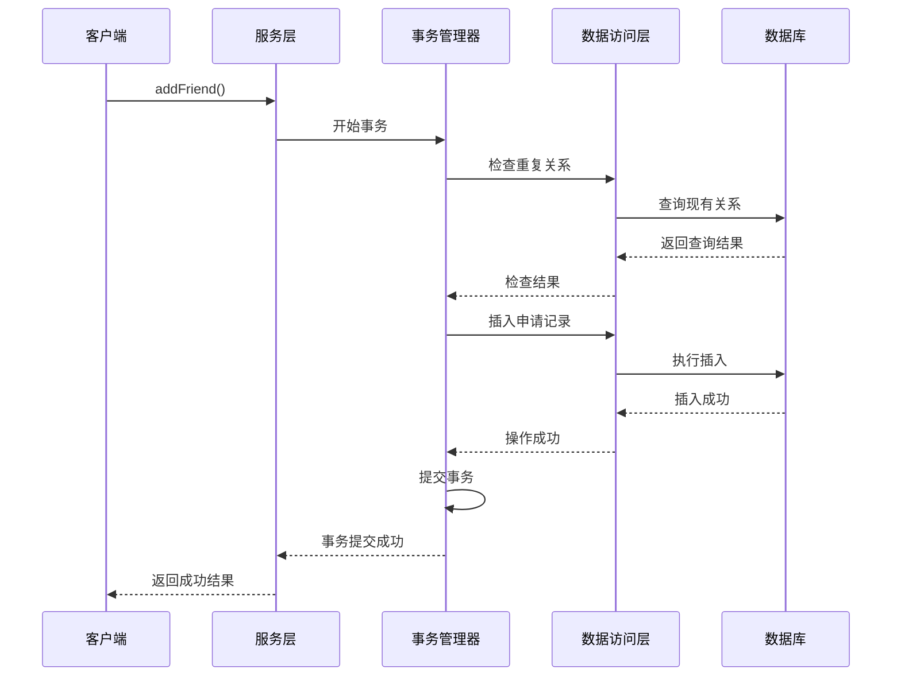

**图表来源**
- [FriendServiceImpl.java](file://Life/src/main/java/com/bot/life/service/impl/FriendServiceImpl.java#L50-L66)

#### 错误回滚机制

当操作失败时，系统会自动回滚所有相关变更：

1. **插入失败**：回滚新创建的申请记录
2. **更新失败**：恢复原始状态
3. **删除失败**：保留原有数据
4. **网络异常**：自动重试机制

**节来源**
- [FriendServiceImpl.java](file://Life/src/main/java/com/bot/life/service/impl/FriendServiceImpl.java#L50-L66)

## 扩展功能指南

### 邮件系统集成

好友系统与邮件系统紧密集成，支持好友间的直接通信：

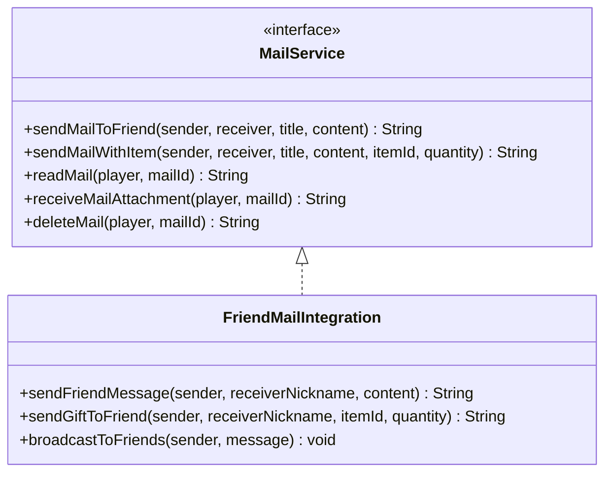

**图表来源**
- [MailService.java](file://Life/src/main/java/com/bot/life/service/MailService.java#L9-L74)

### 黑名单功能扩展

虽然当前版本尚未实现黑名单功能，但系统架构支持未来的扩展：

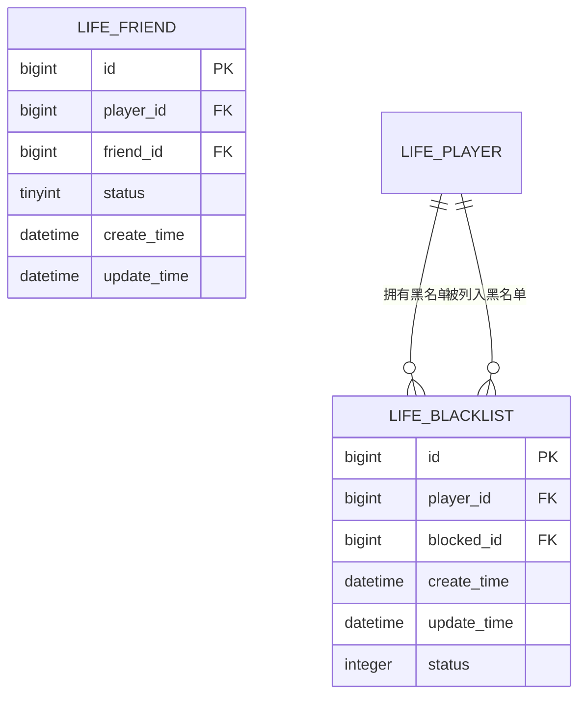

### 好友祝福功能

可以扩展添加好友祝福功能：

1. **祝福系统**：定期为好友发送祝福消息
2. **节日提醒**：在特殊节日提醒好友
3. **成就分享**：自动分享好友的游戏成就
4. **互助任务**：创建好友间的互助任务系统

### 社交活动功能

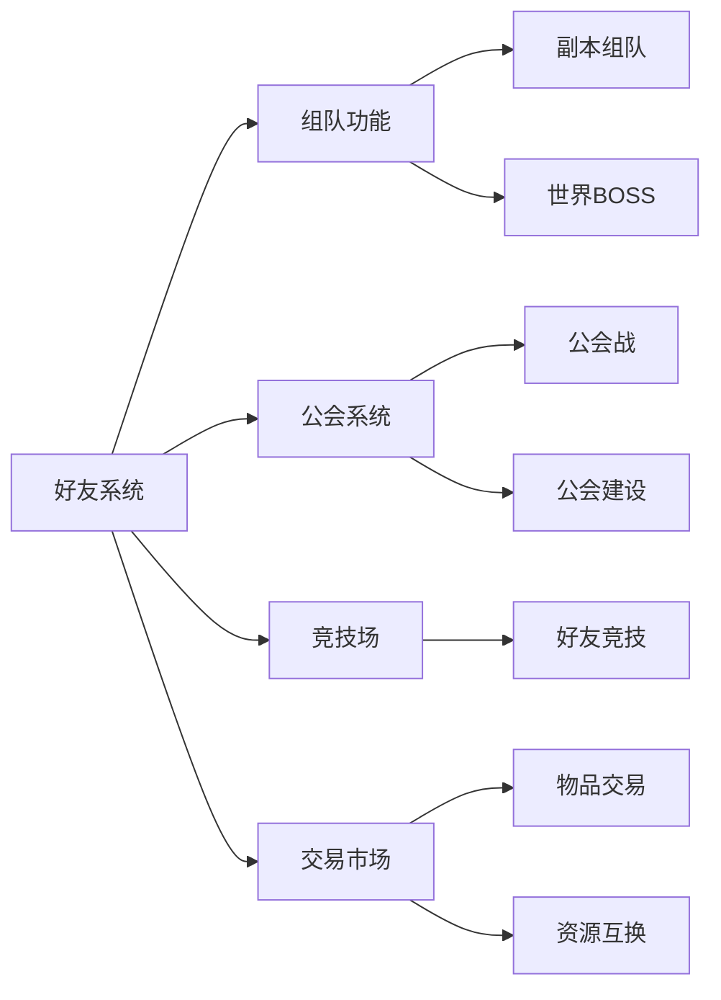

**节来源**
- [MailService.java](file://Life/src/main/java/com/bot/life/service/MailService.java#L9-L74)

## 常见问题与解决方案

### 好友请求丢失问题

#### 问题现象
- 好友申请发送后无法找到
- 申请状态显示异常
- 收不到好友通知

#### 诊断步骤

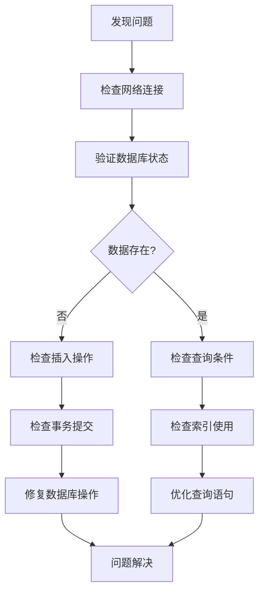

#### 解决方案

1. **数据库检查**
   ```sql
   -- 检查好友申请是否存在
   SELECT * FROM life_friend 
   WHERE player_id = ? AND friend_id = ? AND status = 0;
   
   -- 检查好友关系是否完整
   SELECT COUNT(*) FROM life_friend 
   WHERE player_id = ? OR friend_id = ?;
   ```

2. **事务验证**
   - 确认事务是否正确提交
   - 检查数据库连接池配置
   - 验证Spring事务管理器设置

3. **缓存同步**
   - 清理相关缓存
   - 重新加载好友列表
   - 验证缓存更新机制

### 状态不同步问题

#### 问题表现
- 好友列表显示不准确
- 申请状态显示错误
- 双向关系不一致

#### 解决策略

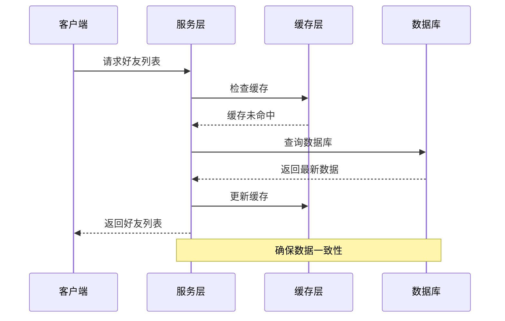

### 性能优化问题

#### 查询性能瓶颈

1. **索引优化**
   - 为 `(player_id, status)` 添加复合索引
   - 为 `(friend_id, status)` 添加复合索引
   - 为 `create_time` 添加时间索引

2. **查询优化**
   - 使用分页查询大量好友列表
   - 实现懒加载机制
   - 添加适当的缓存策略

3. **并发控制**
   - 使用乐观锁防止并发冲突
   - 实现请求限流机制
   - 添加异步处理队列

**节来源**
- [FriendServiceImpl.java](file://Life/src/main/java/com/bot/life/service/impl/FriendServiceImpl.java#L28-L66)

## 性能优化建议

### 数据库层面优化

#### 1. 索引策略优化

| 场景 | 推荐索引 | 查询效率 |
|------|----------|----------|
| 按玩家查询好友 | `(player_id, status)` | O(log n) |
| 按好友查询关系 | `(friend_id, status)` | O(log n) |
| 时间范围查询 | `(create_time, player_id)` | O(log n) |
| 状态统计查询 | `(status, create_time)` | O(1) |

#### 2. 分区策略

对于大型服务器，可以考虑按玩家ID范围进行分区：

```sql
-- 按玩家ID范围分区
CREATE TABLE life_friend_partitioned (
    id BIGINT NOT NULL AUTO_INCREMENT,
    player_id BIGINT NOT NULL,
    friend_id BIGINT NOT NULL,
    status TINYINT DEFAULT 0,
    create_time DATETIME DEFAULT CURRENT_TIMESTAMP,
    update_time DATETIME DEFAULT CURRENT_TIMESTAMP ON UPDATE CURRENT_TIMESTAMP,
    PRIMARY KEY (id, player_id)
) PARTITION BY RANGE (player_id DIV 1000000) (
    PARTITION p0 VALUES LESS THAN (1),
    PARTITION p1 VALUES LESS THAN (2),
    PARTITION p2 VALUES LESS THAN MAXVALUE
);
```

### 应用层面优化

#### 1. 缓存策略

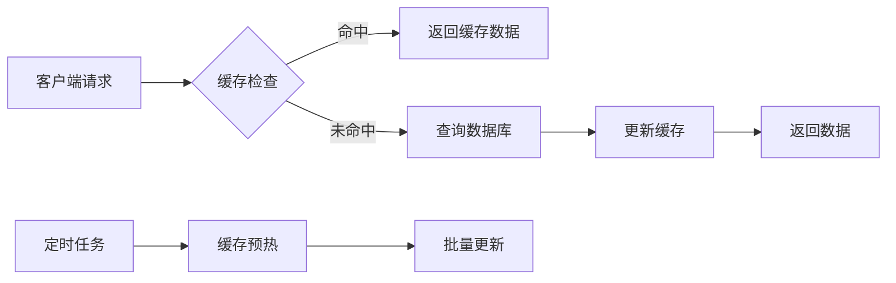

#### 2. 异步处理

对于耗时操作，采用异步处理机制：

- **好友申请通知**：异步发送系统通知
- **好友统计更新**：后台定期统计
- **好友关系清理**：定时清理无效关系

#### 3. 批量操作

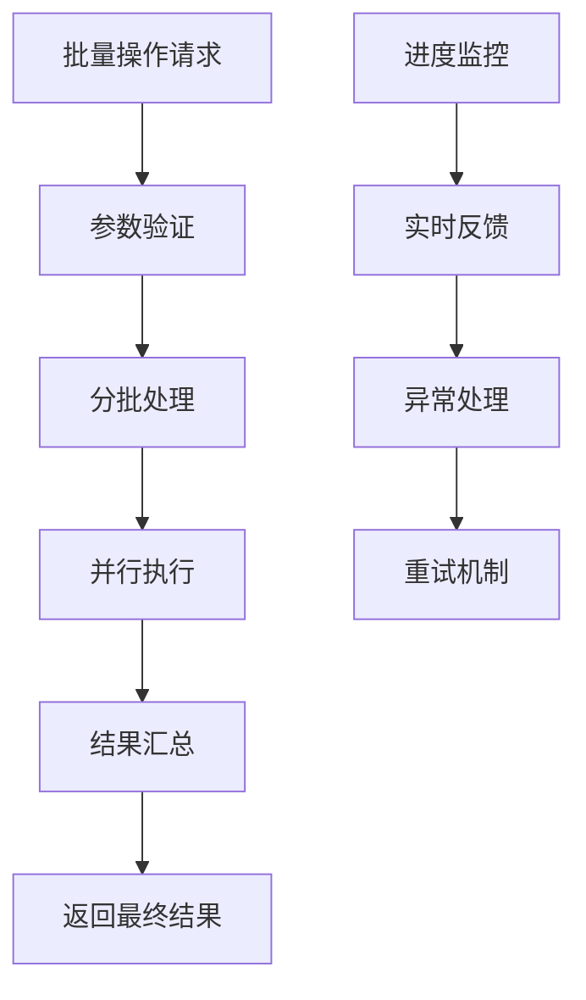

### 监控与告警

#### 关键指标监控

1. **响应时间**：好友操作平均响应时间
2. **成功率**：好友操作成功百分比
3. **并发数**：同时处理的好友请求数
4. **错误率**：各类错误的发生频率

#### 告警机制

- **性能告警**：响应时间超过阈值
- **错误告警**：错误率异常升高
- **容量告警**：数据库连接池使用率过高

## 总结

'浮生卷'的好友系统是一个设计精良、功能完整的游戏社交平台。通过深入分析其架构设计和实现细节，我们可以看到：

### 系统优势

1. **架构清晰**：采用分层架构，职责分明
2. **扩展性强**：预留接口支持功能扩展
3. **事务安全**：关键操作实施严格事务控制
4. **性能优化**：合理的索引设计和查询优化
5. **用户体验**：友好的操作界面和反馈机制

### 技术亮点

1. **双向关系管理**：确保好友关系的完整性
2. **状态化设计**：灵活的状态管理机制
3. **异常处理**：完善的错误处理和恢复机制
4. **数据库设计**：符合关系型数据库最佳实践
5. **服务解耦**：良好的服务间协作机制

### 发展方向

随着游戏的发展，好友系统可以在以下方面进一步完善：

1. **社交功能扩展**：添加更多社交互动功能
2. **性能持续优化**：针对大规模用户进行优化
3. **智能推荐**：基于玩家行为的好友推荐
4. **社交数据分析**：挖掘玩家社交行为模式
5. **跨平台支持**：支持多平台好友同步

这个好友系统为'浮生卷'游戏构建了一个坚实的社交基础，为玩家提供了丰富有趣的社交体验，同时也为未来的功能扩展奠定了良好的技术基础。