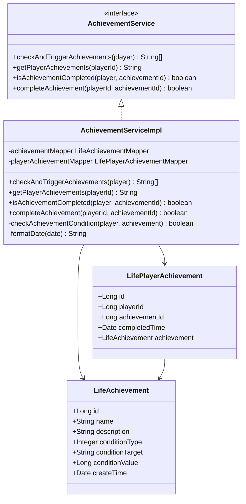
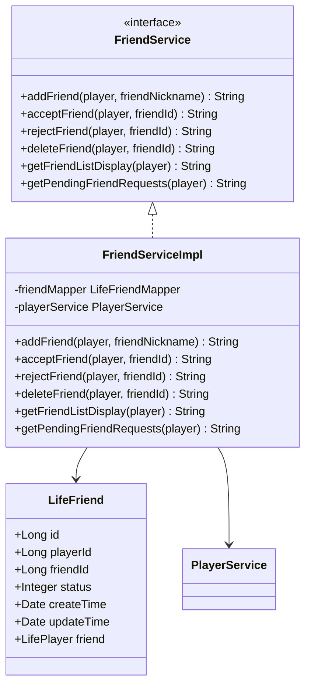
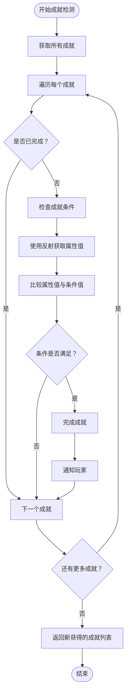
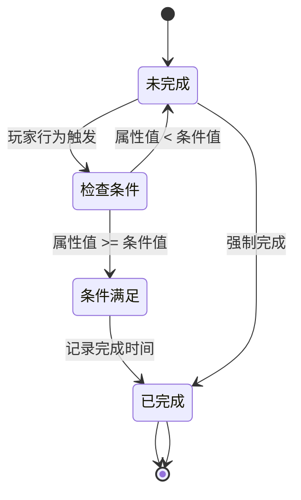
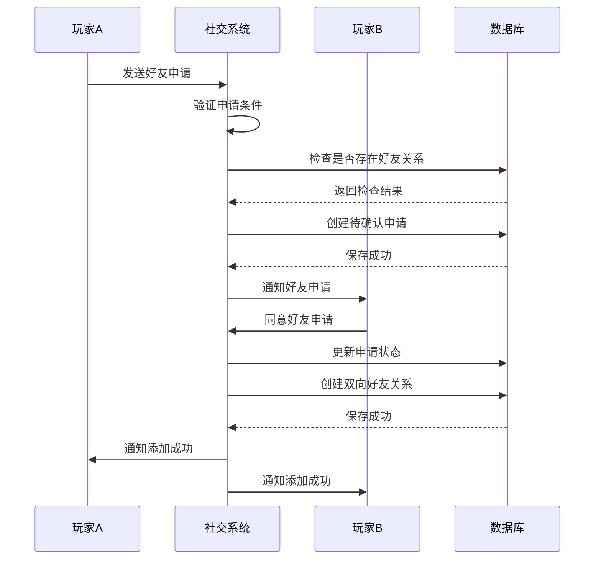
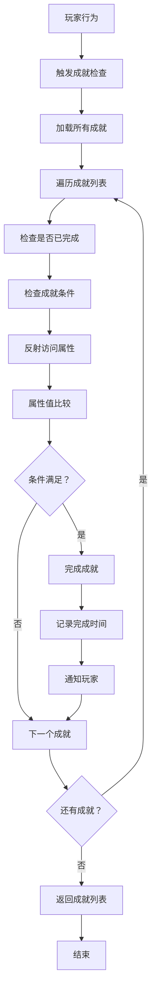
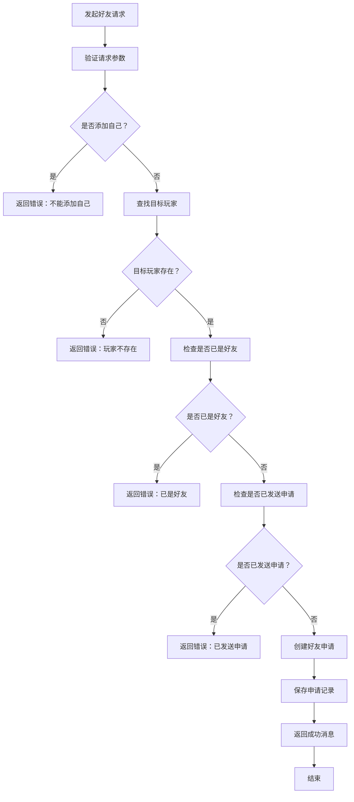

# 成就与社交系统

<cite>
**本文档引用的文件**
- [AchievementService.java](file://Life/src/main/java/com/bot/life/service/AchievementService.java)
- [FriendService.java](file://Life/src/main/java/com/bot/life/service/FriendService.java)
- [AchievementServiceImpl.java](file://Life/src/main/java/com/bot/life/service/impl/AchievementServiceImpl.java)
- [FriendServiceImpl.java](file://Life/src/main/java/com/bot/life/service/impl/FriendServiceImpl.java)
- [LifeAchievement.java](file://Life/src/main/java/com/bot/life/dao/entity/LifeAchievement.java)
- [LifePlayerAchievement.java](file://Life/src/main/java/com/bot/life/dao/entity/LifePlayerAchievement.java)
- [LifeFriend.java](file://Life/src/main/java/com/bot/life/dao/entity/LifeFriend.java)
- [LifeAchievementMapper.java](file://Life/src/main/java/com/bot/life/dao/mapper/LifeAchievementMapper.java)
- [LifePlayerAchievementMapper.java](file://Life/src/main/java/com/bot/life/dao/mapper/LifePlayerAchievementMapper.java)
- [LifeFriendMapper.java](file://Life/src/main/java/com/bot/life/dao/mapper/LifeFriendMapper.java)
- [LifeHandlerImpl.java](file://Life/src/main/java/com/bot/life/service/impl/LifeHandlerImpl.java)
- [Life_Database_Init.sql](file://Life_Database_Init.sql)
</cite>

## 目录
1. [系统概述](#系统概述)
2. [成就系统架构](#成就系统架构)
3. [社交系统架构](#社交系统架构)
4. [数据库表结构](#数据库表结构)
5. [成就系统详细分析](#成就系统详细分析)
6. [社交系统详细分析](#社交系统详细分析)
7. [核心业务流程](#核心业务流程)
8. [扩展开发指南](#扩展开发指南)
9. [总结](#总结)

## 系统概述

'浮生卷'游戏中的成就与社交系统是一个完整的玩家互动和成就达成机制，包含两个核心子系统：

### 成就系统
- **成就检测机制**：基于玩家属性和等级条件的自动化成就检查
- **成就管理**：成就的创建、分配、状态跟踪和完成验证
- **动态条件评估**：通过反射机制动态检查玩家属性条件

### 社交系统
- **好友管理**：好友添加、删除、申请处理和关系维护
- **双向关系**：建立互惠的好友关系网络
- **互动支持**：邮件系统和基本社交功能

## 成就系统架构



**图表来源**
- [AchievementService.java](file://Life/src/main/java/com/bot/life/service/AchievementService.java#L11-L42)
- [AchievementServiceImpl.java](file://Life/src/main/java/com/bot/life/service/impl/AchievementServiceImpl.java#L21-L136)
- [LifeAchievement.java](file://Life/src/main/java/com/bot/life/dao/entity/LifeAchievement.java#L11-L21)
- [LifePlayerAchievement.java](file://Life/src/main/java/com/bot/life/dao/entity/LifePlayerAchievement.java#L11-L21)

## 社交系统架构



**图表来源**
- [FriendService.java](file://Life/src/main/java/com/bot/life/service/FriendService.java#L9-L56)
- [FriendServiceImpl.java](file://Life/src/main/java/com/bot/life/service/impl/FriendServiceImpl.java#L18-L177)
- [LifeFriend.java](file://Life/src/main/java/com/bot/life/dao/entity/LifeFriend.java#L11-L23)

## 数据库表结构

### 成就相关表结构

| 表名 | 字段 | 类型 | 说明 |
|------|------|------|------|
| `life_achievement` | `id` | bigint | 主键，成就唯一标识 |
| | `name` | varchar(50) | 成就名称 |
| | `description` | text | 成就描述 |
| | `condition_type` | tinyint | 条件类型：1属性达到2等级达到 |
| | `condition_target` | varchar(20) | 条件目标字段名 |
| | `condition_value` | bigint | 条件数值要求 |
| | `create_time` | datetime | 创建时间 |

| 表名 | 字段 | 类型 | 说明 |
|------|------|------|------|
| `life_player_achievement` | `id` | bigint | 主键，玩家成就记录唯一标识 |
| | `player_id` | bigint | 玩家ID |
| | `achievement_id` | bigint | 成就ID |
| | `completed_time` | datetime | 完成时间 |

### 社交相关表结构

| 表名 | 字段 | 类型 | 说明 |
|------|------|------|------|
| `life_friend` | `id` | bigint | 主键，好友关系唯一标识 |
| | `player_id` | bigint | 玩家ID |
| | `friend_id` | bigint | 好友ID |
| | `status` | tinyint | 状态：0待确认1已同意 |
| | `create_time` | datetime | 创建时间 |
| | `update_time` | datetime | 更新时间 |

**节来源**
- [Life_Database_Init.sql](file://Life_Database_Init.sql#L216-L260)

## 成就系统详细分析

### 成就条件检测机制

成就系统的核心是基于玩家属性和等级的自动化检测机制：



**图表来源**
- [AchievementServiceImpl.java](file://Life/src/main/java/com/bot/life/service/impl/AchievementServiceImpl.java#L31-L53)

### 成就条件类型

系统支持两种主要的成就条件类型：

1. **属性达到型**：基于玩家具体属性值的成就
   - 示例：攻击力达到100
   - 检测字段：`attack_power`
   - 条件值：100

2. **等级达到型**：基于玩家等级的成就
   - 示例：达到50级
   - 检测字段：`level`
   - 条件值：50

### 成就状态管理



**节来源**
- [AchievementServiceImpl.java](file://Life/src/main/java/com/bot/life/service/impl/AchievementServiceImpl.java#L105-L125)

## 社交系统详细分析

### 好友关系管理流程

社交系统实现了完整的好友关系生命周期管理：



**图表来源**
- [FriendServiceImpl.java](file://Life/src/main/java/com/bot/life/service/impl/FriendServiceImpl.java#L28-L98)

### 好友状态管理

| 状态值 | 状态名称 | 说明 |
|--------|----------|------|
| 0 | 待确认 | 好友申请已发送，等待对方确认 |
| 1 | 已同意 | 双方已建立好友关系 |

### 社交功能模块

1. **好友添加**
   - 验证目标玩家存在性
   - 检查是否已是好友
   - 创建待确认申请

2. **申请处理**
   - 同意申请：建立双向好友关系
   - 拒绝申请：删除申请记录

3. **好友列表管理**
   - 查看好友列表
   - 查看待处理申请
   - 好友信息展示

**节来源**
- [FriendServiceImpl.java](file://Life/src/main/java/com/bot/life/service/impl/FriendServiceImpl.java#L28-L177)

## 核心业务流程

### 成就达成流程



**图表来源**
- [AchievementServiceImpl.java](file://Life/src/main/java/com/bot/life/service/impl/AchievementServiceImpl.java#L31-L53)

### 好友互动流程



**图表来源**
- [FriendServiceImpl.java](file://Life/src/main/java/com/bot/life/service/impl/FriendServiceImpl.java#L28-L66)

## 扩展开发指南

### 添加新的成就类型

1. **扩展成就条件类型**
   - 在`LifeAchievement`实体中添加新的条件类型常量
   - 在`AchievementServiceImpl.checkAchievementCondition()`方法中添加新的条件判断逻辑

2. **新增成就条件字段**
   ```java
   // 示例：添加任务完成条件
   private boolean checkTaskCompletionCondition(LifePlayer player, LifeAchievement achievement) {
       // 实现任务完成条件检查逻辑
   }
   ```

3. **数据库迁移**
   ```sql
   ALTER TABLE life_achievement ADD COLUMN condition_param VARCHAR(100) COMMENT '条件参数';
   ```

### 扩展社交功能

1. **添加新的社交功能**
   ```java
   // 在FriendService接口中添加新方法
   String sendGift(LifePlayer player, Long friendId, Long giftId);
   
   // 在FriendServiceImpl中实现
   @Override
   public String sendGift(LifePlayer player, Long friendId, Long giftId) {
       // 实现礼物赠送逻辑
   }
   ```

2. **扩展好友状态**
   ```sql
   ALTER TABLE life_friend ADD COLUMN last_interaction DATETIME COMMENT '最后互动时间';
   ```

3. **实现批量操作**
   ```java
   // 批量添加好友
   String batchAddFriends(LifePlayer player, List<String> nicknames);
   ```

### 性能优化建议

1. **成就检测优化**
   - 实现成就缓存机制
   - 使用事件驱动的方式触发成就检查
   - 对频繁检查的成就设置检查间隔

2. **社交系统优化**
   - 实现好友关系缓存
   - 使用异步处理好友申请
   - 添加好友列表分页功能

**节来源**
- [AchievementServiceImpl.java](file://Life/src/main/java/com/bot/life/service/impl/AchievementServiceImpl.java#L105-L125)
- [FriendServiceImpl.java](file://Life/src/main/java/com/bot/life/service/impl/FriendServiceImpl.java#L28-L66)

## 总结

'浮生卷'的成就与社交系统展现了现代游戏开发中玩家互动和成就感构建的最佳实践：

### 系统优势

1. **自动化程度高**：成就系统通过反射机制实现动态条件检测，无需手动编写每个成就的检查逻辑
2. **扩展性强**：清晰的接口设计和模块化架构便于功能扩展
3. **用户体验好**：即时反馈和直观的状态展示提升了玩家参与感
4. **数据结构合理**：清晰的表结构设计支持高效的查询和维护

### 技术亮点

1. **反射技术应用**：巧妙地使用Java反射机制实现通用的属性条件检查
2. **事务一致性**：好友系统中的双向关系保证了数据的一致性
3. **状态管理模式**：明确的状态定义和转换规则确保了系统的稳定性
4. **异常处理机制**：完善的异常捕获和错误处理提高了系统的健壮性

### 发展方向

1. **成就系统增强**：可以考虑添加组合成就、隐藏成就等更复杂的成就类型
2. **社交功能扩展**：增加群组系统、公会系统等更丰富的社交功能
3. **数据分析支持**：添加成就达成统计和社交活跃度分析功能
4. **移动端适配**：优化移动端的交互体验

这个系统为'浮生卷'游戏提供了坚实的社交和成就基础，不仅增强了游戏的趣味性和粘性，也为未来的功能扩展奠定了良好的技术基础。