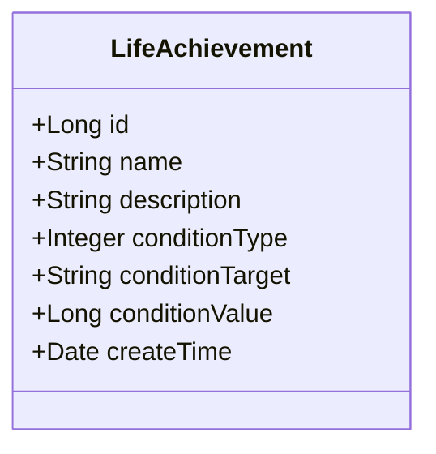
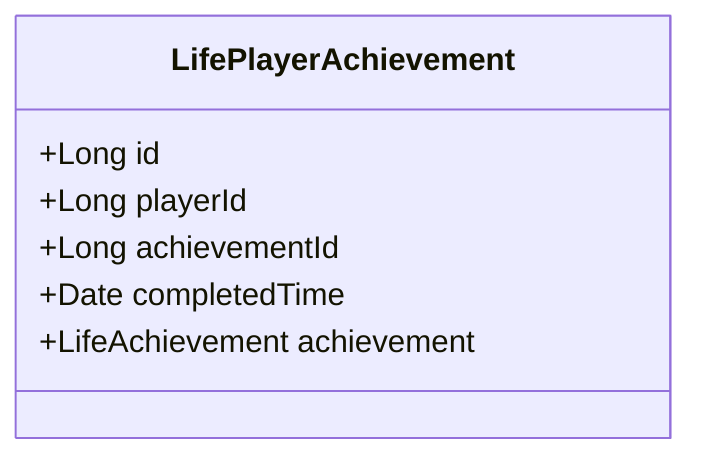
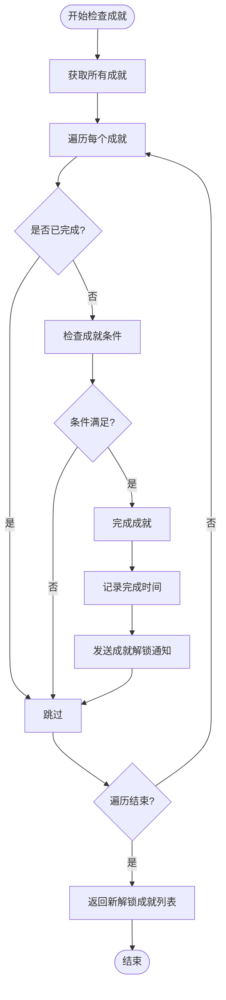
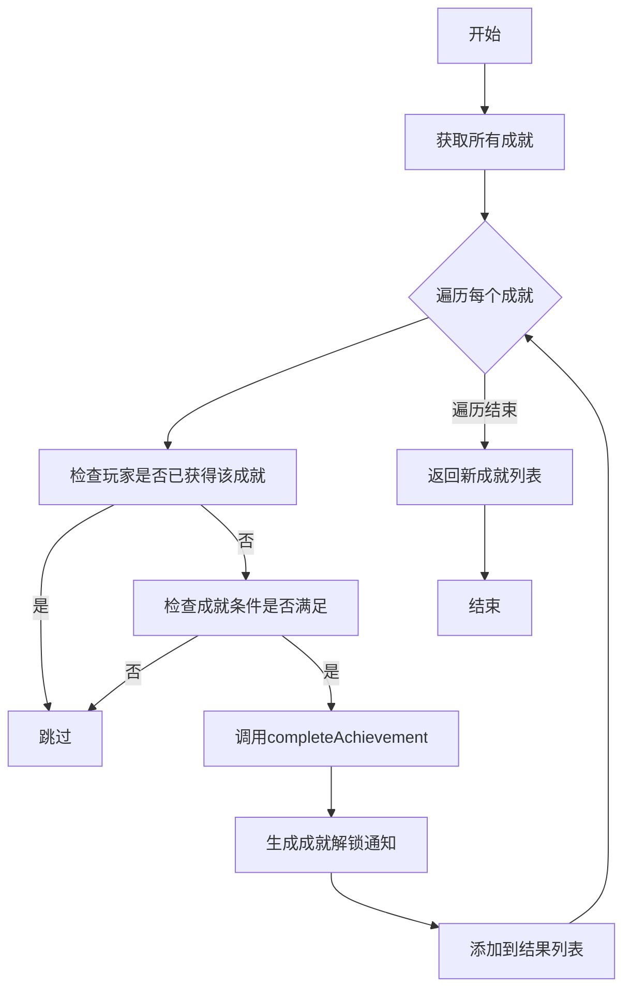
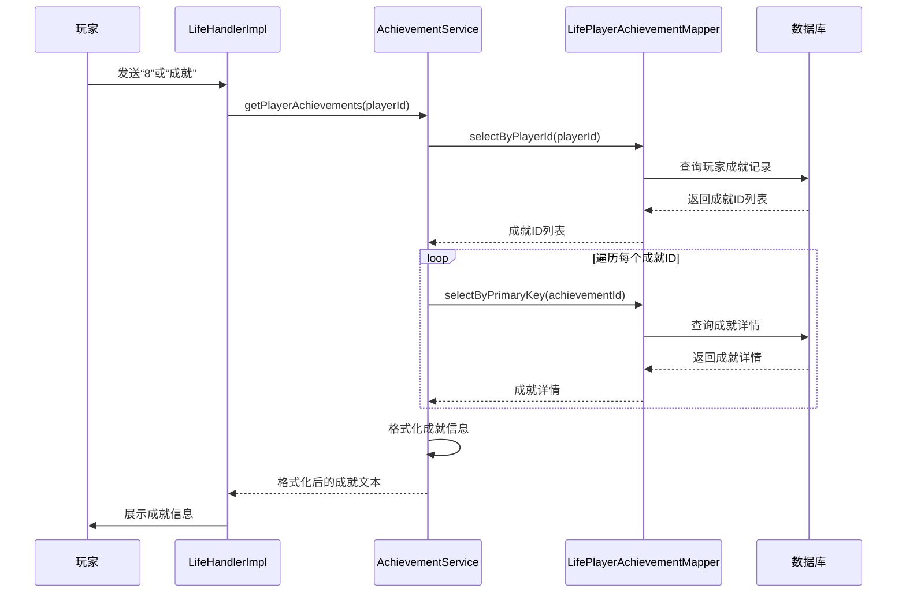

# 成就系统

<cite>
**本文档引用文件**  
- [LifeAchievement.java](file://Life/src/main/java/com/bot/life/dao/entity/LifeAchievement.java)
- [AchievementService.java](file://Life/src/main/java/com/bot/life/service/AchievementService.java)
- [AchievementServiceImpl.java](file://Life/src/main/java/com/bot/life/service/impl/AchievementServiceImpl.java)
- [LifePlayer.java](file://Life/src/main/java/com/bot/life/dao/entity/LifePlayer.java)
- [LifePlayerAchievement.java](file://Life/src/main/java/com/bot/life/dao/entity/LifePlayerAchievement.java)
- [LifeAchievementMapper.java](file://Life/src/main/java/com/bot/life/dao/mapper/LifeAchievementMapper.java)
- [LifePlayerAchievementMapper.java](file://Life/src/main/java/com/bot/life/dao/mapper/LifePlayerAchievementMapper.java)
- [Life_Database_Init.sql](file://Life_Database_Init.sql)
- [LifeAchievementMapper.xml](file://Life/src/main/resources/mapper/LifeAchievementMapper.xml)
- [LifePlayerAchievementMapper.xml](file://Life/src/main/resources/mapper/LifePlayerAchievementMapper.xml)
- [LifeHandlerImpl.java](file://Life/src/main/java/com/bot/life/service/impl/LifeHandlerImpl.java)
</cite>

## 目录
1. [引言](#引言)
2. [核心数据结构](#核心数据结构)
3. [成就条件设计](#成就条件设计)
4. [成就检测与触发机制](#成就检测与触发机制)
5. [数据库表结构](#数据库表结构)
6. [成就服务接口](#成就服务接口)
7. [成就系统扩展指南](#成就系统扩展指南)
8. [成就查询与展示流程](#成就查询与展示流程)
9. [常见问题排查](#常见问题排查)
10. [总结](#总结)

## 引言

“浮生卷”游戏中的成就系统为玩家提供了目标导向的游戏体验，通过完成特定条件来解锁成就并获得奖励。本系统基于Java Spring框架实现，采用MyBatis作为持久层框架，通过反射机制动态检查玩家属性，实现了灵活的成就判定逻辑。成就系统不仅增强了游戏的可玩性，还为玩家的成长路径提供了明确指引。

## 核心数据结构

### LifeAchievement 实体

`LifeAchievement` 实体定义了成就的基本信息和完成条件，是成就系统的核心数据结构。



**图源**  
- [LifeAchievement.java](file://Life/src/main/java/com/bot/life/dao/entity/LifeAchievement.java)

### LifePlayerAchievement 实体

`LifePlayerAchievement` 实体记录了玩家与成就之间的关联关系，表示某个玩家已完成的特定成就。



**图源**  
- [LifePlayerAchievement.java](file://Life/src/main/java/com/bot/life/dao/entity/LifePlayerAchievement.java)

**本节源码**  
- [LifeAchievement.java](file://Life/src/main/java/com/bot/life/dao/entity/LifeAchievement.java#L1-L21)
- [LifePlayerAchievement.java](file://Life/src/main/java/com/bot/life/dao/entity/LifePlayerAchievement.java#L1-L21)

## 成就条件设计

成就的完成条件由三个核心字段构成：`conditionType`（条件类型）、`conditionTarget`（目标字段）和`conditionValue`（目标值），通过这种设计实现了高度灵活的条件配置。

### 条件类型 (conditionType)

`conditionType` 字段定义了成就的判定类型，目前支持两种基本类型：

| 条件类型 | 说明 |
|---------|------|
| 1 | 属性达到指定数值 |
| 2 | 等级达到指定数值 |

### 目标字段 (conditionTarget)

`conditionTarget` 字段指定了需要检查的玩家属性字段名称，该字段值对应于`LifePlayer`实体中的属性名，如`level`、`experience`、`health`等。系统通过Java反射机制，根据此字段名动态获取玩家对应属性的当前值。

### 目标值 (conditionValue)

`conditionValue` 字段定义了完成成就所需达到的具体数值。该值与`conditionTarget`字段所指向的玩家属性值进行比较，当玩家属性值大于或等于此目标值时，成就条件即被满足。

**本节源码**  
- [LifeAchievement.java](file://Life/src/main/java/com/bot/life/dao/entity/LifeAchievement.java#L16-L18)
- [LifePlayer.java](file://Life/src/main/java/com/bot/life/dao/entity/LifePlayer.java#L14-L52)

## 成就检测与触发机制

成就系统的检测与触发流程由`AchievementServiceImpl`类实现，主要包含检查、判定、完成和奖励发放四个环节。

### 检测触发流程



**图源**  
- [AchievementServiceImpl.java](file://Life/src/main/java/com/bot/life/service/impl/AchievementServiceImpl.java#L31-L54)

### 条件判定逻辑

系统通过反射机制动态检查玩家属性是否满足成就条件。`checkAchievementCondition`方法根据`conditionTarget`字段名，使用反射获取`LifePlayer`对象中对应字段的值，并与`conditionValue`进行比较。

```mermaid
sequenceDiagram
participant Player as 玩家
participant Service as AchievementServiceImpl
participant Mapper as LifeAchievementMapper
participant DB as 数据库
Service->>Mapper : selectAll()
Mapper->>DB : 查询所有成就
DB-->>Mapper : 返回成就列表
Mapper-->>Service : 成就列表
loop 遍历每个成就
Service->>Service : selectByPlayerIdAndAchievementId()
Service->>Service : 检查是否已获得
alt 未获得
Service->>Service : checkAchievementCondition()
Service->>Service : 使用反射获取玩家属性
Service->>Service : 比较属性值与目标值
alt 满足条件
Service->>Service : completeAchievement()
Service->>Service : 插入玩家成就记录
Service->>Service : 生成成就解锁通知
end
end
end
Service-->> : 返回新成就列表
```

**图源**  
- [AchievementServiceImpl.java](file://Life/src/main/java/com/bot/life/service/impl/AchievementServiceImpl.java#L105-L125)

**本节源码**  
- [AchievementServiceImpl.java](file://Life/src/main/java/com/bot/life/service/impl/AchievementServiceImpl.java#L31-L125)

## 数据库表结构

成就系统涉及两个核心数据库表：`life_achievement`（成就基础表）和`life_player_achievement`（玩家成就关联表），二者通过外键关系建立关联。

### 成就基础表 (life_achievement)

该表存储所有成就的定义信息。

| 字段名 | 类型 | 约束 | 说明 |
|-------|------|------|------|
| id | BIGINT | PRIMARY KEY, AUTO_INCREMENT | 主键 |
| name | VARCHAR(50) | NOT NULL | 成就名称 |
| description | TEXT | | 成就描述 |
| condition_type | TINYINT | NOT NULL | 条件类型：1属性达到2等级达到 |
| condition_target | VARCHAR(20) | NOT NULL | 条件目标字段 |
| condition_value | BIGINT | NOT NULL | 条件数值 |
| create_time | DATETIME | DEFAULT CURRENT_TIMESTAMP | 创建时间 |

```sql
CREATE TABLE IF NOT EXISTS `life_achievement` (
  `id` bigint NOT NULL AUTO_INCREMENT,
  `name` varchar(50) NOT NULL COMMENT '成就名称',
  `description` text COMMENT '成就描述',
  `condition_type` tinyint NOT NULL COMMENT '条件类型：1属性达到2等级达到',
  `condition_target` varchar(20) NOT NULL COMMENT '条件目标字段',
  `condition_value` bigint NOT NULL COMMENT '条件数值',
  `create_time` datetime DEFAULT CURRENT_TIMESTAMP,
  PRIMARY KEY (`id`)
) ENGINE=InnoDB DEFAULT CHARSET=utf8mb4 COMMENT='成就表';
```

**本节源码**  
- [Life_Database_Init.sql](file://Life_Database_Init.sql#L217-L226)

### 玩家成就关联表 (life_player_achievement)

该表记录玩家与成就的关联关系，表示玩家已完成的成就。

| 字段名 | 类型 | 约束 | 说明 |
|-------|------|------|------|
| id | BIGINT | PRIMARY KEY, AUTO_INCREMENT | 主键 |
| player_id | BIGINT | NOT NULL | 玩家ID |
| achievement_id | BIGINT | NOT NULL | 成就ID |
| completed_time | DATETIME | DEFAULT CURRENT_TIMESTAMP | 完成时间 |

**外键约束**：`player_id` 关联 `life_player(id)`，`achievement_id` 关联 `life_achievement(id)`。

**唯一索引**：`uk_player_achievement` (`player_id`, `achievement_id`) 确保同一玩家不能重复获得同一成就。

```sql
CREATE TABLE IF NOT EXISTS `life_player_achievement` (
  `id` bigint NOT NULL AUTO_INCREMENT,
  `player_id` bigint NOT NULL COMMENT '玩家ID',
  `achievement_id` bigint NOT NULL COMMENT '成就ID',
  `completed_time` datetime DEFAULT CURRENT_TIMESTAMP COMMENT '完成时间',
  PRIMARY KEY (`id`),
  UNIQUE KEY `uk_player_achievement` (`player_id`, `achievement_id`)
) ENGINE=InnoDB DEFAULT CHARSET=utf8mb4 COMMENT='玩家成就表';
```

**本节源码**  
- [Life_Database_Init.sql](file://Life_Database_Init.sql#L241-L248)

## 成就服务接口

`AchievementService` 接口定义了成就系统的核心功能，`AchievementServiceImpl` 类提供了具体实现。

### 核心接口方法

| 方法 | 参数 | 返回值 | 说明 |
|------|------|--------|------|
| checkAndTriggerAchievements | LifePlayer player | List<String> | 检查并触发玩家所有可能完成的成就，返回新解锁成就描述列表 |
| getPlayerAchievements | Long playerId | String | 获取指定玩家的已获得成就列表，格式化为可展示的字符串 |
| isAchievementCompleted | LifePlayer player, Long achievementId | boolean | 检查特定成就是否已完成 |
| completeAchievement | Long playerId, Long achievementId | boolean | 完成指定成就，记录完成时间 |

### 服务实现关键逻辑

`checkAndTriggerAchievements` 方法是成就系统的核心，它在每次玩家执行关键操作后被调用，系统性地检查所有未完成的成就是否满足条件。



**本节源码**  
- [AchievementService.java](file://Life/src/main/java/com/bot/life/service/AchievementService.java#L1-L43)
- [AchievementServiceImpl.java](file://Life/src/main/java/com/bot/life/service/impl/AchievementServiceImpl.java#L21-L137)

## 成就系统扩展指南

### 添加新的成就类型

1. **修改 conditionType 枚举**：在代码中定义新的条件类型常量。
2. **更新数据库**：如果需要，可以修改`life_achievement`表结构以支持新类型。
3. **扩展判定逻辑**：在`checkAchievementCondition`方法中添加对新`conditionType`的处理分支。

### 添加新的条件判断逻辑

1. **确定目标字段**：确保`LifePlayer`实体中存在需要检查的属性字段。
2. **创建新成就**：通过SQL或管理后台插入新的成就记录，设置`conditionTarget`为新字段名，`conditionValue`为目标值。
3. **测试验证**：确保反射机制能正确获取新字段的值并进行比较。

### 示例：添加“灵粹达人”成就

```sql
INSERT INTO `life_achievement` 
(`name`, `description`, `condition_type`, `condition_target`, `condition_value`) 
VALUES 
('灵粹达人', '拥有10000灵粹', 1, 'spirit', 10000);
```

此成就将检查玩家的`spirit`（灵粹）属性是否达到10000。

**本节源码**  
- [LifePlayer.java](file://Life/src/main/java/com/bot/life/dao/entity/LifePlayer.java#L43)
- [AchievementServiceImpl.java](file://Life/src/main/java/com/bot/life/service/impl/AchievementServiceImpl.java#L105-L125)

## 成就查询与展示流程

玩家通过游戏内菜单触发成就查询，系统执行以下流程：



**图源**  
- [LifeHandlerImpl.java](file://Life/src/main/java/com/bot/life/service/impl/LifeHandlerImpl.java#L607-L610)
- [AchievementServiceImpl.java](file://Life/src/main/java/com/bot/life/service/impl/AchievementServiceImpl.java#L57-L77)

**本节源码**  
- [LifeHandlerImpl.java](file://Life/src/main/java/com/bot/life/service/impl/LifeHandlerImpl.java#L607-L610)
- [AchievementServiceImpl.java](file://Life/src/main/java/com/bot/life/service/impl/AchievementServiceImpl.java#L57-L77)

## 常见问题排查

### 成就未触发

1. **检查玩家属性**：确认玩家的`conditionTarget`字段值是否确实达到了`conditionValue`。
2. **检查触发时机**：确认`checkAndTriggerAchievements`方法是否在正确的时机被调用（如角色信息更新后）。
3. **查看日志**：检查`checkAchievementCondition`方法中的异常打印，确认反射获取字段时是否出错。
4. **验证数据一致性**：确保`life_achievement`表中的`condition_target`字段名与`LifePlayer`实体中的属性名完全一致（包括大小写）。

### 重复获得成就

1. **检查唯一性约束**：确认`life_player_achievement`表上的`uk_player_achievement`唯一索引已正确创建。
2. **检查完成逻辑**：在`completeAchievement`方法中，首先会查询该玩家是否已获得该成就，避免重复插入。

### 性能优化建议

1. **缓存成就数据**：对于不常变动的成就定义，可以考虑在应用启动时加载到内存缓存中，避免频繁查询数据库。
2. **批量处理**：在检查成就时，可以考虑批量查询玩家成就状态，减少数据库交互次数。

**本节源码**  
- [AchievementServiceImpl.java](file://Life/src/main/java/com/bot/life/service/impl/AchievementServiceImpl.java#L84-L103)
- [LifePlayerAchievementMapper.xml](file://Life/src/main/resources/mapper/LifePlayerAchievementMapper.xml#L30-L34)

## 总结

“浮生卷”游戏的成就系统通过`LifeAchievement`和`LifePlayerAchievement`两个核心实体，结合灵活的条件设计（`conditionType`、`conditionTarget`、`conditionValue`），实现了可扩展的成就判定机制。系统利用反射技术动态检查玩家属性，避免了硬编码，使得添加新成就变得简单高效。通过`AchievementService`接口和`AchievementServiceImpl`实现，提供了完整的成就管理功能，包括检查、触发、查询和展示。数据库层面通过合理的表结构设计和索引优化，保证了数据的一致性和查询效率。该系统设计清晰、扩展性强，为游戏增添了丰富的可玩性和目标感。