# 邮件系统技术文档

<cite>
**本文档引用的文件**
- [LifeMail.java](file://Life/src/main/java/com/bot/life/dao/entity/LifeMail.java)
- [MailServiceImpl.java](file://Life/src/main/java/com/bot/life/service/impl/MailServiceImpl.java)
- [MailService.java](file://Life/src/main/java/com/bot/life/service/MailService.java)
- [LifeMailMapper.java](file://Life/src/main/java/com/bot/life/dao/mapper/LifeMailMapper.java)
- [LifeMailMapper.xml](file://Life/src/main/resources/mapper/LifeMailMapper.xml)
- [LifeHandlerImpl.java](file://Life/src/main/java/com/bot/life/service/impl/LifeHandlerImpl.java)
- [Life_Database_Init.sql](file://Life_Database_Init.sql)
- [Life_User_Manual.md](file://Life_User_Manual.md)
</cite>

## 目录
1. [系统概述](#系统概述)
2. [项目架构](#项目架构)
3. [核心组件分析](#核心组件分析)
4. [数据库设计](#数据库设计)
5. [业务逻辑详解](#业务逻辑详解)
6. [邮件类型与应用场景](#邮件类型与应用场景)
7. [性能优化策略](#性能优化策略)
8. [扩展开发指南](#扩展开发指南)
9. [故障排除与最佳实践](#故障排除与最佳实践)
10. [总结](#总结)

## 系统概述

浮生卷游戏的邮件系统是一个完整的异步通信机制，为玩家提供便捷的信息传递和奖励发放功能。该系统支持好友间通信、系统通知、成就奖励等多种应用场景，是游戏社交互动的核心基础设施。

### 核心特性

- **双类型邮件支持**：系统邮件和好友邮件两种类型
- **附件功能**：支持道具、装备等物品附件
- **状态管理**：完整的邮件生命周期管理
- **权限控制**：严格的邮件访问权限验证
- **异步处理**：基于Spring框架的异步消息处理

## 项目架构

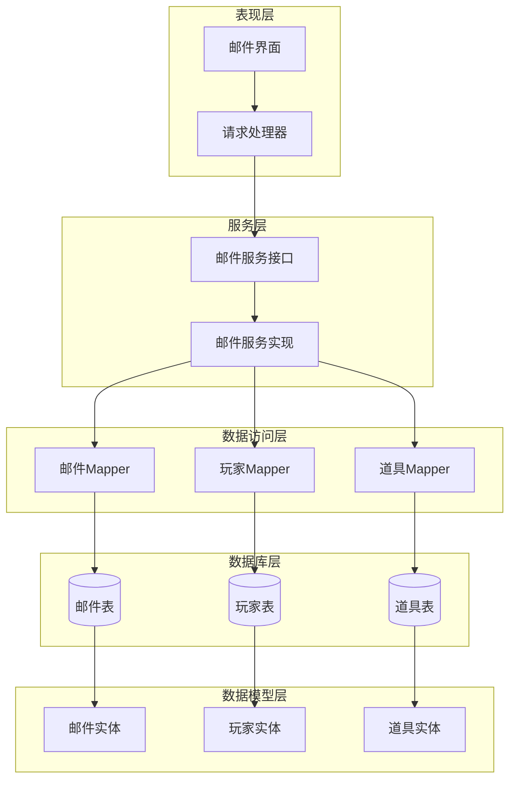

**图表来源**
- [MailService.java](file://Life/src/main/java/com/bot/life/service/MailService.java#L1-L74)
- [MailServiceImpl.java](file://Life/src/main/java/com/bot/life/service/impl/MailServiceImpl.java#L1-L355)
- [LifeMailMapper.java](file://Life/src/main/java/com/bot/life/dao/mapper/LifeMailMapper.java#L1-L47)

## 核心组件分析

### LifeMail 实体结构

LifeMail 是邮件系统的核心数据模型，采用简洁而完整的字段设计：

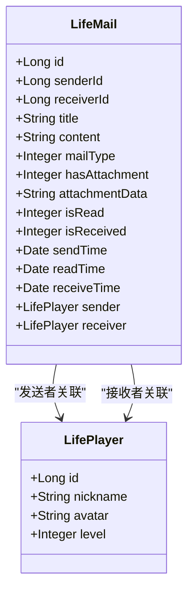

**图表来源**
- [LifeMail.java](file://Life/src/main/java/com/bot/life/dao/entity/LifeMail.java#L12-L30)

#### 字段设计考量

| 字段名 | 类型 | 设计考量 |
|--------|------|----------|
| `id` | Long | 自增主键，确保唯一性 |
| `senderId` | Long | 发件人ID，支持系统邮件(0) |
| `receiverId` | Long | 收件人ID，建立用户关联 |
| `title` | String | 邮件主题，长度限制100字符 |
| `content` | String | 邮件正文，支持长文本 |
| `mailType` | Integer | 邮件类型：1系统邮件2好友邮件 |
| `hasAttachment` | Integer | 附件存在标志：0无1有 |
| `attachmentData` | String | JSON格式附件数据 |
| `isRead` | Integer | 已读状态：0未读1已读 |
| `isReceived` | Integer | 附件领取状态：0未领取1已领取 |
| `sendTime` | Date | 发送时间戳 |
| `readTime` | Date | 阅读时间戳 |
| `receiveTime` | Date | 领取时间戳 |

**章节来源**
- [LifeMail.java](file://Life/src/main/java/com/bot/life/dao/entity/LifeMail.java#L12-L30)

### MailService 接口设计

邮件服务接口定义了核心业务方法：

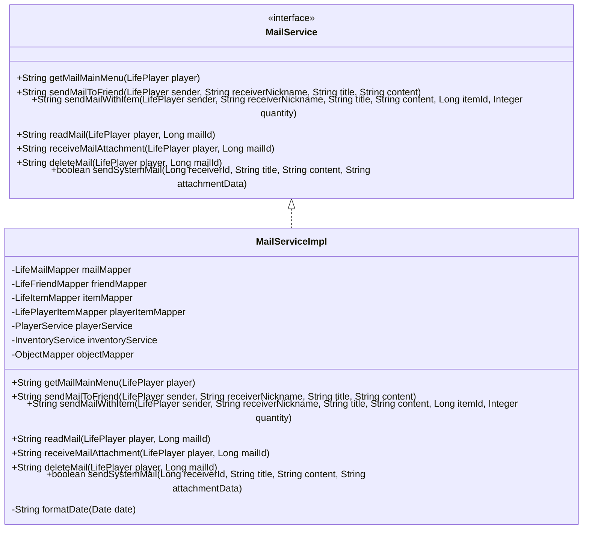

**图表来源**
- [MailService.java](file://Life/src/main/java/com/bot/life/service/MailService.java#L9-L74)
- [MailServiceImpl.java](file://Life/src/main/java/com/bot/life/service/impl/MailServiceImpl.java#L22-L355)

**章节来源**
- [MailService.java](file://Life/src/main/java/com/bot/life/service/MailService.java#L1-L74)

## 数据库设计

### 邮件表结构

基于SQL初始化脚本的邮件表设计：

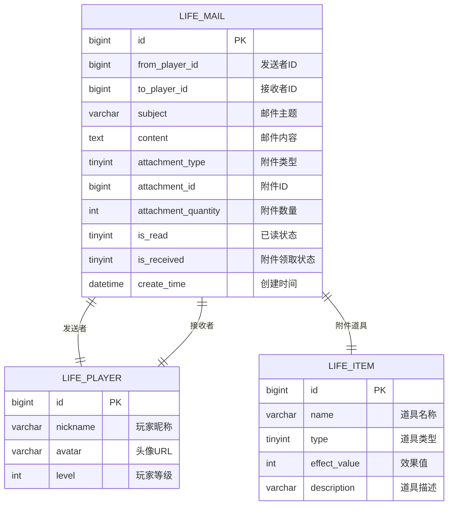

**图表来源**
- [Life_Database_Init.sql](file://Life_Database_Init.sql#L263-L277)

### 索引策略

| 索引类型 | 字段 | 用途 | 性能影响 |
|----------|------|------|----------|
| 主键索引 | `id` | 唯一标识 | 极高查询效率 |
| 普通索引 | `to_player_id` | 按接收者查询 | 高查询效率 |
| 复合索引 | `(to_player_id, is_read)` | 统计未读邮件 | 中等查询效率 |
| 时间索引 | `create_time` | 按时间排序 | 中等查询效率 |

### 分页查询优化

系统采用分页策略限制邮件列表显示：

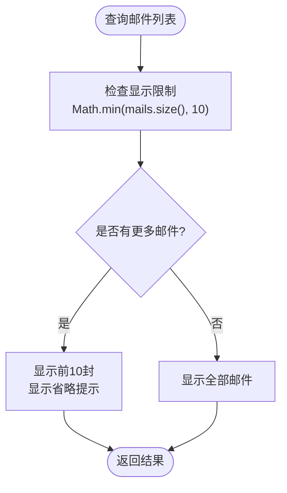

**图表来源**
- [MailServiceImpl.java](file://Life/src/main/java/com/bot/life/service/impl/MailServiceImpl.java#L58-L71)

**章节来源**
- [Life_Database_Init.sql](file://Life_Database_Init.sql#L263-L277)
- [LifeMailMapper.xml](file://Life/src/main/resources/mapper/LifeMailMapper.xml#L40-L49)

## 业务逻辑详解

### 邮件发送流程

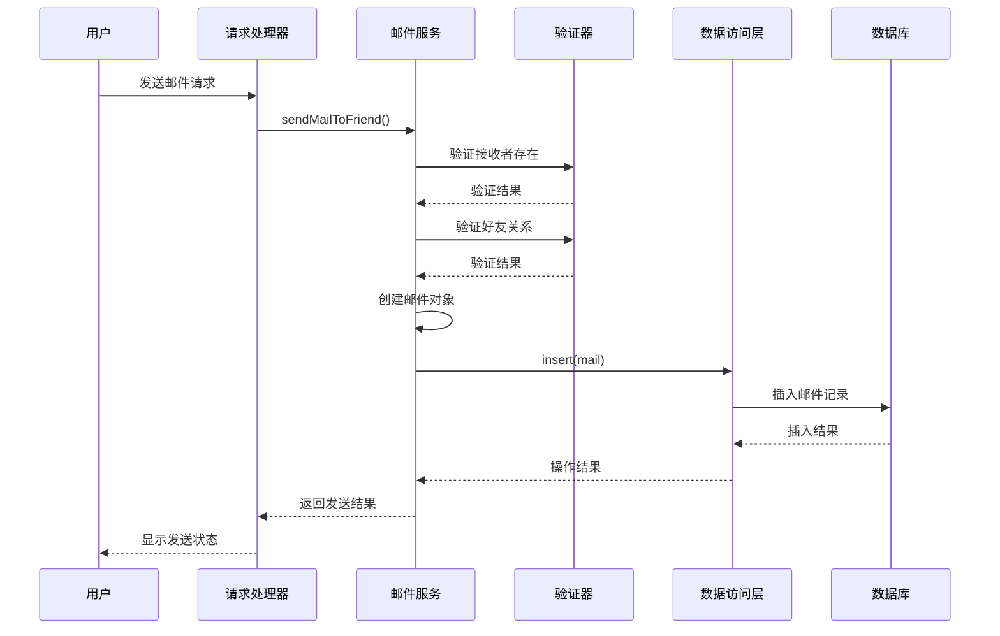

**图表来源**
- [MailServiceImpl.java](file://Life/src/main/java/com/bot/life/service/impl/MailServiceImpl.java#L85-L118)
- [LifeHandlerImpl.java](file://Life/src/main/java/com/bot/life/service/impl/LifeHandlerImpl.java#L689-L707)

### 附件处理机制

系统支持JSON格式的附件数据，支持多种附件类型：

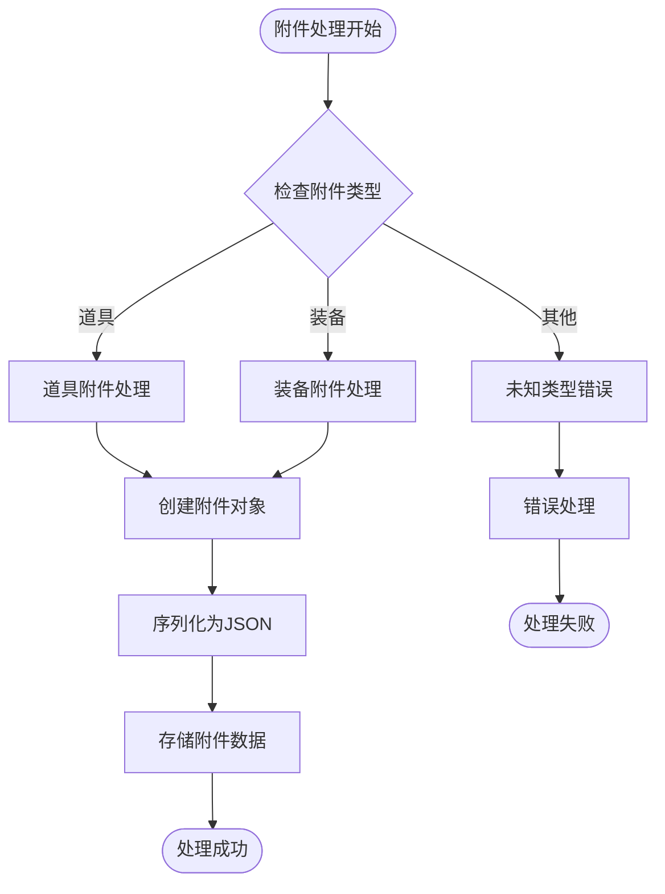

**图表来源**
- [MailServiceImpl.java](file://Life/src/main/java/com/bot/life/service/impl/MailServiceImpl.java#L147-L179)

### 状态流转管理

邮件状态遵循严格的流转规则：

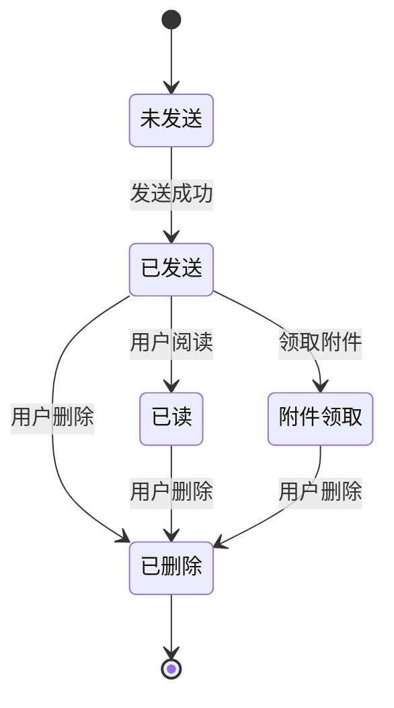

**章节来源**
- [MailServiceImpl.java](file://Life/src/main/java/com/bot/life/service/impl/MailServiceImpl.java#L85-L355)

## 邮件类型与应用场景

### 系统邮件

系统邮件用于游戏内各种通知和奖励发放：

| 应用场景 | 邮件类型 | 附件类型 | 发送时机 |
|----------|----------|----------|----------|
| 成就奖励 | 系统邮件 | 道具/称号 | 成就达成时 |
| 活动通知 | 系统邮件 | 文本内容 | 活动开始/结束 |
| 系统公告 | 系统邮件 | 文本内容 | 系统维护/更新 |
| 定时奖励 | 系统邮件 | 道具/灵粹 | 定时发放 |

### 好友邮件

好友邮件支持玩家间的直接通信：

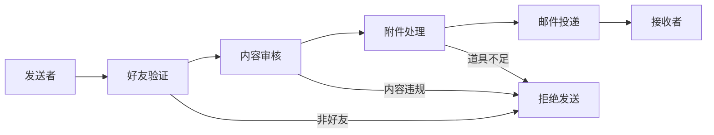

**图表来源**
- [MailServiceImpl.java](file://Life/src/main/java/com/bot/life/service/impl/MailServiceImpl.java#L87-L97)

### 社交互动场景

邮件系统在社交互动中的应用：

| 场景 | 邮件类型 | 功能特点 | 用户体验 |
|------|----------|----------|----------|
| 好友问候 | 好友邮件 | 文本交流 | 个性化问候 |
| 物品赠送 | 好友邮件 | 道具附件 | 实物交换 |
| 组队邀请 | 好友邮件 | 文本内容 | 团队协作 |
| 成就分享 | 好友邮件 | 文本+图标 | 社交炫耀 |

**章节来源**
- [MailServiceImpl.java](file://Life/src/main/java/com/bot/life/service/impl/MailServiceImpl.java#L323-L339)
- [Life_User_Manual.md](file://Life_User_Manual.md#L198-L200)

## 性能优化策略

### 查询优化

1. **索引优化**
   - 在 `to_player_id` 上建立索引，加速按接收者查询
   - 在 `send_time` 上建立索引，支持时间排序
   - 复合索引 `(to_player_id, is_read)` 优化未读统计

2. **分页策略**
   - 限制邮件列表显示数量为10封
   - 使用 `LIMIT` 和 `OFFSET` 实现高效分页
   - 缓存未读邮件数量，避免频繁查询

3. **连接优化**
   - 使用 LEFT JOIN 获取发送者信息
   - 避免 N+1 查询问题
   - 合理使用缓存机制

### 存储优化

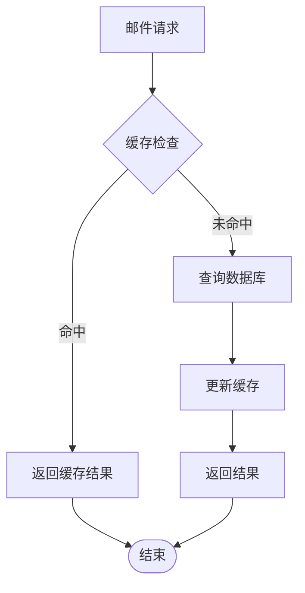

### 异步处理

对于大量邮件的批量操作，建议采用异步处理：

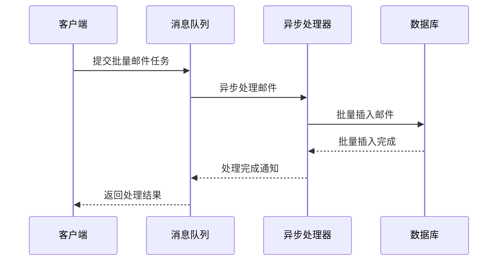

**章节来源**
- [LifeMailMapper.xml](file://Life/src/main/resources/mapper/LifeMailMapper.xml#L40-L49)

## 扩展开发指南

### 添加附件类型支持

要添加新的附件类型，需要修改以下部分：

1. **实体类扩展**
   ```java
   // 在 LifeMail 实体中添加新的附件类型枚举
   public enum AttachmentType {
       ITEM(1),
       EQUIPMENT(2),
       GOLD(3),  // 新增金币附件类型
       TITLE(4); // 新增称号附件类型
       
       private final int code;
       
       AttachmentType(int code) {
           this.code = code;
       }
       
       public int getCode() {
           return code;
       }
   }
   ```

2. **服务层扩展**
   ```java
   // 在 MailServiceImpl 中添加新的附件处理逻辑
   private String processGoldAttachment(Long receiverId, Integer goldAmount) {
       // 处理金币附件逻辑
       return "获得" + goldAmount + "灵粹";
   }
   ```

3. **数据库扩展**
   ```sql
   -- 修改邮件表结构支持新附件类型
   ALTER TABLE life_mail 
   ADD COLUMN attachment_type VARCHAR(50) DEFAULT 'item' AFTER attachment_id;
   ```

### 邮件分类功能

实现邮件分类功能的步骤：

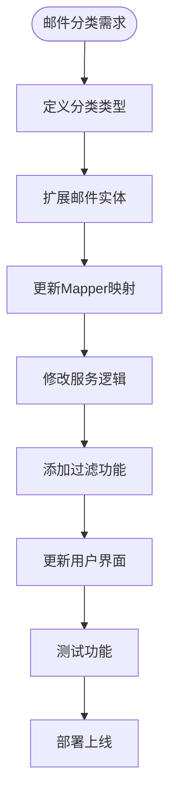

### 批量邮件功能

实现批量邮件发送功能：

```java
// 批量发送邮件示例
public class BatchMailService {
    
    public Map<Long, String> sendBatchMails(List<MailRecipient> recipients) {
        Map<Long, String> results = new HashMap<>();
        
        for (MailRecipient recipient : recipients) {
            try {
                String result = mailService.sendMailToFriend(
                    sender, 
                    recipient.getNickname(),
                    title,
                    content
                );
                results.put(recipient.getUserId(), result);
            } catch (Exception e) {
                results.put(recipient.getUserId(), "发送失败：" + e.getMessage());
            }
        }
        
        return results;
    }
}
```

**章节来源**
- [MailServiceImpl.java](file://Life/src/main/java/com/bot/life/service/impl/MailServiceImpl.java#L147-L179)

## 故障排除与最佳实践

### 常见问题及解决方案

#### 邮件丢失问题

**问题现象**：邮件发送成功但无法查看

**排查步骤**：
1. 检查数据库连接是否正常
2. 验证邮件表索引是否完整
3. 确认用户权限验证逻辑
4. 检查时间戳字段是否正确

**解决方案**：
```java
// 添加邮件完整性检查
public String checkMailIntegrity(Long mailId) {
    LifeMail mail = mailMapper.selectByPrimaryKey(mailId);
    if (mail == null) {
        return "邮件不存在，请确认邮件ID是否正确";
    }
    
    // 检查关键字段完整性
    if (mail.getSenderId() == null || mail.getReceiverId() == null) {
        return "邮件数据不完整，请联系管理员";
    }
    
    return "邮件状态正常";
}
```

#### 邮件延迟问题

**问题现象**：邮件发送后长时间无法接收

**优化措施**：
1. 优化数据库查询性能
2. 实现邮件缓存机制
3. 使用异步处理提高响应速度

#### 附件领取失败

**问题现象**：附件领取时出现错误

**解决方案**：
```java
@Override
public String receiveMailAttachment(LifePlayer player, Long mailId) {
    try {
        // 添加事务控制
        TransactionTemplate transaction = new TransactionTemplate(transactionManager);
        return transaction.execute(status -> {
            try {
                // 业务逻辑
                return internalReceiveAttachment(player, mailId);
            } catch (Exception e) {
                status.setRollbackOnly();
                return "附件领取失败：" + e.getMessage();
            }
        });
    } catch (Exception e) {
        logger.error("附件领取异常", e);
        return "系统错误，请稍后重试";
    }
}
```

### 最佳实践建议

1. **数据一致性保证**
   - 使用数据库事务确保邮件发送的原子性
   - 实现幂等性检查避免重复发送
   - 添加邮件状态校验防止非法操作

2. **性能监控**
   - 监控邮件发送成功率
   - 跟踪邮件处理延迟
   - 分析邮件存储空间使用情况

3. **用户体验优化**
   - 提供邮件模板功能
   - 实现邮件搜索和筛选
   - 添加邮件标记和分类功能

4. **安全性考虑**
   - 验证用户权限防止越权操作
   - 过滤敏感内容防止恶意邮件
   - 实现垃圾邮件检测机制

**章节来源**
- [MailServiceImpl.java](file://Life/src/main/java/com/bot/life/service/impl/MailServiceImpl.java#L298-L320)

## 总结

浮生卷游戏的邮件系统是一个设计精良、功能完备的异步通信机制。通过合理的架构设计、完善的业务逻辑和有效的性能优化，该系统为游戏提供了可靠的社交互动基础设施。

### 系统优势

1. **架构清晰**：采用分层架构，职责明确
2. **功能完整**：支持多种邮件类型和附件格式
3. **性能良好**：通过索引优化和分页策略保证查询效率
4. **扩展性强**：模块化设计便于功能扩展
5. **易于维护**：清晰的代码结构和完善的异常处理

### 发展方向

1. **功能增强**：支持富文本内容、多媒体附件
2. **性能优化**：引入缓存机制、异步处理
3. **用户体验**：添加邮件模板、智能推荐功能
4. **数据分析**：统计邮件使用情况、用户行为分析

该邮件系统不仅满足了当前的游戏需求，也为未来的功能扩展奠定了良好的基础，是浮生卷游戏社交系统的重要组成部分。