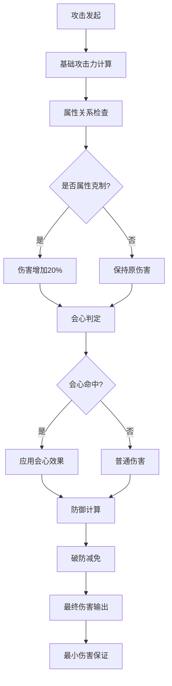
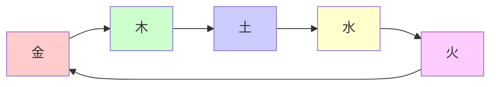
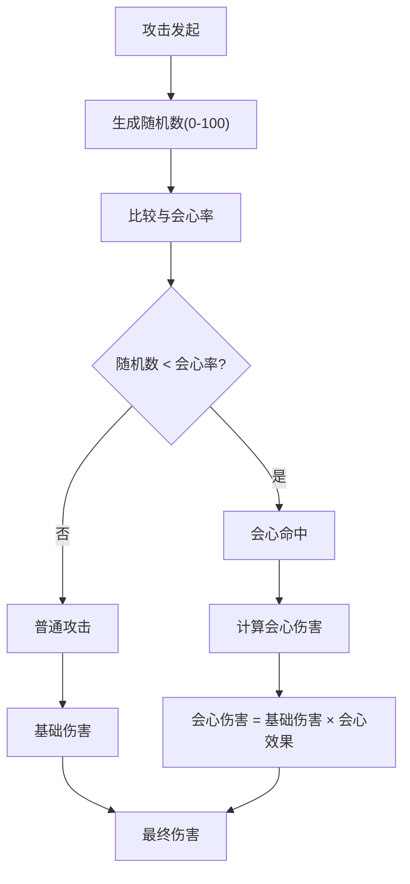
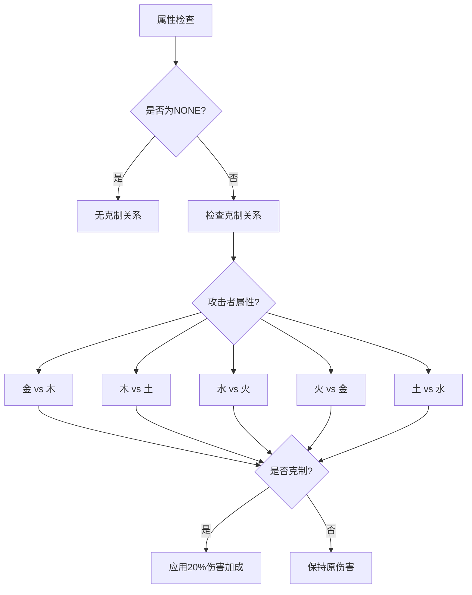
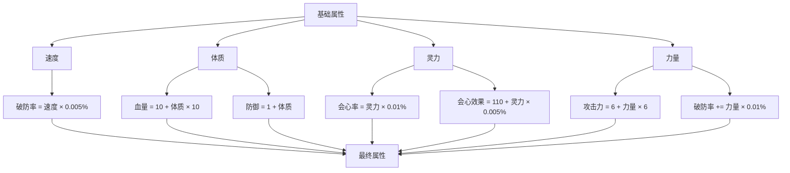
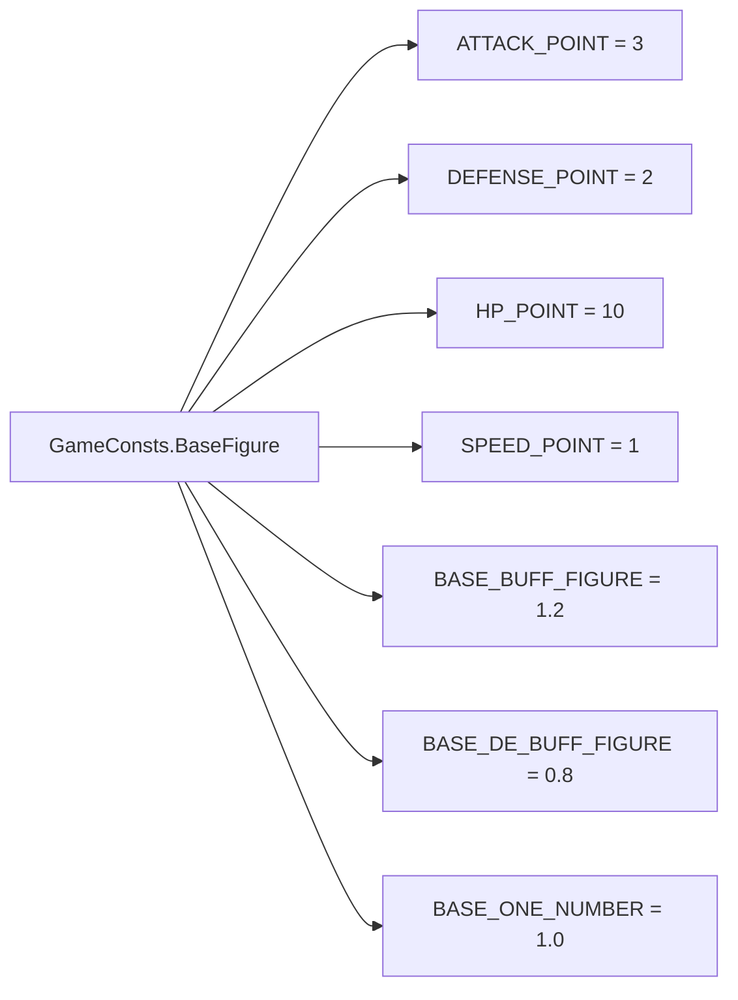
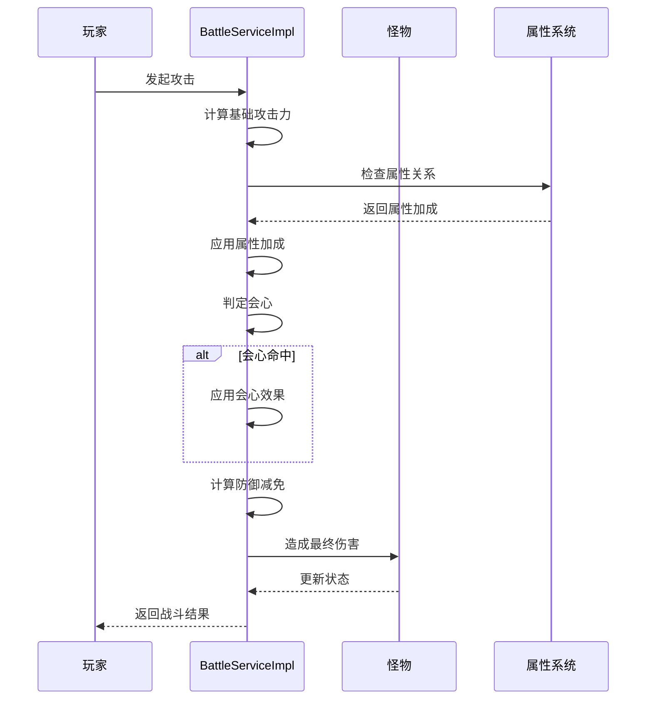
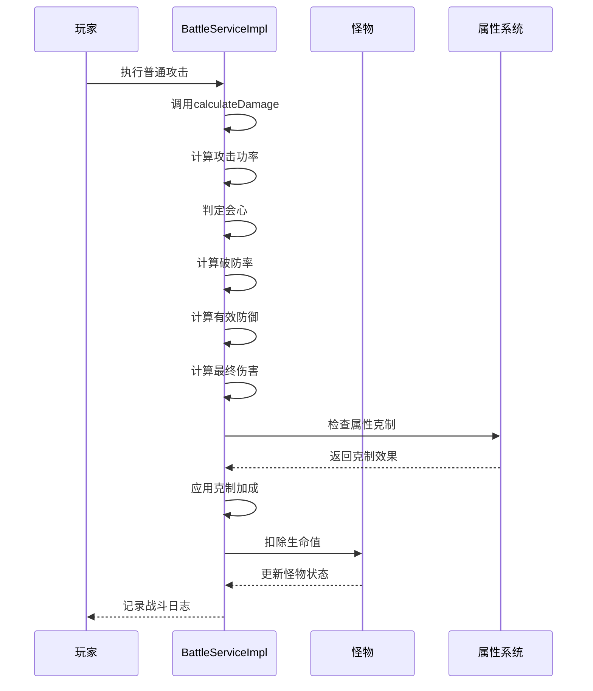

# 伤害计算

<cite>
**本文档引用的文件**
- [BattleServiceImpl.java](file://Game/src/main/java/com/bot/game/service/impl/BattleServiceImpl.java)
- [BattleServiceImpl.java](file://Life/src/main/java/com/bot/life/service/impl/BattleServiceImpl.java)
- [ENAttribute.java](file://Game/src/main/java/com/bot/game/enums/ENAttribute.java)
- [ENAttribute.java](file://Life/src/main/java/com/bot/life/enums/ENAttribute.java)
- [GameConsts.java](file://Common/src/main/java/com/bot/common/constant/GameConsts.java)
- [LifePlayer.java](file://Life/src/main/java/com/bot/life/dao/entity/LifePlayer.java)
- [浮生卷开发说明.md](file://浮生卷开发说明.md)
- [Life_Deployment_Guide.md](file://Life_Deployment_Guide.md)
</cite>

## 目录
1. [概述](#概述)
2. [伤害计算核心机制](#伤害计算核心机制)
3. [基础攻击与属性关系](#基础攻击与属性关系)
4. [会心暴击系统](#会心暴击系统)
5. [防御减免机制](#防御减免机制)
6. [五行相生相克关系](#五行相生相克关系)
7. [战斗属性详解](#战斗属性详解)
8. [系统配置参数](#系统配置参数)
9. [伤害计算流程](#伤害计算流程)
10. [实际应用示例](#实际应用示例)

## 概述

'浮生卷'游戏采用了一套完整的伤害计算系统，该系统融合了传统回合制战斗的策略性与五行相生相克的特色机制。伤害计算不仅考虑基础属性，还引入了会心暴击、属性克制、防御减免等多个维度，为玩家提供了丰富的战斗策略选择。

## 伤害计算核心机制

### 核心计算公式

伤害计算的核心遵循以下公式：

```
最终伤害 = (攻击力 × 技能倍率) × 会心倍率 - 防御力 × (1 - 破防率)
```

其中：
- **攻击力**：由基础攻击力和属性加成共同决定
- **技能倍率**：根据技能类型和属性关系动态调整
- **会心倍率**：基于会心率和会心效果计算
- **破防率**：受速度、力量等属性影响

### 计算层次结构



**图表来源**
- [BattleServiceImpl.java](file://Game/src/main/java/com/bot/game/service/impl/BattleServiceImpl.java#L128-L199)
- [BattleServiceImpl.java](file://Life/src/main/java/com/bot/life/service/impl/BattleServiceImpl.java#L148-L162)

## 基础攻击与属性关系

### 属性加成机制

游戏中的属性关系直接影响攻击效果，主要体现在以下几个方面：

| 属性关系 | 加成倍率 | 说明 |
|---------|---------|------|
| 属性克制 | 1.2倍 | 攻击克制属性的目标时伤害增加20% |
| 属性被克 | 0.8倍 | 被克制属性的目标攻击时伤害减少20% |
| 同属性 | 1.0倍 | 属性相同时无加成或减伤 |

### 属性克制关系



**图表来源**
- [ENAttribute.java](file://Game/src/main/java/com/bot/game/enums/ENAttribute.java#L12-L16)
- [ENAttribute.java](file://Life/src/main/java/com/bot/life/enums/ENAttribute.java#L8-L13)

**章节来源**
- [BattleServiceImpl.java](file://Game/src/main/java/com/bot/game/service/impl/BattleServiceImpl.java#L178-L187)
- [ENAttribute.java](file://Game/src/main/java/com/bot/game/enums/ENAttribute.java#L12-L48)

## 会心暴击系统

### 会心判定机制

会心暴击系统是伤害计算的重要组成部分，其判定过程如下：



**图表来源**
- [BattleServiceImpl.java](file://Life/src/main/java/com/bot/life/service/impl/BattleServiceImpl.java#L152-L155)

### 会心属性配置

| 属性名称 | 单位 | 基础值 | 影响因素 |
|---------|------|--------|----------|
| 会心率 | % | 0% | 灵力属性，每点灵力增加0.01% |
| 会心效果 | % | 110% | 灵力属性，每点灵力增加0.005% |
| 最大会心效果 | % | 200% | 系统配置上限 |

**章节来源**
- [LifePlayer.java](file://Life/src/main/java/com/bot/life/dao/entity/LifePlayer.java#L56-L76)
- [Life_Deployment_Guide.md](file://Life_Deployment_Guide.md#L106-L107)

## 防御减免机制

### 破防率计算

破防率是影响防御减免的关键因素，其计算公式为：

```
破防率 = min(30%, 基础破防率 + 速度破防率 + 力量破防率)
```

其中：
- **基础破防率**：由武器和法宝提供
- **速度破防率**：每点速度提供0.005%破防
- **力量破防率**：每点力量提供0.01%破防

### 防御减免公式

```
有效防御 = 防御力 × (1 - 破防率)
最终伤害 = 攻击力 - 有效防御
```

**章节来源**
- [BattleServiceImpl.java](file://Life/src/main/java/com/bot/life/service/impl/BattleServiceImpl.java#L157-L162)
- [LifePlayer.java](file://Life/src/main/java/com/bot/life/dao/entity/LifePlayer.java#L57-L70)

## 五行相生相克关系

### ENAttribute枚举定义

游戏中的五行属性通过ENAttribute枚举进行管理，包含以下五个基本属性：

| 枚举值 | 编码 | 描述 | 克制关系 |
|-------|------|------|----------|
| NONE | 0 | 无属性 | 无 |
| METAL | 1 | 金 | 木 |
| WOOD | 2 | 木 | 土 |
| WATER | 3 | 水 | 火 |
| FIRE | 4 | 火 | 金 |
| EARTH | 5 | 土 | 水 |

### 相生相克算法



**图表来源**
- [ENAttribute.java](file://Life/src/main/java/com/bot/life/enums/ENAttribute.java#L45-L62)

**章节来源**
- [ENAttribute.java](file://Life/src/main/java/com/bot/life/enums/ENAttribute.java#L6-L63)
- [ENAttribute.java](file://Game/src/main/java/com/bot/game/enums/ENAttribute.java#L8-L48)

## 战斗属性详解

### 基础属性与拓展属性

游戏中的战斗属性分为两大类：

#### 基础属性（影响拓展属性）
- **速度**：决定出手顺序，影响破防率
- **体质**：影响血量和防御
- **灵力**：影响会心率和会心效果
- **力量**：影响攻击力和破防率

#### 拓展属性（战斗时计算）
- **血量**：生命值，战斗中直接体现
- **防御**：基础防御力
- **会心率**：暴击概率
- **会心效果**：暴击伤害倍率
- **破防率**：减免敌人防御的能力
- **攻击力**：基础攻击伤害

### 属性计算公式



**图表来源**
- [LifePlayer.java](file://Life/src/main/java/com/bot/life/dao/entity/LifePlayer.java#L56-L76)

**章节来源**
- [LifePlayer.java](file://Life/src/main/java/com/bot/life/dao/entity/LifePlayer.java#L56-L76)
- [浮生卷开发说明.md](file://浮生卷开发说明.md#L25-L40)

## 系统配置参数

### 关键配置表（life_system_config）

系统配置通过`life_system_config`表进行管理，以下是伤害计算相关的核心配置：

| 配置键 | 默认值 | 说明 | 影响范围 |
|-------|--------|------|----------|
| speed_armor_break_rate | 0.005 | 每点速度增加的破防率 | 破防计算 |
| constitution_health_rate | 10 | 每点体质增加的血量 | 血量计算 |
| constitution_defense_rate | 1 | 每点体质增加的防御 | 防御计算 |
| spirit_critical_rate | 0.01 | 每点灵力增加的会心率 | 会心计算 |
| spirit_critical_damage_rate | 0.005 | 每点灵力增加的会心效果 | 会心计算 |
| strength_attack_rate | 6 | 每点力量增加的攻击力 | 攻击计算 |
| strength_armor_break_rate | 0.01 | 每点力量增加的破防率 | 破防计算 |
| attribute_restraint_damage_bonus | 20 | 属性克制伤害加成百分比 | 属性克制 |
| attribute_restrained_defense_penalty | 10 | 被属性克制防御减少百分比 | 属性克制 |
| max_armor_break_rate | 30 | 最大破防率 | 破防上限 |

### 常量配置



**图表来源**
- [GameConsts.java](file://Common/src/main/java/com/bot/common/constant/GameConsts.java#L189-L208)

**章节来源**
- [Life_Deployment_Guide.md](file://Life_Deployment_Guide.md#L100-L113)
- [GameConsts.java](file://Common/src/main/java/com/bot/common/constant/GameConsts.java#L189-L229)

## 伤害计算流程

### Game模块伤害计算流程



**图表来源**
- [BattleServiceImpl.java](file://Game/src/main/java/com/bot/game/service/impl/BattleServiceImpl.java#L128-L199)

### Life模块伤害计算流程



**图表来源**
- [BattleServiceImpl.java](file://Life/src/main/java/com/bot/life/service/impl/BattleServiceImpl.java#L148-L162)

**章节来源**
- [BattleServiceImpl.java](file://Game/src/main/java/com/bot/game/service/impl/BattleServiceImpl.java#L128-L493)
- [BattleServiceImpl.java](file://Life/src/main/java/com/bot/life/service/impl/BattleServiceImpl.java#L119-L138)

## 实际应用示例

### 示例1：五行相克伤害计算

假设：
- 攻击者属性：火（火克金）
- 防御者属性：金
- 基础攻击力：100
- 防御力：50
- 会心率：5%
- 会心效果：150%

计算过程：
1. 属性克制：100 × 1.2 = 120
2. 会心判定：随机数 < 5%，假设命中
3. 会心伤害：120 × 1.5 = 180
4. 防御计算：180 - 50 × (1 - 0.1) = 125
5. 最终伤害：125

### 示例2：破防率影响

假设：
- 攻击者速度：100
- 攻击者力量：50
- 基础防御：80
- 破防率计算：min(30%, 0.005×100 + 0.01×50) = min(30%, 1% + 0.5%) = 1.5%
- 有效防御：80 × (1 - 0.015) = 78.8
- 最终伤害：攻击力 - 78.8

### 示例3：属性克制与会心叠加

假设：
- 属性克制：+20%
- 会心率：10%
- 会心效果：130%
- 基础伤害：200
- 计算过程：
  1. 属性加成：200 × 1.2 = 240
  2. 会心判定：假设命中
  3. 会心伤害：240 × 1.3 = 312
  4. 防御减免：312 - 防御力
  5. 最终伤害：312 - 有效防御

**章节来源**
- [BattleServiceImpl.java](file://Game/src/main/java/com/bot/game/service/impl/BattleServiceImpl.java#L128-L199)
- [BattleServiceImpl.java](file://Life/src/main/java/com/bot/life/service/impl/BattleServiceImpl.java#L119-L162)

## 总结

'浮生卷'的伤害计算系统体现了传统回合制游戏与五行哲学的完美结合。通过多层次的计算机制，包括基础攻击、属性克制、会心暴击、防御减免等要素，为玩家提供了丰富而富有策略性的战斗体验。系统配置的灵活性使得开发者可以根据游戏平衡需求调整各项参数，确保游戏的可玩性和公平性。

这套伤害计算系统不仅保证了战斗的公平性，还鼓励玩家在属性搭配、技能选择和装备配置上进行深度思考，从而形成独特的战斗风格和策略体系。