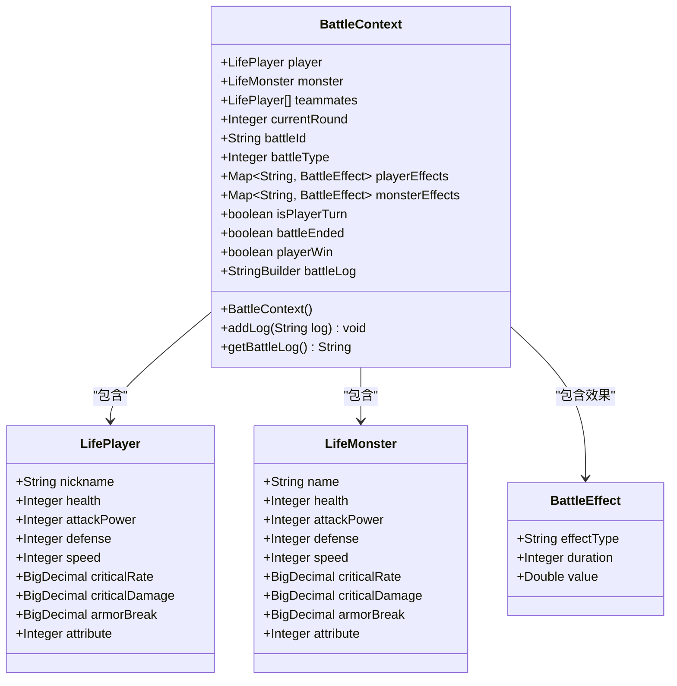
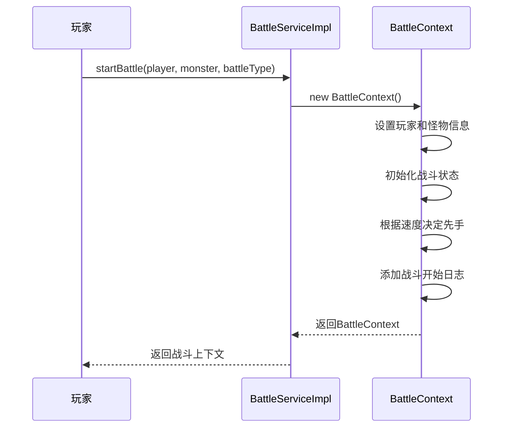
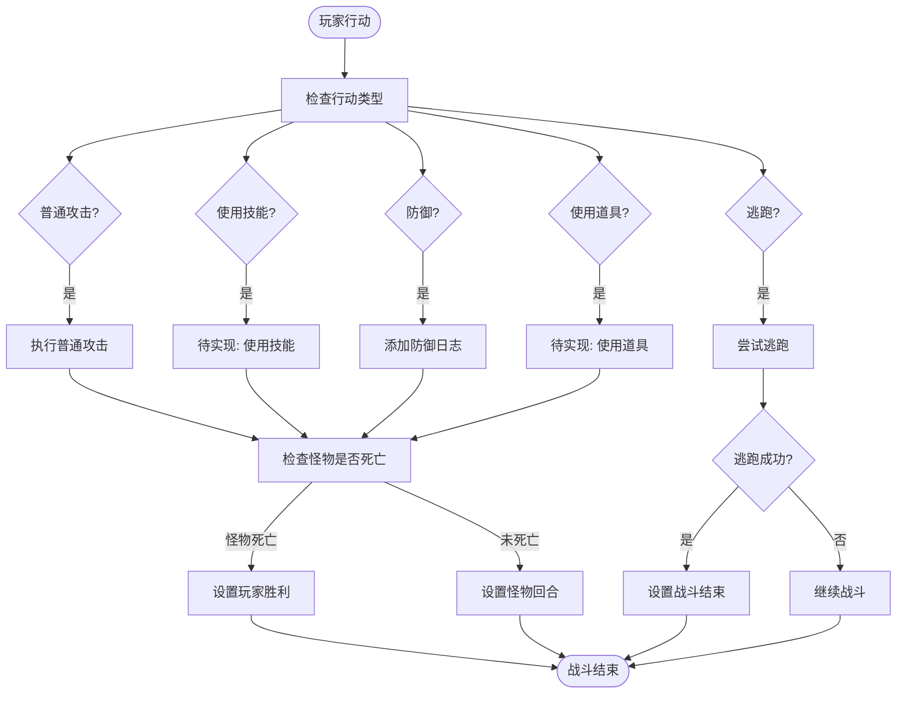
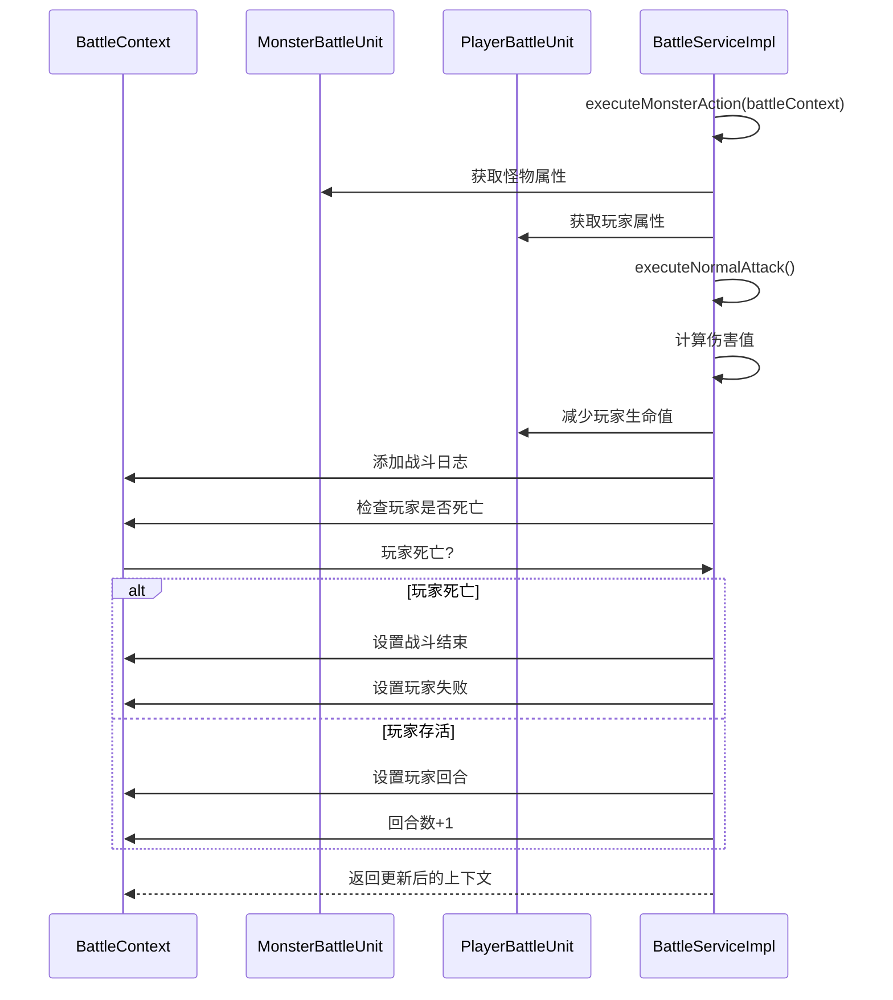
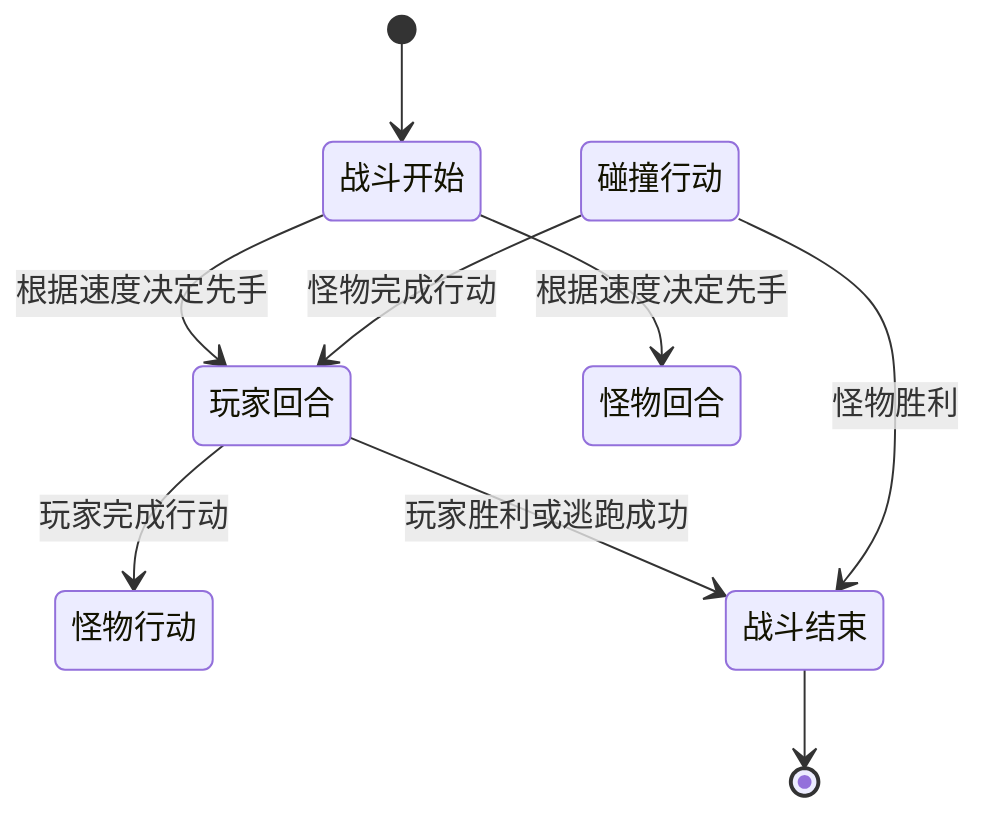
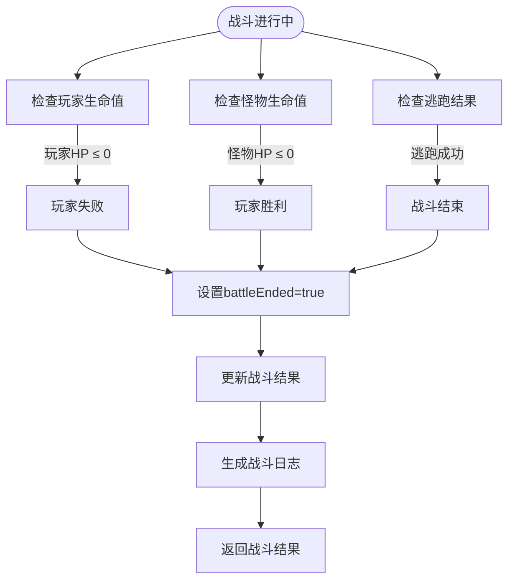
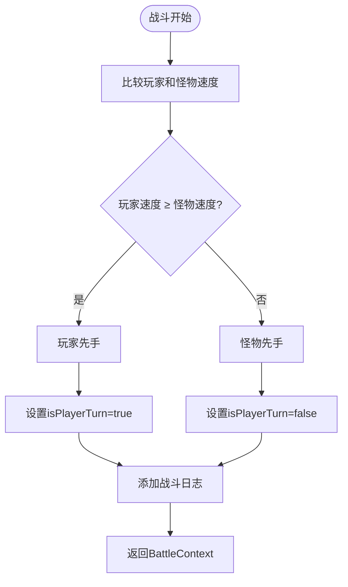
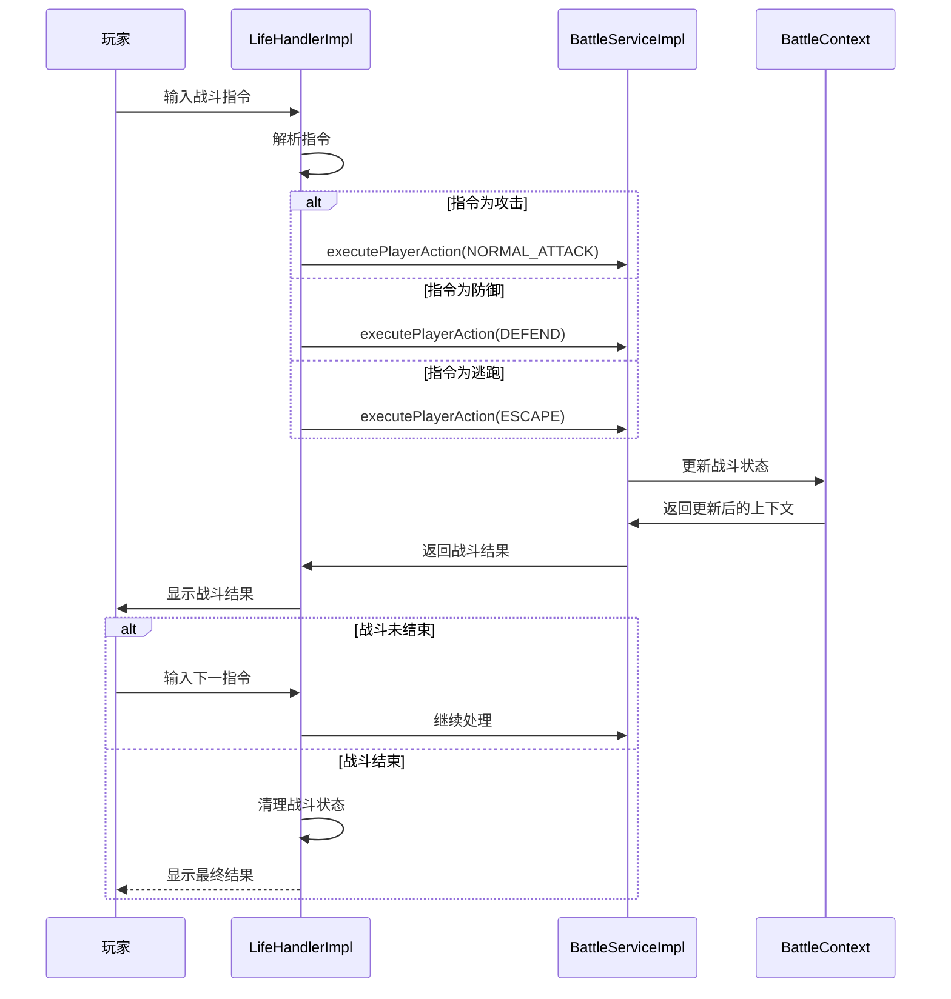

# 战斗流程

<cite>
**本文档引用的文件**  
- [BattleServiceImpl.java](file://Life\src\main\java\com\bot\life\service\impl\BattleServiceImpl.java)
- [BattleContext.java](file://Life\src\main\java\com\bot\life\dto\BattleContext.java)
- [BattleService.java](file://Life\src\main\java\com\bot\life\service\BattleService.java)
- [ENBattleAction.java](file://Life\src\main\java\com\bot\life\enums\ENBattleAction.java)
- [BattleResult.java](file://Life\src\main\java\com\bot\life\dto\BattleResult.java)
- [LifeHandlerImpl.java](file://Life\src\main\java\com\bot\life\service\impl\LifeHandlerImpl.java)
</cite>

## 目录
1. [战斗流程概述](#战斗流程概述)
2. [战斗上下文管理](#战斗上下文管理)
3. [战斗开始流程](#战斗开始流程)
4. [玩家行动处理](#玩家行动处理)
5. [怪物行动处理](#怪物行动处理)
6. [回合切换机制](#回合切换机制)
7. [战斗结束条件](#战斗结束条件)
8. [战斗日志生成](#战斗日志生成)
9. [速度属性与行动顺序](#速度属性与行动顺序)
10. [战斗控制逻辑](#战斗控制逻辑)

## 战斗流程概述

'浮生卷'游戏中的战斗系统采用回合制机制，通过BattleServiceImpl类实现完整的战斗流程控制。战斗流程包括战斗开始、玩家行动、怪物行动、回合切换和战斗结束五个主要阶段。系统通过BattleContext对象管理战斗状态，记录战斗过程中的各种信息，并根据玩家和怪物的速度属性决定行动顺序。

**Section sources**
- [BattleServiceImpl.java](file://Life\src\main\java\com\bot\life\service\impl\BattleServiceImpl.java#L26-L302)

## 战斗上下文管理

战斗上下文(BattleContext)是战斗系统的核心数据结构，用于存储和管理战斗过程中的所有状态信息。该对象在战斗开始时创建，并在整个战斗过程中持续更新，直到战斗结束。



**Diagram sources**
- [BattleContext.java](file://Life\src\main\java\com\bot\life\dto\BattleContext.java#L15-L54)
- [BattleServiceImpl.java](file://Life\src\main\java\com\bot\life\service\impl\BattleServiceImpl.java#L37-L53)

## 战斗开始流程

战斗开始时，系统调用startBattle方法创建战斗上下文并初始化战斗状态。该方法接收玩家、怪物和战斗类型作为参数，设置初始战斗状态。



**Diagram sources**
- [BattleServiceImpl.java](file://Life\src\main\java\com\bot\life\service\impl\BattleServiceImpl.java#L37-L53)
- [BattleService.java](file://Life\src\main\java\com\bot\life\service\BattleService.java#L22-L23)

## 玩家行动处理

玩家行动通过executePlayerAction方法处理，该方法根据玩家选择的行动类型执行相应的战斗逻辑。系统支持普通攻击、使用技能、防御、使用道具和逃跑五种行动。



**Diagram sources**
- [BattleServiceImpl.java](file://Life\src\main\java\com\bot\life\service\impl\BattleServiceImpl.java#L56-L95)
- [ENBattleAction.java](file://Life\src\main\java\com\bot\life\enums\ENBattleAction.java#L7-L12)

## 怪物行动处理

怪物行动由executeMonsterAction方法处理，目前实现为简单的AI逻辑，怪物只会执行普通攻击。该方法在每个怪物回合被调用。



**Diagram sources**
- [BattleServiceImpl.java](file://Life\src\main\java\com\bot\life\service\impl\BattleServiceImpl.java#L98-L115)
- [BattleService.java](file://Life\src\main\java\com\bot\life\service\BattleService.java#L37-L38)

## 回合切换机制

战斗系统采用回合制机制，通过isPlayerTurn标志位管理回合切换。当一方完成行动后，系统自动切换到另一方的回合，直到战斗结束。



**Diagram sources**
- [BattleServiceImpl.java](file://Life\src\main\java\com\bot\life\service\impl\BattleServiceImpl.java#L47-L48)
- [BattleServiceImpl.java](file://Life\src\main\java\com\bot\life\service\impl\BattleServiceImpl.java#L94-L95)
- [BattleServiceImpl.java](file://Life\src\main\java\com\bot\life\service\impl\BattleServiceImpl.java#L113-L114)

## 战斗结束条件

战斗在满足以下任一条件时结束：玩家或怪物生命值归零、玩家成功逃跑。系统通过battleEnded标志位记录战斗是否结束，并通过playerWin标志位记录战斗结果。



**Diagram sources**
- [BattleServiceImpl.java](file://Life\src\main\java\com\bot\life\service\impl\BattleServiceImpl.java#L87-L92)
- [BattleServiceImpl.java](file://Life\src\main\java\com\bot\life\service\impl\BattleServiceImpl.java#L106-L111)
- [BattleServiceImpl.java](file://Life\src\main\java\com\bot\life\service\impl\BattleServiceImpl.java#L76-L83)

## 战斗日志生成

系统通过StringBuilder对象管理战斗日志，每次战斗事件发生时都会添加相应的日志记录。战斗日志包含战斗开始、每次攻击、状态变化和战斗结束等信息。

```mermaid
classDiagram
class BattleContext {
-StringBuilder battleLog
+addLog(String log) void
+getBattleLog() String
}
class BattleServiceImpl {
+startBattle() BattleContext
+executePlayerAction() BattleContext
+executeMonsterAction() BattleContext
}
BattleServiceImpl --> BattleContext : "调用addLog()"
BattleContext --> BattleServiceImpl : "返回getBattleLog()"
note right of BattleContext
战斗日志格式示例：
『战斗开始！』
『玩家』 VS 『怪物』
『玩家』对『怪物』造成了『50』点伤害！
『怪物』剩余血量：『150』
『怪物』被击败了！
end note
```

**Diagram sources**
- [BattleContext.java](file://Life\src\main\java\com\bot\life\dto\BattleContext.java#L32-L46)
- [BattleServiceImpl.java](file://Life\src\main\java\com\bot\life\service\impl\BattleServiceImpl.java#L49-L51)

## 速度属性与行动顺序

战斗中的行动顺序由玩家和怪物的速度属性决定。系统在战斗开始时比较双方速度，速度较高的一方先行动。如果速度相同，则玩家优先行动。



**Diagram sources**
- [BattleServiceImpl.java](file://Life\src\main\java\com\bot\life\service\impl\BattleServiceImpl.java#L47-L48)
- [BattleContext.java](file://Life\src\main\java\com\bot\life\dto\BattleContext.java#L28-L29)

## 战斗控制逻辑

战斗控制逻辑由LifeHandlerImpl类中的战斗模式处理方法实现，该方法接收玩家输入并调用相应的战斗服务方法。



**Diagram sources**
- [LifeHandlerImpl.java](file://Life\src\main\java\com\bot\life\service\impl\LifeHandlerImpl.java#L1150-L1154)
- [BattleService.java](file://Life\src\main\java\com\bot\life\service\BattleService.java#L31-L32)

**Section sources**
- [BattleServiceImpl.java](file://Life\src\main\java\com\bot\life\service\impl\BattleServiceImpl.java#L56-L95)
- [LifeHandlerImpl.java](file://Life\src\main\java\com\bot\life\service\impl\LifeHandlerImpl.java#L1140-L1287)