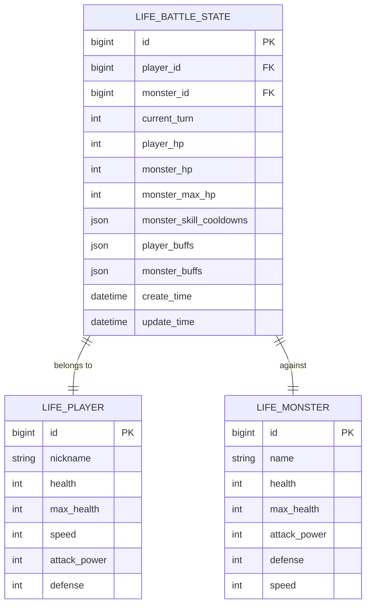
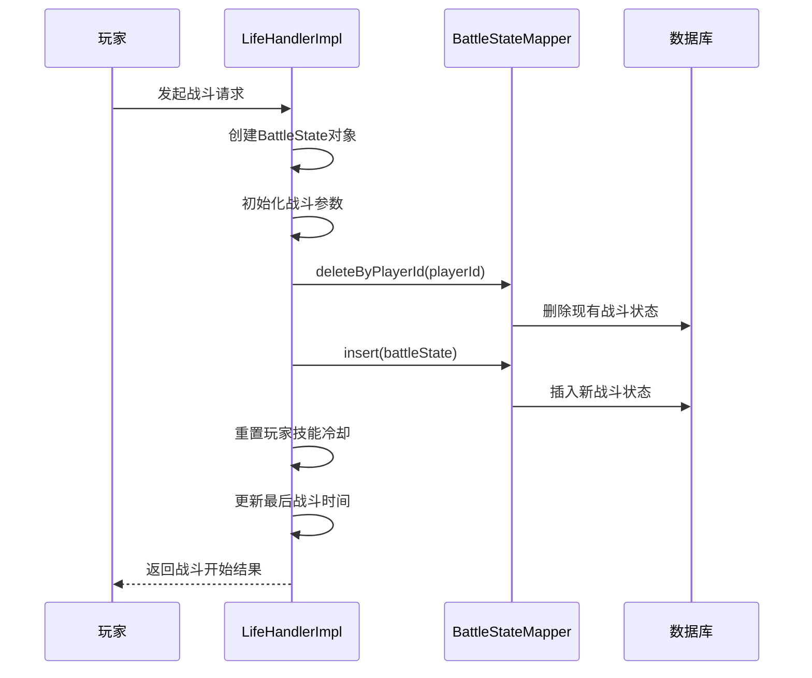
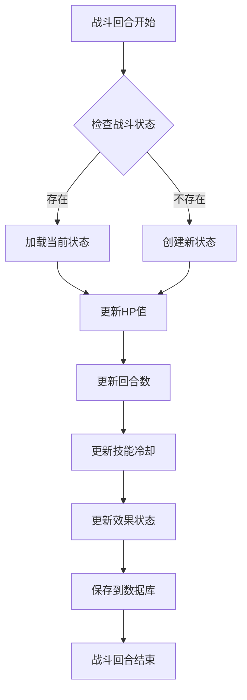
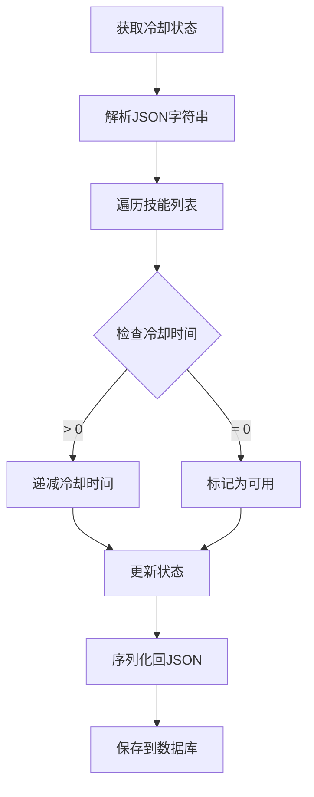
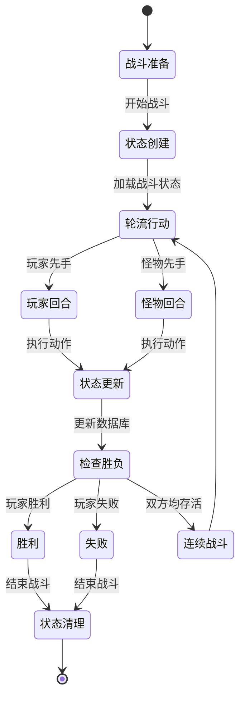
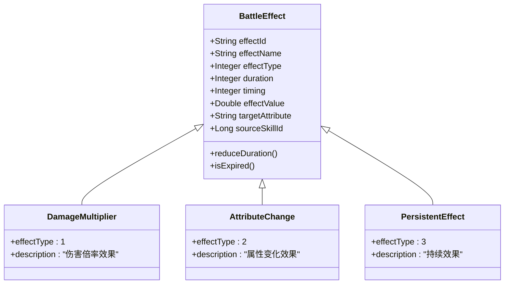

# 战斗状态管理

<cite>
**本文档引用的文件**
- [LifeBattleState.java](file://Life/src/main/java/com/bot/life/dao/entity/LifeBattleState.java)
- [LifeBattleStateMapper.java](file://Life/src/main/java/com/bot/life/dao/mapper/LifeBattleStateMapper.java)
- [LifeBattleStateMapper.xml](file://Life/src/main/resources/mapper/LifeBattleStateMapper.xml)
- [LifeBattleStateMapper.xml](file://Life/src/main/resources/mapper/LifeBattleStateMapper.xml)
- [Life_Database_Init.sql](file://Life_Database_Init.sql)
- [BattleServiceImpl.java](file://Life/src/main/java/com/bot/life/service/impl/BattleServiceImpl.java)
- [LifeHandlerImpl.java](file://Life/src/main/java/com/bot/life/service/impl/LifeHandlerImpl.java)
- [BattleContext.java](file://Life/src/main/java/com/bot/life/dto/BattleContext.java)
- [BattleEffect.java](file://Life/src/main/java/com/bot/life/dto/BattleEffect.java)
- [BattlePhantomDTO.java](file://Game/src/main/java/com/bot/game/dto/BattlePhantomDTO.java)
- [BattleEffectDTO.java](file://Game/src/main/java/com/bot/game/dto/BattleEffectDTO.java)
</cite>

## 目录
1. [简介](#简介)
2. [数据库表设计](#数据库表设计)
3. [核心字段详解](#核心字段详解)
4. [战斗状态持久化机制](#战斗状态持久化机制)
5. [JSON字段结构设计](#json字段结构设计)
6. [战斗状态管理流程](#战斗状态管理流程)
7. [战斗效果管理系统](#战斗效果管理系统)
8. [性能优化考虑](#性能优化考虑)
9. [故障排除指南](#故障排除指南)
10. [总结](#总结)

## 简介

战斗状态管理系统是浮生卷游戏中的核心组件，负责维护玩家与怪物之间的战斗状态信息。该系统通过`life_battle_state`表存储战斗相关数据，并提供完整的战斗状态持久化、更新和管理功能。系统采用JSON格式存储复杂的战斗效果数据，支持动态的技能冷却和buff/debuff管理。

## 数据库表设计

### life_battle_state 表结构



**图表来源**
- [LifeBattleState.java](file://Life/src/main/java/com/bot/life/dao/entity/LifeBattleState.java#L12-L24)
- [Life_Database_Init.sql](file://Life_Database_Init.sql#L599-L616)

**章节来源**
- [LifeBattleState.java](file://Life/src/main/java/com/bot/life/dao/entity/LifeBattleState.java#L1-L24)
- [Life_Database_Init.sql](file://Life_Database_Init.sql#L599-L616)

## 核心字段详解

### 基础战斗信息字段

| 字段名 | 类型 | 描述 | 默认值 |
|--------|------|------|--------|
| `player_id` | BIGINT | 玩家唯一标识符 | - |
| `monster_id` | BIGINT | 怪物唯一标识符 | - |
| `current_turn` | INTEGER | 当前战斗回合数 | 1 |
| `player_hp` | INTEGER | 玩家当前生命值 | - |
| `monster_hp` | INTEGER | 怪物当前生命值 | - |
| `monster_max_hp` | INTEGER | 怪物最大生命值 | - |

这些字段构成了战斗状态的基础框架，记录了战斗的核心动态信息。`current_turn`字段用于控制战斗节奏，而HP字段则实时反映战斗双方的生命状态。

### 时间戳字段

| 字段名 | 类型 | 描述 |
|--------|------|------|
| `create_time` | DATETIME | 战斗状态创建时间，默认为当前时间 |
| `update_time` | DATETIME | 战斗状态最后更新时间，默认为当前时间，自动更新 |

这两个时间戳字段确保了战斗状态的时间线追踪，便于后续的战斗数据分析和状态恢复。

**章节来源**
- [LifeBattleState.java](file://Life/src/main/java/com/bot/life/dao/entity/LifeBattleState.java#L13-L24)

## 战斗状态持久化机制

### 战斗开始时的状态创建

战斗开始时，系统会创建初始战斗状态并持久化到数据库：



**图表来源**
- [LifeHandlerImpl.java](file://Life/src/main/java/com/bot/life/service/impl/LifeHandlerImpl.java#L1091-L1108)

战斗状态创建的关键步骤包括：
1. **状态清理**：删除可能存在的旧战斗状态，避免数据冲突
2. **参数初始化**：设置初始HP、MP、回合数等基础参数
3. **JSON字段初始化**：所有JSON字段初始化为空对象`{}`
4. **时间戳设置**：自动设置创建时间和更新时间

### 战斗过程中的状态更新

战斗过程中，系统会定期更新战斗状态以反映最新的战斗进展：



**图表来源**
- [LifeHandlerImpl.java](file://Life/src/main/java/com/bot/life/service/impl/LifeHandlerImpl.java#L1830-L1834)

每次战斗回合结束后，系统会执行以下更新操作：
1. **HP更新**：根据战斗结果更新玩家和怪物的生命值
2. **回合推进**：递增当前回合计数器
3. **冷却更新**：更新所有技能的冷却时间
4. **效果刷新**：处理持续性buff/debuff的效果衰减

**章节来源**
- [LifeHandlerImpl.java](file://Life/src/main/java/com/bot/life/service/impl/LifeHandlerImpl.java#L1091-L1108)
- [LifeHandlerImpl.java](file://Life/src/main/java/com/bot/life/service/impl/LifeHandlerImpl.java#L1830-L1834)

## JSON字段结构设计

### monster_skill_cooldowns 字段

该字段存储怪物技能的冷却状态，采用JSON格式组织数据：

```json
{
  "skill_id_1": 2,
  "skill_id_2": 0,
  "skill_id_3": 1
}
```

#### 结构特点
- **键值对结构**：技能ID作为键，冷却回合数作为值
- **整数值**：表示剩余冷却回合数，0表示可使用
- **动态更新**：每回合递减，使用后重置为技能冷却时间

#### 冷却管理算法



**图表来源**
- [LifeHandlerImpl.java](file://Life/src/main/java/com/bot/life/service/impl/LifeHandlerImpl.java#L1627-L1629)

### player_buffs 和 monster_buffs 字段

这两个字段分别存储玩家和怪物的buff/debuff状态，结构类似但独立管理：

```json
{
  "effect_id_1": {
    "duration": 3,
    "effect_type": 1,
    "effect_value": 1.2,
    "timing": 2
  },
  "effect_id_2": {
    "duration": 2,
    "effect_type": 2,
    "effect_value": -50,
    "timing": 1
  }
}
```

#### 效果数据结构

| 字段 | 类型 | 描述 |
|------|------|------|
| `duration` | INTEGER | 持续回合数 |
| `effect_type` | INTEGER | 效果类型：1伤害倍率2属性变化3持续效果 |
| `effect_value` | DOUBLE | 效果数值 |
| `timing` | INTEGER | 生效时机：1回合开始前2回合开始后3回合结束 |
| `target_attribute` | STRING | 目标属性（可选） |
| `source_skill_id` | BIGINT | 来源技能ID（可选） |

**章节来源**
- [LifeHandlerImpl.java](file://Life/src/main/java/com/bot/life/service/impl/LifeHandlerImpl.java#L1637-L1676)
- [BattleEffect.java](file://Life/src/main/java/com/bot/life/dto/BattleEffect.java#L11-L35)

## 战斗状态管理流程

### 完整的战斗生命周期



### 关键管理方法

#### 战斗状态查询
系统提供了多种查询方式来获取战斗状态：

```java
// 根据ID查询
LifeBattleState state = battleStateMapper.selectByPrimaryKey(battleId);

// 根据玩家ID查询
LifeBattleState state = battleStateMapper.selectByPlayerId(playerId);
```

#### 战斗状态清理
战斗结束后，系统会自动清理相关状态：

```java
private void finishBattle(Long playerId) {
    // 删除战斗状态
    battleStateMapper.deleteByPlayerId(playerId);
    
    // 重置玩家技能冷却
    resetPlayerSkillCooldowns(playerId);
}
```

**章节来源**
- [LifeHandlerImpl.java](file://Life/src/main/java/com/bot/life/service/impl/LifeHandlerImpl.java#L1739-L1745)
- [LifeBattleStateMapper.java](file://Life/src/main/java/com/bot/life/dao/mapper/LifeBattleStateMapper.java#L19-L25)

## 战斗效果管理系统

### 效果类型分类

系统支持三种主要的效果类型：



**图表来源**
- [BattleEffect.java](file://Life/src/main/java/com/bot/life/dto/BattleEffect.java#L11-L35)

### 效果生命周期管理

#### 效果创建和应用
当技能或武器效果触发时，系统会创建相应的战斗效果：

```java
// 创建效果实例
BattleEffect effect = new BattleEffect();
effect.setEffectId(skillId.toString());
effect.setEffectName(skillName);
effect.setEffectType(1); // 伤害倍率
effect.setDuration(3);
effect.setEffectValue(1.2);
effect.setTiming(2); // 回合开始后生效
```

#### 效果持续时间管理
系统每回合都会处理效果的持续时间：

```java
// 效果衰减逻辑
public void reduceDuration() {
    if (this.duration > 0) {
        this.duration--;
    }
}

public boolean isExpired() {
    return this.duration <= 0;
}
```

### 效果触发时机

战斗效果按照不同的时机触发：

| 触发时机 | 数值 | 描述 |
|----------|------|------|
| 回合开始前 | 1 | 在回合开始前立即生效 |
| 回合开始后 | 2 | 在玩家行动后、怪物行动前生效 |
| 回合结束 | 3 | 在怪物行动后、下一回合开始前生效 |

**章节来源**
- [BattleEffect.java](file://Life/src/main/java/com/bot/life/dto/BattleEffect.java#L21-L35)
- [BattleContext.java](file://Life/src/main/java/com/bot/life/dto/BattleContext.java#L24-L27)

## 性能优化考虑

### 数据库访问优化

1. **批量操作**：战斗状态更新采用批量写入策略，减少数据库交互次数
2. **索引优化**：`player_id`字段建立唯一索引，确保查询效率
3. **缓存策略**：对于频繁访问的战斗状态，可以考虑内存缓存

### JSON处理优化

1. **序列化策略**：使用高效的JSON库替代手动字符串拼接
2. **压缩存储**：对于大型JSON数据，考虑启用数据库压缩
3. **字段精简**：只存储必要的效果信息，避免冗余数据

### 并发控制

战斗状态管理需要考虑并发访问问题：

```java
@Transactional
public BattleContext executePlayerAction(BattleContext context, ENBattleAction action) {
    // 获取当前战斗状态
    LifeBattleState currentState = battleStateMapper.selectByPlayerId(context.getPlayer().getId());
    
    // 执行战斗逻辑
    BattleContext updatedContext = battleService.executePlayerAction(context, action);
    
    // 更新状态
    currentState.setPlayerHp(updatedContext.getPlayer().getHealth());
    currentState.setMonsterHp(updatedContext.getMonster().getHealth());
    currentState.setCurrentTurn(currentState.getCurrentTurn() + 1);
    
    battleStateMapper.updateByPrimaryKey(currentState);
    return updatedContext;
}
```

## 故障排除指南

### 常见问题及解决方案

#### 1. 战斗状态丢失
**症状**：战斗中断后重新进入发现战斗状态不一致
**原因**：数据库连接异常或事务未正确提交
**解决方案**：
- 检查数据库连接池配置
- 确保事务边界正确设置
- 添加状态恢复机制

#### 2. JSON解析错误
**症状**：技能冷却或效果数据解析失败
**原因**：JSON格式不规范或数据损坏
**解决方案**：
```java
private Map<String, Integer> safeParseCooldowns(String json) {
    try {
        return parseMonsterSkillCooldowns(json);
    } catch (Exception e) {
        // 返回默认空状态
        return new HashMap<>();
    }
}
```

#### 3. 冷却时间计算错误
**症状**：技能冷却时间显示异常
**原因**：冷却更新逻辑错误
**解决方案**：
```java
private void updateMonsterSkillCooldowns(Map<String, Integer> cooldowns) {
    for (String skillId : cooldowns.keySet()) {
        int currentCooldown = cooldowns.get(skillId);
        if (currentCooldown > 0) {
            cooldowns.put(skillId, currentCooldown - 1);
        }
    }
}
```

### 监控和调试

建议添加以下监控指标：
- 战斗状态创建和更新频率
- JSON解析成功率
- 冷却时间计算准确性
- 数据库操作响应时间

**章节来源**
- [LifeHandlerImpl.java](file://Life/src/main/java/com/bot/life/service/impl/LifeHandlerImpl.java#L1637-L1676)

## 总结

战斗状态管理系统是浮生卷游戏的核心基础设施，通过精心设计的数据库结构和完善的业务逻辑，实现了高效、可靠的战斗状态管理。系统的主要优势包括：

1. **完整的状态跟踪**：从战斗开始到结束的全过程状态记录
2. **灵活的效果管理**：支持复杂的buff/debuff和技能效果系统
3. **高效的持久化**：基于JSON的结构化数据存储，便于扩展
4. **良好的并发控制**：通过事务和锁机制保证数据一致性

该系统为游戏的战斗玩法提供了坚实的技术基础，支持各种复杂的战斗场景和效果交互。随着游戏功能的扩展，系统还可以进一步优化和增强，例如添加效果优先级管理、多层冷却系统等功能。