# 战斗系统

<cite>
**本文档引用文件**   
- [BattleServiceImpl.java](file://Game/src/main/java/com/bot/game/service/impl/BattleServiceImpl.java)
- [LifeBattleState.java](file://Life/src/main/java/com/bot/life/dao/entity/LifeBattleState.java)
- [LifeBattleStateMapper.java](file://Life/src/main/java/com/bot/life/dao/mapper/LifeBattleStateMapper.java)
- [LifeBattleStateMapper.xml](file://Life/src/main/resources/mapper/LifeBattleStateMapper.xml)
- [BattleContext.java](file://Life/src/main/java/com/bot/life/dto/BattleContext.java)
- [BattleResult.java](file://Life/src/main/java/com/bot/life/dto/BattleResult.java)
- [BattleService.java](file://Life/src/main/java/com/bot/life/service/BattleService.java)
- [BattleServiceImpl.java](file://Life/src/main/java/com/bot/life/service/impl/BattleServiceImpl.java)
- [ENBattleAction.java](file://Life/src/main/java/com/bot/life/enums/ENBattleAction.java)
- [ENSkillEffect.java](file://Game/src/main/java/com/bot/game/enums/ENSkillEffect.java)
- [ENAttribute.java](file://Game/src/main/java/com/bot/game/enums/ENAttribute.java)
- [GameConsts.java](file://Common/src/main/java/com/bot/common/constant/GameConsts.java)
- [BattlePhantomDTO.java](file://Game/src/main/java/com/bot/game/dto/BattlePhantomDTO.java)
- [BattleMonsterDTO.java](file://Game/src/main/java/com/bot/game/dto/BattleMonsterDTO.java)
</cite>

## 目录
1. [引言](#引言)
2. [战斗流程](#战斗流程)
3. [战斗状态管理](#战斗状态管理)
4. [战斗伤害计算](#战斗伤害计算)
5. [BattleServiceImpl服务实现](#battleserviceimpl服务实现)
6. [life_battle_state表结构设计](#life_battle_state表结构设计)
7. [技能效果扩展](#技能效果扩展)
8. [结论](#结论)

## 引言
“浮生卷”游戏中的战斗系统采用回合制机制，为玩家提供策略性战斗体验。本系统通过BattleServiceImpl服务实现战斗逻辑的封装和业务处理，管理玩家与怪物之间的战斗过程。战斗系统包含遭遇怪物、选择行动、技能释放、伤害计算和战斗结算等核心环节。系统通过life_battle_state表持久化战斗状态，确保战斗过程的连续性和数据一致性。本文档全面介绍战斗系统的各个组成部分，为开发者提供详细的实现细节和扩展指南。

## 战斗流程
“浮生卷”游戏的战斗流程遵循标准的回合制战斗机制，从遭遇怪物开始，经过多个回合的对抗，最终以战斗结算结束。整个流程设计旨在提供流畅且策略性的游戏体验。

### 遭遇怪物
当玩家进入特定区域或触发事件时，系统会随机生成或选择一个怪物进行战斗。在Game模块中，`BattleServiceImpl`类的构造函数负责初始化战斗，接收`BaseMonster`（基础怪物）和`PlayerPhantom`（玩家幻灵）对象作为参数。战斗初始化时，系统会根据怪物和玩家的属性计算最终战斗属性，包括攻击力、防御力、速度和生命值。

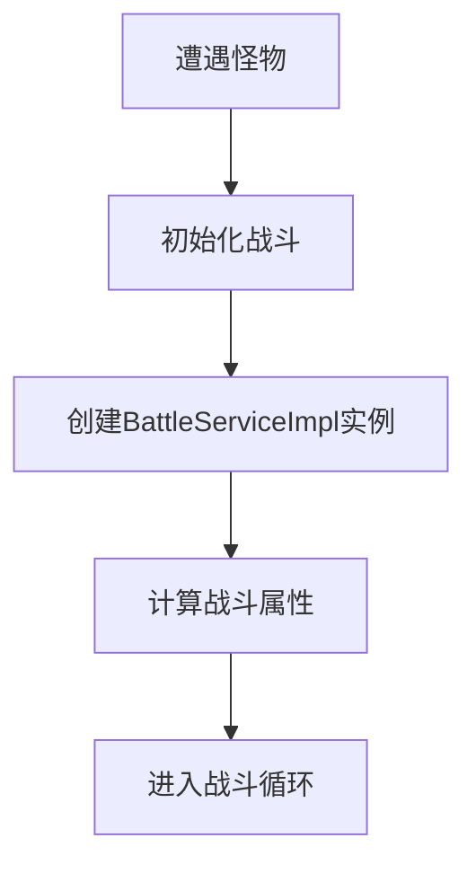

**Diagram sources**
- [BattleServiceImpl.java](file://Game/src/main/java/com/bot/game/service/impl/BattleServiceImpl.java#L54-L62)

### 选择行动
在每个回合中，玩家可以选择不同的行动来应对怪物。系统通过`ENBattleAction`枚举定义了五种基本战斗行动：普通攻击、使用技能、防御、使用道具和逃跑。玩家的选择通过`executePlayerAction`方法传递给战斗服务，该方法根据选择的行动类型执行相应的逻辑。

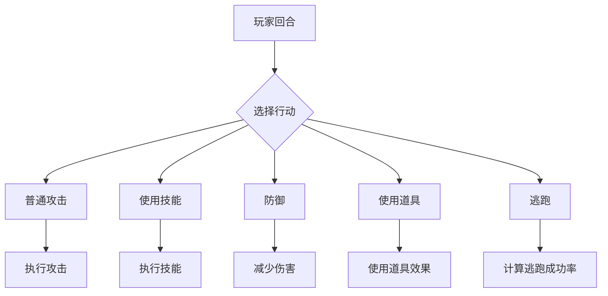

**Diagram sources**
- [BattleService.java](file://Life/src/main/java/com/bot/life/service/BattleService.java#L30)
- [ENBattleAction.java](file://Life/src/main/java/com/bot/life/enums/ENBattleAction.java#L7-L12)

### 技能释放
技能系统是战斗策略的核心，允许玩家和怪物使用特殊能力。在`BattleServiceImpl`中，技能通过`BattleSkillDTO`对象表示，包含技能名称、效果和冷却时间等信息。当玩家选择使用技能时，系统会检查技能是否处于冷却状态，然后执行相应的效果。

技能效果由`ENSkillEffect`枚举定义，分为多个类别：
- **A类**：纯攻击类技能，如造成双倍或1.5倍伤害
- **B类**：苦肉类技能，通过牺牲自身生命值造成额外伤害
- **C类**：deBuff类技能，降低目标的攻击、防御或速度
- **D类**：驱散类技能，如盗取对方增益效果或取消自身负面效果

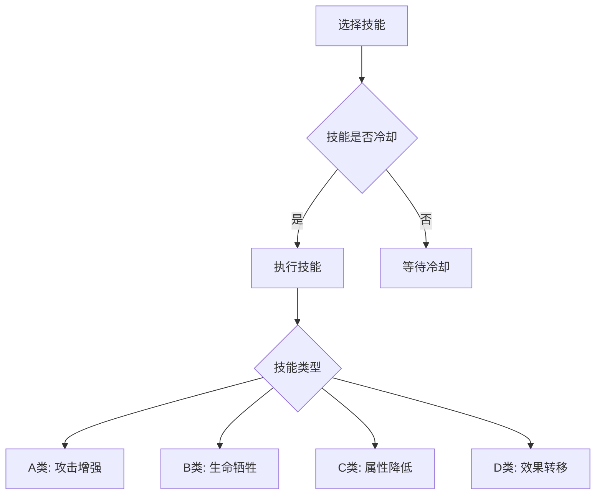

**Diagram sources**
- [BattleServiceImpl.java](file://Game/src/main/java/com/bot/game/service/impl/BattleServiceImpl.java#L236-L278)
- [ENSkillEffect.java](file://Game/src/main/java/com/bot/game/enums/ENSkillEffect.java#L13-L46)

### 伤害计算
伤害计算是战斗系统的核心逻辑，决定了每次攻击的实际效果。系统采用多层次的计算公式，考虑基础攻击、属性克制、会心暴击和防御减免等因素。在`BattleServiceImpl`的`finalAttack`方法中，首先计算基础伤害（攻击力减去防御力），然后应用各种增益和减益效果。

伤害计算流程如下：
1. 计算基础伤害：`伤害 = 攻击力 - 防御力`
2. 应用属性克制：如果攻击方属性克制防御方，伤害增加20%
3. 检查会心暴击：根据会心率随机判定是否暴击，暴击时伤害倍数增加
4. 应用防御减免：防御力直接减少所受伤害
5. 应用特殊效果：如反弹伤害、免疫伤害等

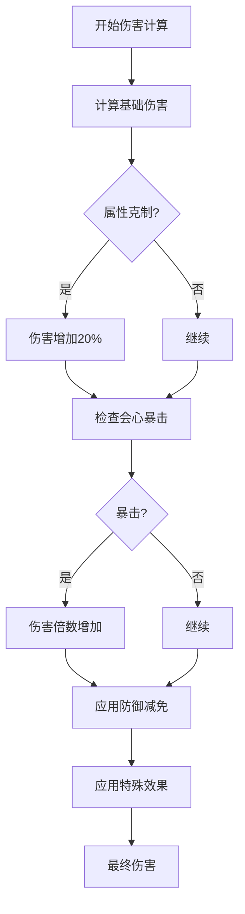

**Diagram sources**
- [BattleServiceImpl.java](file://Game/src/main/java/com/bot/game/service/impl/BattleServiceImpl.java#L307-L321)
- [GameConsts.java](file://Common/src/main/java/com/bot/common/constant/GameConsts.java#L190-L202)

### 战斗结算
战斗在以下情况下结束：一方生命值降至零或以下，或玩家成功逃跑。战斗结算阶段负责确定战斗结果、计算奖励并清理战斗状态。在`BattleServiceImpl`的`getResult`方法中，系统根据战斗结果返回相应的消息和奖励。

战斗结算流程包括：
1. 检查战斗结束条件
2. 确定胜利方
3. 计算经验值和奖励物品
4. 更新玩家数据
5. 清理战斗状态

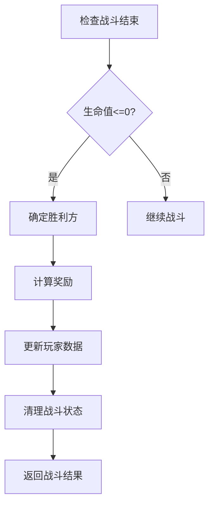

**Diagram sources**
- [BattleServiceImpl.java](file://Game/src/main/java/com/bot/game/service/impl/BattleServiceImpl.java#L344-L370)
- [BattleResult.java](file://Life/src/main/java/com/bot/life/dto/BattleResult.java#L13-L25)

## 战斗状态管理
战斗状态管理是确保战斗过程连续性和数据一致性的关键。系统通过`life_battle_state`表持久化存储战斗过程中的关键状态信息，并在内存中通过`BattleContext`对象管理实时战斗状态。

### 战斗状态实体
`LifeBattleState`实体类定义了战斗状态的核心字段，包括玩家ID、怪物ID、当前回合、双方血量等。这些字段共同构成了战斗的完整状态快照，允许系统在需要时恢复战斗进度。

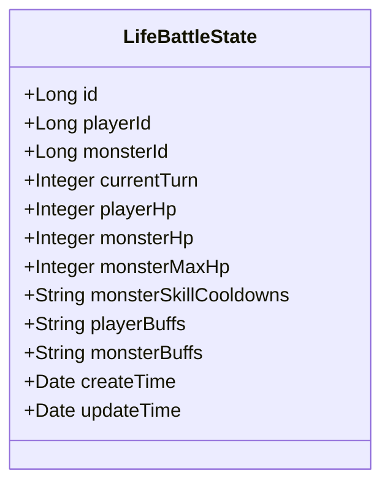

**Diagram sources**
- [LifeBattleState.java](file://Life/src/main/java/com/bot/life/dao/entity/LifeBattleState.java#L11-L24)

### 战斗上下文管理
`BattleContext`类作为战斗过程中的核心状态管理器，封装了战斗的所有实时信息。它不仅包含玩家和怪物的基本信息，还管理战斗日志、效果状态和回合控制。

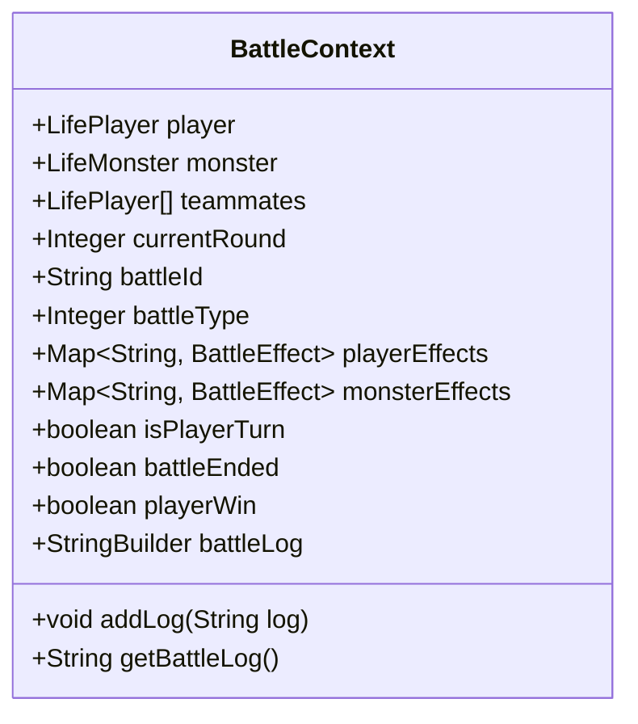

**Diagram sources**
- [BattleContext.java](file://Life/src/main/java/com/bot/life/dto/BattleContext.java#L15-L54)

### 状态持久化
系统通过MyBatis框架实现战斗状态的持久化操作。`LifeBattleStateMapper`接口定义了对`life_battle_state`表的CRUD操作，包括插入新战斗状态、更新现有状态和根据玩家ID查询状态。

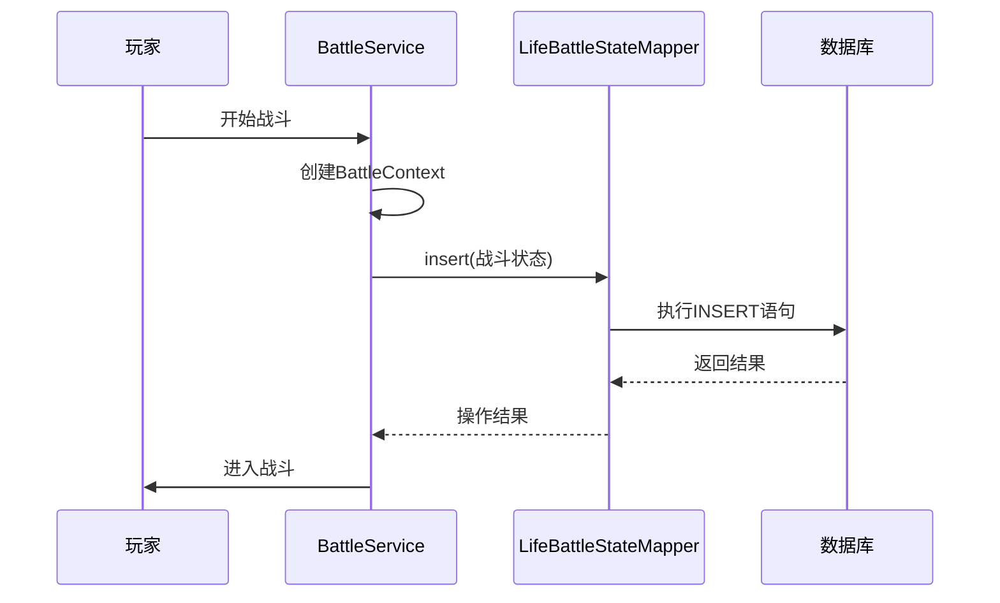

**Diagram sources**
- [LifeBattleStateMapper.java](file://Life/src/main/java/com/bot/life/dao/mapper/LifeBattleStateMapper.java#L10-L25)
- [LifeBattleStateMapper.xml](file://Life/src/main/resources/mapper/LifeBattleStateMapper.xml#L49-L57)

## 战斗伤害计算
战斗伤害计算系统采用多层次的公式，综合考虑基础属性、属性克制、会心暴击和防御减免等因素，确保战斗结果既公平又富有策略性。

### 基础攻击计算
基础攻击力的计算考虑了角色等级和基础属性。在`BattleServiceImpl`的`getBattlePhantom`和`getBattleMonster`方法中，系统根据角色等级和属性点数计算最终攻击力。

```java
// 伪代码示例
int baseAttack = (baseAttack + attributePoint) * ATTACK_POINT;
int levelBonus = level * ATTACK_FOR_EVERY_LEVEL;
double attributeMultiplier = getFigure(myAttribute, targetAttribute);
int finalAttack = (int)(baseAttack + levelBonus) * attributeMultiplier;
```

**Section sources**
- [BattleServiceImpl.java](file://Game/src/main/java/com/bot/game/service/impl/BattleServiceImpl.java#L164-L167)
- [GameConsts.java](file://Common/src/main/java/com/bot/common/constant/GameConsts.java#L195)

### 属性克制机制
属性克制系统基于五行相生相克原理，创建了动态的战斗策略。`ENAttribute`枚举定义了金、木、水、火、土五种属性及其相互关系。

```mermaid
erDiagram
ENAttribute {
string value PK
string buff
string deBuff
}
ENAttribute ||--o{ ENAttribute : "克制"
ENAttribute }o--|| ENAttribute : "被克"
ENAttribute : "金" --> ENAttribute : "木"
ENAttribute : "木" --> ENAttribute : "土"
ENAttribute : "土" --> ENAttribute : "水"
ENAttribute : "水" --> ENAttribute : "火"
ENAttribute : "火" --> ENAttribute : "金"
```

当攻击方属性克制防御方时，伤害增加20%；当被克制时，伤害减少20%。这种机制鼓励玩家根据对手属性选择合适的战斗策略。

**Diagram sources**
- [ENAttribute.java](file://Game/src/main/java/com/bot/game/enums/ENAttribute.java#L13-L17)
- [BattleServiceImpl.java](file://Game/src/main/java/com/bot/game/service/impl/BattleServiceImpl.java#L177-L186)

### 会心暴击计算
会心暴击系统为战斗增加了随机性和刺激感。系统根据角色的会心率属性，随机判定是否触发暴击。暴击时，伤害倍数显著增加，通常为正常伤害的1.5到2倍。

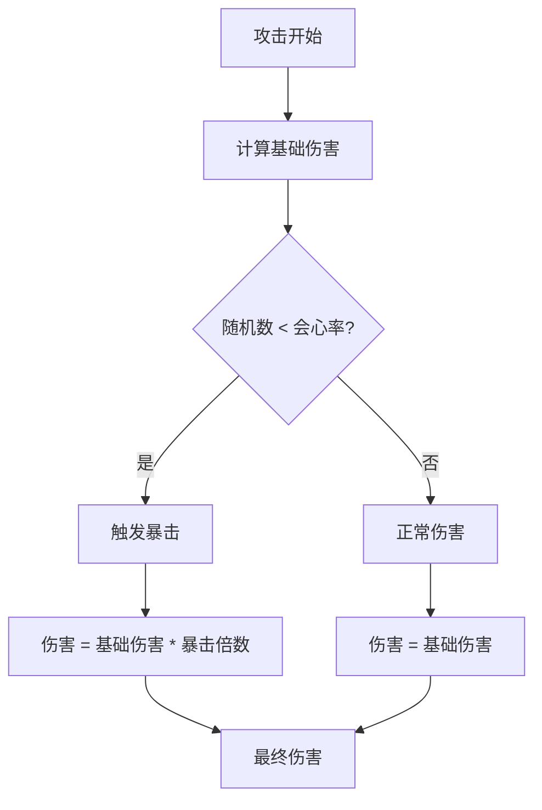

**Section sources**
- [BattleServiceImpl.java](file://Life/src/main/java/com/bot/life/service/impl/BattleServiceImpl.java#L153-L155)

### 防御减免机制
防御减免机制确保高防御角色能够有效减少所受伤害。系统采用线性减免模型，防御力直接从伤害中扣除，但设置了最低伤害保障（至少造成1点伤害）。

```java
// 伪代码示例
int damage = attacker.getAttackPower() - defender.getDefense();
if (damage < 1) {
    damage = 1; // 最低伤害保障
}
```

此外，系统还实现了破防机制，攻击方的破防属性可以降低防御方的有效防御力，最高可降低30%。

**Section sources**
- [BattleServiceImpl.java](file://Life/src/main/java/com/bot/life/service/impl/BattleServiceImpl.java#L157-L162)

## BattleServiceImpl服务实现
`BattleServiceImpl`是战斗系统的核心服务类，负责封装和处理所有战斗相关的业务逻辑。该类在Game和Life两个模块中都有实现，分别处理不同层面的战斗需求。

### Game模块实现
在Game模块中，`BattleServiceImpl`继承自`CommonPlayer`，专注于具体的战斗流程执行。该实现处理战斗的每个细节，包括属性计算、回合执行和结果判定。

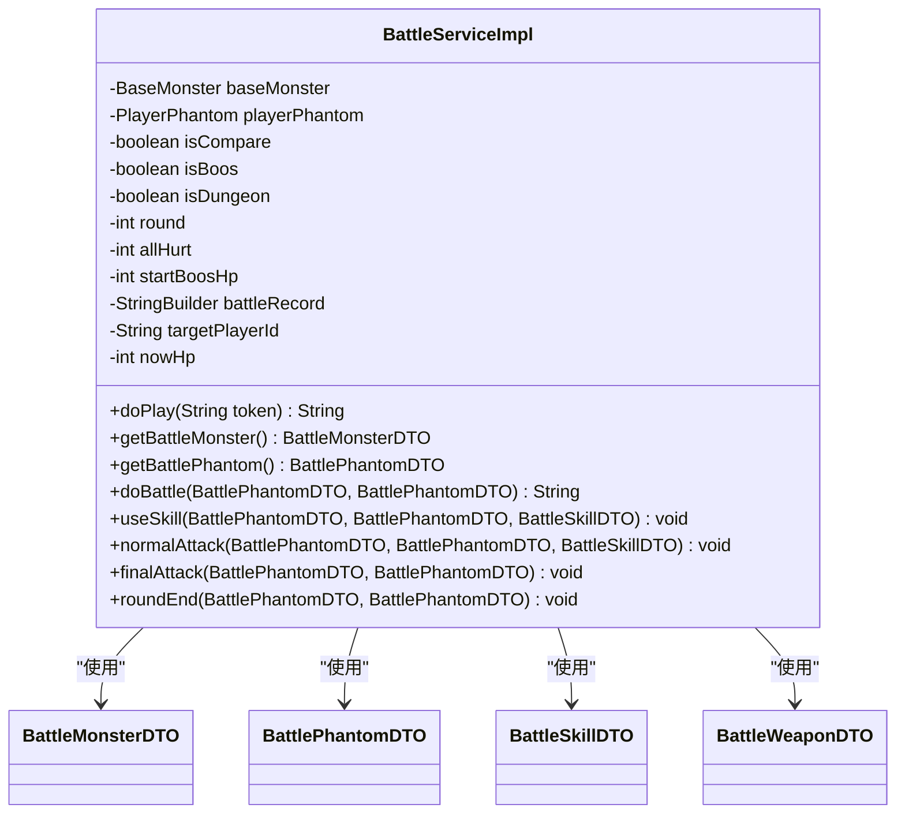

**Diagram sources**
- [BattleServiceImpl.java](file://Game/src/main/java/com/bot/game/service/impl/BattleServiceImpl.java#L29-L691)

### Life模块实现
在Life模块中，`BattleServiceImpl`实现了`BattleService`接口，提供更高层次的战斗服务。该实现更注重战斗的通用性和可扩展性，支持多种战斗类型。

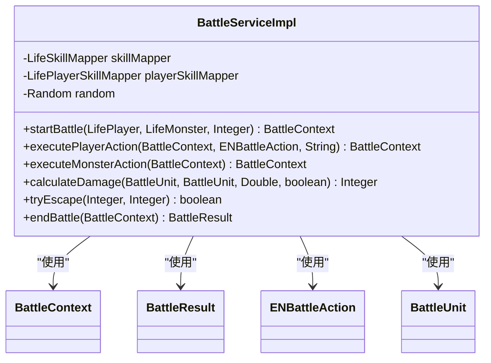

**Diagram sources**
- [BattleServiceImpl.java](file://Life/src/main/java/com/bot/life/service/impl/BattleServiceImpl.java#L27-L304)
- [BattleService.java](file://Life/src/main/java/com/bot/life/service/BattleService.java#L12-L78)

### 核心方法分析
`BattleServiceImpl`包含多个核心方法，共同构成了完整的战斗流程：

1. **doPlay方法**：战斗的入口点，初始化战斗记录并启动战斗循环。
2. **doBattle方法**：主战斗循环，交替执行双方行动直到战斗结束。
3. **useSkill方法**：处理技能释放逻辑，应用技能效果。
4. **normalAttack方法**：处理普通攻击，包括伤害计算和效果应用。
5. **finalAttack方法**：执行最终伤害计算，考虑所有增益和减益效果。
6. **roundEnd方法**：回合结束处理，更新技能冷却和持续效果。

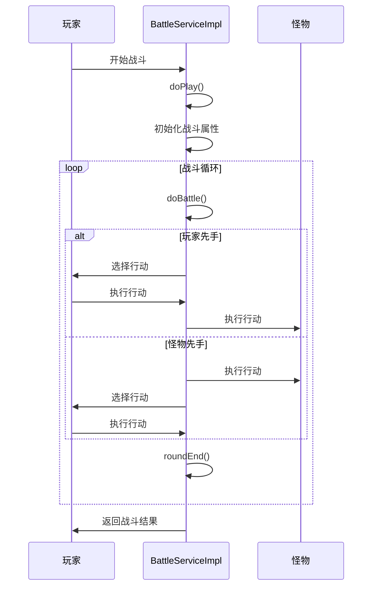

**Diagram sources**
- [BattleServiceImpl.java](file://Game/src/main/java/com/bot/game/service/impl/BattleServiceImpl.java#L87-L121)
- [BattleServiceImpl.java](file://Game/src/main/java/com/bot/game/service/impl/BattleServiceImpl.java#L188-L207)

## life_battle_state表结构设计
`life_battle_state`表是战斗系统的核心数据存储，负责持久化战斗过程中的关键状态信息。该表设计充分考虑了战斗的实时性和数据一致性需求。

### 字段说明
| 字段名 | 数据类型 | 说明 |
|--------|--------|------|
| id | BIGINT | 主键，自增 |
| player_id | BIGINT | 玩家ID，关联玩家表 |
| monster_id | BIGINT | 怪物ID，关联怪物表 |
| current_turn | INTEGER | 当前回合数 |
| player_hp | INTEGER | 玩家当前血量 |
| monster_hp | INTEGER | 怪物当前血量 |
| monster_max_hp | INTEGER | 怪物最大血量 |
| monster_skill_cooldowns | LONGVARCHAR | 怪物技能冷却状态（JSON格式） |
| player_buffs | LONGVARCHAR | 玩家增益效果（JSON格式） |
| monster_buffs | LONGVARCHAR | 怪物增益效果（JSON格式） |
| create_time | TIMESTAMP | 创建时间 |
| update_time | TIMESTAMP | 更新时间 |

**Section sources**
- [LifeBattleStateMapper.xml](file://Life/src/main/resources/mapper/LifeBattleStateMapper.xml#L5-L17)

### 设计考量
表结构设计体现了以下几个关键考量：

1. **状态完整性**：表中包含了战斗所需的所有关键状态信息，确保能够完整恢复战斗进度。
2. **性能优化**：使用LONGVARCHAR类型存储复杂的JSON数据，避免了多表关联的性能开销。
3. **扩展性**：通过JSON格式存储技能冷却和增益效果，便于未来添加新的战斗机制。
4. **数据一致性**：通过player_id字段确保每个玩家在同一时间只能参与一场战斗。

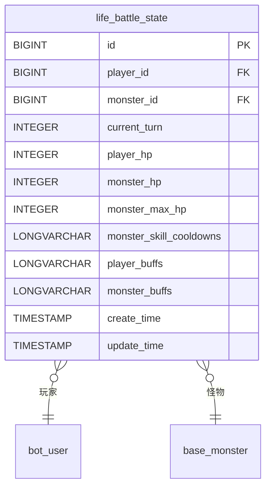

**Diagram sources**
- [LifeBattleStateMapper.xml](file://Life/src/main/resources/mapper/LifeBattleStateMapper.xml#L20-L23)

### 持久化策略
系统采用主动持久化策略，在每个重要状态变更时更新数据库记录。这种策略确保了即使在服务器意外重启的情况下，玩家的战斗进度也不会丢失。

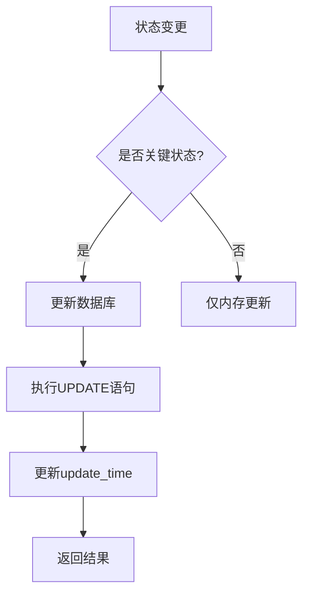

**Section sources**
- [LifeBattleStateMapper.java](file://Life/src/main/java/com/bot/life/dao/mapper/LifeBattleStateMapper.java#L13-L14)

## 技能效果扩展
技能效果系统设计具有良好的扩展性，允许开发者轻松添加新的技能效果和战斗机制。

### 技能效果枚举
`ENSkillEffect`枚举是技能效果系统的核心，定义了所有可用的技能效果。每个效果包含值、描述、类型和触发时机等信息。

```java
public enum ENSkillEffect {
    A01("A01", "给目标造成双倍伤害", null, null),
    A02("A02", "给目标造成1.5倍伤害", null, null),
    // ... 其他效果
}
```

要添加新的技能效果，只需在枚举中添加新的条目：

```java
// 示例：添加新技能效果
A05("A05", "给目标造成4倍伤害，但自身防御降低50%", null, null),
```

**Section sources**
- [ENSkillEffect.java](file://Game/src/main/java/com/bot/game/enums/ENSkillEffect.java#L13-L46)

### 效果类型系统
系统通过`ENEffectType`枚举定义了技能效果的触发时机，包括前置、后置、攻击时和受击时。这种设计允许技能在战斗的不同阶段生效，增加了战斗的策略深度。

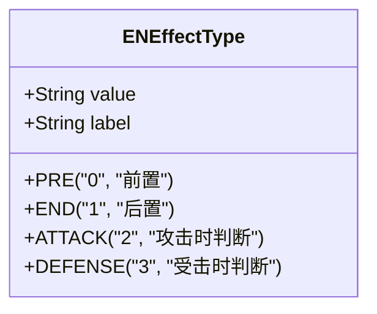

**Diagram sources**
- [ENEffectType.java](file://Game/src/main/java/com/bot/game/enums/ENEffectType.java#L12-L15)

### 战斗单位适配器
为了支持更复杂的战斗机制，系统采用了适配器模式。`PlayerBattleUnit`和`MonsterBattleUnit`类将玩家和怪物对象适配为统一的`BattleUnit`接口，便于在战斗逻辑中统一处理。

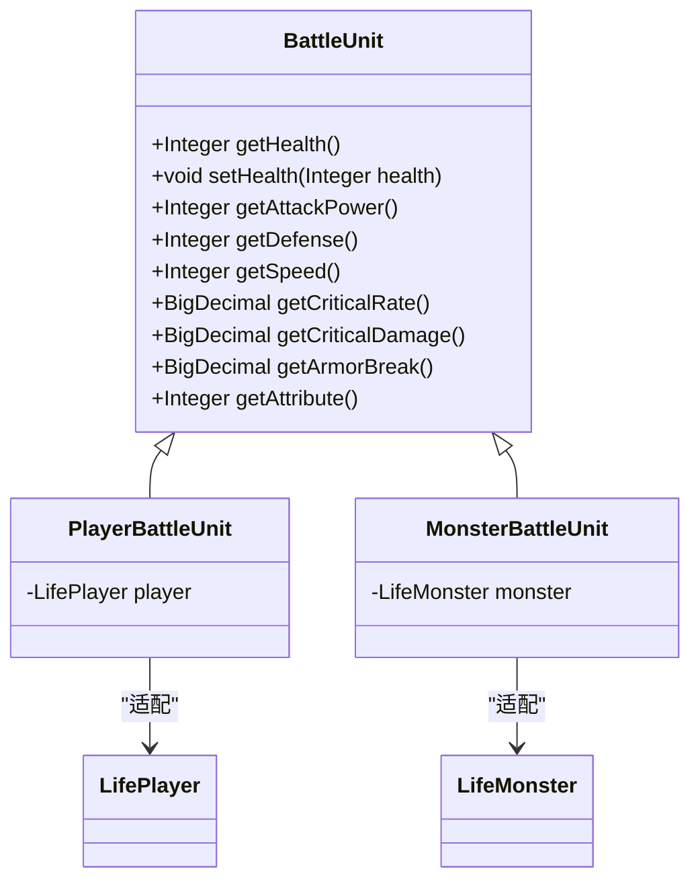

**Diagram sources**
- [BattleServiceImpl.java](file://Life/src/main/java/com/bot/life/service/impl/BattleServiceImpl.java#L197-L248)

### 扩展建议
为了进一步扩展技能效果系统，建议：

1. **添加持续伤害效果**：实现DOT（Damage over Time）机制，让技能效果在多个回合内持续生效。
2. **引入元素反应**：基于属性克制系统，添加元素反应机制，如"火+水=蒸汽"等复合效果。
3. **支持组合技能**：允许玩家组合多个技能，触发更强大的连锁效果。
4. **增加环境因素**：引入天气、地形等环境因素，影响技能效果和战斗结果。

## 结论
“浮生卷”游戏的战斗系统通过精心设计的回合制机制，为玩家提供了丰富而策略性的战斗体验。系统通过`BattleServiceImpl`服务实现了战斗逻辑的封装和业务处理，确保了代码的可维护性和可扩展性。`life_battle_state`表结构设计合理，有效管理了战斗过程中的状态信息。伤害计算公式综合考虑了基础攻击、属性克制、会心暴击和防御减免等因素，确保了战斗结果的公平性和多样性。技能效果系统具有良好的扩展性，为未来添加新的战斗机制提供了便利。整体而言，该战斗系统架构清晰、逻辑严谨，为游戏的核心玩法提供了坚实的基础。