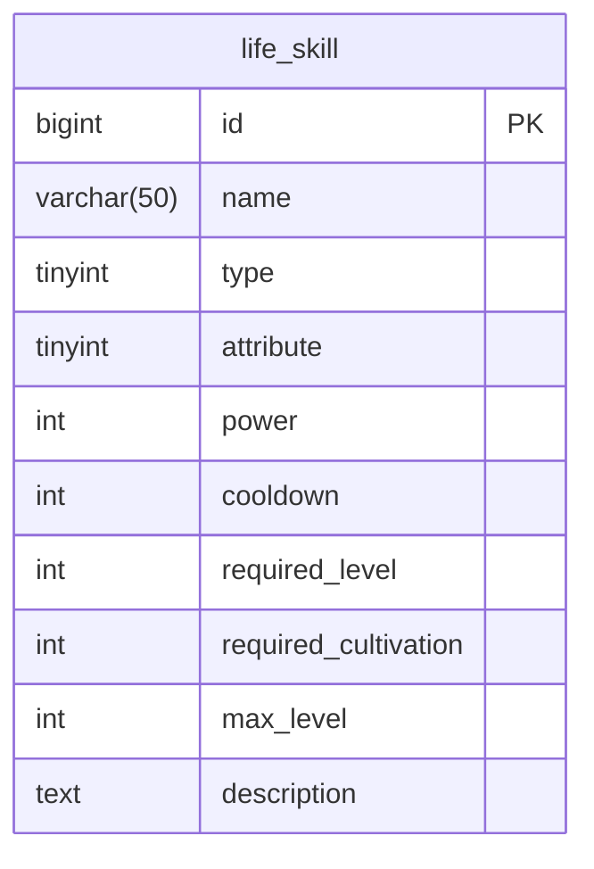
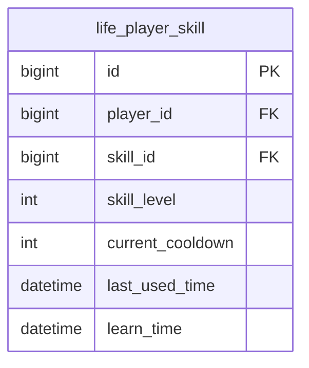
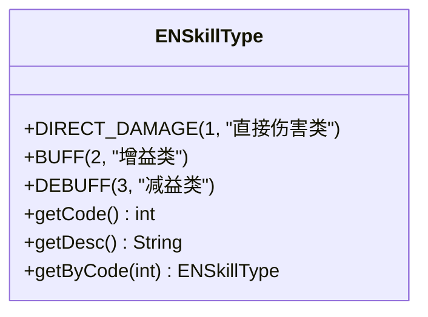
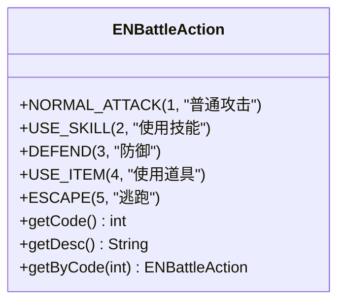
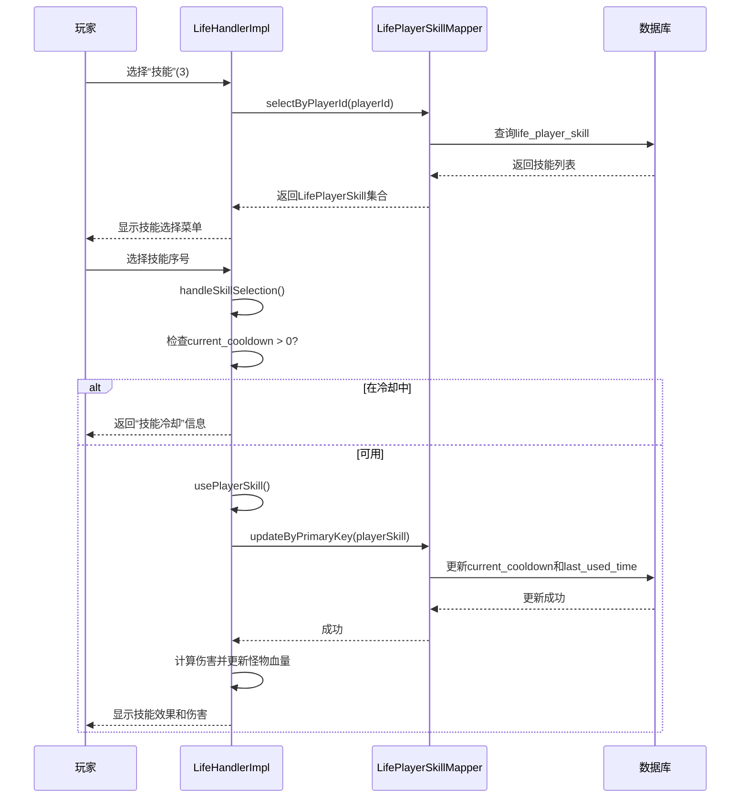

# 技能系统

<cite>
**本文档引用的文件**
- [LifeSkill.java](file://Life\src\main\java\com\bot\life\dao\entity\LifeSkill.java)
- [LifePlayerSkill.java](file://Life\src\main\java\com\bot\life\dao\entity\LifePlayerSkill.java)
- [SkillServiceImpl.java](file://Life\src\main\java\com\bot\life\service\impl\SkillServiceImpl.java)
- [LifeHandlerImpl.java](file://Life\src\main\java\com\bot\life\service\impl\LifeHandlerImpl.java)
- [ENBattleAction.java](file://Life\src\main\java\com\bot\life\enums\ENBattleAction.java)
- [LifeSkillMapper.xml](file://Life\src\main\resources\mapper\LifeSkillMapper.xml)
- [LifePlayerSkillMapper.xml](file://Life\src\main\resources\mapper\LifePlayerSkillMapper.xml)
- [Life_Database_Field_Fix.md](file://Life_Database_Field_Fix.md)
- [Life_Database_Tables_Check.md](file://Life_Database_Tables_Check.md)
</cite>

## 目录
1. [技能系统概述](#技能系统概述)
2. [核心数据表结构](#核心数据表结构)
3. [技能类型与效果](#技能类型与效果)
4. [技能使用流程](#技能使用流程)
5. [技能效果实现机制](#技能效果实现机制)
6. [技能学习与升级](#技能学习与升级)
7. [开发者扩展指南](#开发者扩展指南)

## 技能系统概述

“浮生卷”游戏中的技能系统是战斗机制的核心组成部分，为玩家提供多样化的战斗策略选择。技能系统通过`life_skill`和`life_player_skill`两张数据库表进行数据管理，分别存储技能的基础信息和玩家与技能的关联关系。玩家在战斗中可以通过选择“技能”选项来使用已学习的技能，每个技能都有特定的威力、冷却时间、类型和使用条件。

技能系统的设计遵循了清晰的分层架构，包括数据层（实体类和数据库表）、服务层（SkillService接口及其实现）和控制层（LifeHandlerImpl）。这种设计使得技能的管理、学习、升级和使用逻辑清晰分离，便于维护和扩展。

**本节来源**
- [LifeSkill.java](file://Life\src\main\java\com\bot\life\dao\entity\LifeSkill.java#L1-L24)
- [LifePlayerSkill.java](file://Life\src\main\java\com\bot\life\dao\entity\LifePlayerSkill.java#L1-L24)
- [SkillServiceImpl.java](file://Life\src\main\java\com\bot\life\service\impl\SkillServiceImpl.java#L1-L292)

## 核心数据表结构

技能系统的核心数据由`life_skill`和`life_player_skill`两个数据库表构成，其结构设计经过了多次修复和优化，以确保与Java实体类的字段完全匹配。

### life_skill 表结构

`life_skill`表存储了游戏中所有技能的基础信息，是技能系统的静态数据源。

**表字段说明**

| 字段名 | 类型 | 是否为空 | 默认值 | 注释 |
| :--- | :--- | :--- | :--- | :--- |
| `id` | bigint | 否 | 无 | 主键，自增 |
| `name` | varchar(50) | 否 | 无 | 技能名称 |
| `type` | tinyint | 否 | 无 | 技能类型：1直接伤害 2增益 3减益 |
| `attribute` | tinyint | 是 | 0 | 技能属性：0无属性 1金 2木 3水 4火 5土 |
| `power` | int | 是 | 0 | 技能威力 |
| `cooldown` | int | 是 | 0 | 冷却时间（秒） |
| `required_level` | int | 是 | 1 | 需要等级 |
| `required_cultivation` | int | 是 | 0 | 需要修为 |
| `max_level` | int | 是 | 10 | 最大等级 |
| `description` | text | 是 | 无 | 技能描述 |

该表的结构在`Life_Database_Field_Fix.md`文件中被修复，将原始的`skill_type`字段名更正为`type`，并补充了`power`、`cooldown`、`required_level`等缺失字段，以匹配Java实体类`LifeSkill`。

**图示来源**
- [Life_Database_Field_Fix.md](file://Life_Database_Field_Fix.md#L34-L49)
- [LifeSkill.java](file://Life\src\main\java\com\bot\life\dao\entity\LifeSkill.java#L13-L22)

### life_player_skill 表结构

`life_player_skill`表存储了玩家与技能之间的关联关系，记录了玩家已学习的技能及其状态。

**表字段说明**

| 字段名 | 类型 | 是否为空 | 默认值 | 注释 |
| :--- | :--- | :--- | :--- | :--- |
| `id` | bigint | 否 | 无 | 主键，自增 |
| `player_id` | bigint | 否 | 无 | 玩家ID，外键关联玩家表 |
| `skill_id` | bigint | 否 | 无 | 技能ID，外键关联life_skill表 |
| `skill_level` | int | 是 | 1 | 技能等级 |
| `current_cooldown` | int | 是 | 0 | 当前冷却时间（秒） |
| `last_used_time` | datetime | 是 | NULL | 最后使用时间 |
| `learn_time` | datetime | 是 | CURRENT_TIMESTAMP | 学习时间 |

该表在`Life_Database_Tables_Check.md`文件中被创建，用于解决“表不存在”的错误。其设计确保了玩家与技能之间的一对多关系，并通过`player_id`和`skill_id`的唯一键约束防止重复学习。

**图示来源**
- [Life_Database_Tables_Check.md](file://Life_Database_Tables_Check.md#L34-L53)
- [LifePlayerSkill.java](file://Life\src\main\java\com\bot\life\dao\entity\LifePlayerSkill.java#L13-L19)

### 实体类与数据库映射

Java实体类`LifeSkill`和`LifePlayerSkill`通过MyBatis框架与数据库表进行映射。`LifeSkillMapper.xml`和`LifePlayerSkillMapper.xml`文件中的`resultMap`配置确保了数据库字段与Java类属性的正确对应。

例如，`LifeSkillMapper.xml`中的`BaseResultMap`将数据库的`required_level`字段映射到Java类的`requiredLevel`属性，实现了数据库命名规范（下划线）与Java命名规范（驼峰）的转换。

**本节来源**
- [LifeSkillMapper.xml](file://Life\src\main\resources\mapper\LifeSkillMapper.xml#L5-L15)
- [LifePlayerSkillMapper.xml](file://Life\src\main\resources\mapper\LifePlayerSkillMapper.xml#L5-L13)

## 技能类型与效果

技能系统通过`type`字段和`ENSkillType`枚举来定义和管理不同的技能类型。

### 技能类型（ENSkillType）

`ENSkillType`枚举定义了三种核心技能类型：

- **直接伤害类 (1)**: 技能的主要效果是对目标造成直接伤害，伤害值由玩家攻击力和技能威力共同决定。
- **增益类 (2)**: 技能为使用者或友方单位提供正面状态效果，如增加攻击力、防御力或速度。
- **减益类 (3)**: 技能为敌方单位施加负面状态效果，如降低攻击力、防御力或速度。

在`SkillServiceImpl`中，通过`getSkillTypeName`方法将`type`字段的整数值转换为可读的中文描述，用于在技能列表中显示。

**图示来源**
- [ENSkillType.java](file://Life\src\main\java\com\bot\life\enums\ENSkillType.java#L7-L37)

### 技能属性

技能的`attribute`字段定义了其五行属性（金、木、水、火、土）。玩家在学习技能时，如果技能有特定属性要求（`attribute`不为0），则玩家的属性必须与技能属性匹配。这增加了游戏的策略深度，鼓励玩家根据自身属性构建技能组合。

## 技能使用流程

技能的使用流程由`ENBattleAction`枚举和`LifeHandlerImpl`类共同控制，形成了一个清晰的回合制战斗交互逻辑。

### 战斗行动枚举（ENBattleAction）

`ENBattleAction`枚举定义了战斗中玩家可以执行的所有操作，其中`USE_SKILL`（代码2）代表使用技能。

在战斗中，当玩家选择“3. 技能”时，`LifeHandlerImpl`会调用`handleBattleSkill`方法，该方法会查询`playerSkillMapper`获取玩家已学习的技能列表，并生成一个可供选择的菜单。

**图示来源**
- [ENBattleAction.java](file://Life\src\main\java\com\bot\life\enums\ENBattleAction.java#L6-L37)

### 技能选择与执行流程

1.  **显示技能列表**: `handleBattleSkill`方法查询`life_player_skill`表，获取玩家所有已学习的技能。对于每个技能，它会检查`current_cooldown`字段来判断是否处于冷却中，并在菜单中显示相应的冷却信息。
2.  **处理技能选择**: 当玩家输入技能序号后，`handleSkillSelection`方法被调用。它首先验证选择的序号是否有效。
3.  **冷却时间检查**: 方法会检查所选技能的`current_cooldown`是否大于0。如果在冷却中，则返回错误信息。
4.  **执行技能**: 如果技能可用，则调用`usePlayerSkill`方法。该方法会立即设置技能的冷却时间，并返回`true`。
5.  **应用技能效果**: `handleSkillSelection`在确认技能使用成功后，会计算技能伤害（`player.getAttackPower() + selectedSkill.getSkill().getPower()`），并更新怪物的血量。
6.  **更新状态**: 技能使用后，玩家的行动回合结束，轮到怪物行动。

**图示来源**
- [LifeHandlerImpl.java](file://Life\src\main\java\com\bot\life\service\impl\LifeHandlerImpl.java#L1295-L1326)
- [LifeHandlerImpl.java](file://Life\src\main\java\com\bot\life\service\impl\LifeHandlerImpl.java#L1764-L1859)
- [LifeHandlerImpl.java](file://Life\src\main\java\com\bot\life\service\impl\LifeHandlerImpl.java#L1554-L1568)

## 技能效果实现机制

技能效果的实现主要依赖于技能的`type`和`power`字段，以及服务层的业务逻辑。

### 直接伤害效果

这是最直接的效果类型。当技能的`type`为`DIRECT_DAMAGE`时，其`power`字段直接作为伤害加成。在`handleSkillSelection`方法中，伤害计算公式为：
`技能伤害 = MAX(1, (玩家攻击力 + 技能威力) - 怪物防御力)`

### 增益与减益效果

虽然当前代码中`handleSkillSelection`主要处理了直接伤害，但系统架构已为增益和减益效果预留了空间。`LifePlayerSkill`实体中包含`skillLevel`字段，暗示技能效果可能随等级提升而增强。`BattleEffect`DTO类的存在也表明，未来可以通过在`LifePlayer`或`LifeBattleState`对象中维护一个`Map<String, BattleEffect>`来实现持续性的状态效果。

### 冷却时间机制

冷却时间是技能系统的核心机制之一，通过`life_player_skill`表的`current_cooldown`和`last_used_time`字段实现。

- **基于时间的冷却**: `SkillServiceImpl`中的`isSkillAvailable`方法通过比较`last_used_time`和当前时间，与`life_skill`表中的`cooldown`字段进行计算，来判断技能是否已结束冷却。
- **基于回合的冷却**: `LifeHandlerImpl`中的`updateSkillCooldowns`方法（未在提供的代码片段中，但逻辑可推断）会在每回合开始时将`current_cooldown`减1，当其为0时技能即可再次使用。

## 技能学习与升级

技能的学习和升级由`SkillService`接口提供，具体实现在`SkillServiceImpl`类中。

### 技能学习 (learnSkill)

玩家通过使用技能书来学习新技能。`learnSkill`方法的执行流程如下：
1.  **存在性检查**: 通过`skillMapper.selectByPrimaryKey(skillId)`检查技能ID是否存在。
2.  **已学检查**: 通过`playerSkillMapper.selectByPlayerIdAndSkillId`检查玩家是否已学会该技能。
3.  **条件检查**: 检查玩家等级、属性和修为是否满足技能的`requiredLevel`、`attribute`和`requiredCultivation`要求。
4.  **创建记录**: 如果所有条件满足，则在`life_player_skill`表中插入一条新记录，`skillLevel`初始化为1。

### 技能升级 (upgradeSkill)

技能升级允许玩家提升已学技能的等级，通常会增强技能效果。
1.  **存在性检查**: 检查玩家是否已学习该技能。
2.  **最高等级检查**: 检查当前技能等级是否已达到`maxLevel`。
3.  **修为消耗**: 计算升级所需修为（`requiredCultivation * (当前等级 + 1)`），并检查玩家修为是否足够。
4.  **执行升级**: 更新`life_player_skill`表中的`skillLevel`字段，并扣除相应修为。

**本节来源**
- [SkillServiceImpl.java](file://Life\src\main\java\com\bot\life\service\impl\SkillServiceImpl.java#L66-L155)

## 开发者扩展指南

为了扩展新的技能，开发者需要遵循以下步骤：

1.  **定义新技能**: 在数据库的`life_skill`表中插入一条新记录，指定`name`、`type`、`attribute`、`power`、`cooldown`、`required_level`、`required_cultivation`、`max_level`和`description`等字段。
2.  **实现特殊效果**: 如果新技能需要超出直接伤害的复杂效果（如增益、减益、治疗等），需要在`LifeHandlerImpl`的`handleSkillSelection`方法中添加相应的逻辑分支。可以创建一个`SkillEffectHandler`接口，并为每种效果类型实现具体的处理器。
3.  **更新UI**: 确保`getPlayerSkills`和`getAvailableSkills`等方法能正确显示新技能的信息。
4.  **测试**: 在游戏中测试新技能的学习、升级和使用流程，确保冷却时间、伤害计算和条件检查逻辑正确无误。

通过遵循此文档中描述的架构和流程，开发者可以高效地为“浮生卷”游戏添加丰富多样的新技能，提升游戏的可玩性和深度。

**本节来源**
- [LifeSkill.java](file://Life\src\main\java\com\bot\life\dao\entity\LifeSkill.java)
- [SkillServiceImpl.java](file://Life\src\main\java\com\bot\life\service\impl\SkillServiceImpl.java)
- [LifeHandlerImpl.java](file://Life\src\main\java\com\bot\life\service\impl\LifeHandlerImpl.java)