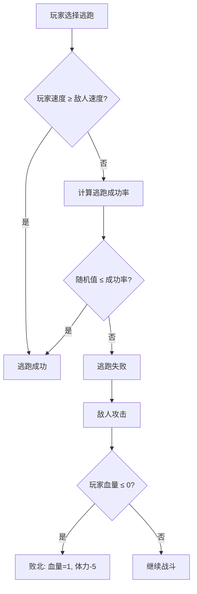

# 逃跑机制

<cite>
**本文档引用文件**  
- [BattleServiceImpl.java](file://Life\src\main\java\com\bot\life\service\impl\BattleServiceImpl.java)
- [LifeHandlerImpl.java](file://Life\src\main\java\com\bot\life\service\impl\LifeHandlerImpl.java)
- [SystemConfig.java](file://Game\src\main\java\com\bot\game\dao\entity\SystemConfig.java)
- [SystemConfigMapper.xml](file://Game\src\main\resources\mapper\SystemConfigMapper.xml)
</cite>

## 目录
1. [逃跑机制概述](#逃跑机制概述)
2. [逃跑成功率计算公式](#逃跑成功率计算公式)
3. [系统配置项说明](#系统配置项说明)
4. [逃跑成功与失败的战斗状态变化](#逃跑成功与失败的战斗状态变化)
5. [用户反馈信息](#用户反馈信息)

## 逃跑机制概述

在“浮生卷”游戏中，逃跑机制是战斗系统中的重要组成部分，允许玩家在战斗中选择逃离当前战斗。逃跑的成功与否取决于玩家与敌人的速度属性对比以及系统配置参数。该机制主要由 `BattleServiceImpl` 类中的 `tryEscape` 方法实现，并在 `LifeHandlerImpl` 类中进行调用和处理。

**本节来源**  
- [BattleServiceImpl.java](file://Life\src\main\java\com\bot\life\service\impl\BattleServiceImpl.java#L164-L177)
- [LifeHandlerImpl.java](file://Life\src\main\java\com\bot\life\service\impl\LifeHandlerImpl.java#L1418-L1485)

## 逃跑成功率计算公式

逃跑成功率的计算基于以下公式：

1. **速度优势判定**：如果玩家速度大于或等于敌人速度，则逃跑必定成功。
2. **基础成功率**：当玩家速度低于敌人时，基础成功率为50%。
3. **速度差距惩罚**：每低10点速度，成功率下降2%。
4. **最低成功率限制**：最终成功率不得低于10%。

具体实现代码逻辑如下：
- 计算速度差值：`speedDiff = monsterSpeed - playerSpeed`
- 计算惩罚值：`penalty = (speedDiff / 10) * 0.02`
- 最终成功率：`finalSuccessRate = max(0.1, baseSuccessRate - penalty)`
- 随机判定：生成一个0到1之间的随机数，若小于最终成功率则逃跑成功。

**本节来源**  
- [BattleServiceImpl.java](file://Life\src\main\java\com\bot\life\service\impl\BattleServiceImpl.java#L164-L177)
- [LifeHandlerImpl.java](file://Life\src\main\java\com\bot\life\service\impl\LifeHandlerImpl.java#L1438-L1448)

## 系统配置项说明

系统配置表（life_system_config）中包含两个关键配置项用于控制逃跑机制：

- **escape_base_success_rate**：定义逃跑的基础成功率，默认值为50%。此配置项可在数据库中动态调整，影响所有逃跑尝试的初始成功率。
- **escape_speed_penalty_rate**：定义速度差距对逃跑成功率的影响系数，即每低10点速度减少的百分比，默认值为2%。

这些配置项通过 `SystemConfig` 实体类和对应的 MyBatis 映射文件进行管理，允许管理员在不修改代码的情况下调整游戏平衡性。

**本节来源**  
- [SystemConfig.java](file://Game\src\main\java\com\bot\game\dao\entity\SystemConfig.java)
- [SystemConfigMapper.xml](file://Game\src\main\resources\mapper\SystemConfigMapper.xml)

## 逃跑成功与失败的战斗状态变化

### 逃跑成功
- 战斗状态结束，玩家退出战斗模式。
- 玩家体力值减少1点。
- 清理战斗相关状态数据。
- 返回主菜单提示。

### 逃跑失败
- 玩家未能逃离，敌人将发起一次攻击。
- 若攻击导致玩家血量归零，则判定为败北，血量恢复至1点，体力减少5点。
- 若玩家仍存活，则继续战斗回合，提示选择下一步行动。

**图示来源**  
- [BattleServiceImpl.java](file://Life\src\main\java\com\bot\life\service\impl\BattleServiceImpl.java#L76-L85)
- [LifeHandlerImpl.java](file://Life\src\main\java\com\bot\life\service\impl\LifeHandlerImpl.java#L1453-L1465)

## 用户反馈信息

系统会根据逃跑结果向用户提供明确的反馈信息：

- **逃跑成功时**：
  - “『逃跑成功！』\n\n你的速度(%d)大于敌人(%d)，成功逃离！”
  - “『逃跑成功！』\n\n尽管速度劣势，你还是成功逃脱了！\n成功率：%d%% (实际：%d)”

- **逃跑失败时**：
  - “『逃跑失败！』\n\n你试图逃跑但被敌人拦住了！\n成功率：%d%% (实际：%d)\n\n山贼对你发起了攻击！”

此外，若逃跑失败后被击败，还会显示：“『败北！』\n\n你被山贼击败了！\n血量归1，体力-5”。

**本节来源**  
- [LifeHandlerImpl.java](file://Life\src\main\java\com\bot\life\service\impl\LifeHandlerImpl.java#L1436-L1451)
- [LifeHandlerImpl.java](file://Life\src\main\java\com\bot\life\service\impl\LifeHandlerImpl.java#L1458-L1460)