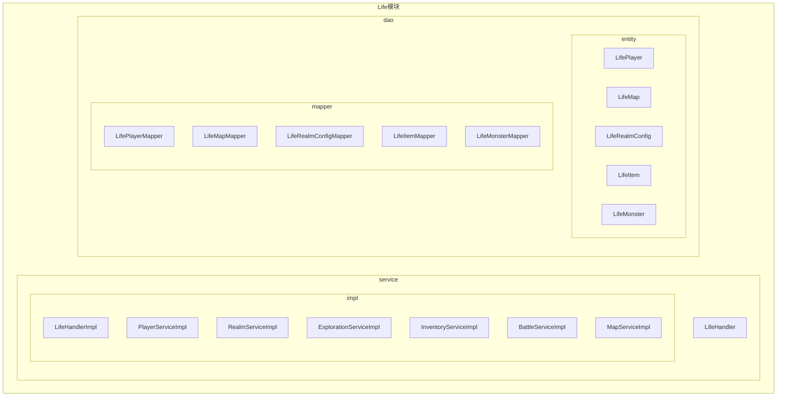
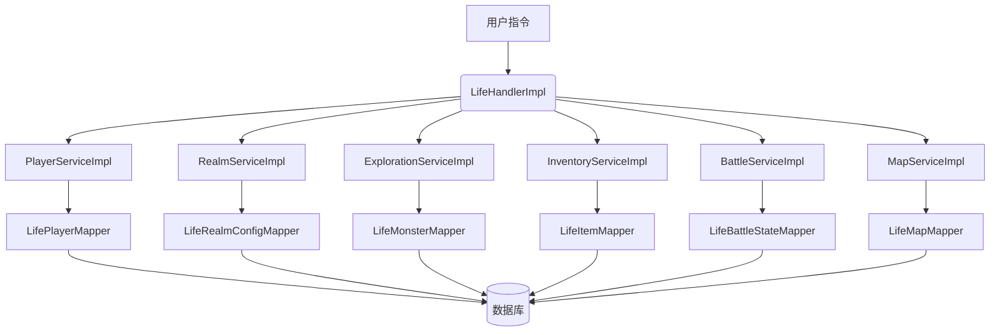
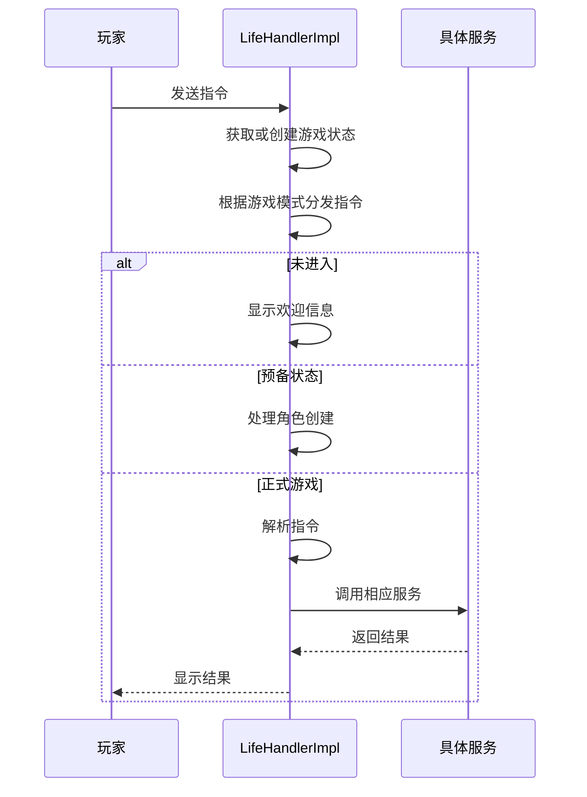
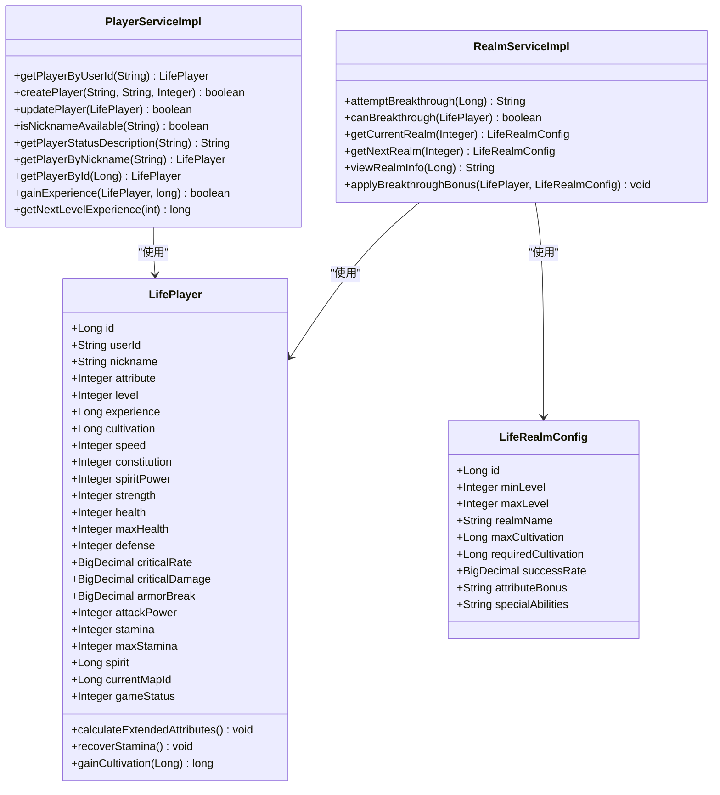
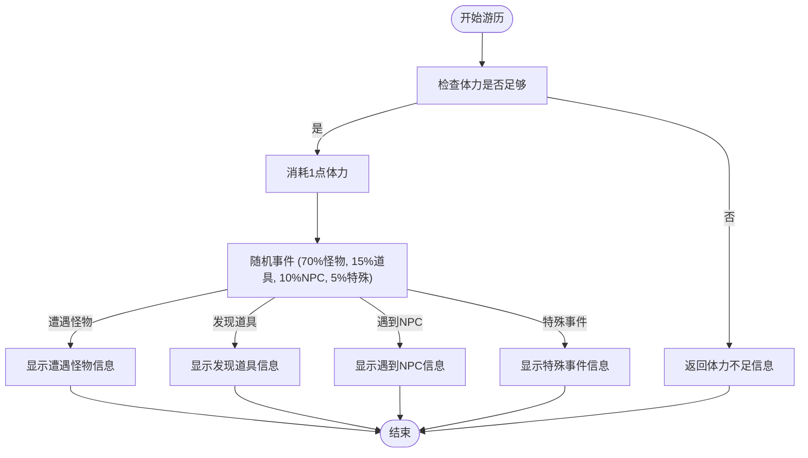
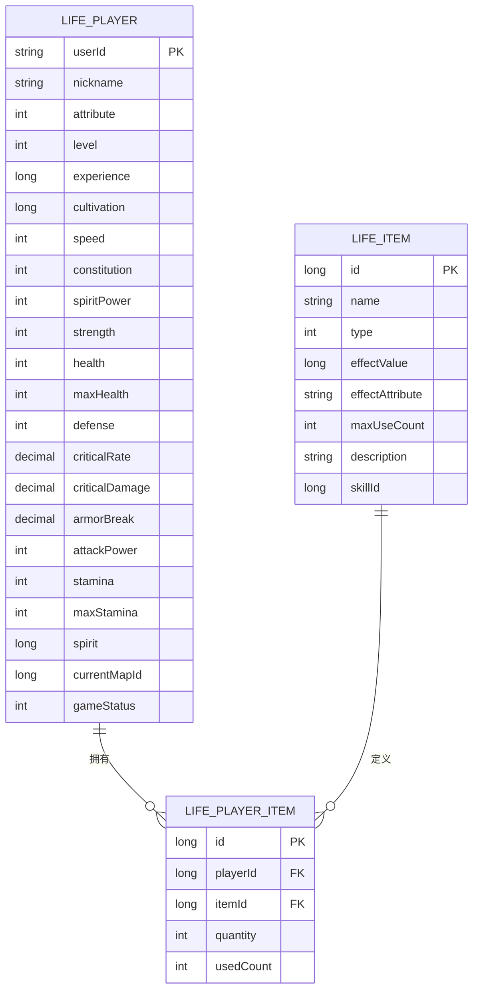
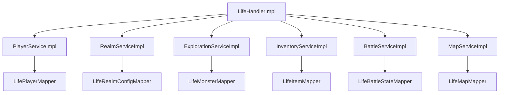

# 游戏系统

<cite>
**本文档引用文件**  
- [LifeHandlerImpl.java](file://Life\src\main\java\com\bot\life\service\impl\LifeHandlerImpl.java)
- [LifePlayer.java](file://Life\src\main\java\com\bot\life\dao\entity\LifePlayer.java)
- [LifeMap.java](file://Life\src\main\java\com\bot\life\dao\entity\LifeMap.java)
- [PlayerServiceImpl.java](file://Life\src\main\java\com\bot\life\service\impl\PlayerServiceImpl.java)
- [RealmServiceImpl.java](file://Life\src\main\java\com\bot\life\service\impl\RealmServiceImpl.java)
- [ExplorationServiceImpl.java](file://Life\src\main\java\com\bot\life\service\impl\ExplorationServiceImpl.java)
- [InventoryServiceImpl.java](file://Life\src\main\java\com\bot\life\service\impl\InventoryServiceImpl.java)
- [BattleServiceImpl.java](file://Life\src\main\java\com\bot\life\service\impl\BattleServiceImpl.java)
- [MapServiceImpl.java](file://Life\src\main\java\com\bot\life\service\impl\MapServiceImpl.java)
- [LifeDatabaseInit.sql](file://Life_Database_Init.sql)
</cite>

## 目录
1. [引言](#引言)
2. [项目结构](#项目结构)
3. [核心组件](#核心组件)
4. [架构概述](#架构概述)
5. [详细组件分析](#详细组件分析)
6. [依赖分析](#依赖分析)
7. [性能考虑](#性能考虑)
8. [故障排除指南](#故障排除指南)
9. [结论](#结论)

## 引言
“浮生卷”是一款基于文本交互的修仙题材游戏，玩家通过发送指令来体验修仙世界的角色成长、战斗、探索和社交。本系统文档旨在全面介绍游戏的核心玩法和实现机制，包括角色成长体系、战斗系统、地图探索和背包道具系统。文档将结合`LifeHandlerImpl`主处理器的代码，说明游戏状态管理和业务流程控制，并解释与数据库的交互设计。此外，文档还将提供玩家从创建角色到日常玩法的完整流程指南，以及为开发者展示如何扩展新的游戏功能。

## 项目结构
该项目采用模块化设计，主要分为Base、Boot、Common、Game和Life五个模块。其中，Life模块是“浮生卷”游戏的核心，包含了游戏的所有业务逻辑和数据访问层。项目结构清晰，遵循了典型的Java后端项目分层架构，包括controller、service、dao和entity等包。



**图源**
- [LifeHandlerImpl.java](file://Life\src\main\java\com\bot\life\service\impl\LifeHandlerImpl.java)
- [PlayerServiceImpl.java](file://Life\src\main\java\com\bot\life\service\impl\PlayerServiceImpl.java)
- [RealmServiceImpl.java](file://Life\src\main\java\com\bot\life\service\impl\RealmServiceImpl.java)
- [ExplorationServiceImpl.java](file://Life\src\main\java\com\bot\life\service\impl\ExplorationServiceImpl.java)
- [InventoryServiceImpl.java](file://Life\src\main\java\com\bot\life\service\impl\InventoryServiceImpl.java)
- [BattleServiceImpl.java](file://Life\src\main\java\com\bot\life\service\impl\BattleServiceImpl.java)
- [MapServiceImpl.java](file://Life\src\main\java\com\bot\life\service\impl\MapServiceImpl.java)
- [LifePlayer.java](file://Life\src\main\java\com\bot\life\dao\entity\LifePlayer.java)
- [LifeMap.java](file://Life\src\main\java\com\bot\life\dao\entity\LifeMap.java)

**章节源**
- [LifeHandlerImpl.java](file://Life\src\main\java\com\bot\life\service\impl\LifeHandlerImpl.java)
- [LifePlayer.java](file://Life\src\main\java\com\bot\life\dao\entity\LifePlayer.java)
- [LifeMap.java](file://Life\src\main\java\com\bot\life\dao\entity\LifeMap.java)

## 核心组件
“浮生卷”游戏的核心组件包括`LifeHandlerImpl`、`PlayerServiceImpl`、`RealmServiceImpl`、`ExplorationServiceImpl`、`InventoryServiceImpl`、`BattleServiceImpl`和`MapServiceImpl`。这些组件共同协作，实现了游戏的全部功能。`LifeHandlerImpl`作为主处理器，负责接收和分发所有游戏指令；`PlayerServiceImpl`管理玩家角色的创建和属性；`RealmServiceImpl`处理境界突破逻辑；`ExplorationServiceImpl`控制游历探索；`InventoryServiceImpl`管理背包道具；`BattleServiceImpl`实现战斗系统；`MapServiceImpl`处理地图传送。

**章节源**
- [LifeHandlerImpl.java](file://Life\src\main\java\com\bot\life\service\impl\LifeHandlerImpl.java)
- [PlayerServiceImpl.java](file://Life\src\main\java\com\bot\life\service\impl\PlayerServiceImpl.java)
- [RealmServiceImpl.java](file://Life\src\main\java\com\bot\life\service\impl\RealmServiceImpl.java)
- [ExplorationServiceImpl.java](file://Life\src\main\java\com\bot\life\service\impl\ExplorationServiceImpl.java)
- [InventoryServiceImpl.java](file://Life\src\main\java\com\bot\life\service\impl\InventoryServiceImpl.java)
- [BattleServiceImpl.java](file://Life\src\main\java\com\bot\life\service\impl\BattleServiceImpl.java)
- [MapServiceImpl.java](file://Life\src\main\java\com\bot\life\service\impl\MapServiceImpl.java)

## 架构概述
“浮生卷”游戏采用典型的MVC（Model-View-Controller）架构，但在本项目中，Controller层由`LifeHandlerImpl`承担，Service层由各个`ServiceImpl`类实现，DAO层由MyBatis Mapper接口和XML文件组成。这种架构使得业务逻辑、数据访问和用户交互清晰分离，便于维护和扩展。



**图源**
- [LifeHandlerImpl.java](file://Life\src\main\java\com\bot\life\service\impl\LifeHandlerImpl.java)
- [PlayerServiceImpl.java](file://Life\src\main\java\com\bot\life\service\impl\PlayerServiceImpl.java)
- [RealmServiceImpl.java](file://Life\src\main\java\com\bot\life\service\impl\RealmServiceImpl.java)
- [ExplorationServiceImpl.java](file://Life\src\main\java\com\bot\life\service\impl\ExplorationServiceImpl.java)
- [InventoryServiceImpl.java](file://Life\src\main\java\com\bot\life\service\impl\InventoryServiceImpl.java)
- [BattleServiceImpl.java](file://Life\src\main\java\com\bot\life\service\impl\BattleServiceImpl.java)
- [MapServiceImpl.java](file://Life\src\main\java\com\bot\life\service\impl\MapServiceImpl.java)
- [LifePlayerMapper.java](file://Life\src\main\java\com\bot\life\dao\mapper\LifePlayerMapper.java)
- [LifeRealmConfigMapper.java](file://Life\src\main\java\com\bot\life\dao\mapper\LifeRealmConfigMapper.java)
- [LifeMonsterMapper.java](file://Life\src\main\java\com\bot\life\dao\mapper\LifeMonsterMapper.java)
- [LifeItemMapper.java](file://Life\src\main\java\com\bot\life\dao\mapper\LifeItemMapper.java)
- [LifeBattleStateMapper.java](file://Life\src\main\java\com\bot\life\dao\mapper\LifeBattleStateMapper.java)
- [LifeMapMapper.java](file://Life\src\main\java\com\bot\life\dao\mapper\LifeMapMapper.java)

## 详细组件分析

### LifeHandlerImpl分析
`LifeHandlerImpl`是游戏的主处理器，负责接收和分发所有游戏指令。它通过`play`方法根据当前游戏模式（`ENGameMode`）来调用相应的处理方法。游戏模式包括未进入、预备状态、正式游戏、鬼市和战斗中。在正式游戏模式下，`LifeHandlerImpl`会根据玩家的指令调用不同的服务来执行相应的操作，如角色创建、游历探索、地图传送、背包管理、战斗等。



**图源**
- [LifeHandlerImpl.java](file://Life\src\main\java\com\bot\life\service\impl\LifeHandlerImpl.java)

**章节源**
- [LifeHandlerImpl.java](file://Life\src\main\java\com\bot\life\service\impl\LifeHandlerImpl.java)

### 角色成长体系分析
角色成长体系是“浮生卷”游戏的核心，包括境界突破和属性分配。玩家通过游历探索和战斗获得修为，当修为达到一定数量时，可以尝试突破到更高的境界。每次突破成功，玩家的等级会提升，并获得属性奖励。属性分配是自动的，根据玩家的派系和突破奖励来增加基础属性。



**图源**
- [LifePlayer.java](file://Life\src\main\java\com\bot\life\dao\entity\LifePlayer.java)
- [PlayerServiceImpl.java](file://Life\src\main\java\com\bot\life\service\impl\PlayerServiceImpl.java)
- [RealmServiceImpl.java](file://Life\src\main\java\com\bot\life\service\impl\RealmServiceImpl.java)

**章节源**
- [LifePlayer.java](file://Life\src\main\java\com\bot\life\dao\entity\LifePlayer.java)
- [PlayerServiceImpl.java](file://Life\src\main\java\com\bot\life\service\impl\PlayerServiceImpl.java)
- [RealmServiceImpl.java](file://Life\src\main\java\com\bot\life\service\impl\RealmServiceImpl.java)

### 战斗系统分析
战斗系统采用回合制，玩家和怪物轮流行动。玩家可以选择普通攻击、使用技能、防御或逃跑。战斗的伤害计算考虑了攻击力、防御力、会心率、会心伤害和破防等因素。属性克制也会影响伤害，克制方的伤害会增加20%。战斗系统目前还在开发中，技能和道具的使用功能尚未实现。

```mermaid
sequenceDiagram
participant Player as 玩家
participant Battle as BattleServiceImpl
participant Context as BattleContext
Player->>Battle : 发起战斗
Battle->>Context : 创建战斗上下文
Context-->>Battle : 返回战斗上下文
Battle-->>Player : 显示战斗开始
loop 战斗回合
Player->>Battle : 选择行动
Battle->>Battle : 计算伤害
Battle->>Context : 更新战斗日志
Battle-->>Player : 显示战斗结果
alt 怪物死亡
Battle->>Context : 设置战斗结束
break
end
Battle->>Battle : 怪物行动
Battle->>Battle : 计算伤害
Battle->>Context : 更新战斗日志
Battle-->>Player : 显示怪物行动
alt 玩家死亡
Battle->>Context : 设置战斗结束
break
end
end
Battle->>Battle : 结算战斗结果
Battle-->>Player : 显示战斗结果和奖励
```

**图源**
- [BattleServiceImpl.java](file://Life\src\main\java\com\bot\life\service\impl\BattleServiceImpl.java)
- [BattleContext.java](file://Life\src\main\java\com\bot\life\dto\BattleContext.java)

**章节源**
- [BattleServiceImpl.java](file://Life\src\main\java\com\bot\life\service\impl\BattleServiceImpl.java)
- [BattleContext.java](file://Life\src\main\java\com\bot\life\dto\BattleContext.java)

### 地图探索分析
地图探索系统允许玩家在不同的地图上游历，遭遇怪物、发现道具或遇到NPC。玩家需要消耗体力进行游历，体力每5分钟恢复1点。地图有等级限制，玩家需要达到一定等级才能进入。地图传送功能允许玩家在满足等级要求的地图之间快速移动。



**图源**
- [ExplorationServiceImpl.java](file://Life\src\main\java\com\bot\life\service\impl\ExplorationServiceImpl.java)
- [LifePlayer.java](file://Life\src\main\java\com\bot\life\dao\entity\LifePlayer.java)

**章节源**
- [ExplorationServiceImpl.java](file://Life\src\main\java\com\bot\life\service\impl\ExplorationServiceImpl.java)

### 背包道具系统分析
背包道具系统允许玩家收集和使用各种道具。道具分为修为类、属性类、体力类、回复类、法宝升级类和技能书类。玩家可以通过游历探索、战斗掉落或NPC赠送获得道具。使用道具可以增加修为、提升属性、恢复体力或血量。技能书可以用来学习新的技能。



**图源**
- [InventoryServiceImpl.java](file://Life\src\main\java\com\bot\life\service\impl\InventoryServiceImpl.java)
- [LifePlayer.java](file://Life\src\main\java\com\bot\life\dao\entity\LifePlayer.java)
- [LifeItem.java](file://Life\src\main\java\com\bot\life\dao\entity\LifeItem.java)
- [LifePlayerItem.java](file://Life\src\main\java\com\bot\life\dao\entity\LifePlayerItem.java)

**章节源**
- [InventoryServiceImpl.java](file://Life\src\main\java\com\bot\life\service\impl\InventoryServiceImpl.java)

## 依赖分析
“浮生卷”游戏的各个组件之间存在明确的依赖关系。`LifeHandlerImpl`依赖于所有`ServiceImpl`类，而各个`ServiceImpl`类又依赖于相应的`Mapper`接口。`Mapper`接口通过MyBatis与数据库进行交互。这种依赖关系确保了业务逻辑的清晰分离和可维护性。



**图源**
- [LifeHandlerImpl.java](file://Life\src\main\java\com\bot\life\service\impl\LifeHandlerImpl.java)
- [PlayerServiceImpl.java](file://Life\src\main\java\com\bot\life\service\impl\PlayerServiceImpl.java)
- [RealmServiceImpl.java](file://Life\src\main\java\com\bot\life\service\impl\RealmServiceImpl.java)
- [ExplorationServiceImpl.java](file://Life\src\main\java\com\bot\life\service\impl\ExplorationServiceImpl.java)
- [InventoryServiceImpl.java](file://Life\src\main\java\com\bot\life\service\impl\InventoryServiceImpl.java)
- [BattleServiceImpl.java](file://Life\src\main\java\com\bot\life\service\impl\BattleServiceImpl.java)
- [MapServiceImpl.java](file://Life\src\main\java\com\bot\life\service\impl\MapServiceImpl.java)
- [LifePlayerMapper.java](file://Life\src\main\java\com\bot\life\dao\mapper\LifePlayerMapper.java)
- [LifeRealmConfigMapper.java](file://Life\src\main\java\com\bot\life\dao\mapper\LifeRealmConfigMapper.java)
- [LifeMonsterMapper.java](file://Life\src\main\java\com\bot\life\dao\mapper\LifeMonsterMapper.java)
- [LifeItemMapper.java](file://Life\src\main\java\com\bot\life\dao\mapper\LifeItemMapper.java)
- [LifeBattleStateMapper.java](file://Life\src\main\java\com\bot\life\dao\mapper\LifeBattleStateMapper.java)
- [LifeMapMapper.java](file://Life\src\main\java\com\bot\life\dao\mapper\LifeMapMapper.java)

**章节源**
- [LifeHandlerImpl.java](file://Life\src\main\java\com\bot\life\service\impl\LifeHandlerImpl.java)
- [PlayerServiceImpl.java](file://Life\src\main\java\com\bot\life\service\impl\PlayerServiceImpl.java)
- [RealmServiceImpl.java](file://Life\src\main\java\com\bot\life\service\impl\RealmServiceImpl.java)
- [ExplorationServiceImpl.java](file://Life\src\main\java\com\bot\life\service\impl\ExplorationServiceImpl.java)
- [InventoryServiceImpl.java](file://Life\src\main\java\com\bot\life\service\impl\InventoryServiceImpl.java)
- [BattleServiceImpl.java](file://Life\src\main\java\com\bot\life\service\impl\BattleServiceImpl.java)
- [MapServiceImpl.java](file://Life\src\main\java\com\bot\life\service\impl\MapServiceImpl.java)

## 性能考虑
“浮生卷”游戏的性能主要受数据库查询和计算复杂度的影响。为了优化性能，可以考虑以下几点：
1. 对频繁查询的数据（如玩家信息、地图信息）进行缓存。
2. 优化数据库查询语句，避免N+1查询问题。
3. 对复杂的计算（如境界突破、战斗伤害）进行性能测试和优化。
4. 使用异步处理来减少用户等待时间。

## 故障排除指南
在开发和运行“浮生卷”游戏时，可能会遇到以下常见问题：
1. **角色创建失败**：检查昵称是否已存在或格式是否正确。
2. **境界突破失败**：检查修为是否足够。
3. **战斗无法进行**：检查体力是否足够。
4. **道具无法使用**：检查道具是否在背包中或是否已达到使用上限。
5. **地图无法传送**：检查等级是否达到要求。

## 结论
“浮生卷”是一款功能丰富的修仙文字游戏，具有完整的角色成长、战斗、探索和社交系统。通过详细的文档和清晰的代码结构，开发者可以轻松地理解和扩展游戏功能。未来可以进一步完善战斗系统、添加更多道具和技能，并优化用户体验。