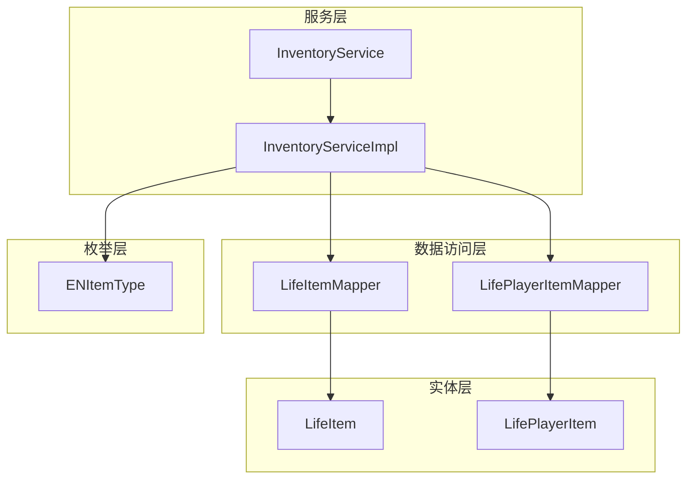
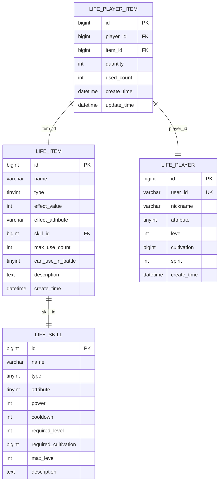
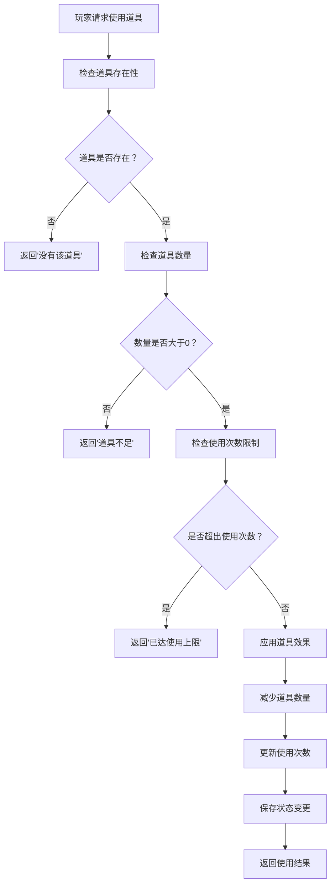

# 数据模型与表结构

<cite>
**本文档引用的文件**
- [LifeItem.java](file://Life/src/main/java/com/bot/life/dao/entity/LifeItem.java)
- [LifePlayerItem.java](file://Life/src/main/java/com/bot/life/dao/entity/LifePlayerItem.java)
- [LifeItemMapper.xml](file://Life/src/main/resources/mapper/LifeItemMapper.xml)
- [LifePlayerItemMapper.xml](file://Life/src/main/resources/mapper/LifePlayerItemMapper.xml)
- [Life_Database_Init.sql](file://Life_Database_Init.sql)
- [ENItemType.java](file://Life/src/main/java/com/bot/life/enums/ENItemType.java)
- [InventoryService.java](file://Life/src/main/java/com/bot/life/service/InventoryService.java)
- [InventoryServiceImpl.java](file://Life/src/main/java/com/bot/life/service/impl/InventoryServiceImpl.java)
</cite>

## 目录
1. [简介](#简介)
2. [项目结构概览](#项目结构概览)
3. [核心数据模型](#核心数据模型)
4. [life_item 表结构设计](#life_item-表结构设计)
5. [life_player_item 表结构设计](#life_player_item-表结构设计)
6. [表间关系分析](#表间关系分析)
7. [道具类型系统](#道具类型系统)
8. [使用场景与业务逻辑](#使用场景与业务逻辑)
9. [性能优化考虑](#性能优化考虑)
10. [总结](#总结)

## 简介

本文档详细阐述了浮生卷游戏背包与道具系统的数据模型设计，重点分析了 `life_item` 和 `life_player_item` 两张核心表的结构设计及其相互关系。该系统采用分层架构设计，通过基础道具表和玩家道具表的分离，实现了道具数据的标准化管理和个性化存储。

## 项目结构概览

背包与道具系统的核心组件分布在以下模块中：



**图表来源**
- [LifeItemMapper.xml](file://Life/src/main/resources/mapper/LifeItemMapper.xml#L1-L74)
- [LifePlayerItemMapper.xml](file://Life/src/main/resources/mapper/LifePlayerItemMapper.xml#L1-L81)
- [InventoryServiceImpl.java](file://Life/src/main/java/com/bot/life/service/impl/InventoryServiceImpl.java#L1-L339)

## 核心数据模型

### 生活道具实体 (LifeItem)

`LifeItem` 实体代表游戏中的基础道具类型，包含了所有道具的通用属性和特定效果参数。

### 玩家道具实体 (LifePlayerItem)

`LifePlayerItem` 实体记录玩家个人拥有的道具信息，包括数量、使用次数等状态数据。

**章节来源**
- [LifeItem.java](file://Life/src/main/java/com/bot/life/dao/entity/LifeItem.java#L1-L24)
- [LifePlayerItem.java](file://Life/src/main/java/com/bot/life/dao/entity/LifePlayerItem.java#L1-L24)

## life_item 表结构设计

### 表基本信息

| 字段名 | 类型 | 长度 | 允许NULL | 默认值 | 注释 |
|--------|------|------|----------|--------|------|
| id | bigint | - | 否 | - | 主键，自增 |
| name | varchar | 50 | 否 | - | 道具名称 |
| type | tinyint | - | 否 | - | 道具类型：1修为类2属性类3体力类4升级法宝类5恢复类6技能书 |
| effect_value | int | - | 否 | - | 效果数值 |
| effect_attribute | varchar | 50 | 是 | NULL | 影响的属性 |
| skill_id | bigint | - | 是 | NULL | 技能书对应的技能ID |
| max_use_count | int | - | 否 | -1 | 最大使用次数(-1表示无限制) |
| can_use_in_battle | tinyint | - | 否 | 0 | 是否可战斗中使用：0否1是 |
| description | text | - | 是 | NULL | 道具描述 |
| create_time | datetime | - | 否 | CURRENT_TIMESTAMP | 创建时间 |

### 字段详细说明

#### 道具ID (id)
- **类型**: bigint
- **用途**: 唯一标识每个基础道具
- **特点**: 自增主键，确保每个道具的唯一性

#### 道具名称 (name)
- **类型**: varchar(50)
- **用途**: 显示给玩家的道具名称
- **示例**: "九转还魂丹"、"金刚不坏体"、"天罡剑谱"

#### 道具类型 (type)
- **类型**: tinyint
- **取值范围**: 1-6
- **用途**: 区分不同类型的道具，决定使用方式和效果

#### 效果值 (effect_value)
- **类型**: int
- **用途**: 道具的主要效果数值
- **应用场景**: 修为增长、属性提升、血量恢复等

#### 影响属性 (effect_attribute)
- **类型**: varchar(50)
- **取值**: speed/constitution/spirit_power/strength
- **用途**: 指定属性类道具影响的具体属性

#### 技能ID (skill_id)
- **类型**: bigint
- **用途**: 技能书类型道具关联的具体技能
- **特点**: 外键关联到 `life_skill` 表

#### 使用次数限制 (max_use_count)
- **类型**: int
- **取值**: -1 或正整数
- **特殊值**: -1 表示无限制使用

#### 战斗可用性 (can_use_in_battle)
- **类型**: tinyint
- **取值**: 0(否) 或 1(是)
- **用途**: 控制道具在战斗中的使用权限

**章节来源**
- [LifeItem.java](file://Life/src/main/java/com/bot/life/dao/entity/LifeItem.java#L13-L21)
- [Life_Database_Init.sql](file://Life_Database_Init.sql#L188-L201)

## life_player_item 表结构设计

### 表基本信息

| 字段名 | 类型 | 长度 | 允许NULL | 默认值 | 注释 |
|--------|------|------|----------|--------|------|
| id | bigint | - | 否 | - | 主键，自增 |
| player_id | bigint | - | 否 | - | 玩家ID |
| item_id | bigint | - | 否 | - | 道具ID |
| quantity | int | - | 否 | 1 | 数量 |
| used_count | int | - | 否 | 0 | 已使用次数 |
| create_time | datetime | - | 否 | CURRENT_TIMESTAMP | 创建时间 |
| update_time | datetime | - | 否 | CURRENT_TIMESTAMP | 更新时间 |

### 字段详细说明

#### 玩家ID (player_id)
- **类型**: bigint
- **用途**: 关联到玩家系统，建立玩家与道具的绑定关系
- **索引**: idx_player_id，提高查询效率

#### 道具ID (item_id)
- **类型**: bigint
- **用途**: 关联到基础道具表，建立玩家道具与基础道具的映射关系
- **索引**: idx_item_id，支持快速查找

#### 数量 (quantity)
- **类型**: int
- **默认值**: 1
- **用途**: 记录玩家拥有该道具的数量
- **业务规则**: 数量为0时通常表示道具已被消耗完毕

#### 已使用次数 (used_count)
- **类型**: int
- **默认值**: 0
- **用途**: 记录该道具在玩家中的使用次数
- **配合字段**: 与 `max_use_count` 配合控制使用限制

#### 时间戳字段
- **create_time**: 记录道具首次添加到背包的时间
- **update_time**: 自动更新，反映道具状态的最新变更时间

**章节来源**
- [LifePlayerItem.java](file://Life/src/main/java/com/bot/life/dao/entity/LifePlayerItem.java#L13-L19)
- [Life_Database_Init.sql](file://Life_Database_Init.sql#L203-L214)

## 表间关系分析

### 一对一关系设计



**图表来源**
- [Life_Database_Init.sql](file://Life_Database_Init.sql#L188-L214)
- [LifePlayerItemMapper.xml](file://Life/src/main/resources/mapper/LifePlayerItemMapper.xml#L5-L12)

### 关系特性

1. **一对多关系**: 一个玩家可以拥有多种不同的道具
2. **多对一关系**: 多个玩家可以拥有同一种基础道具
3. **外键约束**: `item_id` 引用 `life_item.id`，确保数据一致性
4. **复合索引**: 在 `(player_id, item_id)` 上建立联合索引，优化查询性能

**章节来源**
- [LifePlayerItemMapper.xml](file://Life/src/main/resources/mapper/LifePlayerItemMapper.xml#L38-L48)

## 道具类型系统

### ENItemType 枚举定义

系统通过 `ENItemType` 枚举定义了六种主要的道具类型：

| 类型代码 | 类型名称 | 中文描述 | 主要效果 | 使用场景 |
|----------|----------|----------|----------|----------|
| 1 | CULTIVATION | 修为类 | 增加修炼值 | 修炼辅助、境界突破 |
| 2 | ATTRIBUTE | 属性类 | 提升基础属性 | 角色成长、战斗准备 |
| 3 | STAMINA | 体力类 | 恢复体力值 | 日常活动、探索 |
| 4 | TREASURE_UPGRADE | 升级法宝类 | 提升法宝熟练度 | 法宝培养、战斗力提升 |
| 5 | RECOVERY | 恢复类 | 恢复生命值 | 战斗恢复、紧急救援 |
| 6 | SKILL_BOOK | 技能书 | 学习新技能 | 技能学习、能力提升 |

### 类型详细说明

#### 修为类道具 (CULTIVATION)
- **效果值用途**: 直接增加玩家的修炼值
- **典型道具**: 九转还魂丹、天元灵液、紫府丹
- **使用限制**: 无使用次数限制

#### 属性类道具 (ATTRIBUTE)
- **效果值用途**: 提升指定的基础属性
- **影响属性**: speed(速度)、constitution(体质)、spirit_power(灵力)、strength(力量)
- **使用限制**: 可设置最大使用次数，防止无限刷属性

#### 体力类道具 (STAMINA)
- **效果值用途**: 恢复玩家的体力值
- **特点**: 不能超过最大体力值限制
- **典型应用**: 探索、采集、日常任务

#### 恢复类道具 (RECOVERY)
- **效果值用途**: 恢复玩家的生命值
- **特点**: 不能超过最大生命值限制
- **典型应用**: 战斗恢复、受伤治疗

#### 技能书道具 (SKILL_BOOK)
- **特殊机制**: 关联到具体的技能ID
- **学习流程**: 需要满足等级和修为要求
- **属性匹配**: 只能学习相同属性或无属性的技能

**章节来源**
- [ENItemType.java](file://Life/src/main/java/com/bot/life/enums/ENItemType.java#L6-L12)
- [InventoryServiceImpl.java](file://Life/src/main/java/com/bot/life/service/impl/InventoryServiceImpl.java#L174-L221)

## 使用场景与业务逻辑

### 道具使用流程



**图表来源**
- [InventoryServiceImpl.java](file://Life/src/main/java/com/bot/life/service/impl/InventoryServiceImpl.java#L78-L112)

### 核心业务方法

#### 获取玩家道具列表
- **方法**: `getPlayerItems(LifePlayer player)`
- **功能**: 查询玩家拥有的所有道具
- **关联查询**: 自动关联基础道具信息，提供完整展示数据

#### 添加道具到背包
- **方法**: `addItem(Long playerId, Long itemId, Integer quantity)`
- **功能**: 向玩家背包添加指定数量的道具
- **智能处理**: 如果已有该道具，则增加数量；否则创建新记录

#### 使用道具
- **方法**: `useItem(LifePlayer player, Long itemId)`
- **功能**: 执行道具使用逻辑
- **效果应用**: 根据道具类型应用相应效果
- **状态更新**: 减少数量，更新使用次数

#### 检查使用条件
- **方法**: `canUseItem(LifePlayer player, Long itemId)`
- **功能**: 验证道具是否可以被使用
- **检查项目**: 存在性、数量、使用次数限制

**章节来源**
- [InventoryService.java](file://Life/src/main/java/com/bot/life/service/InventoryService.java#L14-L51)
- [InventoryServiceImpl.java](file://Life/src/main/java/com/bot/life/service/impl/InventoryServiceImpl.java#L44-L132)

### 道具效果实现

不同类型的道具具有不同的效果实现逻辑：

#### 修为类道具效果
```java
// 效果：直接增加修炼值
player.setCultivation(player.getCultivation() + item.getEffectValue());
```

#### 属性类道具效果
```java
// 效果：根据effect_attribute决定加哪个属性
switch (effectAttr) {
    case "speed": player.setSpeed(player.getSpeed() + value); break;
    case "constitution": player.setConstitution(player.getConstitution() + value); break;
    // ... 其他属性
}
```

#### 技能书道具效果
```java
// 效果：学习新技能
LifePlayerSkill playerSkill = new LifePlayerSkill();
playerSkill.setPlayerId(player.getId());
playerSkill.setSkillId(skill.getId());
playerSkill.setSkillLevel(1);
```

**章节来源**
- [InventoryServiceImpl.java](file://Life/src/main/java/com/bot/life/service/impl/InventoryServiceImpl.java#L174-L325)

## 性能优化考虑

### 索引策略

1. **主键索引**: `id` 字段自动建立主键索引，确保唯一性
2. **外键索引**: `item_id` 和 `player_id` 建立索引，加速关联查询
3. **复合索引**: `(player_id, item_id)` 优化玩家道具查询
4. **时间索引**: `create_time` 和 `update_time` 支持时间范围查询

### 查询优化

#### 分页查询
- 对于大量道具的玩家，实现分页查询避免内存溢出
- 使用 `LIMIT` 和 `OFFSET` 控制查询结果大小

#### 缓存策略
- 将常用的基础道具信息缓存在内存中
- 减少频繁的数据库查询操作

#### 连接优化
- 使用 `LEFT JOIN` 获取关联的道具信息
- 避免笛卡尔积导致的性能问题

### 数据一致性保证

1. **事务管理**: 在道具使用过程中使用数据库事务
2. **并发控制**: 使用乐观锁防止同时使用同一道具
3. **约束检查**: 利用数据库约束确保数据完整性

## 总结

浮生卷的背包与道具系统通过精心设计的双表结构实现了高效的数据管理：

### 设计优势

1. **分离关注点**: 基础道具信息与玩家状态分离，便于维护和扩展
2. **类型化管理**: 通过枚举类型系统清晰区分不同道具的功能
3. **灵活使用**: 支持有限次数和无限次数的使用控制
4. **性能优化**: 合理的索引设计和查询策略确保系统响应速度

### 扩展性考虑

1. **新类型支持**: 可以轻松添加新的道具类型而无需修改现有结构
2. **效果扩展**: 新的效果类型可以通过配置而非硬编码实现
3. **国际化**: 字符串描述支持多语言扩展
4. **版本兼容**: 数据库结构设计考虑了未来的版本升级需求

该数据模型为游戏提供了稳定可靠的道具管理系统基础，支持复杂的业务逻辑实现，同时保持了良好的性能表现和可维护性。