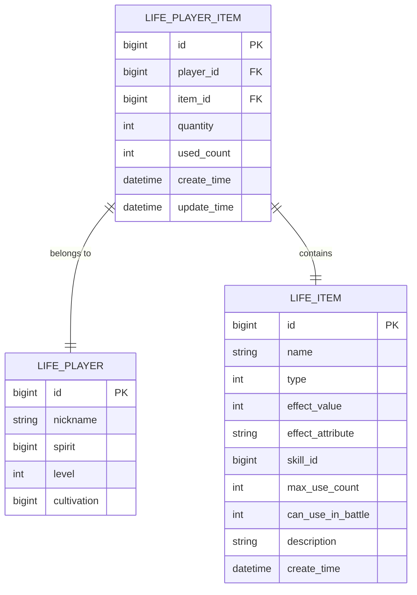
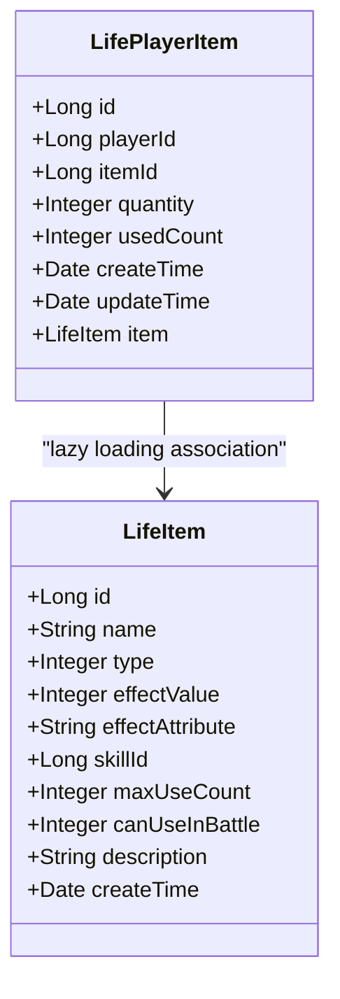
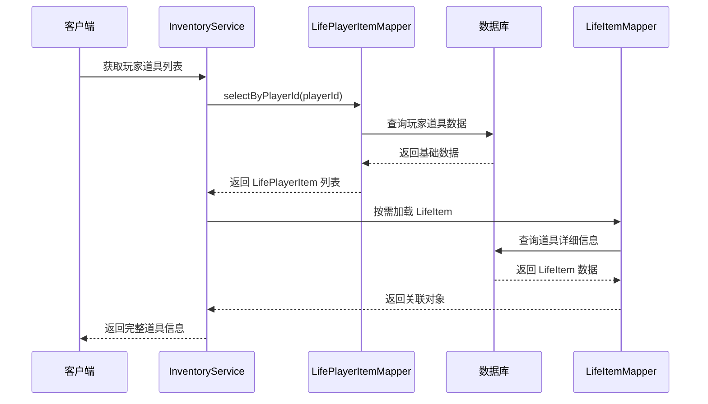
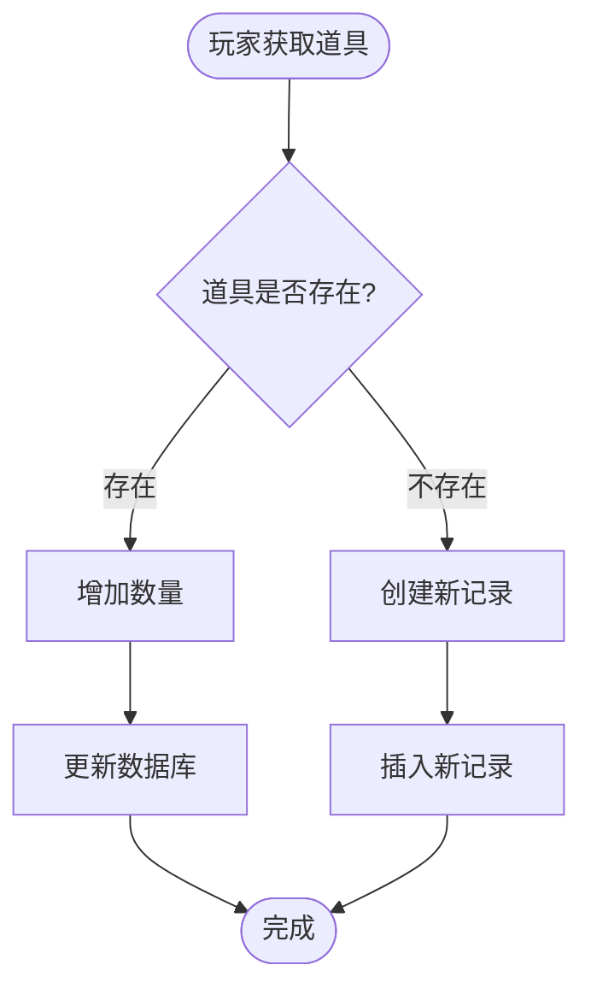
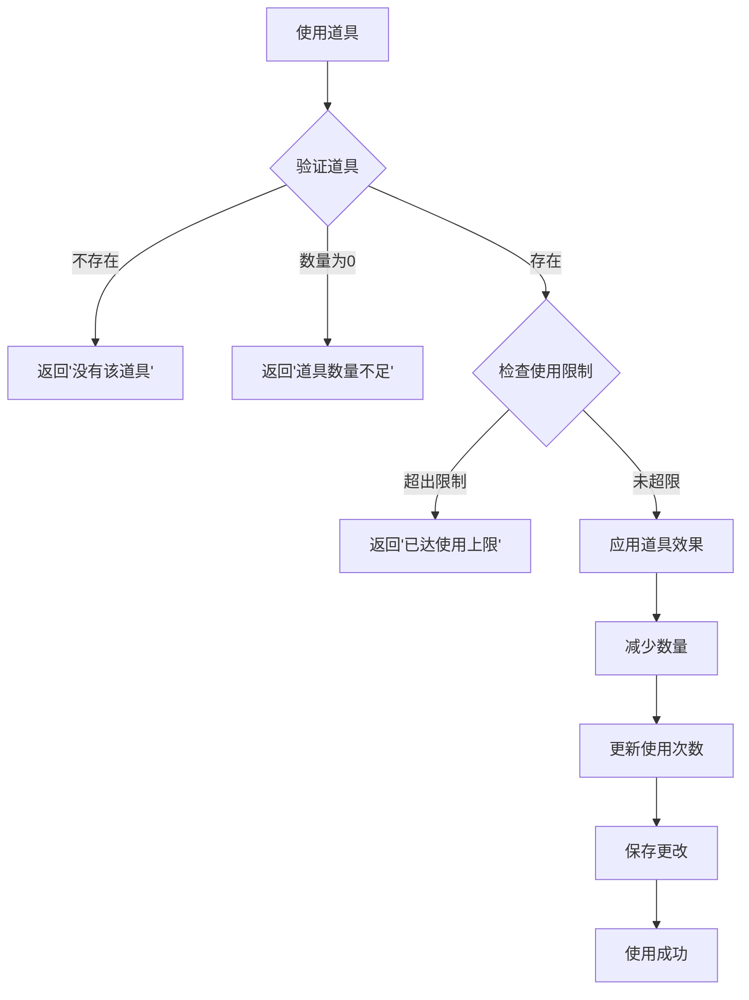
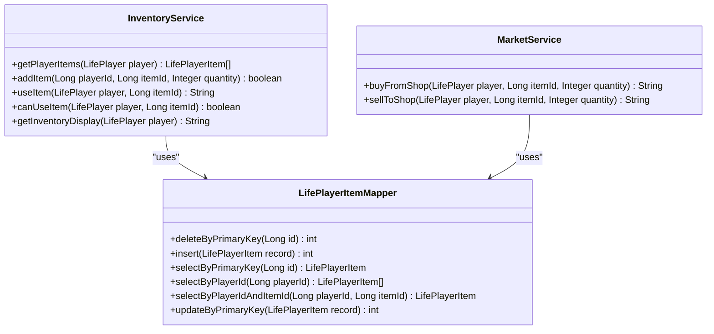

# 玩家道具表 (life_player_item) 数据模型文档

<cite>
**本文档引用的文件**
- [LifePlayerItem.java](file://Life/src/main/java/com/bot/life/dao/entity/LifePlayerItem.java)
- [LifeItem.java](file://Life/src/main/java/com/bot/life/dao/entity/LifeItem.java)
- [LifePlayerItemMapper.xml](file://Life/src/main/resources/mapper/LifePlayerItemMapper.xml)
- [LifeItemMapper.xml](file://Life/src/main/resources/mapper/LifeItemMapper.xml)
- [InventoryServiceImpl.java](file://Life/src/main/java/com/bot/life/service/impl/InventoryServiceImpl.java)
- [MarketServiceImpl.java](file://Life/src/main/java/com/bot/life/service/impl/MarketServiceImpl.java)
- [ENItemType.java](file://Life/src/main/java/com/bot/life/enums/ENItemType.java)
- [LifePlayerItemMapper.java](file://Life/src/main/java/com/bot/life/dao/mapper/LifePlayerItemMapper.java)
- [Life_Database_Init.sql](file://Life_Database_Init.sql)
</cite>

## 目录
1. [概述](#概述)
2. [数据库表结构](#数据库表结构)
3. [实体类映射关系](#实体类映射关系)
4. [字段详细说明](#字段详细说明)
5. [关联关系设计](#关联关系设计)
6. [业务功能分析](#业务功能分析)
7. [数据访问层设计](#数据访问层设计)
8. [性能优化策略](#性能优化策略)
9. [最佳实践建议](#最佳实践建议)

## 概述

玩家道具表(`life_player_item`)是浮生卷游戏系统中背包管理的核心数据模型，负责存储玩家拥有的各种道具信息。该表采用主键关联的设计模式，通过外键与玩家表(`life_player`)和道具表(`life_item`)建立关联关系，实现了道具数据的完整性和一致性管理。

该表在游戏系统中承担着以下核心职责：
- 记录玩家拥有的道具种类和数量
- 跟踪道具的使用情况和使用次数限制
- 支持道具的获取、使用、交易等核心业务操作
- 提供道具展示和管理的底层数据支撑

## 数据库表结构

### 表定义

**图表来源**
- [Life_Database_Init.sql](file://Life_Database_Init.sql#L203-L214)
- [LifePlayerItem.java](file://Life/src/main/java/com/bot/life/dao/entity/LifePlayerItem.java#L12-L19)

### 字段约束说明

| 字段名 | 数据类型 | 约束条件 | 默认值 | 说明 |
|--------|----------|----------|--------|------|
| id | BIGINT | PRIMARY KEY, AUTO_INCREMENT | - | 主键标识符，自增生成 |
| player_id | BIGINT | NOT NULL, FK | - | 外键，关联玩家表主键 |
| item_id | BIGINT | NOT NULL, FK | - | 外键，关联道具表主键 |
| quantity | INT | DEFAULT 1 | 1 | 道具数量，支持堆叠 |
| used_count | INT | DEFAULT 0 | 0 | 已使用次数，有限次使用道具专用 |
| create_time | DATETIME | DEFAULT CURRENT_TIMESTAMP | 当前时间 | 记录创建时间 |
| update_time | DATETIME | DEFAULT CURRENT_TIMESTAMP ON UPDATE CURRENT_TIMESTAMP | 当前时间 | 记录最后更新时间 |

**节来源**
- [Life_Database_Init.sql](file://Life_Database_Init.sql#L203-L214)

## 实体类映射关系

### LifePlayerItem 实体类结构

**图表来源**
- [LifePlayerItem.java](file://Life/src/main/java/com/bot/life/dao/entity/LifePlayerItem.java#L12-L22)
- [LifeItem.java](file://Life/src/main/java/com/bot/life/dao/entity/LifeItem.java#L12-L22)

### MyBatis 映射配置

MyBatis 使用 resultMap 定义了两种映射模式：

1. **基础映射(BaseResultMap)**：包含所有基本字段
2. **关联映射(WithItemResultMap)**：包含关联的 LifeItem 对象

**节来源**
- [LifePlayerItemMapper.xml](file://Life/src/main/resources/mapper/LifePlayerItemMapper.xml#L5-L25)

## 字段详细说明

### 主键字段 (id)
- **技术实现**：数据库自增主键，确保每条记录的唯一性
- **业务意义**：作为记录的唯一标识符，用于快速定位和更新操作
- **性能考虑**：使用索引优化查询性能

### 外键字段 (playerId)
- **技术实现**：BIGINT 类型，NOT NULL 约束
- **业务意义**：关联玩家表，标识道具所属的玩家
- **外键关系**：与 `life_player(id)` 建立一对一关系
- **索引设计**：在 `idx_player_id` 上建立索引，优化按玩家查询性能

### 外键字段 (itemId)
- **技术实现**：BIGINT 类型，NOT NULL 约束
- **业务意义**：关联道具表，标识具体的道具类型
- **外键关系**：与 `life_item(id)` 建立一对一关系
- **关联查询**：通过 LEFT JOIN 实现懒加载关联对象

### 数量字段 (quantity)
- **技术实现**：INT 类型，默认值为 1
- **业务意义**：表示玩家拥有该道具的数量，支持堆叠功能
- **业务规则**：
  - 新增道具时，若已有相同道具则累加数量
  - 使用道具时，数量递减
  - 交易时，数量相应增减
- **边界检查**：确保数量不小于 0

### 使用次数字段 (usedCount)
- **技术实现**：INT 类型，默认值为 0
- **业务意义**：记录道具已被使用的次数
- **使用场景**：
  - 属性类道具：受 `max_use_count` 限制
  - 其他类型道具：通常为 0
- **限制机制**：当 `usedCount >= max_use_count` 时禁止使用

### 时间戳字段 (createTime/updateTime)
- **技术实现**：DATETIME 类型
- **自动维护**：
  - `create_time`：记录创建时自动设置当前时间
  - `update_time`：记录更新时自动更新为当前时间
- **业务价值**：支持数据追踪和审计功能

**节来源**
- [LifePlayerItem.java](file://Life/src/main/java/com/bot/life/dao/entity/LifePlayerItem.java#L12-L19)
- [Life_Database_Init.sql](file://Life_Database_Init.sql#L203-L214)

## 关联关系设计

### 与 LifeItem 的关联

**图表来源**
- [InventoryServiceImpl.java](file://Life/src/main/java/com/bot/life/service/impl/InventoryServiceImpl.java#L43-L46)
- [LifePlayerItemMapper.xml](file://Life/src/main/resources/mapper/LifePlayerItemMapper.xml#L38-L48)

### 懒加载实现机制

LifePlayerItem 实体类中包含一个 `item` 字段，但该字段不会在基础查询中被填充。只有在需要时，通过 MyBatis 的关联查询才会加载完整的 LifeItem 对象。

**实现特点**：
- **延迟加载**：避免不必要的关联查询，提高性能
- **条件加载**：仅在调用 `getItem()` 方法时才执行关联查询
- **缓存友好**：关联对象可以独立缓存

**节来源**
- [LifePlayerItem.java](file://Life/src/main/java/com/bot/life/dao/entity/LifePlayerItem.java#L21-L22)
- [LifePlayerItemMapper.xml](file://Life/src/main/resources/mapper/LifePlayerItemMapper.xml#L15-L25)

## 业务功能分析

### 道具获取机制

**图表来源**
- [InventoryServiceImpl.java](file://Life/src/main/java/com/bot/life/service/impl/InventoryServiceImpl.java#L48-L74)

### 道具使用流程

**图表来源**
- [InventoryServiceImpl.java](file://Life/src/main/java/com/bot/life/service/impl/InventoryServiceImpl.java#L77-L111)

### 道具交易机制

| 交易类型 | 操作方向 | 数量变化 | 使用场景 |
|----------|----------|----------|----------|
| 购买道具 | 商店→玩家 | 数量增加 | 从神秘商人处购买 |
| 出售道具 | 玩家→商店 | 数量减少 | 向神秘商人出售 |
| 玩家交易 | 玩家A→玩家B | 数量转移 | 玩家间直接交易 |
| 摊位交易 | 玩家→摊位 | 数量转移 | 通过玩家摊位交易 |

**节来源**
- [MarketServiceImpl.java](file://Life/src/main/java/com/bot/life/service/impl/MarketServiceImpl.java#L182-L217)

## 数据访问层设计

### Mapper 接口定义

**图表来源**
- [LifePlayerItemMapper.java](file://Life/src/main/java/com/bot/life/dao/mapper/LifePlayerItemMapper.java#L10-L41)
- [InventoryServiceImpl.java](file://Life/src/main/java/com/bot/life/service/impl/InventoryServiceImpl.java#L24-L337)
- [MarketServiceImpl.java](file://Life/src/main/java/com/bot/life/service/impl/MarketServiceImpl.java#L21-L393)

### 查询优化策略

1. **批量查询**：通过 `selectByPlayerId` 一次性获取玩家所有道具
2. **条件过滤**：只查询 `quantity > 0` 的有效道具
3. **关联查询**：使用 LEFT JOIN 实现关联数据的高效加载
4. **索引优化**：在 `player_id` 和 `(player_id, item_id)` 上建立复合索引

**节来源**
- [LifePlayerItemMapper.xml](file://Life/src/main/resources/mapper/LifePlayerItemMapper.xml#L38-L48)

## 性能优化策略

### 查询性能优化

1. **索引设计**
   - 主键索引：`PRIMARY KEY (id)`
   - 单列索引：`idx_player_id (player_id)`
   - 复合索引：`(player_id, item_id)` 用于唯一性约束

2. **查询优化**
   - 使用 `LIMIT` 控制结果集大小
   - 采用分页查询处理大量数据
   - 避免 N+1 查询问题，使用批量加载

3. **缓存策略**
   - 缓存玩家道具列表，减少数据库访问
   - 缓存常用道具信息，提高响应速度
   - 使用 Redis 等内存数据库存储热数据

### 写入性能优化

1. **批量操作**：支持批量插入和更新操作
2. **事务控制**：合理使用事务，避免长时间锁定
3. **异步处理**：对于非关键操作，采用异步处理方式

## 最佳实践建议

### 数据完整性保证

1. **外键约束**：确保 `player_id` 和 `item_id` 的有效性
2. **数据校验**：在业务层进行数据有效性检查
3. **并发控制**：使用乐观锁防止并发修改问题

### 业务扩展指导

1. **道具类型扩展**：通过 `ENItemType` 枚举支持新的道具类型
2. **使用次数限制**：为不同类型的道具设置合适的使用次数限制
3. **堆叠机制**：合理设计道具的堆叠规则和容量限制

### 维护和监控

1. **定期清理**：清理无效的道具记录
2. **性能监控**：监控查询性能和数据库负载
3. **备份策略**：制定完善的数据备份和恢复计划

**节来源**
- [ENItemType.java](file://Life/src/main/java/com/bot/life/enums/ENItemType.java#L6-L13)

## 结论

玩家道具表(`life_player_item`)作为浮生卷游戏系统的核心数据模型，通过精心设计的字段结构和关联关系，为游戏的道具管理功能提供了坚实的数据基础。该设计不仅满足了当前业务需求，还具备良好的扩展性和性能表现，能够适应未来游戏功能的发展和优化。

通过合理的数据库设计、完善的业务逻辑实现和有效的性能优化策略，该数据模型能够支持大规模玩家的道具管理需求，为玩家提供流畅的游戏体验。