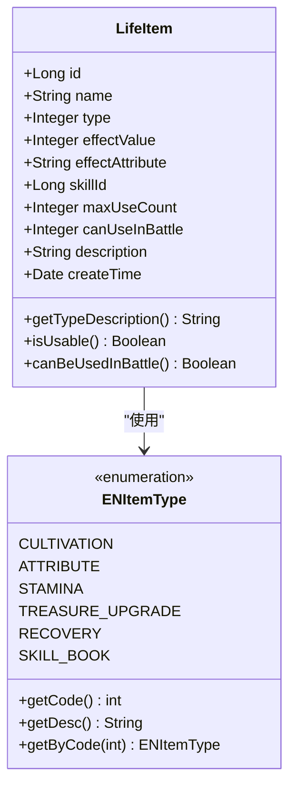
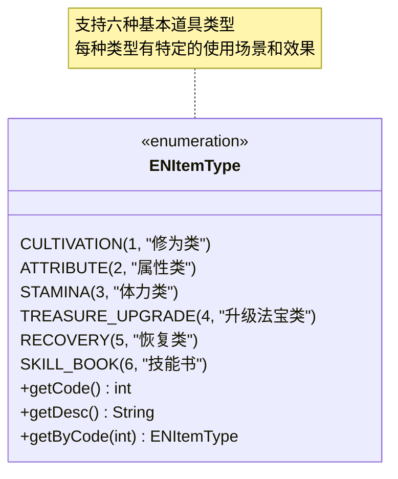
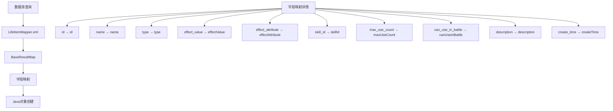
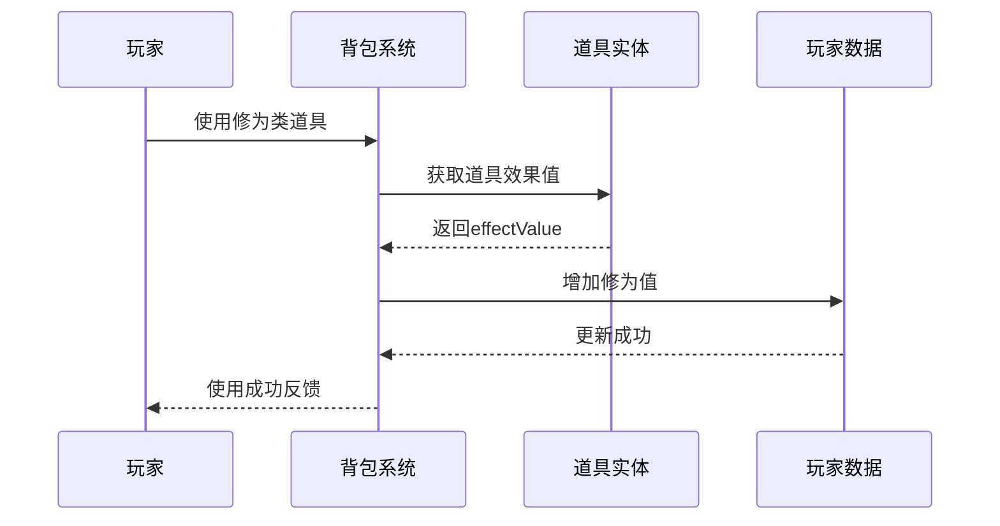
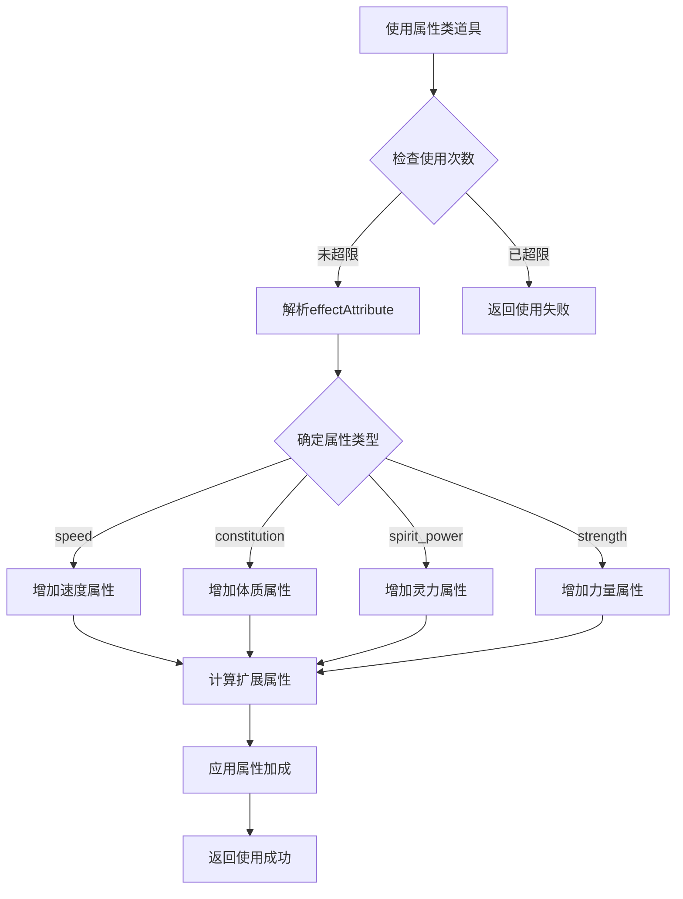
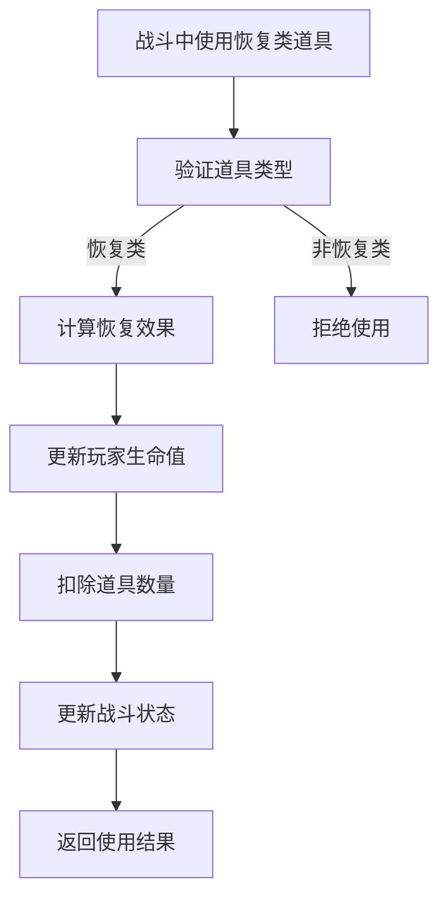
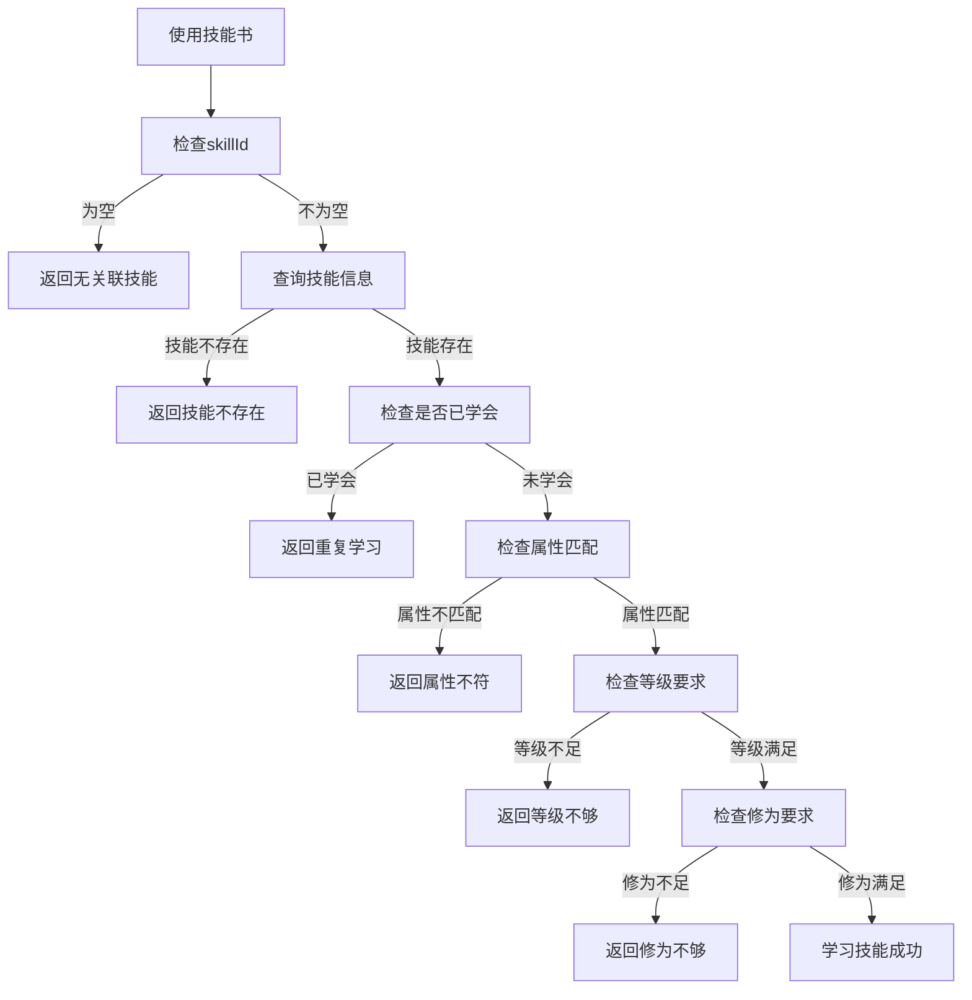

# 道具基础表 (life_item) 数据模型文档

<cite>
**本文档引用的文件**
- [LifeItem.java](file://Life/src/main/java/com/bot/life/dao/entity/LifeItem.java)
- [ENItemType.java](file://Life/src/main/java/com/bot/life/enums/ENItemType.java)
- [LifeItemMapper.xml](file://Life/src/main/resources/mapper/LifeItemMapper.xml)
- [Life_Database_Init.sql](file://Life_Database_Init.sql)
- [InventoryServiceImpl.java](file://Life/src/main/java/com/bot/life/service/impl/InventoryServiceImpl.java)
- [LifeHandlerImpl.java](file://Life/src/main/java/com/bot/life/service/impl/LifeHandlerImpl.java)
</cite>

## 目录
1. [概述](#概述)
2. [实体类设计](#实体类设计)
3. [数据库表结构](#数据库表结构)
4. [字段详细说明](#字段详细说明)
5. [道具类型枚举](#道具类型枚举)
6. [MyBatis映射配置](#mybatis映射配置)
7. [使用场景分析](#使用场景分析)
8. [业务约束与规则](#业务约束与规则)
9. [技术实现细节](#技术实现细节)
10. [总结](#总结)

## 概述

道具基础表(`life_item`)是浮生卷游戏系统中的核心数据模型，负责存储所有游戏内道具的基础信息。该表采用标准的关系型数据库设计，通过LifeItem实体类与数据库表建立映射关系，支持多种类型的道具管理，包括修为类、属性类、体力类、恢复类、技能书等。

## 实体类设计

### LifeItem实体类架构

**图表来源**
- [LifeItem.java](file://Life/src/main/java/com/bot/life/dao/entity/LifeItem.java#L11-L22)
- [ENItemType.java](file://Life/src/main/java/com/bot/life/enums/ENItemType.java#L7-L38)

**章节来源**
- [LifeItem.java](file://Life/src/main/java/com/bot/life/dao/entity/LifeItem.java#L11-L22)
- [ENItemType.java](file://Life/src/main/java/com/bot/life/enums/ENItemType.java#L7-L38)

## 数据库表结构

### 表结构定义

基于数据库初始化脚本，life_item表的完整结构如下：

| 字段名 | 数据类型 | 约束 | 描述 |
|--------|----------|------|------|
| id | bigint | PRIMARY KEY, AUTO_INCREMENT | 主键标识符 |
| name | varchar(50) | NOT NULL | 道具名称 |
| type | tinyint | NOT NULL | 道具类型：1修为类2属性类3体力类4升级法宝类5恢复类6技能书 |
| effect_value | int | NOT NULL | 效果数值 |
| effect_attribute | varchar(50) | DEFAULT NULL | 影响的属性（属性类道具使用：speed/constitution/spirit_power/strength） |
| skill_id | bigint | DEFAULT NULL | 技能书对应的技能ID |
| max_use_count | int | DEFAULT -1 | 最大使用次数(-1表示无限制) |
| can_use_in_battle | tinyint | DEFAULT 0 | 是否可战斗中使用：0否1是 |
| description | text | DEFAULT NULL | 道具描述 |
| create_time | datetime | DEFAULT CURRENT_TIMESTAMP | 创建时间 |

**章节来源**
- [Life_Database_Init.sql](file://Life_Database_Init.sql#L188-L201)

## 字段详细说明

### 主键字段
- **id**: 数据库自增主键，唯一标识每个道具实例
- **name**: 道具的显示名称，最大长度50字符

### 类型字段
- **type**: 道具类型标识，关联ENItemType枚举，支持六种基本类型

### 效果字段
- **effectValue**: 道具的核心效果数值，根据不同类型有不同的用途
  - 修为类：增加的修为值
  - 属性类：属性提升数值
  - 体力类：恢复的体力值
  - 恢复类：恢复的生命值
  - 升级法宝类：暂时未实现的功能预留

### 属性字段
- **effectAttribute**: JSON格式存储的影响属性，支持以下属性：
  - `speed`: 速度
  - `constitution`: 体质
  - `spirit_power`: 灵力
  - `strength`: 力量

### 关联字段
- **skillId**: 技能书类型道具关联的技能ID，NULL表示无关联技能

### 使用控制字段
- **maxUseCount**: 最大使用次数，-1表示无限使用
- **canUseInBattle**: 战斗中使用标志，0不可用，1可用

### 元数据字段
- **description**: 道具详细描述信息
- **createTime**: 记录创建时间戳

**章节来源**
- [LifeItem.java](file://Life/src/main/java/com/bot/life/dao/entity/LifeItem.java#L12-L21)

## 道具类型枚举

### ENItemType枚举定义

**图表来源**
- [ENItemType.java](file://Life/src/main/java/com/bot/life/enums/ENItemType.java#L7-L38)

### 各类型详细说明

| 类型 | 编码 | 使用场景 | 效果值用途 | 特殊规则 |
|------|------|----------|------------|----------|
| 修为类 | 1 | 提升玩家修为境界 | 增加修为数值 | 无使用次数限制 |
| 属性类 | 2 | 提升玩家属性能力 | 增加指定属性值 | 可设置最大使用次数 |
| 体力类 | 3 | 恢复玩家体力 | 恢复体力数值 | 无使用次数限制 |
| 升级法宝类 | 4 | 法宝升级辅助 | 暂未实现 | 功能开发中 |
| 恢复类 | 5 | 战斗中恢复生命 | 恢复生命数值 | 仅战斗中可使用 |
| 技能书 | 6 | 学习新技能 | 技能学习条件 | 需要关联具体技能 |

**章节来源**
- [ENItemType.java](file://Life/src/main/java/com/bot/life/enums/ENItemType.java#L8-L12)

## MyBatis映射配置

### 结果映射配置

MyBatis的resultMap定义了LifeItem实体类与数据库表字段的映射关系：

**图表来源**
- [LifeItemMapper.xml](file://Life/src/main/resources/mapper/LifeItemMapper.xml#L5-L16)

### 核心SQL操作

| 操作类型 | 方法名 | SQL语句特点 | 使用场景 |
|----------|--------|-------------|----------|
| 查询单个 | selectByPrimaryKey | WHERE id = #{id} | 根据ID获取道具详情 |
| 查询全部 | selectAll | ORDER BY type, id | 获取所有道具按类型排序 |
| 按类型查询 | selectByType | WHERE type = #{type} | 获取特定类型道具 |
| 插入 | insert | useGeneratedKeys="true" | 新增道具记录 |
| 更新 | updateByPrimaryKey | WHERE id = #{id} | 更新道具信息 |

**章节来源**
- [LifeItemMapper.xml](file://Life/src/main/resources/mapper/LifeItemMapper.xml#L22-L71)

## 使用场景分析

### 修为类道具使用流程

**图表来源**
- [InventoryServiceImpl.java](file://Life/src/main/java/com/bot/life/service/impl/InventoryServiceImpl.java#L181-L185)

### 属性类道具使用流程

**图表来源**
- [InventoryServiceImpl.java](file://Life/src/main/java/com/bot/life/service/impl/InventoryServiceImpl.java#L187-L195)

### 恢复类道具战斗使用

**图表来源**
- [LifeHandlerImpl.java](file://Life/src/main/java/com/bot/life/service/impl/LifeHandlerImpl.java#L1387-L1391)

**章节来源**
- [InventoryServiceImpl.java](file://Life/src/main/java/com/bot/life/service/impl/InventoryServiceImpl.java#L174-L220)
- [LifeHandlerImpl.java](file://Life/src/main/java/com/bot/life/service/impl/LifeHandlerImpl.java#L1359-L1413)

## 业务约束与规则

### 使用次数控制

| 道具类型 | maxUseCount默认值 | 使用次数检查 | 超限处理 |
|----------|-------------------|--------------|----------|
| 修为类 | -1 | 无限制检查 | 无限制使用 |
| 属性类 | -1 | 检查使用次数 | 显示使用上限 |
| 体力类 | -1 | 无限制检查 | 无限制使用 |
| 恢复类 | -1 | 无限制检查 | 无限制使用 |
| 技能书 | -1 | 无限制检查 | 无限制使用 |

### 战斗中使用规则

| 道具类型 | 战斗中可用性 | 使用条件 | 效果限制 |
|----------|--------------|----------|----------|
| 修为类 | 否 | 不支持战斗使用 | 无效果 |
| 属性类 | 否 | 不支持战斗使用 | 无效果 |
| 体力类 | 否 | 不支持战斗使用 | 无效果 |
| 恢复类 | 是 | 仅恢复类可用 | 生命值恢复 |
| 技能书 | 否 | 不支持战斗使用 | 无效果 |

### 技能书特殊规则

**图表来源**
- [InventoryServiceImpl.java](file://Life/src/main/java/com/bot/life/service/impl/InventoryServiceImpl.java#L270-L324)

**章节来源**
- [InventoryServiceImpl.java](file://Life/src/main/java/com/bot/life/service/impl/InventoryServiceImpl.java#L114-L131)
- [InventoryServiceImpl.java](file://Life/src/main/java/com/bot/life/service/impl/InventoryServiceImpl.java#L270-L324)

## 技术实现细节

### 数据库索引策略

- **主键索引**: id字段自动创建主键索引
- **技能关联索引**: skill_id字段创建索引以加速技能书查询
- **类型查询索引**: 支持按道具类型快速筛选

### 事务处理

- **插入操作**: 使用useGeneratedKeys确保ID自动生成
- **更新操作**: 基于主键的乐观锁更新
- **删除操作**: 安全的单条记录删除

### 性能优化

- **批量查询**: 支持按类型批量获取道具
- **懒加载**: 道具关联信息按需加载
- **缓存友好**: 主键查询性能优异

**章节来源**
- [LifeItemMapper.xml](file://Life/src/main/resources/mapper/LifeItemMapper.xml#L49-L71)
- [Life_Database_Init.sql](file://Life_Database_Init.sql#L199-L200)

## 总结

道具基础表(`life_item`)作为浮生卷游戏系统的核心数据模型，通过精心设计的字段结构和业务规则，实现了对不同类型道具的统一管理和灵活使用。该设计具有以下特点：

1. **类型化管理**: 通过ENItemType枚举实现六种基本道具类型的清晰分类
2. **灵活效果**: 支持数值型和属性型两种效果计算方式
3. **使用控制**: 完善的使用次数和战斗中使用控制机制
4. **关联性强**: 与技能系统、玩家系统形成良好的关联关系
5. **扩展性好**: 为未来功能扩展预留了充足的空间

该数据模型为游戏中的道具系统提供了坚实的基础，支持复杂的业务逻辑实现，同时保持了良好的性能和可维护性。通过MyBatis的映射配置，实现了Java对象与数据库表的无缝对接，为上层业务逻辑提供了稳定可靠的数据访问层。