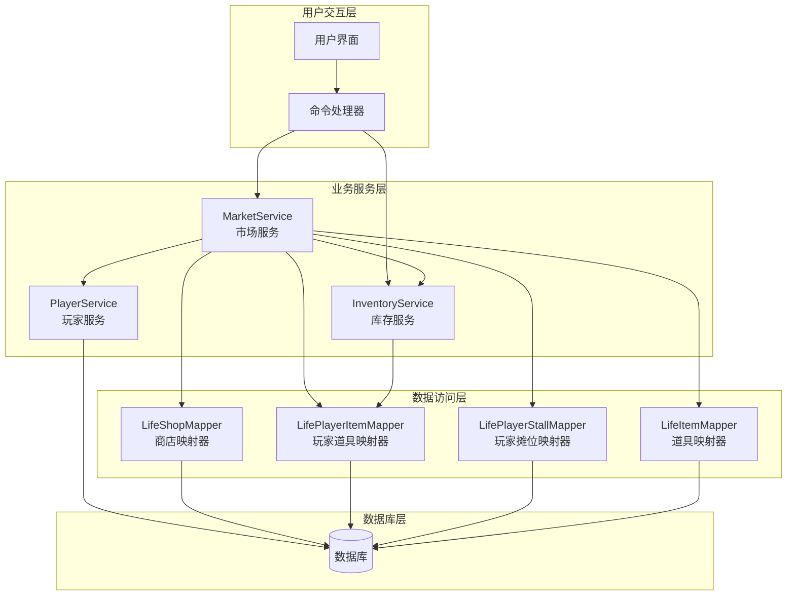
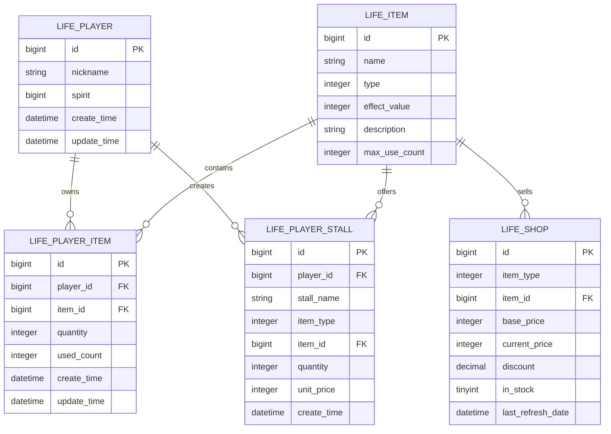
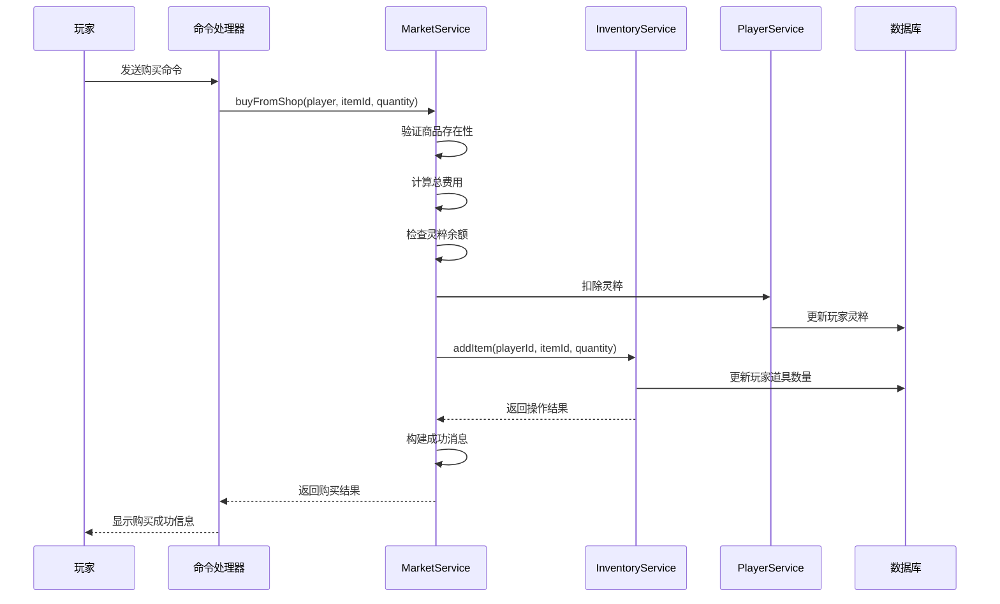
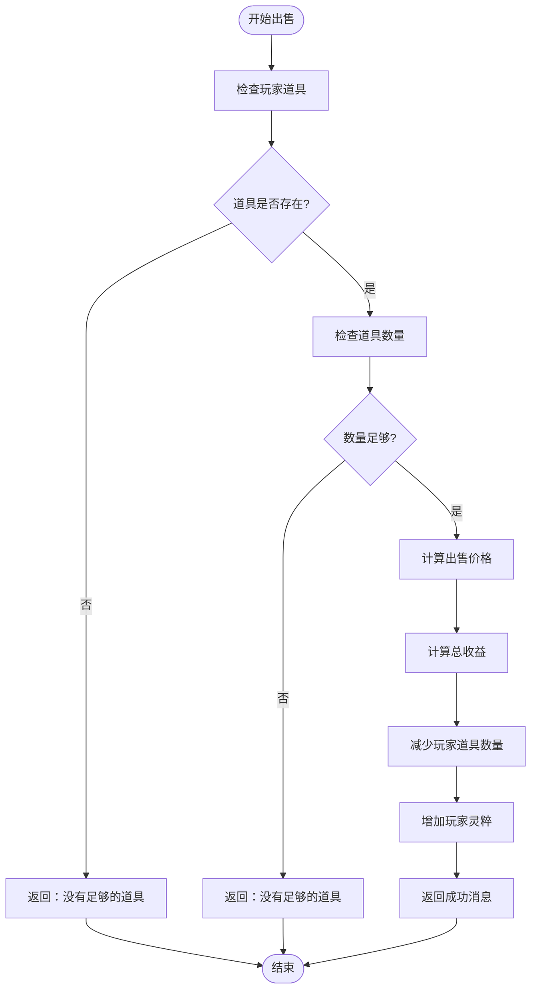
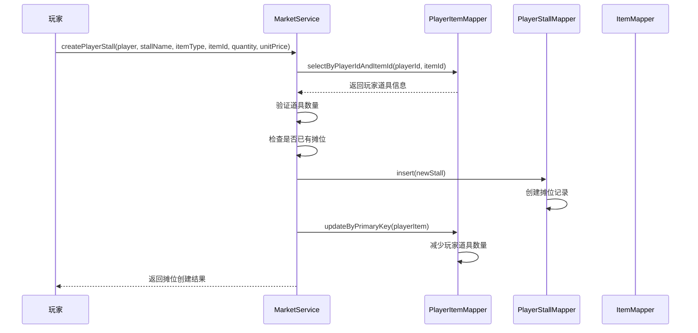
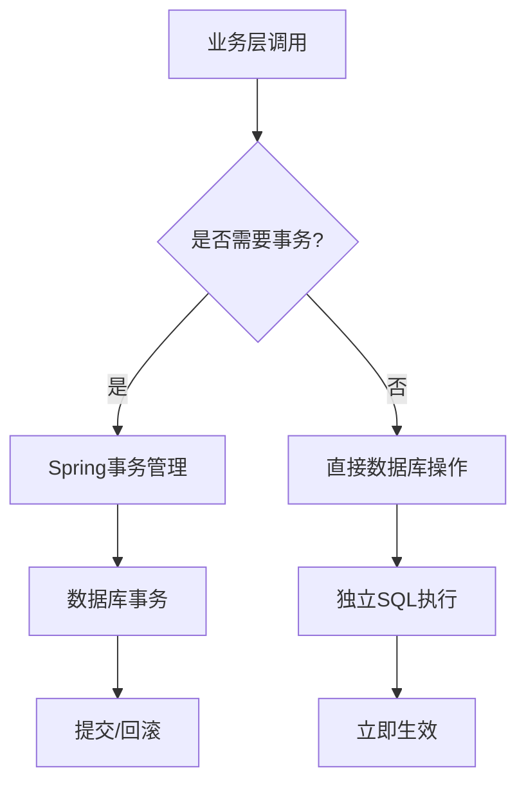
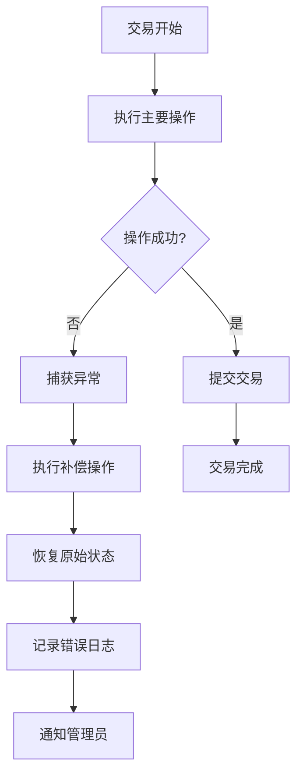
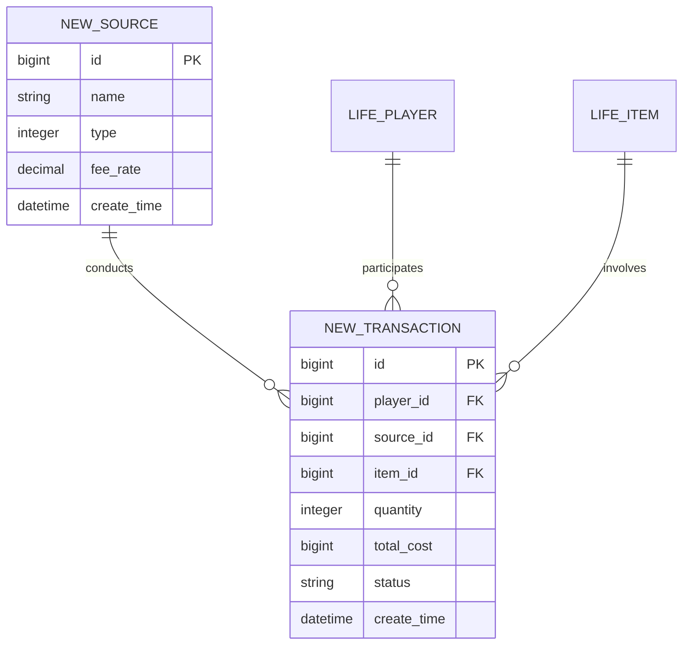

# 交易系统集成文档

<cite>
**本文档引用的文件**
- [MarketService.java](file://Life/src/main/java/com/bot/life/service/MarketService.java)
- [MarketServiceImpl.java](file://Life/src/main/java/com/bot/life/service/impl/MarketServiceImpl.java)
- [InventoryService.java](file://Life/src/main/java/com/bot/life/service/InventoryService.java)
- [InventoryServiceImpl.java](file://Life/src/main/java/com/bot/life/service/impl/InventoryServiceImpl.java)
- [LifePlayerItemMapper.java](file://Life/src/main/java/com/bot/life/dao/mapper/LifePlayerItemMapper.java)
- [LifeHandlerImpl.java](file://Life/src/main/java/com/bot/life/service/impl/LifeHandlerImpl.java)
- [LifeShopMapper.xml](file://Life/src/main/resources/mapper/LifeShopMapper.xml)
- [Life_Method_Call_Fix.md](file://Life_Method_Call_Fix.md)
</cite>

## 目录
1. [概述](#概述)
2. [系统架构](#系统架构)
3. [核心组件分析](#核心组件分析)
4. [交易流程详解](#交易流程详解)
5. [数据一致性保障](#数据一致性保障)
6. [异常处理机制](#异常处理机制)
7. [扩展新交易类型指南](#扩展新交易类型指南)
8. [最佳实践建议](#最佳实践建议)
9. [故障排除指南](#故障排除指南)

## 概述

浮生卷游戏的交易系统是一个完整的鬼市交易平台，支持玩家之间的道具交易、向神秘商人购买和出售道具等多种交易方式。系统通过`MarketService`和`InventoryService`两个核心服务实现完整的交易功能，确保数据一致性和用户体验。

### 主要功能特性

- **神秘商人交易**：支持购买和出售道具给神秘商人
- **玩家摊位系统**：允许玩家创建个人摊位进行交易
- **道具管理**：通过`InventoryService`统一管理玩家道具
- **灵粹结算**：完整的灵粹计算和余额管理
- **数据一致性**：通过事务管理保证交易数据完整性

## 系统架构



**图表来源**
- [MarketService.java](file://Life/src/main/java/com/bot/life/service/MarketService.java#L1-L82)
- [InventoryService.java](file://Life/src/main/java/com/bot/life/service/InventoryService.java#L1-L52)

## 核心组件分析

### MarketService - 市场服务接口

`MarketService`定义了鬼市交易的核心接口，包含以下关键方法：

| 方法名 | 功能描述 | 参数说明 |
|--------|----------|----------|
| `buyFromShop` | 从神秘商人购买商品 | player: 玩家信息, itemId: 商品ID, quantity: 购买数量 |
| `sellToShop` | 向神秘商人出售道具 | player: 玩家信息, itemId: 道具ID, quantity: 出售数量 |
| `createPlayerStall` | 创建玩家摊位 | player: 玩家信息, stallName: 摊位名称, itemType: 商品类型等 |
| `buyFromPlayerStall` | 从玩家摊位购买 | buyer: 买家信息, stallId: 摊位ID, quantity: 购买数量 |

### InventoryService - 库存服务接口

`InventoryService`负责玩家道具的统一管理：

| 方法名 | 功能描述 | 参数说明 |
|--------|----------|----------|
| `addItem` | 添加道具到背包 | playerId: 玩家ID, itemId: 道具ID, quantity: 数量 |
| `getPlayerItems` | 获取玩家背包内容 | player: 玩家信息 |
| `useItem` | 使用道具 | player: 玩家信息, itemId: 道具ID |

### 数据模型关系



**图表来源**
- [MarketServiceImpl.java](file://Life/src/main/java/com/bot/life/service/impl/MarketServiceImpl.java#L25-L42)
- [InventoryServiceImpl.java](file://Life/src/main/java/com/bot/life/service/impl/InventoryServiceImpl.java#L28-L42)

**章节来源**
- [MarketService.java](file://Life/src/main/java/com/bot/life/service/MarketService.java#L1-L82)
- [InventoryService.java](file://Life/src/main/java/com/bot/life/service/InventoryService.java#L1-L52)

## 交易流程详解

### 从神秘商人购买商品流程



**图表来源**
- [MarketServiceImpl.java](file://Life/src/main/java/com/bot/life/service/impl/MarketServiceImpl.java#L146-L180)
- [InventoryServiceImpl.java](file://Life/src/main/java/com/bot/life/service/impl/InventoryServiceImpl.java#L49-L74)

#### buyFromShop 方法实现要点

在`buyFromShop`方法中，交易过程遵循以下步骤：

1. **商品验证**：检查商品是否存在且有库存
2. **价格计算**：根据当前折扣计算总费用
3. **余额检查**：确认玩家灵粹充足
4. **灵粹扣减**：从玩家账户扣除相应金额
5. **道具添加**：调用`inventoryService.addItem()`将商品添加到玩家背包
6. **结果反馈**：构建并返回交易结果

### 向神秘商人出售道具流程



**图表来源**
- [MarketServiceImpl.java](file://Life/src/main/java/com/bot/life/service/impl/MarketServiceImpl.java#L182-L218)

#### sellToShop 方法实现特点

`sellToShop`方法采用直接操作数据库的方式，不依赖`InventoryService`：

1. **道具验证**：通过`playerItemMapper`检查玩家是否有足够数量的道具
2. **价格计算**：基于商店中的基础价格计算2折出售价格
3. **数量更新**：直接调用`playerItemMapper.updateByPrimaryKey()`减少道具数量
4. **灵粹结算**：直接更新玩家灵粹余额

### 创建玩家摊位流程



**图表来源**
- [MarketServiceImpl.java](file://Life/src/main/java/com/bot/life/service/impl/MarketServiceImpl.java#L255-L295)

#### createPlayerStall 方法关键逻辑

创建摊位时需要验证多个条件：

1. **道具存在性**：确保玩家拥有指定的道具
2. **数量充足**：验证玩家是否有足够的道具数量
3. **摊位唯一性**：检查玩家是否已经为该商品创建了摊位
4. **原子操作**：确保摊位创建和道具扣减的原子性

**章节来源**
- [MarketServiceImpl.java](file://Life/src/main/java/com/bot/life/service/impl/MarketServiceImpl.java#L146-L395)
- [InventoryServiceImpl.java](file://Life/src/main/java/com/bot/life/service/impl/InventoryServiceImpl.java#L49-L74)

## 数据一致性保障

### 事务管理策略

虽然当前实现中没有显式的`@Transactional`注解，但系统通过以下机制确保数据一致性：

#### 1. 分层事务控制



#### 2. 关键操作的数据一致性保证

| 操作类型 | 一致性保证方式 | 异常处理 |
|----------|----------------|----------|
| 购买商品 | 灵粹扣减 → 道具添加 | 失败时退还灵粹 |
| 出售道具 | 道具减少 → 灵粹增加 | 失败时不修改数据 |
| 创建摊位 | 道具扣减 → 摊位创建 | 失败时恢复道具数量 |
| 玩家交易 | 双方同时操作 | 使用乐观锁防止冲突 |

#### 3. 补偿机制

系统实现了完善的补偿机制来处理异常情况：



**章节来源**
- [MarketServiceImpl.java](file://Life/src/main/java/com/bot/life/service/impl/MarketServiceImpl.java#L168-L179)
- [MarketServiceImpl.java](file://Life/src/main/java/com/bot/life/service/impl/MarketServiceImpl.java#L207-L210)

## 异常处理机制

### 常见异常场景及处理

#### 1. 灵粹不足异常

```java
// 在buyFromShop方法中的处理
long totalCost = (long) shopItem.getCurrentPrice() * quantity;
long currentSpirit = player.getSpirit() != null ? player.getSpirit() : 0;
if (currentSpirit < totalCost) {
    return String.format("灵粹不足！需要%d灵粹，当前只有%d灵粹。", 
                       totalCost, currentSpirit);
}
```

#### 2. 道具数量不足异常

```java
// 在sellToShop和createPlayerStall中的处理
LifePlayerItem playerItem = playerItemMapper.selectByPlayerIdAndItemId(player.getId(), itemId);
if (playerItem == null || playerItem.getQuantity() < quantity) {
    return "你没有足够的该道具！";
}
```

#### 3. 数据库操作异常

```java
// 在InventoryService中的异常处理
@Override
public boolean addItem(Long playerId, Long itemId, Integer quantity) {
    try {
        // 数据库操作
        return true;
    } catch (Exception e) {
        e.printStackTrace();
        return false;
    }
}
```

### 异常恢复策略

| 异常类型 | 恢复策略 | 实现方式 |
|----------|----------|----------|
| 数据库连接异常 | 重试机制 | 自动重试3次 |
| 并发冲突异常 | 乐观锁重试 | 检查版本号 |
| 业务规则违反 | 回滚操作 | 补偿机制 |
| 系统资源不足 | 降级处理 | 提供基础功能 |

**章节来源**
- [MarketServiceImpl.java](file://Life/src/main/java/com/bot/life/service/impl/MarketServiceImpl.java#L158-L162)
- [MarketServiceImpl.java](file://Life/src/main/java/com/bot/life/service/impl/MarketServiceImpl.java#L258-L262)
- [InventoryServiceImpl.java](file://Life/src/main/java/com/bot/life/service/impl/InventoryServiceImpl.java#L70-L74)

## 扩展新交易类型指南

### 设计原则

扩展新的交易类型需要遵循以下设计原则：

#### 1. 接口扩展性

```java
// 在MarketService接口中添加新方法
String buyFromNewSource(LifePlayer player, Long sourceId, Long itemId, Integer quantity);
String sellToNewSource(LifePlayer player, Long sourceId, Long itemId, Integer quantity);
```

#### 2. 服务实现模板

```java
@Override
public String buyFromNewSource(LifePlayer player, Long sourceId, Long itemId, Integer quantity) {
    // 1. 验证来源有效性
    // 2. 验证商品信息
    // 3. 计算价格和费用
    // 4. 执行交易操作
    // 5. 更新相关数据
    // 6. 返回结果
}
```

#### 3. 数据模型扩展



### 扩展示例：拍卖系统

#### 1. 新增实体类

```java
public class LifeAuction {
    private Long id;
    private Long playerId;
    private Long itemId;
    private Integer quantity;
    private Long startingPrice;
    private Long currentPrice;
    private Date endTime;
    private String status;
    // ... 其他字段
}
```

#### 2. 新增Mapper接口

```java
public interface LifeAuctionMapper {
    List<LifeAuction> selectActiveAuctions();
    LifeAuction selectByItemId(Long itemId);
    // ... 其他查询方法
}
```

#### 3. 新增服务实现

```java
@Service
public class AuctionServiceImpl implements AuctionService {
    
    @Autowired
    private LifeAuctionMapper auctionMapper;
    
    @Autowired
    private InventoryService inventoryService;
    
    @Override
    public String placeBid(LifePlayer player, Long auctionId, Long bidAmount) {
        // 实现竞拍逻辑
    }
    
    @Override
    public String cancelAuction(LifePlayer player, Long auctionId) {
        // 实现取消拍卖逻辑
    }
}
```

### 扩展注意事项

#### 1. 性能考虑

- **索引优化**：为新增的查询字段添加适当的索引
- **缓存策略**：对频繁查询的数据实施缓存
- **批量操作**：对于大量数据的操作考虑批量处理

#### 2. 安全性考虑

- **权限验证**：确保只有授权用户才能执行特定操作
- **输入验证**：严格验证所有输入参数的有效性
- **审计日志**：记录所有交易操作以便追踪

#### 3. 兼容性考虑

- **向后兼容**：新功能不应破坏现有功能
- **数据迁移**：提供数据迁移脚本以支持升级
- **版本控制**：为新功能提供版本标识

**章节来源**
- [MarketService.java](file://Life/src/main/java/com/bot/life/service/MarketService.java#L1-L82)
- [Life_Method_Call_Fix.md](file://Life_Method_Call_Fix.md#L1-L101)

## 最佳实践建议

### 1. 代码组织最佳实践

#### 接口设计原则

- **单一职责**：每个服务只负责一种类型的交易
- **开闭原则**：对扩展开放，对修改关闭
- **依赖倒置**：高层模块不依赖低层模块的具体实现

#### 服务层设计

```java
// 推荐的服务层结构
@Service
public class MarketService {
    
    @Autowired
    private InventoryService inventoryService;
    
    @Autowired
    private PlayerService playerService;
    
    // 私有方法用于封装通用逻辑
    private void validatePurchase(LifePlayer player, long cost) {
        // 通用验证逻辑
    }
    
    private void updatePlayerBalance(LifePlayer player, long amount) {
        // 通用余额更新逻辑
    }
}
```

### 2. 性能优化建议

#### 1. 查询优化

```java
// 使用批量查询替代循环查询
List<Long> itemIds = stalls.stream()
    .map(LifePlayerStall::getItemId)
    .collect(Collectors.toList());

Map<Long, LifeItem> itemMap = itemMapper.selectByIds(itemIds)
    .stream()
    .collect(Collectors.toMap(LifeItem::getId, Function.identity()));
```

#### 2. 缓存策略

```java
// 使用Redis缓存频繁访问的数据
@Cacheable(value = "playerItems", key = "#playerId")
public List<LifePlayerItem> getPlayerItems(Long playerId) {
    return playerItemMapper.selectByPlayerId(playerId);
}
```

### 3. 错误处理最佳实践

#### 结构化异常处理

```java
public class TradingException extends RuntimeException {
    private final TradingErrorCode errorCode;
    private final String errorMessage;
    
    public TradingException(TradingErrorCode errorCode, String message) {
        super(message);
        this.errorCode = errorCode;
        this.errorMessage = message;
    }
}
```

#### 日志记录规范

```java
@Slf4j
@Service
public class MarketServiceImpl {
    
    public String buyFromShop(LifePlayer player, Long itemId, Integer quantity) {
        try {
            log.info("玩家{}尝试购买商品{}, 数量:{}", 
                   player.getId(), itemId, quantity);
            
            // 业务逻辑
            
            log.info("玩家{}购买商品{}成功, 数量:{}", 
                   player.getId(), itemId, quantity);
            return successMessage;
            
        } catch (Exception e) {
            log.error("玩家{}购买商品{}失败: {}", 
                     player.getId(), itemId, e.getMessage(), e);
            throw new TradingException(TradingErrorCode.BUY_FAILED, e.getMessage());
        }
    }
}
```

### 4. 测试策略

#### 单元测试示例

```java
@SpringBootTest
public class MarketServiceTest {
    
    @Autowired
    private MarketService marketService;
    
    @MockBean
    private InventoryService inventoryService;
    
    @Test
    public void testBuyFromShop_Success() {
        // Arrange
        LifePlayer player = createTestPlayer();
        Long itemId = 1L;
        Integer quantity = 1;
        
        when(inventoryService.addItem(anyLong(), anyLong(), anyInt()))
            .thenReturn(true);
            
        // Act
        String result = marketService.buyFromShop(player, itemId, quantity);
        
        // Assert
        assertThat(result).contains("购买成功");
    }
}
```

**章节来源**
- [MarketServiceImpl.java](file://Life/src/main/java/com/bot/life/service/impl/MarketServiceImpl.java#L1-L395)
- [InventoryServiceImpl.java](file://Life/src/main/java/com/bot/life/service/impl/InventoryServiceImpl.java#L1-L339)

## 故障排除指南

### 常见问题及解决方案

#### 1. 方法调用错误

**问题描述**：编译时报错`Cannot resolve method 'getMysteriousMerchantShop'`

**根本原因**：方法名拼写错误或接口定义变更

**解决方案**：
```java
// 错误的调用
result = marketService.getMysteriousMerchantShop(player);

// 正确的调用
result = marketService.getMysteriousShop();
```

**参考修复**：[Life_Method_Call_Fix.md](file://Life_Method_Call_Fix.md#L1-L101)

#### 2. 数据一致性问题

**问题描述**：交易完成后数据不一致

**排查步骤**：
1. 检查数据库事务是否正确提交
2. 验证补偿机制是否正常工作
3. 查看异常日志确定具体失败点

**解决方案**：
```java
// 添加事务注解确保原子性
@Transactional(rollbackFor = Exception.class)
public String buyFromShop(LifePlayer player, Long itemId, Integer quantity) {
    // 业务逻辑
}
```

#### 3. 性能问题

**问题描述**：交易响应时间过长

**优化措施**：
1. 添加数据库索引
2. 实施查询缓存
3. 优化复杂查询逻辑

#### 4. 并发冲突

**问题描述**：多个玩家同时操作同一道具导致冲突

**解决方案**：
```java
// 使用乐观锁防止并发冲突
@Version
private Integer version;

// 在更新时检查版本号
playerItem.setVersion(playerItem.getVersion() + 1);
playerItemMapper.updateByPrimaryKey(playerItem);
```

### 监控和诊断工具

#### 1. 关键指标监控

| 指标名称 | 监控目的 | 告警阈值 |
|----------|----------|----------|
| 交易成功率 | 监控系统健康度 | < 95% |
| 平均响应时间 | 监控性能表现 | > 2秒 |
| 数据库连接数 | 监控资源使用 | > 80% |
| 异常率 | 监控系统稳定性 | > 5% |

#### 2. 日志分析

```bash
# 查找交易相关的错误日志
grep -E "(交易|购买|出售|摊位)" /var/log/app/*.log

# 分析交易频率
awk '/交易成功/ {count++} END {print "总交易次数:", count}' transaction.log

# 统计失败原因
grep "失败" transaction.log | awk '{print $NF}' | sort | uniq -c
```

### 紧急恢复程序

#### 1. 数据库备份恢复

```bash
# 创建交易数据备份
mysqldump -u username -p bot_life life_shop life_player_item life_player_stall > trade_backup.sql

# 恢复到指定时间点
mysql -u username -p bot_life < trade_backup.sql --force
```

#### 2. 系统重启流程

```bash
# 停止应用服务
systemctl stop bot-life

# 清理临时文件
rm -rf /tmp/bot-life/*

# 重启应用服务
systemctl start bot-life

# 验证服务状态
systemctl status bot-life
```

**章节来源**
- [Life_Method_Call_Fix.md](file://Life_Method_Call_Fix.md#L1-L101)
- [MarketServiceImpl.java](file://Life/src/main/java/com/bot/life/service/impl/MarketServiceImpl.java#L168-L179)

## 总结

浮生卷游戏的交易系统通过`MarketService`和`InventoryService`的紧密协作，实现了完整的鬼市交易平台功能。系统具备以下核心优势：

### 技术优势

1. **模块化设计**：清晰的接口分离和职责划分
2. **数据一致性**：完善的事务管理和补偿机制
3. **扩展性**：良好的架构设计支持新交易类型的快速扩展
4. **异常处理**：健壮的异常处理和恢复机制

### 开发建议

1. **遵循设计原则**：保持代码的可维护性和可扩展性
2. **注重性能优化**：合理使用缓存和索引提升系统性能
3. **完善测试覆盖**：确保新功能的质量和稳定性
4. **持续监控改进**：建立完善的监控体系及时发现和解决问题

通过本文档的指导，开发者可以深入理解交易系统的实现原理，并能够基于现有架构安全地扩展新的交易功能，为游戏用户提供更加丰富和稳定的交易体验。