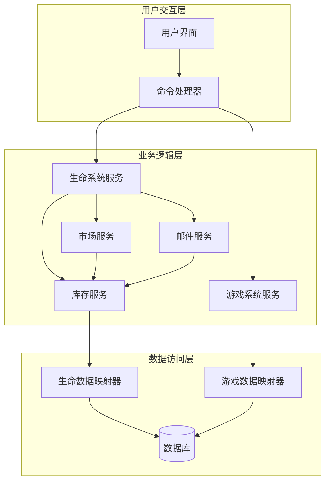
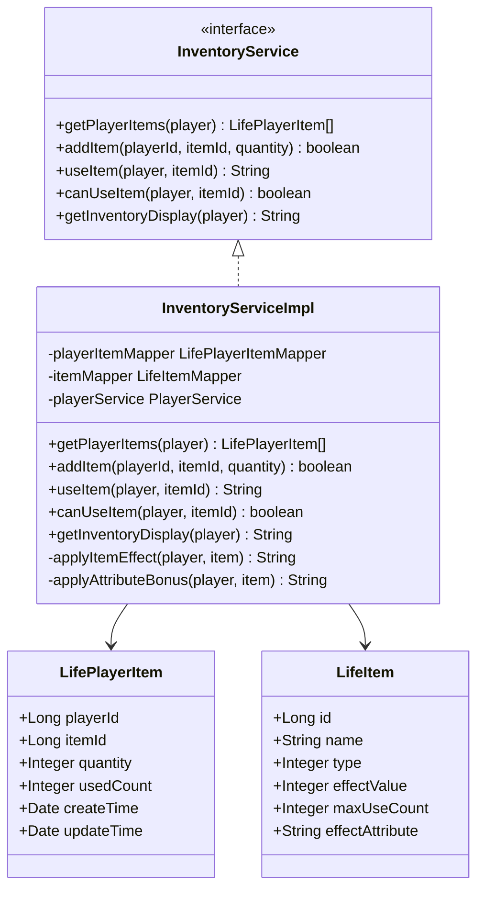
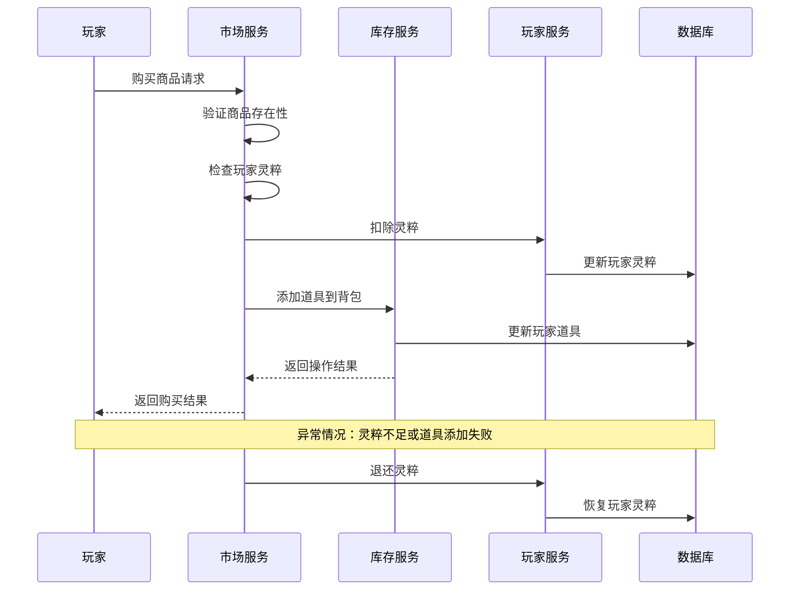
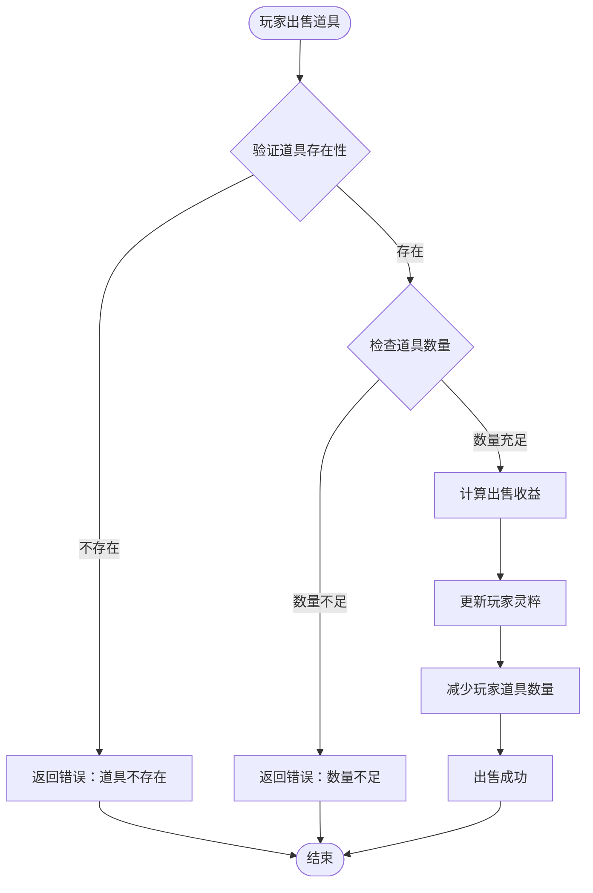
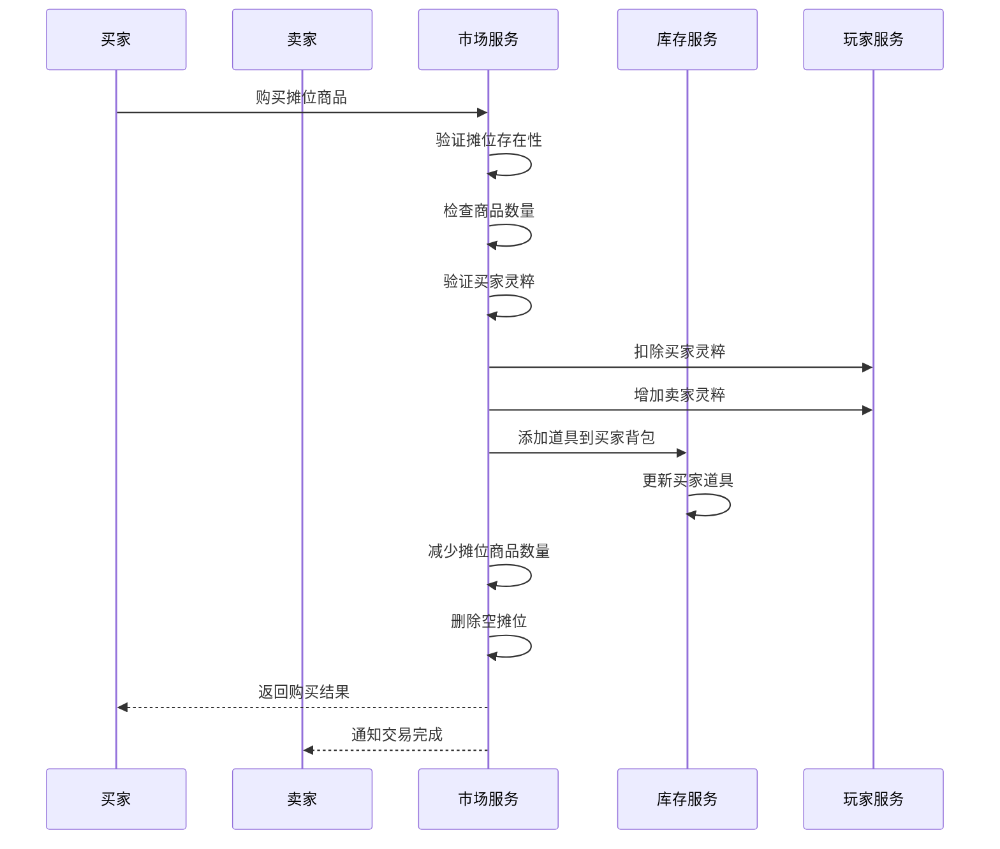
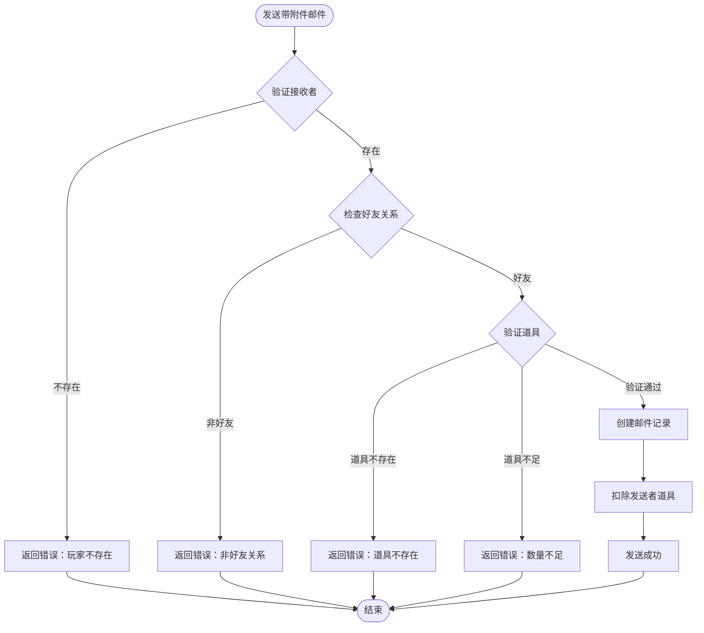
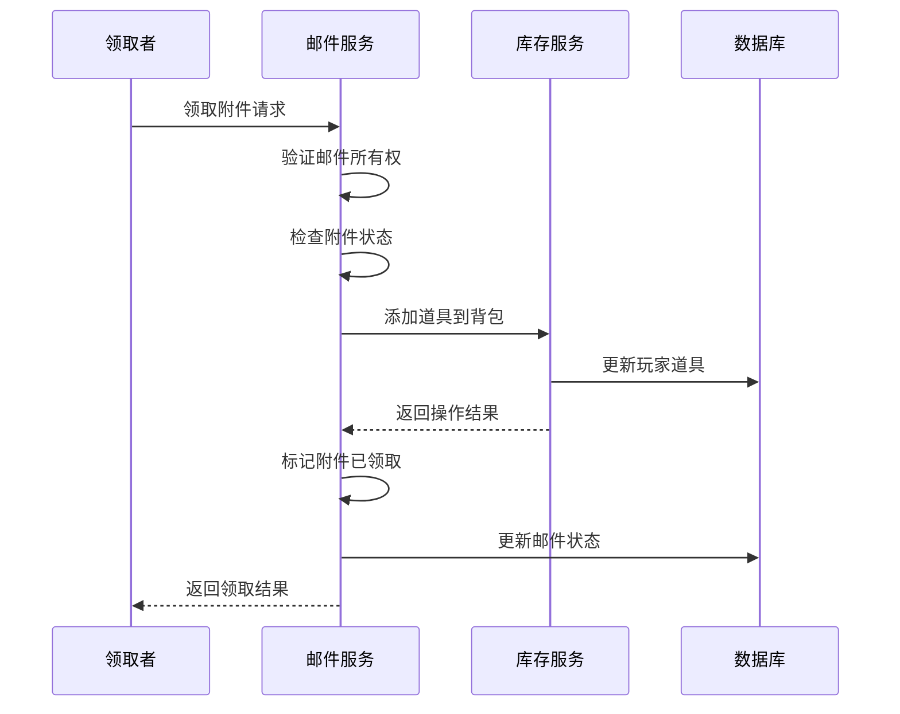
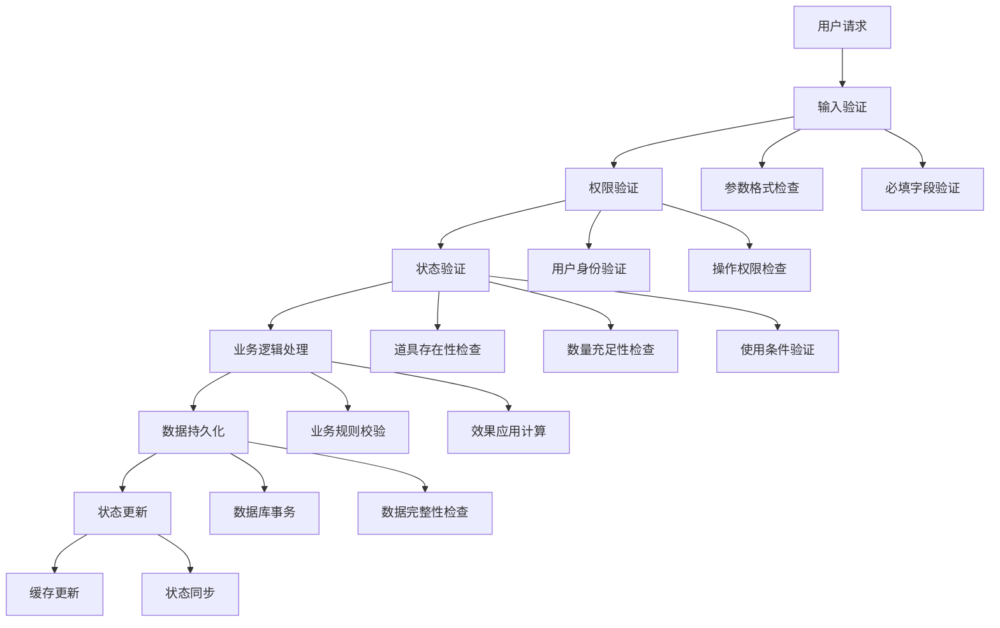
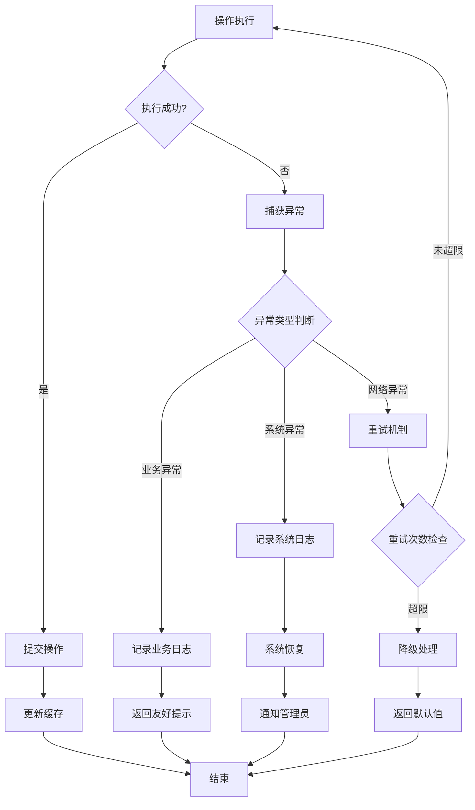

# 系统集成与扩展

<cite>
**本文档引用的文件**
- [MarketServiceImpl.java](file://Life/src/main/java/com/bot/life/service/impl/MarketServiceImpl.java)
- [MailServiceImpl.java](file://Life/src/main/java/com/bot/life/service/impl/MailServiceImpl.java)
- [InventoryServiceImpl.java](file://Life/src/main/java/com/bot/life/service/impl/InventoryServiceImpl.java)
- [InventoryService.java](file://Life/src/main/java/com/bot/life/service/InventoryService.java)
- [MarketService.java](file://Life/src/main/java/com/bot/life/service/MarketService.java)
- [MailService.java](file://Life/src/main/java/com/bot/life/service/MailService.java)
- [LifeHandlerImpl.java](file://Life/src/main/java/com/bot/life/service/impl/LifeHandlerImpl.java)
- [CommonPlayer.java](file://Game/src/main/java/com/bot/game/service/impl/CommonPlayer.java)
</cite>

## 目录
1. [概述](#概述)
2. [系统架构概览](#系统架构概览)
3. [背包系统核心组件](#背包系统核心组件)
4. [交易系统集成](#交易系统集成)
5. [邮件系统集成](#邮件系统集成)
6. [数据一致性保障机制](#数据一致性保障机制)
7. [异常处理与回滚机制](#异常处理与回滚机制)
8. [扩展指南](#扩展指南)
9. [最佳实践](#最佳实践)
10. [故障排除](#故障排除)

## 概述

本文档详细说明了浮生卷游戏中背包系统与其他核心游戏系统的集成方式。通过深入分析交易系统和邮件系统的实现，展示了如何在不同系统间保持数据一致性，以及在异常情况下如何进行正确的回滚处理。

系统采用分层架构设计，通过服务接口定义清晰的边界，确保各系统间的松耦合集成。背包系统作为核心存储单元，为交易系统和邮件系统提供统一的道具管理能力。

## 系统架构概览



**图表来源**
- [LifeHandlerImpl.java](file://Life/src/main/java/com/bot/life/service/impl/LifeHandlerImpl.java#L70-L89)
- [MarketServiceImpl.java](file://Life/src/main/java/com/bot/life/service/impl/MarketServiceImpl.java#L25-L41)
- [MailServiceImpl.java](file://Life/src/main/java/com/bot/life/service/impl/MailServiceImpl.java#L25-L41)

## 背包系统核心组件

### InventoryService 接口设计

背包系统通过 `InventoryService` 接口提供统一的道具管理能力：



**图表来源**
- [InventoryService.java](file://Life/src/main/java/com/bot/life/service/InventoryService.java#L11-L51)
- [InventoryServiceImpl.java](file://Life/src/main/java/com/bot/life/service/impl/InventoryServiceImpl.java#L25-L337)

### 核心功能特性

1. **道具查询与展示**：支持按玩家查询背包内容，提供详细的道具信息展示
2. **道具增减管理**：提供原子性的道具添加和移除操作
3. **使用验证机制**：确保道具使用的合法性验证
4. **效果应用**：根据道具类型应用相应的游戏效果

**章节来源**
- [InventoryService.java](file://Life/src/main/java/com/bot/life/service/InventoryService.java#L18-L51)
- [InventoryServiceImpl.java](file://Life/src/main/java/com/bot/life/service/impl/InventoryServiceImpl.java#L44-L337)

## 交易系统集成

### 神秘商人交易流程

交易系统通过 `MarketService` 实现与背包系统的深度集成：



**图表来源**
- [MarketServiceImpl.java](file://Life/src/main/java/com/bot/life/service/impl/MarketServiceImpl.java#L146-L179)

### 出售道具流程



**图表来源**
- [MarketServiceImpl.java](file://Life/src/main/java/com/bot/life/service/impl/MarketServiceImpl.java#L182-L217)

### 玩家摊位交易

玩家摊位系统实现了更复杂的交易机制：



**图表来源**
- [MarketServiceImpl.java](file://Life/src/main/java/com/bot/life/service/impl/MarketServiceImpl.java#L298-L353)

**章节来源**
- [MarketServiceImpl.java](file://Life/src/main/java/com/bot/life/service/impl/MarketServiceImpl.java#L146-L353)
- [MarketService.java](file://Life/src/main/java/com/bot/life/service/MarketService.java#L38-L75)

## 邮件系统集成

### 邮件附件发送流程

邮件系统与背包系统的集成主要体现在附件道具的发送和验证：



**图表来源**
- [MailServiceImpl.java](file://Life/src/main/java/com/bot/life/service/impl/MailServiceImpl.java#L121-L183)

### 附件领取流程



**图表来源**
- [MailServiceImpl.java](file://Life/src/main/java/com/bot/life/service/impl/MailServiceImpl.java#L246-L294)

**章节来源**
- [MailServiceImpl.java](file://Life/src/main/java/com/bot/life/service/impl/MailServiceImpl.java#L121-L294)
- [MailService.java](file://Life/src/main/java/com/bot/life/service/MailService.java#L37-L54)

## 数据一致性保障机制

### 原子性操作保证

系统通过以下机制确保数据一致性：

1. **单服务内原子性**：每个服务内的操作都是原子性的
2. **跨服务协调**：通过服务间的协调确保跨系统操作的一致性
3. **状态验证**：每次操作前进行状态验证

### 数据验证层次



**章节来源**
- [InventoryServiceImpl.java](file://Life/src/main/java/com/bot/life/service/impl/InventoryServiceImpl.java#L49-L74)
- [MarketServiceImpl.java](file://Life/src/main/java/com/bot/life/service/impl/MarketServiceImpl.java#L146-L179)

## 异常处理与回滚机制

### 异常处理策略

系统采用多层次的异常处理策略：



### 具体异常处理示例

#### 交易系统异常处理

在交易系统中，异常处理确保不会出现数据丢失：

```java
// 购买失败时的回滚逻辑
if (!success) {
    // 购买失败，退还灵粹
    player.setSpirit((player.getSpirit() != null ? player.getSpirit() : 0) + totalCost);
    playerService.updatePlayer(player);
    return "购买失败，请重试！";
}
```

#### 邮件系统异常处理

邮件系统同样实现了完善的异常处理：

```java
try {
    // 创建附件数据
    Map<String, Object> attachment = new HashMap<>();
    attachment.put("type", "item");
    attachment.put("itemId", itemId);
    attachment.put("quantity", quantity);
    attachment.put("itemName", item.getName());
    
    // 创建邮件
    LifeMail mail = new LifeMail();
    mail.setSenderId(sender.getId());
    mail.setReceiverId(receiver.getId());
    mail.setTitle(title);
    mail.setContent(content);
    mail.setMailType(2); // 好友邮件
    mail.setHasAttachment(1);
    mail.setAttachmentData(attachmentJson);
    
    mailMapper.insert(mail);
    
    // 扣除发送者道具
    playerItem.setQuantity(playerItem.getQuantity() - quantity);
    playerItemMapper.updateByPrimaryKey(playerItem);
    
    return String.format("『邮件发送成功！』", receiverNickname, title, item.getName(), quantity);
} catch (Exception e) {
    e.printStackTrace();
    return "邮件发送失败！";
}
```

**章节来源**
- [MarketServiceImpl.java](file://Life/src/main/java/com/bot/life/service/impl/MarketServiceImpl.java#L175-L178)
- [MailServiceImpl.java](file://Life/src/main/java/com/bot/life/service/impl/MailServiceImpl.java#L180-L183)

## 扩展指南

### 新增集成场景

开发者可以通过以下步骤扩展新的系统集成：

#### 1. 定义服务接口

```java
public interface ExtendedService {
    /**
     * 扩展功能：使用道具并触发特殊效果
     * @param player 玩家信息
     * @param itemId 道具ID
     * @param specialParam 特殊参数
     * @return 执行结果
     */
    String useItemWithEffect(LifePlayer player, Long itemId, String specialParam);
}
```

#### 2. 实现服务逻辑

```java
@Service
public class ExtendedServiceImpl implements ExtendedService {
    
    @Autowired
    private InventoryService inventoryService;
    
    @Autowired
    private SpecialEffectService effectService;
    
    @Override
    public String useItemWithEffect(LifePlayer player, Long itemId, String specialParam) {
        // 1. 验证道具
        boolean canUse = inventoryService.canUseItem(player, itemId);
        if (!canUse) {
            return "无法使用该道具！";
        }
        
        // 2. 应用基础效果
        String basicResult = inventoryService.useItem(player, itemId);
        
        // 3. 触发特殊效果
        String specialResult = effectService.triggerSpecialEffect(player, specialParam);
        
        return basicResult + "\n" + specialResult;
    }
}
```

#### 3. 注册到系统

```java
@Component
public class ExtendedIntegration {
    
    @Autowired
    private ExtendedService extendedService;
    
    @Autowired
    private InventoryService inventoryService;
    
    public void registerCommands() {
        // 注册新的使用命令
        CommandRegistry.registerCommand("使用特效", this::handleUseWithEffect);
    }
    
    private String handleUseWithEffect(String content, LifePlayer player) {
        // 解析命令参数
        String[] parts = content.split("\\+");
        if (parts.length < 2) {
            return "格式错误：使用特效+道具ID+特效参数";
        }
        
        Long itemId = Long.parseLong(parts[1].trim());
        String effectParam = parts.length > 2 ? parts[2].trim() : "";
        
        return extendedService.useItemWithEffect(player, itemId, effectParam);
    }
}
```

### 扩展点设计原则

1. **单一职责**：每个扩展只负责特定的功能领域
2. **接口隔离**：通过接口定义清晰的扩展边界
3. **依赖注入**：利用Spring的依赖注入机制
4. **异常透明**：保持异常处理的一致性

**章节来源**
- [InventoryService.java](file://Life/src/main/java/com/bot/life/service/InventoryService.java#L11-L51)
- [InventoryServiceImpl.java](file://Life/src/main/java/com/bot/life/service/impl/InventoryServiceImpl.java#L25-L337)

## 最佳实践

### 1. 数据验证最佳实践

- **前置验证**：在业务逻辑执行前进行充分的验证
- **状态检查**：确保操作前后的状态一致性
- **边界检查**：验证数值参数的有效范围

### 2. 异常处理最佳实践

- **有意义的错误消息**：提供用户友好的错误提示
- **日志记录**：记录详细的错误信息用于调试
- **优雅降级**：在异常情况下提供合理的默认行为

### 3. 性能优化最佳实践

- **批量操作**：对于大量数据操作使用批量处理
- **缓存策略**：合理使用缓存减少数据库访问
- **异步处理**：对于耗时操作考虑异步处理

### 4. 安全性最佳实践

- **输入验证**：严格验证所有用户输入
- **权限控制**：确保操作权限的正确验证
- **数据加密**：敏感数据进行适当的加密处理

## 故障排除

### 常见问题及解决方案

#### 1. 道具数量不一致

**症状**：玩家背包显示的道具数量与实际不符

**原因分析**：
- 数据库更新失败
- 缓存与数据库不同步
- 并发操作导致的竞争条件

**解决方案**：
```java
// 在InventoryServiceImpl中添加数据一致性检查
public boolean checkInventoryConsistency(Long playerId) {
    List<LifePlayerItem> dbItems = playerItemMapper.selectByPlayerId(playerId);
    // 比较数据库记录与内存状态
    // 如果发现不一致，执行修复操作
    return true;
}
```

#### 2. 交易失败导致数据混乱

**症状**：交易完成后，玩家灵粹或道具数量异常

**解决方案**：
```java
// 在MarketServiceImpl中添加补偿机制
@Transactional
public String safeBuyFromShop(LifePlayer player, Long itemId, Integer quantity) {
    try {
        // 开始事务
        String result = buyFromShop(player, itemId, quantity);
        // 提交事务
        return result;
    } catch (Exception e) {
        // 回滚事务
        rollbackTransaction(player, itemId, quantity);
        throw e;
    }
}
```

#### 3. 邮件附件领取失败

**症状**：玩家领取邮件附件后，道具未正确添加到背包

**解决方案**：
```java
// 在MailServiceImpl中添加重试机制
public String receiveMailAttachmentWithRetry(LifePlayer player, Long mailId) {
    int retryCount = 3;
    while (retryCount > 0) {
        try {
            return receiveMailAttachment(player, mailId);
        } catch (Exception e) {
            retryCount--;
            if (retryCount == 0) {
                // 记录失败日志并通知管理员
                log.error("邮件附件领取失败：mailId={}, player={}", mailId, player.getId(), e);
                return "附件领取失败，请联系管理员";
            }
            // 等待后重试
            Thread.sleep(1000);
        }
    }
    return "系统繁忙，请稍后重试";
}
```

### 监控与告警

建议实施以下监控措施：

1. **关键指标监控**：监控交易成功率、道具使用率等关键指标
2. **异常告警**：设置异常情况的实时告警机制
3. **性能监控**：监控系统响应时间和吞吐量
4. **数据一致性检查**：定期检查关键数据的一致性

**章节来源**
- [InventoryServiceImpl.java](file://Life/src/main/java/com/bot/life/service/impl/InventoryServiceImpl.java#L49-L74)
- [MarketServiceImpl.java](file://Life/src/main/java/com/bot/life/service/impl/MarketServiceImpl.java#L146-L179)
- [MailServiceImpl.java](file://Life/src/main/java/com/bot/life/service/impl/MailServiceImpl.java#L121-L183)

## 结论

浮生卷游戏的系统集成为我们提供了一个优秀的跨系统协作范例。通过精心设计的接口、完善的异常处理机制和严格的数据一致性保障，系统能够安全可靠地在不同功能模块间传递数据。

这套集成模式的核心优势在于：

1. **松耦合设计**：各系统通过服务接口进行通信，降低耦合度
2. **强一致性**：通过原子性操作和异常回滚机制确保数据一致性
3. **可扩展性**：清晰的接口设计使得新功能的集成变得简单
4. **健壮性**：完善的异常处理和监控机制保证系统稳定性

对于开发者而言，理解这套集成模式不仅有助于维护现有系统，更能为未来的功能扩展提供坚实的基础。随着游戏功能的不断丰富，这套集成框架将继续发挥重要作用，支撑整个游戏生态系统的健康发展。