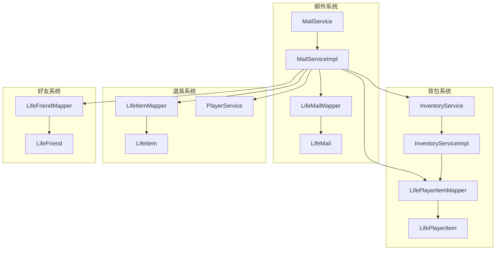
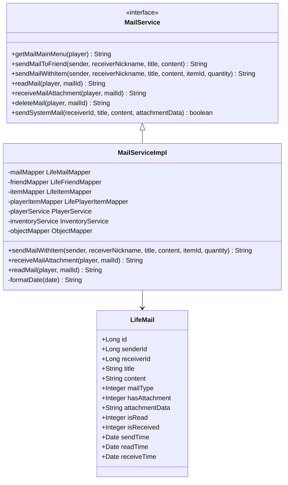
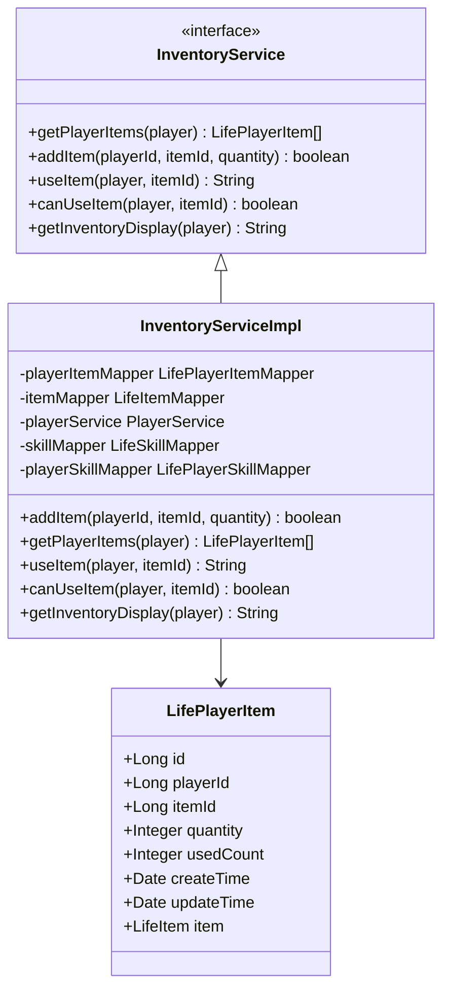
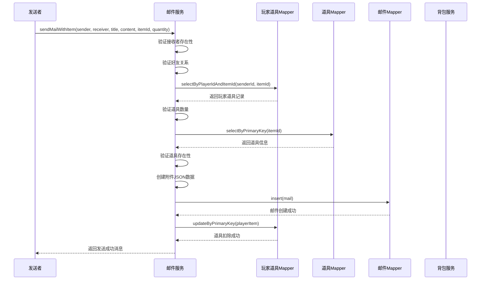
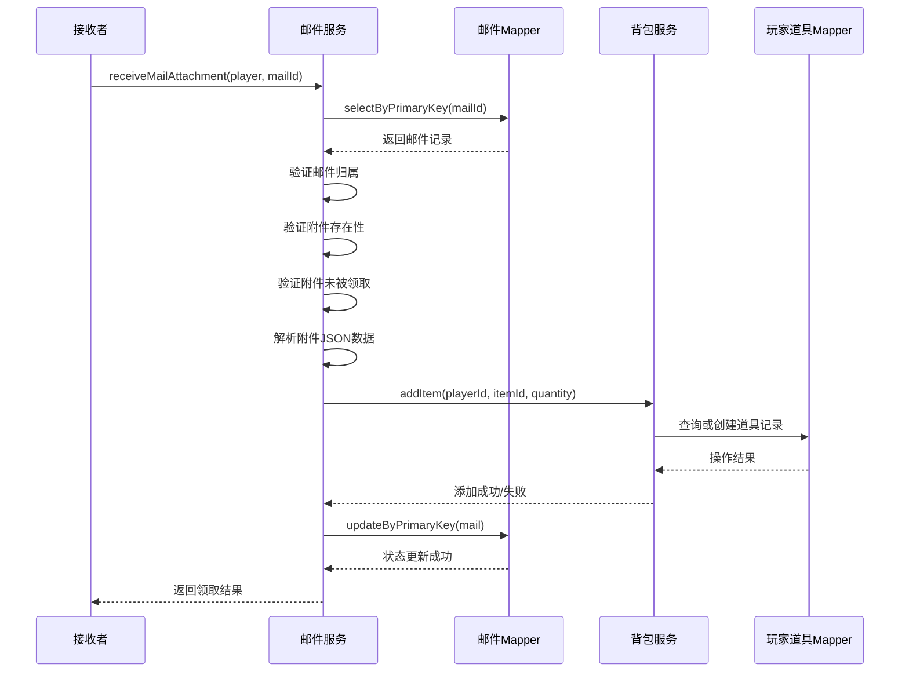
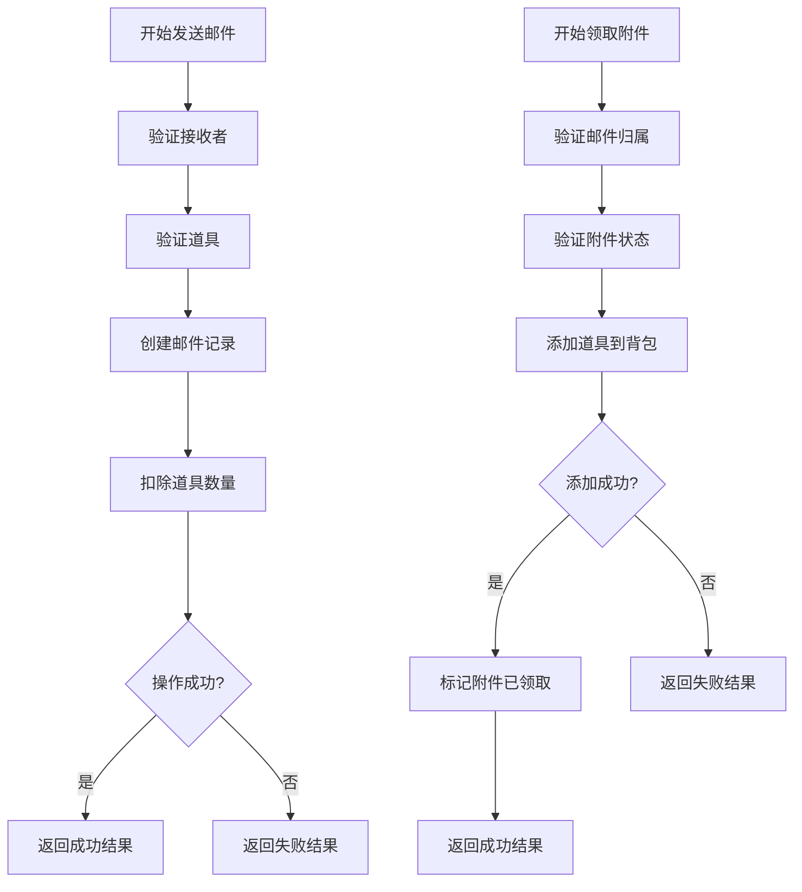
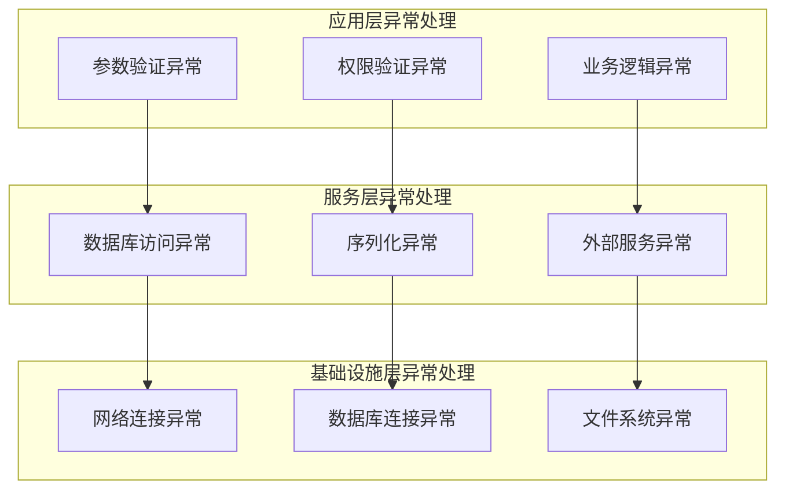
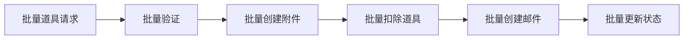

# 邮件系统集成

<cite>
**本文档引用的文件**
- [MailServiceImpl.java](file://Life/src/main/java/com/bot/life/service/impl/MailServiceImpl.java)
- [MailService.java](file://Life/src/main/java/com/bot/life/service/MailService.java)
- [InventoryService.java](file://Life/src/main/java/com/bot/life/service/InventoryService.java)
- [InventoryServiceImpl.java](file://Life/src/main/java/com/bot/life/service/impl/InventoryServiceImpl.java)
- [LifePlayerItemMapper.java](file://Life/src/main/java/com/bot/life/dao/mapper/LifePlayerItemMapper.java)
- [LifePlayerItem.java](file://Life/src/main/java/com/bot/life/dao/entity/LifePlayerItem.java)
- [LifeMail.java](file://Life/src/main/java/com/bot/life/dao/entity/LifeMail.java)
- [LifeMailMapper.xml](file://Life/src/main/resources/mapper/LifeMailMapper.xml)
- [LifePlayerItemMapper.xml](file://Life/src/main/resources/mapper/LifePlayerItemMapper.xml)
</cite>

## 目录
1. [概述](#概述)
2. [系统架构](#系统架构)
3. [核心组件分析](#核心组件分析)
4. [邮件附件功能流程](#邮件附件功能流程)
5. [数据一致性保障机制](#数据一致性保障机制)
6. [异常处理策略](#异常处理策略)
7. [性能优化考虑](#性能优化考虑)
8. [故障排除指南](#故障排除指南)
9. [总结](#总结)

## 概述

邮件系统与背包系统的集成是浮生卷游戏中的核心功能之一，它实现了玩家间道具传输的完整业务流程。该系统通过JSON序列化技术将道具信息存储在邮件记录中，并通过inventoryService协调道具的扣除和添加操作，确保数据的一致性和业务逻辑的完整性。

主要功能包括：
- 发送带道具附件的邮件
- 验证道具存在性和数量
- 扣除发送者的道具
- 将道具添加到接收者背包
- 邮件状态管理
- 数据一致性保障

## 系统架构

**图表来源**
- [MailServiceImpl.java](file://Life/src/main/java/com/bot/life/service/impl/MailServiceImpl.java#L1-L50)
- [InventoryServiceImpl.java](file://Life/src/main/java/com/bot/life/service/impl/InventoryServiceImpl.java#L1-L50)

## 核心组件分析

### 邮件服务组件

邮件服务是整个集成系统的核心控制器，负责协调邮件创建、附件处理和状态管理。

**图表来源**
- [MailService.java](file://Life/src/main/java/com/bot/life/service/MailService.java#L1-L74)
- [MailServiceImpl.java](file://Life/src/main/java/com/bot/life/service/impl/MailServiceImpl.java#L22-L45)
- [LifeMail.java](file://Life/src/main/java/com/bot/life/dao/entity/LifeMail.java#L11-L30)

### 背包服务组件

背包服务提供道具管理的核心功能，包括道具的添加、移除和查询。

**图表来源**
- [InventoryService.java](file://Life/src/main/java/com/bot/life/service/InventoryService.java#L1-L52)
- [InventoryServiceImpl.java](file://Life/src/main/java/com/bot/life/service/impl/InventoryServiceImpl.java#L25-L45)
- [LifePlayerItem.java](file://Life/src/main/java/com/bot/life/dao/entity/LifePlayerItem.java#L11-L23)

**章节来源**
- [MailServiceImpl.java](file://Life/src/main/java/com/bot/life/service/impl/MailServiceImpl.java#L1-L355)
- [InventoryServiceImpl.java](file://Life/src/main/java/com/bot/life/service/impl/InventoryServiceImpl.java#L1-L106)

## 邮件附件功能流程

### 发送带附件邮件流程

发送带附件邮件是一个复杂的跨系统操作，涉及多个验证步骤和数据一致性保障。

**图表来源**
- [MailServiceImpl.java](file://Life/src/main/java/com/bot/life/service/impl/MailServiceImpl.java#L122-L183)

#### 道具验证步骤

在发送邮件前，系统执行严格的道具验证：

1. **接收者验证**：确认接收者存在且为好友关系
2. **道具存在性验证**：通过playerItemMapper查询玩家道具记录
3. **数量验证**：检查玩家持有的道具数量是否满足要求
4. **道具有效性验证**：确认道具本身存在于系统中

#### 附件数据序列化

道具信息通过JSON格式序列化存储在邮件记录中：

| 字段名 | 类型 | 描述 | 示例值 |
|--------|------|------|--------|
| type | String | 附件类型标识 | "item" |
| itemId | Long | 道具唯一标识 | 1001 |
| quantity | Integer | 道具数量 | 5 |
| itemName | String | 道具名称 | "生命药水" |

**章节来源**
- [MailServiceImpl.java](file://Life/src/main/java/com/bot/life/service/impl/MailServiceImpl.java#L122-L183)

### 领取附件流程

领取附件是另一个重要的跨系统操作，需要确保道具正确添加到接收者背包并更新邮件状态。

**图表来源**
- [MailServiceImpl.java](file://Life/src/main/java/com/bot/life/service/impl/MailServiceImpl.java#L247-L294)

#### 领取验证步骤

1. **邮件归属验证**：确认邮件属于当前玩家
2. **附件存在性验证**：检查邮件是否有附件
3. **重复领取防护**：防止同一附件多次领取
4. **附件类型验证**：确认附件类型为道具类型

**章节来源**
- [MailServiceImpl.java](file://Life/src/main/java/com/bot/life/service/impl/MailServiceImpl.java#L247-L294)

## 数据一致性保障机制

### 原子性保障

虽然当前实现中没有显式的Spring事务注解，但系统通过以下机制确保数据一致性：

#### 1. 顺序依赖操作

**图表来源**
- [MailServiceImpl.java](file://Life/src/main/java/com/bot/life/service/impl/MailServiceImpl.java#L122-L183)
- [MailServiceImpl.java](file://Life/src/main/java/com/bot/life/service/impl/MailServiceImpl.java#L247-L294)

#### 2. 异常回滚机制

每个关键操作都包含异常捕获和回滚逻辑：

- **发送邮件异常**：捕获序列化异常、数据库操作异常
- **领取附件异常**：捕获JSON解析异常、背包添加异常
- **状态恢复**：在异常情况下保持原有状态不变

### 并发控制

系统通过以下方式处理并发访问：

1. **乐观锁机制**：使用updateTime字段进行版本控制
2. **原子操作**：确保道具数量更新的原子性
3. **状态检查**：在关键操作前检查前置条件

**章节来源**
- [MailServiceImpl.java](file://Life/src/main/java/com/bot/life/service/impl/MailServiceImpl.java#L180-L183)
- [MailServiceImpl.java](file://Life/src/main/java/com/bot/life/service/impl/MailServiceImpl.java#L291-L294)

## 异常处理策略

### 分层异常处理

系统采用分层异常处理策略，确保不同类型的错误得到适当处理：

**图表来源**
- [MailServiceImpl.java](file://Life/src/main/java/com/bot/life/service/impl/MailServiceImpl.java#L180-L183)
- [MailServiceImpl.java](file://Life/src/main/java/com/bot/life/service/impl/MailServiceImpl.java#L291-L294)

### 具体异常场景

#### 发送邮件异常处理

| 异常类型 | 处理策略 | 用户反馈 |
|----------|----------|----------|
| 接收者不存在 | 立即返回错误信息 | "玩家『XXX』不存在！" |
| 非好友关系 | 立即返回错误信息 | "『XXX』不是你的好友，无法发送邮件！" |
| 道具不足 | 立即返回错误信息 | "你没有足够的该道具！" |
| 道具不存在 | 立即返回错误信息 | "道具不存在！" |
| 数据库异常 | 记录日志，返回通用错误 | "邮件发送失败！" |

#### 领取附件异常处理

| 异常类型 | 处理策略 | 用户反馈 |
|----------|----------|----------|
| 邮件不存在 | 立即返回错误信息 | "邮件不存在！" |
| 非邮件拥有者 | 立即返回错误信息 | "这不是你的邮件！" |
| 无附件 | 立即返回错误信息 | "该邮件没有附件！" |
| 已领取过 | 立即返回错误信息 | "附件已经领取过了！" |
| JSON解析异常 | 记录日志，返回错误信息 | "附件数据异常" |
| 背包添加失败 | 立即返回错误信息 | "领取失败，请重试！" |

**章节来源**
- [MailServiceImpl.java](file://Life/src/main/java/com/bot/life/service/impl/MailServiceImpl.java#L125-L145)
- [MailServiceImpl.java](file://Life/src/main/java/com/bot/life/service/impl/MailServiceImpl.java#L248-L263)

## 性能优化考虑

### 查询优化

1. **索引优化**：
   - player_id和item_id组合索引用于快速查找玩家道具
   - receiver_id索引用于快速查询邮件列表

2. **缓存策略**：
   - 道具基本信息缓存
   - 玩家好友关系缓存
   - 邮件状态缓存

### 批量操作支持

虽然当前实现是单个道具操作，但系统设计支持批量操作扩展：

### 连接池优化

系统使用数据库连接池来优化数据库访问性能，通过配置参数控制连接数量和超时时间。

## 故障排除指南

### 常见问题诊断

#### 道具发送失败

**症状**：发送邮件时提示"你没有足够的该道具！"

**可能原因**：
1. 玩家道具数量不足
2. 道具已被其他操作修改
3. 数据库连接异常

**解决方案**：
1. 检查玩家道具数量
2. 验证数据库连接状态
3. 查看系统日志获取详细错误信息

#### 附件领取失败

**症状**：领取附件时提示"领取失败，请重试！"

**可能原因**：
1. 道具添加到背包失败
2. 邮件状态更新失败
3. 并发冲突导致的状态不一致

**解决方案**：
1. 检查背包系统状态
2. 验证邮件状态一致性
3. 重新尝试领取操作

### 监控指标

建议监控以下关键指标：

| 指标名称 | 监控目的 | 告警阈值 |
|----------|----------|----------|
| 邮件发送成功率 | 业务健康度 | < 95% |
| 道具扣除成功率 | 数据一致性 | < 99% |
| 附件领取成功率 | 用户体验 | < 98% |
| 数据库连接数 | 系统负载 | > 80% |
| 平均响应时间 | 性能监控 | > 2秒 |

**章节来源**
- [MailServiceImpl.java](file://Life/src/main/java/com/bot/life/service/impl/MailServiceImpl.java#L180-L183)
- [MailServiceImpl.java](file://Life/src/main/java/com/bot/life/service/impl/MailServiceImpl.java#L291-L294)

## 总结

邮件系统与背包系统的集成展现了现代游戏系统中跨模块协作的最佳实践。通过精心设计的验证机制、异常处理策略和数据一致性保障，系统能够安全可靠地处理玩家间的道具传输。

### 关键特性

1. **严格验证**：多层次的道具验证确保业务逻辑正确性
2. **数据序列化**：JSON格式存储附件信息便于扩展
3. **状态管理**：完善的邮件状态跟踪防止重复操作
4. **异常处理**：分层异常处理保证系统稳定性
5. **性能优化**：合理的查询设计和缓存策略提升响应速度

### 改进建议

1. **引入事务管理**：考虑添加@Transactional注解确保操作原子性
2. **增加批量操作**：支持一次性发送多个道具附件
3. **完善监控体系**：建立更全面的性能和业务监控
4. **增强日志记录**：提供更多调试和审计信息

该集成方案为浮生卷游戏提供了稳定可靠的道具传输功能，为玩家创造了丰富的社交互动体验。