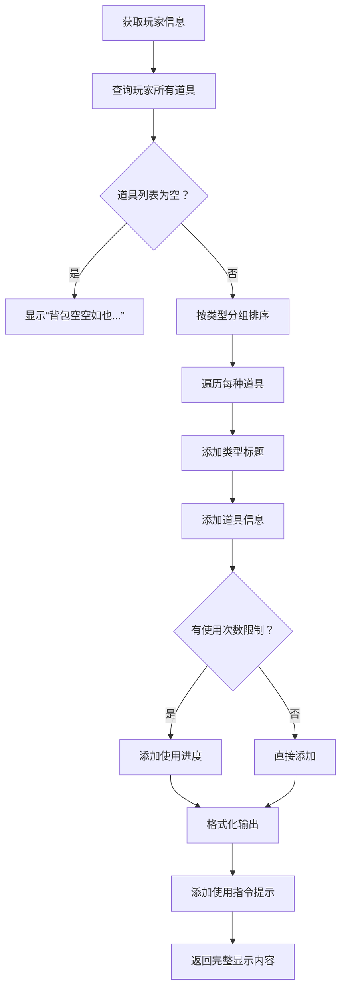
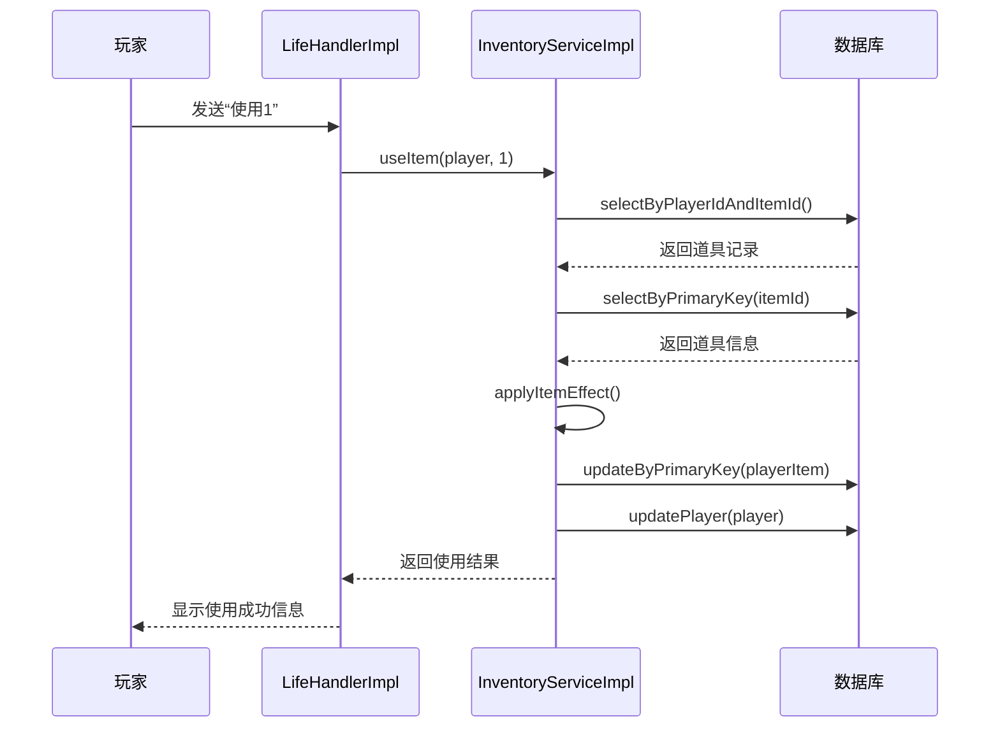
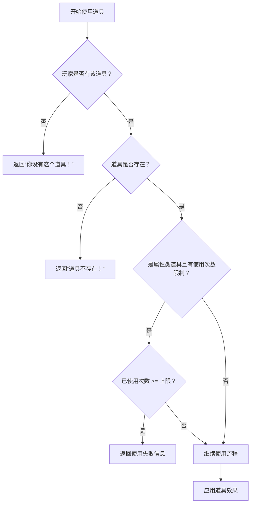
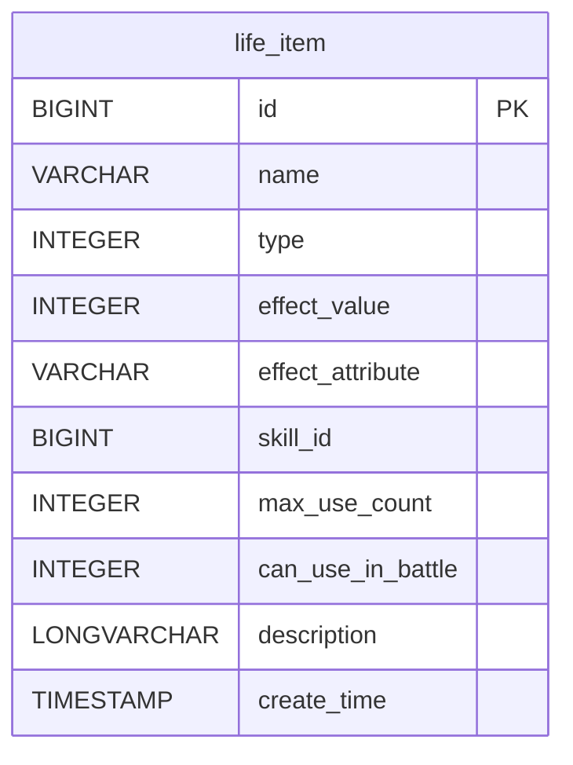
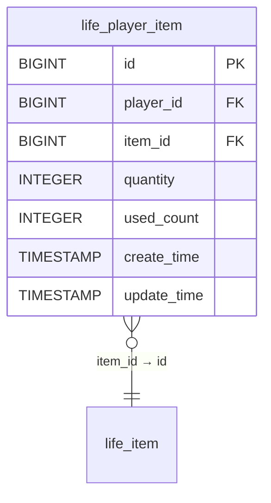
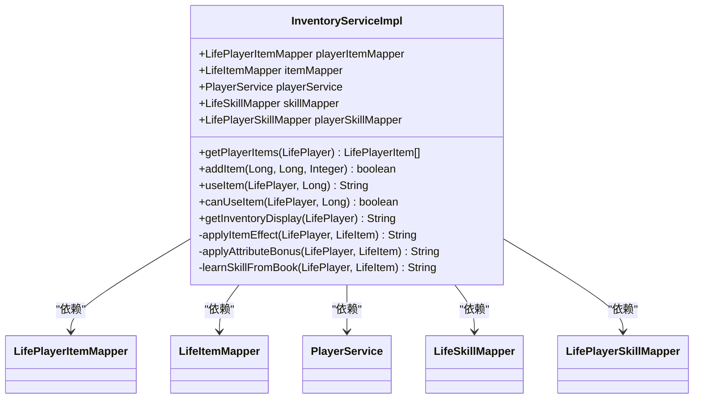
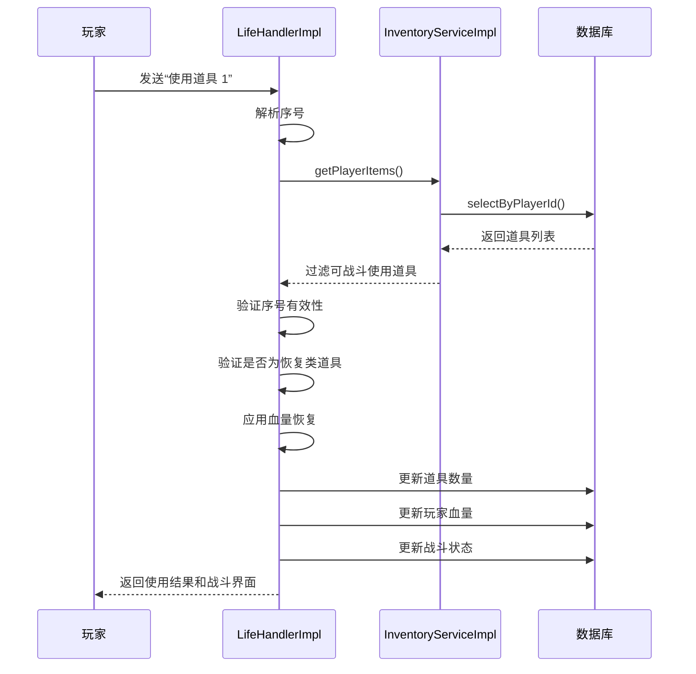

# 背包与道具系统

<cite>
**本文档引用文件**  
- [InventoryService.java](file://Life\src\main\java\com\bot\life\service\InventoryService.java)
- [InventoryServiceImpl.java](file://Life\src\main\java\com\bot\life\service\impl\InventoryServiceImpl.java)
- [LifeItem.java](file://Life\src\main\java\com\bot\life\dao\entity\LifeItem.java)
- [LifePlayerItem.java](file://Life\src\main\java\com\bot\life\dao\entity\LifePlayerItem.java)
- [ENItemType.java](file://Life\src\main\java\com\bot\life\enums\ENItemType.java)
- [LifeItemMapper.xml](file://Life\src\main\resources\mapper\LifeItemMapper.xml)
- [LifePlayerItemMapper.xml](file://Life\src\main\resources\mapper\LifePlayerItemMapper.xml)
- [LifeHandlerImpl.java](file://Life\src\main\java\com\bot\life\service\impl\LifeHandlerImpl.java)
</cite>

## 目录
1. [系统概述](#系统概述)
2. [道具分类与使用规则](#道具分类与使用规则)
3. [背包容量与显示机制](#背包容量与显示机制)
4. [道具使用流程](#道具使用流程)
5. [数据表结构设计](#数据表结构设计)
6. [服务实现分析](#服务实现分析)
7. [战斗中道具使用](#战斗中道具使用)
8. [扩展新道具类型](#扩展新道具类型)

## 系统概述

“浮生卷”游戏中的背包与道具系统是玩家修仙旅程中的核心功能之一，为玩家提供道具管理、使用和效果应用的完整机制。该系统通过`InventoryService`接口和`InventoryServiceImpl`实现类，结合`life_item`和`life_player_item`数据库表，实现了道具的查询、使用、持久化和效果应用。

系统支持多种道具类型，包括修为类、属性类、恢复类、技能书等，每种道具都有特定的效果和使用规则。玩家可以通过简单的指令与系统交互，查看背包内容、使用道具并获得相应的属性提升或特殊效果。

**本节来源**  
- [InventoryService.java](file://Life\src\main\java\com\bot\life\service\InventoryService.java#L1-L52)
- [InventoryServiceImpl.java](file://Life\src\main\java\com\bot\life\service\impl\InventoryServiceImpl.java#L1-L25)

## 道具分类与使用规则

“浮生卷”游戏中的道具分为六大类，每类道具都有特定的功能和使用规则：

### 道具类型枚举

道具类型通过`ENItemType`枚举定义，包含以下六种：

| 类型代码 | 类型名称 | 说明 |
|---------|--------|------|
| 1 | 修为类 | 增加玩家修为值 |
| 2 | 属性类 | 永久增加玩家基础属性 |
| 3 | 体力类 | 恢复玩家体力值 |
| 4 | 升级法宝类 | 用于法宝升级（功能开发中） |
| 5 | 恢复类 | 恢复玩家血量 |
| 6 | 技能书 | 学习新技能 |

**本节来源**  
- [ENItemType.java](file://Life\src\main\java\com\bot\life\enums\ENItemType.java#L7-L13)

### 各类道具详细规则

#### 修为类道具
- **效果**：直接增加玩家的修为值
- **使用效果**：`服用了『{道具名}』\n获得修为：{数值}\n当前修为：{格式化数值}`

#### 属性类道具
- **效果**：永久增加玩家的基础属性（速度、体质、灵力、力量）
- **使用限制**：有最大使用次数限制（通过`maxUseCount`字段控制）
- **属性映射**：
  - `speed`：速度
  - `constitution`：体质
  - `spirit_power`：灵力
  - `strength`：力量
- **使用效果**：`服用了『{道具名}』\n{属性名}永久增加：{数值}`

#### 恢复类道具
- **效果**：恢复玩家的血量
- **使用效果**：`服用了『{道具名}』\n恢复血量：{数值}\n当前血量：{当前}/{最大}`

#### 体力类道具
- **效果**：恢复玩家的体力值
- **使用效果**：`服用了『{道具名}』\n恢复体力：{数值}\n当前体力：{当前}/{最大}`

#### 技能书道具
- **效果**：学习新的技能
- **学习条件**：
  - 玩家未学习过该技能
  - 玩家属性匹配（金木水火土）
  - 达到技能要求的等级
  - 满足技能要求的修为
- **使用效果**：成功学习后显示技能名称和描述

**本节来源**  
- [InventoryServiceImpl.java](file://Life\src\main\java\com\bot\life\service\impl\InventoryServiceImpl.java#L173-L220)
- [LifeItem.java](file://Life\src\main\java\com\bot\life\dao\entity\LifeItem.java#L15-L19)

## 背包容量与显示机制

### 背包容量限制

系统未设置固定的背包格子数量限制，而是采用动态管理方式。玩家可以拥有任意数量的道具，系统通过数据库中的`life_player_item`表记录每个玩家拥有的每种道具的数量。

当玩家获得已存在的道具时，系统会增加该道具的数量；当获得新道具时，会创建新的记录。

### 背包显示格式

背包内容通过`getInventoryDisplay`方法生成，显示格式如下：

```text
『玩家昵称的背包』

当前灵粹：{数值}

『修为类』
1. {道具名} x{数量}

『属性类』
2. {道具名} x{数量}（已使用{已用}/{上限}次）

发送『使用+道具ID』使用道具
例如：使用1
```

显示特点：
- 按道具类型分组显示
- 显示道具ID、名称和数量
- 对有限制使用次数的道具显示使用进度
- 提供使用指令示例



**本节来源**  
- [InventoryServiceImpl.java](file://Life\src\main\java\com\bot\life\service\impl\InventoryServiceImpl.java#L133-L171)

## 道具使用流程

道具使用流程从玩家输入指令开始，到效果应用结束，完整的流程如下：

### 指令解析流程

玩家输入“使用+道具ID”指令后，系统处理流程：

1. 解析指令获取道具ID
2. 验证玩家是否拥有该道具
3. 检查道具是否存在
4. 验证是否可以使用（数量、使用次数等）
5. 应用道具效果
6. 更新道具数量和使用次数
7. 持久化数据
8. 返回使用结果



### 使用条件检查

在使用道具前，系统会进行多重验证：



**本节来源**  
- [InventoryServiceImpl.java](file://Life\src\main\java\com\bot\life\service\impl\InventoryServiceImpl.java#L76-L111)
- [LifeHandlerImpl.java](file://Life\src\main\java\com\bot\life\service\impl\LifeHandlerImpl.java#L1359-L1420)

## 数据表结构设计

### life_item 表（道具定义表）

存储所有道具的基础定义信息。

| 字段名 | 类型 | 说明 |
|-------|------|------|
| id | BIGINT | 道具ID（主键） |
| name | VARCHAR | 道具名称 |
| type | INTEGER | 道具类型（1-6） |
| effect_value | INTEGER | 效果值（修为、体力、血量等） |
| effect_attribute | VARCHAR | 影响的属性（speed等） |
| skill_id | BIGINT | 关联的技能ID（技能书专用） |
| max_use_count | INTEGER | 最大使用次数（-1为无限制） |
| can_use_in_battle | INTEGER | 是否可战斗中使用（0/1） |
| description | LONGVARCHAR | 道具描述 |
| create_time | TIMESTAMP | 创建时间 |



**本节来源**  
- [LifeItemMapper.xml](file://Life\src\main\resources\mapper\LifeItemMapper.xml#L5-L16)
- [LifeItem.java](file://Life\src\main\java\com\bot\life\dao\entity\LifeItem.java#L13-L23)

### life_player_item 表（玩家道具表）

存储每个玩家拥有的道具及其状态。

| 字段名 | 类型 | 说明 |
|-------|------|------|
| id | BIGINT | 记录ID（主键） |
| player_id | BIGINT | 玩家ID |
| item_id | BIGINT | 道具ID |
| quantity | INTEGER | 道具数量 |
| used_count | INTEGER | 已使用次数 |
| create_time | TIMESTAMP | 创建时间 |
| update_time | TIMESTAMP | 更新时间 |



**本节来源**  
- [LifePlayerItemMapper.xml](file://Life\src\main\resources\mapper\LifePlayerItemMapper.xml#L5-L13)
- [LifePlayerItem.java](file://Life\src\main\java\com\bot\life\dao\entity\LifePlayerItem.java#L13-L23)

## 服务实现分析

### InventoryService 接口

定义了背包系统的核心功能接口：

```java
public interface InventoryService {
    List<LifePlayerItem> getPlayerItems(LifePlayer player);
    boolean addItem(Long playerId, Long itemId, Integer quantity);
    String useItem(LifePlayer player, Long itemId);
    boolean canUseItem(LifePlayer player, Long itemId);
    String getInventoryDisplay(LifePlayer player);
}
```

### InventoryServiceImpl 实现

核心实现类，通过依赖注入管理数据访问：



### 核心方法分析

#### 添加道具 (addItem)
- 检查玩家是否已有该道具
- 若有则增加数量，若无则创建新记录
- 自动处理创建时间和更新时间

#### 使用道具 (useItem)
- 验证道具存在性和拥有情况
- 检查使用限制
- 应用相应效果
- 更新道具数量和使用次数
- 持久化玩家信息

#### 获取背包显示 (getInventoryDisplay)
- 按类型分组显示道具
- 格式化输出，便于阅读
- 提供使用指令提示

**本节来源**  
- [InventoryService.java](file://Life\src\main\java\com\bot\life\service\InventoryService.java#L12-L51)
- [InventoryServiceImpl.java](file://Life\src\main\java\com\bot\life\service\impl\InventoryServiceImpl.java#L25-L45)

## 战斗中道具使用

### 战斗道具限制

并非所有道具都可以在战斗中使用，系统有严格的限制：

- **仅恢复类道具**可以在战斗中使用
- 道具必须设置`can_use_in_battle = 1`
- 其他类型道具（如属性类）禁止在战斗中使用

### 战斗道具选择界面

当玩家在战斗中选择“道具”选项时，系统显示可用的战斗道具：

```text
『战斗道具』

1. {道具名} x{数量}
   效果：{描述}

发送『使用道具+序号』使用道具
例如：使用道具 1
发送『返回』继续战斗
```

### 战斗道具使用流程



**本节来源**  
- [LifeHandlerImpl.java](file://Life\src\main\java\com\bot\life\service\impl\LifeHandlerImpl.java#L1328-L1420)

## 扩展新道具类型

### 添加新道具类型的步骤

要扩展新的道具类型，开发者需要按以下步骤操作：

1. **在ENItemType枚举中添加新类型**
```java
NEW_TYPE(7, "新类型");
```

2. **在applyItemEffect方法中添加新类型的处理逻辑**
```java
case NEW_TYPE:
    // 实现新类型的效果逻辑
    return "应用新类型效果";
```

3. **在数据库中添加新道具记录**
```sql
INSERT INTO life_item (name, type, effect_value, description, can_use_in_battle, create_time) 
VALUES ('新道具', 7, 100, '这是一个新类型的道具', 1, NOW());
```

### 扩展示例：添加“境界突破丹”

假设要添加一种可以提升玩家境界的道具：

1. **修改枚举**
```java
CULTIVATION_BOOST(7, "境界突破类")
```

2. **添加效果处理**
```java
case CULTIVATION_BOOST:
    // 检查是否满足突破条件
    if (player.getCultivation() >= player.getNextRealmThreshold()) {
        player.setRealmLevel(player.getRealmLevel() + 1);
        player.setCultivation(0);
        return String.format("『突破成功！』\n\n成功突破到%s境界！", 
                           getRealmName(player.getRealmLevel()));
    } else {
        return "修为不足，无法突破！";
    }
```

3. **添加数据库记录**
```sql
INSERT INTO life_item VALUES (7, '小境界突破丹', 7, 0, NULL, NULL, -1, 1, '服用后可尝试突破小境界', NOW());
```

通过这种方式，系统可以灵活扩展新的道具类型和使用场景，而无需修改核心架构。

**本节来源**  
- [ENItemType.java](file://Life\src\main\java\com\bot\life\enums\ENItemType.java#L7-L13)
- [InventoryServiceImpl.java](file://Life\src\main\java\com\bot\life\service\impl\InventoryServiceImpl.java#L173-L220)