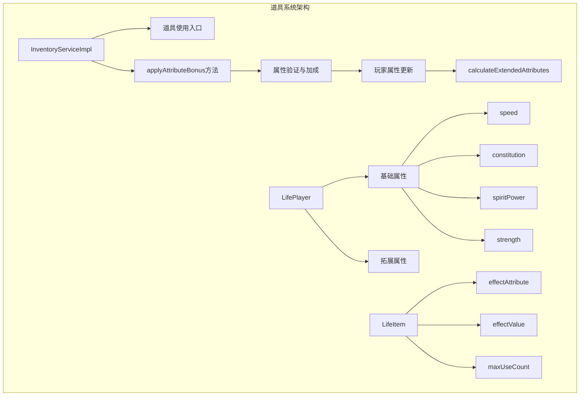
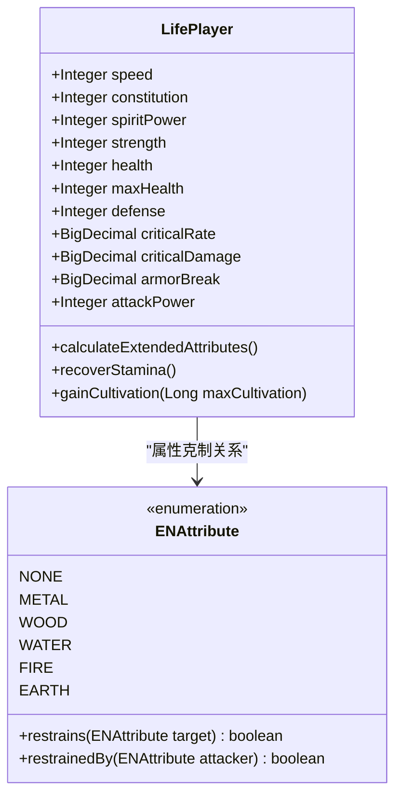
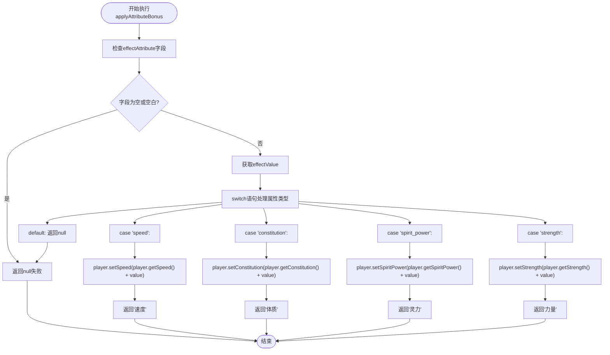
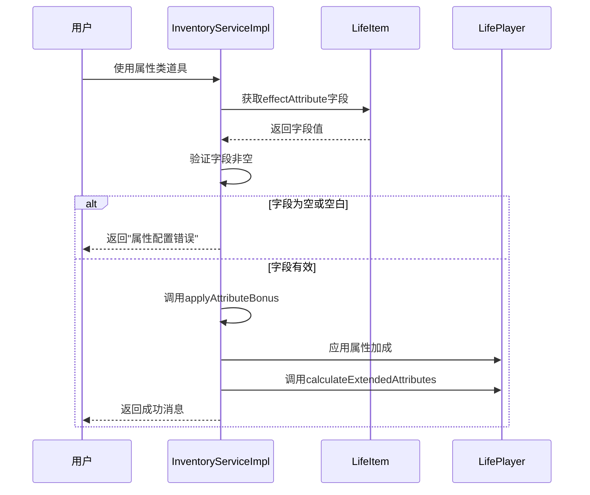
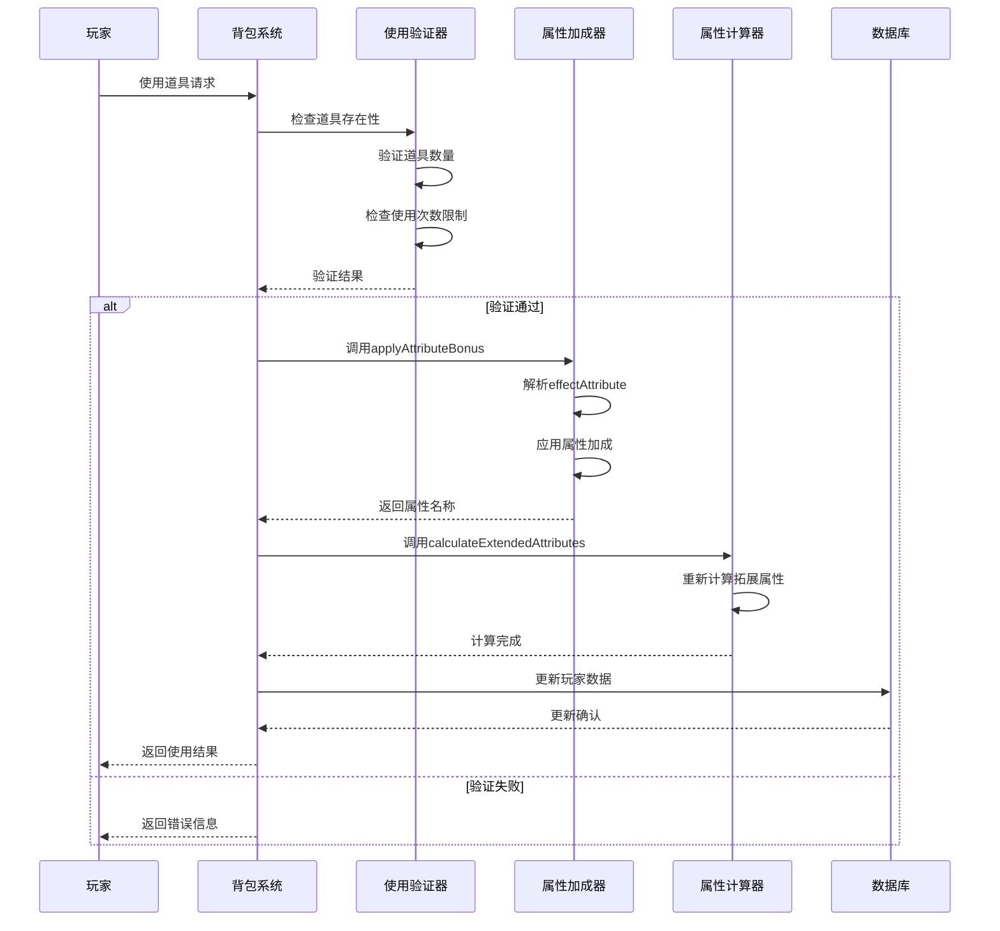
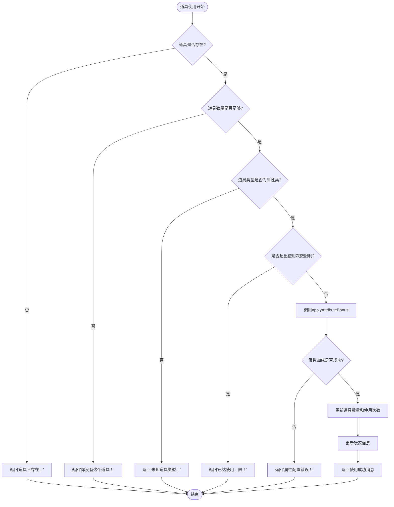

# 属性类道具机制

<cite>
**本文档引用的文件**
- [InventoryServiceImpl.java](file://Life/src/main/java/com/bot/life/service/impl/InventoryServiceImpl.java)
- [LifePlayer.java](file://Life/src/main/java/com/bot/life/dao/entity/LifePlayer.java)
- [LifeItem.java](file://Life/src/main/java/com/bot/life/dao/entity/LifeItem.java)
- [ENItemType.java](file://Life/src/main/java/com/bot/life/enums/ENItemType.java)
- [ENAttribute.java](file://Life/src/main/java/com/bot/life/enums/ENAttribute.java)
- [RealmServiceImpl.java](file://Life/src/main/java/com/bot/life/service/impl/RealmServiceImpl.java)
- [LifeItemMapper.xml](file://Life/src/main/resources/mapper/LifeItemMapper.xml)
</cite>

## 目录
1. [简介](#简介)
2. [项目架构概览](#项目架构概览)
3. [核心组件分析](#核心组件分析)
4. [applyAttributeBonus方法详解](#applyattributebonus方法详解)
5. [属性类型系统](#属性类型系统)
6. [道具使用流程](#道具使用流程)
7. [边界情况处理](#边界情况处理)
8. [性能考虑](#性能考虑)
9. [故障排除指南](#故障排除指南)
10. [总结](#总结)

## 简介

属性类道具机制是游戏系统中的核心功能之一，负责处理玩家使用属性类道具时的基础属性加成。该机制通过`applyAttributeBonus`方法实现，能够根据道具的`effect_attribute`字段值（speed、constitution、spirit_power、strength）来决定提升玩家的哪个基础属性，并提供相应的中文名称映射。

本文档将深入解析属性类道具的完整实现流程，包括属性加成的数值计算方式、属性类型验证逻辑、返回值处理机制，以及各种边界情况的处理策略。

## 项目架构概览

属性类道具机制在游戏系统中属于生命周期管理模块的一部分，主要涉及以下核心组件：



**图表来源**
- [InventoryServiceImpl.java](file://Life/src/main/java/com/bot/life/service/impl/InventoryServiceImpl.java#L231-L254)
- [LifePlayer.java](file://Life/src/main/java/com/bot/life/dao/entity/LifePlayer.java#L25-L38)

**章节来源**
- [InventoryServiceImpl.java](file://Life/src/main/java/com/bot/life/service/impl/InventoryServiceImpl.java#L1-L339)
- [LifePlayer.java](file://Life/src/main/java/com/bot/life/dao/entity/LifePlayer.java#L1-L130)

## 核心组件分析

### 道具实体类（LifeItem）

道具实体类定义了属性类道具的基本结构，其中`effectAttribute`字段是核心配置项：

| 字段名 | 类型 | 描述 | 示例值 |
|--------|------|------|--------|
| id | Long | 道具唯一标识 | 1001 |
| name | String | 道具名称 | "速度丹" |
| type | Integer | 道具类型（2为属性类） | 2 |
| effectValue | Integer | 属性加成数值 | 5 |
| effectAttribute | String | 影响的属性类型 | "speed" |
| maxUseCount | Integer | 最大使用次数（-1表示无限） | 3 |
| canUseInBattle | Integer | 战斗中是否可用 | 0 |

**章节来源**
- [LifeItem.java](file://Life/src/main/java/com/bot/life/dao/entity/LifeItem.java#L1-L24)
- [LifeItemMapper.xml](file://Life/src/main/resources/mapper/LifeItemMapper.xml#L5-L16)

### 玩家属性系统

玩家属性系统包含四个基础属性和多个拓展属性：



**图表来源**
- [LifePlayer.java](file://Life/src/main/java/com/bot/life/dao/entity/LifePlayer.java#L25-L76)
- [ENAttribute.java](file://Life/src/main/java/com/bot/life/enums/ENAttribute.java#L1-L64)

**章节来源**
- [LifePlayer.java](file://Life/src/main/java/com/bot/life/dao/entity/LifePlayer.java#L25-L76)
- [ENAttribute.java](file://Life/src/main/java/com/bot/life/enums/ENAttribute.java#L1-L64)

## applyAttributeBonus方法详解

`applyAttributeBonus`方法是属性类道具机制的核心实现，负责根据道具配置应用属性加成。

### 方法签名与参数

```java
private String applyAttributeBonus(LifePlayer player, LifeItem item)
```

**参数说明：**
- `player`: 当前玩家对象，包含所有基础属性
- `item`: 使用的道具对象，包含属性加成配置

**返回值：**
- 成功时返回属性的中文名称（"速度"、"体质"、"灵力"、"力量"）
- 失败时返回null（属性配置错误）

### 执行流程图



**图表来源**
- [InventoryServiceImpl.java](file://Life/src/main/java/com/bot/life/service/impl/InventoryServiceImpl.java#L231-L254)

### 属性加成计算方式

每种属性的加成计算遵循统一模式：

| 属性类型 | 计算公式 | 中文名称 | 默认值 |
|----------|----------|----------|--------|
| speed | player.getSpeed() + effectValue | 速度 | 初始值 |
| constitution | player.getConstitution() + effectValue | 体质 | 初始值 |
| spiritPower | player.getSpiritPower() + effectValue | 灵力 | 初始值 |
| strength | player.getStrength() + effectValue | 力量 | 初始值 |

**章节来源**
- [InventoryServiceImpl.java](file://Life/src/main/java/com/bot/life/service/impl/InventoryServiceImpl.java#L231-L254)

## 属性类型验证逻辑

### 字段验证机制

属性类道具使用前会进行严格的字段验证：



**图表来源**
- [InventoryServiceImpl.java](file://Life/src/main/java/com/bot/life/service/impl/InventoryServiceImpl.java#L188-L195)

### 支持的属性类型

系统支持四种基础属性类型：

| 英文字段 | 中文名称 | 用途描述 | 数值范围 |
|----------|----------|----------|----------|
| speed | 速度 | 影响战斗行动顺序和破防能力 | 0-9999 |
| constitution | 体质 | 影响生命值上限和防御力 | 0-9999 |
| spirit_power | 灵力 | 影响会心率和会心效果 | 0-9999 |
| strength | 力量 | 影响攻击力和破防能力 | 0-9999 |

**章节来源**
- [InventoryServiceImpl.java](file://Life/src/main/java/com/bot/life/service/impl/InventoryServiceImpl.java#L239-L251)

## 道具使用流程

### 完整使用流程



**图表来源**
- [InventoryServiceImpl.java](file://Life/src/main/java/com/bot/life/service/impl/InventoryServiceImpl.java#L78-L111)

### 使用次数限制机制

属性类道具支持使用次数限制，防止无限使用：

| 配置项 | 值 | 行为描述 |
|--------|-----|----------|
| maxUseCount = -1 | 无限制 | 可无限使用 |
| maxUseCount = 0 | 不可使用 | 不能使用 |
| maxUseCount > 0 | 有限制 | 可使用指定次数 |

**章节来源**
- [InventoryServiceImpl.java](file://Life/src/main/java/com/bot/life/service/impl/InventoryServiceImpl.java#L89-L95)

## 边界情况处理

### 异常情况处理

系统对各种异常情况都有完善的处理机制：



**图表来源**
- [InventoryServiceImpl.java](file://Life/src/main/java/com/bot/life/service/impl/InventoryServiceImpl.java#L78-L111)

### 数值溢出防护

虽然代码中没有显式的数值溢出检查，但Java的Integer类型提供了足够的保护：

| 数据类型 | 最大值 | 溢出行为 |
|----------|--------|----------|
| Integer | 2,147,483,647 | 自动回绕到负值 |
| Long | 9,223,372,036,854,775,807 | 不会发生溢出 |

**章节来源**
- [InventoryServiceImpl.java](file://Life/src/main/java/com/bot/life/service/impl/InventoryServiceImpl.java#L188-L195)

## 性能考虑

### 时间复杂度分析

- **applyAttributeBonus方法**: O(1)，固定时间操作
- **calculateExtendedAttributes方法**: O(1)，固定时间操作
- **道具使用流程**: O(1)，不依赖数据规模

### 内存使用优化

- 使用switch语句而非if-else链，提高分支预测效率
- 直接修改玩家对象属性，避免创建临时对象
- 合理的数据结构设计，减少内存占用

## 故障排除指南

### 常见问题及解决方案

| 问题描述 | 可能原因 | 解决方案 |
|----------|----------|----------|
| 道具使用后属性未增加 | effectAttribute字段为空或无效 | 检查数据库中道具配置 |
| 使用次数显示错误 | maxUseCount字段设置不当 | 修正道具的最大使用次数 |
| 属性加成计算错误 | effectValue字段非数字 | 验证道具效果值的正确性 |
| 拓展属性未更新 | 未调用calculateExtendedAttributes | 确保在属性变更后调用重计算方法 |

### 调试建议

1. **日志记录**: 在关键步骤添加日志输出
2. **单元测试**: 编写针对不同属性类型的测试用例
3. **边界测试**: 测试最大值、最小值等边界情况
4. **并发测试**: 验证多线程环境下的安全性

**章节来源**
- [InventoryServiceImpl.java](file://Life/src/main/java/com/bot/life/service/impl/InventoryServiceImpl.java#L188-L195)

## 总结

属性类道具机制通过`applyAttributeBonus`方法实现了灵活而高效的属性加成系统。该机制具有以下特点：

1. **类型安全**: 严格验证属性类型，防止非法操作
2. **扩展性强**: 支持多种属性类型，易于添加新属性
3. **性能优异**: 固定时间复杂度，适合高并发场景
4. **错误处理完善**: 全面覆盖各种异常情况
5. **用户体验友好**: 提供清晰的反馈信息

通过合理的设计和实现，该机制为游戏系统提供了稳定可靠的属性加成功能，支持玩家的成长和发展需求。开发者可以基于此框架轻松扩展新的属性类型和道具效果，构建更加丰富的游戏体验。