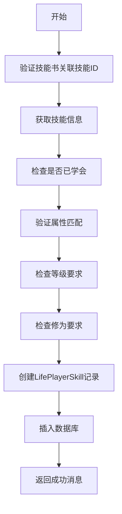
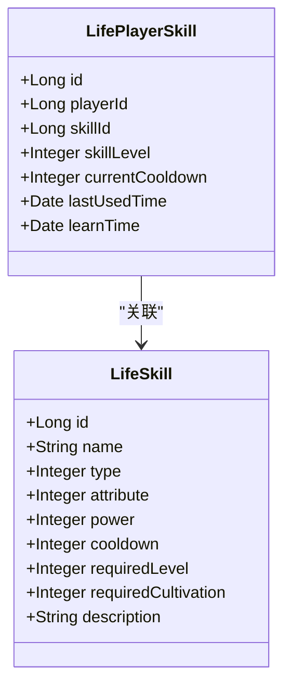
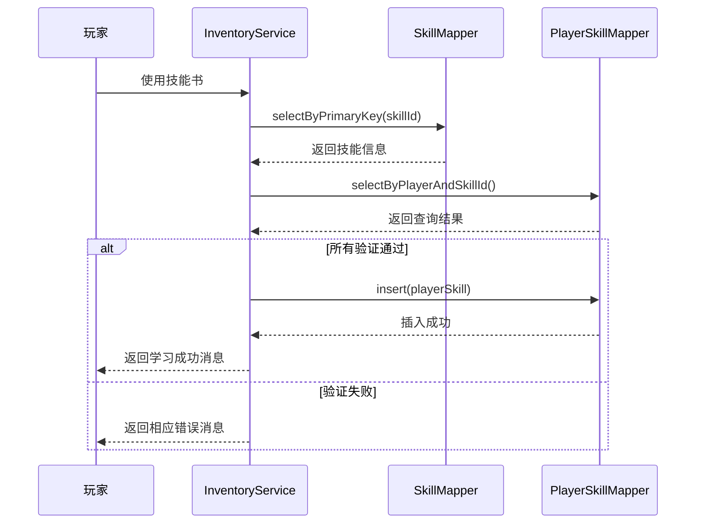
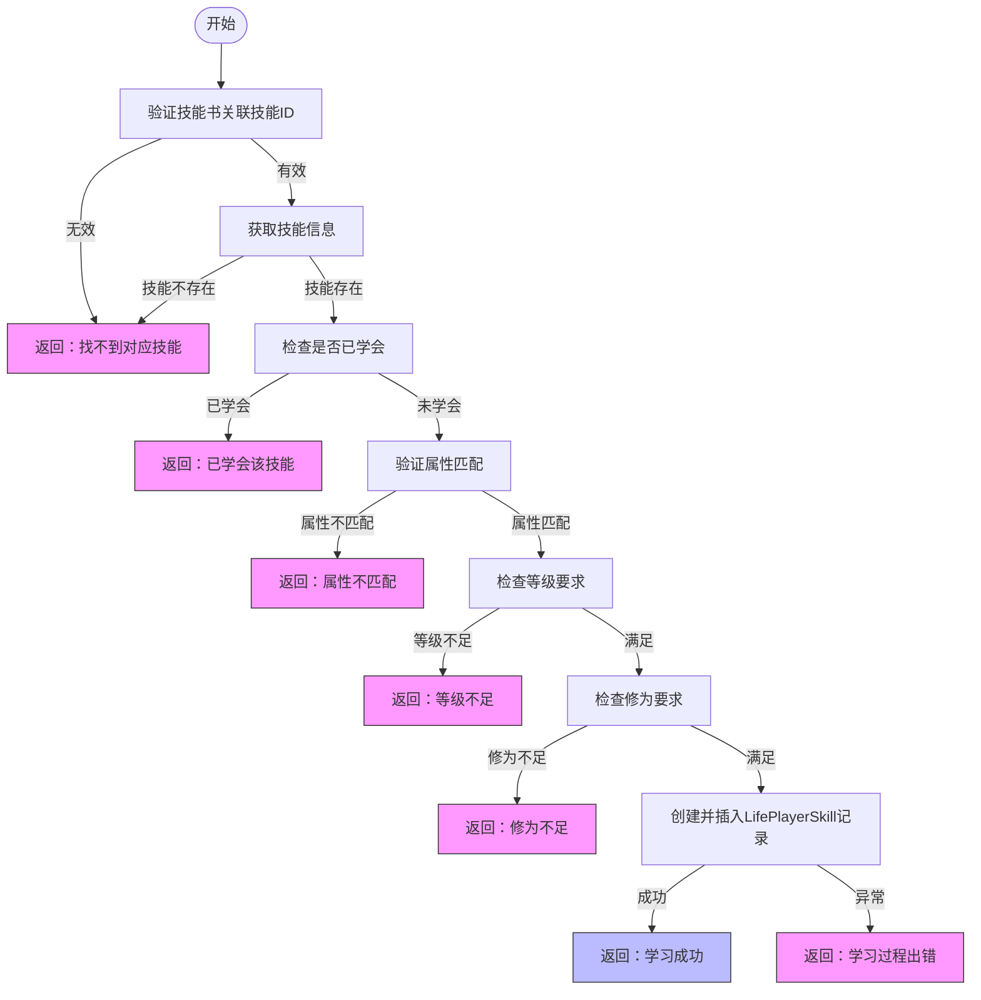

# 技能书学习机制

<cite>
**本文档引用文件**  
- [InventoryServiceImpl.java](file://Life\src\main\java\com\bot\life\service\impl\InventoryServiceImpl.java)
- [LifeSkill.java](file://Life\src\main\java\com\bot\life\dao\entity\LifeSkill.java)
- [LifePlayerSkill.java](file://Life\src\main\java\com\bot\life\dao\entity\LifePlayerSkill.java)
- [LifeSkillMapper.java](file://Life\src\main\java\com\bot\life\dao\mapper\LifeSkillMapper.java)
- [LifePlayerSkillMapper.java](file://Life\src\main\java\com\bot\life\dao\mapper\LifePlayerSkillMapper.java)
- [ENAttribute.java](file://Life\src\main\java\com\bot\life\enums\ENAttribute.java)
- [ENSkillType.java](file://Life\src\main\java\com\bot\life\enums\ENSkillType.java)
- [LifeSkillMapper.xml](file://Life\src\main\resources\mapper\LifeSkillMapper.xml)
- [LifePlayerSkillMapper.xml](file://Life\src\main\resources\mapper\LifePlayerSkillMapper.xml)
</cite>

## 目录
1. [技能书学习机制概述](#技能书学习机制概述)
2. [核心执行流程](#核心执行流程)
3. [前置条件验证](#前置条件验证)
4. [数据持久化过程](#数据持久化过程)
5. [异常处理与返回消息](#异常处理与返回消息)
6. [与玩家技能系统的集成关系](#与玩家技能系统的集成关系)
7. [流程图示](#流程图示)

## 技能书学习机制概述

技能书学习机制是游戏系统中玩家获取新技能的核心途径。当玩家使用背包中的技能书道具时，系统会调用`learnSkillFromBook`方法执行完整的技能学习流程。该机制通过严格的验证流程确保玩家满足学习条件，并在成功后将技能记录持久化到数据库中。

**本节来源**  
- [InventoryServiceImpl.java](file://Life\src\main\java\com\bot\life\service\impl\InventoryServiceImpl.java#L269-L324)

## 核心执行流程

技能书学习的完整执行流程始于玩家使用技能书道具，触发`useItem`方法，最终调用`learnSkillFromBook`私有方法。该方法实现了从验证到数据存储的完整逻辑链。

**流程图来源**  
- [InventoryServiceImpl.java](file://Life\src\main\java\com\bot\life\service\impl\InventoryServiceImpl.java#L270-L324)

## 前置条件验证

### 验证技能书关联技能ID
系统首先检查技能书道具是否关联了有效的技能ID。若技能书的`skillId`字段为空，则返回相应错误消息。

### 获取技能信息
通过`LifeSkillMapper.selectByPrimaryKey`方法根据技能ID查询技能基础信息。若查询结果为空，说明技能不存在。

### 检查是否已学会该技能
调用`playerSkillMapper.selectByPlayerAndSkillId`检查玩家是否已拥有该技能，防止重复学习。

### 验证属性匹配
系统实现属性克制机制，玩家只能学习与其自身属性相同或无属性的技能。属性匹配规则如下：
- 玩家属性与技能属性相同
- 技能为无属性（attribute=0）

### 检查等级和修为要求
验证玩家当前等级和修为是否满足技能的学习条件，确保玩家达到相应成长阶段。

**本节来源**  
- [InventoryServiceImpl.java](file://Life\src\main\java\com\bot\life\service\impl\InventoryServiceImpl.java#L271-L305)
- [ENAttribute.java](file://Life\src\main\java\com\bot\life\enums\ENAttribute.java#L7-L64)

## 数据持久化过程

当所有前置条件验证通过后，系统执行数据持久化操作：

1. 创建`LifePlayerSkill`实体对象
2. 设置玩家ID、技能ID、技能等级（初始为1级）
3. 初始化冷却时间为0，记录学习时间
4. 调用`playerSkillMapper.insert`方法将记录插入`life_player_skill`表

**类图来源**  
- [LifePlayerSkill.java](file://Life\src\main\java\com\bot\life\dao\entity\LifePlayerSkill.java#L12-L23)
- [LifeSkill.java](file://Life\src\main\java\com\bot\life\dao\entity\LifeSkill.java#L12-L23)
- [LifePlayerSkillMapper.xml](file://Life\src\main\resources\mapper\LifePlayerSkillMapper.xml#L81-L86)

## 异常处理与返回消息

### 验证失败返回消息示例
- 『学习失败！』\n\n这本技能书没有关联技能！
- 『学习失败！』\n\n找不到对应的技能！
- 『学习失败！』\n\n你已经学会了『%s』，无法重复学习！
- 『学习失败！』\n\n你是『%s』属性，无法学习『%s』属性的技能『%s』！
- 『学习失败！』\n\n学习『%s』需要%d级，当前等级：%d
- 『学习失败！』\n\n学习『%s』需要%d修为，当前修为：%d

### 异常处理机制
方法使用try-catch块捕获所有异常，当数据库插入操作出现错误时，返回通用错误消息并打印堆栈跟踪。

**本节来源**  
- [InventoryServiceImpl.java](file://Life\src\main\java\com\bot\life\service\impl\InventoryServiceImpl.java#L307-L323)

## 与玩家技能系统的集成关系

技能书学习机制与玩家技能系统紧密集成，主要体现在：

1. **服务接口集成**：`SkillService`接口定义了`learnSkill`方法，与`InventoryService`协同工作
2. **数据模型关联**：`LifePlayerSkill`实体通过外键关联`LifeSkill`基础数据
3. **业务逻辑联动**：学习成功后，玩家可在技能界面查看和使用新技能
4. **状态管理**：技能的冷却时间、等级等状态由`LifePlayerSkill`记录管理

**序列图来源**  
- [InventoryServiceImpl.java](file://Life\src\main\java\com\bot\life\service\impl\InventoryServiceImpl.java#L270-L324)
- [LifeSkillMapper.java](file://Life\src\main\java\com\bot\life\dao\mapper\LifeSkillMapper.java#L26-L27)
- [LifePlayerSkillMapper.java](file://Life\src\main\java\com\bot\life\dao\mapper\LifePlayerSkillMapper.java#L41-L42)

## 流程图示

**流程图来源**  
- [InventoryServiceImpl.java](file://Life\src\main\java\com\bot\life\service\impl\InventoryServiceImpl.java#L270-L324)